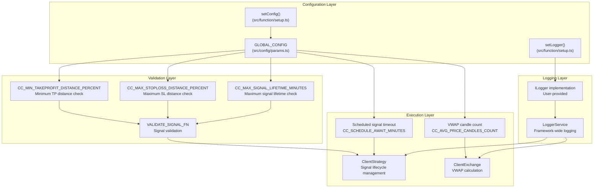
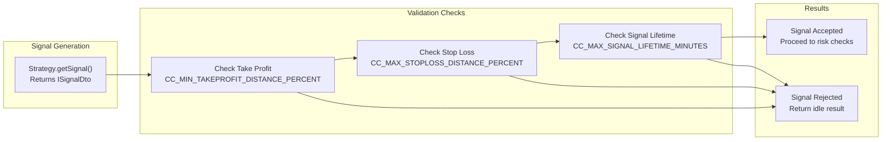
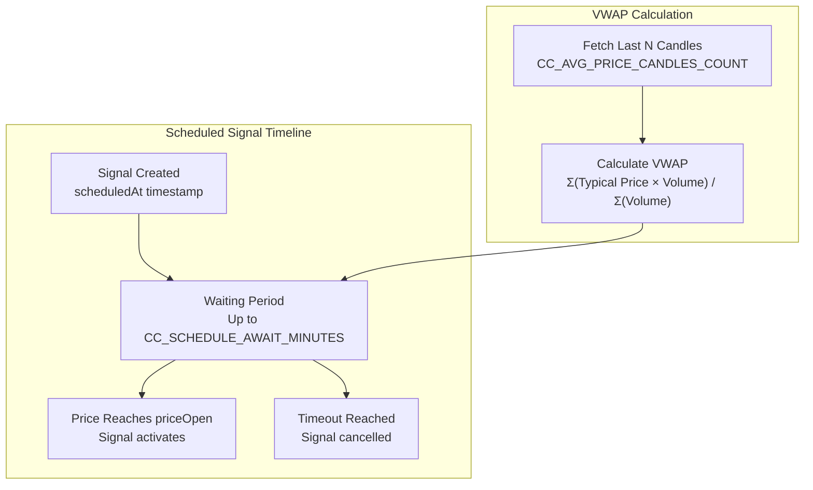

# Configuration

This document describes the global configuration system for `backtest-kit`, including runtime parameter modification, validation constraints, and timing controls. The framework uses a mutable `GLOBAL_CONFIG` object that can be customized via `setConfig()` and `setLogger()` functions to control signal validation, monitoring behavior, and execution timing.

For component-specific schemas, see [Component Types](#5). For execution mode differences, see [Execution Modes](#2.1).

---

## Configuration Architecture

The configuration system operates as a global singleton that affects all framework operations. Parameters control safety checks, timing behavior, and monitoring thresholds throughout the signal lifecycle.



**Sources:** [src/config/params.ts:1-36](), [types.d.ts:5-97]()

---

## Global Configuration Object

The `GLOBAL_CONFIG` object contains five parameters that control framework behavior. All parameters can be modified at runtime using `setConfig()`.

| Parameter | Default Value | Type | Purpose |
|-----------|---------------|------|---------|
| `CC_SCHEDULE_AWAIT_MINUTES` | 120 | `number` | Maximum time (minutes) to wait for scheduled signal activation before cancellation |
| `CC_AVG_PRICE_CANDLES_COUNT` | 5 | `number` | Number of 1-minute candles used for VWAP calculation |
| `CC_MIN_TAKEPROFIT_DISTANCE_PERCENT` | 0.1 | `number` | Minimum Take Profit distance from `priceOpen` as percentage |
| `CC_MAX_STOPLOSS_DISTANCE_PERCENT` | 20 | `number` | Maximum Stop Loss distance from `priceOpen` as percentage |
| `CC_MAX_SIGNAL_LIFETIME_MINUTES` | 1440 | `number` | Maximum signal lifetime in minutes (default: 1 day) |

**Sources:** [src/config/params.ts:1-30](), [types.d.ts:5-34]()

---

## Configuration Functions

### setConfig Function

Modifies global configuration parameters at runtime. Accepts partial configuration object, allowing selective parameter overrides without affecting other values.

```typescript
function setConfig(config: Partial<GlobalConfig>): Promise<void>
```

**Type Definition:**
```typescript
type GlobalConfig = {
  CC_SCHEDULE_AWAIT_MINUTES: number;
  CC_AVG_PRICE_CANDLES_COUNT: number;
  CC_MIN_TAKEPROFIT_DISTANCE_PERCENT: number;
  CC_MAX_STOPLOSS_DISTANCE_PERCENT: number;
  CC_MAX_SIGNAL_LIFETIME_MINUTES: number;
}
```

**Example Usage:**
```typescript
import { setConfig } from "backtest-kit";

// Override specific parameters
await setConfig({
  CC_SCHEDULE_AWAIT_MINUTES: 90,
  CC_MIN_TAKEPROFIT_DISTANCE_PERCENT: 0.3,
});

// All other parameters retain default values
```

**Sources:** [types.d.ts:86-97](), [src/index.ts:1]()

---

### setLogger Function

Registers custom logger implementation for framework-wide logging. All internal services forward log messages to the provided logger with automatic context injection (strategy name, exchange name, symbol, etc.).

```typescript
function setLogger(logger: ILogger): Promise<void>

interface ILogger {
  log(topic: string, ...args: any[]): void;
  debug(topic: string, ...args: any[]): void;
  info(topic: string, ...args: any[]): void;
  warn(topic: string, ...args: any[]): void;
}
```

**Example Usage:**
```typescript
import { setLogger } from "backtest-kit";

// Use console as logger
await setLogger(console);

// Custom logger with filtering
await setLogger({
  log: (topic, ...args) => console.log(`[LOG] ${topic}:`, ...args),
  debug: (topic, ...args) => {}, // Disable debug
  info: (topic, ...args) => console.info(`[INFO] ${topic}:`, ...args),
  warn: (topic, ...args) => console.warn(`[WARN] ${topic}:`, ...args),
});
```

**Sources:** [types.d.ts:45-85](), [test/config/setup.mjs:4]()

---

## Validation Parameters

Validation parameters enforce financial safety constraints during signal generation. These checks prevent signals with impossible or dangerous price configurations from being executed.



**Sources:** [test/e2e/sanitize.test.mjs:16-660](), [test/e2e/defend.test.mjs:540-845]()

---

### CC_MIN_TAKEPROFIT_DISTANCE_PERCENT

**Default:** `0.1` (0.1%)  
**Purpose:** Prevents micro-profit signals where trading fees exceed potential profit.

**Validation Logic:**
- **LONG positions:** `priceTakeProfit` must be at least `CC_MIN_TAKEPROFIT_DISTANCE_PERCENT`% above `priceOpen`
- **SHORT positions:** `priceTakeProfit` must be at least `CC_MIN_TAKEPROFIT_DISTANCE_PERCENT`% below `priceOpen`

**Why This Matters:**
Trading involves two fees (entry + exit), plus slippage. The default configuration assumes:
- Entry fee: 0.1%
- Exit fee: 0.1%
- Total fees: 0.2%

If `priceTakeProfit` is too close to `priceOpen`, the signal closes at a net loss after fees.

**Example:**
```typescript
// DANGEROUS: TP distance = 0.024% (less than fees)
{
  position: "long",
  priceOpen: 42000,
  priceTakeProfit: 42010, // Only 0.024% profit
  priceStopLoss: 41000,
}
// Net PNL: 0.024% - 0.2% = -0.176% (LOSS!)

// SAFE: TP distance = 0.5% (covers fees + profit)
{
  position: "long",
  priceOpen: 42000,
  priceTakeProfit: 42210, // 0.5% profit
  priceStopLoss: 41000,
}
// Net PNL: 0.5% - 0.2% = 0.3% (PROFIT!)
```

**Configuration Example:**
```typescript
// Increase minimum TP distance to 0.3% for conservative strategies
await setConfig({
  CC_MIN_TAKEPROFIT_DISTANCE_PERCENT: 0.3,
});
```

**Sources:** [src/config/params.ts:12-17](), [test/e2e/sanitize.test.mjs:16-131]()

---

### CC_MAX_STOPLOSS_DISTANCE_PERCENT

**Default:** `20` (20%)  
**Purpose:** Prevents catastrophic losses from extreme Stop Loss values.

**Validation Logic:**
- **LONG positions:** `priceStopLoss` must be within `CC_MAX_STOPLOSS_DISTANCE_PERCENT`% below `priceOpen`
- **SHORT positions:** `priceStopLoss` must be within `CC_MAX_STOPLOSS_DISTANCE_PERCENT`% above `priceOpen`

**Why This Matters:**
Without this limit, a single signal could lose >50% of position value, potentially wiping out weeks of profitable trades.

**Example:**
```typescript
// DANGEROUS: SL distance = 52.4% (catastrophic risk)
{
  position: "long",
  priceOpen: 42000,
  priceTakeProfit: 43000,
  priceStopLoss: 20000, // -52.4% loss!
}
// One flash crash = account destroyed

// SAFE: SL distance = 5% (controlled risk)
{
  position: "long",
  priceOpen: 42000,
  priceTakeProfit: 43000,
  priceStopLoss: 39900, // -5% loss
}
// Maximum loss per signal is predictable
```

**Configuration Example:**
```typescript
// Reduce maximum SL distance to 10% for risk-averse strategies
await setConfig({
  CC_MAX_STOPLOSS_DISTANCE_PERCENT: 10,
});
```

**Sources:** [src/config/params.ts:18-23](), [test/e2e/sanitize.test.mjs:132-238]()

---

### CC_MAX_SIGNAL_LIFETIME_MINUTES

**Default:** `1440` (1 day)  
**Purpose:** Prevents eternal signals that block risk limits indefinitely.

**Validation Logic:**
- `minuteEstimatedTime` must not exceed `CC_MAX_SIGNAL_LIFETIME_MINUTES`

**Why This Matters:**
Signals with excessive lifetime block risk limit slots, preventing new trades for days/weeks. If `maxConcurrentPositions = 3` and one signal has `minuteEstimatedTime = 50000` (34+ days), only 2 positions remain available for trading.

**Example:**
```typescript
// DANGEROUS: Signal lifetime = 34+ days
{
  position: "long",
  priceOpen: 42000,
  priceTakeProfit: 43000,
  priceStopLoss: 41000,
  minuteEstimatedTime: 50000, // Blocks risk slot for a month!
}

// SAFE: Signal lifetime = 6 hours
{
  position: "long",
  priceOpen: 42000,
  priceTakeProfit: 43000,
  priceStopLoss: 41000,
  minuteEstimatedTime: 360, // Risk slot released after 6h
}
```

**Configuration Example:**
```typescript
// Allow longer signals for swing trading strategies
await setConfig({
  CC_MAX_SIGNAL_LIFETIME_MINUTES: 10080, // 7 days
});
```

**Sources:** [src/config/params.ts:24-29](), [test/e2e/sanitize.test.mjs:239-348]()

---

## Timing Parameters

Timing parameters control execution behavior for scheduled signals, VWAP calculation, and monitoring intervals.



**Sources:** [src/config/params.ts:1-30]()

---

### CC_SCHEDULE_AWAIT_MINUTES

**Default:** `120` (2 hours)  
**Purpose:** Maximum time to wait for scheduled signal activation before automatic cancellation.

**Behavior:**
When a signal specifies `priceOpen`, it becomes a scheduled signal that waits for price to reach the entry point. If price does not reach `priceOpen` within `CC_SCHEDULE_AWAIT_MINUTES`, the signal is cancelled with action `"cancelled"`.

**Time Calculation:**
```typescript
const elapsedTime = (currentTimestamp - signal.scheduledAt) / (60 * 1000);
const maxTimeToWait = GLOBAL_CONFIG.CC_SCHEDULE_AWAIT_MINUTES;

if (elapsedTime >= maxTimeToWait) {
  // Cancel signal - timeout reached
}
```

**Example:**
```typescript
// Signal waits 120 minutes for price to reach 41000
const signal = {
  position: "long",
  priceOpen: 41000, // Entry price
  priceTakeProfit: 42000,
  priceStopLoss: 40000,
  minuteEstimatedTime: 60,
};

// If price stays above 41000 for 2 hours, signal is cancelled
// If price reaches 41000 within 2 hours, signal activates
```

**Configuration Example:**
```typescript
// Reduce timeout to 90 minutes for aggressive strategies
await setConfig({
  CC_SCHEDULE_AWAIT_MINUTES: 90,
});
```

**Sources:** [src/config/params.ts:2-6](), [test/e2e/defend.test.mjs:444-536]()

---

### CC_AVG_PRICE_CANDLES_COUNT

**Default:** `5` (5 candles)  
**Purpose:** Number of 1-minute candles used for VWAP (Volume-Weighted Average Price) calculation.

**VWAP Formula:**
```
Typical Price = (High + Low + Close) / 3
VWAP = Σ(Typical Price × Volume) / Σ(Volume)
```

**Behavior:**
- Fetches last `CC_AVG_PRICE_CANDLES_COUNT` 1-minute candles
- Calculates VWAP from these candles
- Used for TP/SL monitoring and signal generation

**Example:**
```typescript
// With CC_AVG_PRICE_CANDLES_COUNT = 5:
// Fetches last 5 minutes of 1m candles
// Calculates VWAP from these 5 data points

// Increase for smoother price action
await setConfig({
  CC_AVG_PRICE_CANDLES_COUNT: 10, // Use 10-minute VWAP
});
```

**When VWAP is Used:**
- `Live.run()`: Real-time price monitoring for TP/SL checks
- `getAveragePrice()`: Public API function for current price
- Signal generation: Strategy decision-making based on current price

**Configuration Example:**
```typescript
// Use 10 candles for more stable VWAP in volatile markets
await setConfig({
  CC_AVG_PRICE_CANDLES_COUNT: 10,
});
```

**Sources:** [src/config/params.ts:7-11](), [types.d.ts:12-15]()

---

## Configuration in Testing

Test environments often require different configuration values. The test setup demonstrates how to disable validation for backwards compatibility or customize timing for specific test scenarios.

**Test Setup Example:**
```typescript
// test/config/setup.mjs
import { setConfig } from "backtest-kit";

// Disable validation for legacy tests
setConfig({
  CC_MIN_TAKEPROFIT_DISTANCE_PERCENT: 0,    // Allow any TP distance
  CC_MAX_STOPLOSS_DISTANCE_PERCENT: 100,    // Allow any SL distance
  CC_MAX_SIGNAL_LIFETIME_MINUTES: 999999,   // Allow any lifetime
});
```

**Per-Test Configuration:**
```typescript
// Enable validation for specific test
test("SANITIZE: Micro-profit rejected", async ({ pass, fail }) => {
  // Override just for this test
  setConfig({
    CC_MIN_TAKEPROFIT_DISTANCE_PERCENT: 0.3,
  });
  
  // Run test with validation enabled
  // ...
});
```

**Sources:** [test/config/setup.mjs:36-41](), [test/e2e/sanitize.test.mjs:29-31]()

---

## Configuration Impact Summary

The following table shows which framework components are affected by each configuration parameter:

| Parameter | Affects Components | Impact |
|-----------|-------------------|--------|
| `CC_SCHEDULE_AWAIT_MINUTES` | ClientStrategy scheduled signal monitoring | Determines timeout for scheduled signals |
| `CC_AVG_PRICE_CANDLES_COUNT` | ClientExchange VWAP calculation | Controls price smoothing for monitoring |
| `CC_MIN_TAKEPROFIT_DISTANCE_PERCENT` | Signal validation (VALIDATE_SIGNAL_FN) | Rejects signals with insufficient profit potential |
| `CC_MAX_STOPLOSS_DISTANCE_PERCENT` | Signal validation (VALIDATE_SIGNAL_FN) | Rejects signals with excessive risk |
| `CC_MAX_SIGNAL_LIFETIME_MINUTES` | Signal validation (VALIDATE_SIGNAL_FN) | Rejects signals with excessive lifetime |

**Sources:** [src/config/params.ts:1-30](), [types.d.ts:5-34]()

---

## Best Practices

### Production Configuration

```typescript
import { setConfig, setLogger } from "backtest-kit";

// Enable comprehensive validation
await setConfig({
  CC_MIN_TAKEPROFIT_DISTANCE_PERCENT: 0.3,  // Cover fees + profit
  CC_MAX_STOPLOSS_DISTANCE_PERCENT: 10,     // Limit risk per signal
  CC_MAX_SIGNAL_LIFETIME_MINUTES: 1440,     // Max 1 day per signal
  CC_SCHEDULE_AWAIT_MINUTES: 120,           // 2-hour timeout
  CC_AVG_PRICE_CANDLES_COUNT: 5,            // 5-minute VWAP
});

// Enable structured logging
await setLogger({
  log: (topic, ...args) => logger.info({ topic, args }),
  debug: (topic, ...args) => logger.debug({ topic, args }),
  info: (topic, ...args) => logger.info({ topic, args }),
  warn: (topic, ...args) => logger.warn({ topic, args }),
});
```

### Development Configuration

```typescript
// Disable validation for rapid testing
await setConfig({
  CC_MIN_TAKEPROFIT_DISTANCE_PERCENT: 0,
  CC_MAX_STOPLOSS_DISTANCE_PERCENT: 100,
  CC_MAX_SIGNAL_LIFETIME_MINUTES: 999999,
});

// Simple console logging
await setLogger(console);
```

### Strategy-Specific Configuration

```typescript
// Scalping strategy: tight TP, short lifetime
await setConfig({
  CC_MIN_TAKEPROFIT_DISTANCE_PERCENT: 0.2,
  CC_MAX_SIGNAL_LIFETIME_MINUTES: 60,
});

// Swing trading: wider SL, longer lifetime
await setConfig({
  CC_MAX_STOPLOSS_DISTANCE_PERCENT: 15,
  CC_MAX_SIGNAL_LIFETIME_MINUTES: 10080, // 7 days
});
```

**Sources:** [test/config/setup.mjs:36-41](), [test/e2e/sanitize.test.mjs:26-131]()