# Statistics Calculation

## Purpose and Scope

This page explains how trading performance statistics are calculated from closed signals in the backtest-kit framework. It covers the mathematical formulas, implementation details, and safe math handling for all metrics exposed through the reporting system.

For information about generating markdown reports from these statistics, see [Markdown Report Generation](./72_Markdown_Report_Generation.md). For tracking partial profit/loss milestones during signal execution, see [Partial Profit/Loss Tracking](./75_Partial_Profit_Loss_Tracking.md). For portfolio-level aggregation across multiple symbols, see [Heatmap Analytics](./76_Heatmap_Analytics.md).

**Scope:** This page covers only the calculation logic for statistics. It does not cover event collection, report formatting, or storage mechanisms.

---

## Statistics Types Overview

The framework calculates statistics at three levels:

| Level | Interface | Service | Use Case |
|-------|-----------|---------|----------|
| **Signal-level** | `BacktestStatistics`, `LiveStatistics` | `BacktestMarkdownService`, `LiveMarkdownService` | Individual strategy performance |
| **Portfolio-level** | `IHeatmapStatistics`, `IHeatmapRow` | `HeatMarkdownService` | Multi-symbol aggregation |
| **Comparison** | `WalkerStatistics` | `WalkerMarkdownService` | Strategy ranking |
| **Partial** | `PartialStatistics` | `PartialMarkdownService` | Milestone tracking |
| **Performance** | `PerformanceStatistics` | `PerformanceMarkdownService` | Timing analysis |

**Statistics Calculation Flow**



**Sources:** [src/lib/services/markdown/BacktestMarkdownService.ts:1-571](), [src/lib/services/markdown/LiveMarkdownService.ts:1-778](), [src/lib/services/markdown/HeatMarkdownService.ts:1-625]()

---

## Core Metrics

### Win Rate

**Formula:**
```
winRate = (winCount / totalSignals) × 100
```

Where:
- `winCount`: Number of signals with `pnlPercentage > 0`
- `totalSignals`: Total number of closed signals
- Result: Percentage (0-100)

**Implementation:**

The win rate is calculated by filtering closed signals and counting wins:

[src/lib/services/markdown/BacktestMarkdownService.ts:246-252]()

```typescript
const winCount = this._signalList.filter((s) => s.pnl.pnlPercentage > 0).length;
const lossCount = this._signalList.filter((s) => s.pnl.pnlPercentage < 0).length;
const winRate = (winCount / totalSignals) * 100;
```

**Safe Math:** Returns `null` if `isUnsafe(winRate)` evaluates to `true` [src/lib/services/markdown/BacktestMarkdownService.ts:286]().

**Sources:** [src/lib/services/markdown/BacktestMarkdownService.ts:245-252](), [src/lib/services/markdown/LiveMarkdownService.ts:430-439]()

---

### Average PNL

**Formula:**
```
avgPnl = Σ(pnlPercentage) / totalSignals
```

Where:
- `pnlPercentage`: Net profit/loss percentage for each closed signal (includes fees and slippage)
- `totalSignals`: Total number of closed signals
- Result: Average percentage per trade

**Implementation:**

[src/lib/services/markdown/BacktestMarkdownService.ts:250]()

```typescript
const avgPnl = this._signalList.reduce((sum, s) => sum + s.pnl.pnlPercentage, 0) / totalSignals;
```

**Sources:** [src/lib/services/markdown/BacktestMarkdownService.ts:250](), [src/lib/services/markdown/LiveMarkdownService.ts:434-436]()

---

### Total PNL

**Formula:**
```
totalPnl = Σ(pnlPercentage)
```

Where:
- `pnlPercentage`: Net profit/loss percentage for each closed signal
- Result: Cumulative percentage across all trades

**Implementation:**

[src/lib/services/markdown/BacktestMarkdownService.ts:251]()

```typescript
const totalPnl = this._signalList.reduce((sum, s) => sum + s.pnl.pnlPercentage, 0);
```

**Sources:** [src/lib/services/markdown/BacktestMarkdownService.ts:251](), [src/lib/services/markdown/LiveMarkdownService.ts:437]()

---

### Standard Deviation

**Formula:**
```
variance = Σ((pnlᵢ - avgPnl)²) / n
stdDev = √variance
```

Where:
- `pnlᵢ`: PNL percentage of signal `i`
- `avgPnl`: Average PNL across all signals
- `n`: Total number of signals
- Result: Volatility measure in percentage points

**Implementation:**

[src/lib/services/markdown/BacktestMarkdownService.ts:255-257]()

```typescript
const returns = this._signalList.map((s) => s.pnl.pnlPercentage);
const variance = returns.reduce((sum, r) => sum + Math.pow(r - avgPnl, 2), 0) / totalSignals;
const stdDev = Math.sqrt(variance);
```

**Sources:** [src/lib/services/markdown/BacktestMarkdownService.ts:254-257](), [src/lib/services/markdown/LiveMarkdownService.ts:444-447]()

---

### Sharpe Ratio

**Formula:**
```
sharpeRatio = avgPnl / stdDev  (if stdDev > 0)
            = 0                 (if stdDev = 0)
```

Where:
- `avgPnl`: Average PNL percentage
- `stdDev`: Standard deviation of returns
- **Assumption:** Risk-free rate = 0%
- Result: Risk-adjusted return metric

**Interpretation:**
- **> 1.0**: Good risk-adjusted returns
- **> 2.0**: Excellent risk-adjusted returns
- **< 0**: Negative returns

**Implementation:**

[src/lib/services/markdown/BacktestMarkdownService.ts:258]()

```typescript
const sharpeRatio = stdDev > 0 ? avgPnl / stdDev : 0;
```

**Note:** The framework uses a simplified Sharpe Ratio calculation assuming zero risk-free rate. Traditional Sharpe Ratio formula:
```
sharpeRatio = (avgReturn - riskFreeRate) / stdDev
```

**Sources:** [src/lib/services/markdown/BacktestMarkdownService.ts:258](), [src/lib/services/markdown/LiveMarkdownService.ts:447]()

---

### Annualized Sharpe Ratio

**Formula:**
```
annualizedSharpeRatio = sharpeRatio × √365
```

Where:
- `sharpeRatio`: Non-annualized Sharpe Ratio
- `365`: Days per year (annualization factor)
- Result: Annualized risk-adjusted return metric

**Rationale:** Multiplying by √365 scales the Sharpe Ratio from the strategy's timeframe to an annual basis.

**Implementation:**

[src/lib/services/markdown/BacktestMarkdownService.ts:259]()

```typescript
const annualizedSharpeRatio = sharpeRatio * Math.sqrt(365);
```

**Sources:** [src/lib/services/markdown/BacktestMarkdownService.ts:259](), [src/lib/services/markdown/LiveMarkdownService.ts:449]()

---

### Certainty Ratio

**Formula:**
```
avgWin = Σ(pnl where pnl > 0) / winCount
avgLoss = Σ(pnl where pnl < 0) / lossCount
certaintyRatio = avgWin / |avgLoss|  (if avgLoss < 0)
               = 0                   (otherwise)
```

Where:
- `avgWin`: Average profit on winning trades
- `avgLoss`: Average loss on losing trades (negative value)
- Result: Win/loss ratio metric

**Interpretation:**
- **> 1.0**: Average wins are larger than average losses
- **= 1.0**: Average wins equal average losses
- **< 1.0**: Average wins are smaller than average losses

**Implementation:**

[src/lib/services/markdown/BacktestMarkdownService.ts:262-270]()

```typescript
const wins = this._signalList.filter((s) => s.pnl.pnlPercentage > 0);
const losses = this._signalList.filter((s) => s.pnl.pnlPercentage < 0);
const avgWin = wins.length > 0
  ? wins.reduce((sum, s) => sum + s.pnl.pnlPercentage, 0) / wins.length
  : 0;
const avgLoss = losses.length > 0
  ? losses.reduce((sum, s) => sum + s.pnl.pnlPercentage, 0) / losses.length
  : 0;
const certaintyRatio = avgLoss < 0 ? avgWin / Math.abs(avgLoss) : 0;
```

**Sources:** [src/lib/services/markdown/BacktestMarkdownService.ts:262-270](), [src/lib/services/markdown/LiveMarkdownService.ts:451-462]()

---

### Expected Yearly Returns

**Formula:**
```
avgDurationMs = Σ(closeTimestamp - pendingAt) / totalSignals
avgDurationDays = avgDurationMs / (1000 × 60 × 60 × 24)
tradesPerYear = 365 / avgDurationDays  (if avgDurationDays > 0)
              = 0                      (otherwise)
expectedYearlyReturns = avgPnl × tradesPerYear
```

Where:
- `avgDurationMs`: Average trade duration in milliseconds
- `avgDurationDays`: Average trade duration in days
- `tradesPerYear`: Estimated number of trades per year
- `avgPnl`: Average PNL per trade
- Result: Projected annual returns as percentage

**Assumptions:**
- Trade frequency remains constant
- Market conditions remain similar
- Strategy continues to generate signals at the same rate

**Implementation:**

[src/lib/services/markdown/BacktestMarkdownService.ts:273-279]()

```typescript
const avgDurationMs = this._signalList.reduce(
  (sum, s) => sum + (s.closeTimestamp - s.signal.pendingAt),
  0
) / totalSignals;
const avgDurationDays = avgDurationMs / (1000 * 60 * 60 * 24);
const tradesPerYear = avgDurationDays > 0 ? 365 / avgDurationDays : 0;
const expectedYearlyReturns = avgPnl * tradesPerYear;
```

**Sources:** [src/lib/services/markdown/BacktestMarkdownService.ts:273-279](), [src/lib/services/markdown/LiveMarkdownService.ts:466-475]()

---

## Portfolio Metrics

The following metrics are calculated only in `HeatMarkdownService` for portfolio-level analysis across multiple symbols.

### Profit Factor

**Formula:**
```
sumWins = Σ(pnl where pnl > 0)
sumLosses = |Σ(pnl where pnl < 0)|
profitFactor = sumWins / sumLosses  (if sumLosses > 0)
             = null                  (otherwise)
```

Where:
- `sumWins`: Total profit from winning trades
- `sumLosses`: Absolute value of total loss from losing trades
- Result: Gross wins to gross losses ratio

**Interpretation:**
- **> 1.0**: Strategy is profitable
- **= 1.0**: Break-even
- **< 1.0**: Strategy is losing money
- **> 2.0**: Strong profitability

**Implementation:**

[src/lib/services/markdown/HeatMarkdownService.ts:246-259]()

```typescript
let profitFactor: number | null = null;
if (winCount > 0 && lossCount > 0) {
  const sumWins = signals
    .filter((s) => s.pnl.pnlPercentage > 0)
    .reduce((acc, s) => acc + s.pnl.pnlPercentage, 0);
  const sumLosses = Math.abs(
    signals
      .filter((s) => s.pnl.pnlPercentage < 0)
      .reduce((acc, s) => acc + s.pnl.pnlPercentage, 0)
  );
  if (sumLosses > 0) {
    profitFactor = sumWins / sumLosses;
  }
}
```

**Sources:** [src/lib/services/markdown/HeatMarkdownService.ts:246-259]()

---

### Expectancy

**Formula:**
```
expectancy = (winRate / 100) × avgWin + (lossRate / 100) × avgLoss
```

Where:
- `winRate`: Win rate percentage
- `lossRate`: Loss rate percentage (100 - winRate)
- `avgWin`: Average profit on winning trades
- `avgLoss`: Average loss on losing trades (negative value)
- Result: Expected value per trade

**Interpretation:**
- **> 0**: Positive expectancy (profitable over time)
- **= 0**: Zero expectancy (break-even)
- **< 0**: Negative expectancy (losing over time)

**Implementation:**

[src/lib/services/markdown/HeatMarkdownService.ts:300-304]()

```typescript
let expectancy: number | null = null;
if (winRate !== null && avgWin !== null && avgLoss !== null) {
  const lossRate = 100 - winRate;
  expectancy = (winRate / 100) * avgWin + (lossRate / 100) * avgLoss;
}
```

**Sources:** [src/lib/services/markdown/HeatMarkdownService.ts:300-304]()

---

### Maximum Drawdown

**Formula:**
```
For each signal i:
  cumulativePnl[i] = cumulativePnl[i-1] + pnl[i]
  peak[i] = max(peak[i-1], cumulativePnl[i])
  drawdown[i] = peak[i] - cumulativePnl[i]
maxDrawdown = max(drawdown[i] for all i)
```

Where:
- `cumulativePnl`: Running sum of PNL
- `peak`: Highest cumulative PNL reached
- `drawdown`: Distance from peak to current value
- Result: Maximum drawdown as positive percentage

**Implementation:**

[src/lib/services/markdown/HeatMarkdownService.ts:224-243]()

```typescript
let maxDrawdown: number | null = null;
if (signals.length > 0) {
  let peak = 0;
  let currentDrawdown = 0;
  let maxDD = 0;

  for (const signal of signals) {
    peak += signal.pnl.pnlPercentage;
    if (peak > 0) {
      currentDrawdown = 0;
    } else {
      currentDrawdown = Math.abs(peak);
      if (currentDrawdown > maxDD) {
        maxDD = currentDrawdown;
      }
    }
  }

  maxDrawdown = maxDD;
}
```

**Sources:** [src/lib/services/markdown/HeatMarkdownService.ts:224-243]()

---

### Win/Loss Streaks

**Formula:**
```
currentWinStreak = 0
currentLossStreak = 0
maxWinStreak = 0
maxLossStreak = 0

For each signal:
  if pnl > 0:
    currentWinStreak++
    currentLossStreak = 0
    maxWinStreak = max(maxWinStreak, currentWinStreak)
  else if pnl < 0:
    currentLossStreak++
    currentWinStreak = 0
    maxLossStreak = max(maxLossStreak, currentLossStreak)
```

Where:
- `currentWinStreak`: Consecutive wins counter
- `currentLossStreak`: Consecutive losses counter
- Result: Maximum consecutive wins/losses observed

**Implementation:**

[src/lib/services/markdown/HeatMarkdownService.ts:278-297]()

```typescript
let maxWinStreak = 0;
let maxLossStreak = 0;
let currentWinStreak = 0;
let currentLossStreak = 0;

for (const signal of signals) {
  if (signal.pnl.pnlPercentage > 0) {
    currentWinStreak++;
    currentLossStreak = 0;
    if (currentWinStreak > maxWinStreak) {
      maxWinStreak = currentWinStreak;
    }
  } else if (signal.pnl.pnlPercentage < 0) {
    currentLossStreak++;
    currentWinStreak = 0;
    if (currentLossStreak > maxLossStreak) {
      maxLossStreak = currentLossStreak;
    }
  }
}
```

**Sources:** [src/lib/services/markdown/HeatMarkdownService.ts:278-297]()

---

## Safe Math Implementation

All numeric statistics are validated using the `isUnsafe()` function to prevent display of invalid values.

**Safe Math Validation Logic**



**Implementation:**

[src/lib/services/markdown/BacktestMarkdownService.ts:37-48]()

```typescript
function isUnsafe(value: number | null): boolean {
  if (typeof value !== "number") {
    return true;
  }
  if (isNaN(value)) {
    return true;
  }
  if (!isFinite(value)) {
    return true;
  }
  return false;
}
```

**Application:**

[src/lib/services/markdown/BacktestMarkdownService.ts:286-293]()

```typescript
winRate: isUnsafe(winRate) ? null : winRate,
avgPnl: isUnsafe(avgPnl) ? null : avgPnl,
totalPnl: isUnsafe(totalPnl) ? null : totalPnl,
stdDev: isUnsafe(stdDev) ? null : stdDev,
sharpeRatio: isUnsafe(sharpeRatio) ? null : sharpeRatio,
annualizedSharpeRatio: isUnsafe(annualizedSharpeRatio) ? null : annualizedSharpeRatio,
certaintyRatio: isUnsafe(certaintyRatio) ? null : certaintyRatio,
expectedYearlyReturns: isUnsafe(expectedYearlyReturns) ? null : expectedYearlyReturns,
```

**Edge Cases Handled:**
- Division by zero (e.g., `avgPnl / stdDev` when `stdDev = 0`)
- Empty signal lists (returns default null values)
- Non-numeric types from calculation errors
- `NaN` from invalid mathematical operations
- `Infinity` or `-Infinity` from overflow

**Sources:** [src/lib/services/markdown/BacktestMarkdownService.ts:37-48](), [src/lib/services/markdown/LiveMarkdownService.ts:24-35](), [src/lib/services/markdown/HeatMarkdownService.ts:44-55]()

---

## Statistics by Execution Mode

Different execution modes calculate statistics with mode-specific nuances:

**Statistics Comparison Table**

| Metric | Backtest Mode | Live Mode | Portfolio (Heat) | Notes |
|--------|--------------|-----------|------------------|-------|
| **Win Rate** | Closed signals only | Closed signals only | Per-symbol aggregation | Identical calculation |
| **Avg PNL** | Closed signals only | Closed signals only | Per-symbol aggregation | Identical calculation |
| **Total PNL** | Cumulative sum | Cumulative sum | Portfolio sum | Identical calculation |
| **Sharpe Ratio** | Single value | Single value | Weighted by trade count | Portfolio uses weighted average |
| **Duration** | `closeTimestamp - pendingAt` | `closeTimestamp - pendingAt` | Per-symbol average | Same calculation |
| **Profit Factor** | ❌ Not calculated | ❌ Not calculated | ✅ Calculated | Heat-only metric |
| **Expectancy** | ❌ Not calculated | ❌ Not calculated | ✅ Calculated | Heat-only metric |
| **Max Drawdown** | ❌ Not calculated | ❌ Not calculated | ✅ Calculated | Heat-only metric |
| **Streaks** | ❌ Not calculated | ❌ Not calculated | ✅ Calculated | Heat-only metric |

**Backtest vs Live Statistics Interfaces**



**Key Differences:**

1. **Event Scope:**
   - Backtest: Only stores `closed` signals [src/lib/services/markdown/BacktestMarkdownService.ts:433-435]()
   - Live: Stores all event types (`idle`, `opened`, `active`, `closed`) [src/lib/services/markdown/LiveMarkdownService.ts:637-645]()

2. **Statistics Calculation:**
   - Both modes filter for closed signals before calculation
   - Backtest: `this._signalList` is already filtered [src/lib/services/markdown/BacktestMarkdownService.ts:245]()
   - Live: Filters `closedEvents = this._eventList.filter((e) => e.action === "closed")` [src/lib/services/markdown/LiveMarkdownService.ts:428]()

3. **Extended Metrics:**
   - Portfolio (Heat) calculates additional metrics not available in individual strategy statistics
   - Heat calculates weighted Sharpe Ratio across symbols [src/lib/services/markdown/HeatMarkdownService.ts:373-382]()

**Sources:** [src/lib/services/markdown/BacktestMarkdownService.ts:70-106](), [src/lib/services/markdown/LiveMarkdownService.ts:97-136](), [src/lib/services/markdown/HeatMarkdownService.ts:5-38]()

---

## Calculation Flow by Service

**Service-to-Statistics Mapping**



**Sources:** [src/lib/services/markdown/BacktestMarkdownService.ts:428-439](), [src/lib/services/markdown/LiveMarkdownService.ts:630-646](), [src/lib/services/markdown/HeatMarkdownService.ts:507-524]()

---

## Performance Statistics

Performance statistics track execution timing rather than trading results. These are calculated in `PerformanceMarkdownService`.

**Performance Metrics Table**

| Metric | Formula | Purpose |
|--------|---------|---------|
| **Count** | Number of events | Sample size |
| **Total Duration** | `Σ(duration)` | Total execution time |
| **Average Duration** | `totalDuration / count` | Mean execution time |
| **Min Duration** | `min(duration[])` | Best-case performance |
| **Max Duration** | `max(duration[])` | Worst-case performance |
| **Std Dev** | `√(Σ(duration - avg)² / n)` | Timing variance |
| **Median** | `percentile(50)` | Typical performance |
| **P95** | `percentile(95)` | 95th percentile |
| **P99** | `percentile(99)` | 99th percentile |
| **Avg Wait Time** | Average interval between events | Event frequency |

**Percentile Calculation:**

[src/lib/services/markdown/PerformanceMarkdownService.ts:96-100]()

```typescript
function percentile(sortedArray: number[], p: number): number {
  if (sortedArray.length === 0) return 0;
  const index = Math.ceil((sortedArray.length * p) / 100) - 1;
  return sortedArray[Math.max(0, index)];
}
```

**Wait Time Calculation:**

[src/lib/services/markdown/PerformanceMarkdownService.ts:264-282]()

```typescript
const waitTimes: number[] = [];
for (let i = 0; i < events.length; i++) {
  if (events[i].previousTimestamp !== null) {
    const waitTime = events[i].timestamp - events[i].previousTimestamp!;
    waitTimes.push(waitTime);
  }
}

const sortedWaitTimes = waitTimes.sort((a, b) => a - b);
const avgWaitTime =
  sortedWaitTimes.length > 0
    ? sortedWaitTimes.reduce((sum, w) => sum + w, 0) / sortedWaitTimes.length
    : 0;
```

**Sources:** [src/lib/services/markdown/PerformanceMarkdownService.ts:14-76](), [src/lib/services/markdown/PerformanceMarkdownService.ts:228-309]()

---

## Summary

The statistics calculation system provides comprehensive performance metrics through a layered architecture:

1. **Core metrics** (win rate, PNL, Sharpe ratio) are calculated identically across backtest and live modes
2. **Portfolio metrics** (profit factor, expectancy, drawdown) are exclusive to heatmap analytics
3. **Safe math** ensures all calculations handle edge cases gracefully by returning `null` for unsafe values
4. **Performance metrics** track execution timing separately from trading results

All statistics are calculated from closed signals stored in memoized storage instances, with results exposed through typed interfaces for type-safe consumption.

**Sources:** [src/lib/services/markdown/BacktestMarkdownService.ts:1-571](), [src/lib/services/markdown/LiveMarkdownService.ts:1-778](), [src/lib/services/markdown/HeatMarkdownService.ts:1-625](), [src/lib/services/markdown/PerformanceMarkdownService.ts:1-547]()