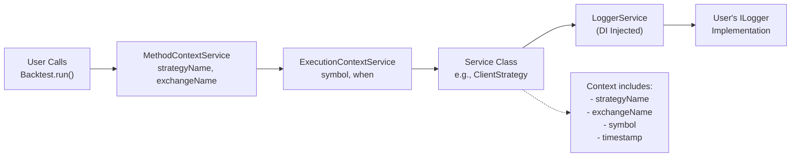
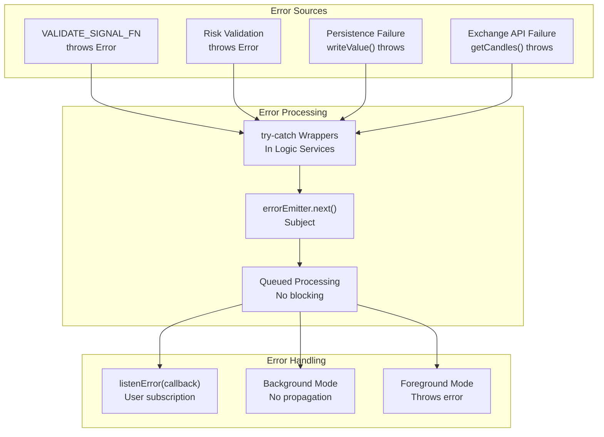
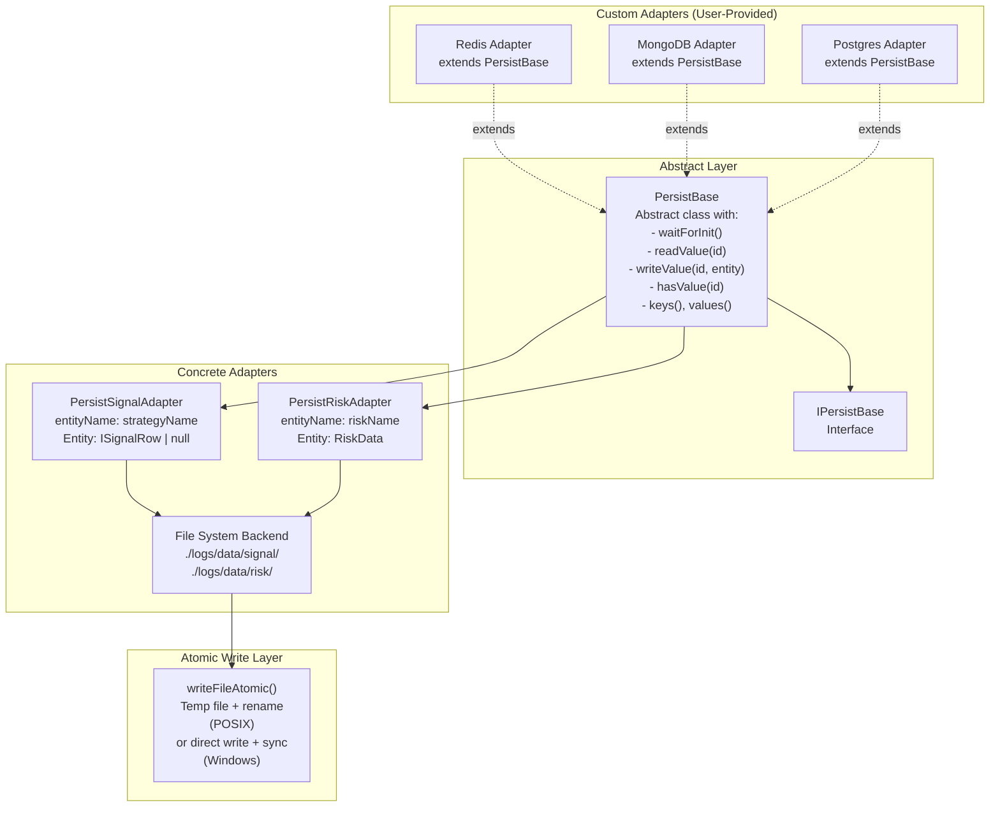
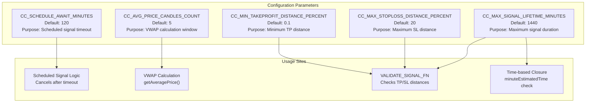
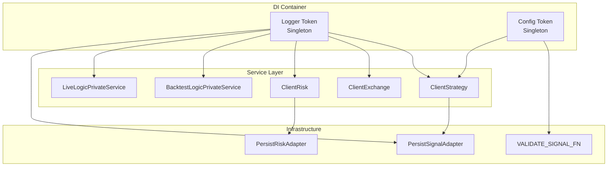

# Cross-Cutting Concerns

<details>
<summary>Relevant source files</summary>

The following files were used as context for generating this wiki page:

- [src/classes/Persist.ts](src/classes/Persist.ts)
- [src/config/params.ts](src/config/params.ts)
- [src/index.ts](src/index.ts)
- [src/utils/writeFileAtomic.ts](src/utils/writeFileAtomic.ts)
- [test/config/setup.mjs](test/config/setup.mjs)
- [test/e2e/defend.test.mjs](test/e2e/defend.test.mjs)
- [test/e2e/sanitize.test.mjs](test/e2e/sanitize.test.mjs)
- [test/index.mjs](test/index.mjs)
- [types.d.ts](types.d.ts)

</details>


This page documents infrastructure components that span multiple layers of the architecture: logging, error handling, persistence, and global configuration. These concerns are injected throughout the system via dependency injection and provide foundational services for observability, reliability, and customization.

For component-specific context propagation (ExecutionContext, MethodContext), see [Context Propagation](#3.3).
For event-driven signal flow, see [Event System](#3.4).

---

## System Overview

Cross-cutting concerns provide infrastructure services that are consumed by all layers:

```mermaid
graph TB
    subgraph "User Configuration"
        SetLogger["setLogger(ILogger)"]
        SetConfig["setConfig(Partial<GlobalConfig>)"]
    end
    
    subgraph "Logging Infrastructure"
        LoggerService["LoggerService<br/>(DI Token)"]
        ILogger["ILogger Interface<br/>log/debug/info/warn"]
        ContextInjection["Automatic Context Injection<br/>strategyName, exchangeName, symbol"]
    end
    
    subgraph "Error Infrastructure"
        ErrorEmitter["errorEmitter<br/>(Subject)"]
        ListenError["listenError()<br/>Global error handler"]
        ValidationError["Validation Error Emission<br/>VALIDATE_SIGNAL_FN throws"]
    end
    
    subgraph "Persistence Infrastructure"
        PersistBase["PersistBase<br/>Abstract class"]
        SignalAdapter["PersistSignalAdapter<br/>Signal state persistence"]
        RiskAdapter["PersistRiskAdapter<br/>Risk positions persistence"]
        AtomicWrites["writeFileAtomic()<br/>Crash-safe writes"]
    end
    
    subgraph "Configuration Infrastructure"
        GlobalConfig["GLOBAL_CONFIG<br/>CC_* parameters"]
        ValidationParams["Validation Constraints<br/>MIN_TAKEPROFIT, MAX_STOPLOSS"]
        TimingParams["Timing Constraints<br/>SCHEDULE_AWAIT, MAX_LIFETIME"]
    end
    
    SetLogger --> LoggerService
    LoggerService --> ILogger
    ILogger --> ContextInjection
    
    SetConfig --> GlobalConfig
    GlobalConfig --> ValidationParams
    GlobalConfig --> TimingParams
    
    ValidationError --> ErrorEmitter
    ErrorEmitter --> ListenError
    
    PersistBase --> SignalAdapter
    PersistBase --> RiskAdapter
    SignalAdapter --> AtomicWrites
    RiskAdapter --> AtomicWrites
    
    ContextInjection -.-> "All Services"
    ValidationParams -.-> "VALIDATE_SIGNAL_FN"
    SignalAdapter -.-> "ClientStrategy"
    RiskAdapter -.-> "ClientRisk"
```

**Sources:** [types.d.ts:40-130](), [src/config/params.ts:1-35](), [src/classes/Persist.ts:1-732]()

---

## Logging System

### ILogger Interface

The framework accepts any logger implementing the `ILogger` interface, which defines four severity levels:

| Method | Purpose | Usage |
|--------|---------|-------|
| `log()` | General-purpose messages | Strategy execution, signal generation |
| `debug()` | Detailed diagnostics | Intermediate states, candle fetching |
| `info()` | Informational updates | Successful completions, validations |
| `warn()` | Potentially problematic situations | Missing data, deprecated usage |

**Sources:** [types.d.ts:45-66]()

### Logger Registration

Users register a custom logger via `setLogger()`, which binds the implementation to the dependency injection container:

```typescript
setLogger({
  log: (topic, ...args) => console.log(topic, args),
  debug: (topic, ...args) => console.debug(topic, args),
  info: (topic, ...args) => console.info(topic, args),
  warn: (topic, ...args) => console.warn(topic, args),
});
```

**Sources:** [types.d.ts:68-85](), [test/config/setup.mjs:1-4]()

### Automatic Context Injection

The framework automatically injects contextual information into log messages. Services access the logger through dependency injection and include strategy/exchange/symbol context:



**Example log output with automatic context:**
```
[ClientStrategy] strategyName=my-strategy, exchangeName=binance, symbol=BTCUSDT - Generating signal
[PersistBase] entityName=my-strategy - Writing signal state
```

**Sources:** [types.d.ts:68-85](), [src/classes/Persist.ts:192-196]()

### LoggerService Integration

The logger is accessed throughout the codebase via the DI token `LoggerService`. All services inject this token to receive the user's logger implementation:

**File:** [src/classes/Persist.ts:192-196]()
```typescript
constructor(
  readonly entityName: EntityName,
  readonly baseDir = join(process.cwd(), "logs/data")
) {
  swarm.loggerService.debug(PERSIST_BASE_METHOD_NAME_CTOR, {
    entityName: this.entityName,
    baseDir,
  });
}
```

**Sources:** [src/classes/Persist.ts:192-196](), [src/classes/Persist.ts:234-238]()

---

## Error Handling

### Error Emission Architecture

The framework emits all errors to a centralized `errorEmitter` Subject, allowing users to subscribe to and handle errors globally:



**Sources:** [types.d.ts:1-3](), [src/index.ts:11]()

### Error Listener Registration

Users subscribe to errors via `listenError()`, which registers a callback to receive all emitted errors:

```typescript
listenError((error) => {
  console.error("Framework error:", error.message);
  // Custom error handling: alerts, logging, etc.
});
```

**Sources:** [src/index.ts:11](), [test/e2e/defend.test.mjs:615-640]()

### Background vs Foreground Error Propagation

The framework distinguishes between two execution modes for error handling:

| Mode | Method | Error Behavior |
|------|--------|----------------|
| **Foreground** | `Backtest.run()`, `Live.run()` | Throws error, halts execution |
| **Background** | `Backtest.background()`, `Live.background()` | Emits to `errorEmitter`, continues execution |

**Example from test showing error handling:**

**File:** [test/e2e/defend.test.mjs:615-640]()
```javascript
try {
  Backtest.background("BTCUSDT", {
    strategyName: "test-defend-invalid-long",
    exchangeName: "binance-defend-invalid-long",
    frameName: "10m-defend-invalid-long",
  });

  await awaitSubject.toPromise();

  // If we reach here, validation failed to reject the signal
  if (scheduledCount === 0 && openedCount === 0) {
    pass("MONEY SAFE: Invalid signal rejected");
  } else {
    fail("CRITICAL BUG: Invalid signal was NOT rejected");
  }
} catch (error) {
  // Error thrown indicates validation worked
  const errMsg = error.message || String(error);
  if (errMsg.includes("priceTakeProfit") || errMsg.includes("Invalid signal")) {
    pass(`MONEY SAFE: Invalid signal rejected: ${errMsg}`);
  }
}
```

**Sources:** [test/e2e/defend.test.mjs:615-641](), [test/e2e/sanitize.test.mjs:110-131]()

### Validation Error Emission

Signal validation errors are thrown from `VALIDATE_SIGNAL_FN` and caught by logic services, which emit them to `errorEmitter`. This prevents invalid trades while providing observability:

**Common validation errors:**
- TP too close to priceOpen (< `CC_MIN_TAKEPROFIT_DISTANCE_PERCENT`)
- SL too far from priceOpen (> `CC_MAX_STOPLOSS_DISTANCE_PERCENT`)
- Negative or NaN prices
- Inverted long/short logic (e.g., long with TP < priceOpen)

**Sources:** [test/e2e/sanitize.test.mjs:27-131](), [test/e2e/defend.test.mjs:544-641]()

---

## Persistence Layer

### Persistence Architecture

The persistence layer provides crash-safe state management for live trading via atomic file writes and abstract base classes supporting custom adapters:



**Sources:** [src/classes/Persist.ts:40-482](), [src/utils/writeFileAtomic.ts:1-141]()

### PersistBase Abstract Class

`PersistBase` provides a file-based persistence implementation with CRUD operations, iteration support, and automatic corruption handling:

| Method | Purpose | Return Type |
|--------|---------|-------------|
| `waitForInit(initial)` | Initialize directory, validate files | `Promise<void>` |
| `readValue(entityId)` | Read entity from storage | `Promise<Entity>` |
| `writeValue(entityId, entity)` | Write entity with atomic file operation | `Promise<void>` |
| `hasValue(entityId)` | Check entity existence | `Promise<boolean>` |
| `removeValue(entityId)` | Delete entity | `Promise<void>` |
| `keys()` | Async generator yielding entity IDs | `AsyncGenerator<EntityId>` |
| `values()` | Async generator yielding entities | `AsyncGenerator<Entity>` |

**File structure:**
```
./logs/data/
├── signal/
│   ├── my-strategy/
│   │   ├── BTCUSDT.json
│   │   └── ETHUSDT.json
└── risk/
    └── my-risk/
        └── positions.json
```

**Sources:** [src/classes/Persist.ts:160-482](), [types.d.ts:40-111]()

### PersistSignalAdapter

`PersistSignalAdapter` manages per-strategy, per-symbol signal persistence for crash recovery in live trading:

**Key characteristics:**
- **Entity Name:** `strategyName`
- **Entity ID:** `symbol` (e.g., "BTCUSDT")
- **Entity Data:** `ISignalRow | null`
- **Storage Path:** `./logs/data/signal/{strategyName}/{symbol}.json`

**Memoization pattern:** One storage instance per `strategyName`, retrieved via `getSignalStorage(strategyName)`.

**API:**
```typescript
// Read signal state on strategy initialization
const signal = await PersistSignalAdapter.readSignalData(
  "my-strategy", 
  "BTCUSDT"
);

// Write signal state after tick
await PersistSignalAdapter.writeSignalData(
  signalRow, 
  "my-strategy", 
  "BTCUSDT"
);
```

**Sources:** [src/classes/Persist.ts:484-600](), [types.d.ts:40-46]()

### PersistRiskAdapter

`PersistRiskAdapter` manages per-risk-profile active positions for portfolio-level risk tracking across strategies:

**Key characteristics:**
- **Entity Name:** `riskName`
- **Entity ID:** `"positions"` (fixed key)
- **Entity Data:** `RiskData` (array of `[string, IRiskActivePosition]` tuples)
- **Storage Path:** `./logs/data/risk/{riskName}/positions.json`

**Data format:**
```typescript
type RiskData = Array<[string, IRiskActivePosition]>;

// Persisted as JSON array of tuples:
[
  ["my-strategy:BTCUSDT", { signal: {...}, strategyName: "my-strategy", ... }],
  ["other-strategy:ETHUSDT", { signal: {...}, strategyName: "other-strategy", ... }]
]
```

**API:**
```typescript
// Read active positions on risk profile initialization
const positions = await PersistRiskAdapter.readPositionData("my-risk");

// Write active positions after addSignal/removeSignal
await PersistRiskAdapter.writePositionData(positionsArray, "my-risk");
```

**Sources:** [src/classes/Persist.ts:602-731](), [types.d.ts:605-607]()

### Atomic File Writes

`writeFileAtomic()` ensures crash-safe writes using platform-specific strategies:

**POSIX strategy (Linux, macOS):**
1. Generate unique temp filename: `.tmp-{random}-{filename}`
2. Write data to temp file
3. Sync data to disk via `fileHandle.sync()`
4. Atomically rename temp file to target file via `fs.rename()`
5. On failure, clean up temp file

**Windows strategy:**
1. Write directly to target file
2. Sync data to disk via `fileHandle.sync()`
3. Close file handle

**Critical properties:**
- **Atomicity (POSIX):** Rename is atomic operation—file is either fully written or untouched
- **Durability (both):** `sync()` ensures data is flushed to disk before rename/close
- **Isolation:** Temp filename uses crypto-random bytes to prevent collisions

**Sources:** [src/utils/writeFileAtomic.ts:1-141]()

### Custom Persistence Adapters

Users can replace the file-based backend with custom implementations (Redis, MongoDB, PostgreSQL) by extending `PersistBase` and registering the adapter:

**Example Redis adapter:**
```typescript
class RedisPersist extends PersistBase {
  private redis = createRedisClient();

  async readValue(entityId) {
    const data = await this.redis.get(`${this.entityName}:${entityId}`);
    return JSON.parse(data);
  }

  async writeValue(entityId, entity) {
    await this.redis.set(
      `${this.entityName}:${entityId}`, 
      JSON.stringify(entity)
    );
  }

  async hasValue(entityId) {
    return await this.redis.exists(`${this.entityName}:${entityId}`);
  }

  async waitForInit(initial) {
    await this.redis.connect();
  }
}

// Register adapter
PersistSignalAdapter.usePersistSignalAdapter(RedisPersist);
PersistRiskAdapter.usePersistRiskAdapter(RedisPersist);
```

**Sources:** [src/classes/Persist.ts:514-529](), [src/classes/Persist.ts:640-660](), [test/config/setup.mjs:6-34]()

### Crash Recovery Pattern

The `waitForInit()` method implements crash recovery by validating all persisted files on startup:

**File:** [src/classes/Persist.ts:113-134]()
```typescript
const BASE_WAIT_FOR_INIT_FN = async (self: TPersistBase): Promise<void> => {
  await fs.mkdir(self._directory, { recursive: true });
  for await (const key of self.keys()) {
    try {
      await self.readValue(key);  // Validate JSON parsing
    } catch {
      const filePath = self._getFilePath(key);
      console.error(`PersistBase found invalid document for filePath=${filePath}`);
      // Retry deletion with exponential backoff
      if (await not(BASE_WAIT_FOR_INIT_UNLINK_FN(filePath))) {
        console.error(`PersistBase failed to remove invalid document`);
      }
    }
  }
};
```

**Retry logic for file deletion:** [src/classes/Persist.ts:136-158]()

**Sources:** [src/classes/Persist.ts:113-158](), [src/classes/Persist.ts:37-39]()

---

## Global Configuration

### GLOBAL_CONFIG Object

The `GLOBAL_CONFIG` object defines system-wide constraints for validation and timing. Users modify these parameters via `setConfig()`:



**Sources:** [src/config/params.ts:1-35](), [types.d.ts:5-34]()

### Configuration Parameters

| Parameter | Default | Purpose | Impact if Too Low | Impact if Too High |
|-----------|---------|---------|-------------------|--------------------|
| `CC_SCHEDULE_AWAIT_MINUTES` | 120 | Scheduled signal timeout | Signals cancel too soon | Risk limits blocked longer |
| `CC_AVG_PRICE_CANDLES_COUNT` | 5 | VWAP calculation window | Price volatility noise | Stale price data |
| `CC_MIN_TAKEPROFIT_DISTANCE_PERCENT` | 0.1% | Minimum TP distance | Fees eat profit | Fewer signals (higher bar) |
| `CC_MAX_STOPLOSS_DISTANCE_PERCENT` | 20% | Maximum SL distance | Reject valid signals | Catastrophic losses allowed |
| `CC_MAX_SIGNAL_LIFETIME_MINUTES` | 1440 | Maximum signal lifetime | Premature closures | Eternal signals block risk |

**Sources:** [src/config/params.ts:1-30]()

### setConfig Function

Users modify configuration at runtime via `setConfig()`, which accepts partial overrides:

```typescript
setConfig({
  CC_SCHEDULE_AWAIT_MINUTES: 90,        // Reduce scheduled signal timeout
  CC_MIN_TAKEPROFIT_DISTANCE_PERCENT: 0.3,  // Require 0.3% min profit
  CC_MAX_STOPLOSS_DISTANCE_PERCENT: 10,     // Limit max loss to 10%
});
```

**Usage in tests to disable validation:**

**File:** [test/config/setup.mjs:36-41]()
```javascript
setConfig({
  // Disable validations for old tests (backward compatibility)
  CC_MIN_TAKEPROFIT_DISTANCE_PERCENT: 0,     // No min TP check
  CC_MAX_STOPLOSS_DISTANCE_PERCENT: 100,     // Allow any SL
  CC_MAX_SIGNAL_LIFETIME_MINUTES: 999999,    // No lifetime limit
});
```

**Sources:** [types.d.ts:86-97](), [test/config/setup.mjs:36-41](), [test/e2e/sanitize.test.mjs:30-32]()

### Validation Parameter Usage

The validation parameters are enforced in `VALIDATE_SIGNAL_FN`, which throws errors for invalid signals before they are persisted or executed:

**Example validation logic:**
```
1. Check all prices are > 0 and finite (not NaN, not Infinity)
2. Check TP/SL directions:
   - Long: priceTakeProfit > priceOpen > priceStopLoss
   - Short: priceStopLoss > priceOpen > priceTakeProfit
3. Check TP distance: |TP - priceOpen| / priceOpen >= CC_MIN_TAKEPROFIT_DISTANCE_PERCENT
4. Check SL distance: |SL - priceOpen| / priceOpen <= CC_MAX_STOPLOSS_DISTANCE_PERCENT
5. Check lifetime: minuteEstimatedTime <= CC_MAX_SIGNAL_LIFETIME_MINUTES
```

**Test demonstrating validation:**

**File:** [test/e2e/sanitize.test.mjs:27-131]()
- Micro-profit signal rejected (TP too close, fees eat profit)
- Extreme StopLoss rejected (>20% loss)
- Excessive minuteEstimatedTime rejected (>30 days)
- Negative/NaN/Infinity prices rejected

**Sources:** [test/e2e/sanitize.test.mjs:27-660](), [test/e2e/defend.test.mjs:544-949]()

### Timing Parameter Usage

The timing parameters control scheduled signal behavior and signal lifecycle:

**CC_SCHEDULE_AWAIT_MINUTES usage:**
- Scheduled signals have `scheduledAt` timestamp
- Framework calculates elapsed time: `(now - scheduledAt) / 60000`
- If elapsed >= `CC_SCHEDULE_AWAIT_MINUTES`, signal is cancelled
- Test verifies exact boundary condition at 120 minutes: [test/e2e/defend.test.mjs:445-536]()

**CC_MAX_SIGNAL_LIFETIME_MINUTES usage:**
- Active signals have `pendingAt` timestamp
- Framework checks: `(now - pendingAt) / 60000 >= minuteEstimatedTime`
- If elapsed >= `minuteEstimatedTime`, signal closes with `"time_expired"` reason
- Validation rejects signals where `minuteEstimatedTime > CC_MAX_SIGNAL_LIFETIME_MINUTES`

**Sources:** [test/e2e/defend.test.mjs:445-536](), [test/e2e/sanitize.test.mjs:250-348]()

---

## Integration Points

### Cross-Cutting Services in Dependency Injection

The DI container provides singletons for cross-cutting concerns that are injected into all service classes:



**Sources:** [src/classes/Persist.ts:192-196](), [types.d.ts:171-176]()

### Context Injection Flow

Logging context is automatically injected via the context propagation system (see [Context Propagation](#3.3)):

1. **MethodContextService** provides `strategyName`, `exchangeName`, `frameName`
2. **ExecutionContextService** provides `symbol`, `when`, `backtest` flag
3. Services access these via DI-scoped tokens
4. Logger calls include context parameters automatically

**Sources:** [types.d.ts:100-143](), [types.d.ts:362-402]()

---

## Best Practices

### Logging Guidelines

1. **Use appropriate severity levels:**
   - `debug()` for detailed state dumps (candle data, intermediate values)
   - `info()` for lifecycle events (signal opened, strategy started)
   - `log()` for significant events (backtest completed, report generated)
   - `warn()` for recoverable issues (missing data, deprecated usage)

2. **Include context in custom messages:**
   ```typescript
   logger.info("strategy-execution", { 
     strategyName, 
     symbol, 
     action: "signal-generated" 
   });
   ```

**Sources:** [types.d.ts:45-66]()

### Error Handling Guidelines

1. **Always subscribe to `errorEmitter` in production:**
   ```typescript
   listenError((error) => {
     // Alert monitoring system
     // Log to error tracking service
     // Record metrics
   });
   ```

2. **Use background mode for resilient execution:**
   - Background mode continues on errors, emits to `errorEmitter`
   - Foreground mode halts immediately, suitable for testing

3. **Handle validation errors gracefully:**
   - Validation errors indicate configuration issues
   - Check `CC_MIN_TAKEPROFIT_DISTANCE_PERCENT` and related parameters
   - Review signal generation logic for price calculation bugs

**Sources:** [test/e2e/defend.test.mjs:615-641](), [src/index.ts:11]()

### Persistence Guidelines

1. **Use custom adapters for production:**
   - File-based persistence is suitable for testing and single-instance deployments
   - Redis/MongoDB adapters recommended for distributed systems
   - Implement retry logic in custom adapters for network failures

2. **Test crash recovery:**
   ```typescript
   // Verify waitForInit() handles corrupted files
   await PersistSignalAdapter.readSignalData(strategyName, symbol);
   ```

3. **Monitor persistence metrics:**
   - Track write latency (should be < 10ms for local files)
   - Monitor disk space usage (especially for high-frequency strategies)
   - Alert on repeated write failures

**Sources:** [src/classes/Persist.ts:113-158](), [test/config/setup.mjs:6-34]()

### Configuration Guidelines

1. **Set conservative defaults for production:**
   ```typescript
   setConfig({
     CC_MIN_TAKEPROFIT_DISTANCE_PERCENT: 0.3,  // Cover fees + profit
     CC_MAX_STOPLOSS_DISTANCE_PERCENT: 5,      // Limit max loss per trade
     CC_MAX_SIGNAL_LIFETIME_MINUTES: 480,      // 8 hours max
   });
   ```

2. **Test parameter changes in backtest first:**
   - Run backtest with new parameters
   - Verify signals are not over-filtered
   - Check that invalid signals are properly rejected

3. **Document configuration rationale:**
   - Include comments explaining why specific values are chosen
   - Reference trading fees and slippage assumptions
   - Note asset-specific considerations (e.g., crypto vs stocks)

**Sources:** [test/config/setup.mjs:36-41](), [test/e2e/sanitize.test.mjs:30-32]()