# Global Configuration

<details>
<summary>Relevant source files</summary>

The following files were used as context for generating this wiki page:

- [src/client/ClientStrategy.ts](src/client/ClientStrategy.ts)
- [src/interfaces/Strategy.interface.ts](src/interfaces/Strategy.interface.ts)
- [types.d.ts](types.d.ts)

</details>


This page documents the global configuration system for backtest-kit, including the `GLOBAL_CONFIG` object, the `setConfig()` function, and all runtime configuration parameters that control validation rules and timing constraints across the framework.

For detailed information about specific parameter categories, see:
- Validation parameters (TP/SL distance constraints): [14.2](#14.2)
- Timing parameters (signal lifetime and scheduling): [14.3](#14.3)

---

## Configuration Object Structure

The framework uses a singleton `GLOBAL_CONFIG` object to store runtime parameters that affect signal validation, scheduling behavior, risk management, and exchange data retrieval. This object is defined in [src/config/params.ts:1-30]() and contains eleven configuration parameters organized into three categories: signal validation, scheduling, and data retrieval.

### GLOBAL_CONFIG Definition

```mermaid
graph TB
    subgraph "GLOBAL_CONFIG Object"
        Config["GLOBAL_CONFIG<br/>src/config/params.ts"]
        
        subgraph "Signal Validation Parameters"
            P3["CC_MIN_TAKEPROFIT_DISTANCE_PERCENT<br/>number (default: 0.3)"]
            P4["CC_MAX_STOPLOSS_DISTANCE_PERCENT<br/>number (default: 20)"]
            P5["CC_MAX_SIGNAL_LIFETIME_MINUTES<br/>number (default: 1440)"]
        end
        
        subgraph "Scheduling Parameters"
            P1["CC_SCHEDULE_AWAIT_MINUTES<br/>number (default: 120)"]
        end
        
        subgraph "Exchange Data Parameters"
            P2["CC_AVG_PRICE_CANDLES_COUNT<br/>number (default: 5)"]
            P6["CC_GET_CANDLES_RETRY_COUNT<br/>number (default: 3)"]
            P7["CC_GET_CANDLES_RETRY_DELAY_MS<br/>number (default: 5000)"]
            P8["CC_GET_CANDLES_PRICE_ANOMALY_THRESHOLD_FACTOR<br/>number (default: 1000)"]
            P9["CC_GET_CANDLES_MIN_CANDLES_FOR_MEDIAN<br/>number (default: 5)"]
        end
        
        Config --> P1
        Config --> P2
        Config --> P3
        Config --> P4
        Config --> P5
        Config --> P6
        Config --> P7
        Config --> P8
        Config --> P9
    end
    
    TypeDef["GlobalConfig<br/>(typeof GLOBAL_CONFIG)<br/>types.d.ts"]
    Config -.->|type derived from| TypeDef
```

**GLOBAL_CONFIG Parameter Summary**

| Parameter | Default | Unit | Category | Purpose |
|-----------|---------|------|----------|---------|
| `CC_SCHEDULE_AWAIT_MINUTES` | 120 | minutes | Scheduling | Maximum wait time for scheduled signals to activate |
| `CC_AVG_PRICE_CANDLES_COUNT` | 5 | candles | Exchange | Number of 1-minute candles for VWAP calculation |
| `CC_MIN_TAKEPROFIT_DISTANCE_PERCENT` | 0.3 | percent | Validation | Minimum TP distance from priceOpen (fee coverage) |
| `CC_MAX_STOPLOSS_DISTANCE_PERCENT` | 20 | percent | Validation | Maximum SL distance from priceOpen (risk limit) |
| `CC_MAX_SIGNAL_LIFETIME_MINUTES` | 1440 | minutes | Validation | Maximum signal duration (1 day default) |
| `CC_GET_CANDLES_RETRY_COUNT` | 3 | count | Exchange | Number of retries for getCandles function |
| `CC_GET_CANDLES_RETRY_DELAY_MS` | 5000 | milliseconds | Exchange | Delay between retries for getCandles function |
| `CC_GET_CANDLES_PRICE_ANOMALY_THRESHOLD_FACTOR` | 1000 | factor | Exchange | Maximum allowed deviation for price anomaly detection |
| `CC_GET_CANDLES_MIN_CANDLES_FOR_MEDIAN` | 5 | candles | Exchange | Minimum candles required for median calculation |

Sources: [src/config/params.ts:1-30](), [types.d.ts:5-72]()

---

## Setting Configuration

The `setConfig()` function allows runtime modification of global configuration parameters. It accepts a partial configuration object, enabling selective parameter updates without affecting other values.

### setConfig Function Signature

```typescript
setConfig(config: Partial<GlobalConfig>): Promise<void>
```

**Parameters:**
- `config`: `Partial<GlobalConfig>` - Object containing configuration parameters to update. Only specified parameters are modified; others retain their current values.

**Returns:**
- `Promise<void>` - Resolves when configuration is updated

**Behavior:**
- Updates `GLOBAL_CONFIG` object in-place via object spread
- Accepts partial updates (only specified fields are changed)
- Changes take effect immediately for subsequent operations
- No validation of parameter values (caller responsible for sensible values)
- Used by validation, scheduling, and exchange data retrieval logic

**Code Flow:**

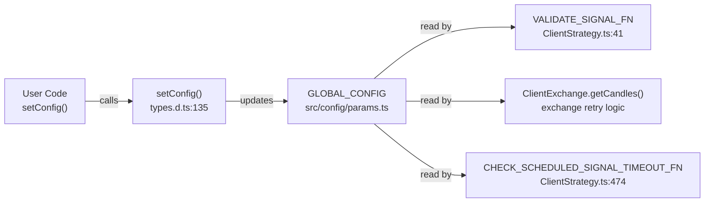

Sources: [types.d.ts:124-135](), [src/client/ClientStrategy.ts:30](), [src/client/ClientStrategy.ts:474-528]()

---

## Configuration Parameters

### CC_SCHEDULE_AWAIT_MINUTES

**Purpose:** Maximum time in minutes to wait for a scheduled signal to activate before cancelling it.

**Default Value:** 120 minutes (2 hours)

**Usage Context:**
- Applied to scheduled signals (signals with `priceOpen` specified)
- Timer starts at `scheduledAt` timestamp
- Signal cancelled if `priceOpen` not reached within timeout
- Prevents "eternal" scheduled signals from blocking risk limits indefinitely

**Validation Flow:**

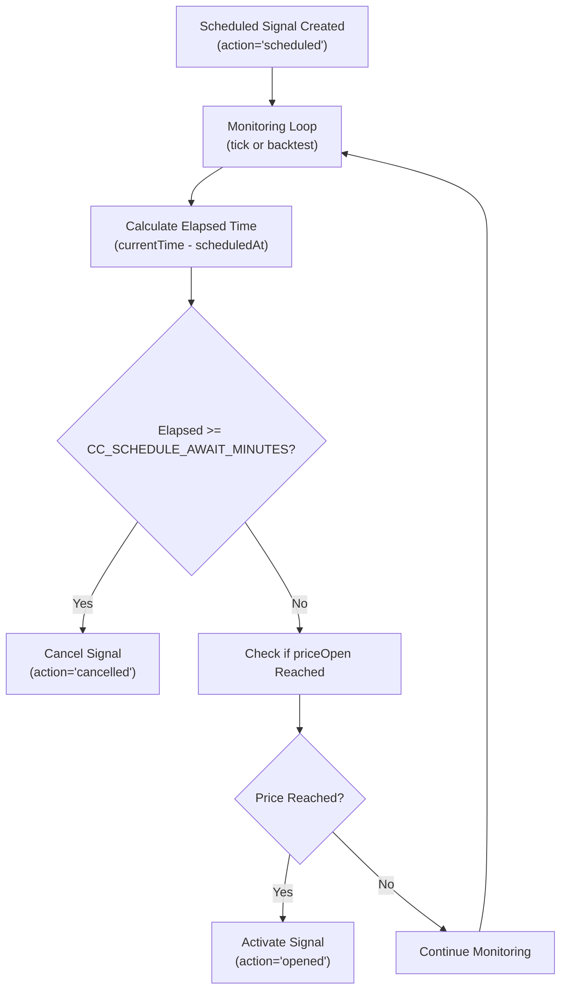

**Example:**
```typescript
// Extend timeout for long-term scheduled signals
setConfig({
  CC_SCHEDULE_AWAIT_MINUTES: 240, // 4 hours
});
```

Sources: [src/config/params.ts:3-6](), [types.d.ts:7-10](), [test/e2e/defend.test.mjs:444-536]()

---

### CC_AVG_PRICE_CANDLES_COUNT

**Purpose:** Number of 1-minute candles to use for Volume-Weighted Average Price (VWAP) calculation.

**Default Value:** 5 candles (last 5 minutes)

**Usage Context:**
- Used by `ClientExchange.getAveragePrice()` method
- Applied in live mode for real-time price monitoring
- Formula: `VWAP = Σ(Typical Price × Volume) / Σ(Volume)`
- Typical Price = `(High + Low + Close) / 3`

**VWAP Calculation Flow:**

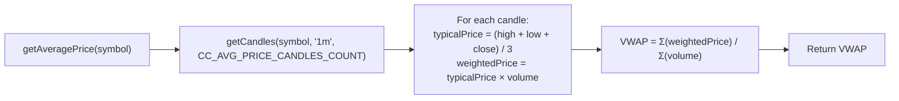

**Example:**
```typescript
// Use 10 candles for smoother VWAP
setConfig({
  CC_AVG_PRICE_CANDLES_COUNT: 10,
});
```

Sources: [src/config/params.ts:8-10](), [types.d.ts:12-15](), [types.d.ts:264-270]()

---

### CC_MIN_TAKEPROFIT_DISTANCE_PERCENT

**Purpose:** Minimum percentage distance between `priceTakeProfit` and `priceOpen` to ensure profit exceeds trading fees.

**Default Value:** 0.1% (minimum profit after 2×0.1% fees)

**Usage Context:**
- Applied during signal validation in `VALIDATE_SIGNAL_FN`
- Prevents micro-profit signals where fees exceed gains
- Default 0.3% recommended to cover fees (0.1% entry + 0.1% exit) plus minimum margin
- Setting to 0 disables validation (not recommended for production)

**Validation Logic:**

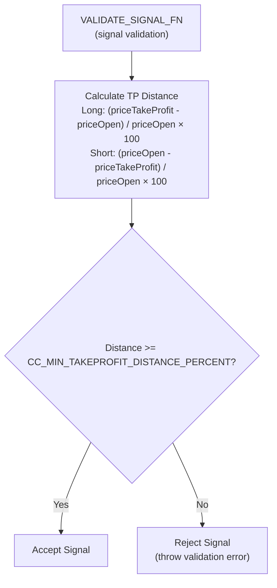

**Example:**
```typescript
// Require 0.5% minimum TP distance for high-fee exchanges
setConfig({
  CC_MIN_TAKEPROFIT_DISTANCE_PERCENT: 0.5,
});
```

Sources: [src/config/params.ts:12-17](), [types.d.ts:17-21](), [test/e2e/sanitize.test.mjs:26-131]()

---

### CC_MAX_STOPLOSS_DISTANCE_PERCENT

**Purpose:** Maximum percentage distance between `priceStopLoss` and `priceOpen` to prevent catastrophic losses from extreme StopLoss values.

**Default Value:** 20% (one signal cannot lose more than 20% of position)

**Usage Context:**
- Applied during signal validation in `VALIDATE_SIGNAL_FN`
- Prevents accidental or malicious extreme SL values
- Protects against single-signal portfolio wipeout scenarios
- Setting to 100 effectively disables validation

**Validation Logic:**

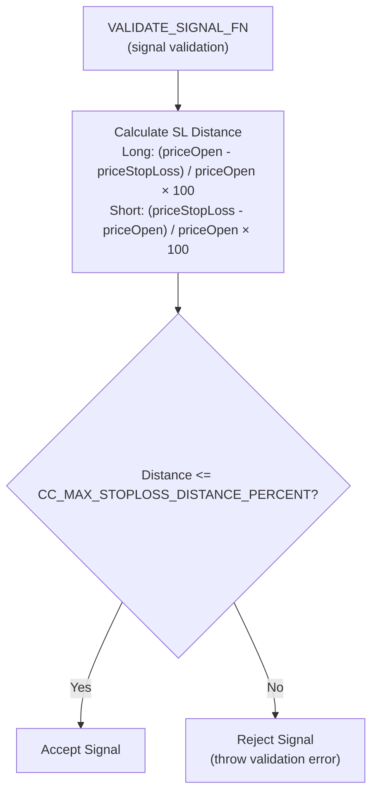

**Example:**
```typescript
// Allow 10% max risk per signal for conservative strategy
setConfig({
  CC_MAX_STOPLOSS_DISTANCE_PERCENT: 10,
});
```

Sources: [src/config/params.ts:19-23](), [types.d.ts:23-27](), [test/e2e/sanitize.test.mjs:143-238]()

---

### CC_MAX_SIGNAL_LIFETIME_MINUTES

**Purpose:** Maximum signal duration in minutes before automatic closure via time expiration.

**Default Value:** 1440 minutes (1 day)

**Usage Context:**
- Applied during signal lifecycle monitoring
- Prevents eternal signals that block risk limits indefinitely
- Timer starts at `pendingAt` timestamp (when signal becomes active)
- Signal closed with `closeReason: "time_expired"` when exceeded
- Critical for portfolio turnover and risk limit availability

**Lifecycle Monitoring:**

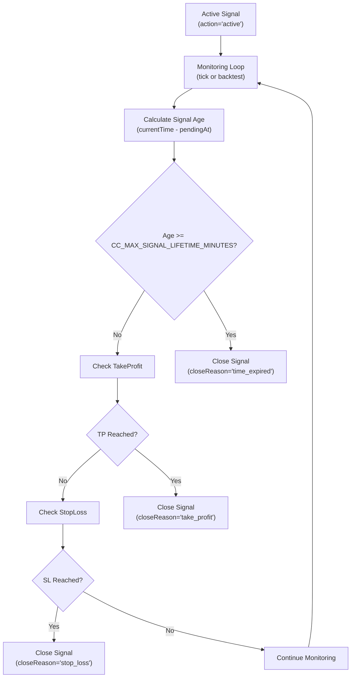

**Example:**
```typescript
// Allow 7-day positions for long-term strategies
setConfig({
  CC_MAX_SIGNAL_LIFETIME_MINUTES: 10080, // 7 days
});
```

Sources: [src/config/params.ts:25-29](), [types.d.ts:29-34](), [test/e2e/sanitize.test.mjs:250-348]()

---

### CC_GET_CANDLES_RETRY_COUNT

**Purpose:** Number of retry attempts for the `getCandles()` function when exchange data fetching fails.

**Default Value:** 3 retries

**Usage Context:**
- Applied by `ClientExchange.getCandles()` when fetching historical candle data
- Used in retry logic for transient network failures or API rate limits
- Each retry waits `CC_GET_CANDLES_RETRY_DELAY_MS` milliseconds before retrying
- After all retries exhausted, error propagates to caller

**Retry Logic Flow:**

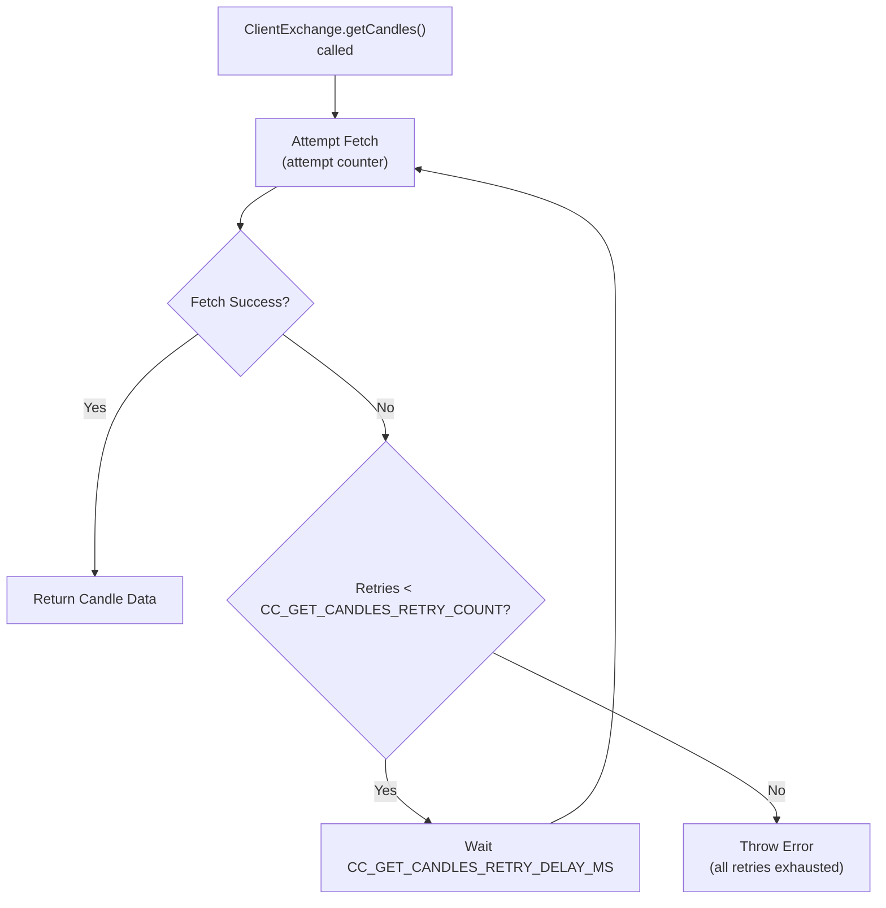

**Example:**
```typescript
// Increase retries for unreliable exchange APIs
setConfig({
  CC_GET_CANDLES_RETRY_COUNT: 5,
});
```

Sources: [types.d.ts:35-38]()

---

### CC_GET_CANDLES_RETRY_DELAY_MS

**Purpose:** Delay in milliseconds between retry attempts for the `getCandles()` function.

**Default Value:** 5000 milliseconds (5 seconds)

**Usage Context:**
- Applied between retry attempts in `ClientExchange.getCandles()`
- Prevents immediate retry hammering of exchange APIs
- Allows time for transient failures to resolve
- Respects API rate limits by spacing out requests

**Example:**
```typescript
// Reduce delay for faster retries in testing
setConfig({
  CC_GET_CANDLES_RETRY_DELAY_MS: 1000, // 1 second
});
```

Sources: [types.d.ts:39-43]()

---

### CC_GET_CANDLES_PRICE_ANOMALY_THRESHOLD_FACTOR

**Purpose:** Maximum allowed deviation factor for price anomaly detection in candle data. Prices more than this factor below the reference price are considered anomalies and filtered out.

**Default Value:** 1000 (prices below 1/1000th of median are filtered)

**Usage Context:**
- Applied during candle data validation in `ClientExchange.getCandles()`
- Detects incomplete candles from exchange APIs (typically near $0)
- Prevents invalid data from corrupting VWAP calculations
- Reference price calculated as median of all OHLC values
- Anomaly threshold: `referencePrice / CC_GET_CANDLES_PRICE_ANOMALY_THRESHOLD_FACTOR`

**Reasoning:**
- Incomplete candles from Binance API typically have prices near $0 (e.g., $0.01-1)
- Normal BTC price ranges: $20,000-100,000
- Factor 1000 catches prices below $20-100 when median is $20,000-100,000
- Factor 100 would be too permissive (allows $200 when median is $20,000)
- Factor 10000 might be too strict for low-cap altcoins

**Anomaly Detection Logic:**

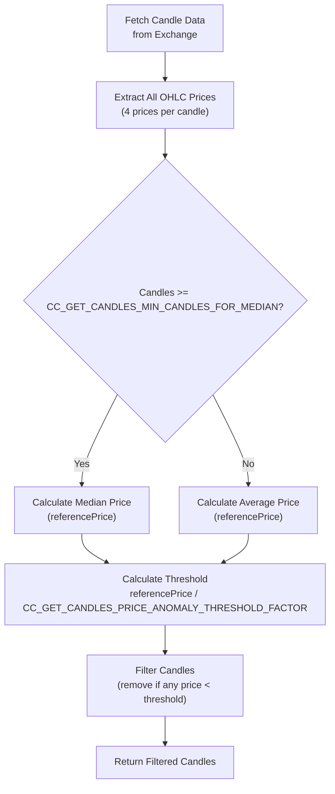

**Example:**
```typescript
// More aggressive anomaly detection for high-value assets
setConfig({
  CC_GET_CANDLES_PRICE_ANOMALY_THRESHOLD_FACTOR: 10000, // Filter prices below 1/10000th
});
```

Sources: [types.d.ts:44-57]()

---

### CC_GET_CANDLES_MIN_CANDLES_FOR_MEDIAN

**Purpose:** Minimum number of candles required for reliable median calculation. Below this threshold, simple average is used instead of median.

**Default Value:** 5 candles

**Usage Context:**
- Applied during price anomaly detection in `ClientExchange.getCandles()`
- Determines statistical method for reference price calculation
- Median more robust for anomaly detection but requires sufficient data
- Average used for small datasets where median is unstable

**Reasoning:**
- Each candle provides 4 price points (OHLC)
- 5 candles = 20 price points, sufficient for robust median calculation
- Below 5 candles, single anomaly can heavily skew median
- Statistical rule of thumb: minimum 7-10 data points for median stability
- Average is more stable than median for small datasets (n < 20)

**Statistical Method Selection:**

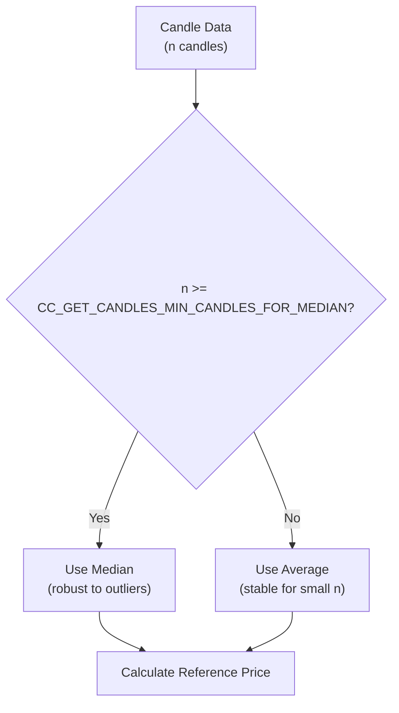

**Example:**
```typescript
// Require more data points for median calculation
setConfig({
  CC_GET_CANDLES_MIN_CANDLES_FOR_MEDIAN: 10,
});
```

Sources: [types.d.ts:58-72]()

---

## Configuration Flow Architecture

The configuration system follows a simple write-once-read-many pattern, where configuration parameters are read by validation and monitoring logic throughout the framework.

```mermaid
graph TB
    subgraph "Configuration Layer"
        SetConfig["setConfig()<br/>types.d.ts:135"]
        GlobalConfig["GLOBAL_CONFIG<br/>src/config/params.ts:1-30"]
    end
    
    subgraph "Validation Layer"
        ValidateSignal["VALIDATE_SIGNAL_FN<br/>ClientStrategy.ts:41"]
        CheckTP["CC_MIN_TAKEPROFIT_DISTANCE_PERCENT<br/>ClientStrategy.ts:138-148"]
        CheckSL["CC_MAX_STOPLOSS_DISTANCE_PERCENT<br/>ClientStrategy.ts:151-161"]
        CheckLifetime["CC_MAX_SIGNAL_LIFETIME_MINUTES<br/>ClientStrategy.ts:237-246"]
    end
    
    subgraph "Exchange Layer"
        GetCandles["ClientExchange.getCandles()"]
        RetryLogic["Retry Logic<br/>CC_GET_CANDLES_RETRY_COUNT<br/>CC_GET_CANDLES_RETRY_DELAY_MS"]
        AnomalyDetection["Anomaly Detection<br/>CC_GET_CANDLES_PRICE_ANOMALY_THRESHOLD_FACTOR<br/>CC_GET_CANDLES_MIN_CANDLES_FOR_MEDIAN"]
        GetAveragePrice["ClientExchange.getAveragePrice()<br/>CC_AVG_PRICE_CANDLES_COUNT"]
    end
    
    subgraph "Strategy Execution Layer"
        ClientStrategyTick["ClientStrategy.tick()<br/>ClientStrategy.ts:1639"]
        CheckExpiration["CHECK_PENDING_SIGNAL_COMPLETION_FN<br/>ClientStrategy.ts:817<br/>CC_MAX_SIGNAL_LIFETIME_MINUTES"]
        BacktestLogic["BacktestLogicPrivateService"]
        LiveLogic["LiveLogicPrivateService"]
    end
    
    subgraph "Scheduled Signal Layer"
        ScheduledTimeout["CHECK_SCHEDULED_SIGNAL_TIMEOUT_FN<br/>ClientStrategy.ts:474<br/>CC_SCHEDULE_AWAIT_MINUTES"]
        ProcessScheduled["PROCESS_SCHEDULED_SIGNAL_CANDLES_FN<br/>ClientStrategy.ts:1263<br/>CC_SCHEDULE_AWAIT_MINUTES"]
    end
    
    SetConfig -->|updates| GlobalConfig
    
    GlobalConfig -->|read by| ValidateSignal
    ValidateSignal --> CheckTP
    ValidateSignal --> CheckSL
    ValidateSignal --> CheckLifetime
    
    GlobalConfig -->|read by| GetCandles
    GetCandles --> RetryLogic
    GetCandles --> AnomalyDetection
    
    GlobalConfig -->|read by| GetAveragePrice
    
    GlobalConfig -->|read by| ClientStrategyTick
    ClientStrategyTick --> CheckExpiration
    
    GlobalConfig -->|read by| ScheduledTimeout
    GlobalConfig -->|read by| ProcessScheduled
    
    BacktestLogic --> ClientStrategyTick
    LiveLogic --> ClientStrategyTick
```

**Configuration Consumers by Code Entity:**

| Consumer Code Entity | File Location | Configuration Parameter | Usage |
|---------------------|---------------|------------------------|-------|
| `VALIDATE_SIGNAL_FN` | ClientStrategy.ts:41 | `CC_MIN_TAKEPROFIT_DISTANCE_PERCENT` | Validate minimum TP distance [ClientStrategy.ts:138-148]() |
| `VALIDATE_SIGNAL_FN` | ClientStrategy.ts:41 | `CC_MAX_STOPLOSS_DISTANCE_PERCENT` | Validate maximum SL distance [ClientStrategy.ts:151-161]() |
| `VALIDATE_SIGNAL_FN` | ClientStrategy.ts:41 | `CC_MAX_SIGNAL_LIFETIME_MINUTES` | Validate signal lifetime [ClientStrategy.ts:237-246]() |
| `ClientExchange.getAveragePrice()` | ClientExchange.ts | `CC_AVG_PRICE_CANDLES_COUNT` | VWAP candle count |
| `ClientExchange.getCandles()` | ClientExchange.ts | `CC_GET_CANDLES_RETRY_COUNT` | Number of retry attempts |
| `ClientExchange.getCandles()` | ClientExchange.ts | `CC_GET_CANDLES_RETRY_DELAY_MS` | Delay between retries |
| `ClientExchange.getCandles()` | ClientExchange.ts | `CC_GET_CANDLES_PRICE_ANOMALY_THRESHOLD_FACTOR` | Anomaly detection threshold |
| `ClientExchange.getCandles()` | ClientExchange.ts | `CC_GET_CANDLES_MIN_CANDLES_FOR_MEDIAN` | Median calculation threshold |
| `CHECK_PENDING_SIGNAL_COMPLETION_FN` | ClientStrategy.ts:817 | `CC_MAX_SIGNAL_LIFETIME_MINUTES` | Check signal expiration |
| `CHECK_SCHEDULED_SIGNAL_TIMEOUT_FN` | ClientStrategy.ts:474 | `CC_SCHEDULE_AWAIT_MINUTES` | Check scheduled timeout |
| `PROCESS_SCHEDULED_SIGNAL_CANDLES_FN` | ClientStrategy.ts:1263 | `CC_SCHEDULE_AWAIT_MINUTES` | Check scheduled timeout in backtest |

Sources: [src/config/params.ts:1-30](), [types.d.ts:5-72](), [src/client/ClientStrategy.ts:30](), [src/client/ClientStrategy.ts:41-261](), [src/client/ClientStrategy.ts:474-528](), [src/client/ClientStrategy.ts:817-876](), [src/client/ClientStrategy.ts:1263-1357]()

---

## Type Safety

The configuration system uses TypeScript's `typeof` operator to derive the `GlobalConfig` type from the runtime `GLOBAL_CONFIG` object, ensuring type safety for partial updates via `setConfig()`.

**Type Definition:**

```typescript
// Runtime object
const GLOBAL_CONFIG = {
  CC_SCHEDULE_AWAIT_MINUTES: 120,
  CC_AVG_PRICE_CANDLES_COUNT: 5,
  CC_MIN_TAKEPROFIT_DISTANCE_PERCENT: 0.1,
  CC_MAX_STOPLOSS_DISTANCE_PERCENT: 20,
  CC_MAX_SIGNAL_LIFETIME_MINUTES: 1440,
};

// Type derived from runtime object
type GlobalConfig = typeof GLOBAL_CONFIG;

// setConfig accepts partial configuration
function setConfig(config: Partial<GlobalConfig>): Promise<void>;
```

**Type Safety Benefits:**
- Autocomplete for configuration parameter names
- Compile-time validation of parameter types
- Prevention of typos in parameter names
- IDE support for parameter discovery

Sources: [src/config/params.ts:32-35](), [types.d.ts:36-38]()

---

## Usage Patterns

### Pattern 1: Disable Validation for Testing

Test environments often require relaxed validation rules to test edge cases:

```typescript
// Disable all validation constraints for testing
await setConfig({
  CC_MIN_TAKEPROFIT_DISTANCE_PERCENT: 0, // Allow any TP distance
  CC_MAX_STOPLOSS_DISTANCE_PERCENT: 100, // Allow any SL distance
  CC_MAX_SIGNAL_LIFETIME_MINUTES: 999999, // Allow any lifetime
});
```

Sources: [test/config/setup.mjs:36-41]()

---

### Pattern 2: Conservative Risk Management

Production strategies may require stricter validation:

```typescript
// Conservative configuration for production
await setConfig({
  CC_MIN_TAKEPROFIT_DISTANCE_PERCENT: 0.5, // 0.5% minimum profit
  CC_MAX_STOPLOSS_DISTANCE_PERCENT: 5, // 5% maximum loss per signal
  CC_MAX_SIGNAL_LIFETIME_MINUTES: 720, // 12 hours max signal duration
  CC_SCHEDULE_AWAIT_MINUTES: 60, // 1 hour scheduled signal timeout
});
```

---

### Pattern 3: Validate Specific Parameters

Update only specific parameters while preserving defaults for others:

```typescript
// Only modify scheduled signal timeout
await setConfig({
  CC_SCHEDULE_AWAIT_MINUTES: 180, // 3 hours
});
// All other parameters retain their default values
```

Sources: [test/e2e/sanitize.test.mjs:30-32](), [test/e2e/sanitize.test.mjs:146-148]()

---

### Pattern 4: Long-Term Strategy Configuration

Swing trading strategies may require extended timeouts:

```typescript
// Configuration for multi-day swing trading
await setConfig({
  CC_MAX_SIGNAL_LIFETIME_MINUTES: 10080, // 7 days
  CC_SCHEDULE_AWAIT_MINUTES: 1440, // 24 hours for limit orders
  CC_AVG_PRICE_CANDLES_COUNT: 15, // 15-minute VWAP for stability
});
```

---

### Pattern 5: High-Frequency Trading Configuration

Scalping strategies require tighter constraints:

```typescript
// Configuration for high-frequency scalping
await setConfig({
  CC_MAX_SIGNAL_LIFETIME_MINUTES: 60, // 1 hour max
  CC_SCHEDULE_AWAIT_MINUTES: 15, // 15 minutes scheduled timeout
  CC_AVG_PRICE_CANDLES_COUNT: 3, // 3-minute VWAP for responsiveness
  CC_MIN_TAKEPROFIT_DISTANCE_PERCENT: 0.2, // Tight TP for quick exits
});
```

---

## Configuration Timing

Configuration changes take effect **immediately** but only affect **future operations**:

- **Validation**: New signals validated with updated parameters
- **Monitoring**: Active signals continue using parameters from their creation time
- **Scheduled signals**: Timeout calculated using parameters at schedule time
- **VWAP**: Next `getAveragePrice()` call uses updated candle count

**Important:** Configuration changes do NOT retroactively affect active or scheduled signals. Signals retain the validation parameters that were active when they were created.

---

## Default Configuration Rationale

The default configuration values represent a balanced approach suitable for most cryptocurrency trading strategies:

| Parameter | Default | Rationale |
|-----------|---------|-----------|
| `CC_SCHEDULE_AWAIT_MINUTES` | 120 min | 2-hour window balances limit order patience vs. stale signals |
| `CC_AVG_PRICE_CANDLES_COUNT` | 5 candles | 5-minute lookback reduces noise while remaining responsive |
| `CC_MIN_TAKEPROFIT_DISTANCE_PERCENT` | 0.1% | Minimal profit check (fees typically 0.1% each side = 0.2% total) |
| `CC_MAX_STOPLOSS_DISTANCE_PERCENT` | 20% | Prevents catastrophic single-signal portfolio damage |
| `CC_MAX_SIGNAL_LIFETIME_MINUTES` | 1440 min | 24-hour limit prevents eternal signals blocking risk limits |

**Note:** The default `CC_MIN_TAKEPROFIT_DISTANCE_PERCENT` of 0.1% is intentionally permissive. For production use with 0.1% trading fees, consider increasing to 0.3% or higher to ensure profitable trades after fees.

Sources: [src/config/params.ts:1-30](), [types.d.ts:5-34]()