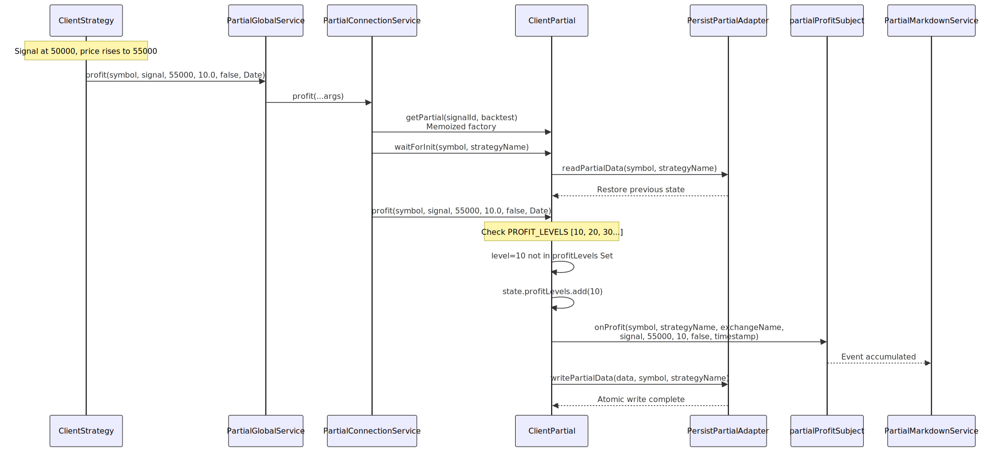

# Partial Profit/Loss Tracking

**Purpose**: This document describes the partial profit/loss tracking system that monitors trading signals and emits events when they reach percentage-based profit or loss milestones (10%, 20%, 30%, etc.). This enables tracking partial take-profit and stop-loss behavior, generating detailed reports, and monitoring strategy performance at granular levels.

For information about overall reporting infrastructure, see [Reporting and Analytics](./71_Reporting_and_Analytics.md). For risk management and portfolio constraints, see [Risk Management](./67_Risk_Management.md). For signal lifecycle states, see [Signal Lifecycle](./48_Signal_Lifecycle.md).

---

## System Overview

The partial tracking system monitors active trading signals and emits events when they reach predefined profit or loss levels. Each level (10%, 20%, 30%...100%) is emitted exactly once per signal using Set-based deduplication. The system persists state to disk for crash recovery in live trading mode.

### Key Components

| Component | File | Purpose |
|-----------|------|---------|
| `ClientPartial` | [src/client/ClientPartial.ts:1-478]() | Core implementation tracking profit/loss levels per signal |
| `PartialConnectionService` | [src/lib/services/connection/PartialConnectionService.ts:1-267]() | Factory creating memoized ClientPartial instances |
| `PartialGlobalService` | [src/lib/services/global/PartialGlobalService.ts:1-205]() | Global service delegating to connection layer |
| `PartialMarkdownService` | [src/lib/services/markdown/PartialMarkdownService.ts:1-478]() | Accumulates events and generates markdown reports |
| `PersistPartialAdapter` | [src/classes/Persist.ts:1-600]() | Atomic persistence for partial state |

### Data Flow




---

## Profit/Loss Level System

The system tracks profit and loss milestones at 10-percentage-point intervals from 10% to 100%. Each level is emitted exactly once per signal to prevent duplicate notifications.

### Level Definitions

**Profit Levels** (positive price movement):
```typescript
const PROFIT_LEVELS: PartialLevel[] = [10, 20, 30, 40, 50, 60, 70, 80, 90, 100];
```

**Loss Levels** (negative price movement):
```typescript
const LOSS_LEVELS: PartialLevel[] = [10, 20, 30, 40, 50, 60, 70, 80, 90, 100];
```

**Note**: Loss levels are stored as absolute values (10, 20, 30) but represent negative percentages (-10%, -20%, -30%).

### State Structure

The `IPartialState` interface uses Sets for O(1) deduplication and lookup:

```typescript
interface IPartialState {
  profitLevels: Set<PartialLevel>;  // Reached profit levels
  lossLevels: Set<PartialLevel>;    // Reached loss levels
}
```

State is stored in a `Map<signalId, IPartialState>` within each `ClientPartial` instance. For persistence, Sets are converted to arrays in `IPartialData` format.


---

## ClientPartial Architecture

`ClientPartial` is the core implementation responsible for tracking profit/loss levels for a single signal. Instances are created per signal ID and memoized by `PartialConnectionService`.

### Initialization Pattern



The initialization uses a sentinel value `NEED_FETCH` to ensure `waitForInit()` is called before operations. The `singleshot` pattern from `functools-kit` guarantees initialization happens exactly once per symbol-strategy combination.


### Level Detection Logic

The `HANDLE_PROFIT_FN` and `HANDLE_LOSS_FN` functions iterate through level arrays and check for newly reached milestones:

**Profit Detection** [src/client/ClientPartial.ts:44-105]():
1. Retrieve or create state for signal ID
2. Iterate through `PROFIT_LEVELS` array
3. For each level: check if `revenuePercent >= level` AND level not in `state.profitLevels` Set
4. If new level reached: add to Set, emit event via `params.onProfit()`, mark for persistence
5. After all levels processed: call `_persistState()` if any changes occurred

**Loss Detection** [src/client/ClientPartial.ts:122-184]():
1. Convert negative `lossPercent` to absolute value: `absLoss = Math.abs(lossPercent)`
2. Iterate through `LOSS_LEVELS` array  
3. For each level: check if `absLoss >= level` AND level not in `state.lossLevels` Set
4. If new level reached: add to Set, emit event via `params.onLoss()`, mark for persistence
5. After all levels processed: call `_persistState()` if any changes occurred

### Method Flow Diagram




---

## Event Contracts

### PartialProfitContract

Emitted when a signal reaches a new profit level milestone:

| Field | Type | Description |
|-------|------|-------------|
| `symbol` | `string` | Trading pair (e.g., "BTCUSDT") |
| `strategyName` | `string` | Strategy that generated the signal |
| `exchangeName` | `string` | Exchange where signal is executing |
| `data` | `ISignalRow` | Complete signal data (id, position, prices) |
| `currentPrice` | `number` | Market price when level reached |
| `level` | `PartialLevel` | Profit level reached (10, 20...100) |
| `backtest` | `boolean` | True if backtest mode, false if live |
| `timestamp` | `number` | Event time (ms since Unix epoch) |


### PartialLossContract

Emitted when a signal reaches a new loss level milestone:

| Field | Type | Description |
|-------|------|-------------|
| `symbol` | `string` | Trading pair (e.g., "BTCUSDT") |
| `strategyName` | `string` | Strategy that generated the signal |
| `exchangeName` | `string` | Exchange where signal is executing |
| `data` | `ISignalRow` | Complete signal data (id, position, prices) |
| `currentPrice` | `number` | Market price when level reached |
| `level` | `PartialLevel` | Loss level reached (10, 20...100 as absolute) |
| `backtest` | `boolean` | True if backtest mode, false if live |
| `timestamp` | `number` | Event time (ms since Unix epoch) |

**Note**: `level` is stored as a positive number but represents negative loss. `level=20` means -20% loss.


---

## Persistence Mechanism

Partial state is persisted to disk for crash recovery in live trading mode. Backtest mode skips persistence for performance.

### Persistence Architecture



### Persistence Flow

**Write Path** [src/client/ClientPartial.ts:349-367]():
1. Check if backtest mode → skip if true
2. Convert `Map<signalId, IPartialState>` to `Record<signalId, IPartialData>`
3. Convert Sets to arrays: `Array.from(state.profitLevels)`, `Array.from(state.lossLevels)`
4. Call `PersistPartialAdapter.writePartialData(partialData, symbol, strategyName)`
5. Atomic write: tmp file → fsync → rename

**Read Path** [src/client/ClientPartial.ts:199-235]():
1. Check if backtest mode → skip if true (use empty Map)
2. Call `PersistPartialAdapter.readPartialData(symbol, strategyName)`
3. Iterate through returned `Record<signalId, IPartialData>`
4. Convert arrays to Sets: `new Set(data.profitLevels)`, `new Set(data.lossLevels)`
5. Populate `_states` Map with restored state

### File Location

Partial state files are stored at:
```
./dump/data/partial/{strategy}/{symbol}.json
```

**Example**: Strategy "my-strategy" tracking BTCUSDT would create:
```
./dump/data/partial/my-strategy/BTCUSDT.json
```


---

## PartialMarkdownService

The markdown service subscribes to partial profit/loss events and generates reports showing milestone progression.

### Event Accumulation



### ReportStorage Class

The `ReportStorage` class [src/lib/services/markdown/PartialMarkdownService.ts:60-236]() maintains a bounded queue of partial events:

**Methods**:
- `addProfitEvent(data, currentPrice, level, backtest, timestamp)`: Add profit event to queue
- `addLossEvent(data, currentPrice, level, backtest, timestamp)`: Add loss event to queue
- `getData()`: Calculate statistics (totalProfit, totalLoss counts)
- `getReport(symbol, strategyName, columns)`: Generate markdown table
- `dump(symbol, strategyName, path, columns)`: Save report to disk

**Queue Management**: Uses `unshift()` to add events at beginning, `pop()` to remove oldest when exceeding `MAX_EVENTS=250`.

### Report Structure

Generated markdown reports include:

1. **Header**: `# Partial Profit/Loss Report: {symbol}:{strategyName}`
2. **Event Table**: Formatted using configurable `ColumnModel<PartialEvent>` columns
3. **Statistics**:
   - Total events
   - Profit events count
   - Loss events count

**Default Columns** [src/config/columns.ts]():
- Timestamp
- Action (profit/loss)
- Symbol
- Signal ID
- Position
- Current Price
- Level reached
- Backtest flag


---

## Integration Points

### ClientStrategy Integration

`ClientStrategy` calls partial tracking during signal monitoring [src/client/ClientStrategy.ts]():

**Profit Tracking**:
```typescript
if (revenuePercent > 0) {
  await this.params.partial.profit(
    symbol,
    signal,
    currentPrice,
    revenuePercent,
    backtest,
    when
  );
}
```

**Loss Tracking**:
```typescript
if (revenuePercent < 0) {
  await this.params.partial.loss(
    symbol,
    signal,
    currentPrice,
    revenuePercent,  // Negative value
    backtest,
    when
  );
}
```

**Cleanup on Close**:
```typescript
await this.params.partial.clear(symbol, signal, closePrice, backtest);
```

### Service Layer Hierarchy



The hierarchy follows the standard service layer pattern:
1. **Global Service**: Entry point with validation and logging
2. **Connection Service**: Factory and instance management
3. **Client Implementation**: Core business logic


---

## Configuration and Customization

### Column Configuration

Partial reports use configurable `ColumnModel<PartialEvent>` interfaces. The default configuration is defined in `COLUMN_CONFIG.partial_columns` [src/config/columns.ts]().

Custom columns can be provided to override default formatting:

```typescript
const customColumns: ColumnModel<PartialEvent>[] = [
  {
    key: "timestamp",
    label: "Time",
    format: (event) => new Date(event.timestamp).toISOString(),
    isVisible: () => true
  },
  {
    key: "level",
    label: "Level",
    format: (event) => `${event.level}%`,
    isVisible: () => true
  }
];

await partialMarkdownService.dump(
  "BTCUSDT",
  "my-strategy",
  "./reports",
  customColumns
);
```

### Persistence Path

Default persistence path: `./dump/data/partial/{strategy}/{symbol}.json`

The base directory can be customized when creating `PersistPartialAdapter` instances, though this is typically managed internally by the framework.


---

## Usage Examples

### Listening to Partial Events

**Listen to all profit events**:
```typescript
import { listenPartialProfit } from "backtest-kit";

listenPartialProfit((event) => {
  console.log(`Signal ${event.data.id} reached ${event.level}% profit`);
  console.log(`Symbol: ${event.symbol}, Price: ${event.currentPrice}`);
  
  if (event.level >= 50 && !event.backtest) {
    console.log("MAJOR PROFIT: Consider partial exit");
  }
});
```

**Wait for specific loss level**:
```typescript
import { listenPartialLossOnce } from "backtest-kit";

listenPartialLossOnce(
  (event) => event.level === 30,
  (event) => {
    console.warn(`30% loss reached on ${event.symbol}`);
    // Trigger alerts or intervention logic
  }
);
```

### Generating Reports

**Programmatic report access**:
```typescript
import { PartialMarkdownService } from "backtest-kit";

const service = new PartialMarkdownService();

// Get statistics
const stats = await service.getData("BTCUSDT", "my-strategy");
console.log(`Total events: ${stats.totalEvents}`);
console.log(`Profit events: ${stats.totalProfit}`);
console.log(`Loss events: ${stats.totalLoss}`);

// Generate markdown
const markdown = await service.getReport("BTCUSDT", "my-strategy");
console.log(markdown);

// Save to disk
await service.dump("BTCUSDT", "my-strategy", "./reports");
```


---

## Performance Considerations

### Memory Management

- **Memoization**: `ClientPartial` instances are memoized per signal ID and backtest mode [src/lib/services/connection/PartialConnectionService.ts:132-143]()
- **Bounded Queues**: `ReportStorage` limits events to `MAX_EVENTS=250` per symbol-strategy pair [src/lib/services/markdown/PartialMarkdownService.ts:54]()
- **Cleanup**: `clear()` removes signal state and memoized instances when signals close [src/lib/services/connection/PartialConnectionService.ts:246-263]()

### Backtest Mode Optimization

Backtest mode skips all disk I/O operations:
- No state loading in `waitForInit()` [src/client/ClientPartial.ts:214-218]()
- No state persistence in `_persistState()` [src/client/ClientPartial.ts:350-352]()

This prevents unnecessary filesystem operations during historical simulation where crash recovery is not needed.

### Set-Based Deduplication

Using `Set<PartialLevel>` for state provides:
- **O(1) lookup**: Fast checking if level already emitted
- **O(1) insertion**: Adding new levels has constant time complexity
- **Memory efficiency**: Only stores emitted levels (max 10 per signal per profit/loss)


---

## Error Handling

### Validation Checks

The system enforces several validation rules:

**Pre-initialization check** [src/client/ClientPartial.ts:53-56]():
```typescript
if (self._states === NEED_FETCH) {
  throw new Error(
    "ClientPartial not initialized. Call waitForInit() before using."
  );
}
```

**Signal ID mismatch** [src/client/ClientPartial.ts:59-62]():
```typescript
if (data.id !== self.params.signalId) {
  throw new Error(
    `Signal ID mismatch: expected ${self.params.signalId}, got ${data.id}`
  );
}
```

**Strategy validation**: `PartialGlobalService` validates strategy and risk names before delegation [src/lib/services/global/PartialGlobalService.ts:83-95]()

### Persistence Error Recovery

`PersistBase` implements retry logic and auto-cleanup:
- **Retry count**: 5 attempts with 1-second delays [src/classes/Persist.ts:57-58]()
- **Validation on init**: Reads and validates all JSON files during initialization [src/classes/Persist.ts:138-152]()
- **Auto-cleanup**: Removes corrupted files that fail parsing [src/classes/Persist.ts:143-151]()

