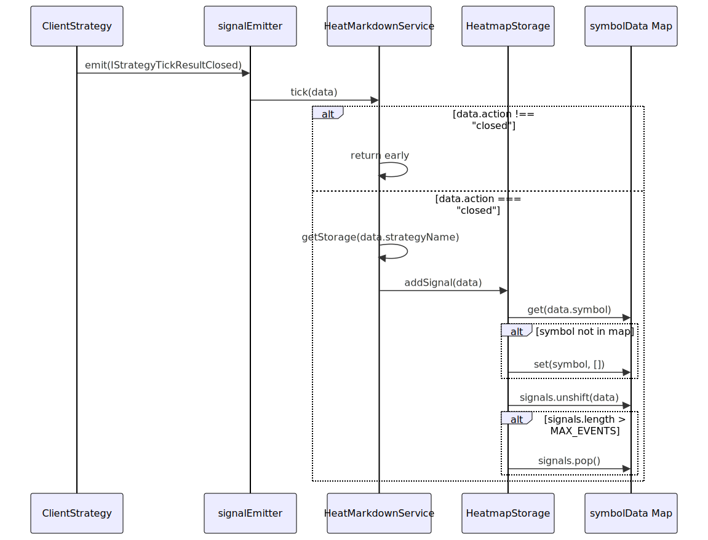

# Heatmap Analytics

This page documents the heatmap analytics system, which aggregates trading performance across multiple symbols for portfolio-wide analysis. The system tracks per-symbol and portfolio-level metrics for a single strategy executing across multiple trading pairs.

For individual symbol-strategy pair statistics in backtest mode, see [Backtest Reports](./73_Performance_Metrics.md). For live trading reports, see [Live Trading Reports](./73_Performance_Metrics.md). For multi-strategy comparison, see [Walker Mode Reports](./66_Walker_Reports.md).

## Purpose and Scope

The heatmap analytics system provides portfolio-level performance visualization by aggregating closed signal data across all symbols that a single strategy trades. It calculates per-symbol statistics (PNL, Sharpe ratio, max drawdown, win rate) and portfolio-wide aggregated metrics. The system generates markdown reports with tabular breakdowns showing which symbols perform best and which are underperforming.

Key characteristics:
- **Strategy-scoped aggregation**: One heatmap per strategy name, aggregating all symbols
- **Real-time accumulation**: Subscribes to `signalEmitter` to track closed signals as they occur
- **Bounded storage**: Maximum 250 closed signals per symbol per strategy
- **Safe math**: Handles NaN/Infinity gracefully by converting to null

Sources: [src/lib/services/markdown/HeatMarkdownService.ts:1-609]()

## System Architecture



**Service Integration**: `HeatMarkdownService` is instantiated via the dependency injection system and subscribes to `signalEmitter` on first use. Unlike `BacktestMarkdownService` and `LiveMarkdownService` which use `symbol:strategyName` as storage keys, `HeatMarkdownService` uses only `strategyName` as the key because it aggregates across all symbols.

**Storage Strategy**: Each strategy gets exactly one `HeatmapStorage` instance via memoization [src/lib/services/markdown/HeatMarkdownService.ts:442-445](). Within each storage, a `Map<string, IStrategyTickResultClosed[]>` maintains per-symbol closed signal arrays [src/lib/services/markdown/HeatMarkdownService.ts:84]().

Sources: [src/lib/services/markdown/HeatMarkdownService.ts:434-606]()

## Data Model

### Heatmap Row Interface

Each symbol tracked by a strategy has statistics calculated into an `IHeatmapRow` structure:

| Field | Type | Description |
|-------|------|-------------|
| `symbol` | `string` | Trading pair identifier |
| `totalPnl` | `number \| null` | Sum of all PNL percentages |
| `sharpeRatio` | `number \| null` | Risk-adjusted return metric |
| `maxDrawdown` | `number \| null` | Maximum cumulative loss from peak |
| `totalTrades` | `number` | Count of closed signals |
| `winCount` | `number` | Count of profitable trades |
| `lossCount` | `number` | Count of losing trades |
| `winRate` | `number \| null` | Percentage of winning trades |
| `avgPnl` | `number \| null` | Mean PNL per trade |
| `stdDev` | `number \| null` | Standard deviation of returns |
| `profitFactor` | `number \| null` | Total wins / total losses ratio |
| `avgWin` | `number \| null` | Average winning trade PNL |
| `avgLoss` | `number \| null` | Average losing trade PNL |
| `maxWinStreak` | `number` | Longest consecutive wins |
| `maxLossStreak` | `number` | Longest consecutive losses |
| `expectancy` | `number \| null` | Expected PNL per trade |

Sources: [src/interfaces/Heatmap.interface.ts](), [src/lib/services/markdown/HeatMarkdownService.ts:253-271]()

### Portfolio Statistics Model

The `HeatmapStatisticsModel` contains aggregated portfolio-wide data:

```typescript
{
  symbols: IHeatmapRow[],           // Sorted by Sharpe ratio desc
  totalSymbols: number,              // Count of tracked symbols
  portfolioTotalPnl: number | null,  // Sum across all symbols
  portfolioSharpeRatio: number | null, // Trade-weighted average
  portfolioTotalTrades: number       // Total across all symbols
}
```

**Sharpe Ratio Weighting**: The portfolio Sharpe ratio is calculated as a trade-weighted average rather than a simple mean [src/lib/services/markdown/HeatMarkdownService.ts:309-317]():
```
portfolioSharpeRatio = Σ(sharpeRatio_i × totalTrades_i) / portfolioTotalTrades
```

Sources: [src/model/HeatmapStatistics.model.ts](), [src/lib/services/markdown/HeatMarkdownService.ts:278-330]()

## Signal Accumulation Flow



**Event Filtering**: The `tick` method only processes signals where `action === "closed"` [src/lib/services/markdown/HeatMarkdownService.ts:460-462](). Idle, opened, active, and scheduled signals are ignored.

**Deque Behavior**: New signals are added to the front with `unshift`, and old signals are removed from the back with `pop` when exceeding `MAX_EVENTS=250` [src/lib/services/markdown/HeatMarkdownService.ts:99-104](). This maintains a rolling window of the most recent 250 closed signals per symbol.

Sources: [src/lib/services/markdown/HeatMarkdownService.ts:455-466](), [src/lib/services/markdown/HeatMarkdownService.ts:91-105]()

## Per-Symbol Statistics Calculation

The `calculateSymbolStats` method [src/lib/services/markdown/HeatMarkdownService.ts:115-271]() computes all metrics for a single symbol. Key calculations:

### Basic Metrics
```
totalTrades = signals.length
winCount = signals where pnl > 0
lossCount = signals where pnl < 0
winRate = (winCount / totalTrades) × 100
totalPnl = Σ(signal.pnl.pnlPercentage)
avgPnl = totalPnl / totalTrades
```

### Sharpe Ratio
```
variance = Σ((pnl_i - avgPnl)²) / totalTrades
stdDev = √variance
sharpeRatio = avgPnl / stdDev  (if stdDev > 0)
```

### Maximum Drawdown
Calculated iteratively by tracking cumulative PNL and measuring distance from peak [src/lib/services/markdown/HeatMarkdownService.ts:159-178]():
```
for each signal:
  peak += signal.pnl
  if peak > 0:
    currentDrawdown = 0
  else:
    currentDrawdown = |peak|
    maxDrawdown = max(maxDrawdown, currentDrawdown)
```

### Profit Factor
```
sumWins = Σ(pnl where pnl > 0)
sumLosses = |Σ(pnl where pnl < 0)|
profitFactor = sumWins / sumLosses  (if sumLosses > 0)
```

### Expectancy
```
expectancy = (winRate/100) × avgWin + ((100-winRate)/100) × avgLoss
```

**Safe Math**: All calculated values are checked with `isUnsafe()` before returning. If a value is `NaN`, `Infinity`, or not a number, it's set to `null` [src/lib/services/markdown/HeatMarkdownService.ts:242-251]().

Sources: [src/lib/services/markdown/HeatMarkdownService.ts:115-271]()

## Portfolio Aggregation



The `getData` method [src/lib/services/markdown/HeatMarkdownService.ts:278-330]() performs three operations:

1. **Per-symbol statistics**: Calls `calculateSymbolStats` for each symbol in `symbolData` Map
2. **Sorting**: Sorts symbols by Sharpe ratio descending, with nulls last [src/lib/services/markdown/HeatMarkdownService.ts:288-293]()
3. **Portfolio aggregation**: Sums PNL and trades, calculates trade-weighted Sharpe ratio

Sources: [src/lib/services/markdown/HeatMarkdownService.ts:278-330]()

## Public API Methods

### getData(strategyName)

Returns `HeatmapStatisticsModel` with all computed statistics.

```typescript
public getData = async (
  strategyName: StrategyName
): Promise<HeatmapStatisticsModel>
```

**Usage**:
```typescript
const service = new HeatMarkdownService();
const stats = await service.getData("my-strategy");

console.log(`Total symbols: ${stats.totalSymbols}`);
console.log(`Portfolio PNL: ${stats.portfolioTotalPnl}%`);

stats.symbols.forEach(row => {
  console.log(`${row.symbol}: ${row.totalPnl}% (${row.totalTrades} trades)`);
});
```

Sources: [src/lib/services/markdown/HeatMarkdownService.ts:487-495]()

### getReport(strategyName, columns?)

Generates markdown-formatted report with portfolio metrics table.

```typescript
public getReport = async (
  strategyName: StrategyName,
  columns: Columns[] = COLUMN_CONFIG.heat_columns
): Promise<string>
```

**Report Structure**:
1. Title: `# Portfolio Heatmap: {strategyName}`
2. Summary line: Total symbols, portfolio PNL, portfolio Sharpe, total trades
3. Markdown table with per-symbol rows (sorted by Sharpe ratio)

Example output [src/lib/services/markdown/HeatMarkdownService.ts:370-376]():
```markdown
# Portfolio Heatmap: my-strategy

**Total Symbols:** 5 | **Portfolio PNL:** +45.3% | **Portfolio Sharpe:** 1.85 | **Total Trades:** 120

| Symbol | Total PNL | Sharpe | Max DD | Trades | Win Rate | ... |
|--------|-----------|--------|--------|--------|----------|-----|
| BTCUSDT | +15.5% | 2.10 | -2.5% | 45 | 68.9% | ... |
| ETHUSDT | +12.3% | 1.85 | -3.1% | 38 | 63.2% | ... |
```

Sources: [src/lib/services/markdown/HeatMarkdownService.ts:521-530](), [src/lib/services/markdown/HeatMarkdownService.ts:339-377]()

### dump(strategyName, path?, columns?)

Writes markdown report to disk.

```typescript
public dump = async (
  strategyName: StrategyName,
  path = "./dump/heatmap",
  columns: Columns[] = COLUMN_CONFIG.heat_columns
): Promise<void>
```

**File naming**: `{strategyName}.md` in the specified directory.

**Example**:
```typescript
// Saves to ./dump/heatmap/my-strategy.md
await service.dump("my-strategy");

// Custom path: ./reports/my-strategy.md
await service.dump("my-strategy", "./reports");
```

Sources: [src/lib/services/markdown/HeatMarkdownService.ts:553-564](), [src/lib/services/markdown/HeatMarkdownService.ts:386-405]()

### clear(strategyName?)

Clears accumulated data from storage.

```typescript
public clear = async (strategyName?: StrategyName): Promise<void>
```

- **With strategyName**: Clears data for that strategy only
- **Without strategyName**: Clears all strategies' data

Sources: [src/lib/services/markdown/HeatMarkdownService.ts:584-589]()

## Column Configuration

Display columns are defined via `ColumnModel<IHeatmapRow>` interface [src/model/Column.model.ts:26-38](). Default columns are provided in `COLUMN_CONFIG.heat_columns`.

**Column Interface**:
```typescript
interface ColumnModel<T> {
  key: string;                // Unique identifier
  label: string;              // Header display text
  format: (data: T, index: number) => string | Promise<string>;
  isVisible: () => boolean | Promise<boolean>;
}
```

**Example column definitions**:
```typescript
const symbolColumn: Columns = {
  key: "symbol",
  label: "Symbol",
  format: (row) => row.symbol,
  isVisible: () => true
};

const pnlColumn: Columns = {
  key: "totalPnl",
  label: "Total PNL %",
  format: (row) => row.totalPnl !== null 
    ? row.totalPnl.toFixed(2) + '%' 
    : 'N/A',
  isVisible: () => true
};
```

**Custom columns**: Users can pass custom `Columns[]` arrays to `getReport` and `dump` methods to override default display configuration.

Sources: [src/lib/services/markdown/HeatMarkdownService.ts:49](), [src/model/Column.model.ts:1-39](), [src/config/columns.ts]()

## Integration with Other Services



**Key Differences**:

| Service | Storage Key | Scope | Event Source |
|---------|-------------|-------|--------------|
| `BacktestMarkdownService` | `symbol:strategyName` | Per symbol-strategy pair | `signalBacktestEmitter` |
| `LiveMarkdownService` | `symbol:strategyName` | Per symbol-strategy pair | `signalLiveEmitter` |
| `HeatMarkdownService` | `strategyName` | All symbols for strategy | `signalEmitter` (both) |

**Use Cases**:
- **BacktestMarkdownService**: Detailed signal-level analysis for one backtest run
- **LiveMarkdownService**: Real-time monitoring of one live trading pair
- **HeatMarkdownService**: Portfolio-wide performance comparison across multiple symbols

Sources: [src/lib/services/markdown/BacktestMarkdownService.ts:290-293](), [src/lib/services/markdown/LiveMarkdownService.ts:431-434](), [src/lib/services/markdown/HeatMarkdownService.ts:442-445]()

## Initialization and Lifecycle

The service uses lazy initialization with `singleshot` pattern [src/lib/services/markdown/HeatMarkdownService.ts:602-605]():

```typescript
protected init = singleshot(async () => {
  this.loggerService.log("heatMarkdownService init");
  signalEmitter.subscribe(this.tick);
});
```

**Lifecycle**:
1. Service instantiated via DI on first access
2. First call to any public method triggers `init()`
3. `init()` subscribes to `signalEmitter` exactly once
4. `tick()` method processes all subsequent closed signals
5. `clear()` can reset storage without unsubscribing

**Automatic initialization**: Users do not need to manually call `init()`. The service begins accumulating data automatically when first accessed.

Sources: [src/lib/services/markdown/HeatMarkdownService.ts:602-605]()