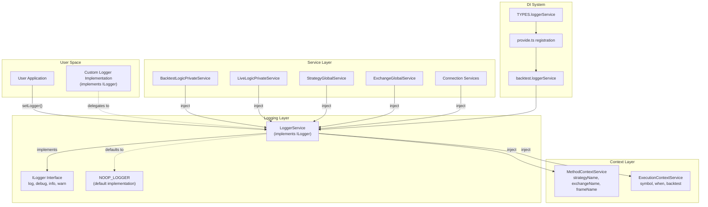
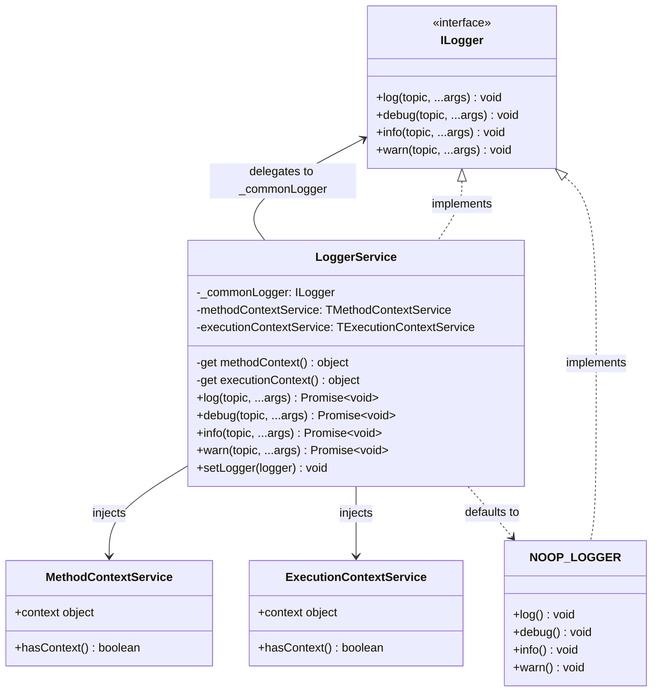
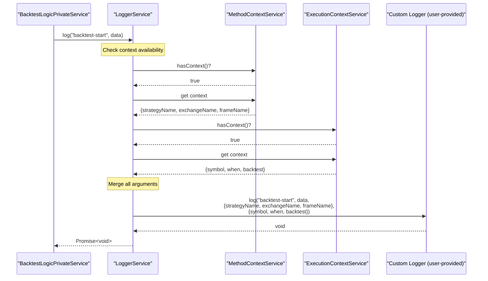
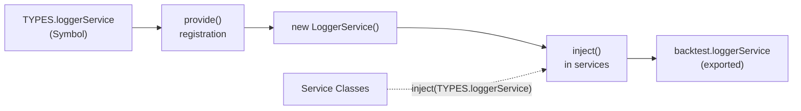

# Logging System

<details>
<summary>Relevant source files</summary>

The following files were used as context for generating this wiki page:

- [assets/uml.svg](assets/uml.svg)
- [docs/internals.md](docs/internals.md)
- [docs/uml.puml](docs/uml.puml)
- [scripts/_convert-md-mermaid-to-svg.cjs](scripts/_convert-md-mermaid-to-svg.cjs)
- [scripts/gpt-docs.mjs](scripts/gpt-docs.mjs)
- [scripts/uml.mjs](scripts/uml.mjs)
- [src/index.ts](src/index.ts)
- [test/index.mjs](test/index.mjs)
- [types.d.ts](types.d.ts)

</details>


The logging system provides consistent, context-aware logging throughout the backtest-kit framework. It automatically enriches log messages with execution context (symbol, timestamp, mode) and method context (strategy name, exchange name, frame name) without requiring explicit parameter passing. The system uses a pluggable architecture that defaults to silent operation and allows users to configure custom logger implementations.

For information about the broader dependency injection architecture, see [Dependency Injection System](#2.2). For context propagation mechanisms, see [Context Propagation](#2.3).

## Architecture Overview

The logging system consists of three primary components: the `ILogger` interface defining the contract, the `LoggerService` implementation providing context-aware logging, and the context services that supply metadata automatically.

### Component Architecture



**Sources:** [src/lib/services/base/LoggerService.ts:1-144](), [src/interfaces/Logger.interface.ts:1-31](), [src/lib/core/types.ts:1-3](), [src/lib/core/provide.ts:24-26](), [src/lib/index.ts:29-31]()

## ILogger Interface

The `ILogger` interface defines the contract for all logger implementations. It provides four severity levels with consistent method signatures.

| Method | Severity | Purpose |
|--------|----------|---------|
| `log()` | General | Record significant events or state changes |
| `debug()` | Debug | Detailed diagnostic information for troubleshooting |
| `info()` | Info | Informational updates about system activity |
| `warn()` | Warning | Potentially problematic situations requiring attention |

### Method Signature

All methods follow the same signature pattern:

```
method(topic: string, ...args: any[]): void
```

- **topic**: Log category or subject
- **args**: Variable number of additional arguments to log

The interface is intentionally simple, allowing any logging library (Winston, Pino, Bunyan, console) to be adapted with minimal wrapper code.

**Sources:** [src/interfaces/Logger.interface.ts:6-30]()

## LoggerService Implementation

`LoggerService` is the core logging implementation that wraps user-provided loggers and automatically enriches messages with context metadata.

### Key Responsibilities

| Responsibility | Implementation |
|---------------|----------------|
| Logger Delegation | Forwards all calls to user-configured logger via `_commonLogger` |
| Context Injection | Automatically appends `methodContext` and `executionContext` to every log call |
| Default Behavior | Uses `NOOP_LOGGER` when no custom logger configured |
| DI Integration | Injects `MethodContextService` and `ExecutionContextService` |

### Internal Structure



**Sources:** [src/lib/services/base/LoggerService.ts:11-143]()

### NOOP_LOGGER Default

The framework defaults to `NOOP_LOGGER`, a silent logger that discards all messages. This design ensures the framework operates without logging overhead unless explicitly configured.

```typescript
// Implementation discards all messages
const NOOP_LOGGER: ILogger = {
  log() { void 0; },
  debug() { void 0; },
  info() { void 0; },
  warn() { void 0; },
};
```

**Sources:** [src/lib/services/base/LoggerService.ts:15-28]()

## Automatic Context Enrichment

`LoggerService` automatically appends context metadata to every log call without requiring explicit parameter passing. This is the system's most important feature.

### Context Enrichment Flow



**Sources:** [src/lib/services/base/LoggerService.ts:42-86]()

### Method Context

Method context provides information about which strategy, exchange, and frame are currently executing. Retrieved from `MethodContextService` using scoped DI.

| Property | Type | Description |
|----------|------|-------------|
| `strategyName` | string | Name of the active strategy |
| `exchangeName` | string | Name of the active exchange |
| `frameName` | string | Name of the active timeframe generator |

Context availability is checked via `MethodContextService.hasContext()` before retrieval. If no context exists, an empty object is appended.

**Sources:** [src/lib/services/base/LoggerService.ts:52-60]()

### Execution Context

Execution context provides information about the current execution state, including trading pair, timestamp, and mode. Retrieved from `ExecutionContextService` using scoped DI.

| Property | Type | Description |
|----------|------|-------------|
| `symbol` | string | Trading pair (e.g., "BTCUSDT") |
| `when` | number | Current timestamp in milliseconds |
| `backtest` | boolean | True if backtesting, false if live trading |

Context availability is checked via `ExecutionContextService.hasContext()` before retrieval. If no context exists, an empty object is appended.

**Sources:** [src/lib/services/base/LoggerService.ts:63-71]()

## Configuration

### Setting a Custom Logger

Users configure custom loggers by calling `setLogger()` on the `LoggerService` instance. This replaces the default `NOOP_LOGGER`.

```typescript
import backtest from 'backtest-kit';

// Configure custom logger
backtest.loggerService.setLogger({
  log: (topic, ...args) => console.log(`[LOG] ${topic}`, ...args),
  debug: (topic, ...args) => console.debug(`[DEBUG] ${topic}`, ...args),
  info: (topic, ...args) => console.info(`[INFO] ${topic}`, ...args),
  warn: (topic, ...args) => console.warn(`[WARN] ${topic}`, ...args),
});
```

**Sources:** [src/lib/services/base/LoggerService.ts:134-140]()

### Integration with Third-Party Loggers

The `ILogger` interface can wrap any logging library. Example with Winston:

```typescript
import winston from 'winston';
import backtest from 'backtest-kit';

const winstonLogger = winston.createLogger({
  level: 'debug',
  format: winston.format.json(),
  transports: [new winston.transports.Console()],
});

backtest.loggerService.setLogger({
  log: (topic, ...args) => winstonLogger.log('info', topic, ...args),
  debug: (topic, ...args) => winstonLogger.debug(topic, ...args),
  info: (topic, ...args) => winstonLogger.info(topic, ...args),
  warn: (topic, ...args) => winstonLogger.warn(topic, ...args),
});
```

## Dependency Injection Integration

`LoggerService` is registered in the DI container and injected into services throughout the framework.

### Registration Flow



**Sources:** [src/lib/core/types.ts:1-3](), [src/lib/core/provide.ts:24-26](), [src/lib/index.ts:29-31]()

### Service Registration

The logger is registered as a singleton in the DI container during framework initialization:

- **Symbol Definition**: `TYPES.loggerService` in [src/lib/core/types.ts:2]()
- **Factory Registration**: `provide(TYPES.loggerService, () => new LoggerService())` in [src/lib/core/provide.ts:25]()
- **Public Export**: `backtest.loggerService` in [src/lib/index.ts:30]()

### Injection Pattern

Services throughout the framework inject `LoggerService` using the standard DI pattern:

```typescript
private readonly loggerService = inject<LoggerService>(TYPES.loggerService);
```

This pattern appears in:
- Logic services (BacktestLogicPrivateService, LiveLogicPrivateService)
- Global services (StrategyGlobalService, ExchangeGlobalService, FrameGlobalService)
- Connection services (StrategyConnectionService, ExchangeConnectionService, FrameConnectionService)
- Schema services (StrategySchemaService, ExchangeSchemaService, FrameSchemaService)

**Sources:** [src/lib/services/base/LoggerService.ts:1-6]()

## Usage Patterns

### Basic Logging

Services log using the injected `LoggerService` instance. Context is automatically appended:

```typescript
// In BacktestLogicPrivateService
await this.loggerService.info(
  'backtest-start',
  { symbol, totalTimeframes: timeframes.length }
);
```

The resulting log output includes automatic context:
```
topic: "backtest-start"
args: [
  { symbol: "BTCUSDT", totalTimeframes: 1000 },
  { strategyName: "momentum", exchangeName: "binance", frameName: "daily" },
  { symbol: "BTCUSDT", when: 1704067200000, backtest: true }
]
```

### Log Levels

Different severity levels serve different purposes:

| Level | Use Case | Example |
|-------|----------|---------|
| `log()` | General events | Signal state changes, execution milestones |
| `debug()` | Diagnostic details | Validation results, intermediate calculations |
| `info()` | Operational updates | Successful completions, configuration changes |
| `warn()` | Potential issues | Missing data, unexpected conditions |

### Async Logging

All `LoggerService` methods return `Promise<void>`, allowing asynchronous logger implementations:

```typescript
// Logger can perform async operations
public log = async (topic: string, ...args: any[]) => {
  await this._commonLogger.log(
    topic,
    ...args,
    this.methodContext,
    this.executionContext
  );
};
```

This design supports remote logging services, database writes, or file I/O without blocking execution.

**Sources:** [src/lib/services/base/LoggerService.ts:79-86]()

## Service Integration Matrix

The following table shows which framework services inject `LoggerService`:

| Service Layer | Services Using Logger |
|---------------|----------------------|
| Logic Services | BacktestLogicPrivateService, BacktestLogicPublicService, LiveLogicPrivateService, LiveLogicPublicService |
| Global Services | StrategyGlobalService, ExchangeGlobalService, FrameGlobalService, LiveGlobalService, BacktestGlobalService |
| Connection Services | StrategyConnectionService, ExchangeConnectionService, FrameConnectionService |
| Schema Services | StrategySchemaService, ExchangeSchemaService, FrameSchemaService |
| Markdown Services | BacktestMarkdownService, LiveMarkdownService |

This pervasive integration ensures consistent logging behavior across all framework components.

**Sources:** Based on architecture analysis from high-level diagrams and [src/lib/core/provide.ts:1-67]()