# Configuration

This page documents the global configuration system in backtest-kit, including runtime parameters, validation thresholds, timing constants, and report formatting options. These configuration values control core trading logic, risk management boundaries, and output presentation.

For component-specific schemas (strategies, exchanges, risks, etc.), see [Component Schemas](./24_Component_Schemas.md). For execution-mode-specific settings, see [Execution Modes](./06_Execution_Modes.md).

---

## Configuration Functions

The framework provides functions to customize global behavior before executing strategies. All configuration must be set before calling `add*` registration functions or execution methods.

**Configuration API**:

| Function | Purpose | File Reference |
|----------|---------|----------------|
| `setLogger(logger)` | Replace default console logger | [src/index.ts:2]() |
| `setConfig(config)` | Override default global configuration | [src/index.ts:3]() |
| `getConfig()` | Retrieve current global configuration | [src/index.ts:4]() |
| `getDefaultConfig()` | Retrieve factory default configuration | [src/index.ts:5]() |
| `setColumns(columns)` | Customize markdown report columns | [src/index.ts:6]() |
| `getColumns()` | Retrieve current column configuration | [src/index.ts:7]() |
| `getDefaultColumns()` | Retrieve factory default columns | [src/index.ts:8]() |

**Example: Custom Configuration**
```typescript
import { setConfig, setLogger } from 'backtest-kit';

// Custom logger for production monitoring
setLogger({
  log: (topic, ...args) => monitoring.info(topic, args),
  debug: (topic, ...args) => monitoring.debug(topic, args),
  info: (topic, ...args) => monitoring.info(topic, args),
  warn: (topic, ...args) => monitoring.warn(topic, args),
});

// Override slippage and fees for conservative estimates
setConfig({
  slippage: 0.002,  // 0.2% slippage (more conservative)
  fees: 0.002,      // 0.2% trading fees
  vwapCandleCount: 10,  // Use 10 candles for VWAP calculation
});
```


---

## Global Configuration Object

The `GlobalConfig` type defines runtime parameters that affect profit/loss calculations, price execution, and validation logic across all strategies and exchanges.



**Configuration Properties**:

| Property | Type | Default | Purpose | Used By |
|----------|------|---------|---------|---------|
| `slippage` | `number` | `0.001` (0.1%) | Price execution impact applied to entry/exit | `IStrategyPnL` calculation |
| `fees` | `number` | `0.001` (0.1%) | Trading commission per trade | `IStrategyPnL` calculation |
| `vwapCandleCount` | `number` | `5` | Number of 1m candles for VWAP calculation | `ClientExchange.getAveragePrice()` |
| `minTakeProfitDistancePercent` | `number` | `0.5` (0.5%) | Minimum distance from entry to take profit | Signal validation |
| `minStopLossDistancePercent` | `number` | `0.3` (0.3%) | Minimum distance from entry to stop loss | Signal validation |
| `maxStopLossDistancePercent` | `number` | `10.0` (10%) | Maximum distance from entry to stop loss | Signal validation |
| `scheduleAwaitMinutes` | `number` | `60` | Timeout for scheduled signals awaiting activation | Scheduled signal cancellation |
| `maxSignalLifetimeMinutes` | `number` | `1440` (24h) | Maximum duration for active signals | Active signal timeout |
| `tickTTL` | `number` | `60000` (1min) | Sleep interval between live mode ticks | `LiveLogicPrivateService` loop |


---

## Profit and Loss Configuration

The `slippage` and `fees` parameters directly affect PNL calculations for closed signals. These values model realistic trading costs and are applied to both entry and exit prices.

**PNL Calculation Formula**:

```
For LONG positions:
  adjustedPriceOpen = priceOpen × (1 + slippage + fees)
  adjustedPriceClose = priceClose × (1 - slippage - fees)
  pnlPercentage = ((adjustedPriceClose - adjustedPriceOpen) / adjustedPriceOpen) × 100

For SHORT positions:
  adjustedPriceOpen = priceOpen × (1 - slippage - fees)
  adjustedPriceClose = priceClose × (1 + slippage + fees)
  pnlPercentage = ((adjustedPriceOpen - adjustedPriceClose) / adjustedPriceOpen) × 100
```



**Example: Conservative vs Aggressive Configuration**
```typescript
// Conservative: Higher costs for realistic backtests
setConfig({
  slippage: 0.002,  // 0.2% slippage (market orders in low liquidity)
  fees: 0.002,      // 0.2% fees (non-VIP tier)
});

// Aggressive: Lower costs for limit orders with maker rebates
setConfig({
  slippage: 0.0005, // 0.05% slippage (limit orders)
  fees: 0.0005,     // 0.05% fees (VIP tier with rebates)
});
```


---

## VWAP Configuration

The `vwapCandleCount` parameter controls how many 1-minute candles are used to calculate the Volume Weighted Average Price for signal entry/exit prices. VWAP provides more realistic execution pricing than simple close prices.

**VWAP Formula**:
```
VWAP = Σ(Typical Price × Volume) / Σ(Volume)
where Typical Price = (High + Low + Close) / 3
```



**Configuration Impact**:

| `vwapCandleCount` | Behavior | Use Case |
|-------------------|----------|----------|
| `5` (default) | Last 5 minutes of data | Standard execution pricing |
| `10` | Last 10 minutes of data | Smoother price averaging for volatile markets |
| `1` | Current candle only | Simpler close-price execution (faster but less realistic) |
| `60` | Last hour of data | Very smooth pricing for illiquid markets |

**Example: Adjust VWAP Window**
```typescript
// Use more candles for smoother VWAP in volatile markets
setConfig({
  vwapCandleCount: 15,  // 15-minute VWAP window
});
```


---

## Validation Parameters

Validation parameters enforce minimum and maximum distances between entry price and take profit/stop loss targets. These prevent unrealistic signals with impossible profit targets or insufficient risk management.



**Validation Parameters**:

| Parameter | Default | Purpose | Example Rejection |
|-----------|---------|---------|-------------------|
| `minTakeProfitDistancePercent` | `0.5%` | Ensures meaningful profit targets | TP only 0.2% away from entry |
| `minStopLossDistancePercent` | `0.3%` | Prevents micro stop losses from noise | SL only 0.1% away from entry |
| `maxStopLossDistancePercent` | `10%` | Caps maximum acceptable loss | SL 15% away from entry |

**Example: Adjust Validation Thresholds**
```typescript
// Scalping strategy: Allow tighter targets
setConfig({
  minTakeProfitDistancePercent: 0.2,  // 0.2% minimum TP
  minStopLossDistancePercent: 0.15,   // 0.15% minimum SL
  maxStopLossDistancePercent: 5,      // 5% maximum SL
});

// Swing trading: Require larger targets
setConfig({
  minTakeProfitDistancePercent: 2,    // 2% minimum TP
  minStopLossDistancePercent: 1,      // 1% minimum SL
  maxStopLossDistancePercent: 20,     // 20% maximum SL
});
```

**Validation Errors**:
```typescript
// Example validation error messages
"Take profit distance (0.3%) must be at least 0.5%"
"Stop loss distance (0.2%) must be at least 0.3%"
"Stop loss distance (12%) exceeds maximum of 10%"
"Take profit must be greater than entry price for LONG positions"
"Take profit must be less than entry price for SHORT positions"
```


---

## Timing Parameters

Timing parameters control signal lifecycle durations and live mode execution frequency. These prevent signals from remaining active indefinitely and control the rate of market data queries.



**Timing Parameters**:

| Parameter | Default | Unit | Purpose | Component |
|-----------|---------|------|---------|-----------|
| `scheduleAwaitMinutes` | `60` | minutes | Timeout for scheduled signals awaiting activation | `ClientStrategy` scheduled signal monitoring |
| `maxSignalLifetimeMinutes` | `1440` (24h) | minutes | Maximum duration for active signals before forced close | `ClientStrategy` active signal monitoring |
| `tickTTL` | `60000` (1min) | milliseconds | Sleep interval between live mode ticks | `LiveLogicPrivateService` loop |

**Scheduled Signal Timeout Behavior**:

When a scheduled signal (with `priceOpen` specified) is created, it waits for the market price to reach `priceOpen`. If `scheduleAwaitMinutes` elapses before activation:

1. Signal transitions to `action: "cancelled"`
2. `IStrategyTickResultCancelled` emitted via `signalEmitter`
3. No PNL impact (position never opened)
4. Callback `onCancel()` invoked (if registered)

**Active Signal Lifetime Behavior**:

When an active signal (pending or monitoring TP/SL) exceeds `maxSignalLifetimeMinutes`:

1. Signal transitions to `action: "closed"`
2. `closeReason: "time_expired"`
3. PNL calculated using current VWAP price
4. `IStrategyTickResultClosed` emitted via `signalEmitter`
5. Callback `onClose()` invoked (if registered)

**Live Mode Tick Rate**:

The `tickTTL` parameter controls the sleep interval between strategy ticks in live mode:

```typescript
// Live mode execution loop (simplified)
while (!stopped) {
  await strategy.tick(symbol, new Date());  // Process strategy logic
  await sleep(config.tickTTL);              // Sleep before next tick
}
```

**Example: Adjust Timing Parameters**
```typescript
// Fast trading: Short timeouts and quick ticks
setConfig({
  scheduleAwaitMinutes: 15,         // 15-minute timeout for scheduled signals
  maxSignalLifetimeMinutes: 360,    // 6-hour maximum signal lifetime
  tickTTL: 30000,                   // 30-second tick interval
});

// Slow trading: Long timeouts and relaxed ticks
setConfig({
  scheduleAwaitMinutes: 240,        // 4-hour timeout for scheduled signals
  maxSignalLifetimeMinutes: 4320,   // 3-day maximum signal lifetime
  tickTTL: 300000,                  // 5-minute tick interval
});
```


---

## Column Configuration

The column configuration controls which fields are displayed in markdown reports. This allows customization of report tables for different analysis needs without modifying report generation code.

**Default Columns**:

```typescript
interface ColumnConfig {
  // Signal identification
  id: boolean;              // Signal UUID
  symbol: boolean;          // Trading pair
  strategyName: boolean;    // Strategy identifier
  exchangeName: boolean;    // Exchange identifier
  
  // Signal parameters
  position: boolean;        // "long" | "short"
  note: boolean;            // Human-readable reason
  priceOpen: boolean;       // Entry price
  priceTakeProfit: boolean; // Take profit target
  priceStopLoss: boolean;   // Stop loss target
  minuteEstimatedTime: boolean; // Expected duration
  
  // Signal lifecycle
  scheduledAt: boolean;     // Signal creation timestamp
  pendingAt: boolean;       // Position open timestamp
  closeTimestamp: boolean;  // Position close timestamp
  closeReason: boolean;     // "take_profit" | "stop_loss" | "time_expired"
  
  // Performance metrics
  pnlPercentage: boolean;   // Profit/loss percentage
  priceClose: boolean;      // Exit price
  currentPrice: boolean;    // Current market price (for active signals)
  percentTp: boolean;       // Progress towards TP (0-100%)
  percentSl: boolean;       // Progress towards SL (0-100%)
}
```

**Example: Minimal Report Columns**
```typescript
import { setColumns } from 'backtest-kit';

// Show only essential trading information
setColumns({
  id: false,                // Hide UUID
  symbol: true,
  strategyName: false,      // Hide strategy name
  exchangeName: false,      // Hide exchange name
  position: true,
  note: false,              // Hide notes
  priceOpen: true,
  priceTakeProfit: true,
  priceStopLoss: true,
  minuteEstimatedTime: false,
  scheduledAt: false,
  pendingAt: true,
  closeTimestamp: true,
  closeReason: true,
  pnlPercentage: true,
  priceClose: true,
  currentPrice: false,
  percentTp: false,
  percentSl: false,
});
```

**Example: Full Diagnostic Columns**
```typescript
import { setColumns, getDefaultColumns } from 'backtest-kit';

// Start with defaults and enable all columns
const allColumns = getDefaultColumns();
Object.keys(allColumns).forEach(key => {
  allColumns[key] = true;
});

setColumns(allColumns);
```

**Report Generation Services**:

| Service | Report Type | Uses Column Config |
|---------|-------------|-------------------|
| `BacktestMarkdownService` | Backtest signal history | Yes |
| `LiveMarkdownService` | Live trading signals | Yes |
| `WalkerMarkdownService` | Strategy comparison results | Yes |
| `ScheduleMarkdownService` | Scheduled signals | Yes |
| `PartialMarkdownService` | Partial profit/loss milestones | Yes |


---

## Configuration Validation

Configuration values are validated on initialization to prevent invalid system behavior. The `ConfigValidationService` ensures all parameters are within acceptable ranges.


**Validation Ranges**:

| Parameter | Validation Rule | Error Message |
|-----------|----------------|---------------|
| `slippage` | `0 <= value <= 1` | "Slippage must be between 0 and 1 (0% to 100%)" |
| `fees` | `0 <= value <= 1` | "Fees must be between 0 and 1 (0% to 100%)" |
| `vwapCandleCount` | `1 <= value <= 60` | "VWAP candle count must be between 1 and 60" |
| `minTakeProfitDistancePercent` | `0 < value <= 100` | "Min TP distance must be positive and <= 100%" |
| `minStopLossDistancePercent` | `0 < value <= 100` | "Min SL distance must be positive and <= 100%" |
| `maxStopLossDistancePercent` | `0 < value <= 100` | "Max SL distance must be positive and <= 100%" |
| `scheduleAwaitMinutes` | `value > 0` | "Schedule await minutes must be positive" |
| `maxSignalLifetimeMinutes` | `value > 0` | "Max signal lifetime minutes must be positive" |
| `tickTTL` | `value >= 1000` | "Tick TTL must be at least 1000ms (1 second)" |

**Example: Validation Error**
```typescript
import { setConfig } from 'backtest-kit';

// This will throw ValidationError
setConfig({
  slippage: 1.5,  // ERROR: > 1 (100%)
  fees: -0.001,   // ERROR: < 0
  vwapCandleCount: 100, // ERROR: > 60
  tickTTL: 500,   // ERROR: < 1000
});
```


---

## Configuration Best Practices

**Backtesting Configuration**:
- Use conservative `slippage` and `fees` values (0.2% each) for realistic results
- Set `vwapCandleCount` based on market liquidity (higher for illiquid markets)
- Adjust validation parameters to match strategy timeframe (tighter for scalping, looser for swing trading)
- Set `maxSignalLifetimeMinutes` based on expected holding period

**Live Trading Configuration**:
- Use actual exchange fee schedule for `fees` parameter
- Measure actual slippage from paper trading and configure accordingly
- Set `tickTTL` based on strategy requirements (lower for faster strategies)
- Configure `scheduleAwaitMinutes` conservatively to avoid premature cancellations

**Development Configuration**:
- Enable all columns via `setColumns()` for full diagnostic visibility
- Use custom logger with `setLogger()` to integrate with monitoring systems
- Test edge cases with extreme configuration values to verify validation

**Performance Optimization**:
- Increase `vwapCandleCount` cautiously (more candles = more database queries)
- Set `tickTTL` as high as acceptable to reduce CPU usage in live mode
- Use `getDefaultConfig()` as baseline and override only necessary parameters

