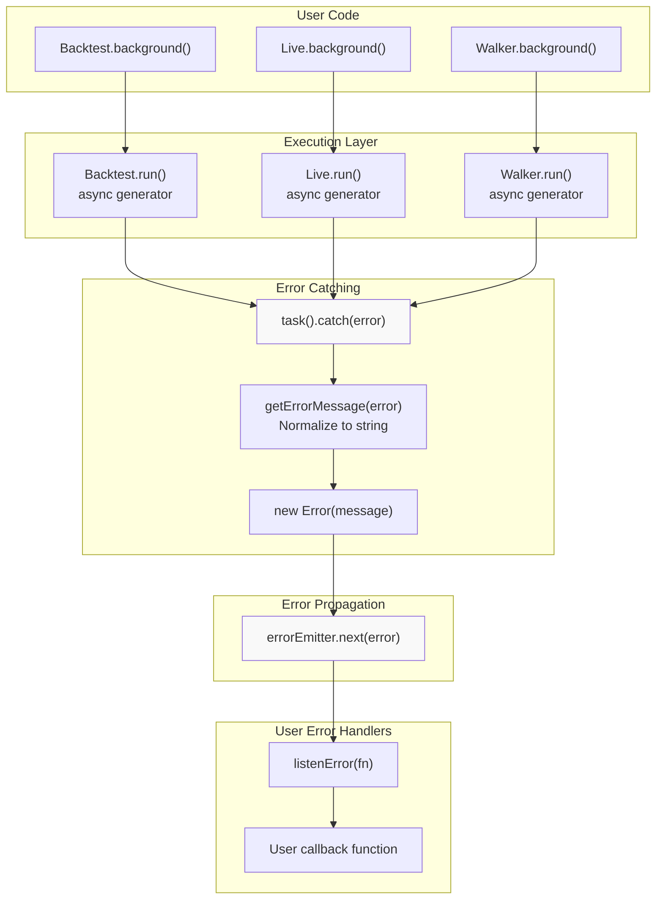
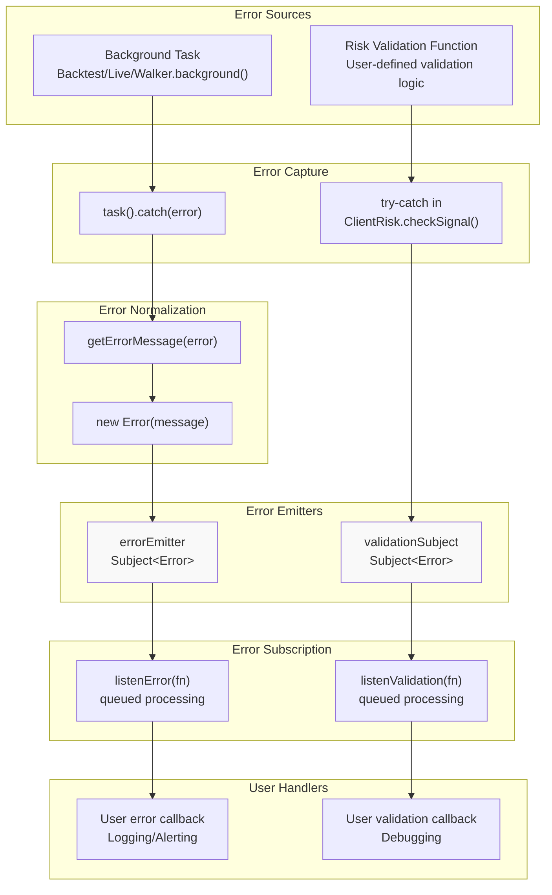
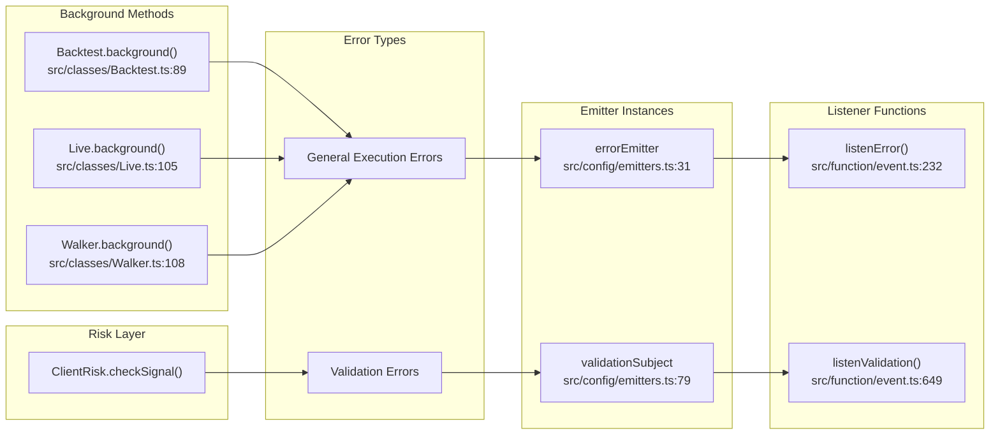
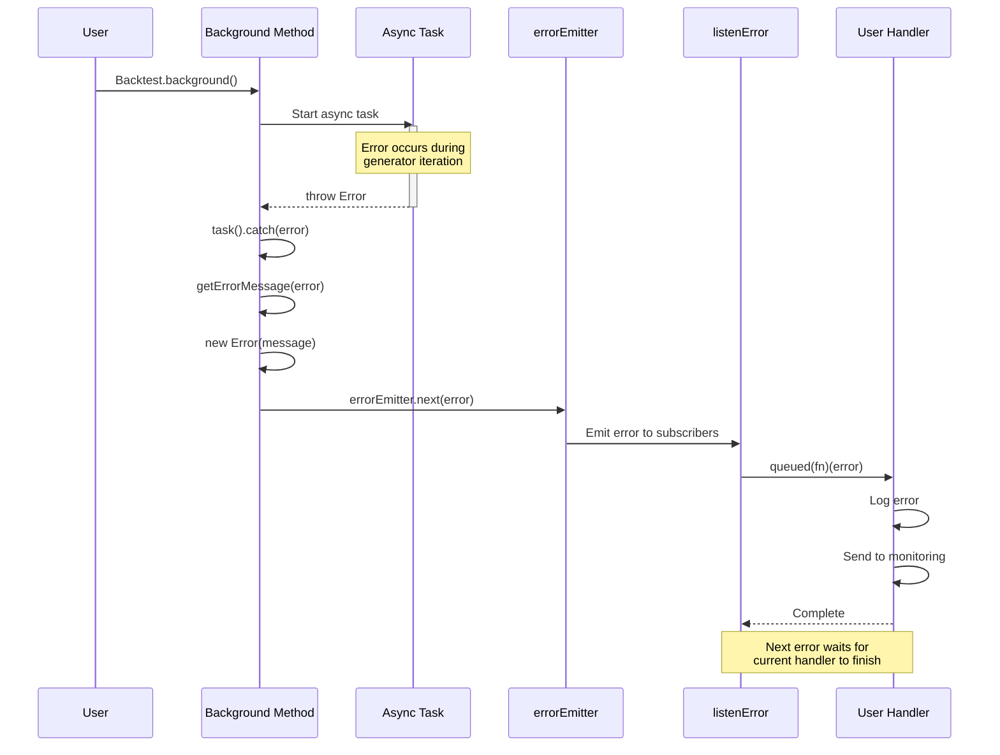

# Error Handling

<details>
<summary>Relevant source files</summary>

The following files were used as context for generating this wiki page:

- [src/classes/Backtest.ts](src/classes/Backtest.ts)
- [src/classes/Live.ts](src/classes/Live.ts)
- [src/classes/Walker.ts](src/classes/Walker.ts)
- [src/config/emitters.ts](src/config/emitters.ts)
- [src/function/event.ts](src/function/event.ts)
- [src/index.ts](src/index.ts)
- [test/index.mjs](test/index.mjs)
- [types.d.ts](types.d.ts)

</details>


This document describes the framework's error handling infrastructure, including error propagation channels, background task error management, risk validation error handling, and event-based error subscription patterns.

Error handling in backtest-kit is built on a pub-sub event system using `Subject` emitters from `functools-kit`. Errors are caught at execution boundaries and propagated to subscribers via two dedicated error channels: `errorEmitter` for general background execution failures and `validationSubject` for risk validation failures.

For information about the general event system architecture, see [Event System](#3.4). For risk validation logic, see [Risk Validation](#12.2). For logging configuration, see [Logging System](#15.1).

---

## Error Propagation Channels

The framework provides two distinct error emitter channels, each handling specific error categories:

| Error Emitter | Purpose | Source Operations | Event Type |
|--------------|---------|------------------|------------|
| `errorEmitter` | General execution errors | `Backtest.background()`, `Live.background()`, `Walker.background()` | `Error` |
| `validationSubject` | Risk validation failures | `ClientRisk.checkSignal()` validation function throws | `Error` |

### errorEmitter

The `errorEmitter` handles errors from background execution tasks. When `Backtest.background()`, `Live.background()`, or `Walker.background()` encounter unhandled exceptions, they are caught and propagated through this channel.

**Declaration**: [src/config/emitters.ts:28-31]()

```typescript
export const errorEmitter = new Subject<Error>();
```

### validationSubject

The `validationSubject` handles errors thrown by custom risk validation functions. When risk validation logic throws an error during signal checking, it is caught and emitted separately to allow targeted debugging of validation failures.

**Declaration**: [src/config/emitters.ts:75-79]()

```typescript
export const validationSubject = new Subject<Error>();
```

**Sources**: [src/config/emitters.ts:28-31](), [src/config/emitters.ts:75-79]()

---

## Background Task Error Handling

Background execution methods (`*.background()`) wrap async generators in try-catch blocks and propagate errors to `errorEmitter`. This ensures that errors in infinite loops or long-running backtests don't crash the process silently.

### Error Catching Pattern

**Backtest.background()**:

[src/classes/Backtest.ts:114-117]()

```typescript
task().catch((error) =>
  errorEmitter.next(new Error(getErrorMessage(error)))
);
```

**Live.background()**:

[src/classes/Live.ts:130-132]()

```typescript
task().catch((error) =>
  errorEmitter.next(new Error(getErrorMessage(error)))
);
```

**Walker.background()**:

[src/classes/Walker.ts:135-137]()

```typescript
task().catch((error) =>
  errorEmitter.next(new Error(getErrorMessage(error)))
);
```

### Error Message Extraction

All background tasks use `getErrorMessage()` from `functools-kit` to normalize error objects into consistent `Error` instances with string messages. This handles cases where thrown values are not Error objects.

**Sources**: [src/classes/Backtest.ts:114-117](), [src/classes/Live.ts:130-132](), [src/classes/Walker.ts:135-137]()

---

## Background Task Error Flow



**Diagram: Background Task Error Propagation**

This diagram shows how errors in background execution are caught, normalized, and propagated to user error handlers through `errorEmitter`.

**Sources**: [src/classes/Backtest.ts:89-122](), [src/classes/Live.ts:105-137](), [src/classes/Walker.ts:108-144](), [src/config/emitters.ts:28-31]()

---

## Risk Validation Error Handling

Risk validation errors are handled separately from general execution errors. When custom validation functions throw errors during `ClientRisk.checkSignal()`, they are caught and emitted to `validationSubject` while allowing execution to continue.

### Validation Error Flow

Risk validation functions are user-defined and can throw errors to reject signals. These errors are not considered fatal execution errors but rather validation rejections that should be logged and monitored.

The framework catches validation errors at the risk checking boundary and:
1. Emits error to `validationSubject` for debugging/monitoring
2. Returns `false` from `checkSignal()` to reject the signal
3. Allows strategy execution to continue

This pattern enables strategies to continue running even when validation logic has issues, while still providing visibility into validation failures.

**Sources**: [src/config/emitters.ts:75-79](), [types.d.ts:456-474]()

---

## Error Listening Patterns

The framework provides two listener functions for subscribing to error events with queued async processing.

### listenError

Subscribes to general background execution errors with sequential processing.

**Function Signature**: [src/function/event.ts:232-235]()

```typescript
export function listenError(fn: (error: Error) => void)
```

**Parameters**:
- `fn`: Callback function receiving `Error` objects from background task failures

**Returns**: Unsubscribe function to stop listening

**Usage Example**:

```typescript
import { listenError, Backtest } from "backtest-kit";

const unsubscribe = listenError((error) => {
  console.error("Background execution error:", error.message);
  // Send to monitoring service
  reportToSentry(error);
});

Backtest.background("BTCUSDT", {
  strategyName: "my-strategy",
  exchangeName: "binance",
  frameName: "1d-backtest"
});

// Later: stop listening
unsubscribe();
```

### listenValidation

Subscribes to risk validation errors with sequential processing.

**Function Signature**: [src/function/event.ts:649-652]()

```typescript
export function listenValidation(fn: (error: Error) => void)
```

**Parameters**:
- `fn`: Callback function receiving `Error` objects from validation function throws

**Returns**: Unsubscribe function to stop listening

**Usage Example**:

```typescript
import { listenValidation } from "backtest-kit";

const unsubscribe = listenValidation((error) => {
  console.error("Risk validation error:", error.message);
  // Debug validation logic issues
  if (error.message.includes("portfolio limit")) {
    console.warn("Portfolio limit validation failing");
  }
});

// Later: stop listening
unsubscribe();
```

### Queued Processing

Both error listeners use `queued()` wrapper from `functools-kit` to ensure errors are processed sequentially even if callbacks are async. This prevents race conditions in error logging or reporting.

[src/function/event.ts:234]() and [src/function/event.ts:651]()

```typescript
return errorEmitter.subscribe(queued(async (error) => fn(error)));
return validationSubject.subscribe(queued(async (error) => fn(error)));
```

**Sources**: [src/function/event.ts:232-235](), [src/function/event.ts:649-652](), [src/function/event.ts:209-235](), [src/function/event.ts:625-652]()

---

## Error Handling Architecture



**Diagram: Error Handling System Architecture**

This diagram shows the complete error handling pipeline from error sources through capture, normalization, emission, subscription, and user handling.

**Sources**: [src/classes/Backtest.ts:114-117](), [src/classes/Live.ts:130-132](), [src/classes/Walker.ts:135-137](), [src/config/emitters.ts:28-31](), [src/config/emitters.ts:75-79](), [src/function/event.ts:232-235](), [src/function/event.ts:649-652]()

---

## Error-to-Code Entity Mapping



**Diagram: Error Handling Code Entity Mapping**

This diagram maps error types to their corresponding code entities, showing where errors originate and how they flow through specific functions and classes.

**Sources**: [src/config/emitters.ts:28-31](), [src/config/emitters.ts:75-79](), [src/function/event.ts:232](), [src/function/event.ts:649](), [src/classes/Backtest.ts:89](), [src/classes/Live.ts:105](), [src/classes/Walker.ts:108]()

---

## Integration with Logging System

Error handling complements but does not replace the logging system. While errors are emitted through dedicated channels, the framework's logging interface provides a `warn()` method for non-fatal issues that don't require error propagation.

### ILogger.warn()

The `ILogger` interface includes a `warn()` method for recording potentially problematic situations that don't prevent execution:

[types.d.ts:61-66]()

```typescript
warn(topic: string, ...args: any[]): void;
```

**Use Cases**:
- Missing optional data
- Unexpected conditions that don't break functionality
- Deprecated API usage
- Performance degradation warnings

### Error vs Warning Guidelines

| Condition | Handler | Propagation |
|-----------|---------|-------------|
| Background task throws | `errorEmitter.next()` | Yes, to `listenError()` subscribers |
| Validation function throws | `validationSubject.next()` | Yes, to `listenValidation()` subscribers |
| Recoverable issue | `logger.warn()` | No, logged only |
| Fatal issue requiring stop | `throw new Error()` | Yes, caught by background task wrapper |

**Sources**: [types.d.ts:61-66](), [types.d.ts:45-66]()

---

## Error Handling Lifecycle



**Diagram: Error Handling Sequence**

This sequence diagram illustrates the temporal flow of error handling from background task failure through emission and queued processing in user handlers.

**Sources**: [src/classes/Backtest.ts:102-117](), [src/classes/Live.ts:117-132](), [src/classes/Walker.ts:122-137](), [src/config/emitters.ts:28-31](), [src/function/event.ts:232-235]()

---

## Export Locations

All error handling components are exported from the main module:

[src/index.ts:11]()
```typescript
listenError,
```

[src/index.ts:23]()
```typescript
listenValidation,
```

[src/index.ts:126]()
```typescript
export * as emitters from "./config/emitters";
```

Users can access error emitters directly if needed:

```typescript
import { emitters } from "backtest-kit";

emitters.errorEmitter.subscribe((error) => {
  // Direct subscription without wrapper
});
```

**Sources**: [src/index.ts:1-131](), [src/config/emitters.ts:1-81]()