# Validation Parameters

This document describes the global validation parameters that control financial safety constraints in signal generation. These parameters enforce minimum take profit distances, maximum stop loss distances, and signal lifetime limits to protect capital from unprofitable trades, catastrophic losses, and strategy deadlock.

For information about other configuration parameters like timeout and timing constraints, see [Timing Parameters](./80_Timing_Parameters.md). For an overview of the configuration system, see [Global Configuration](./78_Global_Configuration.md). For details on how signals are validated during generation, see [Signal Generation and Validation](./50_Signal_Generation_and_Validation.md).

---

## Overview of Validation Parameters

The framework enforces four critical validation parameters that act as financial guardrails during signal generation. These parameters are part of `GLOBAL_CONFIG` and can be modified via `setConfig()` at runtime.

| Parameter | Type | Default | Purpose |
|-----------|------|---------|---------|
| `CC_MIN_TAKEPROFIT_DISTANCE_PERCENT` | number | 0.5 | Minimum percentage distance between `priceOpen` and `priceTakeProfit` to ensure profit exceeds trading fees |
| `CC_MIN_STOPLOSS_DISTANCE_PERCENT` | number | 0.5 | Minimum percentage distance between `priceOpen` and `priceStopLoss` to prevent instant stop out on market volatility |
| `CC_MAX_STOPLOSS_DISTANCE_PERCENT` | number | 20 | Maximum percentage distance between `priceOpen` and `priceStopLoss` to prevent catastrophic losses |
| `CC_MAX_SIGNAL_LIFETIME_MINUTES` | number | 1440 | Maximum signal duration in minutes to prevent eternal signals blocking risk limits |

These validations occur in the `VALIDATE_SIGNAL_FN` function within `ClientStrategy`, which is called before every signal is created. Signals that fail validation are rejected immediately with descriptive error messages.


---

## Take Profit Distance Validation

### Problem Statement

Trading fees (typically 0.1% per side) create a minimum profit threshold. If `priceTakeProfit` is too close to `priceOpen`, the gross profit will be consumed by fees, resulting in a net loss despite hitting the take profit target.

**Example Scenario:**
- Long position: `priceOpen = 42000`, `priceTakeProfit = 42010` (0.024% profit)
- Fees: 2 × 0.1% = 0.2% total (entry + exit)
- Net PNL: 0.024% - 0.2% = **-0.176% loss**

Even hitting take profit results in a net loss because the gross profit fails to cover trading fees.

### Validation Logic


**Diagram: Take Profit Distance Validation Flow**

The validation calculates the percentage distance between entry price and take profit target, then compares it against `CC_MIN_TAKEPROFIT_DISTANCE_PERCENT`. For long positions, TP must be above entry. For short positions, TP must be below entry.

**Long Position Validation** ([src/client/ClientStrategy.ts:138-148]()):
```typescript
const tpDistancePercent = ((signal.priceTakeProfit - signal.priceOpen) / signal.priceOpen) * 100;
if (tpDistancePercent < GLOBAL_CONFIG.CC_MIN_TAKEPROFIT_DISTANCE_PERCENT) {
  errors.push(
    `Long: TakeProfit too close to priceOpen (${tpDistancePercent.toFixed(3)}%). ` +
    `Minimum distance: ${GLOBAL_CONFIG.CC_MIN_TAKEPROFIT_DISTANCE_PERCENT}% to cover trading fees.`
  );
}
```

**Short Position Validation** ([src/client/ClientStrategy.ts:198-208]()):
```typescript
const tpDistancePercent = ((signal.priceOpen - signal.priceTakeProfit) / signal.priceOpen) * 100;
if (tpDistancePercent < GLOBAL_CONFIG.CC_MIN_TAKEPROFIT_DISTANCE_PERCENT) {
  errors.push(
    `Short: TakeProfit too close to priceOpen (${tpDistancePercent.toFixed(3)}%). ` +
    `Minimum distance: ${GLOBAL_CONFIG.CC_MIN_TAKEPROFIT_DISTANCE_PERCENT}% to cover trading fees.`
  );
}
```

### Default Value Justification

The default value of `0.5%` provides a safety margin above trading fees:
- Slippage effect: 2 × 0.1% = 0.2% total (entry + exit)
- Exchange fees: 2 × 0.1% = 0.2% total (entry + exit)
- Total costs: 0.4%
- Additional margin: 0.5% - 0.4% = **0.1% minimum profit buffer**
- Ensures every TP hit produces positive net PNL after fees and slippage
- Can be increased to enforce larger minimum profits (e.g., 1.0% for conservative strategies)
- Can be decreased to 0.2% for zero-fee/zero-slippage testing environments
- Can be set to `0` to disable validation (only for testing environments)


---

## Minimum Stop Loss Distance Validation

### Problem Statement

Stop losses positioned too close to the entry price can result in instant stop-outs due to normal market volatility or spread fluctuations. This creates a scenario where positions are closed immediately after opening, even when the strategy's directional bias is correct.

**Example Scenario:**
- Long position: `priceOpen = 42000`, `priceStopLoss = 41990` (0.024% distance)
- Normal volatility: ±0.1% (±42 price points)
- Market briefly dips to 41980 (-0.048%), hits SL immediately
- Position closed with loss before strategy thesis can play out

Even with correct market direction, tight stop losses guarantee losses from noise.

### Validation Logic



**Diagram: Minimum Stop Loss Distance Validation Flow**

The validation calculates the percentage distance between entry price and stop loss, then compares it against `CC_MIN_STOPLOSS_DISTANCE_PERCENT`. For long positions, SL must be below entry with sufficient buffer. For short positions, SL must be above entry with sufficient buffer.

**Long Position Validation** ([src/client/ClientStrategy.ts:176-186]()):
```typescript
const slDistancePercent = ((signal.priceOpen - signal.priceStopLoss) / signal.priceOpen) * 100;
if (slDistancePercent < GLOBAL_CONFIG.CC_MIN_STOPLOSS_DISTANCE_PERCENT) {
  errors.push(
    `Long: StopLoss too close to priceOpen (${slDistancePercent.toFixed(3)}%). ` +
    `Minimum distance: ${GLOBAL_CONFIG.CC_MIN_STOPLOSS_DISTANCE_PERCENT}% to avoid instant stop out on market volatility. ` +
    `Current: SL=${signal.priceStopLoss}, Open=${signal.priceOpen}`
  );
}
```

**Short Position Validation** ([src/client/ClientStrategy.ts:267-277]()):
```typescript
const slDistancePercent = ((signal.priceStopLoss - signal.priceOpen) / signal.priceOpen) * 100;
if (slDistancePercent < GLOBAL_CONFIG.CC_MIN_STOPLOSS_DISTANCE_PERCENT) {
  errors.push(
    `Short: StopLoss too close to priceOpen (${slDistancePercent.toFixed(3)}%). ` +
    `Minimum distance: ${GLOBAL_CONFIG.CC_MIN_STOPLOSS_DISTANCE_PERCENT}% to avoid instant stop out on market volatility. ` +
    `Current: SL=${signal.priceStopLoss}, Open=${signal.priceOpen}`
  );
}
```

### Default Value Justification

The default value of `0.5%` provides a buffer against normal market noise:
- Prevents instant stop-outs from bid-ask spread fluctuations
- Allows position to survive normal volatility (±0.2-0.3% intraday moves)
- Ensures stop loss serves its intended purpose (protecting against adverse moves, not noise)
- Can be decreased to `0.2-0.3%` for stable forex pairs with tight spreads
- Can be increased to `1-2%` for volatile crypto markets
- Should not be set to `0` in production (disables protection against micro-stops)


---

## Maximum Stop Loss Distance Validation

### Problem Statement

Excessively wide stop losses can expose the portfolio to catastrophic single-trade losses. A stop loss positioned 50% below entry would lose half the position size in one trade, potentially destroying the strategy's expected value.

**Example Scenario:**
- Long position: `priceOpen = 42000`, `priceStopLoss = 20000` (52.4% loss)
- With 10% position sizing: -5.24% portfolio loss on one signal
- After 4 consecutive stop loss hits: portfolio down -20%

### Validation Logic


**Diagram: Stop Loss Distance Validation Flow**

The validation calculates the percentage distance between entry price and stop loss target, then compares it against `CC_MAX_STOPLOSS_DISTANCE_PERCENT`. For long positions, SL must be below entry. For short positions, SL must be above entry.

**Long Position Validation** ([src/client/ClientStrategy.ts:189-199]()):
```typescript
const slDistancePercent = ((signal.priceOpen - signal.priceStopLoss) / signal.priceOpen) * 100;
if (slDistancePercent > GLOBAL_CONFIG.CC_MAX_STOPLOSS_DISTANCE_PERCENT) {
  errors.push(
    `Long: StopLoss too far from priceOpen (${slDistancePercent.toFixed(3)}%). ` +
    `Maximum distance: ${GLOBAL_CONFIG.CC_MAX_STOPLOSS_DISTANCE_PERCENT}% to protect capital. ` +
    `Current: SL=${signal.priceStopLoss}, Open=${signal.priceOpen}`
  );
}
```

**Short Position Validation** ([src/client/ClientStrategy.ts:280-290]()):
```typescript
const slDistancePercent = ((signal.priceStopLoss - signal.priceOpen) / signal.priceOpen) * 100;
if (slDistancePercent > GLOBAL_CONFIG.CC_MAX_STOPLOSS_DISTANCE_PERCENT) {
  errors.push(
    `Short: StopLoss too far from priceOpen (${slDistancePercent.toFixed(3)}%). ` +
    `Maximum distance: ${GLOBAL_CONFIG.CC_MAX_STOPLOSS_DISTANCE_PERCENT}% to protect capital. ` +
    `Current: SL=${signal.priceStopLoss}, Open=${signal.priceOpen}`
  );
}
```

### Default Value Justification

The default value of `20%` represents a reasonable maximum loss per signal:
- Prevents single-trade portfolio destruction
- Allows flexibility for volatile markets
- Enforces risk discipline at the signal level
- Can be tightened to `5-10%` for conservative strategies
- Should not be disabled (set to `100+%`) in production


---

## Signal Lifetime Validation

### Problem Statement

Signals with excessively long `minuteEstimatedTime` can create strategy deadlock by occupying risk limits indefinitely. If a signal expects to remain active for 30+ days, it blocks new signals from being generated, effectively freezing the strategy.

**Example Scenario:**
- Signal with `minuteEstimatedTime = 50000` minutes (34.7 days)
- Risk profile allows `maxConcurrentPositions = 3`
- After 3 such signals open: strategy cannot generate new signals for weeks
- Strategy becomes non-responsive to market changes

### Validation Logic



**Diagram: Signal Lifetime Validation Flow**

The validation compares `minuteEstimatedTime` directly against `CC_MAX_SIGNAL_LIFETIME_MINUTES`. Error messages include human-readable day conversions for clarity.

**Validation Implementation** ([src/client/ClientStrategy.ts:306-316]()):
```typescript
if (signal.minuteEstimatedTime > GLOBAL_CONFIG.CC_MAX_SIGNAL_LIFETIME_MINUTES) {
  const days = (signal.minuteEstimatedTime / 60 / 24).toFixed(1);
  const maxDays = (GLOBAL_CONFIG.CC_MAX_SIGNAL_LIFETIME_MINUTES / 60 / 24).toFixed(0);
  errors.push(
    `minuteEstimatedTime too large (${signal.minuteEstimatedTime} minutes = ${days} days). ` +
    `Maximum: ${GLOBAL_CONFIG.CC_MAX_SIGNAL_LIFETIME_MINUTES} minutes (${maxDays} days) to prevent strategy deadlock. ` +
    `Eternal signals block risk limits and prevent new trades.`
  );
}
```

### Default Value Justification

The default value of `1440 minutes` (1 day):
- Balances flexibility with risk management
- Prevents week-long signals from blocking strategy execution
- Aligns with typical intraday/swing trading timeframes
- Can be increased for longer-term strategies (e.g., 10080 minutes = 1 week)
- Should not be disabled (set to `999999`) in production


---

## Complete Validation Flow

The following diagram shows how validation parameters integrate into the signal generation pipeline:



**Diagram: Complete Signal Validation Flow with Validation Parameters**

The validation occurs in `VALIDATE_SIGNAL_FN` at [src/client/ClientStrategy.ts:45-330](). The function accumulates all validation errors into an array, then throws a single descriptive error if any validations fail. This provides comprehensive feedback to strategy developers.

**Key Validation Stages:**

| Stage | Lines | Validation Logic | Configuration Used |
|-------|-------|------------------|-------------------|
| **Required Fields** | 48-69 | Checks `id`, `exchangeName`, `strategyName`, `symbol`, `position`, `_isScheduled` are non-null/empty | N/A |
| **NaN/Infinity Protection** | 71-96 | Validates `currentPrice`, `priceOpen`, `priceTakeProfit`, `priceStopLoss` are finite numbers | N/A |
| **Positive Price Validation** | 99-109 | Ensures all prices are positive (> 0) | N/A |
| **Long Position Logic** | 112-199 | For `position === "long"`: validates TP > Open > SL, checks all distance constraints | `CC_MIN_TAKEPROFIT_DISTANCE_PERCENT`, `CC_MIN_STOPLOSS_DISTANCE_PERCENT`, `CC_MAX_STOPLOSS_DISTANCE_PERCENT` |
| **Short Position Logic** | 202-290 | For `position === "short"`: validates SL > Open > TP, checks all distance constraints | `CC_MIN_TAKEPROFIT_DISTANCE_PERCENT`, `CC_MIN_STOPLOSS_DISTANCE_PERCENT`, `CC_MAX_STOPLOSS_DISTANCE_PERCENT` |
| **Time Parameter Validation** | 293-323 | Validates `minuteEstimatedTime`, `scheduledAt`, `pendingAt` are positive integers | `CC_MAX_SIGNAL_LIFETIME_MINUTES` |
| **Error Aggregation** | 325-330 | Throws single error with newline-separated list of all failures | N/A |


---

## Configuration via setConfig

Validation parameters can be modified at runtime using the `setConfig()` function. This is typically done during initialization or in test environments.

### Configuration Syntax

```typescript
import { setConfig } from 'backtest-kit';

// Example: Conservative configuration for stable markets
setConfig({
  CC_MIN_TAKEPROFIT_DISTANCE_PERCENT: 1.0,   // Require 1.0% minimum profit (higher than default 0.5%)
  CC_MIN_STOPLOSS_DISTANCE_PERCENT: 0.8,     // Require 0.8% min SL buffer (higher than default 0.5%)
  CC_MAX_STOPLOSS_DISTANCE_PERCENT: 10,      // Allow max 10% stop loss (tighter than default 20%)
  CC_MAX_SIGNAL_LIFETIME_MINUTES: 720,       // Max 12 hours per signal (shorter than default 24h)
});
```

### Configuration Patterns

| Use Case | Configuration | Rationale |
|----------|---------------|-----------|
| **Disable Validation (Testing)** | `CC_MIN_TP: 0`, `CC_MIN_SL: 0`, `CC_MAX_SL: 100`, `CC_MAX_LIFETIME: 999999` | Allows testing edge cases without validation constraints |
| **Conservative Trading** | `CC_MIN_TP: 1.0%`, `CC_MIN_SL: 0.8%`, `CC_MAX_SL: 5%`, `CC_MAX_LIFETIME: 360 min` | Tighter constraints for risk-averse strategies and stable markets |
| **Default (Balanced)** | `CC_MIN_TP: 0.5%`, `CC_MIN_SL: 0.5%`, `CC_MAX_SL: 20%`, `CC_MAX_LIFETIME: 1440 min` | Standard configuration covering fees + slippage + margin, reasonable max loss |
| **Volatile Markets** | `CC_MIN_TP: 0.8%`, `CC_MIN_SL: 1.0%`, `CC_MAX_SL: 30%`, `CC_MAX_LIFETIME: 2880 min` | Higher margins to handle volatility swings, wider SL tolerance |
| **Long-term Holding** | `CC_MIN_TP: 2%`, `CC_MIN_SL: 1.0%`, `CC_MAX_SL: 20%`, `CC_MAX_LIFETIME: 10080 min` | Larger minimum profits for multi-day positions, allow 1-week signals |

### Test Environment Configuration

Test files disable validation by default to isolate signal logic testing from validation constraints:

```typescript
// Test environment typically disables validation globally
setConfig({
  CC_MIN_TAKEPROFIT_DISTANCE_PERCENT: 0,      // No TP distance check
  CC_MIN_STOPLOSS_DISTANCE_PERCENT: 0,        // No min SL distance check
  CC_MAX_STOPLOSS_DISTANCE_PERCENT: 100,      // Allow any SL
  CC_MAX_SIGNAL_LIFETIME_MINUTES: 999999,     // No lifetime limit
});
```

Individual tests re-enable specific validations to verify error handling:

```typescript
// Example: Testing TP distance validation in isolation
test("Micro-profit validation", async () => {
  setConfig({
    CC_MIN_TAKEPROFIT_DISTANCE_PERCENT: 0.5,  // Enable TP validation with default value
  });
  
  // Signal with TP too close to Open should throw validation error
  await addStrategy({
    strategyName: "micro-profit-test",
    interval: "5m",
    getSignal: async () => ({
      position: "long",
      priceOpen: 42000,
      priceTakeProfit: 42010,  // 0.024% - below 0.5% threshold
      priceStopLoss: 41000,
      minuteEstimatedTime: 60,
    }),
  });
  // Expected: Signal rejected with "TakeProfit too close to priceOpen" error
});
```

---

## Validation Error Messages

Validation failures produce detailed error messages that help strategy developers diagnose issues:

### Take Profit Error Message Format

```
Long: TakeProfit too close to priceOpen (0.024%). 
Minimum distance: 0.5% to cover trading fees. 
Current: TP=42010, Open=42000
```

The error includes:
- Calculated distance as percentage: `0.024%`
- Configured minimum threshold: `0.3%`
- Actual prices for debugging: `TP=42010, Open=42000`

### Minimum Stop Loss Error Message Format

```
Long: StopLoss too close to priceOpen (0.024%). 
Minimum distance: 0.5% to avoid instant stop out on market volatility. 
Current: SL=41990, Open=42000
```

### Maximum Stop Loss Error Message Format

```
Long: StopLoss too far from priceOpen (52.381%). 
Maximum distance: 20% to protect capital. 
Current: SL=20000, Open=42000
```

### Signal Lifetime Error Message Format

```
minuteEstimatedTime too large (50000 minutes = 34.7 days). 
Maximum: 1440 minutes (1 days) to prevent strategy deadlock. 
Eternal signals block risk limits and prevent new trades.
```

### Error Aggregation

Multiple validation failures are combined into a single error message:

```
Invalid signal for long position:
Long: TakeProfit too close to priceOpen (0.024%). Minimum distance: 0.5% to cover trading fees. Current: TP=42010, Open=42000
Long: StopLoss too close to priceOpen (0.024%). Minimum distance: 0.5% to avoid instant stop out on market volatility. Current: SL=41990, Open=42000
Long: StopLoss too far from priceOpen (52.381%). Maximum distance: 20% to protect capital. Current: SL=20000, Open=42000
minuteEstimatedTime too large (50000 minutes = 34.7 days). Maximum: 1440 minutes (1 days) to prevent strategy deadlock. Eternal signals block risk limits and prevent new trades.
```

This comprehensive error output allows developers to fix all validation issues in a single iteration, reducing trial-and-error debugging cycles.


---

## Default Values and Trade-offs

The table below summarizes default values, their safety guarantees, and when to adjust them:

| Parameter | Default | Safety Guarantee | When to Increase | When to Decrease |
|-----------|---------|-----------------|------------------|------------------|
| `CC_MIN_TAKEPROFIT_DISTANCE_PERCENT` | 0.5% | Prevents fee-eating micro-profits (0.4% total costs + 0.1% margin) | Higher fee exchanges (1%+ for VIP tiers), require larger minimum profit (2-5%) | Zero-fee maker rebate accounts (0.2%), testing environments |
| `CC_MIN_STOPLOSS_DISTANCE_PERCENT` | 0.5% | Prevents instant stop-outs from normal market volatility and spread fluctuations | High-volatility crypto markets (1-2%), assets with wide spreads | Stable forex major pairs with tight spreads (0.2-0.3%), low volatility periods |
| `CC_MAX_STOPLOSS_DISTANCE_PERCENT` | 20% | Prevents catastrophic single-trade losses (max 20% position loss) | High-volatility assets requiring wide stops (crypto 30-40%), low-liquidity markets | Stable forex pairs (10-15%), conservative risk management (5-10%) |
| `CC_MAX_SIGNAL_LIFETIME_MINUTES` | 1440 (1 day) | Prevents strategy deadlock from eternal signals blocking risk limits | Swing trading strategies (10080 = 1 week), position trading (43200 = 1 month) | Scalping strategies (60-120 min), intraday mean reversion (240-480 min) |

### Interaction with Risk Management

These validation parameters work in conjunction with risk profile limits (see [Risk Profiles](./68_Risk_Profiles.md)):



**Diagram: Validation Parameters as First Line of Defense**

Validation parameters act as the first line of defense, rejecting signals before they reach the risk management layer. This prevents invalid signals from consuming risk limit slots or triggering custom validations.

