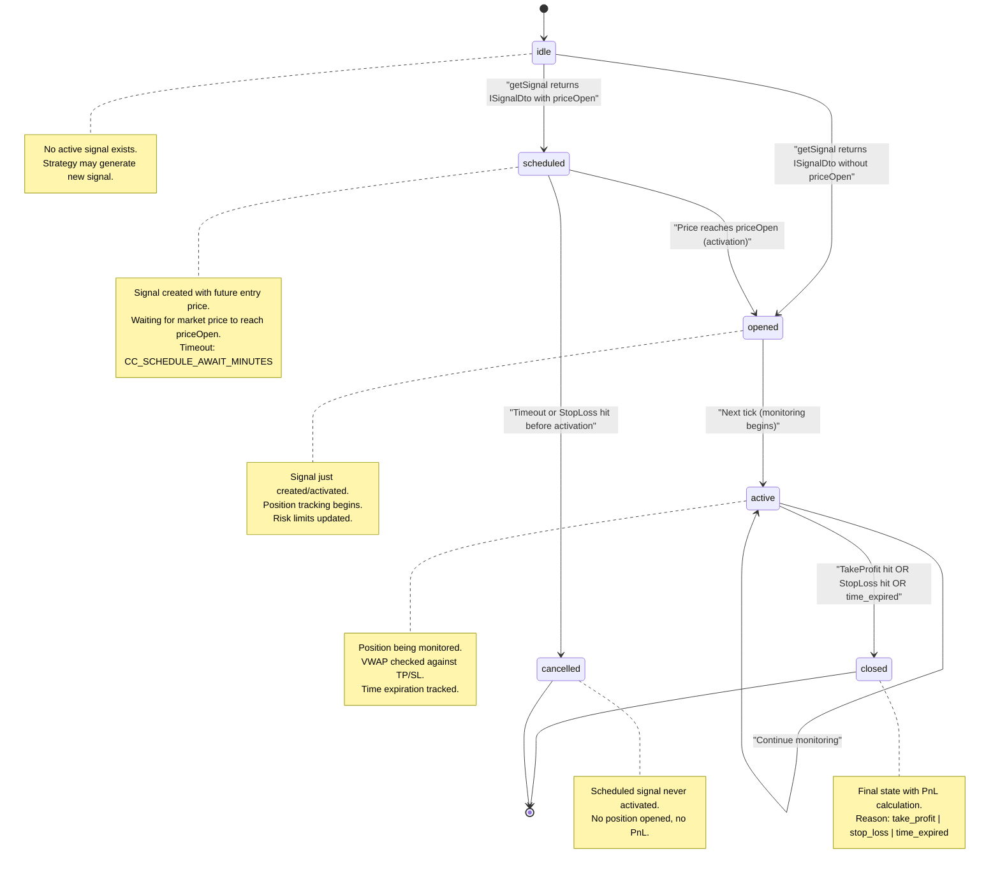
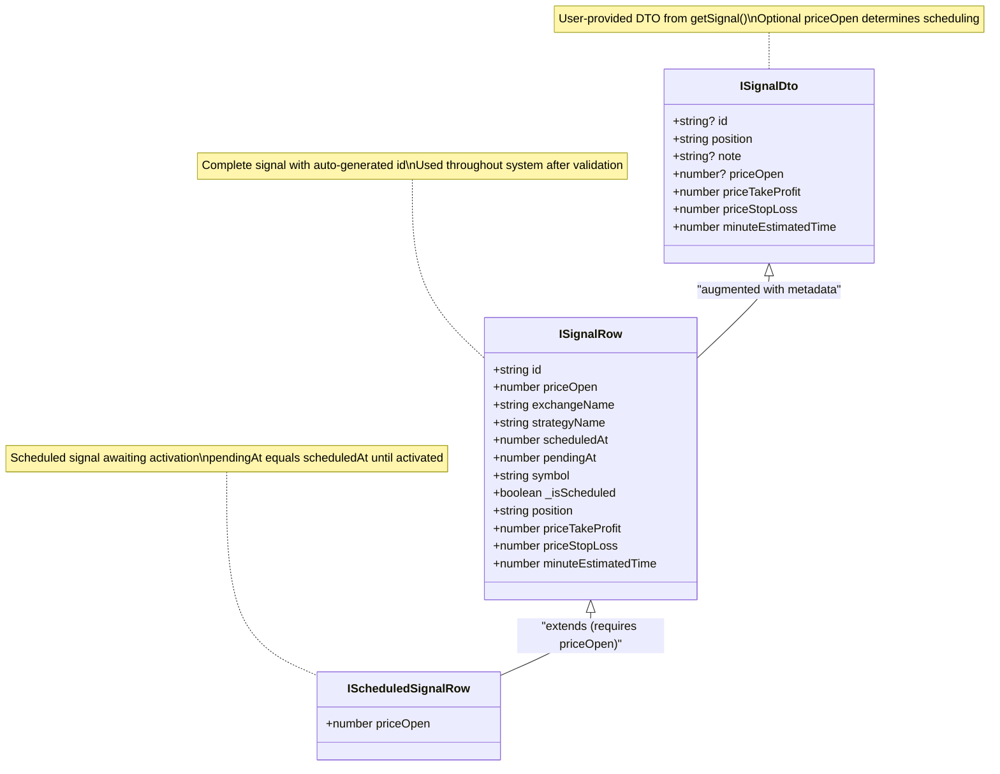
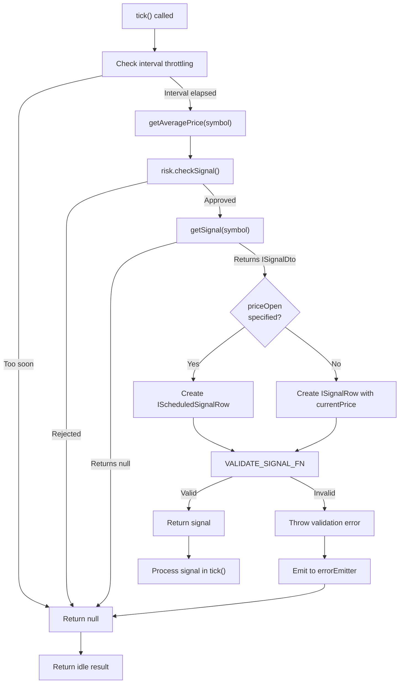
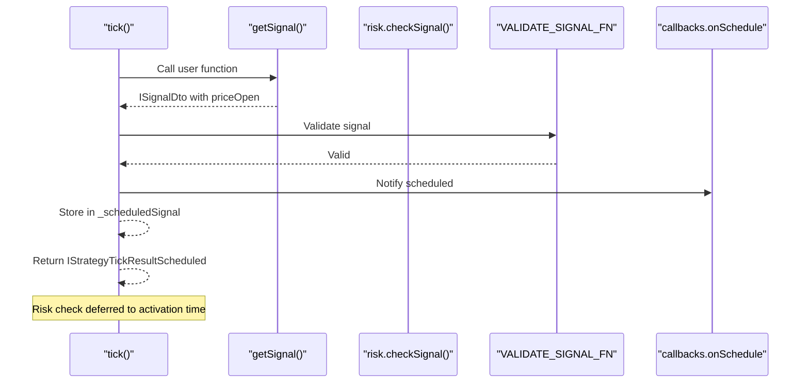
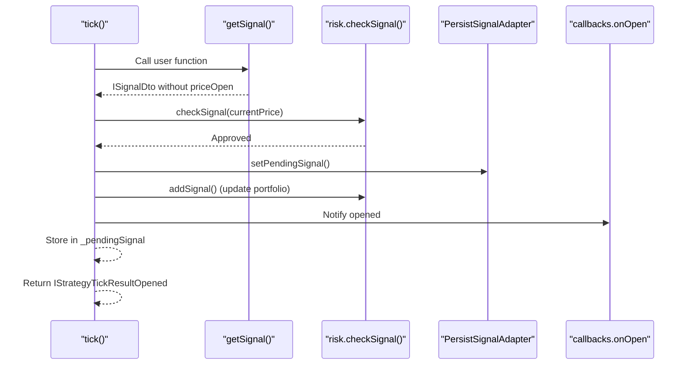
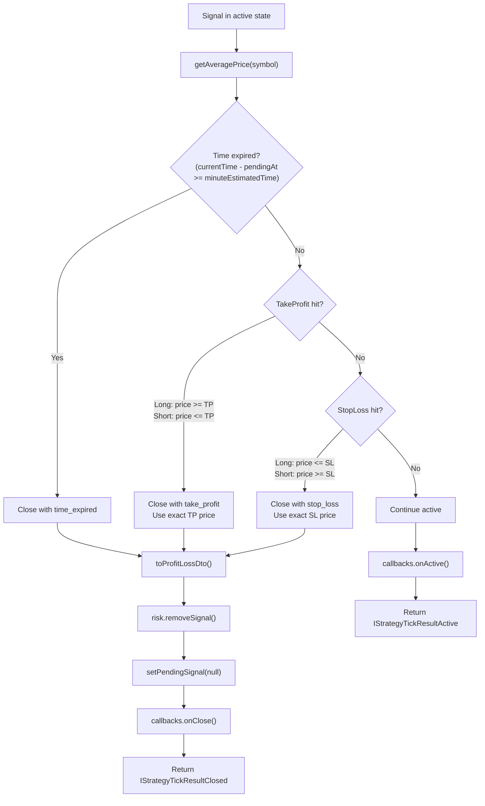
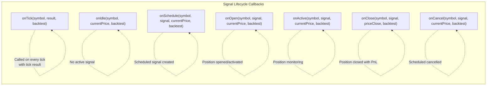

# Signal Lifecycle Overview

<details>
<summary>Relevant source files</summary>

The following files were used as context for generating this wiki page:

- [src/client/ClientStrategy.ts](src/client/ClientStrategy.ts)
- [src/index.ts](src/index.ts)
- [src/interfaces/Strategy.interface.ts](src/interfaces/Strategy.interface.ts)
- [src/lib/services/connection/StrategyConnectionService.ts](src/lib/services/connection/StrategyConnectionService.ts)
- [test/index.mjs](test/index.mjs)
- [types.d.ts](types.d.ts)

</details>


## Purpose and Scope

This page describes the signal state machine and lifecycle management in the backtest-kit framework. A signal represents a single trading position from creation through closure, transitioning through well-defined states. This document covers signal generation, validation, state transitions, persistence, and closure conditions.

For information about how signals are executed in different modes (backtest vs live), see [Execution Modes](#2.1). For details on component registration and schema definitions, see [Component Registration](#2.3). For deep implementation details of the `ClientStrategy` class that manages signals, see [ClientStrategy](#6.1).

---

## Signal State Machine

The signal lifecycle is modeled as a finite state machine with six distinct states. Signals transition between states based on market conditions, time constraints, and risk parameters.

### State Transition Diagram



**Sources:** [src/client/ClientStrategy.ts:1-1400](), [src/interfaces/Strategy.interface.ts:1-350](), [types.d.ts:536-825]()

### State Descriptions

| State | Discriminator | Signal Type | Description |
|-------|--------------|-------------|-------------|
| **idle** | `action: "idle"` | `null` | No active signal exists. Strategy can generate new signal on next `getSignal()` call. |
| **scheduled** | `action: "scheduled"` | `IScheduledSignalRow` | Signal created with delayed entry. Waiting for market price to reach `priceOpen`. |
| **opened** | `action: "opened"` | `ISignalRow` | Signal just created (immediate) or activated (from scheduled). Position tracking begins. |
| **active** | `action: "active"` | `ISignalRow` | Signal being monitored for TP/SL/time expiration. Continues until close condition met. |
| **closed** | `action: "closed"` | `ISignalRow` | Final state with PnL calculation. Includes `closeReason` and `closeTimestamp`. |
| **cancelled** | `action: "cancelled"` | `IScheduledSignalRow` | Scheduled signal cancelled before activation. Timeout or StopLoss hit. |

**Sources:** [types.d.ts:653-778](), [src/interfaces/Strategy.interface.ts:159-278]()

---

## Signal Data Structures

The framework uses a discriminated union pattern for type-safe signal handling. Three core interfaces represent signals at different lifecycle stages.

### Core Signal Interfaces



**Sources:** [src/interfaces/Strategy.interface.ts:19-72](), [types.d.ts:543-591]()

### Tick Result Discriminated Union

Each state transition yields a specific tick result type, enabling type-safe handling with TypeScript discriminators:

| Result Type | Discriminator | Contains | Use Case |
|-------------|--------------|----------|----------|
| `IStrategyTickResultIdle` | `action: "idle"` | `signal: null` | No signal exists, strategy idle |
| `IStrategyTickResultScheduled` | `action: "scheduled"` | `signal: IScheduledSignalRow` | Scheduled signal created |
| `IStrategyTickResultOpened` | `action: "opened"` | `signal: ISignalRow` | Signal opened/activated |
| `IStrategyTickResultActive` | `action: "active"` | `signal: ISignalRow` | Signal monitoring continues |
| `IStrategyTickResultClosed` | `action: "closed"` | `signal: ISignalRow`, `pnl`, `closeReason` | Signal closed with result |
| `IStrategyTickResultCancelled` | `action: "cancelled"` | `signal: IScheduledSignalRow` | Scheduled signal cancelled |

**Sources:** [src/interfaces/Strategy.interface.ts:159-295](), [types.d.ts:653-770]()

---

## Signal Generation and Validation

Signal generation occurs via the user-defined `getSignal()` function, followed by framework-level validation and augmentation.

### Signal Generation Flow



**Sources:** [src/client/ClientStrategy.ts:187-283](), [src/client/ClientStrategy.ts:40-185]()

### Validation Rules

The `VALIDATE_SIGNAL_FN` enforces financial safety constraints to prevent invalid signals:

| Validation Category | Rule | Configuration |
|---------------------|------|---------------|
| **Price Finiteness** | All prices must be finite numbers (no NaN/Infinity) | Hard-coded |
| **Price Positivity** | All prices must be > 0 | Hard-coded |
| **Long Position Logic** | `priceTakeProfit > priceOpen > priceStopLoss` | Hard-coded |
| **Short Position Logic** | `priceStopLoss > priceOpen > priceTakeProfit` | Hard-coded |
| **Minimum TP Distance** | TP must cover fees + minimum profit | `CC_MIN_TAKEPROFIT_DISTANCE_PERCENT` (default: 0.3%) |
| **Maximum SL Distance** | SL cannot exceed maximum loss threshold | `CC_MAX_STOPLOSS_DISTANCE_PERCENT` (default: 20%) |
| **Time Constraints** | `minuteEstimatedTime > 0` | Hard-coded |
| **Maximum Lifetime** | Signal cannot block risk limits indefinitely | `CC_MAX_SIGNAL_LIFETIME_MINUTES` (default: 1440 min = 1 day) |

**Sources:** [src/client/ClientStrategy.ts:40-185](), [types.d.ts:5-34]()

### Signal Augmentation

User-provided `ISignalDto` is augmented with framework metadata:

```typescript
// User provides (from getSignal):
{
  position: "long",
  priceTakeProfit: 45000,
  priceStopLoss: 43000,
  minuteEstimatedTime: 60
}

// Framework augments to ISignalRow:
{
  id: "uuid-v4-generated",           // Auto-generated
  priceOpen: 44000,                  // currentPrice or user-specified
  exchangeName: "binance",           // From method context
  strategyName: "momentum-strategy", // From method context
  scheduledAt: 1640000000000,       // Current timestamp
  pendingAt: 1640000000000,         // Same as scheduledAt initially
  symbol: "BTCUSDT",                // From execution context
  _isScheduled: false,              // true if priceOpen specified
  // ... original fields
}
```

**Sources:** [src/client/ClientStrategy.ts:234-272]()

---

## State Transitions

### Idle → Scheduled

Occurs when `getSignal()` returns a signal with `priceOpen` specified. Signal waits for market price to reach entry point.



**Key Implementation:** Scheduled signals do NOT perform risk check at creation time. Risk validation occurs during activation when position opens.

**Sources:** [src/client/ClientStrategy.ts:578-621](), [src/client/ClientStrategy.ts:234-254]()

### Idle → Opened (Immediate)

Occurs when `getSignal()` returns a signal without `priceOpen`. Position opens immediately at current VWAP.



**Sources:** [src/client/ClientStrategy.ts:623-673]()

### Scheduled → Opened (Activation)

Occurs when market price reaches `priceOpen` for a scheduled signal. Triggers risk check at activation time.

```mermaid
sequenceDiagram
    participant Tick as "tick()"
    participant Price as "getAveragePrice()"
    participant Check as "CHECK_SCHEDULED_SIGNAL_PRICE_ACTIVATION_FN"
    participant Risk as "risk.checkSignal()"
    participant Activate as "ACTIVATE_SCHEDULED_SIGNAL_FN"
    participant Persist as "PersistSignalAdapter"
    
    Tick->>Price: Get current VWAP
    Price-->>Tick: currentPrice
    Tick->>Check: Check activation conditions
    
    alt Long position
        Check->>Check: currentPrice <= priceOpen?
        Check->>Check: currentPrice > priceStopLoss?
    else Short position
        Check->>Check: currentPrice >= priceOpen?
        Check->>Check: currentPrice < priceStopLoss?
    end
    
    Check-->>Tick: shouldActivate=true
    Tick->>Activate: Activate signal
    Activate->>Risk: checkSignal(priceOpen)
    Risk-->>Activate: Approved
    
    Activate->>Activate: Update pendingAt timestamp
    Activate->>Persist: setPendingSignal()
    Activate->>Risk: addSignal()
    Activate-->>Tick: Return IStrategyTickResultOpened
    
    Note over Activate: pendingAt updated from scheduledAt<br/>to activation timestamp
```

**Critical:** `pendingAt` timestamp is updated during activation. Time-based expiration calculates from `pendingAt`, not `scheduledAt`.

**Sources:** [src/client/ClientStrategy.ts:459-551](), [src/client/ClientStrategy.ts:388-422]()

### Scheduled → Cancelled

Occurs when scheduled signal times out or StopLoss is hit before activation.

**Timeout Condition:**
```typescript
const elapsedTime = currentTime - scheduled.scheduledAt;
const maxTimeToWait = CC_SCHEDULE_AWAIT_MINUTES * 60 * 1000;
if (elapsedTime >= maxTimeToWait) {
  // Cancel signal
}
```

**StopLoss Condition (Priority over activation):**
- Long: `currentPrice <= priceStopLoss` → cancel
- Short: `currentPrice >= priceStopLoss` → cancel

**Sources:** [src/client/ClientStrategy.ts:332-386](), [src/client/ClientStrategy.ts:388-422]()

### Opened/Active → Closed

Occurs when signal meets closure condition: TakeProfit hit, StopLoss hit, or time expired.



**Critical:** When TakeProfit or StopLoss triggers, the framework uses the **exact TP/SL price** for PnL calculation, not the current VWAP. This ensures deterministic results.

**Sources:** [src/client/ClientStrategy.ts:675-734](), [src/client/ClientStrategy.ts:736-789]()

---

## Timestamp Management

Signals track two distinct timestamps for lifecycle management:

### Timestamp Definitions

| Timestamp | Set During | Purpose | Usage |
|-----------|-----------|---------|-------|
| `scheduledAt` | Signal creation | Records when signal was first generated | Timeout calculation for scheduled signals |
| `pendingAt` | Position activation | Records when position opened at `priceOpen` | Time expiration calculation for active signals |

### Timestamp Behavior

**Immediate Signals (no `priceOpen`):**
```typescript
scheduledAt: currentTime,  // Set at creation
pendingAt: currentTime     // Same as scheduledAt
```

**Scheduled Signals (with `priceOpen`):**
```typescript
// At creation:
scheduledAt: currentTime,  // Set at creation
pendingAt: currentTime     // Temporarily equals scheduledAt

// At activation:
scheduledAt: unchanged,    // Original creation time
pendingAt: activationTime  // Updated to activation timestamp
```

**Timeout Calculation:**
- **Scheduled signal timeout:** `currentTime - scheduledAt >= CC_SCHEDULE_AWAIT_MINUTES * 60 * 1000`
- **Active signal expiration:** `currentTime - pendingAt >= minuteEstimatedTime * 60 * 1000`

**Sources:** [src/client/ClientStrategy.ts:234-272](), [src/client/ClientStrategy.ts:459-551](), [src/client/ClientStrategy.ts:680-683]()

---

## Lifecycle Callbacks

Strategies can register callbacks to observe signal state transitions. All callbacks are optional.

### Callback Inventory



### Callback Execution Order

For each state transition, callbacks execute in this order:

1. **State-specific callback** (e.g., `onOpen`, `onClose`)
2. **`onTick` callback** with tick result

Example for signal opening:
```typescript
// 1. State-specific callback
if (callbacks.onOpen) {
  callbacks.onOpen(symbol, signal, currentPrice, backtest);
}

// 2. onTick callback
if (callbacks.onTick) {
  const result: IStrategyTickResultOpened = { action: "opened", ... };
  callbacks.onTick(symbol, result, backtest);
}
```

**Sources:** [src/interfaces/Strategy.interface.ts:92-115](), [src/client/ClientStrategy.ts:524-548](), [src/client/ClientStrategy.ts:752-786]()

---

## Internal State Management

The `ClientStrategy` class maintains internal state for signal tracking:

### State Variables

| Variable | Type | Purpose |
|----------|------|---------|
| `_pendingSignal` | `ISignalRow \| null` | Currently active signal being monitored |
| `_scheduledSignal` | `IScheduledSignalRow \| null` | Scheduled signal awaiting activation |
| `_lastSignalTimestamp` | `number \| null` | Timestamp of last `getSignal()` call (for throttling) |
| `_isStopped` | `boolean` | Flag to prevent new signal generation |

### Mutual Exclusion

Only one signal can exist per symbol at a time. The framework enforces mutual exclusion:

- `_pendingSignal` and `_scheduledSignal` are **never both non-null**
- Scheduled signal transitions to pending signal on activation
- New signals rejected if active signal exists (via risk check)

**Sources:** [src/client/ClientStrategy.ts:1063-1092]()

### Persistence (Live Mode Only)

In live mode, signals persist to disk atomically for crash recovery:

```typescript
// Persist after every state change
await PersistSignalAdapter.writeSignalData(
  strategyName,
  symbol,
  pendingSignal
);

// Restore on initialization
const restored = await PersistSignalAdapter.readSignalData(
  strategyName,
  symbol
);
```

**File Location:** `signal-{strategyName}-{symbol}.json`

**Atomic Write Pattern:** Write to temp file, then rename for crash-safe persistence.

**Sources:** [src/client/ClientStrategy.ts:1093-1132](), [src/client/ClientStrategy.ts:298-330]()

---

## Summary

The signal lifecycle follows a deterministic state machine with six states: idle, scheduled, opened, active, closed, and cancelled. Signals are generated via user-defined `getSignal()` functions, validated by framework rules, and monitored through VWAP-based price checks. State transitions trigger lifecycle callbacks for observability. Timestamps (`scheduledAt` vs `pendingAt`) enable precise timeout and expiration calculations. In live mode, signals persist atomically to disk for crash recovery.

For implementation details of signal processing within specific execution modes, see [Backtest Execution Flow](#9.1) and [Live Execution Flow](#10.1).