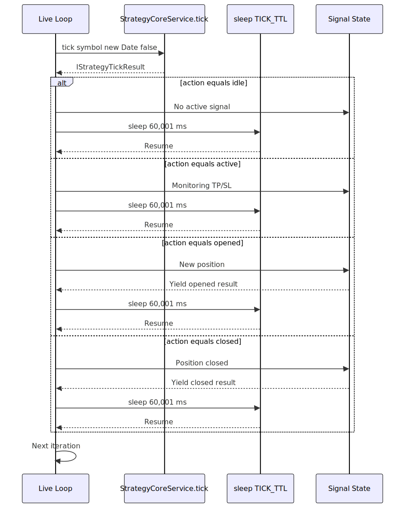

# Timing Parameters

## Purpose and Scope

This page documents the timing-related configuration constants that control temporal behavior in backtest-kit. These parameters govern how long the system waits for scheduled signals to activate, the maximum lifetime of active signals, and the sleep interval between tick iterations in live mode.

For validation distance thresholds (take profit/stop loss distances), see [Validation Parameters](./79_Validation_Parameters.md). For general configuration including fees, slippage, and VWAP settings, see [Global Configuration](./78_Global_Configuration.md).

---

## Overview

Timing parameters control three critical aspects of signal execution:

1. **Scheduled Signal Timeout**: How long to wait for a scheduled signal's `priceOpen` to be reached before cancellation
2. **Signal Lifetime Limits**: Maximum duration a signal can remain active before forced time-based exit
3. **Live Mode Tick Interval**: Sleep duration between tick iterations to prevent API spam

All timing parameters are configurable via the global configuration system (see [Global Configuration](./78_Global_Configuration.md)) and accessed through `GLOBAL_CONFIG` imported from [src/config/params.ts]().

---

## Timing Constants

### CC_SCHEDULE_AWAIT_MINUTES

**Purpose**: Maximum wait time for scheduled signals to activate.

When a strategy returns a signal with `priceOpen` specified (scheduled signal), the system waits for the market price to reach the entry point. If the price doesn't reach `priceOpen` within this timeout period, the signal is cancelled without opening a position.

**Default Value**: Not explicitly shown in provided code, but referenced in [src/lib/services/logic/private/BacktestLogicPrivateService.ts:178]()

**Usage in Backtest**:

When a scheduled signal is detected, the system requests candles for the monitoring period:

```
candlesNeeded = bufferMinutes + CC_SCHEDULE_AWAIT_MINUTES + minuteEstimatedTime + 1
```

This ensures sufficient historical data is available to:
- Monitor price activation attempts during the await window
- Detect if stop loss would be hit before activation (pre-activation cancellation)
- Process the full signal duration after activation

**Usage in Live Mode**:

Live mode continuously checks if the current VWAP price reaches `priceOpen` on each tick iteration. After `CC_SCHEDULE_AWAIT_MINUTES` elapses from `scheduledAt` timestamp, the signal is automatically cancelled if not yet activated.

**Cancellation Logic**:

Scheduled signals transition to `cancelled` state when:
- Timeout expires: `(Date.now() - scheduledAt) > CC_SCHEDULE_AWAIT_MINUTES * 60 * 1000`
- Pre-activation stop loss: Stop loss price would be hit before `priceOpen` is reached



- [src/lib/services/logic/private/BacktestLogicPrivateService.ts:155-178]()
- [types.d.ts:786-801]() (IStrategyTickResultScheduled)

---

### CC_MAX_SIGNAL_LIFETIME_MINUTES

**Purpose**: Maximum duration a signal can remain active before forced closure.

This parameter acts as a safety mechanism to prevent signals from remaining open indefinitely. Even if take profit and stop loss are not hit, signals automatically close after this time limit expires.

**Relationship to minuteEstimatedTime**:

Each signal specifies `minuteEstimatedTime` in its DTO, which represents the expected holding duration. This is distinct from `CC_MAX_SIGNAL_LIFETIME_MINUTES`:

| Parameter | Scope | Purpose |
|-----------|-------|---------|
| `minuteEstimatedTime` | Per-signal | Expected duration set by strategy's `getSignal()` |
| `CC_MAX_SIGNAL_LIFETIME_MINUTES` | Global config | Hard limit applied to all signals |

**Time Expiration Logic**:

Signals track elapsed time from `pendingAt` timestamp (when position opened, not when scheduled):

```
elapsedMinutes = (currentTimestamp - pendingAt) / 60000
```

Closure occurs when:
- `elapsedMinutes >= minuteEstimatedTime` (strategy's expected duration)
- OR `elapsedMinutes >= CC_MAX_SIGNAL_LIFETIME_MINUTES` (global hard limit)

The first condition to be met triggers `closeReason: "time_expired"`.

**Backtest Optimization**:

In backtest mode, the system fetches exactly `minuteEstimatedTime` candles after signal opens, avoiding unnecessary processing of longer timeframes. If a signal would exceed `CC_MAX_SIGNAL_LIFETIME_MINUTES`, it's capped at the global limit.



- [types.d.ts:666]() (minuteEstimatedTime field)
- [types.d.ts:754]() (StrategyCloseReason type)
- [src/lib/services/logic/private/BacktestLogicPrivateService.ts:320-332]()

---

### TICK_TTL

**Purpose**: Sleep interval between tick iterations in live trading mode.

**Definition**: [src/lib/services/logic/private/LiveLogicPrivateService.ts:14]()

```typescript
const TICK_TTL = 1 * 60 * 1_000 + 1;
```

**Value Breakdown**:

| Component | Milliseconds | Purpose |
|-----------|--------------|---------|
| `1 * 60 * 1_000` | 60,000 ms | Base 1-minute interval |
| `+ 1` | 1 ms | Buffer to avoid edge case timing issues |
| **Total** | **60,001 ms** | ~1 minute between ticks |

**Why 1 Minute + 1ms?**

The additional 1 millisecond prevents edge cases where:
- Clock skew causes ticks to occur at exact minute boundaries
- Race conditions between tick timing and candle boundary timestamps
- Floating point precision issues in time calculations

The extra millisecond ensures ticks always fall slightly after minute boundaries, avoiding ambiguity in which candle data is "current."

**Live Mode Execution Flow**:

The live trading infinite loop uses `TICK_TTL` to control iteration frequency:



**Performance Implications**:

| Aspect | Impact |
|--------|--------|
| **API Rate Limiting** | 60-second interval prevents exchange API rate limit violations |
| **CPU Usage** | Minimal CPU usage during sleep periods (process yields to OS scheduler) |
| **Latency** | Worst-case 1-minute delay between price movements and signal generation |
| **Memory** | No accumulation of pending work during sleep (async/await yields control) |

**Comparison to Backtest Mode**:

Backtest mode does **not** use `TICK_TTL`. Instead, it iterates through pre-generated timeframes as fast as possible:

| Mode | Iteration Control | Speed |
|------|------------------|-------|
| **Live** | `sleep(TICK_TTL)` between ticks | Real-time (1 tick/minute) |
| **Backtest** | No sleep, continuous loop through timeframes | As fast as CPU allows |

**Interaction with Signal Intervals**:

The `TICK_TTL` constant works in conjunction with strategy `interval` settings (e.g., `"1m"`, `"5m"`, `"15m"`). These intervals throttle how frequently `getSignal()` is called, independent of tick frequency.

For example, with `interval: "5m"`:
- Ticks still occur every 60 seconds via `TICK_TTL`
- But `getSignal()` is only called every 5 minutes
- Intermediate ticks only monitor existing signal's TP/SL/time progress

- [src/lib/services/logic/private/LiveLogicPrivateService.ts:14]()
- [src/lib/services/logic/private/LiveLogicPrivateService.ts:63-177]()
- [types.d.ts:647]() (SignalInterval type)

---

## Timing Coordination in Backtest

The backtest system coordinates all timing parameters to efficiently process historical data. When a signal opens, the system calculates the exact number of candles needed:



**Formula for Candle Count**:

For **scheduled signals** [src/lib/services/logic/private/BacktestLogicPrivateService.ts:176-178]():

```
candlesNeeded = (CC_AVG_PRICE_CANDLES_COUNT - 1) + CC_SCHEDULE_AWAIT_MINUTES + minuteEstimatedTime + 1
```

For **immediate signals** [src/lib/services/logic/private/BacktestLogicPrivateService.ts:320-322]():

```
candlesNeeded = (CC_AVG_PRICE_CANDLES_COUNT - 1) + minuteEstimatedTime
```

**Component Breakdown**:

| Component | Purpose | Example (5 candles, 60 min await, 120 min duration) |
|-----------|---------|------------------------------------------------------|
| `CC_AVG_PRICE_CANDLES_COUNT - 1` | VWAP calculation buffer | 4 candles |
| `CC_SCHEDULE_AWAIT_MINUTES` | Activation monitoring | 60 candles (scheduled only) |
| `minuteEstimatedTime` | Signal execution | 120 candles |
| `+ 1` | Inclusive boundary | 1 candle |
| **Total (scheduled)** | - | **185 candles** |
| **Total (immediate)** | - | **125 candles** |

**Timeframe Skipping**:

After a signal closes, the backtest loop skips timeframes until reaching `closeTimestamp`:



This optimization prevents redundant tick() calls during the signal's active period, significantly improving backtest performance.

- [src/lib/services/logic/private/BacktestLogicPrivateService.ts:155-283]() (scheduled signal handling)
- [src/lib/services/logic/private/BacktestLogicPrivateService.ts:307-434]() (immediate signal handling)
- [src/lib/services/logic/private/BacktestLogicPrivateService.ts:406-412]() (timeframe skipping)

---

## Timing Coordination in Live Mode

Live mode continuously monitors signals in real-time, recalculating elapsed time on each tick:



**Elapsed Time Tracking**:

Each tick recalculates time-based conditions:

```
elapsedSinceScheduled = (Date.now() - scheduledAt) / 60000
elapsedSincePending = (Date.now() - pendingAt) / 60000
```

**Timeout Checks per Tick**:

| Signal State | Timeout Check | Action on Timeout |
|--------------|---------------|-------------------|
| `scheduled` | `elapsedSinceScheduled >= CC_SCHEDULE_AWAIT_MINUTES` | Cancel signal |
| `active` | `elapsedSincePending >= minuteEstimatedTime` | Close with `time_expired` |
| `active` | `elapsedSincePending >= CC_MAX_SIGNAL_LIFETIME_MINUTES` | Force close with `time_expired` |

**Real-time vs Historical Timestamps**:

| Mode | Timestamp Source | Timing Precision |
|------|------------------|------------------|
| **Live** | `new Date()` at each tick | Wall clock time, 60-second granularity |
| **Backtest** | `timeframes[i]` from frame generation | Historical candle timestamps, exact replay |

- [src/lib/services/logic/private/LiveLogicPrivateService.ts:63-177]()
- [src/lib/services/logic/private/LiveLogicPrivateService.ts:72]() (timestamp generation)
- [src/lib/services/logic/private/LiveLogicPrivateService.ts:93-95]() (sleep implementation)

---

## Configuration Access

All timing parameters are accessed via the global configuration object:

```typescript
import { GLOBAL_CONFIG } from "./config/params";

const scheduleTimeout = GLOBAL_CONFIG.CC_SCHEDULE_AWAIT_MINUTES;
const maxLifetime = GLOBAL_CONFIG.CC_MAX_SIGNAL_LIFETIME_MINUTES;
const avgPriceCandleCount = GLOBAL_CONFIG.CC_AVG_PRICE_CANDLES_COUNT;
```

To customize these values, use `setConfig()` before running backtests or live trading:

```typescript
import { setConfig } from "backtest-kit";

setConfig({
  CC_SCHEDULE_AWAIT_MINUTES: 30,        // Wait up to 30 minutes for activation
  CC_MAX_SIGNAL_LIFETIME_MINUTES: 1440, // Max 24 hours per signal
  CC_AVG_PRICE_CANDLES_COUNT: 5,        // Use 5 candles for VWAP (default)
});
```

**Note**: `TICK_TTL` is hardcoded in [src/lib/services/logic/private/LiveLogicPrivateService.ts:14]() and not user-configurable. To modify tick frequency, you must edit the source code directly.

- [src/config/params.ts]()
- [src/function/setup.ts]() (setConfig, getConfig functions)
- [types.d.ts:195]() (GlobalConfig type reference)