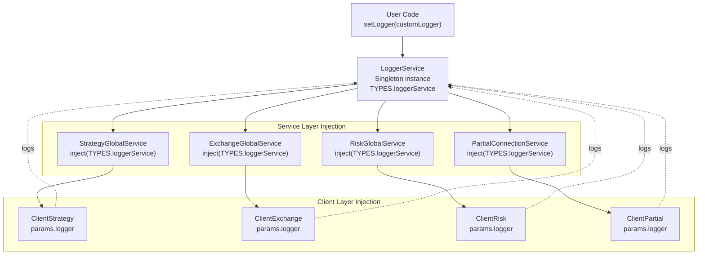
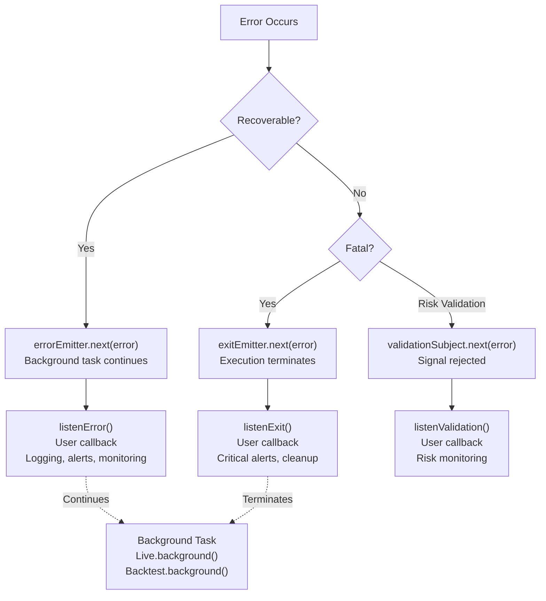
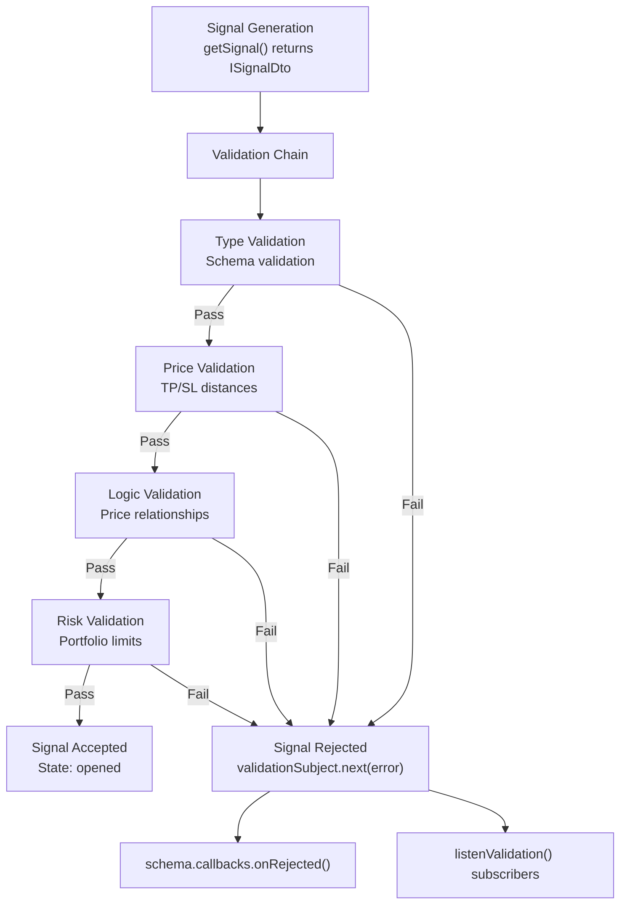
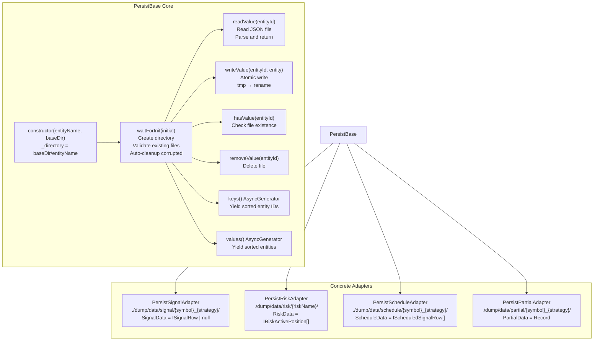
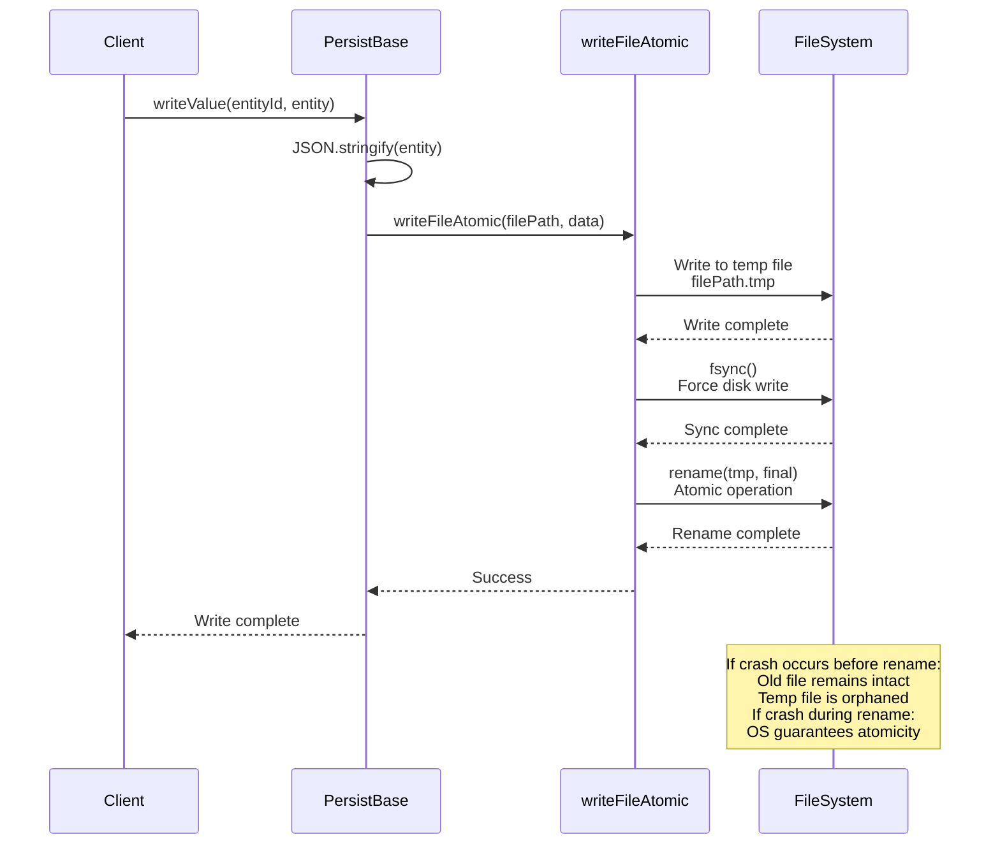
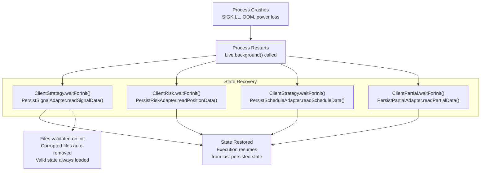

# Cross-Cutting Concerns

<details>
<summary>Relevant source files</summary>

The following files were used as context for generating this wiki page:

- [src/classes/Persist.ts](src/classes/Persist.ts)
- [src/client/ClientPartial.ts](src/client/ClientPartial.ts)
- [src/config/emitters.ts](src/config/emitters.ts)
- [src/contract/PartialLoss.contract.ts](src/contract/PartialLoss.contract.ts)
- [src/contract/PartialProfit.contract.ts](src/contract/PartialProfit.contract.ts)
- [src/function/event.ts](src/function/event.ts)
- [src/index.ts](src/index.ts)
- [src/interfaces/Partial.interface.ts](src/interfaces/Partial.interface.ts)
- [src/lib/services/connection/PartialConnectionService.ts](src/lib/services/connection/PartialConnectionService.ts)
- [src/lib/services/global/PartialGlobalService.ts](src/lib/services/global/PartialGlobalService.ts)
- [types.d.ts](types.d.ts)

</details>


This page documents system-wide concerns that affect multiple components across the backtest-kit architecture. These concerns include logging, error handling, and persistence, which are not specific to any single component but are fundamental to the system's operation.

For component-specific logging, error handling, or persistence behavior, see the individual component documentation in [Client Implementations](#6), [Service Layer](#7), or [Signal Lifecycle](#8).

---

## 15.1 Logging System

The logging system provides a standardized interface for recording diagnostic information across all components. It uses dependency injection to ensure all services have access to logging capabilities without tight coupling.

### ILogger Interface

The `ILogger` interface defines four severity levels for logging operations:

| Method | Severity | Use Case |
|--------|----------|----------|
| `log()` | General | Significant events or state changes |
| `debug()` | Diagnostic | Detailed information for troubleshooting |
| `info()` | Informational | High-level overview of system activity |
| `warn()` | Warning | Potentially problematic situations |

[types.d.ts:52-77]()

### Configuration

Users configure the logger implementation via `setLogger()`:

```typescript
import { setLogger } from 'backtest-kit';

const customLogger = {
  log: (topic, ...args) => console.log(`[LOG] ${topic}`, ...args),
  debug: (topic, ...args) => console.debug(`[DEBUG] ${topic}`, ...args),
  info: (topic, ...args) => console.info(`[INFO] ${topic}`, ...args),
  warn: (topic, ...args) => console.warn(`[WARN] ${topic}`, ...args),
};

setLogger(customLogger);
```

The logger is stored in `LoggerService` and injected throughout the system via the dependency injection container.

[src/function/setup.ts](), [src/lib/services/base/LoggerService.ts]()

### Dependency Injection Pattern



**Sources:** [types.d.ts:52-77](), [src/lib/services/base/LoggerService.ts](), [src/lib/core/types.ts]()

### Logging Conventions

Each component logs with a consistent topic format:

| Component | Log Topic Format | Example |
|-----------|------------------|---------|
| Global Services | `{serviceName} {methodName}` | `"strategyGlobalService tick"` |
| Connection Services | `{serviceName} {methodName}` | `"strategyConnectionService getStrategy"` |
| Client Implementations | `{className} {methodName}` | `"ClientStrategy tick"` |
| Persistence Layer | `{className}.{methodName}` | `"PersistBase.waitForInit"` |

[src/client/ClientStrategy.ts](), [src/lib/services/global/StrategyGlobalService.ts](), [src/classes/Persist.ts:45-53]()

### Usage Examples

```typescript
// Service layer logging
this.loggerService.log("strategyGlobalService tick", {
  symbol,
  strategyName,
  backtest
});

// Client layer logging with structured data
this.params.logger.debug("ClientPartial profit level reached", {
  symbol,
  signalId: data.id,
  level,
  revenuePercent,
  backtest
});

// Persistence layer logging with entity context
swarm.loggerService.debug("PersistBase.readValue", {
  entityName: this.entityName,
  entityId
});
```

**Sources:** [src/client/ClientPartial.ts:81-87](), [src/classes/Persist.ts:254-257]()

---

## 15.2 Error Handling

The error handling system distinguishes between recoverable and fatal errors, providing appropriate mechanisms for each scenario.

### Error Classification



**Sources:** [src/config/emitters.ts:36-44](), [src/config/emitters.ts:109-112](), [src/function/event.ts:223-279]()

### Error Emitters

| Emitter | Purpose | When to Use | Execution Impact |
|---------|---------|-------------|------------------|
| `errorEmitter` | Recoverable errors | API failures, transient issues | Continues execution |
| `exitEmitter` | Fatal errors | System failures, unrecoverable states | Terminates execution |
| `validationSubject` | Validation errors | Risk rule violations | Rejects signal only |

[src/config/emitters.ts:36-44](), [src/config/emitters.ts:109-112]()

### Event Listeners

```typescript
import { listenError, listenExit, listenValidation } from 'backtest-kit';

// Recoverable errors - execution continues
listenError((error) => {
  console.error('Recoverable error:', error.message);
  // Log to monitoring, send non-critical alerts
});

// Fatal errors - execution terminates
listenExit((error) => {
  console.error('FATAL ERROR:', error.message);
  // Send critical alerts, trigger restart logic
});

// Risk validation errors - signal rejected
listenValidation((error) => {
  console.warn('Risk validation failed:', error.message);
  // Track rejection patterns, adjust parameters
});
```

**Sources:** [src/function/event.ts:223-250](), [src/function/event.ts:252-279]()

### Try-Catch Patterns

#### Pattern 1: Graceful Degradation with Default Value

```typescript
// From PersistBase - retry with fallback
const success = await trycatch(
  retry(
    async () => {
      await fs.unlink(filePath);
      return true;
    },
    BASE_UNLINK_RETRY_COUNT,  // 5 attempts
    BASE_UNLINK_RETRY_DELAY   // 1000ms between attempts
  ),
  {
    defaultValue: false  // Return false if all retries fail
  }
);
```

[src/classes/Persist.ts:155-177]()

#### Pattern 2: Error Transformation

```typescript
// From ClientExchange - transform to user-friendly message
try {
  const fileContent = await fs.readFile(filePath, 'utf-8');
  return JSON.parse(fileContent);
} catch (error: any) {
  if (error?.code === 'ENOENT') {
    throw new Error(`Entity ${this.entityName}:${entityId} not found`);
  }
  throw new Error(
    `Failed to read entity: ${getErrorMessage(error)}`
  );
}
```

[src/classes/Persist.ts:258-272]()

#### Pattern 3: Background Error Emission

```typescript
// Background execution wraps async generators
try {
  for await (const result of generator) {
    // Process result
  }
} catch (error) {
  errorEmitter.next(error);  // Emit recoverable error
  // Continue execution
}
```

[src/classes/Backtest.ts](), [src/classes/Live.ts]()

### Validation Error Handling



**Sources:** [src/client/ClientRisk.ts](), [src/lib/services/validation/RiskValidationService.ts](), [src/config/emitters.ts:109-112]()

---

## 15.3 Persistence Layer

The persistence layer provides crash-safe storage for live trading state using atomic file operations and automatic validation.

### PersistBase Abstract Class

`PersistBase` is the foundation for all persistence adapters, implementing CRUD operations with automatic directory management and corruption recovery.



**Sources:** [src/classes/Persist.ts:179-501]()

### Directory Structure

| Adapter | Directory Pattern | Entity ID | Data Type |
|---------|------------------|-----------|-----------|
| `PersistSignalAdapter` | `./dump/data/signal/{symbol}_{strategy}/` | `symbol` | `ISignalRow \| null` |
| `PersistRiskAdapter` | `./dump/data/risk/{riskName}/` | `riskName` | `IRiskActivePosition[]` |
| `PersistScheduleAdapter` | `./dump/data/schedule/{symbol}_{strategy}/` | `symbol` | `IScheduledSignalRow[]` |
| `PersistPartialAdapter` | `./dump/data/partial/{symbol}_{strategy}/` | `symbol` | `Record<signalId, IPartialData>` |

[src/classes/Persist.ts:514-783]()

### Atomic Write Pattern

The atomic write pattern ensures that files are never left in a corrupted state, even if the process crashes during write operations.



**Sources:** [src/classes/Persist.ts:295-314](), [src/utils/writeFileAtomic.ts]()

### Initialization and Validation

On initialization, `PersistBase` validates all existing files and automatically removes corrupted ones:

```typescript
// From PersistBase.waitForInit implementation
await fs.mkdir(self._directory, { recursive: true });

for await (const key of self.keys()) {
  try {
    await self.readValue(key);  // Validate by attempting to read
  } catch {
    const filePath = self._getFilePath(key);
    console.error(
      `backtest-kit PersistBase found invalid document for filePath=${filePath}`
    );
    
    // Retry deletion up to 5 times with 1s delay
    const success = await retry(
      async () => {
        await fs.unlink(filePath);
        return true;
      },
      BASE_UNLINK_RETRY_COUNT,    // 5
      BASE_UNLINK_RETRY_DELAY     // 1000ms
    );
    
    if (!success) {
      console.error(
        `backtest-kit PersistBase failed to remove invalid document`
      );
    }
  }
}
```

[src/classes/Persist.ts:132-153]()

### Crash Recovery Integration



**Sources:** [src/client/ClientStrategy.ts](), [src/client/ClientRisk.ts](), [src/client/ClientPartial.ts](), [src/classes/Persist.ts:132-153]()

### Custom Persistence Adapters

Users can replace the default file-based persistence with custom implementations (e.g., Redis, MongoDB):

```typescript
import { PersistBase, PersistSignalAdapter } from 'backtest-kit';

class RedisPersist extends PersistBase {
  private redis: RedisClient;
  
  constructor(entityName: string, baseDir: string) {
    super(entityName, baseDir);
    this.redis = createRedisClient();
  }
  
  async readValue(entityId: string) {
    const data = await this.redis.get(`${this.entityName}:${entityId}`);
    return JSON.parse(data);
  }
  
  async writeValue(entityId: string, entity: any) {
    const data = JSON.stringify(entity);
    await this.redis.set(`${this.entityName}:${entityId}`, data);
  }
  
  async hasValue(entityId: string) {
    return await this.redis.exists(`${this.entityName}:${entityId}`);
  }
  
  // Implement other required methods...
}

// Register custom adapter
PersistSignalAdapter.usePersistSignalAdapter(RedisPersist);
```

**Sources:** [src/classes/Persist.ts:541-548](), [src/classes/Persist.ts:69-78]()

### Persistence Adapter Comparison

| Adapter | Purpose | Write Frequency | Data Size | Backtest Mode |
|---------|---------|-----------------|-----------|---------------|
| `PersistSignalAdapter` | Active signal state | Every signal state change | ~1KB per signal | Disabled |
| `PersistRiskAdapter` | Portfolio positions | Every position add/remove | ~5-50KB per risk profile | Disabled |
| `PersistScheduleAdapter` | Scheduled signals | Every scheduled signal update | ~5-50KB per strategy | Disabled |
| `PersistPartialAdapter` | Profit/loss levels | Every level milestone | ~1-5KB per signal | Disabled |

All adapters skip persistence in backtest mode (`backtest=true`) for performance, as crash recovery is unnecessary for historical simulations.

[src/client/ClientPartial.ts:214-218](), [src/classes/Persist.ts]()

### Async Iteration Support

`PersistBase` implements async iteration for convenient data access:

```typescript
// Iterate all entities
for await (const entity of persistAdapter.values()) {
  console.log(entity);
}

// Iterate all keys
for await (const key of persistAdapter.keys()) {
  console.log(key);
}

// Filter entities
for await (const entity of persistAdapter.filter(e => e.status === 'active')) {
  console.log(entity);
}

// Take first N entities
for await (const entity of persistAdapter.take(10)) {
  console.log(entity);
}
```

**Sources:** [src/classes/Persist.ts:377-499]()