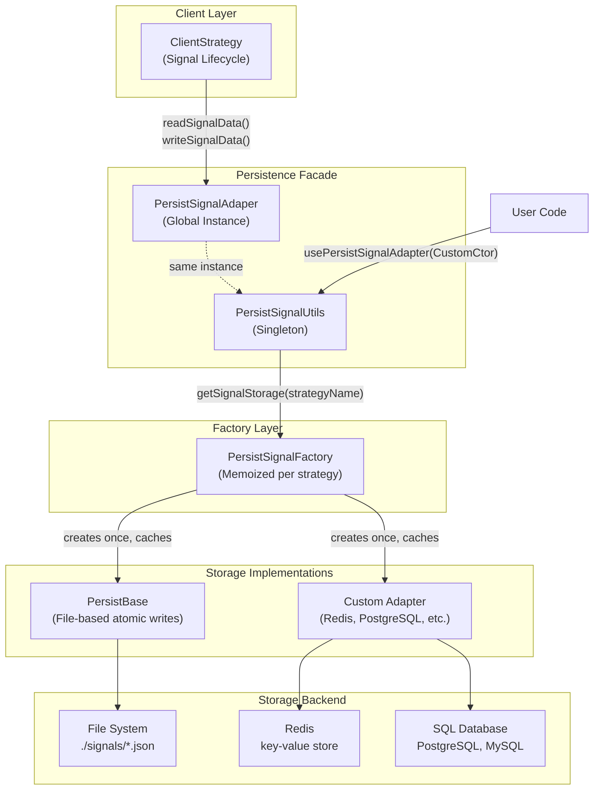
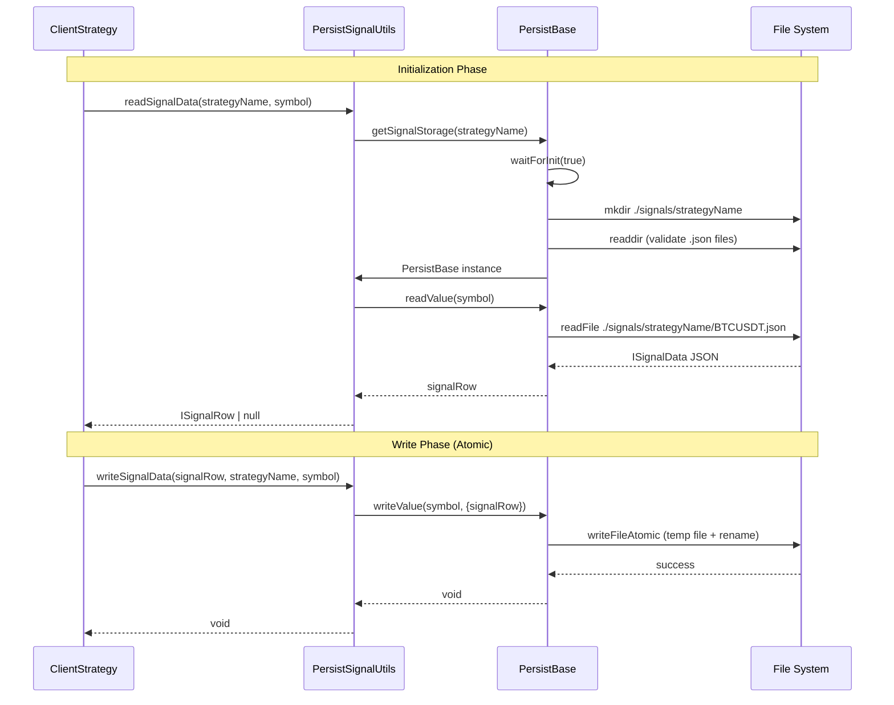
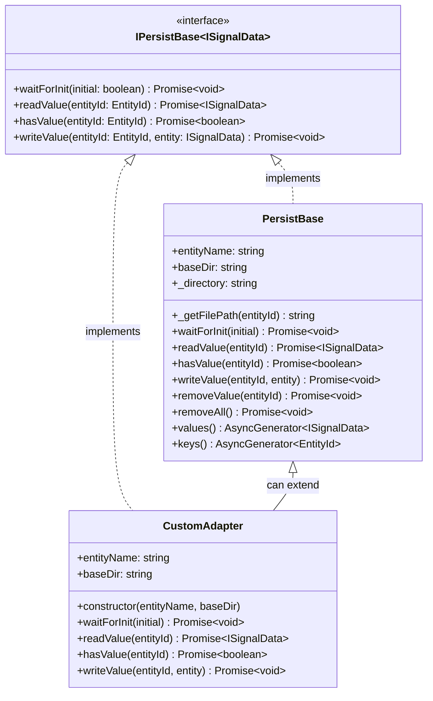
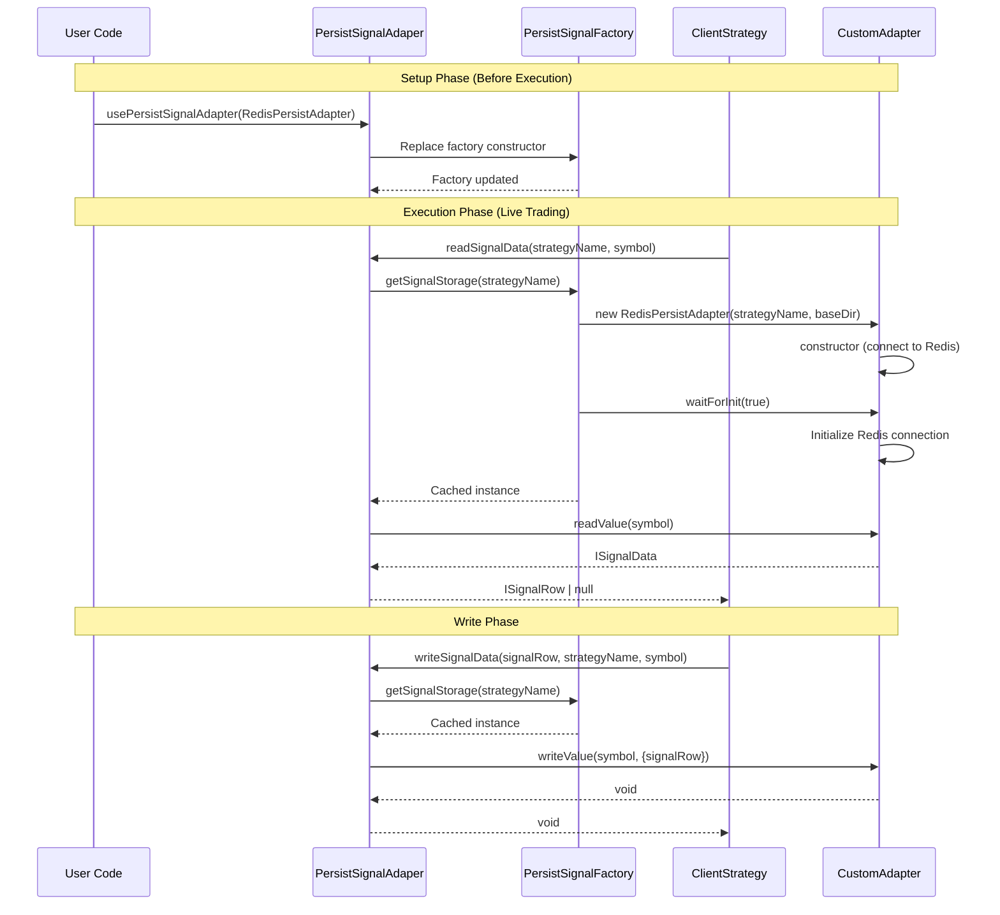
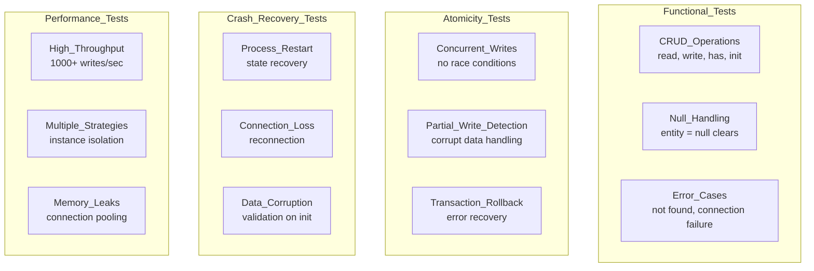

# Custom Persistence Backends

<details>
<summary>Relevant source files</summary>

The following files were used as context for generating this wiki page:

- [README.md](README.md)
- [src/classes/Persist.ts](src/classes/Persist.ts)
- [src/classes/Schedule.ts](src/classes/Schedule.ts)
- [src/config/params.ts](src/config/params.ts)
- [src/lib/services/global/WalkerGlobalService.ts](src/lib/services/global/WalkerGlobalService.ts)
- [src/lib/services/markdown/BacktestMarkdownService.ts](src/lib/services/markdown/BacktestMarkdownService.ts)
- [src/lib/services/markdown/LiveMarkdownService.ts](src/lib/services/markdown/LiveMarkdownService.ts)
- [src/lib/services/markdown/ScheduleMarkdownService.ts](src/lib/services/markdown/ScheduleMarkdownService.ts)
- [src/utils/writeFileAtomic.ts](src/utils/writeFileAtomic.ts)
- [test/config/setup.mjs](test/config/setup.mjs)
- [test/e2e/defend.test.mjs](test/e2e/defend.test.mjs)
- [test/e2e/sanitize.test.mjs](test/e2e/sanitize.test.mjs)
- [test/spec/scheduled.test.mjs](test/spec/scheduled.test.mjs)

</details>


This page explains how to implement custom persistence backends for signal state storage. By default, the framework uses file-based atomic persistence for crash-safe live trading. Custom backends enable integration with Redis, PostgreSQL, MongoDB, or any other storage system while maintaining crash recovery guarantees.

For general information about signal persistence and crash recovery mechanisms, see [Signal Persistence](#6.3). For implementing custom data sources for candle data, see [Custom Exchange Integration](#11.1).

---

## Persistence Architecture Overview

The persistence layer uses a factory pattern with pluggable backends. The `PersistSignalUtils` class manages storage instances per strategy, while `PersistBase` provides the default file-based implementation.

**Architecture Diagram: Persistence Layer Components**



**Sources:** [types.d.ts:1067-1125](), [src/index.ts:44-50]()

---

## The IPersistBase Interface

Custom persistence backends must implement the `IPersistBase<Entity>` interface, which defines core operations for CRUD functionality.

**Interface Contract**

| Method | Signature | Purpose |
|--------|-----------|---------|
| `waitForInit` | `(initial: boolean) => Promise<void>` | Initialize storage, validate existing data |
| `readValue` | `(entityId: EntityId) => Promise<Entity>` | Read entity by ID, throw if not found |
| `hasValue` | `(entityId: EntityId) => Promise<boolean>` | Check entity existence |
| `writeValue` | `(entityId: EntityId, entity: Entity) => Promise<void>` | Write entity atomically |

**Entity Types for Signal Persistence**

```typescript
// Entity identifier - string or number
type EntityId = string | number;

// Base interface for persisted entities
interface IEntity {}

// Signal data stored in persistence layer
type SignalData = ISignalRow | null;

// Constructor signature for custom adapters
type TPersistBaseCtor<EntityName, Entity> = 
    new (entityName: EntityName, baseDir: string) => IPersistBase<Entity>;
```

**Sources:** [src/classes/Persist.ts:64-111]()

---

## Default File-Based Implementation

The `PersistBase` class provides the default implementation using atomic file writes to prevent corruption during crashes.

**Default Implementation Flow**



**Key Features of PersistBase**

- **Atomic Writes:** Uses `writeFileAtomic` to write to temporary file then rename, preventing partial writes during crashes
- **Auto-Validation:** On `waitForInit()`, validates existing JSON files and removes corrupted ones
- **Directory Structure:** `./logs/data/{entityName}/{entityId}.json` for each entity
- **Async Generators:** Provides `values()`, `keys()`, `filter()`, `take()` for iteration
- **Singleshot Initialization:** `waitForInit()` uses memoization to run only once per instance
- **Retry Logic:** File deletion operations retry up to 5 times with 1 second delay between attempts

**Sources:** [src/classes/Persist.ts:160-419](), [src/utils/writeFileAtomic.ts:1-141]()

---

## Implementing Custom Persistence Adapters

Custom adapters extend or implement the `IPersistBase<ISignalData>` interface. The constructor must accept `entityName` (strategy name) and `baseDir` (configuration directory).

**Implementation Requirements Diagram**



**Example: Redis Persistence Adapter**

The README provides a complete Redis adapter implementation that can be used as a reference.

```typescript
import { PersistBase } from "backtest-kit";
import Redis from "ioredis";

const redis = new Redis();

class RedisPersist extends PersistBase {
  // Initialize Redis connection
  async waitForInit(initial: boolean): Promise<void> {
    console.log(`Redis persistence initialized for ${this.entityName}`);
  }

  // Read entity from Redis
  async readValue<T>(entityId: string | number): Promise<T> {
    const key = `${this.entityName}:${entityId}`;
    const data = await redis.get(key);

    if (!data) {
      throw new Error(`Entity ${this.entityName}:${entityId} not found`);
    }

    return JSON.parse(data) as T;
  }

  // Check if entity exists in Redis
  async hasValue(entityId: string | number): Promise<boolean> {
    const key = `${this.entityName}:${entityId}`;
    const exists = await redis.exists(key);
    return exists === 1;
  }

  // Write entity to Redis
  async writeValue<T>(entityId: string | number, entity: T): Promise<void> {
    const key = `${this.entityName}:${entityId}`;
    const serializedData = JSON.stringify(entity);
    await redis.set(key, serializedData);
    
    // Optional: Set TTL (time to live)
    // await redis.expire(key, 86400); // 24 hours
  }

  // Remove entity from Redis
  async removeValue(entityId: string | number): Promise<void> {
    const key = `${this.entityName}:${entityId}`;
    const result = await redis.del(key);

    if (result === 0) {
      throw new Error(`Entity ${this.entityName}:${entityId} not found for deletion`);
    }
  }

  // Remove all entities for this entity type
  async removeAll(): Promise<void> {
    const pattern = `${this.entityName}:*`;
    const keys = await redis.keys(pattern);

    if (keys.length > 0) {
      await redis.del(...keys);
    }
  }

  // Iterate over all entity values
  async *values<T>(): AsyncGenerator<T> {
    const pattern = `${this.entityName}:*`;
    const keys = await redis.keys(pattern);

    // Sort keys alphanumerically
    keys.sort((a, b) => a.localeCompare(b, undefined, {
      numeric: true,
      sensitivity: "base"
    }));

    for (const key of keys) {
      const data = await redis.get(key);
      if (data) {
        yield JSON.parse(data) as T;
      }
    }
  }

  // Iterate over all entity IDs
  async *keys(): AsyncGenerator<string> {
    const pattern = `${this.entityName}:*`;
    const keys = await redis.keys(pattern);

    // Sort keys alphanumerically
    keys.sort((a, b) => a.localeCompare(b, undefined, {
      numeric: true,
      sensitivity: "base"
    }));

    for (const key of keys) {
      // Extract entity ID from key (remove prefix)
      const entityId = key.slice(this.entityName.length + 1);
      yield entityId;
    }
  }
}
```

**Sources:** [README.md:762-861]()

---

## Registration and Lifecycle

Custom adapters are registered globally via `PersistSignalAdaper.usePersistSignalAdapter()`. This must be called before any backtest or live trading execution.

**Registration Flow**



**Registration Code Example**

```typescript
import { PersistSignalAdaper, PersistRiskAdapter, Live } from 'backtest-kit';
import { RedisPersist } from './adapters/RedisPersist';

// IMPORTANT: Register adapters BEFORE running any strategies
PersistSignalAdaper.usePersistSignalAdapter(RedisPersist);
PersistRiskAdapter.usePersistRiskAdapter(RedisPersist);

// Now run live trading with Redis persistence
Live.background("BTCUSDT", {
  strategyName: "my-strategy",
  exchangeName: "binance"
});
```

**Sources:** [README.md:872-884](), [test/config/setup.mjs:6-34]()

---

## Integration Patterns

Different storage backends have different characteristics. Choose based on your operational requirements.

**Storage Backend Comparison**

| Backend | Atomicity | Durability | Performance | Use Case |
|---------|-----------|------------|-------------|----------|
| **File System** (default) | ✅ Atomic rename | ✅ fsync | Medium | Single-instance deployments |
| **Redis** | ✅ MULTI/EXEC | ⚠️ Configurable | Very High | Distributed, high-throughput |
| **PostgreSQL** | ✅ Transactions | ✅ WAL | Medium | Multi-strategy orchestration |
| **MongoDB** | ✅ Write concern | ✅ Journal | High | Document-oriented storage |

**MongoDB Adapter Pattern**

The README provides a complete MongoDB adapter implementation:

```typescript
import { PersistBase } from "backtest-kit";
import { MongoClient, Collection } from "mongodb";

const client = new MongoClient("mongodb://localhost:27017");
const db = client.db("backtest-kit");

class MongoPersist extends PersistBase {
  private collection: Collection;

  constructor(entityName: string, baseDir: string) {
    super(entityName, baseDir);
    this.collection = db.collection(this.entityName);
  }

  async waitForInit(initial: boolean): Promise<void> {
    await client.connect();
    // Create index for faster lookups
    await this.collection.createIndex({ entityId: 1 }, { unique: true });
    console.log(`MongoDB persistence initialized for ${this.entityName}`);
  }

  async readValue<T>(entityId: string | number): Promise<T> {
    const doc = await this.collection.findOne({ entityId });

    if (!doc) {
      throw new Error(`Entity ${this.entityName}:${entityId} not found`);
    }

    return doc.data as T;
  }

  async hasValue(entityId: string | number): Promise<boolean> {
    const count = await this.collection.countDocuments({ entityId });
    return count > 0;
  }

  async writeValue<T>(entityId: string | number, entity: T): Promise<void> {
    await this.collection.updateOne(
      { entityId },
      { $set: { entityId, data: entity, updatedAt: new Date() } },
      { upsert: true }
    );
  }

  async removeValue(entityId: string | number): Promise<void> {
    const result = await this.collection.deleteOne({ entityId });

    if (result.deletedCount === 0) {
      throw new Error(`Entity ${this.entityName}:${entityId} not found for deletion`);
    }
  }

  async removeAll(): Promise<void> {
    await this.collection.deleteMany({});
  }

  async *values<T>(): AsyncGenerator<T> {
    const cursor = this.collection.find({}).sort({ entityId: 1 });

    for await (const doc of cursor) {
      yield doc.data as T;
    }
  }

  async *keys(): AsyncGenerator<string> {
    const cursor = this.collection.find({}, { projection: { entityId: 1 } }).sort({ entityId: 1 });

    for await (const doc of cursor) {
      yield String(doc.entityId);
    }
  }
}
```

**Sources:** [README.md:888-960]()

---

## Testing Custom Adapters

Custom adapters should be thoroughly tested for atomicity, crash recovery, and concurrent access patterns.

**Test Requirements**



**Example Test Suite**

```typescript
import { test } from "worker-testbed";
import { PersistBase } from "backtest-kit";

test("Custom Redis adapter works correctly", async ({ pass, fail }) => {
  const persist = new RedisPersist("test-entity", "./logs/test");

  await persist.waitForInit(true);

  // Write
  await persist.writeValue("key1", { data: "value1" });

  // Read
  const value = await persist.readValue("key1");
  if (value.data === "value1") {
    pass("Redis adapter read/write works");
  } else {
    fail("Redis adapter failed");
  }

  // Cleanup
  await persist.removeValue("key1");
});
```

**Sources:** [README.md:1046-1069](), [test/config/setup.mjs:6-34]()

---

## Advanced Patterns

### Adapter with Caching Layer

Implement in-memory caching to reduce backend calls for frequently accessed signals.

```typescript
class CachedRedisPersistAdapter implements IPersistBase<ISignalData> {
    private cache = new Map<string, ISignalData>();
    private redis: Redis;
    
    async readValue(entityId: string | number): Promise<ISignalData> {
        const key = String(entityId);
        
        // Check cache first
        if (this.cache.has(key)) {
            return this.cache.get(key)!;
        }
        
        // Fallback to Redis
        const data = await this.readFromRedis(entityId);
        this.cache.set(key, data);
        return data;
    }
    
    async writeValue(entityId: string | number, entity: ISignalData): Promise<void> {
        const key = String(entityId);
        
        // Write-through: update cache and Redis
        this.cache.set(key, entity);
        await this.writeToRedis(entityId, entity);
    }
}
```

### Multi-Region Replication

Implement replication across multiple regions for disaster recovery.

```typescript
class ReplicatedPersistAdapter extends PersistBase {
    private primaryAdapter: PersistBase;
    private replicaAdapters: PersistBase[];
    
    async writeValue<T>(entityId: string | number, entity: T): Promise<void> {
        // Write to primary first (blocking)
        await this.primaryAdapter.writeValue(entityId, entity);
        
        // Write to replicas asynchronously (non-blocking)
        Promise.all(
            this.replicaAdapters.map(adapter => 
                adapter.writeValue(entityId, entity).catch(err => {
                    console.error('Replica write failed:', err);
                })
            )
        );
    }
    
    async readValue<T>(entityId: string | number): Promise<T> {
        // Always read from primary for consistency
        return this.primaryAdapter.readValue<T>(entityId);
    }
}
```

**Sources:** [src/classes/Persist.ts:177-419]()

---

## Summary

Custom persistence backends enable flexible storage solutions while maintaining crash recovery guarantees. Key implementation requirements:

1. **Implement `IPersistBase<ISignalData>`** with four core methods
2. **Constructor signature** must accept `(entityName: string, baseDir: string)`
3. **Atomic writes** are critical for crash safety - use transactions or atomic operations
4. **Register globally** via `PersistSignalAdaper.usePersistSignalAdapter()` before execution
5. **Test thoroughly** for atomicity, crash recovery, and concurrent access

The memoized factory pattern ensures single instances per strategy, and the nullable `signalRow` design enables atomic state clearing for proper signal lifecycle management.

**Sources:** [types.d.ts:899-1125](), [src/index.ts:44-50]()