# Persistence Layer

<details>
<summary>Relevant source files</summary>

The following files were used as context for generating this wiki page:

- [README.md](README.md)
- [src/client/ClientStrategy.ts](src/client/ClientStrategy.ts)
- [src/interfaces/Strategy.interface.ts](src/interfaces/Strategy.interface.ts)
- [src/lib/services/markdown/BacktestMarkdownService.ts](src/lib/services/markdown/BacktestMarkdownService.ts)
- [src/lib/services/markdown/LiveMarkdownService.ts](src/lib/services/markdown/LiveMarkdownService.ts)
- [src/lib/services/markdown/ScheduleMarkdownService.ts](src/lib/services/markdown/ScheduleMarkdownService.ts)
- [types.d.ts](types.d.ts)

</details>


## Purpose and Scope

The Persistence Layer provides crash-safe storage for signal state, scheduled signals, risk positions, and partial profit/loss tracking in the backtest-kit framework. This layer implements atomic file writes to ensure no data loss during crashes, automatic recovery from corrupted files, and support for custom storage backends (Redis, MongoDB, PostgreSQL).

For signal lifecycle management, see [Signal Lifecycle](#8). For risk management data structures, see [Risk Management](#12). For partial profit/loss tracking, see [Partial Profit/Loss Tracking](#13.4). For logging infrastructure, see [Logging System](#15.1).

**Sources:** [README.md:17](), [README.md:260-261](), [src/client/ClientStrategy.ts:27]()

## Architecture Overview

The persistence layer consists of three main components: the abstract `PersistBase` class, specialized adapters for signals and risk data, and the atomic file writing utility.

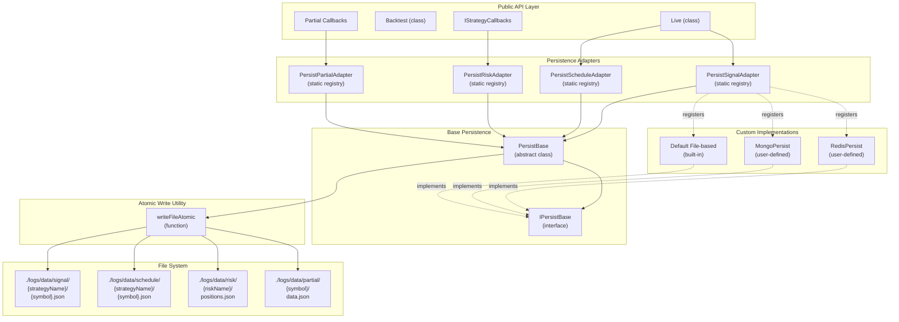
```mermaid
graph TB
    subgraph "Public API Layer"
        LiveClass["Live (class)"]
        BacktestClass["Backtest (class)"]
        StrategyCallbacks["IStrategyCallbacks"]
        PartialCallbacks["Partial Callbacks"]
    end
    
    subgraph "Persistence Adapters"
        PersistSignalAdaper["PersistSignalAdapter<br/>(static registry)"]
        PersistScheduleAdapter["PersistScheduleAdapter<br/>(static registry)"]
        PersistRiskAdapter["PersistRiskAdapter<br/>(static registry)"]
        PersistPartialAdapter["PersistPartialAdapter<br/>(static registry)"]
    end
    
    subgraph "Base Persistence"
        PersistBase["PersistBase<br/>(abstract class)"]
        IPersistBase["IPersistBase<br/>(interface)"]
    end
    
    subgraph "Atomic Write Utility"
        writeFileAtomic["writeFileAtomic<br/>(function)"]
    end
    
    subgraph "File System"
        SignalFiles["./logs/data/signal/<br/>{strategyName}/<br/>{symbol}.json"]
        ScheduleFiles["./logs/data/schedule/<br/>{strategyName}/<br/>{symbol}.json"]
        RiskFiles["./logs/data/risk/<br/>{riskName}/<br/>positions.json"]
        PartialFiles["./logs/data/partial/<br/>{symbol}/<br/>data.json"]
    end
    
    subgraph "Custom Implementations"
        RedisAdapter["RedisPersist<br/>(user-defined)"]
        MongoAdapter["MongoPersist<br/>(user-defined)"]
        FileAdapter["Default File-based<br/>(built-in)"]
    end
    
    LiveClass --> PersistSignalAdaper
    LiveClass --> PersistScheduleAdapter
    StrategyCallbacks --> PersistRiskAdapter
    PartialCallbacks --> PersistPartialAdapter
    
    PersistSignalAdaper --> PersistBase
    PersistScheduleAdapter --> PersistBase
    PersistRiskAdapter --> PersistBase
    PersistPartialAdapter --> PersistBase
    
    PersistBase --> IPersistBase
    PersistBase --> writeFileAtomic
    
    RedisAdapter -.implements.-> IPersistBase
    MongoAdapter -.implements.-> IPersistBase
    FileAdapter -.implements.-> IPersistBase
    
    writeFileAtomic --> SignalFiles
    writeFileAtomic --> ScheduleFiles
    writeFileAtomic --> RiskFiles
    writeFileAtomic --> PartialFiles
    
    PersistSignalAdaper -.registers.-> RedisAdapter
    PersistSignalAdaper -.registers.-> MongoAdapter
    PersistSignalAdaper -.registers.-> FileAdapter
```

**Sources:** [src/client/ClientStrategy.ts:27](), [README.md:260-261]()

## PersistBase Abstract Class

`PersistBase` is the foundation for all persistence implementations. It provides a file-based default implementation that can be overridden for custom backends.

### Core Interface

The `IPersistBase` interface defines the contract all persistence implementations must fulfill:

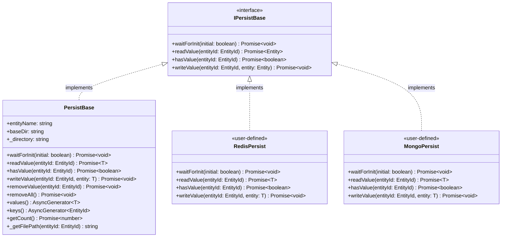
```mermaid
classDiagram
    class IPersistBase {
        <<interface>>
        +waitForInit(initial: boolean) Promise~void~
        +readValue(entityId: EntityId) Promise~Entity~
        +hasValue(entityId: EntityId) Promise~boolean~
        +writeValue(entityId: EntityId, entity: Entity) Promise~void~
    }
    
    class PersistBase {
        +entityName: string
        +baseDir: string
        +_directory: string
        +waitForInit(initial: boolean) Promise~void~
        +readValue(entityId: EntityId) Promise~T~
        +hasValue(entityId: EntityId) Promise~boolean~
        +writeValue(entityId: EntityId, entity: T) Promise~void~
        +removeValue(entityId: EntityId) Promise~void~
        +removeAll() Promise~void~
        +values() AsyncGenerator~T~
        +keys() AsyncGenerator~EntityId~
        +getCount() Promise~number~
        +_getFilePath(entityId: EntityId) string
    }
    
    class RedisPersist {
        <<user-defined>>
        +waitForInit(initial: boolean) Promise~void~
        +readValue(entityId: EntityId) Promise~T~
        +hasValue(entityId: EntityId) Promise~boolean~
        +writeValue(entityId: EntityId, entity: T) Promise~void~
    }
    
    class MongoPersist {
        <<user-defined>>
        +waitForInit(initial: boolean) Promise~void~
        +readValue(entityId: EntityId) Promise~T~
        +hasValue(entityId: EntityId) Promise~boolean~
        +writeValue(entityId: EntityId, entity: T) Promise~void~
    }
    
    IPersistBase <|.. PersistBase : implements
    IPersistBase <|.. RedisPersist : implements
    IPersistBase <|.. MongoPersist : implements
```

**Sources:** [src/classes/Persist.ts:69-111](), [src/classes/Persist.ts:160-177]()

### Constructor and Directory Setup

The constructor accepts an `entityName` (e.g., "signal", "risk") and optional `baseDir` (default: `./logs/data`). It computes the storage directory as `baseDir/entityName`:

| Parameter | Type | Default | Purpose |
|-----------|------|---------|---------|
| `entityName` | `string` | required | Unique identifier for entity type |
| `baseDir` | `string` | `./logs/data` | Base directory for all persistence |
| `_directory` | `string` | computed | Full path: `baseDir/entityName` |

**Sources:** [src/classes/Persist.ts:178-197]()

### CRUD Operations

#### Read Operations

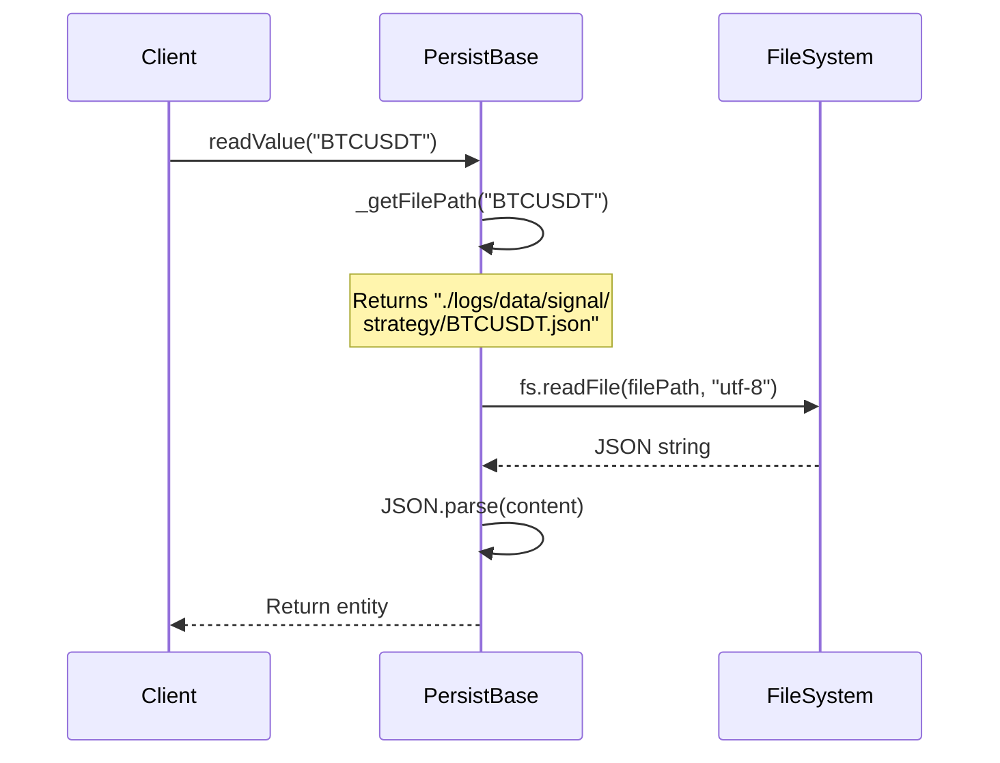
```mermaid
sequenceDiagram
    participant Client
    participant PersistBase
    participant FileSystem
    
    Client->>PersistBase: readValue("BTCUSDT")
    PersistBase->>PersistBase: _getFilePath("BTCUSDT")
    Note over PersistBase: Returns "./logs/data/signal/<br/>strategy/BTCUSDT.json"
    PersistBase->>FileSystem: fs.readFile(filePath, "utf-8")
    FileSystem-->>PersistBase: JSON string
    PersistBase->>PersistBase: JSON.parse(content)
    PersistBase-->>Client: Return entity
```

**Sources:** [src/classes/Persist.ts:232-253]()

#### Write Operations

Write operations use `writeFileAtomic` to ensure crash safety (see [Atomic File Writes](#atomic-file-writes)):

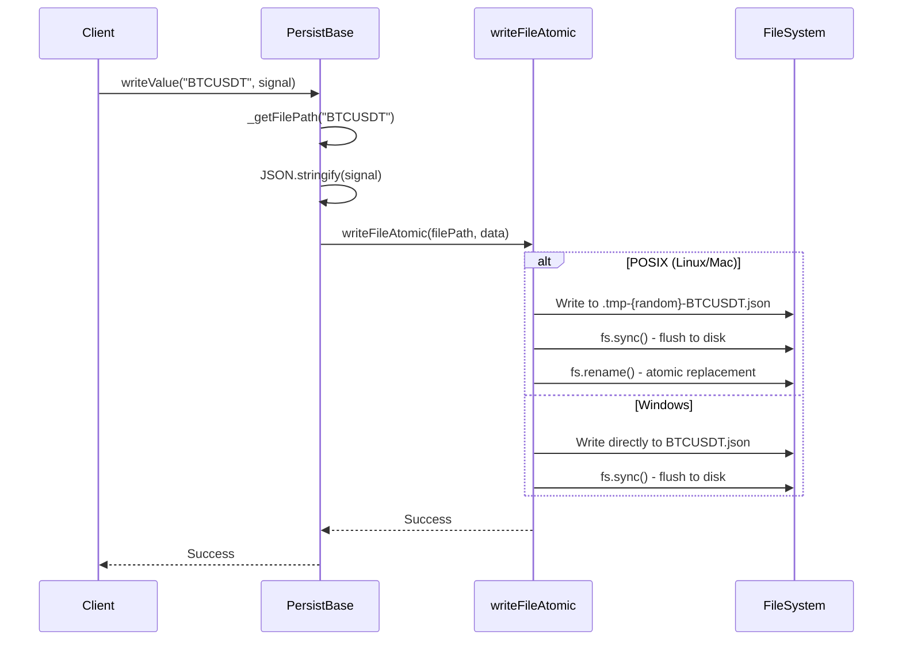
```mermaid
sequenceDiagram
    participant Client
    participant PersistBase
    participant writeFileAtomic
    participant FileSystem
    
    Client->>PersistBase: writeValue("BTCUSDT", signal)
    PersistBase->>PersistBase: _getFilePath("BTCUSDT")
    PersistBase->>PersistBase: JSON.stringify(signal)
    PersistBase->>writeFileAtomic: writeFileAtomic(filePath, data)
    
    alt POSIX (Linux/Mac)
        writeFileAtomic->>FileSystem: Write to .tmp-{random}-BTCUSDT.json
        writeFileAtomic->>FileSystem: fs.sync() - flush to disk
        writeFileAtomic->>FileSystem: fs.rename() - atomic replacement
    else Windows
        writeFileAtomic->>FileSystem: Write directly to BTCUSDT.json
        writeFileAtomic->>FileSystem: fs.sync() - flush to disk
    end
    
    writeFileAtomic-->>PersistBase: Success
    PersistBase-->>Client: Success
```

**Sources:** [src/classes/Persist.ts:276-295](), [src/utils/writeFileAtomic.ts:63-140]()

#### Existence Check

The `hasValue` method checks if an entity exists without reading its contents:

| Method | Returns | Error Handling |
|--------|---------|----------------|
| `hasValue(entityId)` | `true` if exists | Returns `false` on ENOENT |
| | `false` if not exists | Throws on other errors |

**Sources:** [src/classes/Persist.ts:255-274]()

#### Delete Operations

```typescript
// Remove single entity
await persist.removeValue("BTCUSDT");

// Remove all entities for this type
await persist.removeAll();
```

**Sources:** [src/classes/Persist.ts:304-349]()

### Async Iteration Support

`PersistBase` implements `AsyncIterableIterator` for convenient iteration over all stored entities:

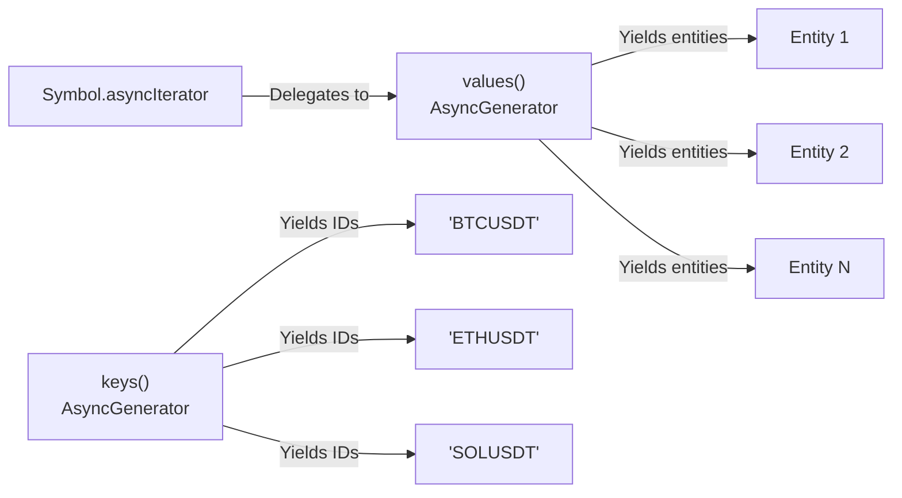
```mermaid
graph LR
    values["values()<br/>AsyncGenerator"]
    keys["keys()<br/>AsyncGenerator"]
    Symbol["Symbol.asyncIterator"]
    
    values --> |"Yields entities"| Entity1["Entity 1"]
    values --> |"Yields entities"| Entity2["Entity 2"]
    values --> |"Yields entities"| EntityN["Entity N"]
    
    keys --> |"Yields IDs"| Key1["'BTCUSDT'"]
    keys --> |"Yields IDs"| Key2["'ETHUSDT'"]
    keys --> |"Yields IDs"| KeyN["'SOLUSDT'"]
    
    Symbol --> |"Delegates to"| values
```

Entities are sorted alphanumerically by ID using `localeCompare` with numeric sensitivity.

**Sources:** [src/classes/Persist.ts:358-430]()

## Atomic File Writes

The `writeFileAtomic` function ensures that file writes either complete fully or leave the original file unchanged, preventing data corruption during crashes.

### Platform-Specific Behavior

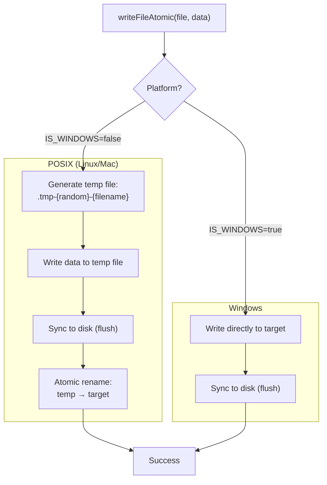
```mermaid
graph TB
    Start["writeFileAtomic(file, data)"]
    CheckOS{Platform?}
    
    subgraph "POSIX (Linux/Mac)"
        TmpFile["Generate temp file:<br/>.tmp-{random}-{filename}"]
        Write1["Write data to temp file"]
        Sync1["Sync to disk (flush)"]
        Rename["Atomic rename:<br/>temp → target"]
    end
    
    subgraph "Windows"
        Write2["Write directly to target"]
        Sync2["Sync to disk (flush)"]
    end
    
    Start --> CheckOS
    CheckOS -->|IS_WINDOWS=false| TmpFile
    CheckOS -->|IS_WINDOWS=true| Write2
    
    TmpFile --> Write1
    Write1 --> Sync1
    Sync1 --> Rename
    
    Write2 --> Sync2
    
    Rename --> Done["Success"]
    Sync2 --> Done
```

| Platform | Strategy | Atomicity | Temp File |
|----------|----------|-----------|-----------|
| POSIX | Temp file + rename | Full atomic replacement | `.tmp-{random}-{filename}` |
| Windows | Direct write + sync | Minimizes corruption risk | None |

**Sources:** [src/utils/writeFileAtomic.ts:6-140]()

### Error Handling and Cleanup

On POSIX systems, if any step fails, the temporary file is cleaned up before rethrowing the error:

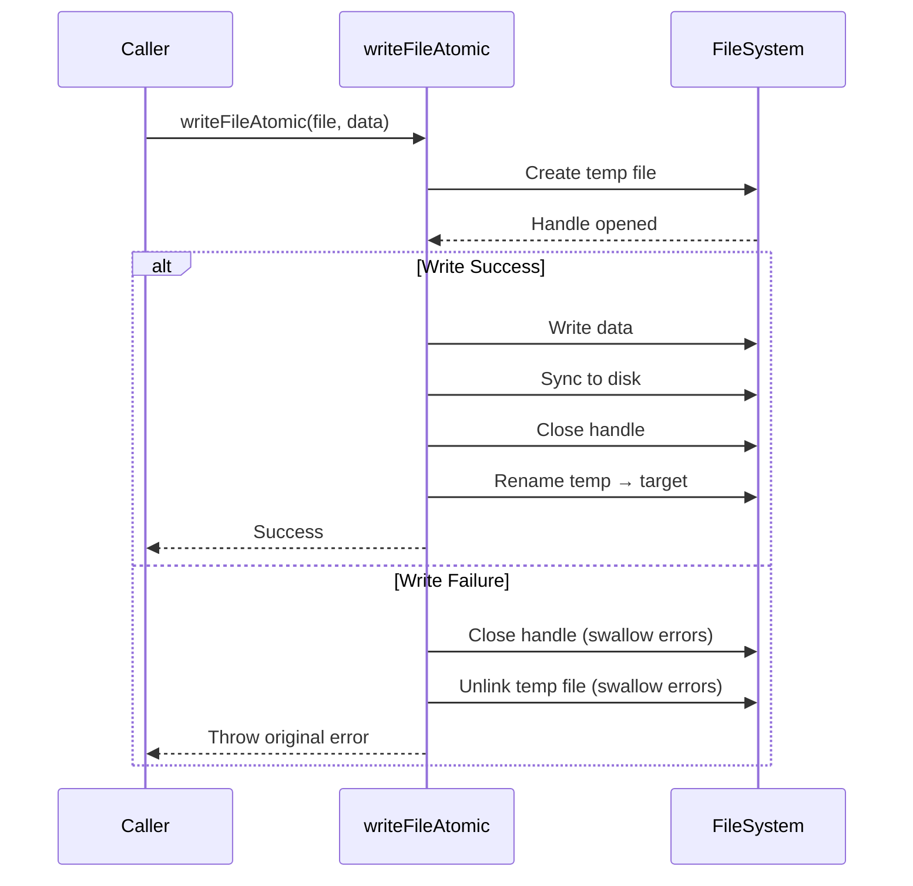
```mermaid
sequenceDiagram
    participant Caller
    participant writeFileAtomic
    participant FileSystem
    
    Caller->>writeFileAtomic: writeFileAtomic(file, data)
    writeFileAtomic->>FileSystem: Create temp file
    FileSystem-->>writeFileAtomic: Handle opened
    
    alt Write Success
        writeFileAtomic->>FileSystem: Write data
        writeFileAtomic->>FileSystem: Sync to disk
        writeFileAtomic->>FileSystem: Close handle
        writeFileAtomic->>FileSystem: Rename temp → target
        writeFileAtomic-->>Caller: Success
    else Write Failure
        writeFileAtomic->>FileSystem: Close handle (swallow errors)
        writeFileAtomic->>FileSystem: Unlink temp file (swallow errors)
        writeFileAtomic-->>Caller: Throw original error
    end
```

**Sources:** [src/utils/writeFileAtomic.ts:109-140]()

### Configuration Options

```typescript
interface Options {
  encoding?: BufferEncoding | undefined;  // Default: "utf8"
  mode?: number | undefined;              // Default: 0o666
  tmpPrefix?: string;                     // Default: ".tmp-"
}
```

**Sources:** [src/utils/writeFileAtomic.ts:9-18]()

## Default File-Based Persistence

The default implementation stores entities as JSON files in a hierarchical directory structure.

### Directory Structure

```
./logs/data/
├── signal/
│   ├── strategy-a/
│   │   ├── BTCUSDT.json
│   │   ├── ETHUSDT.json
│   │   └── SOLUSDT.json
│   └── strategy-b/
│       └── BTCUSDT.json
├── schedule/
│   ├── strategy-a/
│   │   ├── BTCUSDT.json
│   │   └── ETHUSDT.json
│   └── strategy-b/
│       └── BTCUSDT.json
├── risk/
│   ├── conservative/
│   │   └── positions.json
│   └── aggressive/
│       └── positions.json
└── partial/
    ├── BTCUSDT/
    │   └── data.json
    └── ETHUSDT/
        └── data.json
```

| Entity Type | Entity Name | Entity ID | File Path |
|------------|-------------|-----------|-----------|
| `signal` | `strategy-a` | `BTCUSDT` | `./logs/data/signal/strategy-a/BTCUSDT.json` |
| `schedule` | `strategy-a` | `BTCUSDT` | `./logs/data/schedule/strategy-a/BTCUSDT.json` |
| `risk` | `conservative` | `positions` | `./logs/data/risk/conservative/positions.json` |
| `partial` | `BTCUSDT` | `data` | `./logs/data/partial/BTCUSDT/data.json` |

**Sources:** [src/client/ClientStrategy.ts:27](), [README.md:260-261]()

### JSON Serialization

All entities are serialized using `JSON.stringify` and deserialized using `JSON.parse`:

```typescript
// Write: Entity → JSON string → File
const serializedData = JSON.stringify(entity);
await writeFileAtomic(filePath, serializedData, "utf-8");

// Read: File → JSON string → Entity
const fileContent = await fs.readFile(filePath, "utf-8");
return JSON.parse(fileContent) as T;
```

**Sources:** [src/classes/Persist.ts:239-242](), [src/classes/Persist.ts:286-287]()

### File Validation and Cleanup

During `waitForInit`, the system validates all existing files and removes corrupted ones:

```mermaid
flowchart TD
    Start["waitForInit()"]
    CreateDir["Create directory (recursive)"]
    IterateFiles["for await (key of keys())"]
    TryRead{Try readValue(key)}
    
    TryRead -->|Success| NextFile
    TryRead -->|Parse Error| LogError["Log error:<br/>Invalid document"]
    LogError --> TryUnlink{Try unlink(file)}
    TryUnlink -->|Success| NextFile["Continue iteration"]
    TryUnlink -->|Failed| LogUnlinkError["Log unlink error"]
    LogUnlinkError --> NextFile
    
    NextFile --> MoreFiles{More files?}
    MoreFiles -->|Yes| IterateFiles
    MoreFiles -->|No| Done["Initialization complete"]
    
    Start --> CreateDir
    CreateDir --> IterateFiles
```

The cleanup uses retry logic with configurable parameters:

| Constant | Value | Purpose |
|----------|-------|---------|
| `BASE_UNLINK_RETRY_COUNT` | 5 | Number of retry attempts |
| `BASE_UNLINK_RETRY_DELAY` | 1000ms | Delay between retries |

**Sources:** [src/classes/Persist.ts:113-158](), [src/classes/Persist.ts:38-40]()

## Persistence Adapters

The framework provides four specialized adapter classes for different data types: signals, scheduled signals, risk positions, and partial profit/loss states.

### PersistSignalAdapter

Manages active signal state persistence for live trading. Each strategy-symbol combination gets its own file:

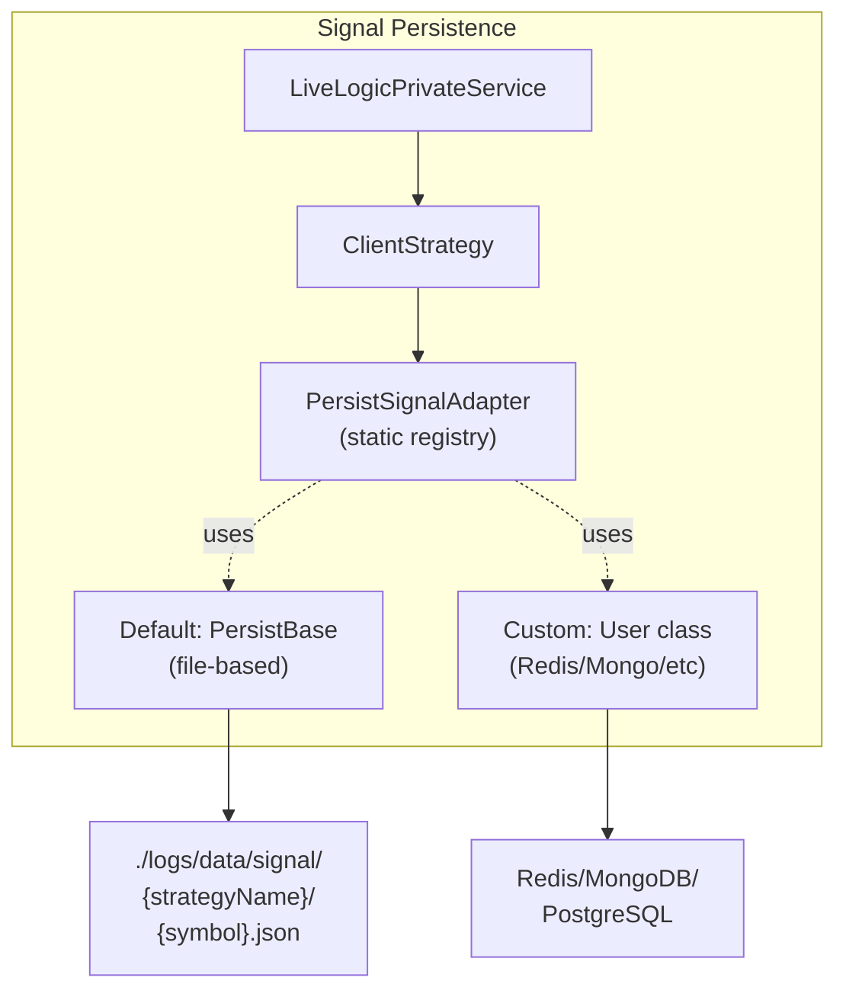
```mermaid
graph TB
    subgraph "Signal Persistence"
        LiveLogic["LiveLogicPrivateService"]
        ClientStrategy["ClientStrategy"]
        
        PersistSignalUtils["PersistSignalAdapter<br/>(static registry)"]
        
        DefaultImpl["Default: PersistBase<br/>(file-based)"]
        CustomImpl["Custom: User class<br/>(Redis/Mongo/etc)"]
    end
    
    LiveLogic --> ClientStrategy
    ClientStrategy --> PersistSignalUtils
    
    PersistSignalUtils -.uses.-> DefaultImpl
    PersistSignalUtils -.uses.-> CustomImpl
    
    DefaultImpl --> SignalFile["./logs/data/signal/<br/>{strategyName}/<br/>{symbol}.json"]
    CustomImpl --> ExternalDB["Redis/MongoDB/<br/>PostgreSQL"]
```

**Entity Name Pattern:** `signal/{strategyName}`  
**Entity ID Pattern:** `{symbol}` (e.g., "BTCUSDT")  
**Data Structure:** `ISignalRow | null` - single active signal per symbol

**Sources:** [src/client/ClientStrategy.ts:27](), [src/client/ClientStrategy.ts:411-429]()

### PersistScheduleAdapter

Manages scheduled signal state persistence for delayed entry orders. Each strategy-symbol combination stores one scheduled signal awaiting activation:

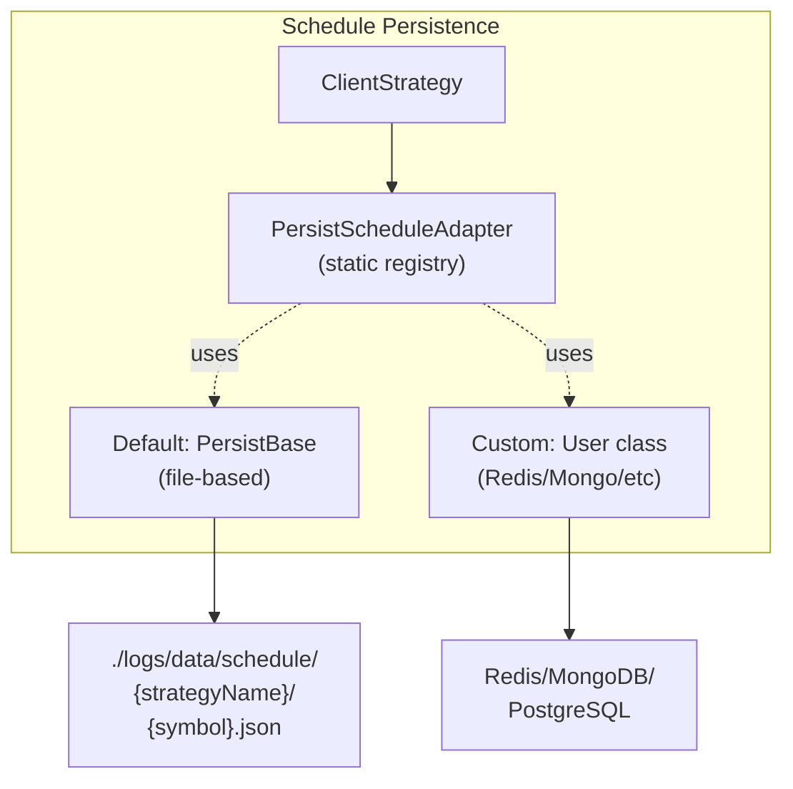
```mermaid
graph TB
    subgraph "Schedule Persistence"
        ClientStrategy["ClientStrategy"]
        
        PersistScheduleUtils["PersistScheduleAdapter<br/>(static registry)"]
        
        DefaultImpl["Default: PersistBase<br/>(file-based)"]
        CustomImpl["Custom: User class<br/>(Redis/Mongo/etc)"]
    end
    
    ClientStrategy --> PersistScheduleUtils
    
    PersistScheduleUtils -.uses.-> DefaultImpl
    PersistScheduleUtils -.uses.-> CustomImpl
    
    DefaultImpl --> ScheduleFile["./logs/data/schedule/<br/>{strategyName}/<br/>{symbol}.json"]
    CustomImpl --> ExternalDB["Redis/MongoDB/<br/>PostgreSQL"]
```

**Entity Name Pattern:** `schedule/{strategyName}`  
**Entity ID Pattern:** `{symbol}` (e.g., "BTCUSDT")  
**Data Structure:** `IScheduledSignalRow | null` - single scheduled signal per symbol

**Sources:** [src/client/ClientStrategy.ts:27](), [src/client/ClientStrategy.ts:445-471]()

### PersistRiskAdapter

Manages active position tracking for risk management. Each risk profile stores all positions across all strategies in a single file:

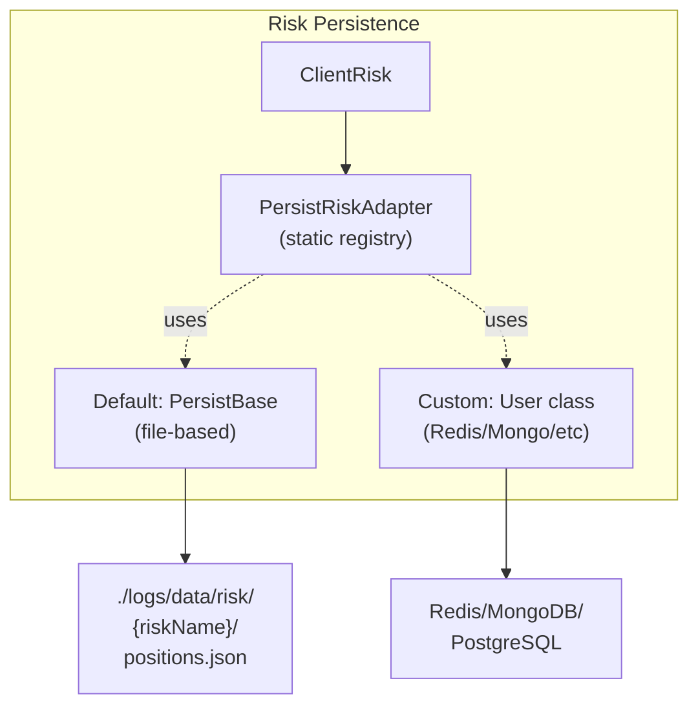
```mermaid
graph TB
    subgraph "Risk Persistence"
        ClientRisk["ClientRisk"]
        
        PersistRiskUtils["PersistRiskAdapter<br/>(static registry)"]
        
        DefaultImpl["Default: PersistBase<br/>(file-based)"]
        CustomImpl["Custom: User class<br/>(Redis/Mongo/etc)"]
    end
    
    ClientRisk --> PersistRiskUtils
    
    PersistRiskUtils -.uses.-> DefaultImpl
    PersistRiskUtils -.uses.-> CustomImpl
    
    DefaultImpl --> RiskFile["./logs/data/risk/<br/>{riskName}/<br/>positions.json"]
    CustomImpl --> ExternalDB["Redis/MongoDB/<br/>PostgreSQL"]
```

**Entity Name Pattern:** `risk/{riskName}`  
**Entity ID Pattern:** Always `"positions"`  
**Data Structure:** `Record<string, IRiskActivePosition[]>` - symbol-indexed position array

**Sources:** [README.md:648-684]()

### PersistPartialAdapter

Manages partial profit/loss milestone tracking. Each symbol stores which profit/loss levels (10%, 20%, 30%, etc.) have been reached for each active signal:

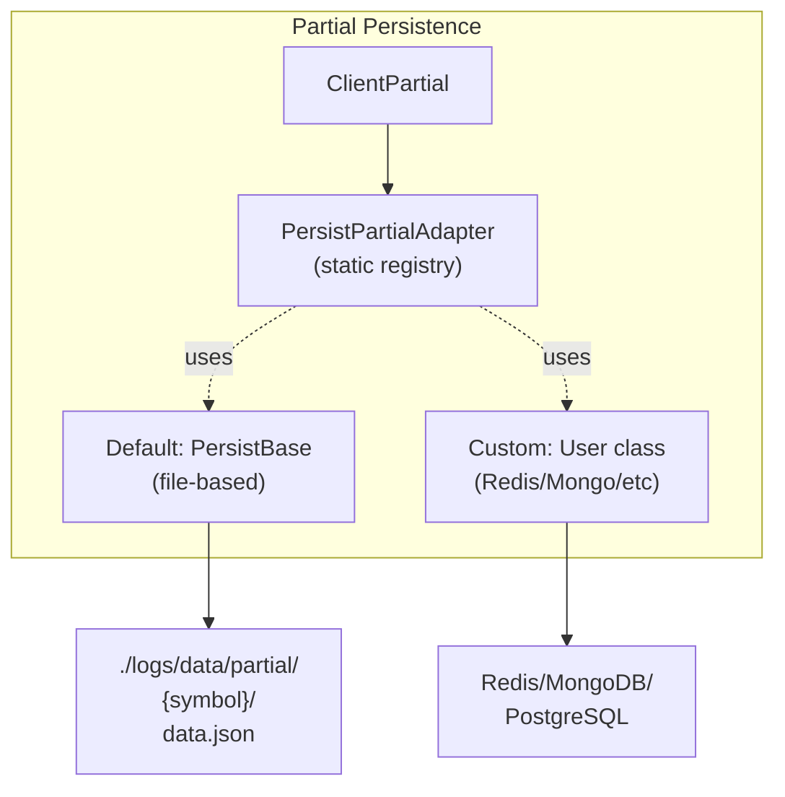
```mermaid
graph TB
    subgraph "Partial Persistence"
        ClientPartial["ClientPartial"]
        
        PersistPartialUtils["PersistPartialAdapter<br/>(static registry)"]
        
        DefaultImpl["Default: PersistBase<br/>(file-based)"]
        CustomImpl["Custom: User class<br/>(Redis/Mongo/etc)"]
    end
    
    ClientPartial --> PersistPartialUtils
    
    PersistPartialUtils -.uses.-> DefaultImpl
    PersistPartialUtils -.uses.-> CustomImpl
    
    DefaultImpl --> PartialFile["./logs/data/partial/<br/>{symbol}/<br/>data.json"]
    CustomImpl --> ExternalDB["Redis/MongoDB/<br/>PostgreSQL"]
```

**Entity Name Pattern:** `partial/{symbol}`  
**Entity ID Pattern:** Always `"data"`  
**Data Structure:** `Record<signalId, IPartialData>` - signal-indexed milestone tracking

**Sources:** [types.d.ts:586-604](), [README.md:254]()

### Custom Adapter Registration

Custom adapters are registered before running any strategies:

```typescript
import { 
  PersistSignalAdapter, 
  PersistScheduleAdapter,
  PersistRiskAdapter,
  PersistPartialAdapter 
} from "backtest-kit";

// Register custom signal adapter
PersistSignalAdapter.usePersistSignalAdapter(RedisPersist);

// Register custom schedule adapter
PersistScheduleAdapter.usePersistScheduleAdapter(RedisPersist);

// Register custom risk adapter
PersistRiskAdapter.usePersistRiskAdapter(MongoPersist);

// Register custom partial adapter
PersistPartialAdapter.usePersistPartialAdapter(MongoPersist);

// Now run strategies - they will use custom adapters
Live.background("BTCUSDT", { ... });
```

**Sources:** [README.md:260-261](), [README.md:863-877]()

## Crash Recovery and waitForInit

The `waitForInit` method implements crash recovery by validating existing data and cleaning up corrupted files.

### Initialization Pattern

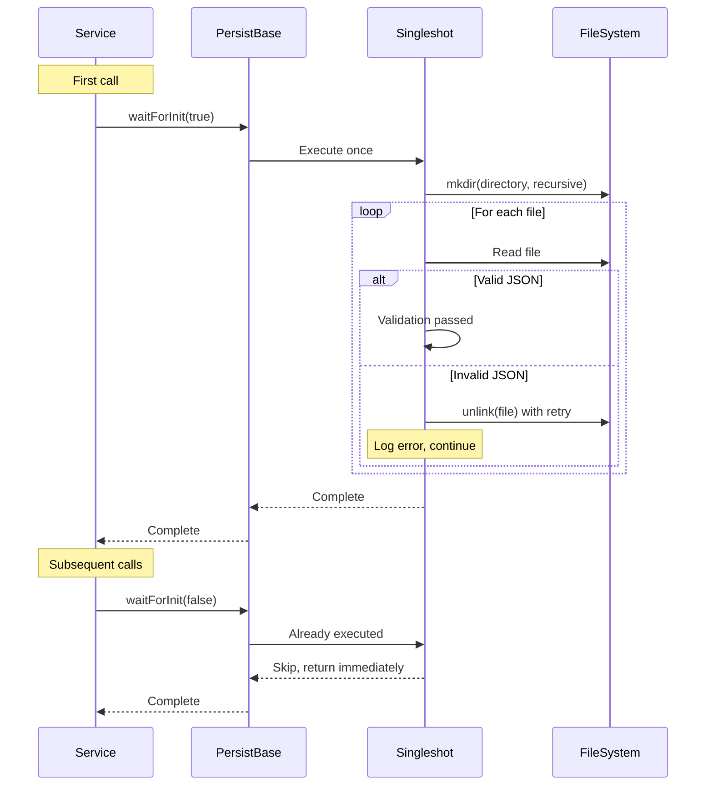
```mermaid
sequenceDiagram
    participant Service
    participant PersistBase
    participant Singleshot
    participant FileSystem
    
    Note over Service: First call
    Service->>PersistBase: waitForInit(true)
    PersistBase->>Singleshot: Execute once
    Singleshot->>FileSystem: mkdir(directory, recursive)
    
    loop For each file
        Singleshot->>FileSystem: Read file
        alt Valid JSON
            Singleshot->>Singleshot: Validation passed
        else Invalid JSON
            Singleshot->>FileSystem: unlink(file) with retry
            Note over Singleshot: Log error, continue
        end
    end
    
    Singleshot-->>PersistBase: Complete
    PersistBase-->>Service: Complete
    
    Note over Service: Subsequent calls
    Service->>PersistBase: waitForInit(false)
    PersistBase->>Singleshot: Already executed
    Singleshot-->>PersistBase: Skip, return immediately
    PersistBase-->>Service: Complete
```

The `singleshot` decorator ensures initialization happens only once, even if called multiple times.

**Sources:** [src/classes/Persist.ts:209-219](), [src/classes/Persist.ts:113-134]()

### Validation Logic

```mermaid
flowchart TD
    Start["For each file in directory"]
    ReadFile["Read file into memory"]
    ParseJSON{JSON.parse()}
    
    ParseJSON -->|Success| Valid["File is valid"]
    ParseJSON -->|Throws Error| Invalid["File is corrupted"]
    
    Invalid --> LogError["console.error:<br/>Invalid document"]
    LogError --> Retry["retry(fs.unlink, 5, 1000)"]
    
    Retry --> RetrySuccess{Retry result}
    RetrySuccess -->|Success| Continue["Continue to next file"]
    RetrySuccess -->|Failed| LogRetryError["console.error:<br/>Failed to remove"]
    LogRetryError --> Continue
    
    Valid --> Continue
    Continue --> MoreFiles{More files?}
    MoreFiles -->|Yes| Start
    MoreFiles -->|No| Done["Initialization complete"]
```

Error messages logged:

1. **Invalid document:** `"backtest-kit PersistBase found invalid document for filePath={path} entityName={name}"`
2. **Failed removal:** `"backtest-kit PersistBase failed to remove invalid document for filePath={path} entityName={name}"`

**Sources:** [src/classes/Persist.ts:113-158]()

## Custom Persistence Backends

Custom persistence implementations must implement the `IPersistBase` interface with four required methods.

### Interface Requirements

```typescript
interface IPersistBase<Entity extends IEntity = IEntity> {
  // Initialize connection/storage
  waitForInit(initial: boolean): Promise<void>;
  
  // Read entity by ID
  readValue(entityId: EntityId): Promise<Entity>;
  
  // Check if entity exists
  hasValue(entityId: EntityId): Promise<boolean>;
  
  // Write entity atomically
  writeValue(entityId: EntityId, entity: Entity): Promise<void>;
}
```

### Redis Implementation Example

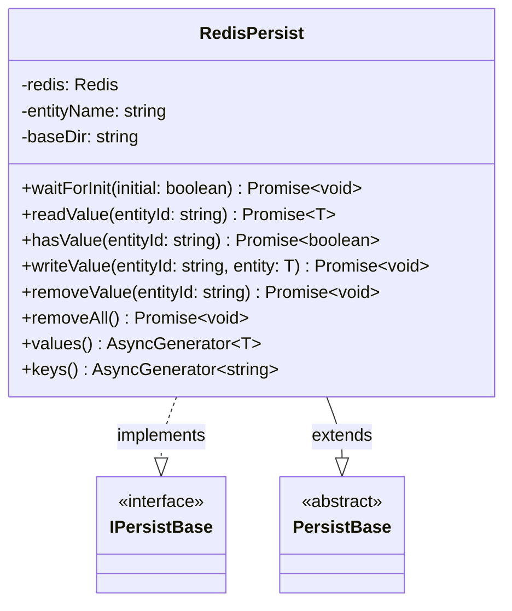
```mermaid
classDiagram
    class RedisPersist {
        -redis: Redis
        -entityName: string
        -baseDir: string
        
        +waitForInit(initial: boolean) Promise~void~
        +readValue(entityId: string) Promise~T~
        +hasValue(entityId: string) Promise~boolean~
        +writeValue(entityId: string, entity: T) Promise~void~
        +removeValue(entityId: string) Promise~void~
        +removeAll() Promise~void~
        +values() AsyncGenerator~T~
        +keys() AsyncGenerator~string~
    }
    
    class IPersistBase {
        <<interface>>
    }
    
    class PersistBase {
        <<abstract>>
    }
    
    RedisPersist ..|> IPersistBase : implements
    RedisPersist --|> PersistBase : extends
```

Key implementation details:

| Method | Redis Operation | Key Pattern |
|--------|-----------------|-------------|
| `readValue` | `redis.get(key)` | `{entityName}:{entityId}` |
| `hasValue` | `redis.exists(key)` | `{entityName}:{entityId}` |
| `writeValue` | `redis.set(key, data)` | `{entityName}:{entityId}` |
| `removeValue` | `redis.del(key)` | `{entityName}:{entityId}` |
| `removeAll` | `redis.keys()` + `redis.del()` | `{entityName}:*` |

**Sources:** [README.md:762-868]()

### MongoDB Implementation Example

MongoDB implementation uses a collection per entity type with documents containing `entityId` and `data` fields:

```typescript
// Collection schema
{
  entityId: string,      // e.g., "BTCUSDT"
  data: Entity,          // Serialized entity
  updatedAt: Date        // Last update timestamp
}
```

Key operations:

| Method | MongoDB Operation | Query Filter |
|--------|------------------|--------------|
| `readValue` | `collection.findOne()` | `{ entityId }` |
| `hasValue` | `collection.countDocuments()` | `{ entityId }` |
| `writeValue` | `collection.updateOne()` (upsert) | `{ entityId }` |
| `removeValue` | `collection.deleteOne()` | `{ entityId }` |
| `removeAll` | `collection.deleteMany()` | `{}` |

**Sources:** [README.md:888-965]()

### Adapter Selection Criteria

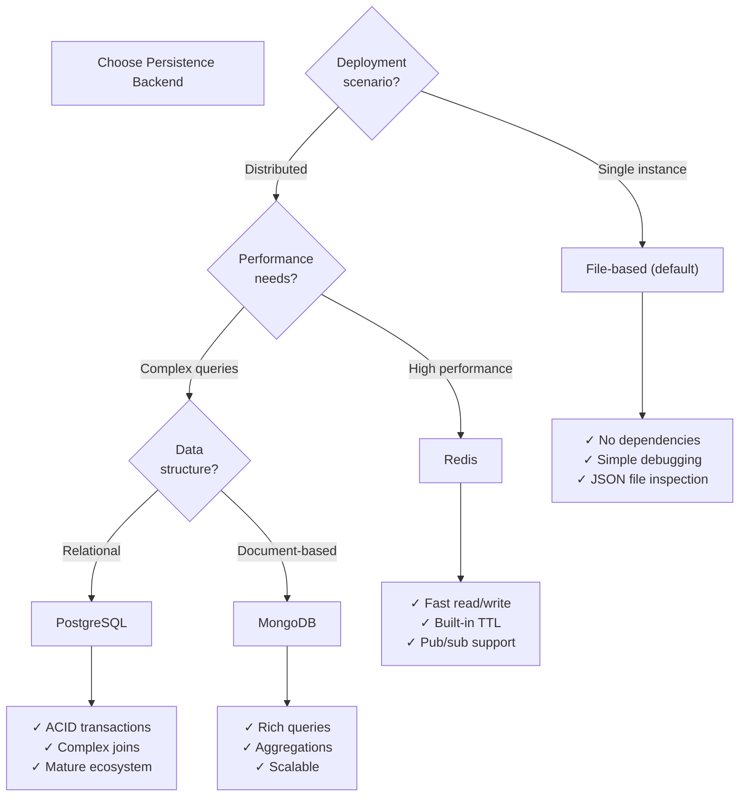
```mermaid
graph TB
    Start["Choose Persistence Backend"]
    
    Decision1{Deployment<br/>scenario?}
    
    Decision1 -->|Single instance| FileBased["File-based (default)"]
    Decision1 -->|Distributed| Decision2{Performance<br/>needs?}
    
    Decision2 -->|High performance| Redis["Redis"]
    Decision2 -->|Complex queries| Decision3{Data<br/>structure?}
    
    Decision3 -->|Relational| PostgreSQL["PostgreSQL"]
    Decision3 -->|Document-based| MongoDB["MongoDB"]
    
    FileBased --> Note1["✓ No dependencies<br/>✓ Simple debugging<br/>✓ JSON file inspection"]
    Redis --> Note2["✓ Fast read/write<br/>✓ Built-in TTL<br/>✓ Pub/sub support"]
    MongoDB --> Note3["✓ Rich queries<br/>✓ Aggregations<br/>✓ Scalable"]
    PostgreSQL --> Note4["✓ ACID transactions<br/>✓ Complex joins<br/>✓ Mature ecosystem"]
```

**Sources:** [README.md:1023-1043]()

## Usage Patterns

### Direct Usage

Users can instantiate `PersistBase` directly for custom data storage:

```typescript
import { PersistBase } from "backtest-kit";

// Create persistence for custom entity type
const tradingLogs = new PersistBase("trading-logs", "./logs/custom");

// Initialize
await tradingLogs.waitForInit(true);

// Write log entry
await tradingLogs.writeValue("log-1", {
  timestamp: Date.now(),
  message: "Strategy started",
  metadata: { symbol: "BTCUSDT" }
});

// Read log entry
const log = await tradingLogs.readValue("log-1");

// Iterate over all logs
for await (const log of tradingLogs.values()) {
  console.log("Log:", log);
}

// Filter logs (helper method)
for await (const log of tradingLogs.filter((l) => 
  l.metadata.symbol === "BTCUSDT"
)) {
  console.log("BTC Log:", log);
}
```

**Sources:** [README.md:971-1020]()

### Service Layer Integration

Services use persistence adapters through the dependency injection system:

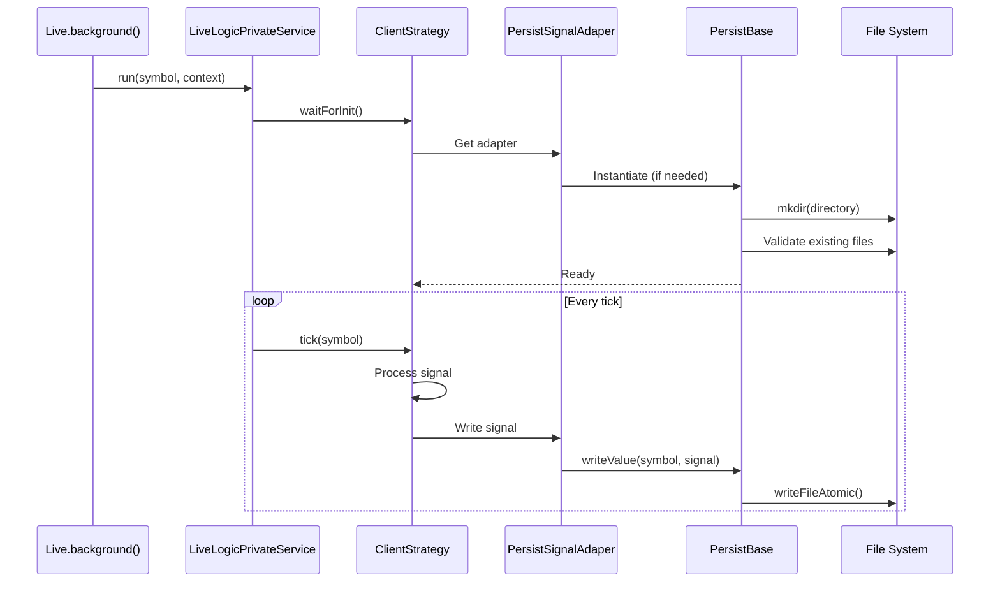
```mermaid
sequenceDiagram
    participant Live as Live.background()
    participant LiveLogic as LiveLogicPrivateService
    participant ClientStrategy as ClientStrategy
    participant PersistSignalUtils as PersistSignalAdaper
    participant Persist as PersistBase
    participant Disk as File System
    
    Live->>LiveLogic: run(symbol, context)
    LiveLogic->>ClientStrategy: waitForInit()
    ClientStrategy->>PersistSignalUtils: Get adapter
    PersistSignalUtils->>Persist: Instantiate (if needed)
    
    Persist->>Disk: mkdir(directory)
    Persist->>Disk: Validate existing files
    Persist-->>ClientStrategy: Ready
    
    loop Every tick
        LiveLogic->>ClientStrategy: tick(symbol)
        ClientStrategy->>ClientStrategy: Process signal
        ClientStrategy->>PersistSignalUtils: Write signal
        PersistSignalUtils->>Persist: writeValue(symbol, signal)
        Persist->>Disk: writeFileAtomic()
    end
```

**Sources:** [src/classes/Persist.ts:1-60]()

### Testing with Mock Adapters

Tests use mock adapters to avoid file system operations:

```typescript
// test/config/setup.mjs
PersistSignalAdaper.usePersistSignalAdapter(class {
  async waitForInit() { /* no-op */ }
  async readValue() { 
    throw new Error("Should not be called in tests");
  }
  async hasValue() { return false; }
  async writeValue() { /* no-op */ }
});
```

This pattern ensures tests run fast and don't leave artifacts on disk.

**Sources:** [test/config/setup.mjs:6-34]()

## Summary

The Persistence Layer provides:

1. **Crash-safe storage** via atomic file writes with platform-specific optimizations
2. **Automatic recovery** through file validation and cleanup during initialization
3. **Pluggable backends** supporting Redis, MongoDB, PostgreSQL, or custom implementations
4. **Simple API** with async iteration, filtering, and standard CRUD operations
5. **Zero data loss** guarantees for signal state and risk positions in live trading

**Key Classes:**
- `PersistBase` - Abstract base class with file-based default implementation
- `IPersistBase` - Interface for custom persistence backends
- `writeFileAtomic` - Atomic file writing utility
- `PersistSignalAdaper` - Adapter registry for signal persistence
- `PersistRiskAdapter` - Adapter registry for risk persistence

**Sources:** [src/classes/Persist.ts:1-177](), [src/utils/writeFileAtomic.ts:1-141](), [README.md:733-1070]()