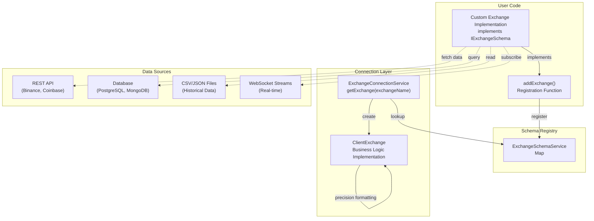
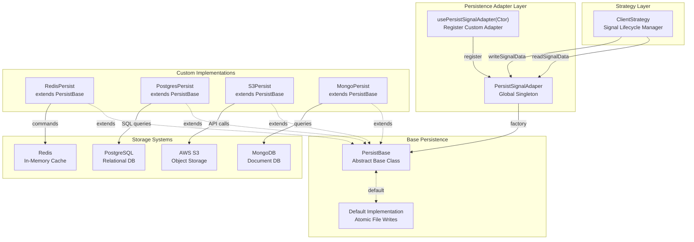
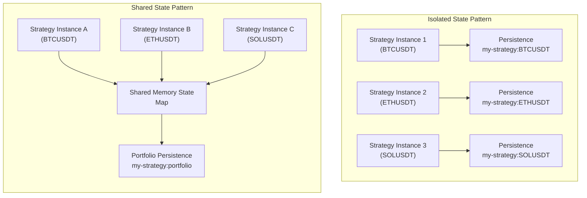

# Advanced Topics

<details>
<summary>Relevant source files</summary>

The following files were used as context for generating this wiki page:

- [README.md](README.md)
- [package-lock.json](package-lock.json)
- [package.json](package.json)
- [src/client/ClientOptimizer.ts](src/client/ClientOptimizer.ts)
- [src/interfaces/Optimizer.interface.ts](src/interfaces/Optimizer.interface.ts)
- [src/lib/services/connection/OptimizerConnectionService.ts](src/lib/services/connection/OptimizerConnectionService.ts)
- [src/lib/services/markdown/BacktestMarkdownService.ts](src/lib/services/markdown/BacktestMarkdownService.ts)
- [src/lib/services/markdown/LiveMarkdownService.ts](src/lib/services/markdown/LiveMarkdownService.ts)
- [src/lib/services/markdown/ScheduleMarkdownService.ts](src/lib/services/markdown/ScheduleMarkdownService.ts)
- [src/lib/services/template/OptimizerTemplateService.ts](src/lib/services/template/OptimizerTemplateService.ts)

</details>


This document covers advanced integration patterns and customization techniques for the backtest-kit framework. It explains how to implement custom exchange data sources, integrate alternative persistence backends, and design multi-symbol trading strategies with shared state management.

For basic usage of the public API, see [Public API Reference](#3). For service architecture patterns, see [Service Layer](#5). For signal lifecycle fundamentals, see [Signal Lifecycle](#6).

---

## Custom Exchange Integration

Custom exchange implementations allow integration with any data source including REST APIs, WebSocket streams, database queries, or CSV files. All custom exchanges must implement the `IExchangeSchema` interface and provide candle data, price formatting, and quantity formatting functions.

### Exchange Schema Interface

The `IExchangeSchema` interface defines the contract for custom exchange implementations:

| Method | Purpose | Required |
|--------|---------|----------|
| `exchangeName` | Unique identifier for the exchange | Yes |
| `getCandles(symbol, interval, since, limit)` | Fetch OHLCV candle data | Yes |
| `formatPrice(symbol, price)` | Format price with exchange precision | Yes |
| `formatQuantity(symbol, quantity)` | Format quantity with exchange precision | Yes |
| `callbacks` | Optional lifecycle event callbacks | No |

**Sources:** [types.d.ts:137-171]()

### Integration Architecture



**Sources:** [types.d.ts:137-171](), [src/index.ts:1-56]()

### REST API Integration Example

To integrate with a REST API exchange, implement the `IExchangeSchema` interface with HTTP client calls:

```typescript
// Reference pattern from README.md:32-52
// User implements getCandles() to fetch from external API
// User implements formatPrice() and formatQuantity() for precision rules
```

**Key considerations:**
- **Error Handling**: Wrap API calls in try-catch blocks to handle network failures
- **Rate Limiting**: Implement exponential backoff for API rate limits
- **Caching**: Cache symbol precision rules to reduce API calls
- **Authentication**: Store API keys in environment variables, not in schema
- **Data Transformation**: Convert API response format to `ICandleData` structure

The `ClientExchange` class will delegate all `getCandles()` calls to your implementation, as shown in [types.d.ts:1438-1477]().

**Sources:** [README.md:32-52](), [types.d.ts:137-171](), [types.d.ts:1438-1477]()

### Database Integration Example

Database-backed exchanges query historical candle data from local storage:

**Architectural flow:**
1. User implements `getCandles()` to query database with SQL/NoSQL
2. Schema converts database rows to `ICandleData[]` format
3. `ClientExchange` receives standardized candle data
4. VWAP calculation proceeds identically to API-based exchanges

**Database schema requirements:**
- Table/collection must store: `timestamp`, `open`, `high`, `low`, `close`, `volume`
- Timestamp must be Unix milliseconds or convertible to it
- Queries must support filtering by symbol, interval, date range, and limit

**Precision formatting:**
- Store symbol precision rules in separate table (e.g., `symbol_info`)
- Cache precision rules in memory after first query
- Use database functions for rounding if available

**Sources:** [types.d.ts:137-171](), [types.d.ts:104-118]()

### CSV File Integration Example

File-based exchanges read historical data from disk:

**Implementation approach:**
1. Parse CSV on first `getCandles()` call
2. Cache parsed data in memory (Map<symbol, ICandleData[]>)
3. Filter cached data by interval, since, and limit parameters
4. Return matching candles

**Performance optimizations:**
- Use streaming CSV parser for large files (>100MB)
- Index by symbol and timestamp for O(log n) lookups
- Lazy load files only when symbol is first requested
- Consider binary formats (Parquet, Arrow) for faster parsing

**Precision formatting:**
- Hardcode precision rules or read from separate config file
- No API calls needed for static historical data

**Sources:** [types.d.ts:137-171](), [types.d.ts:104-118]()

### Candle Data Transformation

All exchange implementations must return data in the `ICandleData` format:

```typescript
// Reference: types.d.ts:104-118
// timestamp: Unix milliseconds (e.g., 1704067200000)
// open, high, low, close, volume: positive numbers
```

**Common transformations:**

| Source Format | Target Format | Conversion |
|---------------|---------------|------------|
| ISO 8601 string | Unix milliseconds | `new Date(isoString).getTime()` |
| Unix seconds | Unix milliseconds | `unixSeconds * 1000` |
| String numbers | Number | `parseFloat(stringPrice)` |
| Scientific notation | Decimal | Native JavaScript handling |

**Validation rules:**
- `timestamp` must be positive integer
- `high >= open, low, close` (high is maximum)
- `low <= open, high, close` (low is minimum)
- `volume >= 0` (can be zero for illiquid pairs)

**Sources:** [types.d.ts:104-118]()

### Exchange Callbacks

Optional callbacks provide observability into exchange operations:

```typescript
// Reference: types.d.ts:131-135
// onCandleData(symbol, interval, since, limit, data)
// Called after every successful getCandles() invocation
```

**Use cases:**
- **Logging**: Track all data fetches with parameters and result counts
- **Metrics**: Count API calls per symbol/interval for rate limit monitoring
- **Caching**: Implement external cache layer (Redis) by intercepting data
- **Debugging**: Dump raw candle data to file for troubleshooting
- **Testing**: Verify that backtest requests expected date ranges

The callback is invoked by `ClientExchange.getCandles()` after successful data fetch, as shown in [types.d.ts:1448-1449]().

**Sources:** [types.d.ts:131-135](), [types.d.ts:1438-1477]()

---

## Custom Persistence Backends

The default persistence implementation uses atomic file writes to local disk. Custom persistence backends enable integration with distributed databases, in-memory caches, or cloud storage systems for production deployments.

### Persistence Architecture



**Sources:** [types.d.ts:895-1125](), [README.md:676-690]()

### PersistBase Interface

Custom persistence adapters must implement the `IPersistBase` interface:

| Method | Purpose | Atomicity Required |
|--------|---------|-------------------|
| `waitForInit(initial)` | Initialize storage connection/schema | No |
| `readValue(entityId)` | Read signal data for strategy+symbol | No |
| `hasValue(entityId)` | Check if signal exists | No |
| `writeValue(entityId, entity)` | Write signal data atomically | **Yes** |

**Critical requirement:** The `writeValue()` method **must be atomic** to prevent signal duplication during crashes. If the write operation cannot complete atomically, implement two-phase commit or use database transactions.

**Sources:** [types.d.ts:926-959]()

### Redis Integration Example

Redis provides in-memory persistence with optional disk durability:

**Implementation pattern:**
1. Extend `PersistBase` class
2. Override `readValue()` to call `redis.get()`
3. Override `writeValue()` to call `redis.set()`
4. Override `hasValue()` to call `redis.exists()`
5. Use `redis.multi()` for atomic multi-key operations if needed

**Entity ID format:**
- Default: `${strategyName}:${symbol}` (e.g., `"my-strategy:BTCUSDT"`)
- Customize by overriding `_getFilePath()` method

**Atomicity considerations:**
- Single `SET` commands are atomic in Redis
- Use `SET` with `NX` flag to prevent race conditions
- Consider Redis transactions (`MULTI`/`EXEC`) for complex operations
- Enable AOF (Append-Only File) for durability

**Connection management:**
- Initialize Redis client in constructor
- Store client as instance variable
- Handle connection errors in `waitForInit()`
- Implement reconnection logic for production

**Sources:** [types.d.ts:977-1054](), [README.md:676-690]()

### PostgreSQL Integration Example

PostgreSQL provides ACID-compliant persistence with strong consistency:

**Schema design:**
```sql
-- Reference implementation approach
-- Table: signal_data
-- Columns: strategy_name, symbol, signal_json, updated_at
-- Primary Key: (strategy_name, symbol)
-- Index: strategy_name for efficient lookups
```

**Implementation details:**
1. Use parameterized queries to prevent SQL injection
2. Serialize `ISignalRow` to JSON before storage
3. Deserialize JSON to object on read
4. Use `INSERT ... ON CONFLICT UPDATE` for upserts
5. Wrap writes in transactions for atomicity

**Atomicity guarantees:**
- PostgreSQL transactions are ACID-compliant
- Single `INSERT`/`UPDATE` statements are atomic
- Use transaction isolation level `READ COMMITTED` or higher

**Performance optimizations:**
- Use connection pooling (pg-pool)
- Create index on `(strategy_name, symbol)` for fast lookups
- Batch reads/writes when possible
- Consider partitioning by strategy_name for large deployments

**Sources:** [types.d.ts:977-1054](), [types.d.ts:896-903]()

### MongoDB Integration Example

MongoDB provides document-based persistence with flexible schema:

**Collection design:**
```javascript
// Reference schema structure
// Collection: signal_data
// Document: { _id: "strategy:symbol", strategyName, symbol, signalRow, updatedAt }
```

**Implementation approach:**
1. Use `findOne()` for reads
2. Use `updateOne()` with `upsert: true` for writes
3. Set `_id` field to `${strategyName}:${symbol}` for deterministic keys
4. Store `signalRow` as nested document (not JSON string)

**Atomicity guarantees:**
- Single document operations are atomic in MongoDB
- Use `findOneAndUpdate()` for atomic read-modify-write
- Consider MongoDB transactions for multi-document operations

**Connection handling:**
- Use MongoDB connection pool
- Handle connection timeouts
- Implement retry logic for transient failures

**Sources:** [types.d.ts:977-1054]()

### AWS S3 Integration Example

S3 provides object storage with eventual consistency:

**Implementation considerations:**

| Aspect | Approach |
|--------|----------|
| Object key | `${strategyName}/${symbol}.json` |
| Content-Type | `application/json` |
| Atomicity | Use S3 conditional writes (If-None-Match) |
| Read consistency | S3 is now strongly consistent for new objects |
| Permissions | Use IAM roles, not access keys |

**Atomicity challenges:**
- S3 does not support traditional ACID transactions
- Use S3 object versioning to track changes
- Implement optimistic locking with ETag comparison
- Consider DynamoDB for critical metadata with stronger consistency

**Performance characteristics:**
- High latency (50-200ms per operation)
- Not suitable for high-frequency trading
- Good for long-running strategies with minute-level signals
- Use S3 Transfer Acceleration for lower latency

**Cost optimization:**
- Use S3 Standard-IA for infrequent access
- Implement lifecycle policies to archive old signals
- Batch operations when possible

**Sources:** [types.d.ts:977-1054]()

### Registration and Usage

Custom persistence adapters are registered globally before running strategies:

```typescript
// Reference: README.md:676-690
// PersistSignalAdaper.usePersistSignalAdapter(CustomPersistClass)
// Must be called before first strategy execution
```

**Registration flow:**
1. Implement custom `PersistBase` subclass
2. Call `usePersistSignalAdapter()` with constructor
3. Framework replaces default file-based persistence
4. All strategies use new persistence backend automatically

**Important notes:**
- Registration must happen **before** first `Backtest.run()` or `Live.run()` call
- All strategies share the same persistence backend (global singleton)
- Cannot mix persistence backends per strategy
- Re-registration is allowed but affects all future operations

**Sources:** [types.d.ts:1067-1125](), [README.md:676-690]()

### Persistence Data Format

All persistence implementations must store and retrieve `ISignalData` objects:

```typescript
// Reference: types.d.ts:896-903
// interface ISignalData {
//   signalRow: ISignalRow | null
// }
```

**Storage format:**
- When signal is active: `{ signalRow: { id, position, priceOpen, ... } }`
- When signal is closed: `{ signalRow: null }`
- Null value indicates no active signal for strategy+symbol

**Entity ID structure:**
- Default implementation uses: `${strategyName}:${symbol}`
- Example: `"my-strategy:BTCUSDT"` → `my-strategy/BTCUSDT.json`
- Custom implementations can override key format

**Crash recovery:**
- On startup, `ClientStrategy.waitForInit()` calls `readSignalData()`
- If signal exists, resume monitoring from persisted state
- If signal is null, start fresh with no active signal
- This prevents duplicate signal generation after crashes

**Sources:** [types.d.ts:896-903](), [types.d.ts:1095-1107]()

---

## Multi-Symbol Strategies

Multi-symbol strategies execute the same trading logic across multiple symbols simultaneously. The framework supports both isolated state (independent signals per symbol) and shared state (portfolio-level decisions) patterns.

### Execution Patterns



**Sources:** [README.md:693-715]()

### Isolated State Pattern

The isolated state pattern runs independent strategy instances per symbol with separate persistence:

**Characteristics:**

| Aspect | Behavior |
|--------|----------|
| Signal generation | Independent per symbol |
| Persistence | Separate files/keys per symbol |
| Crash recovery | Per-symbol state restoration |
| Position sizing | Fixed per symbol |
| Risk management | Symbol-level only |

**Implementation approach:**
```typescript
// Reference: README.md:693-715
// Promise.all() with multiple Live.run() calls
// Each symbol gets isolated execution context
```

**Parallel execution:**
- Use `Promise.all()` to run symbols concurrently
- Each symbol has independent generator loop
- No shared memory between symbols
- No global position limits

**Use cases:**
- Testing strategy across multiple pairs independently
- Running different parameter sets per symbol
- Simple portfolio diversification without correlation

**Sources:** [README.md:693-715]()

### Shared State Pattern

The shared state pattern maintains global state across all symbols for portfolio-level decisions:

**Implementation requirements:**

1. **Global State Container:**
```typescript
// User implements custom state management
// Example: Map<symbol, ISignalRow> for tracking all active signals
// Store in closure or external state management library
```

2. **Portfolio Persistence:**
```typescript
// User implements custom persistence for shared state
// Single persistence key for entire portfolio
// Atomic updates to prevent partial state writes
```

3. **Position Sizing:**
```typescript
// User implements portfolio-level position sizing
// Calculate available capital across all symbols
// Enforce maximum open positions limit
// Balance capital allocation dynamically
```

**Synchronization concerns:**
- Use mutex/lock for shared state modifications
- Atomic read-modify-write operations
- Race condition prevention between symbols
- Consider message queue for distributed systems

**Sources:** [README.md:693-715]()

### Position Limit Enforcement

Portfolio-level position limits prevent over-exposure:

**Implementation pattern:**

```typescript
// Inside getSignal() implementation:
// 1. Check global position counter
// 2. If at max limit, return null (no new signal)
// 3. If below limit, generate signal and increment counter
// 4. On signal close, decrement counter
```

**State tracking:**
- Store active position count in shared memory
- Persist count to disk for crash recovery
- Use atomic operations for increment/decrement
- Handle race conditions with locks

**Example limits:**
- Maximum 5 open positions across all symbols
- Maximum 2 long positions in same sector
- Maximum 50% capital allocated to any single position
- Maximum 3 signals per 15-minute window globally

**Sources:** [types.d.ts:410-422]()

### Risk Management Strategies

Multi-symbol strategies require portfolio-level risk management:

**Correlation analysis:**
- Track correlation between active positions
- Reduce position sizes for highly correlated pairs
- Example: BTC and ETH often move together

**Capital allocation:**
- Dynamic position sizing based on available capital
- Reserve capital for new opportunities
- Rebalance on position closes

**Stop-loss coordination:**
- Portfolio-level stop-loss (e.g., -10% total drawdown)
- Correlate individual stops with portfolio impact
- Close all positions if portfolio stop triggered

**Exposure limits:**
- Maximum percentage per symbol (e.g., 20%)
- Maximum percentage per asset class (e.g., 50% altcoins)
- Geographic/regulatory exposure limits

**Sources:** [types.d.ts:410-422](), [types.d.ts:427-508]()

### Event Listeners for Multi-Symbol

Event listeners aggregate signals across all symbols:

```typescript
// Reference: README.md:336-461
// listenSignal() receives events from all symbols
// Filter by symbol, strategyName, or other criteria
```

**Global monitoring:**
- Single listener receives events from all parallel executions
- Filter events by `result.signal.symbol` for per-symbol logic
- Aggregate statistics across portfolio
- Implement circuit breakers on excessive losses

**Per-symbol monitoring:**
- Register separate listeners for each symbol
- Use `listenSignalOnce()` for one-time alerts
- Example: Alert when any symbol hits stop-loss

**Sources:** [README.md:336-461](), [types.d.ts:649-792]()

### Background Execution

Background execution runs strategies silently with event-driven reactions:

```typescript
// Reference: README.md:341-362
// Backtest.background() returns cancellation function
// Live.background() returns cancellation function
// Use event listeners to react to signals
```

**Benefits:**
- Lower memory usage (no yielded results accumulation)
- Event-driven architecture
- Clean separation of execution and monitoring
- Multiple strategies can run in parallel

**Cancellation handling:**
```typescript
// Store cancellation functions in array
// Call all cancellation functions to stop portfolio
// Example: stops[] = [stopBTC, stopETH, stopSOL]
// stops.forEach(stop => stop())
```

**Sources:** [README.md:341-362](), [types.d.ts:1169-1184](), [types.d.ts:1289-1303]()

### Performance Considerations

Multi-symbol execution impacts system resources:

**Memory usage:**

| Pattern | Memory Per Symbol | Total for 10 Symbols |
|---------|------------------|---------------------|
| Isolated (streaming) | ~1-2 MB | ~10-20 MB |
| Isolated (accumulated) | ~10-50 MB | ~100-500 MB |
| Shared state | ~1-2 MB + shared | ~10-20 MB + shared |

**CPU usage:**
- Each symbol requires periodic tick evaluations
- Exchange API calls can be parallelized
- VWAP calculations are O(n) per symbol
- Backtest simulations are CPU-bound

**Network usage:**
- API calls scale linearly with symbol count
- Consider rate limits per API key
- Use batched requests if exchange supports
- Cache symbol precision rules

**Recommendations:**
- Use streaming patterns (async generators) for backtests
- Limit concurrent symbols to stay within rate limits
- Implement connection pooling for API clients
- Monitor memory usage in production

**Sources:** [README.md:693-715](), [types.d.ts:1127-1233](), [types.d.ts:1237-1349]()

---

## Advanced Customization Patterns

### Custom Logger Integration

Custom loggers integrate with framework internals:

```typescript
// Reference: types.d.ts:32-49
// setLogger({ log, debug, info, warn })
// All internal services will use custom logger
// Automatic context injection (strategyName, exchangeName, symbol, when, backtest)
```

**Context injection:**
- `MethodContextService` provides strategyName, exchangeName, frameName
- `ExecutionContextService` provides symbol, when, backtest flag
- `LoggerService` automatically appends context to all log calls
- Example log: `"tick my-strategy binance BTCUSDT 2024-01-01T12:00:00Z backtest"`

**Use cases:**
- Integrate with structured logging (winston, bunyan)
- Send logs to centralized logging service (CloudWatch, Datadog)
- Filter logs by strategy or symbol
- Debug production issues with rich context

**Sources:** [types.d.ts:32-49](), [types.d.ts:1352-1410]()

### Context Services

Context services enable implicit parameter passing through the call stack:

```typescript
// Reference: types.d.ts:84-95 (ExecutionContextService)
// Reference: types.d.ts:344-350 (MethodContextService)
// Uses di-scoped for async-local-storage-like behavior
```

**ExecutionContextService:**
- Propagates `{ symbol, when, backtest }` through execution
- Set by Logic services before each tick/backtest call
- Accessed by Exchange/Strategy services without explicit parameters

**MethodContextService:**
- Propagates `{ strategyName, exchangeName, frameName }` through execution
- Set by Public services (Backtest/Live) before generator execution
- Accessed by Connection services for instance routing

**Benefits:**
- Eliminates parameter threading through 5+ layers
- Type-safe context access
- Automatic cleanup after async operations
- Testable with mock contexts

**Sources:** [types.d.ts:84-95](), [types.d.ts:344-350]()

### Service Extension

Extend framework services to add custom functionality:

**Extension points:**
- Override `ClientStrategy.getSignal()` for complex signal logic
- Override `ClientExchange.getCandles()` for custom data sources
- Override `ClientFrame.getTimeframe()` for dynamic timeframes
- Extend `PersistBase` for custom persistence backends

**Dependency injection:**
- All services are registered in [src/lib/core/provide.ts]()
- Services are resolved through DI container
- Custom services can be injected by replacing registrations

**Architecture constraints:**
- Client classes (ClientStrategy, ClientExchange, ClientFrame) have no DI
- Connection services route to appropriate client instances
- Global services wrap connection services with context injection
- Logic services orchestrate async generator execution

**Sources:** [src/index.ts:1-56]()