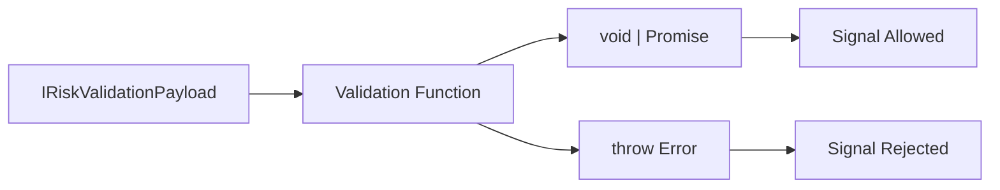
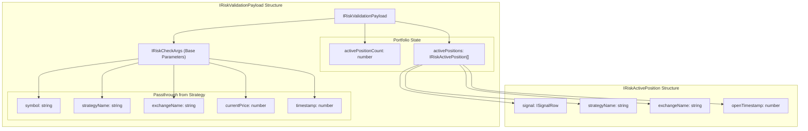
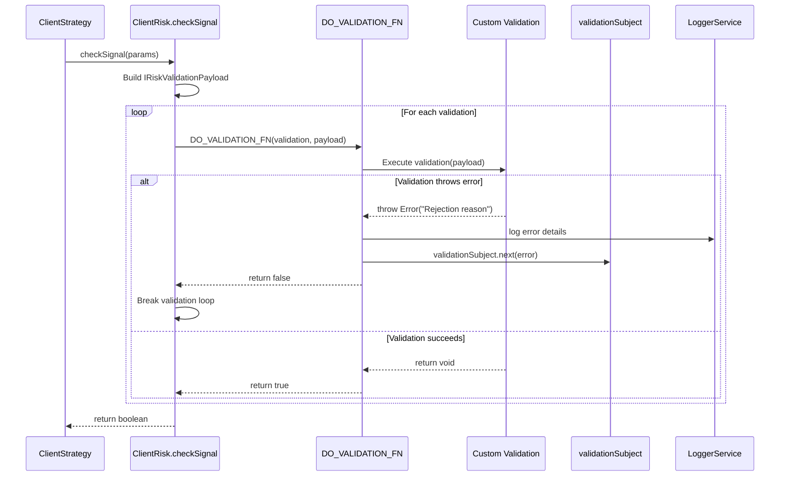
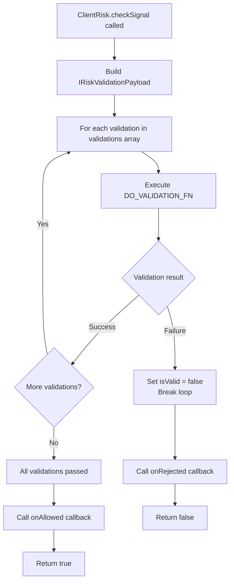
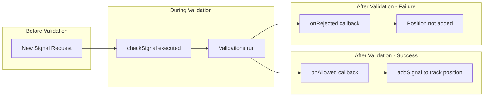
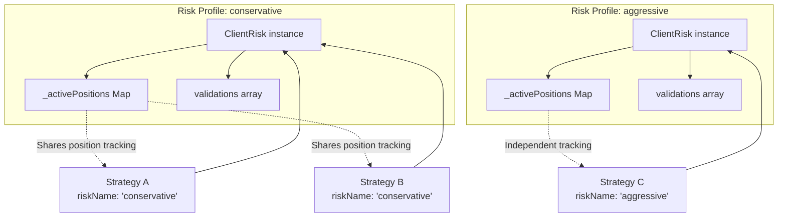
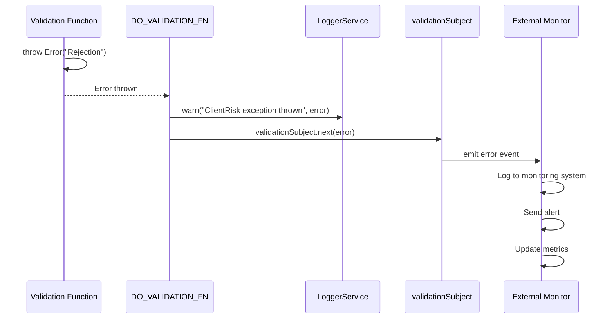

# Custom Risk Validations

<details>
<summary>Relevant source files</summary>

The following files were used as context for generating this wiki page:

- [src/client/ClientRisk.ts](src/client/ClientRisk.ts)
- [src/index.ts](src/index.ts)
- [src/interfaces/Risk.interface.ts](src/interfaces/Risk.interface.ts)
- [src/lib/services/connection/RiskConnectionService.ts](src/lib/services/connection/RiskConnectionService.ts)
- [src/lib/services/global/RiskGlobalService.ts](src/lib/services/global/RiskGlobalService.ts)
- [test/index.mjs](test/index.mjs)
- [test/spec/risk.test.mjs](test/spec/risk.test.mjs)
- [types.d.ts](types.d.ts)

</details>


## Purpose and Scope

This guide explains how to write custom risk validation functions for portfolio-level risk management in backtest-kit. Custom validations allow you to implement complex risk logic that evaluates signals before they are opened, providing fine-grained control over position acceptance based on portfolio state, market conditions, and custom business rules.

For information about risk schema structure and registration, see [Risk Schemas](#5.4). For the overall risk validation flow and position tracking, see [Risk Validation](#12.2) and [Position Tracking](#12.3).

**Sources:** [src/interfaces/Risk.interface.ts:62-85]()

## Validation Function Types

Risk validations can be provided in two formats when registering a risk profile via `addRisk()`:

**Format 1: Function Only**
```typescript
addRisk({
  riskName: "my-risk",
  validations: [
    async ({ activePositionCount }) => {
      if (activePositionCount >= 5) {
        throw new Error("Maximum 5 positions allowed");
      }
    }
  ]
});
```

**Format 2: Validation Object**
```typescript
addRisk({
  riskName: "my-risk",
  validations: [
    {
      validate: async ({ activePositionCount }) => {
        if (activePositionCount >= 5) {
          throw new Error("Maximum 5 positions allowed");
        }
      },
      note: "Limit concurrent positions to prevent over-exposure"
    }
  ]
});
```

Both formats are functionally equivalent. The object format allows you to attach documentation via the `note` field, which aids in understanding the validation's purpose during code review and maintenance.

**Sources:** [src/interfaces/Risk.interface.ts:62-85](), [src/interfaces/Risk.interface.ts:87-100]()

## Validation Function Signature



**Validation Function Signature**

The validation function must conform to `IRiskValidationFn`:

```typescript
interface IRiskValidationFn {
  (payload: IRiskValidationPayload): void | Promise<void>;
}
```

**Execution Model:**
- **Success:** Return `void` or `Promise<void>` to allow the signal
- **Rejection:** Throw an `Error` to reject the signal
- Both synchronous and asynchronous functions are supported

**Sources:** [src/interfaces/Risk.interface.ts:62-68](), [src/client/ClientRisk.ts:30-46]()

## The IRiskValidationPayload Interface



**IRiskValidationPayload Fields**

The validation payload extends `IRiskCheckArgs` with portfolio-level data:

| Field | Type | Source | Description |
|-------|------|--------|-------------|
| `symbol` | `string` | Passthrough | Trading pair symbol (e.g., "BTCUSDT") |
| `strategyName` | `string` | Passthrough | Strategy requesting to open position |
| `exchangeName` | `string` | Passthrough | Exchange name |
| `currentPrice` | `number` | Passthrough | Current VWAP price |
| `timestamp` | `number` | Passthrough | Current timestamp (milliseconds) |
| `activePositionCount` | `number` | Portfolio State | Number of currently active positions across all strategies |
| `activePositions` | `IRiskActivePosition[]` | Portfolio State | Array of all currently active positions |

**Active Position Structure**

Each element in `activePositions` contains:
- `signal`: The signal details for the active position
- `strategyName`: Which strategy owns this position
- `exchangeName`: Exchange name
- `openTimestamp`: When the position was opened (milliseconds)

**Sources:** [src/interfaces/Risk.interface.ts:6-21](), [src/interfaces/Risk.interface.ts:23-35](), [src/interfaces/Risk.interface.ts:52-60](), [src/client/ClientRisk.ts:177-181]()

## Error Throwing Patterns



**Error Handling Mechanism**

1. **Validation Throws Error:** When a validation function throws an error, it indicates rejection
2. **Wrapper Catches Error:** `DO_VALIDATION_FN` wraps each validation with try-catch
3. **Error Emission:** The error is emitted to `validationSubject` for external monitoring
4. **Logging:** Error details are logged via `LoggerService.warn`
5. **Early Exit:** The first validation failure stops execution of remaining validations
6. **Result:** Returns `false` to indicate rejection

**Example Error Throwing**

```typescript
// Simple rejection
throw new Error("Maximum positions exceeded");

// Rejection with context
throw new Error(`Symbol ${symbol} not allowed for trading`);

// Rejection with calculation details
throw new Error(`Position count ${activePositionCount} exceeds limit of 5`);
```

**Sources:** [src/client/ClientRisk.ts:30-46](), [src/client/ClientRisk.ts:183-201]()

## Common Validation Patterns

### Maximum Concurrent Positions

```typescript
addRisk({
  riskName: "limit-positions",
  validations: [
    ({ activePositionCount }) => {
      if (activePositionCount >= 5) {
        throw new Error("Maximum 5 concurrent positions allowed");
      }
    }
  ]
});
```

**Sources:** [test/spec/risk.test.mjs:41-93]()

### Symbol Filtering

```typescript
addRisk({
  riskName: "symbol-filter",
  validations: [
    ({ symbol }) => {
      const blacklist = ["DOGEUSDT", "SHIBUSDT"];
      if (blacklist.includes(symbol)) {
        throw new Error(`${symbol} is blacklisted`);
      }
    }
  ]
});
```

**Sources:** [test/spec/risk.test.mjs:291-344]()

### Position Per Symbol Limit

```typescript
addRisk({
  riskName: "per-symbol-limit",
  validations: [
    ({ symbol, activePositions }) => {
      const symbolCount = activePositions.filter(
        pos => pos.signal.symbol === symbol
      ).length;
      
      if (symbolCount >= 2) {
        throw new Error(`Maximum 2 positions per symbol: ${symbol}`);
      }
    }
  ]
});
```

### Position Per Strategy Limit

```typescript
addRisk({
  riskName: "per-strategy-limit",
  validations: [
    ({ strategyName, activePositions }) => {
      const strategyCount = activePositions.filter(
        pos => pos.strategyName === strategyName
      ).length;
      
      if (strategyCount >= 3) {
        throw new Error(`Strategy ${strategyName} has reached limit of 3 positions`);
      }
    }
  ]
});
```

### Time-Based Restrictions

```typescript
addRisk({
  riskName: "time-restrictions",
  validations: [
    ({ timestamp }) => {
      const hour = new Date(timestamp).getUTCHours();
      
      // No trading between 22:00-02:00 UTC
      if (hour >= 22 || hour < 2) {
        throw new Error("Trading disabled during low liquidity hours");
      }
    }
  ]
});
```

### Price-Based Validation

```typescript
addRisk({
  riskName: "price-validation",
  validations: [
    ({ symbol, currentPrice }) => {
      // Reject signals for low-priced assets (penny stocks)
      if (currentPrice < 0.01) {
        throw new Error(`Price too low for ${symbol}: ${currentPrice}`);
      }
    }
  ]
});
```

**Sources:** [test/spec/risk.test.mjs:249-289]()

### Position Age Limit

```typescript
addRisk({
  riskName: "stale-position-check",
  validations: [
    ({ timestamp, activePositions }) => {
      const MAX_POSITION_AGE_MS = 24 * 60 * 60 * 1000; // 24 hours
      
      const stalePositions = activePositions.filter(
        pos => (timestamp - pos.openTimestamp) > MAX_POSITION_AGE_MS
      );
      
      if (stalePositions.length > 0) {
        throw new Error(
          `Cannot open new position: ${stalePositions.length} positions older than 24h`
        );
      }
    }
  ]
});
```

**Sources:** [src/interfaces/Risk.interface.ts:23-35]()

## Multiple Validation Composition



Validations are executed sequentially in the order they are defined in the `validations` array. The validation process follows these rules:

1. **Sequential Execution:** Validations run one at a time in array order
2. **Early Exit:** First failure stops execution of remaining validations
3. **All Must Pass:** All validations must succeed for the signal to be allowed
4. **Callback Execution:** `onRejected` or `onAllowed` callbacks are triggered based on the final result

**Example: Layered Validation**

```typescript
addRisk({
  riskName: "multi-layer",
  validations: [
    // Layer 1: Hard limits
    ({ activePositionCount }) => {
      if (activePositionCount >= 10) {
        throw new Error("Hard limit: 10 positions");
      }
    },
    
    // Layer 2: Symbol restrictions
    ({ symbol }) => {
      if (symbol.includes("PERP")) {
        throw new Error("No perpetual contracts allowed");
      }
    },
    
    // Layer 3: Portfolio composition
    ({ symbol, activePositions }) => {
      const btcPositions = activePositions.filter(
        pos => pos.signal.symbol === "BTCUSDT"
      ).length;
      
      if (symbol === "BTCUSDT" && btcPositions >= 2) {
        throw new Error("Maximum 2 BTC positions");
      }
    }
  ],
  callbacks: {
    onRejected: (symbol, params) => {
      console.log(`Signal rejected for ${symbol}`);
    },
    onAllowed: (symbol, params) => {
      console.log(`Signal allowed for ${symbol}`);
    }
  }
});
```

**Sources:** [src/client/ClientRisk.ts:183-201](), [src/client/ClientRisk.ts:203-217]()

## Asynchronous Validations

Both synchronous and asynchronous validation functions are supported. This allows you to perform external API calls, database queries, or other async operations during validation.

**Example: External API Check**

```typescript
addRisk({
  riskName: "external-check",
  validations: [
    async ({ symbol, currentPrice }) => {
      // Fetch real-time volatility from external service
      const response = await fetch(`https://api.example.com/volatility/${symbol}`);
      const { volatility } = await response.json();
      
      if (volatility > 0.5) {
        throw new Error(`Volatility too high for ${symbol}: ${volatility}`);
      }
    }
  ]
});
```

**Example: Database Query**

```typescript
addRisk({
  riskName: "historical-check",
  validations: [
    async ({ strategyName, symbol }) => {
      // Query database for recent losses on this strategy
      const recentLosses = await db.query(
        `SELECT COUNT(*) as count FROM trades 
         WHERE strategy = ? AND symbol = ? 
         AND pnl < 0 AND timestamp > ?`,
        [strategyName, symbol, Date.now() - 86400000] // Last 24h
      );
      
      if (recentLosses.count >= 3) {
        throw new Error(
          `${strategyName} has 3+ losses on ${symbol} in last 24h`
        );
      }
    }
  ]
});
```

**Sources:** [src/interfaces/Risk.interface.ts:62-68](), [src/client/ClientRisk.ts:30-46]()

## Validation Context and Callbacks



**Lifecycle Callbacks**

Risk schemas support two lifecycle callbacks that are triggered based on validation results:

**onRejected Callback**
```typescript
callbacks: {
  onRejected: (symbol: string, params: IRiskCheckArgs) => {
    console.log(`Signal rejected for ${symbol}`);
    console.log(`Strategy: ${params.strategyName}`);
    console.log(`Price: ${params.currentPrice}`);
  }
}
```

**onAllowed Callback**
```typescript
callbacks: {
  onAllowed: (symbol: string, params: IRiskCheckArgs) => {
    console.log(`Signal allowed for ${symbol}`);
    // Could trigger notifications, logging, etc.
  }
}
```

These callbacks receive:
- `symbol`: The trading pair symbol
- `params`: The full `IRiskCheckArgs` object (but NOT the portfolio state data)

**Sources:** [src/interfaces/Risk.interface.ts:38-49](), [src/client/ClientRisk.ts:203-217]()

## Validation Isolation by Risk Profile



Each risk profile maintains its own isolated state:

1. **Separate ClientRisk Instance:** Each `riskName` gets its own `ClientRisk` via memoization in `RiskConnectionService.getRisk`
2. **Independent Position Tracking:** Each risk profile tracks its own `_activePositions` map
3. **Isolated Persistence:** Position data is persisted separately per `riskName`
4. **Shared Across Strategies:** Multiple strategies with the same `riskName` share the same risk instance

**Example: Isolation Test**

```typescript
// Risk profile 1: Conservative (max 3 positions)
addRisk({
  riskName: "conservative",
  validations: [
    ({ activePositionCount }) => {
      if (activePositionCount >= 3) {
        throw new Error("Conservative: max 3 positions");
      }
    }
  ]
});

// Risk profile 2: Aggressive (max 10 positions)
addRisk({
  riskName: "aggressive",
  validations: [
    ({ activePositionCount }) => {
      if (activePositionCount >= 10) {
        throw new Error("Aggressive: max 10 positions");
      }
    }
  ]
});

// Strategy A and B share conservative risk
addStrategy({
  strategyName: "strategy-a",
  riskName: "conservative"  // Shares position count with strategy-b
});

addStrategy({
  strategyName: "strategy-b",
  riskName: "conservative"  // Shares position count with strategy-a
});

// Strategy C uses aggressive risk (independent tracking)
addStrategy({
  strategyName: "strategy-c",
  riskName: "aggressive"  // Independent position count
});
```

**Sources:** [src/lib/services/connection/RiskConnectionService.ts:56-65](), [test/spec/risk.test.mjs:374-437]()

## Error Monitoring



**Listening to Validation Errors**

The framework emits all validation errors to `validationSubject`, allowing external monitoring:

```typescript
import { emitters } from 'backtest-kit';

// Subscribe to validation errors
const subscription = emitters.validationSubject.subscribe(error => {
  console.error('Risk validation error:', error.message);
  
  // Send to monitoring service
  monitoring.trackError('risk_validation_error', {
    message: error.message,
    stack: error.stack
  });
  
  // Update metrics
  metrics.increment('risk.validation.rejected');
});

// Clean up when done
subscription.unsubscribe();
```

Alternatively, use the convenience listener:

```typescript
import { listenValidation } from 'backtest-kit';

listenValidation(error => {
  console.error('Validation failed:', error.message);
});
```

**Sources:** [src/client/ClientRisk.ts:30-46](), [src/config/emitters.ts]()

## Best Practices

**1. Throw Descriptive Errors**
```typescript
// Good: Specific reason
throw new Error(`Maximum 5 positions exceeded (current: ${activePositionCount})`);

// Bad: Generic message
throw new Error("Too many positions");
```

**2. Validate Early, Fail Fast**
```typescript
// Place cheap validations first
validations: [
  // Fast: Simple counter check
  ({ activePositionCount }) => {
    if (activePositionCount >= 10) throw new Error("Max positions");
  },
  
  // Expensive: Iterate through positions
  ({ activePositions, symbol }) => {
    const count = activePositions.filter(p => p.signal.symbol === symbol).length;
    if (count >= 2) throw new Error("Max per symbol");
  }
]
```

**3. Use Object Format for Documentation**
```typescript
validations: [
  {
    validate: ({ activePositionCount }) => {
      if (activePositionCount >= 5) {
        throw new Error("Maximum 5 positions");
      }
    },
    note: "Limit concurrent positions to prevent portfolio over-concentration"
  }
]
```

**4. Handle Async Operations Safely**
```typescript
validations: [
  async ({ symbol }) => {
    try {
      const volatility = await fetchVolatility(symbol);
      if (volatility > 0.5) {
        throw new Error(`High volatility: ${volatility}`);
      }
    } catch (error) {
      // Allow signal if external API fails
      console.warn('Volatility check failed:', error);
    }
  }
]
```

**5. Combine Related Validations**
```typescript
// Good: Single validation checking multiple conditions
validations: [
  ({ symbol, currentPrice, activePositionCount }) => {
    // Check all conditions in one function
    if (activePositionCount >= 5) {
      throw new Error("Max positions");
    }
    if (currentPrice < 0.01) {
      throw new Error("Price too low");
    }
    if (symbol.includes("PERP")) {
      throw new Error("No perpetuals");
    }
  }
]

// Less optimal: Multiple separate validations
validations: [
  ({ activePositionCount }) => {
    if (activePositionCount >= 5) throw new Error("Max positions");
  },
  ({ currentPrice }) => {
    if (currentPrice < 0.01) throw new Error("Price too low");
  },
  ({ symbol }) => {
    if (symbol.includes("PERP")) throw new Error("No perpetuals");
  }
]
```

**6. Test Validation Logic**
```typescript
// Extract validation logic for testability
const validateMaxPositions = (count: number, limit: number) => {
  if (count >= limit) {
    throw new Error(`Maximum ${limit} positions exceeded`);
  }
};

// Use in risk schema
addRisk({
  riskName: "testable",
  validations: [
    ({ activePositionCount }) => validateMaxPositions(activePositionCount, 5)
  ]
});

// Unit test
test('validateMaxPositions rejects when limit exceeded', () => {
  expect(() => validateMaxPositions(6, 5)).toThrow('Maximum 5 positions exceeded');
});
```

**Sources:** [test/spec/risk.test.mjs:1-842](), [src/client/ClientRisk.ts:183-201]()