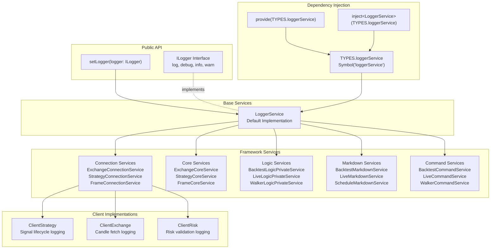
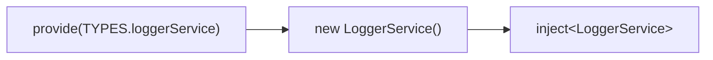
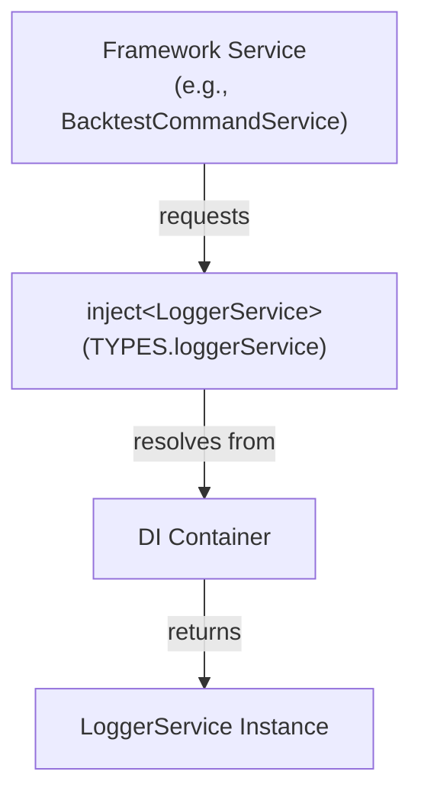
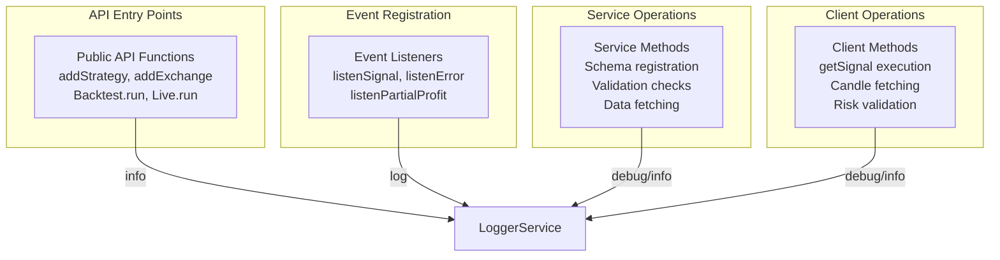

# Logging System

<details>
<summary>Relevant source files</summary>

The following files were used as context for generating this wiki page:

- [src/config/emitters.ts](src/config/emitters.ts)
- [src/function/add.ts](src/function/add.ts)
- [src/function/event.ts](src/function/event.ts)
- [src/index.ts](src/index.ts)
- [src/lib/core/provide.ts](src/lib/core/provide.ts)
- [src/lib/core/types.ts](src/lib/core/types.ts)
- [src/lib/index.ts](src/lib/index.ts)
- [types.d.ts](types.d.ts)

</details>


## Purpose and Scope

The Logging System provides a unified interface for recording diagnostic information throughout the backtest-kit framework. It enables debugging, monitoring, and auditing of framework operations across all execution modes (Backtest, Live, Walker, Optimizer).

This document covers the logging interface contract, custom logger configuration, default implementation, and usage patterns throughout the framework. For event-driven monitoring and observability, see [Event System](#3.4). For performance metrics and bottleneck detection, see [Performance Metrics](#13.2).

**Sources:** [types.d.ts:122-147](), [src/function/setup.ts]()

---

## Architecture Overview



**Diagram 1: Logging System Architecture**

The logging system follows a dependency injection pattern where `LoggerService` is registered globally and injected into all framework services. Custom logger implementations can replace the default via `setLogger()`.

**Sources:** [src/lib/core/types.ts:1-3](), [src/lib/core/provide.ts:55-57](), [src/lib/index.ts:60-62]()

---

## ILogger Interface

The `ILogger` interface defines the contract that all logger implementations must satisfy. It provides four log levels with consistent signatures.

### Interface Definition

| Method | Parameters | Purpose |
|--------|------------|---------|
| `log` | `topic: string, ...args: any[]` | General-purpose messages for significant events or state changes |
| `debug` | `topic: string, ...args: any[]` | Detailed diagnostic information for development/troubleshooting |
| `info` | `topic: string, ...args: any[]` | Informational updates providing high-level system activity overview |
| `warn` | `topic: string, ...args: any[]` | Potentially problematic situations that don't prevent execution |

### Usage Context

The interface documentation specifies that these methods are used throughout the framework for:

- **Lifecycle events**: Initialization, disposal, connection establishment
- **Operational details**: Tool calls, message emissions, data fetching
- **Validation outcomes**: Policy checks, risk validation results
- **Errors**: Persistence failures, API errors, validation failures

**Sources:** [types.d.ts:122-147]()

---

## Setting a Custom Logger

The `setLogger()` function allows replacing the default logger with a custom implementation. All internal framework services will route their log messages through the provided logger.

### Function Signature

```typescript
setLogger(logger: ILogger): void
```

### Implementation Example

```typescript
import { setLogger } from "backtest-kit";

// Custom logger using Winston
import winston from "winston";

const winstonLogger = winston.createLogger({
  level: "info",
  format: winston.format.json(),
  transports: [
    new winston.transports.File({ filename: "error.log", level: "error" }),
    new winston.transports.File({ filename: "combined.log" }),
  ],
});

setLogger({
  log: (topic, ...args) => winstonLogger.info(topic, { args }),
  debug: (topic, ...args) => winstonLogger.debug(topic, { args }),
  info: (topic, ...args) => winstonLogger.info(topic, { args }),
  warn: (topic, ...args) => winstonLogger.warn(topic, { args }),
});
```

### Context Injection

The documentation indicates that custom loggers receive "automatic context injection (strategyName, exchangeName, symbol, etc.)", though the actual context propagation appears to be handled manually by calling code passing context as additional arguments.

**Sources:** [types.d.ts:149-166](), [src/index.ts:1-6]()

---

## Default Logger Implementation

The framework includes a default `LoggerService` implementation that is registered via dependency injection at initialization time.

### Service Registration



**Diagram 2: LoggerService Registration Flow**

The `LoggerService` is instantiated once during framework initialization and made available to all services through the dependency injection container.

**Sources:** [src/lib/core/provide.ts:55-57](), [src/lib/core/types.ts:1-3]()

---

## Dependency Injection Integration

The logging system integrates with the framework's dependency injection system using symbol-based registration and memoized instances.

### DI Symbol Definition

The logger service is registered with the symbol `TYPES.loggerService`:

```typescript
const baseServices = {
    loggerService: Symbol('loggerService'),
};
```

### Service Provision

LoggerService is provided at module initialization:

```typescript
{
    provide(TYPES.loggerService, () => new LoggerService());
}
```

### Service Injection

All framework services inject the logger via the `inject()` function:

```typescript
const baseServices = {
  loggerService: inject<LoggerService>(TYPES.loggerService),
};
```

### Service Access Pattern



**Diagram 3: Logger Injection Pattern**

Services access the logger through dependency injection, ensuring a single shared logger instance across the entire framework.

**Sources:** [src/lib/core/types.ts:1-3](), [src/lib/core/provide.ts:55-57](), [src/lib/index.ts:60-62]()

---

## Log Levels

The framework uses four log levels with distinct purposes:

### Level Hierarchy

| Level | Purpose | Typical Use Cases |
|-------|---------|-------------------|
| **debug** | Detailed diagnostic information | Intermediate states, candle data inspection, signal validation steps |
| **info** | Informational updates | Strategy registration, frame generation, successful completions |
| **log** | General-purpose messages | API method entry points, significant state changes, operation tracking |
| **warn** | Potentially problematic situations | Missing optional data, unexpected conditions, deprecated usage |

### No Error Level

The `ILogger` interface does not include an `error()` method. Error handling is performed through the event system's `errorEmitter` and `exitEmitter` subjects (see [Error Handling](#15.2)).

**Sources:** [types.d.ts:126-147]()

---

## Usage Patterns

Logging is used consistently throughout the framework at key operational points.

### Public API Method Entry

All public API functions log their invocation:

```typescript
// Method name constant
const ADD_STRATEGY_METHOD_NAME = "add.addStrategy";

export function addStrategy(strategySchema: IStrategySchema) {
  backtest.loggerService.info(ADD_STRATEGY_METHOD_NAME, {
    strategySchema,
  });
  // ... implementation
}
```

### Event Listener Registration

Event subscription functions log their calls:

```typescript
const LISTEN_SIGNAL_METHOD_NAME = "event.listenSignal";

export function listenSignal(fn: (event: IStrategyTickResult) => void) {
  backtest.loggerService.log(LISTEN_SIGNAL_METHOD_NAME);
  return signalEmitter.subscribe(queued(async (event) => fn(event)));
}
```

### Common Logging Points



**Diagram 4: Logging Points Across Framework Layers**

**Sources:** [src/function/add.ts:10-64](), [src/function/event.ts:16-73]()

---

## Context Enrichment Patterns

While the `setLogger()` documentation mentions "automatic context injection", the actual implementation requires calling code to manually include context information as additional arguments.

### Method Name Pattern

The framework uses constant strings to identify log topics:

```typescript
const ADD_STRATEGY_METHOD_NAME = "add.addStrategy";
const LISTEN_SIGNAL_METHOD_NAME = "event.listenSignal";
const LISTEN_ERROR_METHOD_NAME = "event.listenError";
```

These constant names provide consistent, searchable identifiers for log filtering and analysis.

### Context Arguments Pattern

Context information is passed as additional arguments to log methods:

```typescript
// Simple invocation logging
backtest.loggerService.log(LISTEN_SIGNAL_METHOD_NAME);

// With context object
backtest.loggerService.info(ADD_STRATEGY_METHOD_NAME, {
  strategySchema,
});
```

### Client-Level Context

Client implementations (ClientStrategy, ClientExchange, ClientRisk) receive logger instances through their constructor parameters along with execution context:

```typescript
interface IExchangeParams extends IExchangeSchema {
    logger: ILogger;
    execution: TExecutionContextService;
}
```

This allows client implementations to include execution context (symbol, timestamp, backtest flag) in their log messages.

**Sources:** [src/function/add.ts:10-16](), [src/function/event.ts:16-43](), [types.d.ts:310-318]()

---

## Logger Service Distribution

The following table shows which services and clients receive logger instances:

| Service/Client | Logger Access | Purpose |
|----------------|---------------|---------|
| **ConnectionServices** | Via DI injection | Route to correct client instances |
| **CoreServices** | Via DI injection | Coordinate core operations |
| **LogicServices** | Via DI injection | Execute backtest/live/walker logic |
| **MarkdownServices** | Via DI injection | Generate reports and aggregate statistics |
| **CommandServices** | Via DI injection | Orchestrate high-level operations |
| **ValidationServices** | Via DI injection | Validate component registration |
| **ClientStrategy** | Via constructor params | Log signal lifecycle events |
| **ClientExchange** | Via constructor params | Log candle fetching operations |
| **ClientRisk** | Via constructor params | Log risk validation results |
| **ClientFrame** | Via constructor params | Log timeframe generation |
| **ClientOptimizer** | Via constructor params | Log strategy generation progress |

**Sources:** [src/lib/index.ts:60-234](), [types.d.ts:310-435]()

---

## Integration with Other Systems

### Event System Integration

The logging system operates independently from the event system but serves complementary purposes:

- **Logging**: Synchronous diagnostic information for debugging and monitoring
- **Events**: Asynchronous notifications for application logic and data flow

See [Event System](#3.4) for event-driven monitoring.

### Performance Tracking Integration

Performance metrics are emitted through the event system (`performanceEmitter`) rather than logged. This allows for structured performance data collection without cluttering logs.

See [Performance Metrics](#13.2) for performance monitoring.

### Error Handling Integration

Errors are propagated through dedicated event emitters (`errorEmitter`, `exitEmitter`) in addition to any logging that may occur. This separation allows for both diagnostic logging and programmatic error handling.

See [Error Handling](#15.2) for error management.

**Sources:** [src/config/emitters.ts:15-44]()

---

## Best Practices

### For Framework Users

1. **Set custom logger early**: Call `setLogger()` before any other framework operations
2. **Implement all methods**: Ensure your custom logger implements all four ILogger methods
3. **Handle variadic arguments**: Accept and process variable arguments (`...args: any[]`)
4. **Consider log levels**: Use appropriate filtering based on environment (production vs development)

### For Framework Contributors

1. **Use constant method names**: Define string constants for log topics
2. **Include context objects**: Pass relevant context as additional arguments
3. **Choose appropriate levels**:
   - `info` for public API entry points
   - `log` for internal operation tracking
   - `debug` for detailed diagnostic information
   - `warn` for non-critical issues
4. **Avoid excessive logging**: Focus on significant operations and state changes

**Sources:** [src/function/add.ts:10-64](), [src/function/event.ts:16-73]()