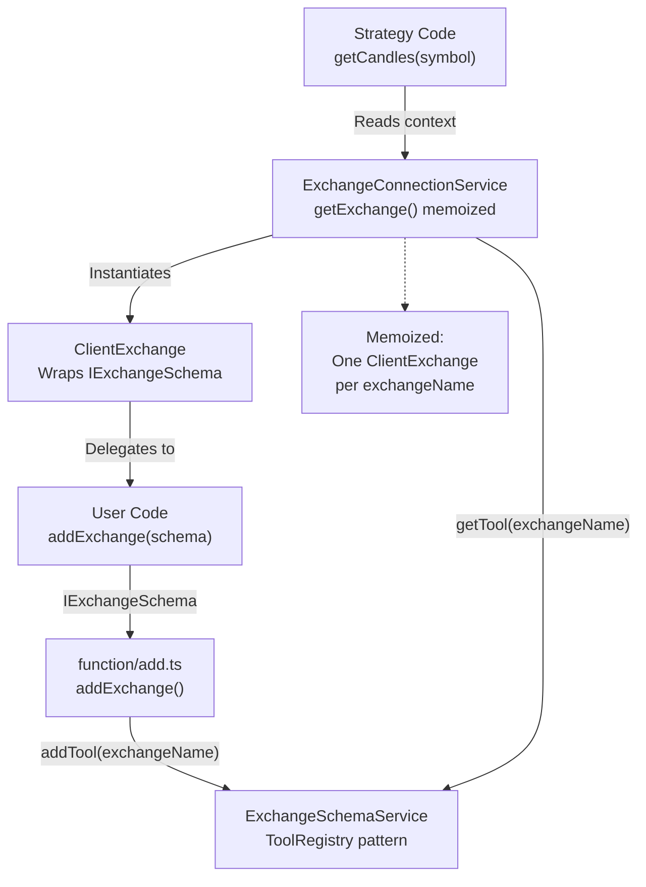
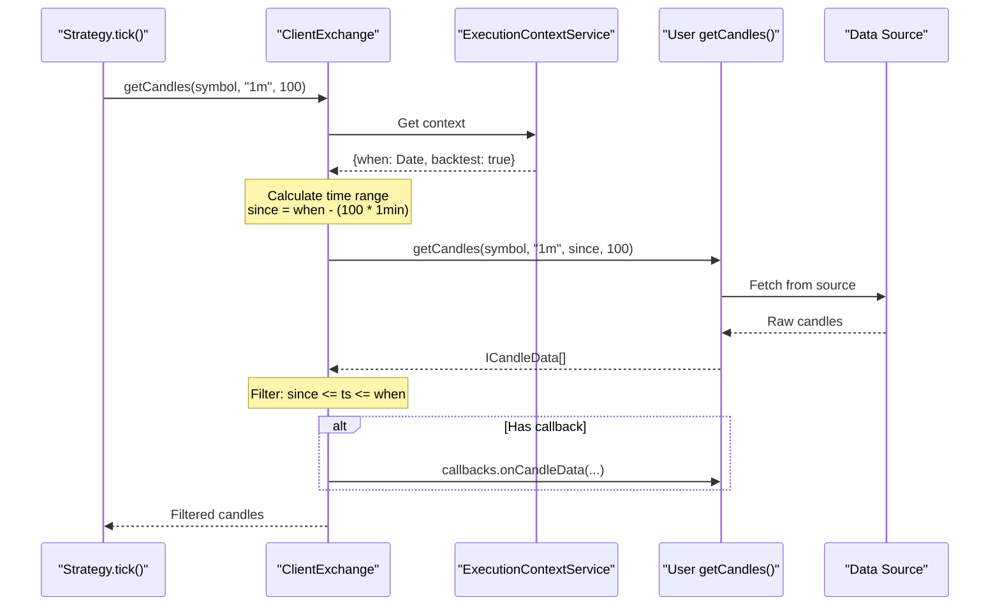
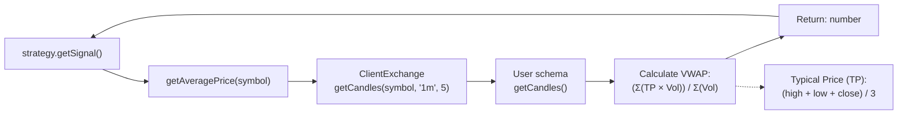
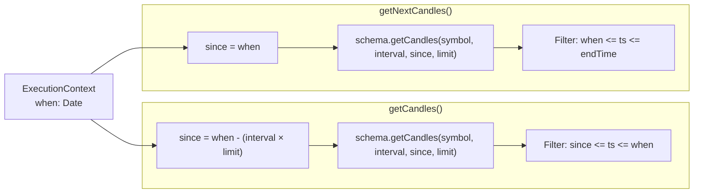
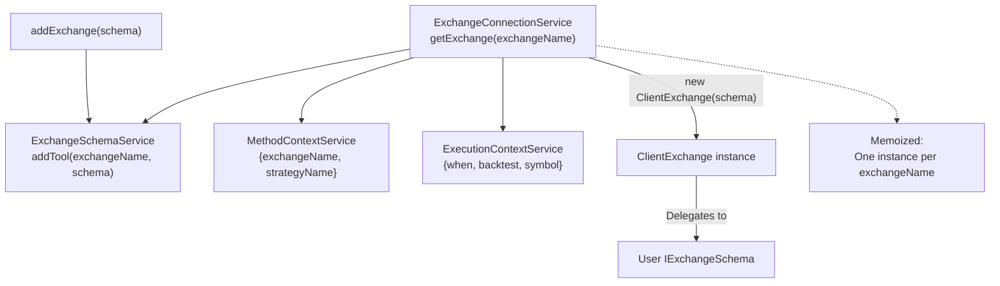

# Custom Exchange Integration

<details>
<summary>Relevant source files</summary>

The following files were used as context for generating this wiki page:

- [src/client/ClientExchange.ts](src/client/ClientExchange.ts)
- [src/client/ClientStrategy.ts](src/client/ClientStrategy.ts)
- [src/interfaces/Strategy.interface.ts](src/interfaces/Strategy.interface.ts)
- [src/lib/services/logic/private/BacktestLogicPrivateService.ts](src/lib/services/logic/private/BacktestLogicPrivateService.ts)
- [src/lib/services/logic/private/LiveLogicPrivateService.ts](src/lib/services/logic/private/LiveLogicPrivateService.ts)
- [src/lib/services/logic/private/WalkerLogicPrivateService.ts](src/lib/services/logic/private/WalkerLogicPrivateService.ts)
- [types.d.ts](types.d.ts)

</details>


This page explains how to implement custom exchange data sources by creating `IExchangeSchema` implementations. The framework supports any data source: CCXT exchanges, REST APIs, databases, CSV files, or WebSocket streams. The same exchange implementation works for both backtest and live trading modes.

## Overview

The framework separates data retrieval (user-provided `IExchangeSchema`) from data processing (framework-provided `ClientExchange`). Users implement three methods:

1. `getCandles()` - Fetch OHLCV candle data
2. `formatPrice()` - Format prices to exchange precision
3. `formatQuantity()` - Format quantities to exchange precision

The framework wraps these implementations in `ClientExchange` which adds VWAP calculation, execution context awareness, and bidirectional time-travel (backwards for historical data, forwards for backtest fast-forward).

**Sources:** [types.d.ts:188-221](), [README.md:262-301]()
</thinking>

---

## Exchange Registration Flow



**Diagram: Exchange schema registration and instantiation flow**

When `addExchange()` is called, the schema is stored in `ExchangeSchemaService` using the ToolRegistry pattern. On first use, `ExchangeConnectionService` creates a `ClientExchange` instance wrapping the user schema. This instance is memoized and reused for all subsequent operations.

**Sources:** [src/function/add.ts:1-80](), [src/lib/services/connection/ExchangeConnectionService.ts:1-50]()

---

## IExchangeSchema Interface

User implementations must conform to `IExchangeSchema`:

| Property | Type | Required | Description |
|----------|------|----------|-------------|
| `exchangeName` | `ExchangeName` (string) | Yes | Unique identifier for this exchange instance |
| `note` | `string` | No | Developer documentation comment |
| `getCandles` | `(symbol, interval, since, limit) => Promise<ICandleData[]>` | Yes | Fetch OHLCV candle data from data source |
| `formatPrice` | `(symbol, price) => Promise<string>` | Yes | Format price to exchange precision rules |
| `formatQuantity` | `(symbol, quantity) => Promise<string>` | Yes | Format quantity to exchange precision rules |
| `callbacks` | `Partial<IExchangeCallbacks>` | No | Optional lifecycle event hooks |

**Sources:** [types.d.ts:188-221]()

## getCandles Implementation

The `getCandles` method is the primary data source function. It receives time range parameters from `ClientExchange` and must return OHLCV candles.

**Method Signature:**
```typescript
getCandles: (
  symbol: string,
  interval: CandleInterval,
  since: Date,
  limit: number
) => Promise<ICandleData[]>
```

**Parameters:**

| Parameter | Type | Description |
|-----------|------|-------------|
| `symbol` | `string` | Trading pair symbol (e.g., "BTCUSDT") |
| `interval` | `CandleInterval` | Candle timeframe: "1m", "3m", "5m", "15m", "30m", "1h", "2h", "4h", "6h", "8h" |
| `since` | `Date` | Start date for candle fetching (inclusive) |
| `limit` | `number` | Maximum number of candles to return |

**Return Value:** Array of `ICandleData` objects

| Field | Type | Description |
|-------|------|-------------|
| `timestamp` | `number` | Unix timestamp in milliseconds when candle opened |
| `open` | `number` | Opening price at candle start |
| `high` | `number` | Highest price during candle period |
| `low` | `number` | Lowest price during candle period |
| `close` | `number` | Closing price at candle end |
| `volume` | `number` | Trading volume during candle period |

**Implementation Requirements:**

1. Return candles from `since` date up to `limit` count
2. Sort candles by timestamp in ascending order (oldest first)
3. Align timestamps to interval boundaries (e.g., "1m" at :00 seconds)
4. Throw descriptive errors for failed requests or invalid symbols

**Sources:** [types.d.ts:188-221](), [types.d.ts:153-166]()

---

## Example: CCXT Exchange Integration

The most common integration uses CCXT library for accessing cryptocurrency exchange APIs:

```typescript
import { addExchange } from "backtest-kit";
import ccxt from "ccxt";

addExchange({
  exchangeName: "binance",
  getCandles: async (symbol, interval, since, limit) => {
    const exchange = new ccxt.binance();
    const ohlcv = await exchange.fetchOHLCV(
      symbol,
      interval,
      since.getTime(),
      limit
    );
    return ohlcv.map(([timestamp, open, high, low, close, volume]) => ({
      timestamp,
      open,
      high,
      low,
      close,
      volume,
    }));
  },
  formatPrice: async (symbol, price) => price.toFixed(2),
  formatQuantity: async (symbol, quantity) => quantity.toFixed(8),
});
```

**Key Points:**
- `exchange.fetchOHLCV()` returns `[timestamp, open, high, low, close, volume][]`
- Map to `ICandleData` structure with named fields
- CCXT handles rate limiting, authentication, and exchange-specific APIs
- Same code works for any CCXT-supported exchange (Binance, Bybit, etc.)

**Sources:** [README.md:98-122]()

## Example: Database Exchange

For fast backtesting, store historical candles in a database:

```typescript
import { addExchange } from "backtest-kit";
import { db } from "./database"; // PostgreSQL, MySQL, SQLite, etc.

addExchange({
  exchangeName: "binance-db",
  getCandles: async (symbol, interval, since, limit) => {
    return await db.query(
      `SELECT timestamp, open, high, low, close, volume
       FROM candles
       WHERE symbol = $1 AND interval = $2 AND timestamp >= $3
       ORDER BY timestamp ASC
       LIMIT $4`,
      [symbol, interval, since.getTime(), limit]
    );
  },
  formatPrice: async (symbol, price) => price.toFixed(2),
  formatQuantity: async (symbol, quantity) => quantity.toFixed(8),
});
```

**Advantages over CCXT:**
- 10-100x faster backtesting (no API rate limits)
- Offline operation (no network dependency)
- Consistent data (pre-downloaded and validated)

**Sources:** [README.md:284-301]()

## ClientExchange Time-Travel Wrapper



**Diagram: ClientExchange wraps user schema with time-aware fetching**

`ClientExchange.getCandles()` reads `ExecutionContextService.context.when` to determine the current time (historical for backtest, `Date.now()` for live). It calculates `since = when - (interval × limit)`, fetches candles via user schema, then filters results to `[since, when]` range.

**Sources:** [src/lib/client/ClientExchange.ts:57-101]()

---

## formatPrice and formatQuantity

These methods format numeric values to exchange-specific precision rules. Critical for live trading to avoid order rejection.

**Method Signatures:**
```typescript
formatPrice: (symbol: string, price: number) => Promise<string>
formatQuantity: (symbol: string, quantity: number) => Promise<string>
```

**Implementation Strategies:**

| Strategy | Example | Use Case |
|----------|---------|----------|
| Fixed precision | `price.toFixed(2)` | Simple backtesting |
| Symbol lookup | Query from database table | Production live trading |
| CCXT markets | `exchange.markets[symbol].precision.price` | Real exchange rules |

**Example: Dynamic Precision Lookup**
```typescript
addExchange({
  exchangeName: "binance-precise",
  // ... getCandles implementation
  formatPrice: async (symbol, price) => {
    const info = await db.query(
      "SELECT price_precision FROM symbols WHERE symbol = $1",
      [symbol]
    );
    return price.toFixed(info.price_precision);
  },
  formatQuantity: async (symbol, quantity) => {
    const info = await db.query(
      "SELECT qty_precision FROM symbols WHERE symbol = $1",
      [symbol]
    );
    return quantity.toFixed(info.qty_precision);
  },
});
```

**Sources:** [types.d.ts:210-218](), [src/lib/client/ClientExchange.ts:205-219]()

## Lifecycle Callbacks

Optional `callbacks.onCandleData` is invoked after each successful candle fetch.

**Callback Signature:**
```typescript
interface IExchangeCallbacks {
  onCandleData: (
    symbol: string,
    interval: CandleInterval,
    since: Date,
    limit: number,
    data: ICandleData[]
  ) => void;
}
```

**Example: Data Quality Monitoring**
```typescript
addExchange({
  exchangeName: "monitored-exchange",
  getCandles: async (symbol, interval, since, limit) => {
    // ... fetch implementation
  },
  formatPrice: async (symbol, price) => price.toFixed(2),
  formatQuantity: async (symbol, quantity) => quantity.toFixed(8),
  callbacks: {
    onCandleData: (symbol, interval, since, limit, data) => {
      console.log(`[${symbol}] Fetched ${data.length}/${limit} candles`);
      if (data.length < limit * 0.9) {
        console.warn(`[${symbol}] Data quality issue: expected ${limit}, got ${data.length}`);
      }
    },
  },
});
```

**Use Cases:**
- Logging and debugging
- Metrics collection
- Data quality validation
- Cache prewarming

**Sources:** [types.d.ts:180-183](), [src/lib/client/ClientExchange.ts:96-98]()

---

## Framework-Provided VWAP Calculation

`ClientExchange` implements `getAveragePrice()` automatically—no user implementation required. Used by strategies for current market price.



**Diagram: getAveragePrice() uses last 5 one-minute candles**

**Formula:** `VWAP = Σ(Typical Price × Volume) / Σ(Volume)`

Where `Typical Price = (High + Low + Close) / 3`

**Fallback:** If `totalVolume == 0`, returns simple average of close prices.

**Sources:** [src/lib/client/ClientExchange.ts:172-203]()

## Bidirectional Time-Travel

`ClientExchange` provides two candle-fetching directions:

| Method | Direction | Purpose |
|--------|-----------|---------|
| `getCandles(symbol, interval, limit)` | Backwards from `context.when` | Strategy indicators (SMA, RSI, etc.) |
| `getNextCandles(symbol, interval, limit)` | Forwards from `context.when` | Backtest fast-forward simulation |

**Both methods call the same `schema.getCandles()` with different time ranges.**



**Diagram: Bidirectional candle fetching in backtest mode**

**Example:**
- Backtest at `2024-01-15 12:00:00`
- Strategy calls `getCandles("BTCUSDT", "1m", 100)` for indicators → fetches `[12:00 - 100min, 12:00]`
- Framework calls `getNextCandles("BTCUSDT", "1m", 60)` for signal outcome → fetches `[12:00, 12:00 + 60min]`

**Sources:** [src/lib/client/ClientExchange.ts:57-101](), [src/lib/client/ClientExchange.ts:113-157]()

## Automatic Filtering and Validation

`ClientExchange` filters and validates candles returned by user schemas:

**Timestamp Filtering:**
```typescript
// ClientExchange.getCandles() implementation
const filteredData = data.filter(
  (candle) =>
    candle.timestamp >= since.getTime() &&
    candle.timestamp <= context.when.getTime()
);
```

Even if user schema returns extra candles, only those within `[since, when]` are used.

**Count Validation:**
```typescript
if (filteredData.length < limit) {
  logger.warn(`Expected ${limit} candles, got ${filteredData.length}`);
}
```

Logs warnings for data gaps or quality issues.

**Sources:** [src/lib/client/ClientExchange.ts:83-94]()

## Service Layer Integration



**Diagram: Exchange schema flows through service layers**

1. `addExchange()` stores schema in `ExchangeSchemaService`
2. `ExchangeConnectionService.getExchange()` creates memoized `ClientExchange` instance
3. `MethodContextService` provides `exchangeName` via scoped DI
4. `ExecutionContextService` provides `{when, backtest, symbol}` via scoped DI
5. `ClientExchange` wraps user schema with enhanced functionality

**Sources:** [src/lib/services/schema/ExchangeSchemaService.ts:1-20](), [src/lib/services/connection/ExchangeConnectionService.ts:1-50]()

## Testing Custom Exchanges

Test these scenarios when implementing custom exchanges:

**Data Quality Tests:**

| Test Case | Validation |
|-----------|------------|
| Complete data | All requested candles returned |
| Timestamp alignment | Candles align to interval boundaries (e.g., 1m at :00 seconds) |
| Sequential order | Ascending timestamps, no gaps or duplicates |
| Valid OHLCV | `low <= open, close <= high` for all candles |
| Positive volume | `volume >= 0` for all candles |

**Edge Case Tests:**

| Test Case | Expected Behavior |
|-----------|-------------------|
| Empty result | Return `[]` when no data available |
| Partial result | Return available candles (framework logs warning) |
| Future date | Return `[]` for `since > Date.now()` |
| Network error | Throw descriptive error with context |
| Invalid symbol | Throw descriptive error |

**Performance Considerations:**
- Cache candles to reduce API calls (especially for overlapping requests)
- Implement rate limiting and exponential backoff for API sources
- Use connection pooling for database sources
- Set reasonable timeouts (5-30s depending on data source)

**Sources:** [src/lib/client/ClientExchange.ts:83-94]()

## Common Implementation Patterns

**Pattern: In-Memory Caching**
```typescript
const cache = new Map<string, ICandleData[]>();

addExchange({
  exchangeName: "cached-exchange",
  async getCandles(symbol, interval, since, limit) {
    const key = `${symbol}-${interval}-${since.getTime()}-${limit}`;
    if (cache.has(key)) return cache.get(key)!;
    
    const candles = await fetchFromAPI(symbol, interval, since, limit);
    cache.set(key, candles);
    return candles;
  },
  // ... formatPrice, formatQuantity
});
```

**Pattern: Retry with Exponential Backoff**
```typescript
async function retry<T>(fn: () => Promise<T>, maxRetries = 3): Promise<T> {
  for (let i = 0; i < maxRetries; i++) {
    try {
      return await fn();
    } catch (error) {
      if (i === maxRetries - 1) throw error;
      await new Promise(resolve => setTimeout(resolve, 1000 * Math.pow(2, i)));
    }
  }
  throw new Error("Unreachable");
}

addExchange({
  exchangeName: "retry-exchange",
  async getCandles(symbol, interval, since, limit) {
    return await retry(() => 
      fetch(`/api/candles?symbol=${symbol}...`).then(r => r.json())
    );
  },
  // ... formatPrice, formatQuantity
});
```

**Pattern: Connection Pooling (Database)**
```typescript
import { Pool } from "pg";
const pool = new Pool({ max: 10, min: 2 });

addExchange({
  exchangeName: "pooled-postgres",
  async getCandles(symbol, interval, since, limit) {
    const client = await pool.connect();
    try {
      const res = await client.query(
        "SELECT * FROM candles WHERE symbol=$1 AND interval=$2...",
        [symbol, interval]
      );
      return res.rows;
    } finally {
      client.release();
    }
  },
  // ... formatPrice, formatQuantity
});
```

**Sources:** [types.d.ts:188-221]()

---

## Error Handling Guidelines

Exchange implementations should throw descriptive errors that help diagnose issues:

### Error Message Format

```typescript
throw new Error(`[${exchangeName}] ${operation}: ${reason}`);
```

### Common Error Scenarios

| Scenario | Error Message Example |
|----------|----------------------|
| Network failure | `[binance-api] getCandles: Network request failed` |
| Invalid symbol | `[database] getCandles: Symbol 'INVALID' not found` |
| Data corruption | `[csv-files] getCandles: Malformed CSV data` |
| Rate limit | `[rest-api] getCandles: Rate limit exceeded, retry after 60s` |
| Authentication | `[exchange-api] getCandles: API key invalid or expired` |

### Example Error Handling

```typescript
addExchange({
  exchangeName: "safe-exchange",
  
  async getCandles(symbol, interval, since, limit) {
    try {
      const response = await fetch(/* ... */);
      
      if (!response.ok) {
        throw new Error(`HTTP ${response.status}: ${response.statusText}`);
      }
      
      const data = await response.json();
      
      if (!Array.isArray(data.candles)) {
        throw new Error("Invalid response format: missing candles array");
      }
      
      return data.candles;
    } catch (error) {
      throw new Error(
        `[safe-exchange] getCandles failed for ${symbol} ${interval}: ${error.message}`
      );
    }
  },
  
  // ... other methods
});
```

**Sources:** [src/client/ClientExchange.ts:62-75](), [src/client/ClientExchange.ts:179-183]()

---

## Summary

Custom exchange integration requires implementing three core methods (`getCandles`, `formatPrice`, `formatQuantity`) via the `IExchangeSchema` interface. The framework wraps user schemas with `ClientExchange` to add VWAP calculation, execution context integration, and bidirectional candle fetching. This design enables backtesting and live trading with any data source while maintaining a clean separation between data retrieval and business logic.

**Key implementation requirements:**
- Return candles in ascending timestamp order
- Handle errors with descriptive messages
- Respect exchange precision in formatting methods
- Consider caching and rate limiting for production use

**Sources:** [types.d.ts:137-171](), [src/client/ClientExchange.ts:1-223]()