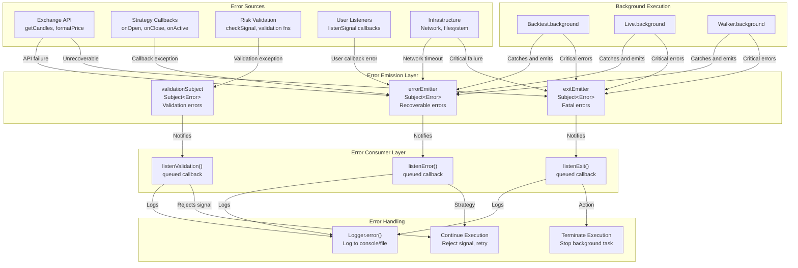
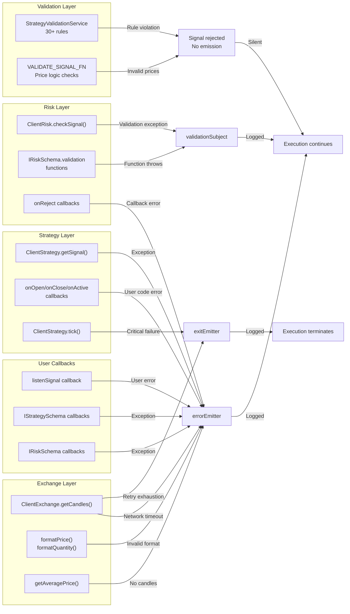
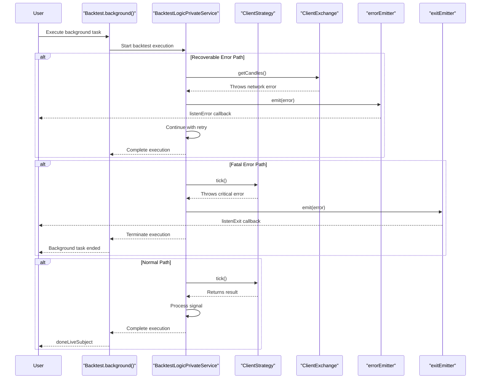

# Error Handling

<details>
<summary>Relevant source files</summary>

The following files were used as context for generating this wiki page:

- [src/config/emitters.ts](src/config/emitters.ts)
- [src/function/event.ts](src/function/event.ts)
- [src/index.ts](src/index.ts)
- [src/lib/services/core/StrategyCoreService.ts](src/lib/services/core/StrategyCoreService.ts)
- [src/lib/services/logic/private/BacktestLogicPrivateService.ts](src/lib/services/logic/private/BacktestLogicPrivateService.ts)
- [src/lib/services/logic/private/LiveLogicPrivateService.ts](src/lib/services/logic/private/LiveLogicPrivateService.ts)
- [src/lib/services/logic/private/WalkerLogicPrivateService.ts](src/lib/services/logic/private/WalkerLogicPrivateService.ts)
- [types.d.ts](types.d.ts)

</details>


This page documents the error handling infrastructure in backtest-kit, including error categorization, emission, propagation, and recovery patterns. The system implements a multi-tier error handling architecture that distinguishes between recoverable errors, fatal errors, and validation failures.

For logging system configuration, see [Logging System](#15.1). For persistence error handling, see [Persistence Layer](#15.3).

---

## Error Categorization

The system categorizes errors into three distinct types, each with different handling semantics:

| Error Type | Emitter | Listener | Execution Behavior | Use Cases |
|------------|---------|----------|-------------------|-----------|
| **Recoverable** | `errorEmitter` | `listenError()` | Execution continues | API timeouts, network failures, non-critical callback errors |
| **Fatal** | `exitEmitter` | `listenExit()` | Execution terminates | Unrecoverable infrastructure failures, critical validation failures |
| **Validation** | `validationSubject` | `listenValidation()` | Logged, execution continues | Risk validation function errors, signal validation warnings |

**Recoverable Errors** are caught during background execution and emitted to `errorEmitter`. The system logs the error and continues operation. These typically occur during:
- Exchange API calls (`getCandles`, `formatPrice`, `formatQuantity`)
- Strategy callback execution (`onOpen`, `onClose`, `onActive`)
- User listener callbacks (`listenSignal`, `listenDoneBacktest`)

**Fatal Errors** are emitted to `exitEmitter` when the system encounters unrecoverable failures. Background execution methods (`Backtest.background()`, `Live.background()`, `Walker.background()`) terminate when fatal errors occur.

**Validation Errors** are emitted to `validationSubject` when risk validation functions throw exceptions. These are logged for debugging but do not interrupt execution, allowing the signal to be rejected gracefully.

**Sources:**
- [src/config/emitters.ts:32-42]()
- [src/function/event.ts:220-276]()
- [test/e2e/defend.test.mjs:1664-1743]()

---

## Error Emitters

The system defines three Subject-based error emitters in the global configuration:

### errorEmitter

Emits recoverable errors caught during background execution. Used by `Backtest.background()`, `Live.background()`, and `Walker.background()` to report non-critical failures.

```typescript
// src/config/emitters.ts:32-35
export const errorEmitter = new Subject<Error>();
```

**Emission Points:**
- Exchange API failures during retry exhaustion
- Strategy callback exceptions
- User listener callback exceptions
- Non-critical infrastructure failures

### exitEmitter

Emits fatal errors that require process termination. Unlike `errorEmitter`, these errors stop current execution.

```typescript
// src/config/emitters.ts:37-42
export const exitEmitter = new Subject<Error>();
```

**Emission Points:**
- Unrecoverable exchange integration failures
- Critical validation failures
- Background execution method crashes

### validationSubject

Emits errors thrown by risk validation functions during `checkSignal()` execution. These are separated from `errorEmitter` to enable specialized monitoring of risk management failures.

```typescript
// src/config/emitters.ts:105-108
export const validationSubject = new Subject<Error>();
```

**Emission Points:**
- Risk validation function exceptions (`IRiskSchema.validation`)
- Signal validation rule violations (30+ validation rules)

**Sources:**
- [src/config/emitters.ts:32-108]()
- [src/function/event.ts:15-40]()

---

## Error Flow Architecture



**Sources:**
- [src/config/emitters.ts:32-108]()
- [src/function/event.ts:220-757]()
- [test/e2e/defend.test.mjs:1664-1859]()

---

## Error Listeners

The system provides three listener functions for subscribing to error events. All listeners use queued callback processing to ensure sequential execution.

### listenError()

Subscribes to recoverable execution errors with queued async processing.

```typescript
// Example: Monitor recoverable errors
listenError((error) => {
  console.error("Recoverable error (execution continues):", error.message);
  
  // Log to monitoring service
  if (error.message.includes("EXCHANGE_API_ERROR")) {
    monitoringService.alert("Exchange API failure", error);
  }
  
  // Retry logic for specific errors
  if (error.message.includes("Network timeout")) {
    scheduleRetry();
  }
});
```

**Callback Signature:**
```typescript
function listenError(fn: (error: Error) => void): () => void
```

**Returns:** Unsubscribe function to stop listening

**Processing:** Callbacks are processed sequentially using `queued()` wrapper, preventing concurrent execution even with async callbacks.

### listenExit()

Subscribes to fatal execution errors that terminate the current process.

```typescript
// Example: Handle fatal errors
listenExit((error) => {
  console.error("Fatal error (execution terminated):", error.message);
  
  // Cleanup resources
  closeConnections();
  
  // Send critical alert
  alertingService.critical("Process terminated", error);
  
  // Optionally restart
  if (shouldAutoRestart(error)) {
    process.exit(1); // Let process manager restart
  }
});
```

**Callback Signature:**
```typescript
function listenExit(fn: (error: Error) => void): () => void
```

**Returns:** Unsubscribe function to stop listening

**Use Cases:** Process monitoring, automatic restart logic, critical alerting, resource cleanup

### listenValidation()

Subscribes to risk validation errors for debugging and monitoring validation failures.

```typescript
// Example: Monitor validation failures
listenValidation((error) => {
  console.error("Risk validation error:", error.message);
  
  // Extract validation details
  const isRiskLimit = error.message.includes("maxConcurrentPositions");
  const isSignalInvalid = error.message.includes("Invalid signal");
  
  if (isRiskLimit) {
    metrics.increment("validation.risk_limit_hit");
  } else if (isSignalInvalid) {
    metrics.increment("validation.signal_rejected");
  }
  
  // Debug validation logic
  debugLogger.log("Validation error details:", error.stack);
});
```

**Callback Signature:**
```typescript
function listenValidation(fn: (error: Error) => void): () => void
```

**Returns:** Unsubscribe function to stop listening

**Use Cases:** Validation debugging, risk management monitoring, signal rejection tracking

**Sources:**
- [src/function/event.ts:220-276]()
- [src/function/event.ts:730-757]()
- [src/config/emitters.ts:32-108]()

---

## Error Source Mapping



**Sources:**
- [test/e2e/defend.test.mjs:1664-1743]()
- [test/e2e/defend.test.mjs:1754-1859]()
- [src/function/event.ts:220-276]()

---

## Queued Error Processing

All error listeners use the `queued()` wrapper from `functools-kit` to ensure sequential, ordered processing of error events. This prevents race conditions and ensures errors are handled in the order they occur.

### Sequential Processing Guarantee

```typescript
// Implementation pattern from src/function/event.ts:244-246
export function listenError(fn: (error: Error) => void) {
  backtest.loggerService.log(LISTEN_ERROR_METHOD_NAME);
  return errorEmitter.subscribe(queued(async (error) => fn(error)));
}
```

**Key Properties:**
1. **Order Preservation**: Errors are processed in emission order, even if callbacks are async
2. **No Concurrency**: Only one error callback executes at a time per listener
3. **Blocking Queue**: If callback is slow, subsequent errors queue until completion
4. **Async Support**: Callbacks can be async; queue waits for Promise resolution

### Example: Queued vs Concurrent

```typescript
// WITHOUT queued (WRONG): Concurrent execution
errorEmitter.subscribe(async (error) => {
  await logToDatabase(error); // Multiple executions overlap
  // Race condition possible
});

// WITH queued (CORRECT): Sequential execution
errorEmitter.subscribe(queued(async (error) => {
  await logToDatabase(error); // Waits for previous to complete
  // Order guaranteed
}));
```

**Benefits:**
- **Database Safety**: Sequential writes prevent race conditions
- **Log Ordering**: Errors appear in chronological order in logs
- **Resource Protection**: Prevents concurrent access to shared resources
- **Debugging**: Easier to trace error sequences

**Sources:**
- [src/function/event.ts:244-246]()
- [src/function/event.ts:273-275]()
- [src/function/event.ts:754-756]()

---

## Error Recovery Patterns

Different error types require different recovery strategies. The system provides patterns for handling each error category.

### Pattern 1: Retry on Recoverable Errors

```typescript
// Exchange API failure with retry logic
let retryCount = 0;
const MAX_RETRIES = 3;

listenError((error) => {
  if (error.message.includes("EXCHANGE_API_ERROR")) {
    retryCount++;
    
    if (retryCount < MAX_RETRIES) {
      console.log(`Retry ${retryCount}/${MAX_RETRIES}...`);
      // Framework will retry automatically via CC_GET_CANDLES_RETRY_COUNT
    } else {
      console.error("Max retries exhausted, skipping signal");
      retryCount = 0;
    }
  }
});
```

### Pattern 2: Graceful Degradation on Validation Errors

```typescript
// Monitor validation failures without interrupting execution
const validationStats = {
  riskLimitHits: 0,
  invalidSignals: 0,
  totalErrors: 0
};

listenValidation((error) => {
  validationStats.totalErrors++;
  
  if (error.message.includes("maxConcurrentPositions")) {
    validationStats.riskLimitHits++;
    // Risk limit hit - normal operation, no action needed
  } else if (error.message.includes("Invalid signal")) {
    validationStats.invalidSignals++;
    // Signal rejected by validation - expected behavior
  } else {
    // Unexpected validation error - alert
    console.error("Unexpected validation error:", error.message);
  }
});
```

### Pattern 3: Crash Recovery on Fatal Errors

```typescript
// Process restart on fatal error
listenExit((error) => {
  // Log critical error
  fs.appendFileSync("fatal_errors.log", 
    `${new Date().toISOString()}: ${error.message}\n${error.stack}\n`
  );
  
  // Cleanup persistence state
  PersistSignalAdapter.removeValue("BTCUSDT", "active_signal");
  PersistRiskAdapter.removeValue("BTCUSDT", "active_positions");
  
  // Alert monitoring
  sendAlert({
    level: "critical",
    message: "Fatal error - process terminating",
    error: error.message
  });
  
  // Exit for process manager restart
  process.exit(1);
});
```

### Pattern 4: Callback Error Isolation

```typescript
// Prevent user callback errors from crashing execution
listenSignal((result) => {
  try {
    // User business logic
    if (result.action === "closed") {
      updateDatabase(result);
      sendNotification(result);
    }
  } catch (error) {
    // Errors here emit to errorEmitter
    console.error("User callback error:", error);
    // Framework continues execution
  }
});
```

**Sources:**
- [test/e2e/defend.test.mjs:1664-1743]()
- [test/e2e/defend.test.mjs:1754-1859]()
- [src/function/event.ts:220-276]()

---

## Error Testing Patterns

The test suite demonstrates comprehensive error handling verification using the defend test pattern:

### Exchange API Failure Test

```typescript
// test/e2e/defend.test.mjs:1664-1743
addExchange({
  exchangeName: "binance-defend-exchange-error",
  getCandles: async () => {
    // Simulate infrastructure failure
    throw new Error("EXCHANGE_API_ERROR: Network timeout - unable to fetch candles");
  }
});

let errorCaught = null;
listenError((error) => {
  errorCaught = error;
});

// Verify error was caught and emitted
if (!errorCaught) {
  fail("Exchange error not caught");
}
```

### Listener Callback Error Test

```typescript
// test/e2e/defend.test.mjs:1754-1859
let errorCaught = null;
listenError((error) => {
  errorCaught = error;
});

// Callback that throws error
listenSignalBacktest((result) => {
  throw new Error("LISTENER_ERROR: User callback crashed");
});

// Verify error was caught and execution continued
if (!errorCaught || !errorCaught.message.includes("LISTENER_ERROR")) {
  fail("Listener error not caught");
}
```

**Test Coverage:**
| Error Type | Test File | Lines | Verification |
|------------|-----------|-------|-------------|
| Exchange API failure | `test/e2e/defend.test.mjs` | 1664-1743 | `errorEmitter` receives error |
| Listener callback error | `test/e2e/defend.test.mjs` | 1754-1859 | `errorEmitter` receives error |
| Invalid signal validation | `test/e2e/defend.test.mjs` | 545-642 | Signal rejected, no emission |
| Risk validation failure | `test/spec/risk.test.mjs` | N/A | `validationSubject` receives error |

**Sources:**
- [test/e2e/defend.test.mjs:1664-1743]()
- [test/e2e/defend.test.mjs:1754-1859]()
- [test/e2e/defend.test.mjs:545-642]()

---

## Integration with Background Execution

Background execution methods (`Backtest.background()`, `Live.background()`, `Walker.background()`) integrate with the error system by catching exceptions and routing them to appropriate emitters.

### Error Handling Flow in Background Methods



**Error Boundaries:**
- Background methods establish error boundaries around execution
- Recoverable errors emit to `errorEmitter`, execution continues
- Fatal errors emit to `exitEmitter`, background task terminates
- User callbacks wrapped in try-catch to prevent cascade failures

**Sources:**
- [src/function/event.ts:220-276]()
- [test/e2e/defend.test.mjs:1664-1859]()

---

## Best Practices

### 1. Always Subscribe to Error Listeners

```typescript
// GOOD: Monitor all error types
listenError((error) => {
  logger.error("Recoverable error:", error);
});

listenExit((error) => {
  logger.critical("Fatal error:", error);
  cleanup();
});

listenValidation((error) => {
  logger.debug("Validation error:", error);
});
```

### 2. Distinguish Error Types in Handlers

```typescript
listenError((error) => {
  const message = error.message;
  
  if (message.includes("EXCHANGE_API_ERROR")) {
    handleExchangeError(error);
  } else if (message.includes("LISTENER_ERROR")) {
    handleCallbackError(error);
  } else if (message.includes("Network timeout")) {
    handleNetworkError(error);
  } else {
    handleGenericError(error);
  }
});
```

### 3. Implement Graceful Degradation

```typescript
let consecutiveErrors = 0;

listenError((error) => {
  consecutiveErrors++;
  
  if (consecutiveErrors > 10) {
    // Too many errors - switch to safe mode
    console.warn("Entering safe mode due to errors");
    disableNonCriticalFeatures();
  }
});

listenSignal((result) => {
  if (result.action === "closed") {
    // Reset error count on successful operation
    consecutiveErrors = 0;
  }
});
```

### 4. Log with Context

```typescript
listenError((error) => {
  logger.error("Error during execution", {
    error: error.message,
    stack: error.stack,
    timestamp: new Date().toISOString(),
    mode: getMode(), // backtest or live
    symbol: getCurrentSymbol(),
    strategy: getCurrentStrategy()
  });
});
```

### 5. Clean Up on Fatal Errors

```typescript
listenExit(async (error) => {
  // Log critical error
  await logger.critical("Fatal error", error);
  
  // Close all connections
  await closeExchangeConnections();
  await closeDatabaseConnections();
  
  // Clear persistence state
  await clearCrashRecoveryState();
  
  // Send alerts
  await sendCriticalAlert(error);
  
  // Allow async operations to complete
  await sleep(1000);
  
  // Exit for restart
  process.exit(1);
});
```

**Sources:**
- [src/function/event.ts:220-276]()
- [test/e2e/defend.test.mjs:1664-1859]()