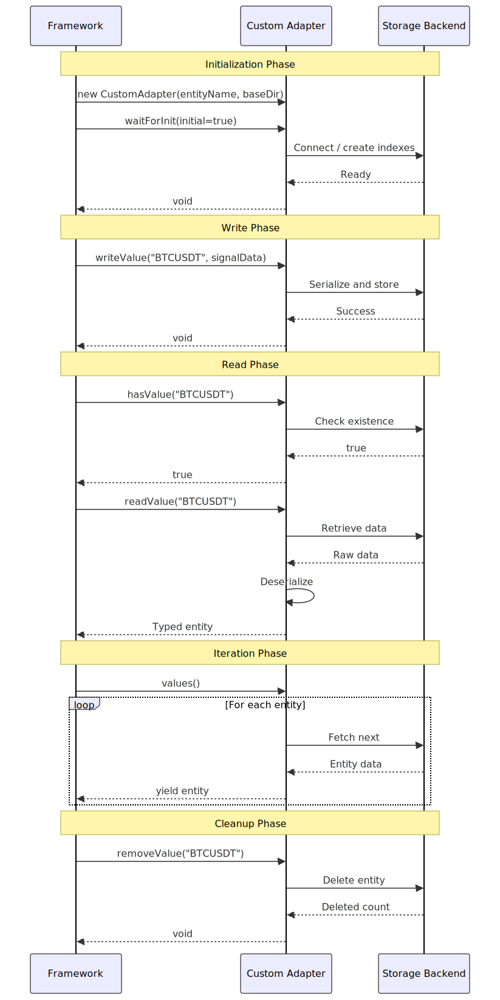
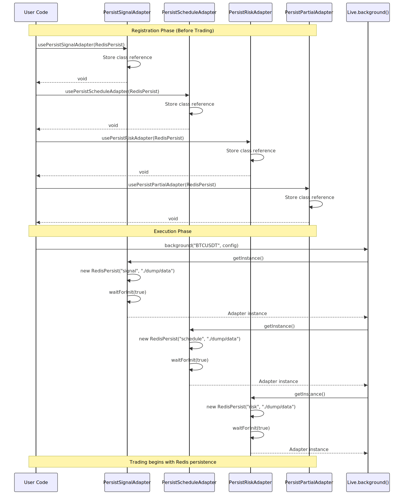

# Custom Persistence Backends

## Purpose and Scope

This document describes the pluggable persistence system in backtest-kit and how to implement custom storage backends. The framework uses a file-based persistence layer by default but provides a base class (`PersistBase`) and adapter registration pattern that allows replacement with alternative storage systems such as Redis, MongoDB, PostgreSQL, or other databases.

For information about the default persistence behavior and crash recovery in live trading, see [Live Trading](./56_Live_Trading.md). For details on signal state lifecycle and persistence points, see [Signal Persistence](./50_Signal_Persistence.md). For risk management state tracking, see [Risk Management](./65_Risk_Management.md).

---

## Persistence System Architecture

The backtest-kit persistence layer is organized into four independent adapter systems, each managing a specific type of state data. All adapters extend the `PersistBase` class and can be independently replaced with custom implementations.

### Adapter System Overview



**Sources:** [README.md:741-1077]()

### Data Storage Organization

Each adapter manages a specific entity type with its own directory structure:

| Adapter | Entity Type | Storage Path | Purpose | Used By |
|---------|-------------|--------------|---------|---------|
| `PersistSignalAdapter` | signal state | `./dump/data/signal/{strategy}/{symbol}.json` | Opened/active signals | Live mode only |
| `PersistScheduleAdapter` | scheduled signal | `./dump/data/schedule/{strategy}/{symbol}.json` | Limit orders waiting activation | Live mode only |
| `PersistRiskAdapter` | active positions | `./dump/data/risk/{riskName}/positions.json` | Portfolio-level position tracking | Live & Backtest |
| `PersistPartialAdapter` | partial levels | `./dump/data/partial/{symbol}/levels.json` | Profit/loss milestone tracking | Live & Backtest |

**Sources:** [README.md:754-766]()

### Persistence Points in Signal Lifecycle



**Sources:** [README.md:741-766](), [README.md:1331-1386]()

---

## PersistBase Interface Reference

The `PersistBase` abstract class defines the contract for all persistence operations. Custom adapters must implement all methods to ensure compatibility with the framework's crash recovery and state management systems.

### Class Definition



**Sources:** [README.md:777-869]()

### Method Reference

| Method | Parameters | Returns | Purpose | Required |
|--------|-----------|---------|---------|----------|
| `waitForInit` | `initial: boolean` | `Promise<void>` | Initialize connection, create indexes | Yes |
| `readValue<T>` | `entityId: string \| number` | `Promise<T>` | Read entity by ID, throw if not found | Yes |
| `hasValue` | `entityId: string \| number` | `Promise<boolean>` | Check entity existence | Yes |
| `writeValue<T>` | `entityId, entity: T` | `Promise<void>` | Write entity (upsert semantics) | Yes |
| `removeValue` | `entityId: string \| number` | `Promise<void>` | Delete entity, throw if not found | Yes |
| `removeAll` | none | `Promise<void>` | Delete all entities for this type | Yes |
| `values<T>` | none | `AsyncGenerator<T>` | Iterate all entity values | Yes |
| `keys` | none | `AsyncGenerator<string>` | Iterate all entity IDs | Yes |
| `filter<T>` | `predicate: (value: T) => boolean` | `AsyncGenerator<T>` | Iterate filtered values | No (default) |
| `take<T>` | `count: number` | `AsyncGenerator<T>` | Iterate first N values | No (default) |

**Sources:** [README.md:777-869](), [README.md:979-1028]()

### Constructor Parameters

```typescript
constructor(entityName: string, baseDir: string)
```

- **`entityName`**: Entity type identifier used for namespacing (e.g., `"signal"`, `"schedule"`, `"risk"`, `"partial"`)
- **`baseDir`**: Base directory path for storage (e.g., `"./dump/data"`)

The constructor is called automatically by adapter registration. Custom implementations must accept both parameters and pass them to the superclass.

**Sources:** [README.md:777-869]()

---

## Implementing Custom Adapters

Custom adapters must extend `PersistBase` and implement all abstract methods. The framework guarantees that `waitForInit()` is called before any other operations and that entity IDs are consistent within each adapter type.

### Implementation Template



**Sources:** [README.md:777-869]()

### Redis Adapter Example

The following example demonstrates a production-ready Redis adapter with proper error handling and key namespacing:

```typescript
import { PersistBase } from "backtest-kit";
import Redis from "ioredis";

class RedisPersist extends PersistBase {
  private redis: Redis;
  
  constructor(entityName: string, baseDir: string) {
    super(entityName, baseDir);
    this.redis = new Redis(); // Default connection
  }
  
  // Initialize connection - called once before any operations
  async waitForInit(initial: boolean): Promise<void> {
    console.log(`Redis persistence initialized for ${this.entityName}`);
  }
  
  // Read entity - throw if not found
  async readValue<T>(entityId: string | number): Promise<T> {
    const key = `${this.entityName}:${entityId}`;
    const data = await this.redis.get(key);
    
    if (!data) {
      throw new Error(`Entity ${this.entityName}:${entityId} not found`);
    }
    
    return JSON.parse(data) as T;
  }
  
  // Check existence
  async hasValue(entityId: string | number): Promise<boolean> {
    const key = `${this.entityName}:${entityId}`;
    const exists = await this.redis.exists(key);
    return exists === 1;
  }
  
  // Write entity (upsert)
  async writeValue<T>(entityId: string | number, entity: T): Promise<void> {
    const key = `${this.entityName}:${entityId}`;
    const serializedData = JSON.stringify(entity);
    await this.redis.set(key, serializedData);
    
    // Optional: Set TTL for automatic cleanup
    // await this.redis.expire(key, 86400); // 24 hours
  }
  
  // Remove entity - throw if not found
  async removeValue(entityId: string | number): Promise<void> {
    const key = `${this.entityName}:${entityId}`;
    const result = await this.redis.del(key);
    
    if (result === 0) {
      throw new Error(`Entity ${this.entityName}:${entityId} not found for deletion`);
    }
  }
  
  // Remove all entities
  async removeAll(): Promise<void> {
    const pattern = `${this.entityName}:*`;
    const keys = await this.redis.keys(pattern);
    
    if (keys.length > 0) {
      await this.redis.del(...keys);
    }
  }
  
  // Iterate values
  async *values<T>(): AsyncGenerator<T> {
    const pattern = `${this.entityName}:*`;
    const keys = await this.redis.keys(pattern);
    
    // Sort alphanumerically for consistent ordering
    keys.sort((a, b) => a.localeCompare(b, undefined, {
      numeric: true,
      sensitivity: "base"
    }));
    
    for (const key of keys) {
      const data = await this.redis.get(key);
      if (data) {
        yield JSON.parse(data) as T;
      }
    }
  }
  
  // Iterate keys
  async *keys(): AsyncGenerator<string> {
    const pattern = `${this.entityName}:*`;
    const keys = await this.redis.keys(pattern);
    
    // Sort alphanumerically
    keys.sort((a, b) => a.localeCompare(b, undefined, {
      numeric: true,
      sensitivity: "base"
    }));
    
    for (const key of keys) {
      // Extract entity ID from key (remove prefix)
      const entityId = key.slice(this.entityName.length + 1);
      yield entityId;
    }
  }
}
```

**Sources:** [README.md:769-876]()

### MongoDB Adapter Example

MongoDB adapter with proper indexing and collection management:

```typescript
import { PersistBase } from "backtest-kit";
import { MongoClient, Collection } from "mongodb";

class MongoPersist extends PersistBase {
  private client: MongoClient;
  private collection: Collection;
  
  constructor(entityName: string, baseDir: string) {
    super(entityName, baseDir);
    this.client = new MongoClient("mongodb://localhost:27017");
  }
  
  async waitForInit(initial: boolean): Promise<void> {
    await this.client.connect();
    const db = this.client.db("backtest-kit");
    this.collection = db.collection(this.entityName);
    
    // Create unique index for faster lookups
    await this.collection.createIndex({ entityId: 1 }, { unique: true });
    console.log(`MongoDB persistence initialized for ${this.entityName}`);
  }
  
  async readValue<T>(entityId: string | number): Promise<T> {
    const doc = await this.collection.findOne({ entityId });
    
    if (!doc) {
      throw new Error(`Entity ${this.entityName}:${entityId} not found`);
    }
    
    return doc.data as T;
  }
  
  async hasValue(entityId: string | number): Promise<boolean> {
    const count = await this.collection.countDocuments({ entityId });
    return count > 0;
  }
  
  async writeValue<T>(entityId: string | number, entity: T): Promise<void> {
    await this.collection.updateOne(
      { entityId },
      { $set: { entityId, data: entity, updatedAt: new Date() } },
      { upsert: true }
    );
  }
  
  async removeValue(entityId: string | number): Promise<void> {
    const result = await this.collection.deleteOne({ entityId });
    
    if (result.deletedCount === 0) {
      throw new Error(`Entity ${this.entityName}:${entityId} not found for deletion`);
    }
  }
  
  async removeAll(): Promise<void> {
    await this.collection.deleteMany({});
  }
  
  async *values<T>(): AsyncGenerator<T> {
    const cursor = this.collection.find({}).sort({ entityId: 1 });
    
    for await (const doc of cursor) {
      yield doc.data as T;
    }
  }
  
  async *keys(): AsyncGenerator<string> {
    const cursor = this.collection
      .find({}, { projection: { entityId: 1 } })
      .sort({ entityId: 1 });
    
    for await (const doc of cursor) {
      yield String(doc.entityId);
    }
  }
}
```

**Sources:** [README.md:894-973]()

### PostgreSQL Adapter Example

PostgreSQL adapter with ACID transaction support:

```typescript
import { PersistBase } from "backtest-kit";
import { Pool } from "pg";

class PostgresPersist extends PersistBase {
  private pool: Pool;
  private tableName: string;
  
  constructor(entityName: string, baseDir: string) {
    super(entityName, baseDir);
    this.pool = new Pool({
      host: "localhost",
      port: 5432,
      database: "backtest_kit",
      user: "postgres",
      password: "password"
    });
    // Sanitize table name
    this.tableName = `persist_${entityName.replace(/[^a-z0-9_]/gi, "_")}`;
  }
  
  async waitForInit(initial: boolean): Promise<void> {
    // Create table with proper schema
    await this.pool.query(`
      CREATE TABLE IF NOT EXISTS ${this.tableName} (
        entity_id TEXT PRIMARY KEY,
        data JSONB NOT NULL,
        updated_at TIMESTAMP DEFAULT NOW()
      )
    `);
    
    // Create index on updated_at for time-based queries
    await this.pool.query(`
      CREATE INDEX IF NOT EXISTS idx_${this.tableName}_updated 
      ON ${this.tableName}(updated_at)
    `);
    
    console.log(`PostgreSQL persistence initialized for ${this.entityName}`);
  }
  
  async readValue<T>(entityId: string | number): Promise<T> {
    const result = await this.pool.query(
      `SELECT data FROM ${this.tableName} WHERE entity_id = $1`,
      [String(entityId)]
    );
    
    if (result.rows.length === 0) {
      throw new Error(`Entity ${this.entityName}:${entityId} not found`);
    }
    
    return result.rows[0].data as T;
  }
  
  async hasValue(entityId: string | number): Promise<boolean> {
    const result = await this.pool.query(
      `SELECT 1 FROM ${this.tableName} WHERE entity_id = $1 LIMIT 1`,
      [String(entityId)]
    );
    
    return result.rows.length > 0;
  }
  
  async writeValue<T>(entityId: string | number, entity: T): Promise<void> {
    await this.pool.query(
      `INSERT INTO ${this.tableName} (entity_id, data, updated_at)
       VALUES ($1, $2, NOW())
       ON CONFLICT (entity_id) 
       DO UPDATE SET data = $2, updated_at = NOW()`,
      [String(entityId), JSON.stringify(entity)]
    );
  }
  
  async removeValue(entityId: string | number): Promise<void> {
    const result = await this.pool.query(
      `DELETE FROM ${this.tableName} WHERE entity_id = $1`,
      [String(entityId)]
    );
    
    if (result.rowCount === 0) {
      throw new Error(`Entity ${this.entityName}:${entityId} not found for deletion`);
    }
  }
  
  async removeAll(): Promise<void> {
    await this.pool.query(`DELETE FROM ${this.tableName}`);
  }
  
  async *values<T>(): AsyncGenerator<T> {
    const result = await this.pool.query(
      `SELECT data FROM ${this.tableName} ORDER BY entity_id`
    );
    
    for (const row of result.rows) {
      yield row.data as T;
    }
  }
  
  async *keys(): AsyncGenerator<string> {
    const result = await this.pool.query(
      `SELECT entity_id FROM ${this.tableName} ORDER BY entity_id`
    );
    
    for (const row of result.rows) {
      yield row.entity_id;
    }
  }
}
```

**Sources:** Derived from patterns in [README.md:769-973]()

---

## Registering Custom Adapters

Custom adapters must be registered before any trading operations begin. The framework provides static registration methods on each adapter class that accept a custom `PersistBase` subclass.

### Registration Flow



**Sources:** [README.md:879-892]()

### Registration Example

```typescript
import { 
  PersistSignalAdapter, 
  PersistScheduleAdapter,
  PersistRiskAdapter,
  PersistPartialAdapter,
  Live 
} from "backtest-kit";

// CRITICAL: Register adapters BEFORE running any strategies
PersistSignalAdapter.usePersistSignalAdapter(RedisPersist);
PersistScheduleAdapter.usePersistScheduleAdapter(RedisPersist);
PersistRiskAdapter.usePersistRiskAdapter(RedisPersist);
PersistPartialAdapter.usePersistPartialAdapter(RedisPersist);

// Now run live trading with Redis persistence
Live.background("BTCUSDT", {
  strategyName: "my-strategy",
  exchangeName: "binance"
});
```

**Registration must occur before any of the following operations:**
- `Live.run()` or `Live.background()`
- `Backtest.run()` or `Backtest.background()` (for risk/partial only)
- `ClientStrategy` instantiation

**Sources:** [README.md:879-892]()

### Partial Adapter Registration

You can mix default file-based persistence with custom backends:

```typescript
// Use Redis only for signal state (high-frequency updates)
PersistSignalAdapter.usePersistSignalAdapter(RedisPersist);

// Use MongoDB for risk positions (complex queries)
PersistRiskAdapter.usePersistRiskAdapter(MongoPersist);

// Use default file-based for schedule and partial
// (no registration needed - defaults are used)
```

**Sources:** Derived from [README.md:879-892]()

---

## Backend Selection Guide

Different storage backends offer trade-offs in performance, complexity, and operational characteristics. This guide helps select the appropriate backend for your deployment scenario.

### Backend Comparison Matrix

| Backend | Throughput | Latency | Consistency | Scalability | Complexity | Use Case |
|---------|-----------|---------|-------------|-------------|------------|----------|
| **File-based** (default) | Low | High (disk I/O) | Strong (atomic writes) | Single instance | None | Development, single-bot deployments |
| **Redis** | Very High | Very Low (memory) | Eventual | Horizontal (Redis Cluster) | Low | High-frequency trading, multiple bots |
| **MongoDB** | High | Low | Strong (w:majority) | Horizontal (sharding) | Medium | Analytics, complex queries, audit trails |
| **PostgreSQL** | Medium | Medium | ACID | Vertical (read replicas) | High | Regulatory compliance, relational analysis |

**Sources:** [README.md:1030-1051]()

### When to Use Each Backend



**Sources:** [README.md:1030-1051]()

### Performance Characteristics

**File System (Default)**
- Write latency: 5-50ms (depends on disk)
- Read latency: 1-10ms (cached) / 5-50ms (uncached)
- Concurrency: Single writer per file
- Best for: Development, testing, single-bot production

**Redis**
- Write latency: <1ms (memory)
- Read latency: <1ms (memory)
- Concurrency: High (async I/O)
- Best for: Multiple bots, high-frequency strategies, distributed systems

**MongoDB**
- Write latency: 5-10ms (w:1) / 10-30ms (w:majority)
- Read latency: 1-5ms
- Concurrency: Medium (document-level locks)
- Best for: Analytics workloads, audit trails, complex filtering

**PostgreSQL**
- Write latency: 10-20ms (fsync)
- Read latency: 1-10ms
- Concurrency: High (MVCC)
- Best for: Transactional integrity, compliance, relational queries

**Sources:** Derived from [README.md:1030-1051]()

---

## Testing Custom Adapters

Custom adapters should be tested to ensure compatibility with the framework's expectations. All methods must be validated for correct behavior, especially error handling and async generator semantics.

### Test Template

```typescript
import { test } from "worker-testbed";
import { PersistBase } from "backtest-kit";

test("Custom adapter implements PersistBase correctly", async ({ pass, fail }) => {
  const adapter = new CustomAdapter("test-entity", "./test-data");
  
  // Test 1: Initialization
  await adapter.waitForInit(true);
  pass("Adapter initialized successfully");
  
  // Test 2: Write and read
  const testData = { id: "test1", value: 42 };
  await adapter.writeValue("test1", testData);
  
  const readData = await adapter.readValue("test1");
  if (JSON.stringify(readData) === JSON.stringify(testData)) {
    pass("Write and read operations work correctly");
  } else {
    fail("Data mismatch between write and read");
  }
  
  // Test 3: Existence check
  const exists = await adapter.hasValue("test1");
  if (exists) {
    pass("hasValue returns true for existing entity");
  } else {
    fail("hasValue should return true");
  }
  
  const notExists = await adapter.hasValue("nonexistent");
  if (!notExists) {
    pass("hasValue returns false for missing entity");
  } else {
    fail("hasValue should return false for missing entity");
  }
  
  // Test 4: Iteration
  await adapter.writeValue("test2", { id: "test2", value: 100 });
  await adapter.writeValue("test3", { id: "test3", value: 200 });
  
  const values = [];
  for await (const value of adapter.values()) {
    values.push(value);
  }
  
  if (values.length === 3) {
    pass("values() iterator returns all entities");
  } else {
    fail(`Expected 3 values, got ${values.length}`);
  }
  
  // Test 5: Key iteration
  const keys = [];
  for await (const key of adapter.keys()) {
    keys.push(key);
  }
  
  if (keys.length === 3 && keys.includes("test1")) {
    pass("keys() iterator returns all entity IDs");
  } else {
    fail("keys() iterator does not return correct IDs");
  }
  
  // Test 6: Delete
  await adapter.removeValue("test1");
  
  try {
    await adapter.readValue("test1");
    fail("readValue should throw after removeValue");
  } catch (error) {
    pass("readValue throws error for deleted entity");
  }
  
  // Test 7: Delete all
  await adapter.removeAll();
  
  const emptyKeys = [];
  for await (const key of adapter.keys()) {
    emptyKeys.push(key);
  }
  
  if (emptyKeys.length === 0) {
    pass("removeAll clears all entities");
  } else {
    fail("removeAll did not clear all entities");
  }
  
  // Test 8: Error handling for missing entity
  try {
    await adapter.readValue("never-existed");
    fail("readValue should throw for non-existent entity");
  } catch (error) {
    pass("readValue throws error for non-existent entity");
  }
  
  try {
    await adapter.removeValue("never-existed");
    fail("removeValue should throw for non-existent entity");
  } catch (error) {
    pass("removeValue throws error for non-existent entity");
  }
});
```

**Sources:** [README.md:1053-1077]()

### Integration Test with Live Mode

```typescript
import { 
  addStrategy, 
  addExchange, 
  Live,
  PersistSignalAdapter,
  listenSignalLive
} from "backtest-kit";

test("Custom adapter works with live mode", async ({ pass, fail }) => {
  // Register custom adapter
  PersistSignalAdapter.usePersistSignalAdapter(CustomAdapter);
  
  // Configure strategy
  addStrategy({
    strategyName: "test-strategy",
    interval: "5m",
    getSignal: async (symbol) => ({
      position: "long",
      note: "Test signal",
      priceOpen: 50000,
      priceTakeProfit: 51000,
      priceStopLoss: 49000,
      minuteEstimatedTime: 60
    })
  });
  
  addExchange({
    exchangeName: "test-exchange",
    getCandles: async () => [/* mock data */],
    formatPrice: async (symbol, price) => price.toFixed(2),
    formatQuantity: async (symbol, qty) => qty.toFixed(8)
  });
  
  // Track signal events
  let signalOpened = false;
  let signalRecovered = false;
  
  listenSignalLive((event) => {
    if (event.action === "opened") {
      signalOpened = true;
    }
  });
  
  // Run live mode
  const stop = Live.background("BTCUSDT", {
    strategyName: "test-strategy",
    exchangeName: "test-exchange"
  });
  
  // Wait for signal to open
  await new Promise(resolve => setTimeout(resolve, 2000));
  
  if (signalOpened) {
    pass("Signal opened and persisted");
  } else {
    fail("Signal did not open");
  }
  
  // Simulate crash: stop and restart
  stop();
  
  // Restart should recover persisted signal
  Live.background("BTCUSDT", {
    strategyName: "test-strategy",
    exchangeName: "test-exchange"
  });
  
  // Check if signal was recovered (onActive callback should fire)
  await new Promise(resolve => setTimeout(resolve, 1000));
  
  // Cleanup
  stop();
});
```

**Sources:** Derived from [README.md:1053-1077](), [README.md:379-409]()

---

## Direct Persistence API Usage

The `PersistBase` class can be instantiated directly for custom data storage requirements beyond the framework's built-in adapters. This is useful for storing custom logs, metadata, or auxiliary trading data.

### Custom Entity Storage Example

```typescript
import { PersistBase } from "backtest-kit";

// Create custom persistence for trading logs
const tradingLogs = new PersistBase("trading-logs", "./logs/custom");

// Initialize
await tradingLogs.waitForInit(true);

// Write log entry
await tradingLogs.writeValue("log-1", {
  timestamp: Date.now(),
  message: "Strategy started",
  metadata: { symbol: "BTCUSDT", strategy: "sma-crossover" }
});

// Read log entry
const log = await tradingLogs.readValue("log-1");
console.log(log);

// Check if log exists
const exists = await tradingLogs.hasValue("log-1");
console.log(`Log exists: ${exists}`);

// Iterate over all logs
for await (const log of tradingLogs.values()) {
  console.log("Log:", log);
}

// Filter logs
for await (const log of tradingLogs.filter((l: any) => 
  l.metadata.symbol === "BTCUSDT"
)) {
  console.log("BTC Log:", log);
}

// Take first 5 logs
for await (const log of tradingLogs.take(5)) {
  console.log("Recent Log:", log);
}

// Remove specific log
await tradingLogs.removeValue("log-1");

// Remove all logs
await tradingLogs.removeAll();
```

**Sources:** [README.md:976-1028]()

### Use Cases for Direct API

| Use Case | Entity Type | Storage Path | Purpose |
|----------|-------------|--------------|---------|
| Trading Logs | `"trading-logs"` | `./logs/custom/trading-logs/` | Audit trail of strategy actions |
| Performance Metrics | `"performance"` | `./logs/metrics/performance/` | Per-symbol performance tracking |
| Market Data Cache | `"market-cache"` | `./cache/market-cache/` | Temporary storage of fetched candles |
| Configuration Snapshots | `"config-snapshot"` | `./logs/config/config-snapshot/` | Versioned strategy configurations |
| Order History | `"order-history"` | `./logs/orders/order-history/` | Complete order execution log |

**Sources:** Derived from [README.md:976-1028]()