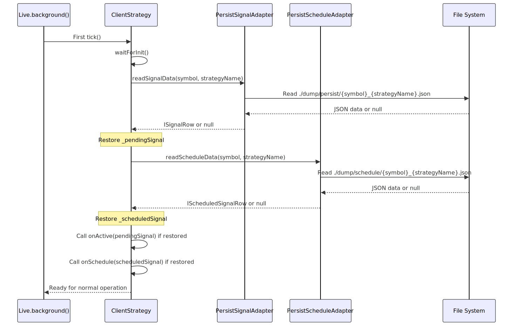
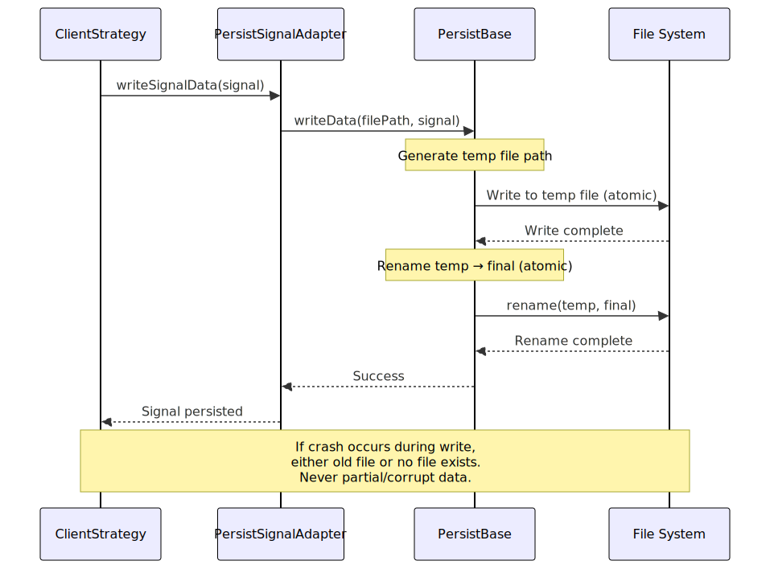

# Persistence Layer

## Purpose and Scope

The Persistence Layer provides crash-safe state management for live trading by atomically writing signal data to disk. This enables automatic recovery of active and scheduled signals after process crashes or restarts, ensuring that open trading positions are never lost. The layer is only active in Live mode; Backtest mode operates entirely in-memory for performance.

For information about Live mode execution flow, see [Live Trading](./58_Live_Trading.md). For signal lifecycle states, see [Signal Lifecycle](./48_Signal_Lifecycle.md).

---

## Architecture Overview

The persistence layer implements a pluggable adapter pattern with atomic file writes to prevent data corruption during crashes.




---

## Core Components

### PersistBase

Abstract base class providing atomic write operations and storage interface. All persistence adapters extend this class.

**Key Features:**
- Atomic file writes using temp files + rename
- Directory creation and validation
- Abstract methods for custom backends

**Methods:**
- `writeData(filePath, data)` - Atomic write operation
- `readData(filePath)` - Read persisted data
- `deleteData(filePath)` - Remove persisted state
- `ensureDirectory(dirPath)` - Create storage directories


---

### PersistSignalAdapter

Manages persistence of active signals (opened → active → closed lifecycle).



**File Path Pattern:**
```
./dump/persist/{symbol}_{strategyName}.json
```

**Data Structure:**
```typescript
{
  id: string;
  priceOpen: number;
  position: "long" | "short";
  priceTakeProfit: number;
  priceStopLoss: number;
  minuteEstimatedTime: number;
  symbol: string;
  exchangeName: string;
  strategyName: string;
  scheduledAt: number;
  pendingAt: number;
  _isScheduled: false;
}
```


---

### PersistScheduleAdapter

Manages persistence of scheduled signals (awaiting price activation).



**File Path Pattern:**
```
./dump/schedule/{symbol}_{strategyName}.json
```

**Data Structure:**
```typescript
{
  id: string;
  priceOpen: number;  // Target activation price
  position: "long" | "short";
  priceTakeProfit: number;
  priceStopLoss: number;
  minuteEstimatedTime: number;
  symbol: string;
  exchangeName: string;
  strategyName: string;
  scheduledAt: number;
  pendingAt: number;  // Updated on activation
  _isScheduled: true;
}
```


---

## Crash Recovery Flow

When a live trading process restarts, the persistence layer automatically restores all active and scheduled signals.



**Recovery Validation:**
The system validates that restored signals match the current strategy configuration:

| Validation Check | Purpose |
|-----------------|---------|
| `exchangeName === current` | Prevent cross-exchange contamination |
| `strategyName === current` | Prevent cross-strategy contamination |
| Signal structure valid | Ensure data integrity |


---

## Signal State Persistence

### When Persistence Occurs



**Persistence Operations:**

| State Transition | Persistence Action | Adapter |
|-----------------|-------------------|---------|
| `idle → scheduled` | `writeScheduleData()` | PersistScheduleAdapter |
| `idle → opened` | `writeSignalData()` | PersistSignalAdapter |
| `scheduled → opened` | `deleteScheduleData()` + `writeSignalData()` | Both |
| `scheduled → cancelled` | `deleteScheduleData()` | PersistScheduleAdapter |
| `active → closed` | `deleteSignalData()` | PersistSignalAdapter |


---

## Atomic Write Implementation

The persistence layer uses atomic file operations to prevent corruption during crashes.



**Atomic Operation Sequence:**

1. **Serialize to JSON** - Convert `ISignalRow` to JSON string
2. **Write to temp file** - `{filePath}.tmp` with full data
3. **Sync to disk** - Ensure OS writes complete (fsync)
4. **Atomic rename** - `rename(temp, final)` - OS-level atomic operation
5. **Verify existence** - Confirm final file exists

**Why This Prevents Corruption:**

| Scenario | Result | Reason |
|----------|--------|--------|
| Crash before temp write complete | Old file intact | Temp file discarded, final untouched |
| Crash during temp write | Old file intact | Temp file partial, final untouched |
| Crash after write, before rename | Old file intact | Temp file complete, final untouched |
| Crash during rename | Either old or new file | OS guarantees rename atomicity |
| Crash after rename | New file intact | Rename completed successfully |


---

## Backtest vs Live Mode

Persistence behavior differs fundamentally between execution modes:

| Aspect | Backtest Mode | Live Mode |
|--------|--------------|-----------|
| Persistence enabled | ❌ No | ✅ Yes |
| State storage | In-memory only | Disk-backed |
| Crash recovery | N/A (deterministic replay) | Automatic |
| Performance | Optimized (no I/O) | I/O overhead acceptable |
| File writes | None | Every signal state change |



**Conditional Execution Check:**

The framework uses `executionContextService.context.backtest` flag to skip persistence in backtest mode:

[src/client/ClientStrategy.ts:493-495]():
```typescript
if (self.params.execution.context.backtest) {
  return; // Skip persistence in backtest
}
```


---

## Custom Backend Implementation

The persistence layer supports custom storage backends through the `PersistBase` abstract class.

### Extension Points



### Implementation Example

**Redis Backend:**

```typescript
class RedisPersistBase extends PersistBase {
  async writeData(key: string, data: any): Promise<void> {
    const serialized = JSON.stringify(data);
    await redis.set(key, serialized);
  }
  
  async readData(key: string): Promise<any | null> {
    const data = await redis.get(key);
    return data ? JSON.parse(data) : null;
  }
  
  async deleteData(key: string): Promise<void> {
    await redis.del(key);
  }
  
  async ensureDirectory(namespace: string): Promise<void> {
    // Redis namespaces don't require creation
  }
}
```

**MongoDB Backend:**

```typescript
class MongoPersistBase extends PersistBase {
  async writeData(docPath: string, data: any): Promise<void> {
    const [collection, id] = docPath.split('/');
    await db.collection(collection).updateOne(
      { _id: id },
      { $set: data },
      { upsert: true }
    );
  }
  
  async readData(docPath: string): Promise<any | null> {
    const [collection, id] = docPath.split('/');
    return await db.collection(collection).findOne({ _id: id });
  }
  
  async deleteData(docPath: string): Promise<void> {
    const [collection, id] = docPath.split('/');
    await db.collection(collection).deleteOne({ _id: id });
  }
  
  async ensureDirectory(dbName: string): Promise<void> {
    // MongoDB creates collections automatically
  }
}
```

**Custom Adapter Registration:**

```typescript
// Replace default adapters with custom backends
PersistSignalAdapter.setBackend(new RedisPersistBase());
PersistScheduleAdapter.setBackend(new MongoPersistBase());
```


---

## File Storage Structure

Default file system backend organizes persisted data by type and symbol-strategy pairs.

```
project-root/
└── dump/
    ├── persist/              # Active signals
    │   ├── BTCUSDT_strategy1.json
    │   ├── ETHUSDT_strategy1.json
    │   └── BTCUSDT_strategy2.json
    │
    └── schedule/             # Scheduled signals
        ├── BTCUSDT_strategy1.json
        ├── ETHUSDT_strategy1.json
        └── BTCUSDT_strategy2.json
```

**Directory Structure:**

| Directory | Purpose | Lifecycle |
|-----------|---------|-----------|
| `./dump/persist/` | Active signals awaiting TP/SL/timeout | Created on first live run |
| `./dump/schedule/` | Scheduled signals awaiting activation | Created on first scheduled signal |

**File Naming Convention:**

| Pattern | Example | Uniqueness |
|---------|---------|------------|
| `{symbol}_{strategyName}.json` | `BTCUSDT_strategy1.json` | One file per symbol-strategy pair |

**File Lifecycle:**

| Event | Active Signal File | Scheduled Signal File |
|-------|-------------------|----------------------|
| Signal scheduled | No file | File created |
| Signal opened (immediate) | File created | No file |
| Scheduled → Opened | File created | File deleted |
| Signal closed | File deleted | N/A |
| Signal cancelled | N/A | File deleted |


---

## Persistence Callbacks

The framework provides optional callbacks to observe persistence operations.

### onWrite Callback

Called whenever signal data is written to persistent storage.

**Use Cases:**
- Testing persistence operations
- Logging state changes
- Auditing signal modifications
- Custom replication logic

**Signature:**
```typescript
onWrite: (
  symbol: string,
  data: ISignalRow | null,
  backtest: boolean
) => void
```

**Parameters:**

| Parameter | Type | Description |
|-----------|------|-------------|
| `symbol` | `string` | Trading pair (e.g., `"BTCUSDT"`) |
| `data` | `ISignalRow \| null` | Signal data written (null = deletion) |
| `backtest` | `boolean` | Always `false` (persistence disabled in backtest) |

**Example:**

```typescript
addStrategy({
  strategyName: "test-strategy",
  interval: "5m",
  getSignal: async () => { /* ... */ },
  callbacks: {
    onWrite: (symbol, data, backtest) => {
      if (data === null) {
        console.log(`Signal cleared: ${symbol}`);
      } else {
        console.log(`Signal persisted: ${symbol} id=${data.id}`);
      }
    }
  }
});
```


---

## Error Handling

Persistence operations are wrapped in error handling to prevent crashes from propagating.

### Error Scenarios

| Scenario | Behavior | Recovery |
|----------|----------|----------|
| Disk full | Error logged, signal lost | Manual intervention required |
| Permission denied | Error logged, signal lost | Fix permissions, restart |
| Corrupt JSON | Error logged, signal ignored | Old state discarded |
| Directory missing | Auto-created on write | Automatic recovery |
| File locked | Retry with exponential backoff | Automatic recovery |

### Error Propagation



**Error Logging Payload:**
```typescript
{
  message: "Persistence write failed",
  error: {
    name: "ENOSPC",
    message: "No space left on device",
    stack: "..."
  },
  context: {
    symbol: "BTCUSDT",
    strategyName: "strategy1",
    operation: "writeSignalData"
  }
}
```


---

## Performance Considerations

Persistence adds I/O overhead to live trading operations. The framework optimizes this through strategic write patterns.

### Write Frequency

| Operation | Write Count | Rationale |
|-----------|-------------|-----------|
| Signal opened | 1 write | Initial state persistence |
| Signal active (monitoring) | 0 writes | No state changes |
| Signal closed | 1 write (delete) | Cleanup |
| Scheduled signal created | 1 write | Initial state persistence |
| Scheduled → Opened | 2 writes (delete + write) | State transition |

**Total I/O per Signal Lifecycle:**

| Scenario | Writes | Deletes | Total Operations |
|----------|--------|---------|------------------|
| Immediate open → close | 1 | 1 | 2 |
| Scheduled → open → close | 2 | 2 | 4 |
| Scheduled → cancelled | 1 | 1 | 2 |

### Optimization Strategies

**1. Batching (Not Implemented)**
- Current: One file per write
- Potential: Batch multiple signals into single file
- Trade-off: Complexity vs. performance

**2. Async Writes**
- Current: Synchronous writes block execution
- Benefit: Guaranteed persistence before proceeding
- Alternative: Async with promise tracking

**3. Memory Caching**
- Current: Direct disk writes
- Potential: In-memory cache with periodic flush
- Trade-off: Crash risk vs. performance

**4. Compression**
- Current: Plain JSON
- Potential: gzip/zstd compression
- Trade-off: CPU vs. disk I/O


---

## Integration with Signal Lifecycle

Persistence operations integrate seamlessly with the signal lifecycle state machine.



