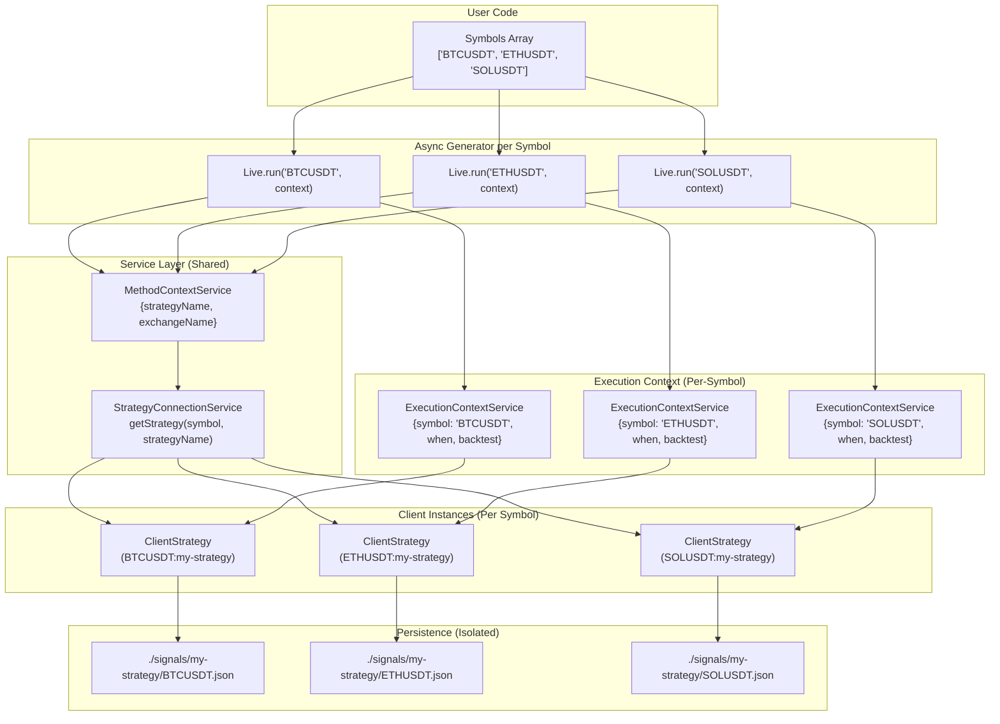
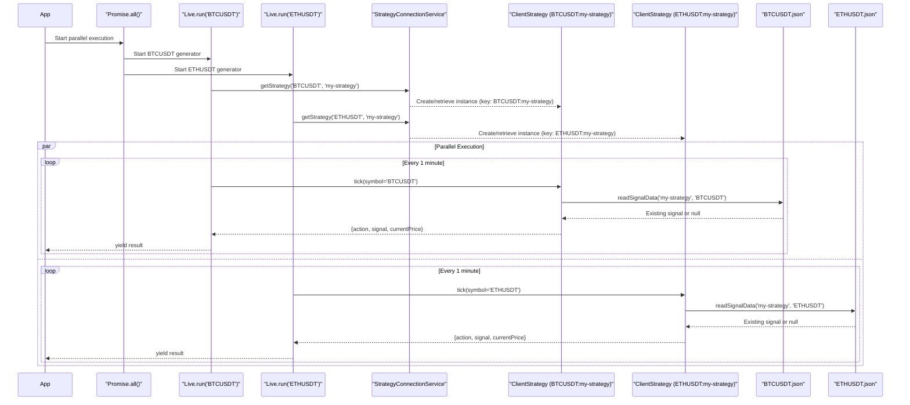
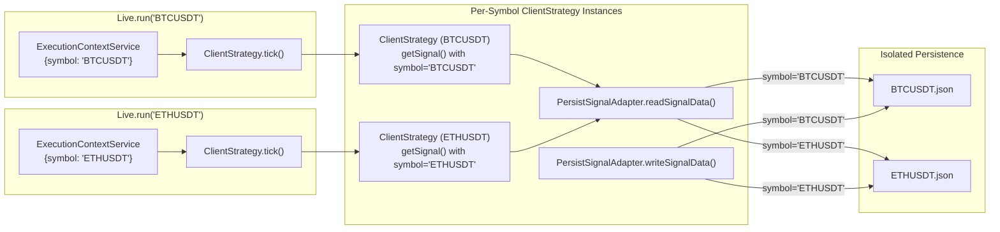
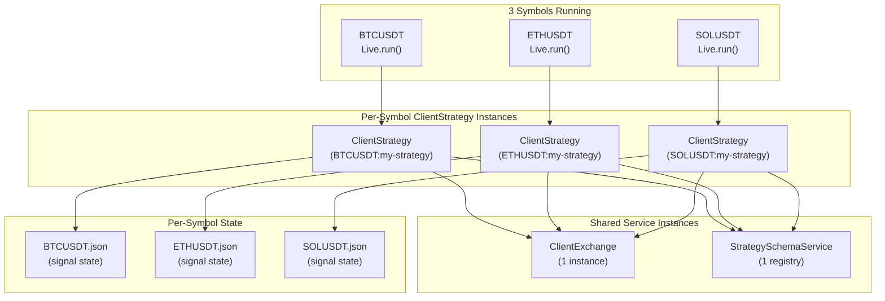
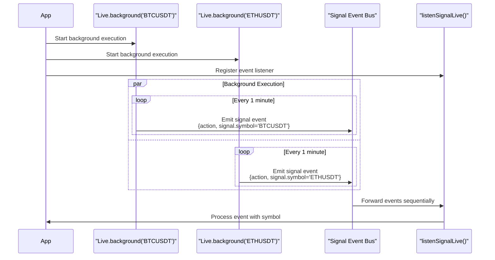
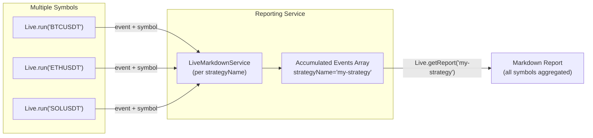
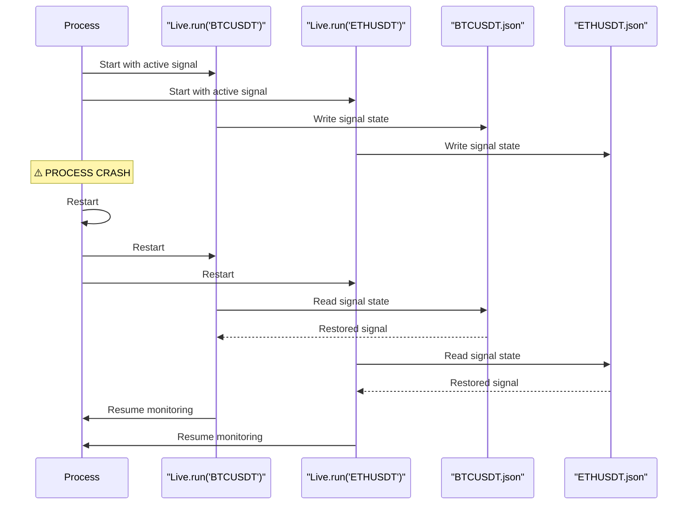

# Multi-Symbol Strategies

<details>
<summary>Relevant source files</summary>

The following files were used as context for generating this wiki page:

- [src/classes/Backtest.ts](src/classes/Backtest.ts)
- [src/classes/Live.ts](src/classes/Live.ts)
- [src/classes/Walker.ts](src/classes/Walker.ts)
- [src/client/ClientStrategy.ts](src/client/ClientStrategy.ts)
- [src/interfaces/Strategy.interface.ts](src/interfaces/Strategy.interface.ts)
- [src/lib/services/connection/StrategyConnectionService.ts](src/lib/services/connection/StrategyConnectionService.ts)
- [src/lib/services/global/StrategyGlobalService.ts](src/lib/services/global/StrategyGlobalService.ts)
- [types.d.ts](types.d.ts)

</details>


## Purpose and Scope

This document describes patterns for running trading strategies across multiple symbols (trading pairs) simultaneously. The framework is designed to support multi-symbol execution with automatic state isolation per symbol, shared strategy logic, and efficient memory usage through instance memoization.

For information about strategy implementation, see [Strategy Configuration](#3.1). For crash-safe persistence mechanics, see [Signal Persistence](#6.3). For report generation from multi-symbol execution, see [Markdown Report Generation](#9.1).

---

## Architecture for Multi-Symbol Execution

The framework's architecture naturally supports multi-symbol strategies through several key design patterns:

1. **Symbol-based state isolation** - Each `(strategyName, symbol)` pair maintains separate signal state
2. **Shared strategy instances** - The same `ClientStrategy` instance serves multiple symbols via memoization
3. **Context propagation** - `ExecutionContextService` injects the current symbol into each operation
4. **Per-symbol persistence** - Signal files are stored separately for each symbol



**Sources:** [types.d.ts:57-64](), [types.d.ts:315-323](), [types.d.ts:1069-1107]()

---

## Parallel Execution Pattern

The most common pattern for multi-symbol strategies is parallel execution using `Promise.all()`. Each symbol runs in its own async generator, yielding results independently.

### Basic Parallel Live Trading

```typescript
import { Live } from "backtest-kit";

const symbols = ["BTCUSDT", "ETHUSDT", "SOLUSDT"];

await Promise.all(
  symbols.map(async (symbol) => {
    for await (const result of Live.run(symbol, {
      strategyName: "my-strategy",
      exchangeName: "binance"
    })) {
      console.log(`[${symbol}] ${result.action}`);
      
      if (result.action === "closed") {
        console.log(`[${symbol}] PNL: ${result.pnl.pnlPercentage}%`);
      }
    }
  })
);
```

### Execution Flow Diagram



**Sources:** [README.md:692-715](), [types.d.ts:1264-1333]()

---

## State Isolation by Symbol

Each `(strategyName, symbol)` pair maintains completely isolated signal state. This is enforced at the persistence layer, where signal files are stored per symbol.

### Persistence File Structure

```
./signals/
  my-strategy/
    BTCUSDT.json    <- {signalRow: ISignalRow | null}
    ETHUSDT.json    <- {signalRow: ISignalRow | null}
    SOLUSDT.json    <- {signalRow: ISignalRow | null}
```

### Signal Isolation Implementation

| Component | Isolation Mechanism |
|-----------|---------------------|
| `PersistSignalUtils.readSignalData()` | Takes `(strategyName, symbol)` as parameters |
| `PersistSignalUtils.writeSignalData()` | Writes to `./signals/{strategyName}/{symbol}.json` |
| `ClientStrategy._getFilename()` | Computes filename from `executionContext.symbol` |
| `ExecutionContextService.context` | Provides symbol for current operation |

### State Isolation Flow



**Sources:** [types.d.ts:1086-1107](), [types.d.ts:57-64]()

---

## Instance Memoization per Symbol-Strategy Pair

The framework uses memoization to cache `ClientStrategy` instances per `(symbol, strategyName)` pair, preventing redundant instantiation while maintaining isolated execution contexts.

### Memoization Strategy

| Service | Memoization Key | Instances Created |
|---------|----------------|-------------------|
| `StrategyConnectionService.getStrategy()` | `${symbol}:${strategyName}` | 1 per symbol-strategy pair |
| `ExchangeConnectionService.getExchange()` | `exchangeName` | 1 per exchange |
| `FrameConnectionService.getFrame()` | `frameName` | 1 per frame |
| Signal state persistence | `(strategyName, symbol)` | 1 file per symbol |

### Instance Architecture per Symbol



**Memory Usage:**
- **ClientStrategy instances:** 3 (one per symbol-strategy pair: `BTCUSDT:my-strategy`, `ETHUSDT:my-strategy`, `SOLUSDT:my-strategy`)
- **ClientExchange instances:** 1 (shared across all strategies via memoization by `exchangeName`)
- **State files:** 3 (one per symbol)

The memoization key `${symbol}:${strategyName}` ensures each symbol-strategy combination maintains its own `ClientStrategy` instance, preventing state contamination while allowing `_pendingSignal` and `_scheduledSignal` to be instance properties.

**Sources:** [src/lib/services/connection/StrategyConnectionService.ts:78-98](), [src/client/ClientStrategy.ts:1-40]()

---

## Background Execution with Event Listeners

For multi-symbol strategies, background execution with event listeners provides cleaner separation of concerns. Each symbol runs independently while a central listener handles events.

### Pattern: Background + Listener

```typescript
import { Live, listenSignalLive } from "backtest-kit";

const symbols = ["BTCUSDT", "ETHUSDT", "SOLUSDT"];

// Start all symbols in background
const cancellations = await Promise.all(
  symbols.map((symbol) =>
    Live.background(symbol, {
      strategyName: "my-strategy",
      exchangeName: "binance"
    })
  )
);

// Single listener for all symbols
listenSignalLive((event) => {
  const symbol = event.signal?.symbol || "UNKNOWN";
  
  if (event.action === "opened") {
    console.log(`[${symbol}] Signal opened:`, event.signal.id);
  }
  
  if (event.action === "closed") {
    console.log(`[${symbol}] Signal closed:`, {
      pnl: event.pnl.pnlPercentage,
      reason: event.closeReason
    });
  }
});

// Cancel all on exit
process.on("SIGINT", () => {
  cancellations.forEach(cancel => cancel());
  process.exit(0);
});
```

### Event Listener Flow



**Sources:** [types.d.ts:1264-1333](), [types.d.ts:707-749]()

---

## Report Aggregation

When running multiple symbols, the markdown report service aggregates all events for a given `strategyName`, regardless of symbol. Reports include symbol information in each row.

### Report Structure for Multi-Symbol

```markdown
# Live Trading Report: my-strategy

Total events: 45 (15 per symbol × 3 symbols)
Closed signals: 9 (3 per symbol × 3 symbols)
Win rate: 66.67% (6W / 3L)
Average PNL: +1.45%

| Timestamp | Symbol   | Action | Signal ID | Position | ... | PNL (net) | Close Reason |
|-----------|----------|--------|-----------|----------|-----|-----------|--------------|
| 12:00:00  | BTCUSDT  | CLOSED | abc-123   | LONG     | ... | +2.10%    | take_profit  |
| 12:01:00  | ETHUSDT  | CLOSED | def-456   | SHORT    | ... | +1.50%    | take_profit  |
| 12:02:00  | SOLUSDT  | CLOSED | ghi-789   | LONG     | ... | -0.80%    | stop_loss    |
```

### Report Accumulation Pattern



### Symbol Filtering in Reports

Since reports aggregate all symbols, you can filter by symbol using event listeners:

```typescript
import { listenSignalLive } from "backtest-kit";

const btcResults = [];

listenSignalLive((event) => {
  if (event.signal?.symbol === "BTCUSDT" && event.action === "closed") {
    btcResults.push(event);
  }
});

// Later: generate custom report for BTCUSDT only
const btcWinRate = btcResults.filter(r => r.pnl.pnlPercentage > 0).length / btcResults.length;
console.log(`BTCUSDT Win Rate: ${(btcWinRate * 100).toFixed(2)}%`);
```

**Sources:** [types.d.ts:1304-1332](), [README.md:299-332]()

---

## Sequential Execution Pattern

While parallel execution is most common, sequential execution can be useful for controlled resource usage or debugging.

### Sequential Live Trading

```typescript
import { Live } from "backtest-kit";

const symbols = ["BTCUSDT", "ETHUSDT", "SOLUSDT"];

// Process one symbol at a time
for (const symbol of symbols) {
  console.log(`Starting ${symbol}...`);
  
  let signalCount = 0;
  
  for await (const result of Live.run(symbol, {
    strategyName: "my-strategy",
    exchangeName: "binance"
  })) {
    if (result.action === "closed") {
      signalCount++;
      console.log(`[${symbol}] Signal ${signalCount} closed`);
      
      // Move to next symbol after N signals
      if (signalCount >= 10) {
        console.log(`${symbol} completed 10 signals, moving to next`);
        break;
      }
    }
  }
}

console.log("All symbols processed sequentially");
```

### Sequential vs Parallel Comparison

| Pattern | Memory Usage | Execution Time | Use Case |
|---------|--------------|----------------|----------|
| **Parallel** (`Promise.all`) | Higher (all generators active) | Faster (concurrent) | Production multi-symbol trading |
| **Sequential** (for loop) | Lower (one generator active) | Slower (serial) | Debugging, resource-constrained environments |
| **Background** (`.background()`) | Medium (generators in background) | Fast (fire-and-forget) | Event-driven architectures |

**Sources:** [types.d.ts:1264-1333]()

---

## Cross-Symbol Coordination

For advanced strategies that need to coordinate decisions across symbols, use shared state outside the framework.

### Pattern: Shared State Coordination

```typescript
import { Live, listenSignalLive } from "backtest-kit";

// Shared state for cross-symbol coordination
const portfolio = {
  totalPnL: 0,
  activeSignals: new Set<string>(),
  maxConcurrentSignals: 3,
};

// Listen to all signals and update shared state
listenSignalLive((event) => {
  const symbol = event.signal?.symbol;
  
  if (event.action === "opened") {
    portfolio.activeSignals.add(event.signal.id);
    console.log(`Active signals: ${portfolio.activeSignals.size}`);
  }
  
  if (event.action === "closed") {
    portfolio.activeSignals.delete(event.signal.id);
    portfolio.totalPnL += event.pnl.pnlPercentage;
    
    console.log(`Portfolio PnL: ${portfolio.totalPnL.toFixed(2)}%`);
    
    // Risk management: stop all if portfolio loss > 10%
    if (portfolio.totalPnL < -10) {
      console.error("Portfolio loss limit exceeded, stopping all symbols");
      process.exit(1);
    }
  }
});

// Run all symbols
const symbols = ["BTCUSDT", "ETHUSDT", "SOLUSDT"];
await Promise.all(
  symbols.map((symbol) =>
    Live.background(symbol, {
      strategyName: "my-strategy",
      exchangeName: "binance"
    })
  )
);
```

### Cross-Symbol Strategy Implementation

For strategies that need symbol data in `getSignal()`, use the `ExecutionContextService`:

```typescript
import { addStrategy, getCandles } from "backtest-kit";

// Global state for cross-symbol analysis
const symbolData = new Map<string, { lastPrice: number }>();

addStrategy({
  strategyName: "correlation-strategy",
  interval: "5m",
  getSignal: async (symbol) => {
    // Get current symbol data
    const candles = await getCandles(symbol, "1m", 1);
    const currentPrice = candles[0].close;
    
    // Update shared state
    symbolData.set(symbol, { lastPrice: currentPrice });
    
    // Decision based on other symbols
    if (symbol === "BTCUSDT" && symbolData.has("ETHUSDT")) {
      const ethPrice = symbolData.get("ETHUSDT").lastPrice;
      const btcPrice = currentPrice;
      const ratio = btcPrice / ethPrice;
      
      // Trade BTC if ratio is unusual
      if (ratio > 20) {
        return {
          position: "long",
          priceOpen: currentPrice,
          priceTakeProfit: currentPrice * 1.02,
          priceStopLoss: currentPrice * 0.98,
          minuteEstimatedTime: 60,
        };
      }
    }
    
    return null; // No signal
  },
});
```

**Sources:** [types.d.ts:57-64](), [types.d.ts:410-422]()

---

## Error Recovery and Resilience

When one symbol encounters an error, the framework's design ensures other symbols continue operating independently.

### Error Isolation Pattern

```typescript
import { Live } from "backtest-kit";

const symbols = ["BTCUSDT", "ETHUSDT", "SOLUSDT"];

// Wrap each symbol in error boundary
await Promise.all(
  symbols.map(async (symbol) => {
    try {
      for await (const result of Live.run(symbol, {
        strategyName: "my-strategy",
        exchangeName: "binance"
      })) {
        console.log(`[${symbol}]`, result.action);
      }
    } catch (error) {
      console.error(`[${symbol}] ERROR:`, error.message);
      
      // Log error but don't crash other symbols
      await Live.dump("my-strategy", `./errors/${symbol}`);
      
      // Optionally restart this symbol after delay
      await new Promise(resolve => setTimeout(resolve, 5000));
      // Recursively restart
    }
  })
);
```

### Crash Recovery Per Symbol

Each symbol's state is persisted independently. If the entire process crashes:

1. **BTCUSDT** signal state: `./signals/my-strategy/BTCUSDT.json` (restored)
2. **ETHUSDT** signal state: `./signals/my-strategy/ETHUSDT.json` (restored)
3. **SOLUSDT** signal state: `./signals/my-strategy/SOLUSDT.json` (restored)

On restart, all symbols resume from their last persisted state with no signal duplication.



**Sources:** [types.d.ts:1069-1125](), [README.md:170-194]()

---

## Selective Symbol Processing

For strategies that need to dynamically enable/disable symbols based on conditions:

### Pattern: Conditional Symbol Execution

```typescript
import { Live, listenSignalLive } from "backtest-kit";

const allSymbols = ["BTCUSDT", "ETHUSDT", "SOLUSDT", "BNBUSDT", "ADAUSDT"];
const activeSymbols = new Set(allSymbols.slice(0, 3)); // Start with first 3

// Track performance per symbol
const symbolStats = new Map(
  allSymbols.map(s => [s, { wins: 0, losses: 0 }])
);

listenSignalLive((event) => {
  if (event.action === "closed") {
    const symbol = event.signal.symbol;
    const stats = symbolStats.get(symbol);
    
    if (event.pnl.pnlPercentage > 0) {
      stats.wins++;
    } else {
      stats.losses++;
    }
    
    // Disable symbol if win rate < 40%
    const total = stats.wins + stats.losses;
    if (total >= 10) {
      const winRate = stats.wins / total;
      
      if (winRate < 0.4 && activeSymbols.has(symbol)) {
        console.log(`Disabling ${symbol} due to low win rate: ${winRate}`);
        activeSymbols.delete(symbol);
        // Note: generator will continue until manually stopped
      }
    }
  }
});

// Start all symbols
const cancellations = new Map();

for (const symbol of allSymbols) {
  const cancel = await Live.background(symbol, {
    strategyName: "my-strategy",
    exchangeName: "binance"
  });
  cancellations.set(symbol, cancel);
}

// Monitor and disable underperforming symbols
setInterval(() => {
  for (const [symbol, cancel] of cancellations.entries()) {
    if (!activeSymbols.has(symbol)) {
      cancel(); // Stop this symbol's execution
      cancellations.delete(symbol);
      console.log(`Stopped ${symbol}`);
    }
  }
}, 60000); // Check every minute
```

**Sources:** [types.d.ts:1299-1303](), [types.d.ts:707-727]()

---

## Backtesting Multiple Symbols

For backtesting across multiple symbols, the same parallel execution pattern applies:

### Parallel Backtest Execution

```typescript
import { Backtest } from "backtest-kit";

const symbols = ["BTCUSDT", "ETHUSDT", "SOLUSDT"];

// Backtest all symbols in parallel
const results = await Promise.all(
  symbols.map(async (symbol) => {
    const symbolResults = [];
    
    for await (const result of Backtest.run(symbol, {
      strategyName: "my-strategy",
      exchangeName: "binance",
      frameName: "1d-backtest"
    })) {
      symbolResults.push({
        symbol,
        pnl: result.pnl.pnlPercentage,
        reason: result.closeReason,
      });
    }
    
    return { symbol, results: symbolResults };
  })
);

// Aggregate results
results.forEach(({ symbol, results: symbolResults }) => {
  const totalPnl = symbolResults.reduce((sum, r) => sum + r.pnl, 0);
  const avgPnl = totalPnl / symbolResults.length;
  
  console.log(`${symbol}: ${symbolResults.length} signals, avg PNL: ${avgPnl.toFixed(2)}%`);
});

// Generate combined report
await Backtest.dump("my-strategy");
```

### Backtest Performance Comparison

| Symbol | Signals | Win Rate | Avg PNL | Best PNL | Worst PNL |
|--------|---------|----------|---------|----------|-----------|
| BTCUSDT | 45 | 62.2% | +1.23% | +5.10% | -2.30% |
| ETHUSDT | 52 | 57.7% | +0.89% | +4.20% | -1.80% |
| SOLUSDT | 38 | 68.4% | +1.67% | +6.50% | -1.50% |

**Sources:** [types.d.ts:1127-1233](), [README.md:104-138]()

---

## Best Practices

### 1. Resource Management

```typescript
// Good: Limit concurrent symbols to avoid memory pressure
const MAX_CONCURRENT = 5;
const symbols = ["BTC", "ETH", "SOL", "BNB", "ADA", "DOT", "LINK", "MATIC"];

for (let i = 0; i < symbols.length; i += MAX_CONCURRENT) {
  const batch = symbols.slice(i, i + MAX_CONCURRENT);
  await Promise.all(batch.map(s => processSymbol(s)));
}

// Bad: Running 100 symbols in parallel without limits
await Promise.all(allSymbols.map(s => processSymbol(s)));
```

### 2. Error Boundaries

```typescript
// Good: Wrap each symbol in try-catch
await Promise.all(
  symbols.map(async (symbol) => {
    try {
      await processSymbol(symbol);
    } catch (error) {
      logger.error(`${symbol} failed:`, error);
      // Continue with other symbols
    }
  })
);

// Bad: Single try-catch around all symbols
try {
  await Promise.all(symbols.map(s => processSymbol(s)));
} catch (error) {
  // One error crashes all symbols
}
```

### 3. Graceful Shutdown

```typescript
// Good: Clean shutdown with cancellation
const cancellations = await Promise.all(
  symbols.map(s => Live.background(s, context))
);

process.on("SIGINT", async () => {
  console.log("Shutting down...");
  cancellations.forEach(cancel => cancel());
  await Live.dump("my-strategy"); // Save final report
  process.exit(0);
});

// Bad: Abrupt exit without cleanup
process.on("SIGINT", () => process.exit(0));
```

### 4. Symbol-Specific Configuration

```typescript
// Good: Different strategies per symbol type
const btcConfig = { strategyName: "btc-strategy", exchangeName: "binance" };
const altConfig = { strategyName: "alt-strategy", exchangeName: "binance" };

await Promise.all([
  Live.background("BTCUSDT", btcConfig),
  Live.background("ETHUSDT", altConfig),
  Live.background("SOLUSDT", altConfig),
]);

// Bad: Forcing same strategy on all symbols
await Promise.all(
  symbols.map(s => Live.background(s, { strategyName: "one-size-fits-all", ... }))
);
```

**Sources:** [README.md:692-715](), [types.d.ts:1299-1303]()