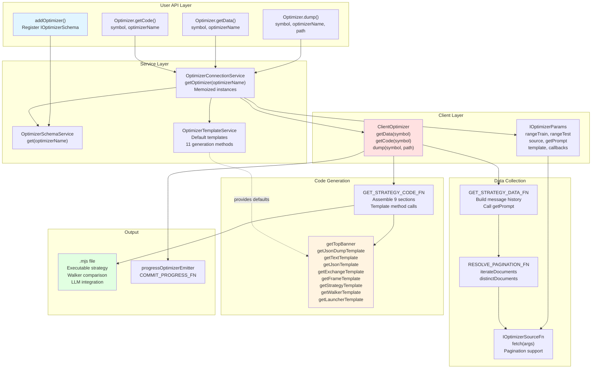
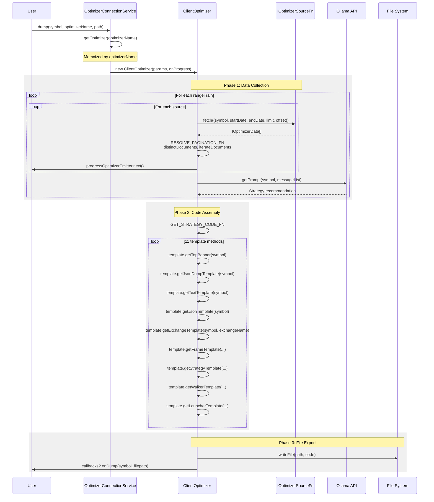
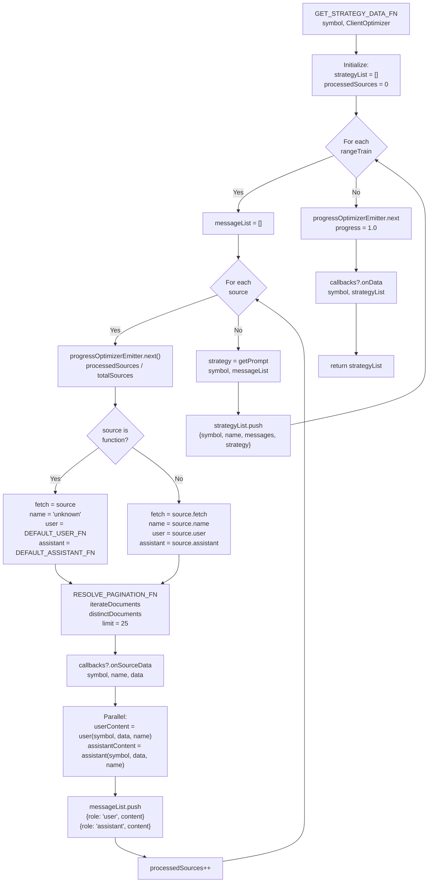
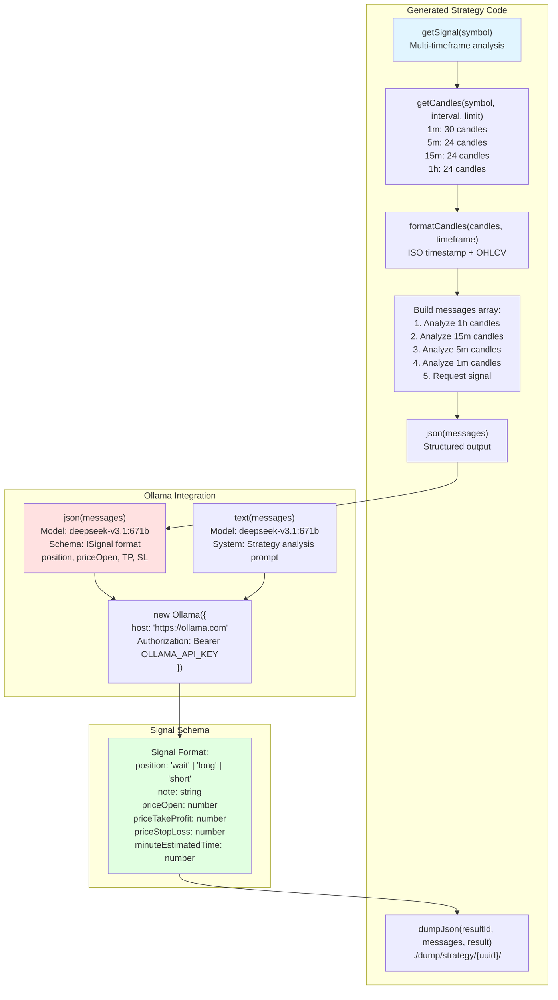
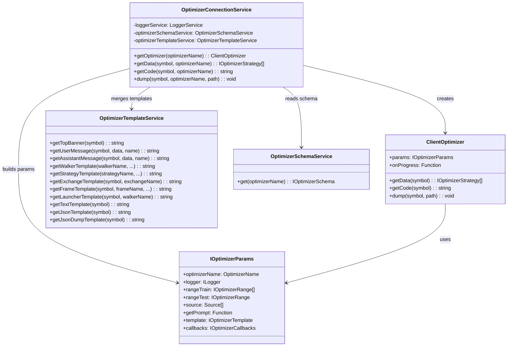

# AI-Powered Strategy Optimization

<details>
<summary>Relevant source files</summary>

The following files were used as context for generating this wiki page:

- [.claude/settings.local.json](.claude/settings.local.json)
- [demo/optimization/.env.example](demo/optimization/.env.example)
- [demo/optimization/.gitignore](demo/optimization/.gitignore)
- [demo/optimization/package-lock.json](demo/optimization/package-lock.json)
- [demo/optimization/package.json](demo/optimization/package.json)
- [demo/optimization/src/index.mjs](demo/optimization/src/index.mjs)
- [demo/trade/.gitkeep](demo/trade/.gitkeep)
- [package-lock.json](package-lock.json)
- [package.json](package.json)
- [src/client/ClientOptimizer.ts](src/client/ClientOptimizer.ts)
- [src/contract/ProgressOptimizer.contract.ts](src/contract/ProgressOptimizer.contract.ts)
- [src/interfaces/Optimizer.interface.ts](src/interfaces/Optimizer.interface.ts)
- [src/lib/services/connection/OptimizerConnectionService.ts](src/lib/services/connection/OptimizerConnectionService.ts)
- [src/lib/services/template/OptimizerTemplateService.ts](src/lib/services/template/OptimizerTemplateService.ts)

</details>


This document describes the AI-powered strategy optimization system that uses Large Language Models (LLMs) to automatically generate and evaluate trading strategies based on historical market data. For detailed information about the template system, see [Optimizer Architecture](#16.5.1). For data collection specifics, see [Data Collection Pipeline](#16.5.2). For LLM integration details, see [LLM Integration](#16.5.3).

The optimization system enables:
- Automated strategy generation from historical data analysis
- Multi-timeframe market data processing (1h, 30m, 15m, 1m)
- LLM-driven trading logic synthesis using Ollama API
- Executable code generation with backtest validation
- Walker-based performance comparison of generated strategies

---

## System Architecture

The optimizer system consists of four primary components that orchestrate data collection, LLM conversation building, code generation, and file export.



**Sources:** [src/client/ClientOptimizer.ts:1-448](), [src/lib/services/connection/OptimizerConnectionService.ts:1-175](), [src/lib/services/template/OptimizerTemplateService.ts:1-710](), [src/interfaces/Optimizer.interface.ts:1-490]()

---

## Core Components and Data Flow

The optimizer follows a three-phase pipeline: data collection, LLM interaction, and code assembly.



**Sources:** [src/client/ClientOptimizer.ts:90-215](), [src/client/ClientOptimizer.ts:217-350](), [src/client/ClientOptimizer.ts:352-384]()

---

## IOptimizerSchema Configuration

The `IOptimizerSchema` interface defines the complete configuration for an optimizer instance. Registration uses the `addOptimizer()` function.

### Schema Structure

| Field | Type | Required | Description |
|-------|------|----------|-------------|
| `optimizerName` | `OptimizerName` | Yes | Unique identifier for registry lookup |
| `rangeTrain` | `IOptimizerRange[]` | Yes | Training date ranges for strategy generation |
| `rangeTest` | `IOptimizerRange` | Yes | Testing date range for Walker validation |
| `source` | `Source[]` | Yes | Data sources (functions or config objects) |
| `getPrompt` | `Function` | Yes | LLM prompt generator from message history |
| `template` | `Partial<IOptimizerTemplate>` | No | Custom template method overrides |
| `callbacks` | `Partial<IOptimizerCallbacks>` | No | Lifecycle event handlers |

### Source Configuration

Sources can be defined as either simple fetch functions or full configuration objects:

```typescript
// Simple function source
const simpleSource: IOptimizerSourceFn = async ({ symbol, startDate, endDate, limit, offset }) => {
  // Return IOptimizerData[] with unique id field
  return fetchedData;
};

// Full configuration source
const configSource: IOptimizerSource = {
  name: "long-term-range",
  fetch: async ({ symbol, startDate, endDate, limit, offset }) => {
    // Return paginated data
    return fetchedData;
  },
  user: async (symbol, data, name) => {
    // Custom user message formatter
    return formattedPrompt;
  },
  assistant: async (symbol, data, name) => {
    // Custom assistant response
    return acknowledgment;
  }
};
```

**Sources:** [src/interfaces/Optimizer.interface.ts:129-177](), [src/interfaces/Optimizer.interface.ts:377-433]()

---

## Data Collection and Pagination

The `ClientOptimizer` collects data from all sources across all training ranges, building a conversation history for the LLM.



### Pagination Implementation

The `RESOLVE_PAGINATION_FN` uses `functools-kit` utilities to handle automatic pagination with deduplication:

```typescript
const RESOLVE_PAGINATION_FN = async (fetch, filterData) => {
  const iterator = iterateDocuments({
    limit: ITERATION_LIMIT,  // 25 rows per request
    async createRequest({ limit, offset }) {
      return await fetch({
        symbol: filterData.symbol,
        startDate: filterData.startDate,
        endDate: filterData.endDate,
        limit,
        offset,
      });
    },
  });
  const distinct = distinctDocuments(iterator, (data) => data.id);
  return await resolveDocuments(distinct);
};
```

**Sources:** [src/client/ClientOptimizer.ts:69-88](), [src/client/ClientOptimizer.ts:99-215](), [demo/optimization/src/index.mjs:66-296]()

---

## Template System

The `OptimizerTemplateService` provides 11 default template methods for code generation. Each method can be overridden in the optimizer schema configuration.

### Template Method Reference

| Method | Returns | Purpose |
|--------|---------|---------|
| `getTopBanner(symbol)` | Shebang + imports | Package imports and constants |
| `getJsonDumpTemplate(symbol)` | `dumpJson()` function | Debug output to `./dump/strategy/` |
| `getTextTemplate(symbol)` | `text()` function | LLM text generation with Ollama |
| `getJsonTemplate(symbol)` | `json()` function | Structured signal output with schema |
| `getExchangeTemplate(symbol, exchangeName)` | `addExchange()` call | CCXT Binance integration |
| `getFrameTemplate(symbol, frameName, interval, startDate, endDate)` | `addFrame()` call | Timeframe configuration |
| `getStrategyTemplate(strategyName, interval, prompt)` | `addStrategy()` call | Strategy with multi-timeframe LLM |
| `getWalkerTemplate(walkerName, exchangeName, frameName, strategies)` | `addWalker()` call | Strategy comparison setup |
| `getLauncherTemplate(symbol, walkerName)` | `Walker.background()` + listeners | Execution and event handling |

### Code Assembly Order

The `GET_STRATEGY_CODE_FN` assembles code sections in this order:

1. Top banner with imports (`getTopBanner`)
2. JSON dump helper (`getJsonDumpTemplate`)
3. LLM helpers (`getTextTemplate`, `getJsonTemplate`)
4. Exchange configuration (`getExchangeTemplate`)
5. Training frames (one `getFrameTemplate` per `rangeTrain`)
6. Test frame (one `getFrameTemplate` for `rangeTest`)
7. Strategies (one `getStrategyTemplate` per generated strategy)
8. Walker configuration (`getWalkerTemplate`)
9. Launcher code (`getLauncherTemplate`)

**Sources:** [src/lib/services/template/OptimizerTemplateService.ts:26-710](), [src/client/ClientOptimizer.ts:217-350]()

---

## LLM Integration Architecture

The generated code integrates Ollama for runtime strategy generation with two helper functions: `text()` for analysis and `json()` for structured signals.



### JSON Schema Configuration

The `getJsonTemplate()` method generates a `json()` function with strict type enforcement:

```typescript
format: {
  type: "object",
  properties: {
    position: {
      type: "string",
      enum: ["wait", "long", "short"],
      description: "Trade decision"
    },
    note: {
      type: "string",
      description: "Professional trading recommendation"
    },
    priceOpen: { type: "number", description: "Entry price" },
    priceTakeProfit: { type: "number", description: "Take profit target" },
    priceStopLoss: { type: "number", description: "Stop loss exit" },
    minuteEstimatedTime: { type: "number", description: "Expected time to TP" }
  },
  required: ["position", "note", "priceOpen", "priceTakeProfit", "priceStopLoss", "minuteEstimatedTime"]
}
```

**Sources:** [src/lib/services/template/OptimizerTemplateService.ts:166-298](), [src/lib/services/template/OptimizerTemplateService.ts:549-606](), [src/lib/services/template/OptimizerTemplateService.ts:608-706]()

---

## Usage Example

Complete example demonstrating optimizer configuration with CCXT Dumper integration:

```typescript
import { addOptimizer, Optimizer, listenOptimizerProgress } from "backtest-kit";
import { Ollama } from "ollama";

addOptimizer({
  optimizerName: "btc-optimizer",
  
  // Training ranges (multiple periods for strategy generation)
  rangeTrain: [
    {
      note: "Bull market period",
      startDate: new Date("2025-11-24T00:00:00Z"),
      endDate: new Date("2025-11-24T23:59:59Z"),
    },
    {
      note: "Consolidation period",
      startDate: new Date("2025-11-25T00:00:00Z"),
      endDate: new Date("2025-11-25T23:59:59Z"),
    }
  ],
  
  // Test range (held out for Walker validation)
  rangeTest: {
    note: "Validation period",
    startDate: new Date("2025-12-01T00:00:00Z"),
    endDate: new Date("2025-12-01T23:59:59Z"),
  },
  
  // Data sources with pagination support
  source: [
    {
      name: "long-term-range",
      fetch: async ({ symbol, startDate, endDate, limit, offset }) => {
        const url = new URL(`${process.env.CCXT_DUMPER_URL}/view/long-term-range`);
        url.searchParams.set("symbol", symbol);
        url.searchParams.set("startDate", startDate.getTime());
        url.searchParams.set("endDate", endDate.getTime());
        url.searchParams.set("limit", limit || 1000);
        url.searchParams.set("offset", offset || 0);
        
        const { data } = await fetchApi(url);
        return data.rows; // Must have unique 'id' field
      },
      user: (symbol, data) => `# 1-Hour Analysis for ${symbol}\n\n${arrayToMarkdownTable(data)}`,
      assistant: () => "Historical 1h data acknowledged"
    },
    {
      name: "short-term-range",
      fetch: async ({ symbol, startDate, endDate, limit, offset }) => {
        // Fetch 15m candles with technical indicators
        const url = new URL(`${process.env.CCXT_DUMPER_URL}/view/short-term-range`);
        url.searchParams.set("symbol", symbol);
        url.searchParams.set("startDate", startDate.getTime());
        url.searchParams.set("endDate", endDate.getTime());
        url.searchParams.set("limit", limit || 1000);
        url.searchParams.set("offset", offset || 0);
        
        const { data } = await fetchApi(url);
        return data.rows;
      },
      user: (symbol, data) => `# 15-Minute Analysis for ${symbol}\n\n${arrayToMarkdownTable(data)}`,
      assistant: () => "Historical 15m data acknowledged"
    }
  ],
  
  // LLM prompt generation from conversation history
  getPrompt: async (symbol, messages) => {
    const ollama = new Ollama({
      host: "https://ollama.com",
      headers: {
        Authorization: `Bearer ${process.env.OLLAMA_API_KEY}`,
      },
    });
    
    const response = await ollama.chat({
      model: "deepseek-v3.1:671b",
      messages: [
        {
          role: "system",
          content: "Generate a trading strategy based on the provided data analysis."
        },
        ...messages,
        {
          role: "user",
          content: `What conditions should trigger ${symbol} trades? Provide clear entry rules.`
        }
      ]
    });
    
    return response.message.content.trim();
  },
  
  // Optional: Custom template overrides
  template: {
    getStrategyTemplate: async (strategyName, interval, prompt) => {
      // Custom strategy code generation
      return `addStrategy({
        strategyName: "${strategyName}",
        interval: "${interval}",
        getSignal: async (symbol) => {
          // Custom implementation using prompt
          const signal = await analyzeWithCustomLogic(symbol, ${JSON.stringify(prompt)});
          return signal;
        }
      });`;
    }
  },
  
  // Optional: Lifecycle callbacks
  callbacks: {
    onSourceData: async (symbol, sourceName, data, startDate, endDate) => {
      console.log(`Fetched ${data.length} rows from ${sourceName}`);
    },
    onData: async (symbol, strategyData) => {
      console.log(`Generated ${strategyData.length} strategies for ${symbol}`);
    },
    onCode: async (symbol, code) => {
      console.log(`Generated ${code.length} chars of code for ${symbol}`);
    },
    onDump: async (symbol, filepath) => {
      console.log(`Saved strategy to ${filepath}`);
    }
  }
});

// Listen to progress events
listenOptimizerProgress((event) => {
  console.log(`Progress: ${(event.progress * 100).toFixed(2)}%`);
  console.log(`Processed: ${event.processedSources} / ${event.totalSources} sources`);
});

// Generate and save strategy code
await Optimizer.dump("BTC/USDT", "btc-optimizer", "./generated");
```

### Generated File Structure

The generated `.mjs` file contains:
1. Imports (`ollama`, `ccxt`, `backtest-kit`, `fs`, `uuid`)
2. Helper functions (`dumpJson`, `text`, `json`)
3. Exchange configuration (CCXT Binance)
4. Frame configurations (train + test)
5. Strategy configurations with LLM integration
6. Walker configuration for comparison
7. Launcher code with event listeners

**Sources:** [demo/optimization/src/index.mjs:1-329](), [src/client/ClientOptimizer.ts:217-350]()

---

## Optimizer Lifecycle Callbacks

The `IOptimizerCallbacks` interface provides hooks for monitoring optimizer execution:

| Callback | Invoked When | Parameters | Use Case |
|----------|-------------|------------|----------|
| `onSourceData` | Data fetched from source | `symbol, sourceName, data, startDate, endDate` | Log data volume, validate rows |
| `onData` | All strategies generated | `symbol, strategyData` | Inspect message history, validate prompts |
| `onCode` | Code assembly complete | `symbol, code` | Log code size, syntax validation |
| `onDump` | File written to disk | `symbol, filepath` | Trigger CI/CD, run generated script |

### Progress Tracking

The `progressOptimizerEmitter` emits `ProgressOptimizerContract` events during data collection:

```typescript
interface ProgressOptimizerContract {
  optimizerName: string;       // "btc-optimizer"
  symbol: string;               // "BTC/USDT"
  totalSources: number;         // rangeTrain.length * source.length
  processedSources: number;     // Increments after each source fetch
  progress: number;             // 0.0 to 1.0
}
```

Events are emitted:
- Before processing each source (shows current progress)
- After all sources complete (progress = 1.0)

**Sources:** [src/interfaces/Optimizer.interface.ts:188-236](), [src/contract/ProgressOptimizer.contract.ts:1-31](), [src/client/ClientOptimizer.ts:99-215]()

---

## OptimizerConnectionService

The `OptimizerConnectionService` manages optimizer instances with memoization and template merging.



### Template Merging Logic

The `getOptimizer()` method merges custom templates with defaults:

```typescript
public getOptimizer = memoize(
  ([optimizerName]) => `${optimizerName}`,
  (optimizerName: OptimizerName) => {
    const { template: rawTemplate = {}, ...schemaRest } = 
      this.optimizerSchemaService.get(optimizerName);
    
    // Merge custom templates with defaults
    const template: IOptimizerTemplate = {
      getAssistantMessage: rawTemplate.getAssistantMessage || 
        this.optimizerTemplateService.getAssistantMessage,
      getExchangeTemplate: rawTemplate.getExchangeTemplate || 
        this.optimizerTemplateService.getExchangeTemplate,
      // ... repeat for all 11 methods
    };
    
    return new ClientOptimizer(
      {
        optimizerName,
        logger: this.loggerService,
        template,
        ...schemaRest
      },
      COMMIT_PROGRESS_FN
    );
  }
);
```

Memoization ensures only one `ClientOptimizer` instance exists per `optimizerName`, reducing memory overhead and maintaining consistent state.

**Sources:** [src/lib/services/connection/OptimizerConnectionService.ts:1-175](), [src/lib/services/connection/OptimizerConnectionService.ts:59-113]()

---

## Advanced Customization

### Custom Message Formatters

Override `user` and `assistant` formatters in source configuration to control LLM conversation:

```typescript
source: [
  {
    name: "custom-indicators",
    fetch: async (args) => fetchIndicatorData(args),
    
    // Custom user message with markdown table
    user: async (symbol, data, name) => {
      const table = data.map(row => 
        `| ${row.timestamp} | ${row.rsi} | ${row.macd} | ${row.signal} |`
      ).join('\n');
      
      return `# Technical Indicators for ${symbol}\n\n${table}\n\nAnalyze these indicators.`;
    },
    
    // Custom assistant acknowledgment
    assistant: async (symbol, data, name) => {
      return `Analyzed ${data.length} indicator rows for ${symbol}`;
    }
  }
]
```

### Custom Template Methods

Override any of the 11 template methods for complete control over generated code:

```typescript
template: {
  // Custom strategy generation with different LLM model
  getStrategyTemplate: async (strategyName, interval, prompt) => {
    return `
addStrategy({
  strategyName: "${strategyName}",
  interval: "${interval}",
  getSignal: async (symbol) => {
    // Use GPT-4 instead of deepseek
    const openai = new OpenAI({ apiKey: process.env.OPENAI_API_KEY });
    const response = await openai.chat.completions.create({
      model: "gpt-4",
      messages: [
        { role: "system", content: "${prompt}" },
        { role: "user", content: "Generate signal for " + symbol }
      ]
    });
    return JSON.parse(response.choices[0].message.content);
  }
});`;
  },
  
  // Custom Walker with different metric
  getWalkerTemplate: async (walkerName, exchangeName, frameName, strategies) => {
    return `
addWalker({
  walkerName: "${walkerName}",
  exchangeName: "${exchangeName}",
  frameName: "${frameName}",
  strategies: [${strategies.map(s => `"${s}"`).join(", ")}],
  metric: "winRate"  // Use win rate instead of sharpeRatio
});`;
  }
}
```

### Custom Data Sources

Implement custom pagination logic and data transformation:

```typescript
source: [
  {
    name: "database-source",
    fetch: async ({ symbol, startDate, endDate, limit, offset }) => {
      // Connect to custom database
      const db = await connectToDatabase();
      
      const rows = await db.query(`
        SELECT 
          id,
          timestamp,
          close_price as close,
          rsi_14 as rsi,
          macd,
          signal
        FROM technical_data
        WHERE symbol = $1 
          AND timestamp BETWEEN $2 AND $3
        ORDER BY timestamp
        LIMIT $4 OFFSET $5
      `, [symbol, startDate, endDate, limit, offset]);
      
      // Transform to IOptimizerData format
      return rows.map(row => ({
        id: row.id,
        timestamp: row.timestamp,
        close: parseFloat(row.close),
        rsi: parseFloat(row.rsi),
        macd: parseFloat(row.macd),
        signal: parseFloat(row.signal)
      }));
    },
    user: (symbol, data) => `Database indicators for ${symbol}: ${JSON.stringify(data)}`,
    assistant: () => "Database data processed"
  }
]
```

**Sources:** [src/interfaces/Optimizer.interface.ts:129-177](), [src/interfaces/Optimizer.interface.ts:239-374](), [demo/optimization/src/index.mjs:66-296]()