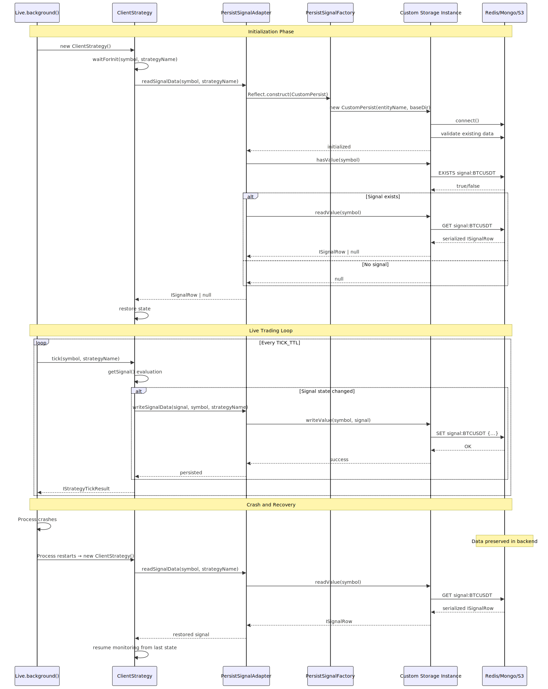

# Custom Persistence Backends

This page documents how to implement custom persistence backends for backtest-kit's crash recovery system. It covers the `IPersistBase` interface, adapter registration, and integration with external storage systems like Redis, MongoDB, or cloud storage.

For information about the persistence layer architecture and crash recovery mechanisms, see [Persistence Layer](./84_Persistence_Layer.md). For details about the default file-based persistence implementation, see [Persistence Utilities](./21_Persistence_Utilities.md).

---

## Overview

backtest-kit provides a pluggable persistence system that allows custom storage backends to replace the default file-based implementation. The system uses four domain-specific adapters:

| Adapter | Purpose | Data Type | Default Path |
|---------|---------|-----------|--------------|
| `PersistSignalAdapter` | Active pending signals | `ISignalRow \| null` | `./dump/data/signal/` |
| `PersistRiskAdapter` | Active risk positions | `Array<[string, IRiskActivePosition]>` | `./dump/data/risk/` |
| `PersistScheduleAdapter` | Scheduled signals | `IScheduledSignalRow \| null` | `./dump/data/schedule/` |
| `PersistPartialAdapter` | Partial profit/loss levels | `Record<string, IPartialData>` | `./dump/data/partial/` |

Each adapter accepts a custom constructor via `use*Adapter()` methods, enabling integration with any storage system that implements the `IPersistBase` interface.


---

## Persistence System Architecture



**Architecture:** Each adapter uses a factory pattern with constructor type `TPersistBaseCtor`. Custom backends register by calling `use*Adapter(CustomConstructor)` which replaces the factory. Instances are memoized per entity name using `memoize()` from functools-kit.


---

## IPersistBase Interface

Custom persistence backends must implement the `IPersistBase<Entity>` interface:

```typescript
// From src/classes/Persist.ts
interface IPersistBase<Entity extends IEntity | null = IEntity> {
  waitForInit(initial: boolean): Promise<void>;
  readValue(entityId: EntityId): Promise<Entity>;
  hasValue(entityId: EntityId): Promise<boolean>;
  writeValue(entityId: EntityId, entity: Entity): Promise<void>;
}
```

### Interface Contract

| Method | Parameters | Return Type | Purpose |
|--------|-----------|-------------|---------|
| `waitForInit` | `initial: boolean` | `Promise<void>` | Initialize storage, validate existing data |
| `readValue` | `entityId: EntityId` | `Promise<Entity>` | Retrieve entity by ID |
| `hasValue` | `entityId: EntityId` | `Promise<boolean>` | Check entity existence |
| `writeValue` | `entityId, entity` | `Promise<void>` | Persist entity atomically |

### Entity Types

| Adapter | Entity Type | Key Format |
|---------|-------------|------------|
| Signal | `ISignalRow \| null` | `symbol` (e.g., "BTCUSDT") |
| Risk | `Array<[string, IRiskActivePosition]>` | `"positions"` (constant) |
| Schedule | `IScheduledSignalRow \| null` | `symbol` (e.g., "BTCUSDT") |
| Partial | `Record<string, IPartialData>` | `"levels"` (constant) |

**Important:** `waitForInit()` receives `initial: boolean` flag indicating first-time initialization. Use this to optimize connection pooling or skip expensive validation.


---

## PersistBase Default Implementation

The default `PersistBase` class provides file-based storage with atomic writes:



### Atomic Write Pattern

[src/classes/Persist.ts:295-314]() implements atomic writes via `writeFileAtomic`:

1. Serialize entity to JSON string
2. Write to temporary file: `{path}.tmp`
3. Call `fsync()` to ensure disk write
4. Rename temp file to final path (atomic operation)

This guarantees that files are never in a partially-written state, critical for crash recovery.

### Self-Healing Validation

[src/classes/Persist.ts:132-153]() implements validation during `waitForInit()`:

1. Iterate all `.json` files in directory
2. Attempt to read and parse each file
3. If parsing fails, delete corrupted file
4. Retry deletion up to 5 times with 1-second delays

This prevents corrupted files from blocking initialization after crashes.


---

## Adapter Registration

Each domain-specific adapter exposes a `use*Adapter()` method accepting a custom constructor:

### Signal Persistence

```typescript
// From src/classes/Persist.ts
class PersistSignalUtils {
  private PersistSignalFactory: TPersistBaseCtor<StrategyName, SignalData> = PersistBase;
  
  public usePersistSignalAdapter(
    Ctor: TPersistBaseCtor<StrategyName, SignalData>
  ): void {
    this.PersistSignalFactory = Ctor;
  }
}

export const PersistSignalAdapter = new PersistSignalUtils();
```

**Memoization Key:** [src/classes/Persist.ts:518-519]() uses `${symbol}:${strategyName}` as cache key. Each symbol-strategy combination gets isolated storage instance.

**Entity Name Format:** [src/classes/Persist.ts:522-524]() constructs entity names as `${symbol}_${strategyName}` and base directory as `./dump/data/signal/`.

### Risk Persistence

```typescript
// From src/classes/Persist.ts
class PersistRiskUtils {
  private PersistRiskFactory: TPersistBaseCtor<RiskName, RiskData> = PersistBase;
  
  public usePersistRiskAdapter(
    Ctor: TPersistBaseCtor<RiskName, RiskData>
  ): void {
    this.PersistRiskFactory = Ctor;
  }
}

export const PersistRiskAdapter = new PersistRiskUtils();
```

**Memoization Key:** [src/classes/Persist.ts:651-652]() uses `${riskName}` as cache key. One instance per risk profile.

**Storage Key:** [src/classes/Persist.ts:699]() uses constant `"positions"` as entity ID for all risk data.

### Schedule Persistence

```typescript
// From src/classes/Persist.ts
class PersistScheduleUtils {
  private PersistScheduleFactory: TPersistBaseCtor<StrategyName, ScheduleData> = PersistBase;
  
  public usePersistScheduleAdapter(
    Ctor: TPersistBaseCtor<StrategyName, ScheduleData>
  ): void {
    this.PersistScheduleFactory = Ctor;
  }
}

export const PersistScheduleAdapter = new PersistScheduleUtils();
```

**Memoization Key:** [src/classes/Persist.ts:773-774]() uses `${symbol}:${strategyName}` as cache key.

**Entity Name Format:** [src/classes/Persist.ts:776-778]() constructs names as `${symbol}_${strategyName}` with base directory `./dump/data/schedule/`.

### Partial Persistence

```typescript
// From src/classes/Persist.ts
class PersistPartialUtils {
  private PersistPartialFactory: TPersistBaseCtor<string, PartialData> = PersistBase;
  
  public usePersistPartialAdapter(
    Ctor: TPersistBaseCtor<string, PartialData>
  ): void {
    this.PersistPartialFactory = Ctor;
  }
}

export const PersistPartialAdapter = new PersistPartialUtils();
```

**Memoization Key:** [src/classes/Persist.ts:899-900]() uses `${symbol}:${strategyName}` as cache key.

**Storage Key:** [src/classes/Persist.ts:949]() uses constant `"levels"` as entity ID for all partial data.


---

## Implementation Guide

### Step 1: Extend PersistBase

Custom backends must extend `PersistBase` and override core methods. Use `makeExtendable()` from functools-kit if needed for compatibility.

**Example Structure (Redis):**

```typescript
// Conceptual example - do NOT copy verbatim
class RedisPersist extends PersistBase {
  private redis: RedisClient;
  
  constructor(entityName: string, baseDir: string) {
    super(entityName, baseDir);
    // Initialize Redis client
  }
  
  async waitForInit(initial: boolean): Promise<void> {
    // Connect to Redis, handle initial flag
  }
  
  async readValue<T>(entityId: EntityId): Promise<T> {
    // const value = await redis.get(key);
    // return JSON.parse(value);
  }
  
  async writeValue<T>(entityId: EntityId, entity: T): Promise<void> {
    // await redis.set(key, JSON.stringify(entity));
  }
  
  async hasValue(entityId: EntityId): Promise<boolean> {
    // return await redis.exists(key);
  }
}
```

### Step 2: Key Construction

Construct Redis/MongoDB keys using `entityName` and `entityId`:

| Backend | Key Format Example |
|---------|-------------------|
| Redis | `backtest-kit:signal:BTCUSDT_my-strategy:{entityId}` |
| MongoDB | `{ collection: entityName, _id: entityId }` |
| S3 | `s3://bucket/{entityName}/{entityId}.json` |

### Step 3: Atomic Write Guarantee

Ensure atomic writes in distributed systems:

**Redis:** Use `SET` with `NX` flag or transactions
**MongoDB:** Use `findOneAndUpdate` with upsert
**S3:** Use object versioning or conditional writes

### Step 4: Error Handling

[src/classes/Persist.ts:258-271]() shows error handling pattern:
- Catch `ENOENT` errors for missing entities
- Throw descriptive errors with `getErrorMessage(error)`
- Log failures to `swarm.loggerService`

### Step 5: Register Adapter

Call registration before any live trading execution:

```typescript
// Register for all domains
import { 
  PersistSignalAdapter, 
  PersistRiskAdapter,
  PersistScheduleAdapter,
  PersistPartialAdapter 
} from "backtest-kit";

// Before Live.run() or Live.background()
PersistSignalAdapter.usePersistSignalAdapter(RedisPersist);
PersistRiskAdapter.usePersistRiskAdapter(RedisPersist);
PersistScheduleAdapter.usePersistScheduleAdapter(RedisPersist);
PersistPartialAdapter.usePersistPartialAdapter(RedisPersist);
```


---

## Data Flow and Lifecycle



**Lifecycle Guarantees:**

1. **Initialization:** `waitForInit()` called exactly once per storage instance via `singleshot()` pattern [src/classes/Persist.ts:228-230]()
2. **Write Frequency:** Signal persistence occurs on every state change [src/client/ClientStrategy.ts:500-700]()
3. **Read Frequency:** State loaded once during initialization, never re-read
4. **Cleanup:** No explicit cleanup - storage instances remain memoized


---

## Integration Patterns

### Pattern 1: Single Backend for All Domains

```typescript
// Use same Redis instance for all adapters
class RedisPersist extends PersistBase {
  private static client: RedisClient | null = null;
  
  constructor(entityName: string, baseDir: string) {
    super(entityName, baseDir);
    if (!RedisPersist.client) {
      RedisPersist.client = new RedisClient(config);
    }
  }
  
  async waitForInit(initial: boolean): Promise<void> {
    if (initial) {
      await RedisPersist.client!.connect();
    }
  }
}

// Register for all domains
PersistSignalAdapter.usePersistSignalAdapter(RedisPersist);
PersistRiskAdapter.usePersistRiskAdapter(RedisPersist);
PersistScheduleAdapter.usePersistScheduleAdapter(RedisPersist);
PersistPartialAdapter.usePersistPartialAdapter(RedisPersist);
```

**Benefit:** Connection pooling across all adapters reduces overhead.

### Pattern 2: Namespace Isolation

```typescript
// Separate Redis databases per domain
class SignalRedisPersist extends PersistBase {
  constructor(entityName: string, baseDir: string) {
    super(entityName, baseDir);
    this.redis = new RedisClient({ db: 0 }); // Signals
  }
}

class RiskRedisPersist extends PersistBase {
  constructor(entityName: string, baseDir: string) {
    super(entityName, baseDir);
    this.redis = new RedisClient({ db: 1 }); // Risk
  }
}

PersistSignalAdapter.usePersistSignalAdapter(SignalRedisPersist);
PersistRiskAdapter.usePersistRiskAdapter(RiskRedisPersist);
```

**Benefit:** Domain isolation prevents key collisions and simplifies debugging.

### Pattern 3: Hybrid Storage

```typescript
// Critical data in Redis, analytics in S3
PersistSignalAdapter.usePersistSignalAdapter(RedisPersist);
PersistRiskAdapter.usePersistRiskAdapter(RedisPersist);
PersistScheduleAdapter.usePersistScheduleAdapter(RedisPersist);
PersistPartialAdapter.usePersistPartialAdapter(S3Persist); // Analytics
```

**Benefit:** Optimize for read/write patterns - low-latency Redis for hot data, cost-effective S3 for cold analytics.


---

## Best Practices

### Performance Considerations

| Consideration | Recommendation | Rationale |
|--------------|----------------|-----------|
| Connection Pooling | Share client instances across memoized storage | [src/classes/Persist.ts:518-525]() creates multiple instances per symbol-strategy |
| Serialization | Pre-serialize JSON outside lock | Write operations are synchronous in default impl |
| Batch Writes | Not applicable | Each domain writes independently per state change |
| Read Caching | Unnecessary | State loaded once during `waitForInit()` |

### Error Handling

**Transient Failures:** [src/classes/Persist.ts:155-177]() implements retry logic with exponential backoff for file deletion. Apply similar pattern for network operations.

**Validation Failures:** [src/classes/Persist.ts:138-152]() auto-deletes corrupted files. Custom backends should either:
1. Return `null` for corrupted data (graceful degradation)
2. Delete corrupted keys (self-healing)
3. Throw errors for manual intervention

### Testing

**Unit Test Pattern:**
```typescript
describe("CustomPersist", () => {
  it("should write and read entity atomically", async () => {
    const persist = new CustomPersist("test-entity", "./test-data");
    await persist.waitForInit(true);
    
    const entity = { id: "abc", data: "value" };
    await persist.writeValue("key1", entity);
    
    const result = await persist.readValue("key1");
    expect(result).toEqual(entity);
  });
});
```

**Integration Test Pattern:**
```typescript
it("should survive process restart", async () => {
  PersistSignalAdapter.usePersistSignalAdapter(CustomPersist);
  
  // Write signal
  await PersistSignalAdapter.writeSignalData(signal, "BTCUSDT", "my-strategy");
  
  // Simulate restart - clear memoized instances
  // Re-initialize
  const restored = await PersistSignalAdapter.readSignalData("BTCUSDT", "my-strategy");
  
  expect(restored).toEqual(signal);
});
```

### Security

**Credential Management:** Never hardcode credentials. Use environment variables or secret managers:

```typescript
class SecureRedisPersist extends PersistBase {
  constructor(entityName: string, baseDir: string) {
    super(entityName, baseDir);
    this.redis = new RedisClient({
      host: process.env.REDIS_HOST,
      password: process.env.REDIS_PASSWORD,
      tls: process.env.NODE_ENV === "production"
    });
  }
}
```

**Data Encryption:** Encrypt sensitive signal data before persistence:

```typescript
async writeValue<T>(entityId: EntityId, entity: T): Promise<void> {
  const serialized = JSON.stringify(entity);
  const encrypted = encrypt(serialized, this.encryptionKey);
  await this.redis.set(this.getKey(entityId), encrypted);
}
```


---

## Troubleshooting

### Common Issues

**Issue:** Memoized instances not cleared after registration

**Cause:** [src/classes/Persist.ts:518-525]() memoization persists across registrations

**Solution:** Clear memoized caches or restart process after `use*Adapter()` calls

---

**Issue:** `waitForInit()` called multiple times

**Cause:** [src/classes/Persist.ts:228-230]() uses `singleshot()` but storage instance recreated

**Solution:** Ensure connection pooling in constructor, not in `waitForInit()`

---

**Issue:** Data not persisted in live mode

**Cause:** [src/client/ClientPartial.ts:214-218]() skips persistence in backtest mode

**Solution:** Verify `backtest` flag is `false` in live execution context

---

**Issue:** Key collisions across symbols

**Cause:** Incorrect memoization key format

**Solution:** Follow exact key format from [src/classes/Persist.ts:519](): `${symbol}:${strategyName}`


---

## Related Interfaces

See [Persistence Layer](./84_Persistence_Layer.md) for crash recovery architecture and atomic write guarantees.

See [Persistence Utilities](./21_Persistence_Utilities.md) for public API documentation of `PersistSignalAdapter`, `PersistRiskAdapter`, `PersistScheduleAdapter`, and `PersistPartialAdapter`.

See [Live Trading API](./19_Live_Trading_API.md) for integration with `Live.background()` and crash recovery workflow.

