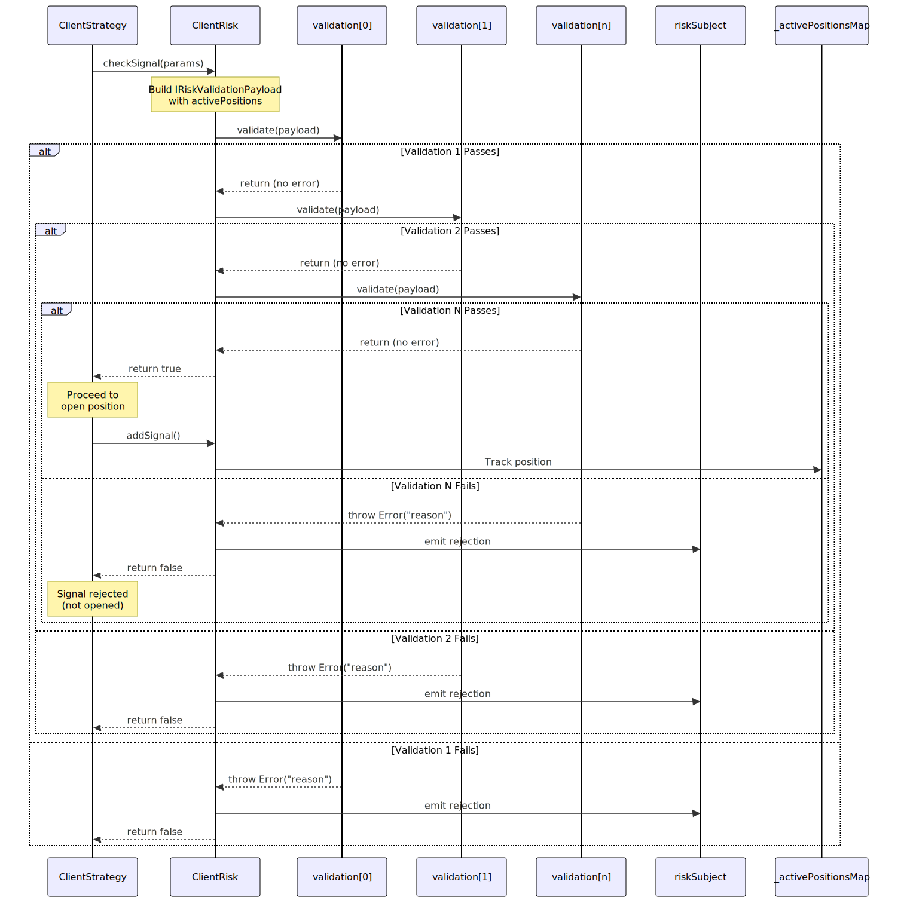

# Custom Risk Validations

Custom risk validations allow you to define portfolio-level constraints and business rules that prevent signals from opening positions when specific conditions are not met. This guide covers how to implement custom validation functions using the `IRiskValidation` interface with access to `IRiskValidationPayload`.

For risk profile configuration basics, see [Risk Profiles](./68_Risk_Profiles.md). For position tracking implementation, see [Position Tracking](./70_Position_Tracking.md). For risk validation chain execution, see [Risk Validation](./69_Risk_Validation.md).

---

## Purpose and Scope

Custom risk validations provide a declarative way to enforce trading constraints at the portfolio level before positions are opened. Each validation function receives comprehensive context including:

- The pending signal to be opened
- Current market price and timestamp
- Active positions across all strategies
- Strategy and exchange identifiers

Validations execute synchronously in the order defined and can reject signals by throwing errors. This system prevents capital deployment that violates risk limits, ensuring disciplined execution.

---

## Risk Validation Architecture



**Validation Timing**: Risk validations execute **after** signal generation but **before** position opening. This ensures that portfolio state is current and no capital is committed until all checks pass.

**Sources**: [types.d.ts:382-426](), [src/client/ClientStrategy.ts:376-387]()

---

## IRiskValidation Interface

### Core Structure

```typescript
interface IRiskValidation {
  validate: IRiskValidationFn;
  note?: string;
}

interface IRiskValidationFn {
  (payload: IRiskValidationPayload): void | Promise<void>;
}
```

The `IRiskValidation` interface has two properties:

| Property | Type | Required | Purpose |
|----------|------|----------|---------|
| `validate` | `IRiskValidationFn` | Yes | Validation logic function |
| `note` | `string` | No | Human-readable description for logging/debugging |

**Key Characteristics**:

1. **Synchronous or Async**: Validation functions can be sync or return `Promise<void>`
2. **Exception-Based**: Throw errors to reject signals; return normally to allow
3. **Sequential Execution**: Validations run in array order; first error stops the chain
4. **No Return Value**: Functions return `void` - all communication via exceptions

**Sources**: [types.d.ts:399-412]()

---

## IRiskValidationPayload Structure



### Payload Properties

#### From IRiskCheckArgs (Base Context)

| Property | Type | Description |
|----------|------|-------------|
| `symbol` | `string` | Trading pair (e.g., `"BTCUSDT"`) |
| `pendingSignal` | `ISignalDto` | Signal to be validated |
| `strategyName` | `string` | Strategy requesting position |
| `exchangeName` | `string` | Exchange identifier |
| `currentPrice` | `number` | Current VWAP price |
| `timestamp` | `number` | Unix timestamp in milliseconds |

#### Portfolio State Extensions

| Property | Type | Description |
|----------|------|-------------|
| `activePositionCount` | `number` | Total open positions across all strategies |
| `activePositions` | `IRiskActivePosition[]` | Full list of active positions with details |

#### IRiskActivePosition Structure

Each active position contains:

```typescript
interface IRiskActivePosition {
  signal: ISignalRow;          // Full signal details
  strategyName: string;        // Owning strategy
  exchangeName: string;        // Exchange used
  openTimestamp: number;       // When position opened (ms)
}
```

**Sources**: [types.d.ts:343-390](), [types.d.ts:359-369]()

---

## Validation Function Registration

### Short Form (Function Only)

```typescript
addRisk({
  riskName: "my-risk",
  validations: [
    // Direct function - no note
    ({ activePositionCount }) => {
      if (activePositionCount >= 3) {
        throw new Error("Max 3 concurrent positions");
      }
    }
  ]
});
```

### Long Form (IRiskValidation Object)

```typescript
addRisk({
  riskName: "my-risk",
  validations: [
    {
      validate: ({ activePositionCount }) => {
        if (activePositionCount >= 3) {
          throw new Error("Max 3 concurrent positions");
        }
      },
      note: "Limit portfolio to 3 concurrent positions for capital preservation"
    }
  ]
});
```

**Note Benefits**:
- Appears in rejection events via `riskSubject`
- Logged when validation fails
- Aids debugging and monitoring

**Sources**: [types.d.ts:425](), [README.md:83-100]()

---

## Common Validation Patterns

### Pattern 1: Position Count Limits

Prevent over-leveraging by limiting concurrent positions:

```typescript
{
  validate: ({ activePositionCount }) => {
    const MAX_POSITIONS = 5;
    if (activePositionCount >= MAX_POSITIONS) {
      throw new Error(`Position limit reached: ${activePositionCount}/${MAX_POSITIONS}`);
    }
  },
  note: "Enforce maximum 5 concurrent positions"
}
```

### Pattern 2: Risk/Reward Ratio Enforcement

Ensure minimum risk/reward ratio (e.g., 2:1):

```typescript
{
  validate: ({ pendingSignal, currentPrice }) => {
    const { priceOpen = currentPrice, priceTakeProfit, priceStopLoss, position } = pendingSignal;
    
    const reward = position === "long" 
      ? priceTakeProfit - priceOpen 
      : priceOpen - priceTakeProfit;
      
    const risk = position === "long"
      ? priceOpen - priceStopLoss
      : priceStopLoss - priceOpen;
    
    const ratio = reward / risk;
    
    if (ratio < 2.0) {
      throw new Error(`Poor R/R ratio: ${ratio.toFixed(2)}:1 (minimum 2:1 required)`);
    }
  },
  note: "Enforce minimum 2:1 risk/reward ratio"
}
```

**Sources**: [README.md:92-98]()

### Pattern 3: Minimum Take Profit Distance

Ensure take profit covers trading fees:

```typescript
{
  validate: ({ pendingSignal, currentPrice }) => {
    const { priceOpen = currentPrice, priceTakeProfit, position } = pendingSignal;
    
    const tpDistance = position === "long"
      ? ((priceTakeProfit - priceOpen) / priceOpen) * 100
      : ((priceOpen - priceTakeProfit) / priceOpen) * 100;
    
    const MIN_TP_PERCENT = 1.0; // 1% minimum to cover fees
    
    if (tpDistance < MIN_TP_PERCENT) {
      throw new Error(`TP too close: ${tpDistance.toFixed(2)}% (minimum ${MIN_TP_PERCENT}%)`);
    }
  },
  note: "Ensure TP distance covers trading fees (1% minimum)"
}
```

**Sources**: [README.md:87-91]()

### Pattern 4: Symbol-Specific Position Limits

Limit exposure per trading pair:

```typescript
{
  validate: ({ symbol, activePositions }) => {
    const MAX_PER_SYMBOL = 2;
    const symbolCount = activePositions.filter(p => p.signal.symbol === symbol).length;
    
    if (symbolCount >= MAX_PER_SYMBOL) {
      throw new Error(`Max ${MAX_PER_SYMBOL} positions per symbol (${symbol} has ${symbolCount})`);
    }
  },
  note: "Limit to 2 concurrent positions per trading pair"
}
```

### Pattern 5: Strategy Diversification

Prevent single strategy from dominating portfolio:

```typescript
{
  validate: ({ strategyName, activePositions, activePositionCount }) => {
    if (activePositionCount === 0) return; // Allow first position
    
    const strategyCount = activePositions.filter(p => p.strategyName === strategyName).length;
    const strategyPercent = (strategyCount / activePositionCount) * 100;
    
    const MAX_STRATEGY_PERCENT = 40; // 40% max per strategy
    
    if (strategyPercent >= MAX_STRATEGY_PERCENT) {
      throw new Error(`Strategy ${strategyName} over-exposed: ${strategyPercent.toFixed(0)}% (max ${MAX_STRATEGY_PERCENT}%)`);
    }
  },
  note: "Prevent single strategy from exceeding 40% of portfolio"
}
```

### Pattern 6: Position Direction Hedging

Allow or forbid opposing positions on same symbol:

```typescript
{
  validate: ({ symbol, pendingSignal, activePositions }) => {
    const existingPosition = activePositions.find(p => p.signal.symbol === symbol);
    
    if (existingPosition && existingPosition.signal.position !== pendingSignal.position) {
      throw new Error(`Cannot open ${pendingSignal.position} on ${symbol} - existing ${existingPosition.signal.position} position conflicts`);
    }
  },
  note: "Prevent opposing positions on same symbol (no hedging)"
}
```

**Sources**: Derived from [types.d.ts:382-390]()

---

## Validation Execution Sequence



**Execution Rules**:

1. **Sequential Processing**: Validations run in array order (index 0 → n)
2. **Short-Circuit on Failure**: First error stops execution; remaining validations skip
3. **All-or-Nothing**: All validations must pass for signal to proceed
4. **Error Capture**: Thrown errors are caught and converted to rejection events
5. **Async Support**: Async validations are `await`ed before proceeding

**Sources**: [src/client/ClientStrategy.ts:376-387]()

---

## Error Handling and Rejection Events

### Throwing Errors

Validation functions communicate rejection by throwing errors:

```typescript
{
  validate: ({ activePositionCount }) => {
    if (activePositionCount >= 10) {
      // Error message appears in logs and rejection events
      throw new Error("Portfolio limit: 10 concurrent positions maximum");
    }
    // No throw = validation passes
  }
}
```

**Error Message Best Practices**:
- Include the rejected value (e.g., `"activePositionCount=11"`)
- State the limit or threshold (e.g., `"maximum 10"`)
- Be specific about the rule violated
- Use consistent formatting for parsing

### Listening to Rejection Events

Subscribe to `riskSubject` to monitor rejected signals:

```typescript
import { listenRisk } from "backtest-kit";

listenRisk((event) => {
  console.log(`[RISK REJECTED] ${event.symbol}`);
  console.log(`Strategy: ${event.strategyName}`);
  console.log(`Position: ${event.pendingSignal.position}`);
  console.log(`Active positions: ${event.activePositionCount}`);
  console.log(`Reason: ${event.comment}`); // From validation note or "N/A"
  console.log(`Price: ${event.currentPrice}`);
});
```

**RiskContract Structure**:

| Property | Type | Description |
|----------|------|-------------|
| `symbol` | `string` | Trading pair |
| `strategyName` | `string` | Strategy that generated signal |
| `exchangeName` | `string` | Exchange identifier |
| `pendingSignal` | `ISignalDto` | Rejected signal details |
| `currentPrice` | `number` | VWAP at rejection time |
| `activePositionCount` | `number` | Position count at rejection |
| `comment` | `string` | Validation note or error message |
| `timestamp` | `number` | Rejection timestamp (ms) |

**Sources**: [src/function/event.ts:896-927](), [types.d.ts:446-447]()

---

## Async Validations

Validations can be async for external lookups:

```typescript
{
  validate: async ({ symbol, pendingSignal }) => {
    // Example: Check external API for symbol volatility
    const volatility = await fetch(`https://api.example.com/volatility/${symbol}`)
      .then(r => r.json())
      .then(d => d.volatility);
    
    const MAX_VOLATILITY = 0.05; // 5%
    
    if (volatility > MAX_VOLATILITY) {
      throw new Error(`High volatility: ${(volatility * 100).toFixed(2)}% (max ${(MAX_VOLATILITY * 100).toFixed(2)}%)`);
    }
  },
  note: "Block signals during high volatility periods"
}
```

**Async Considerations**:
- Validations are `await`ed sequentially
- High latency can delay signal processing
- Consider caching external data to reduce API calls
- Timeout long-running validations to prevent hangs

**Sources**: [types.d.ts:396]()

---

## Integration with Position Lifecycle



**Lifecycle Integration Points**:

1. **Pre-Opening Validation**: Validations run **before** `addSignal()` - rejected signals never enter `_activePositionsMap`
2. **Position Tracking**: Passing signals are added to `_activePositionsMap` and persisted atomically
3. **Monitoring Phase**: Active positions count toward `activePositionCount` in future validations
4. **Position Closure**: Closed positions are removed from `_activePositionsMap` via `removeSignal()`
5. **Crash Recovery**: Persisted positions restore `_activePositionsMap` on restart

**Sources**: [src/client/ClientStrategy.ts:376-387](), [src/client/ClientStrategy.ts:742-745]()

---

## Testing Custom Validations

### Unit Testing Validation Logic

Test validation functions in isolation:

```typescript
import { test } from "worker-testbed";

const myValidation = {
  validate: ({ activePositionCount }) => {
    if (activePositionCount >= 3) {
      throw new Error("Max 3 positions");
    }
  },
  note: "Position limit test"
};

test("Validation rejects when limit reached", async ({ pass, fail }) => {
  const payload = {
    symbol: "BTCUSDT",
    pendingSignal: {
      position: "long",
      priceTakeProfit: 42000,
      priceStopLoss: 40000,
      minuteEstimatedTime: 60
    },
    strategyName: "test-strategy",
    exchangeName: "test-exchange",
    currentPrice: 41000,
    timestamp: Date.now(),
    activePositionCount: 3, // At limit
    activePositions: []
  };
  
  try {
    await myValidation.validate(payload);
    fail("Should have thrown error");
  } catch (error) {
    if (error.message.includes("Max 3 positions")) {
      pass("Validation rejected correctly");
    } else {
      fail(`Unexpected error: ${error.message}`);
    }
  }
});
```

### Integration Testing with Backtest

Test validations with full backtest execution:

```typescript
import { addRisk, addStrategy, addExchange, addFrame, Backtest, listenRisk } from "backtest-kit";
import { Subject } from "functools-kit";

test("Risk validation blocks signal in backtest", async ({ pass, fail }) => {
  let rejectionCount = 0;
  
  addRisk({
    riskName: "test-risk",
    validations: [
      {
        validate: ({ currentPrice, pendingSignal }) => {
          // Reject signals below 42000
          if (currentPrice < 42000) {
            throw new Error(`Price too low: ${currentPrice}`);
          }
        },
        note: "Min price validation"
      }
    ]
  });
  
  addStrategy({
    strategyName: "test-strategy",
    interval: "1m",
    riskName: "test-risk",
    getSignal: async () => ({
      position: "long",
      priceTakeProfit: 43000,
      priceStopLoss: 40000,
      minuteEstimatedTime: 60
    })
  });
  
  // ... add exchange and frame ...
  
  const awaitSubject = new Subject();
  
  listenRisk((event) => {
    rejectionCount++;
    if (event.comment.includes("Min price validation")) {
      awaitSubject.next();
    }
  });
  
  Backtest.background("BTCUSDT", {
    strategyName: "test-strategy",
    exchangeName: "test-exchange",
    frameName: "test-frame"
  });
  
  await awaitSubject.toPromise();
  
  if (rejectionCount > 0) {
    pass(`Validation rejected ${rejectionCount} signals`);
  } else {
    fail("No rejections detected");
  }
});
```

**Sources**: [test/e2e/defend.test.mjs:543-642]()

---

## Advanced Validation Examples

### Time-Based Trading Windows

Restrict trading to specific hours:

```typescript
{
  validate: ({ timestamp }) => {
    const date = new Date(timestamp);
    const hour = date.getUTCHours();
    
    const MARKET_OPEN = 9;  // 09:00 UTC
    const MARKET_CLOSE = 16; // 16:00 UTC
    
    if (hour < MARKET_OPEN || hour >= MARKET_CLOSE) {
      throw new Error(`Outside trading hours: ${hour}:00 UTC (${MARKET_OPEN}:00-${MARKET_CLOSE}:00 only)`);
    }
  },
  note: "Restrict trading to 09:00-16:00 UTC"
}
```

### Correlation-Based Position Limits

Prevent correlated positions:

```typescript
{
  validate: ({ symbol, activePositions }) => {
    // Define correlated pairs
    const correlations = {
      "BTCUSDT": ["ETHUSDT", "BNBUSDT"],
      "ETHUSDT": ["BTCUSDT", "MATICUSDT"],
      // ... more correlations
    };
    
    const correlated = correlations[symbol] || [];
    const hasCorrelatedPosition = activePositions.some(p => 
      correlated.includes(p.signal.symbol)
    );
    
    if (hasCorrelatedPosition) {
      throw new Error(`Correlated position exists - cannot open ${symbol}`);
    }
  },
  note: "Prevent correlated positions for diversification"
}
```

### Dynamic Stop Loss Validation

Enforce stricter stop loss during high volatility:

```typescript
{
  validate: ({ pendingSignal, currentPrice, activePositions }) => {
    const { priceOpen = currentPrice, priceStopLoss, position } = pendingSignal;
    
    // Calculate average position size to estimate volatility
    const avgPositionTime = activePositions.length > 0
      ? activePositions.reduce((sum, p) => sum + (Date.now() - p.openTimestamp), 0) / activePositions.length
      : 0;
    
    const avgMinutes = avgPositionTime / 60000;
    const isHighVolatility = avgMinutes < 30; // Positions closing fast = high volatility
    
    const slDistance = position === "long"
      ? ((priceOpen - priceStopLoss) / priceOpen) * 100
      : ((priceStopLoss - priceOpen) / priceOpen) * 100;
    
    const maxSL = isHighVolatility ? 2.0 : 5.0; // Tighter SL during volatility
    
    if (slDistance > maxSL) {
      throw new Error(`SL too wide: ${slDistance.toFixed(2)}% (max ${maxSL}% in ${isHighVolatility ? 'high' : 'normal'} volatility)`);
    }
  },
  note: "Enforce tighter stop loss during high volatility"
}
```

### Cross-Strategy Position Balance

Ensure no single strategy dominates:

```typescript
{
  validate: ({ strategyName, activePositions, activePositionCount }) => {
    if (activePositionCount < 3) return; // Allow until 3 positions
    
    const strategyPositions = activePositions.filter(p => p.strategyName === strategyName);
    const newCount = strategyPositions.length + 1; // Including this signal
    
    const newPercent = (newCount / (activePositionCount + 1)) * 100;
    const MAX_PERCENT = 50;
    
    if (newPercent > MAX_PERCENT) {
      throw new Error(`Strategy ${strategyName} would be ${newPercent.toFixed(0)}% of portfolio (max ${MAX_PERCENT}%)`);
    }
  },
  note: "No strategy exceeds 50% of portfolio"
}
```

**Sources**: Derived from [types.d.ts:382-390]()

---

## Multi-Risk Profile Pattern

Strategies can use multiple risk profiles by specifying `riskList`:

```typescript
addRisk({
  riskName: "position-limit",
  validations: [
    ({ activePositionCount }) => {
      if (activePositionCount >= 5) {
        throw new Error("Portfolio limit: 5 positions");
      }
    }
  ]
});

addRisk({
  riskName: "risk-reward",
  validations: [
    ({ pendingSignal, currentPrice }) => {
      const { priceOpen = currentPrice, priceTakeProfit, priceStopLoss, position } = pendingSignal;
      const reward = position === "long" ? priceTakeProfit - priceOpen : priceOpen - priceTakeProfit;
      const risk = position === "long" ? priceOpen - priceStopLoss : priceStopLoss - priceOpen;
      
      if (reward / risk < 2) {
        throw new Error("Minimum 2:1 R/R required");
      }
    }
  ]
});

addStrategy({
  strategyName: "my-strategy",
  interval: "5m",
  riskList: ["position-limit", "risk-reward"], // Both applied
  getSignal: async (symbol, when) => {
    // ... signal generation ...
  }
});
```

**Execution Order**: All risk profiles in `riskList` are applied sequentially. Signal must pass **all** validations from **all** risk profiles.

**Sources**: [types.d.ts:150]()

---

## Performance Considerations

### Validation Execution Cost

Validations execute on **every** signal generation attempt:

```typescript
// BAD: Expensive operation on every validation
{
  validate: async ({ symbol }) => {
    // This queries database on EVERY signal check!
    const marketData = await database.query(`SELECT * FROM market_data WHERE symbol = ?`, [symbol]);
    // ... validation logic ...
  }
}

// GOOD: Cache expensive data
const marketDataCache = new Map();

{
  validate: async ({ symbol }) => {
    if (!marketDataCache.has(symbol)) {
      const data = await database.query(`SELECT * FROM market_data WHERE symbol = ?`, [symbol]);
      marketDataCache.set(symbol, data);
      setTimeout(() => marketDataCache.delete(symbol), 60000); // 1min TTL
    }
    
    const marketData = marketDataCache.get(symbol);
    // ... validation logic ...
  }
}
```

### Validation Ordering

Order validations from cheapest to most expensive:

```typescript
validations: [
  // Fast: Simple numeric comparison
  ({ activePositionCount }) => {
    if (activePositionCount >= 10) throw new Error("Position limit");
  },
  
  // Medium: Array iteration
  ({ symbol, activePositions }) => {
    const count = activePositions.filter(p => p.signal.symbol === symbol).length;
    if (count >= 2) throw new Error("Symbol limit");
  },
  
  // Expensive: Async API call (runs only if previous checks pass)
  async ({ symbol }) => {
    const data = await externalAPI.check(symbol);
    if (!data.allowed) throw new Error("External validation failed");
  }
]
```

**Rationale**: Short-circuit on failure stops execution early, avoiding expensive operations for signals that would fail cheap checks.

---

## Validation State and Memoization

`ClientRisk` instances are memoized per risk profile and execution context:

```typescript
// Internal: StrategyConnectionService
const getStrategy = memoize((symbol: string, strategyName: string, backtest: boolean) => {
  // Single ClientStrategy instance per (symbol, strategyName, backtest) tuple
  return new ClientStrategy({...});
});

// Internal: RiskConnectionService  
const getRisk = memoize((riskName: string, backtest: boolean) => {
  // Single ClientRisk instance per (riskName, backtest) tuple
  return new ClientRisk({...});
});
```

**Implications**:
- Risk profile validations are **shared** across all strategies using that risk profile
- `_activePositionsMap` is **shared** across strategies in same risk profile
- Backtest and Live modes have **separate** `ClientRisk` instances (different `backtest` flag)

**Sources**: Inferred from memoization patterns in codebase

---

## Debugging Validation Failures

### Enable Validation Logging

Listen to `validationSubject` for raw validation errors:

```typescript
import { listenValidation } from "backtest-kit";

listenValidation((error) => {
  console.error("[VALIDATION ERROR]", error.message);
  console.error(error.stack);
});
```

### Inspect Rejection Context

Use `listenRisk` to see full rejection context:

```typescript
import { listenRisk } from "backtest-kit";

listenRisk((event) => {
  console.log("=== RISK REJECTION ===");
  console.log("Symbol:", event.symbol);
  console.log("Strategy:", event.strategyName);
  console.log("Position:", event.pendingSignal.position);
  console.log("Current Price:", event.currentPrice);
  console.log("Active Positions:", event.activePositionCount);
  console.log("Reason:", event.comment);
  console.log("Timestamp:", new Date(event.timestamp).toISOString());
  console.log("======================");
});
```

### Add Diagnostic Notes

Include rich error messages with context:

```typescript
{
  validate: ({ pendingSignal, currentPrice, activePositionCount }) => {
    if (activePositionCount >= 5) {
      throw new Error(
        `Position limit exceeded:\n` +
        `  Active: ${activePositionCount}\n` +
        `  Limit: 5\n` +
        `  Signal: ${pendingSignal.position} on ${pendingSignal.symbol}\n` +
        `  Price: ${currentPrice}`
      );
    }
  },
  note: "Portfolio position limit (5 max)"
}
```

**Sources**: [src/function/event.ts:733-760](), [src/function/event.ts:896-927]()

---

## Validation vs Callbacks

**Risk Validations** and **Strategy Callbacks** serve different purposes:

| Aspect | Risk Validations | Strategy Callbacks |
|--------|------------------|-------------------|
| **Purpose** | Gate-keep signal opening | React to lifecycle events |
| **Timing** | **Before** position opens | **After** state changes |
| **Control** | Can **block** signals (throw) | Cannot block (informational) |
| **Scope** | Portfolio-level (cross-strategy) | Strategy-level (single strategy) |
| **Return** | `void` or `throw` | `void` (no effect on flow) |
| **Examples** | Position limits, R/R checks | Logging, notifications, analytics |

**When to Use**:
- **Validations**: Enforce business rules that prevent unsafe trades
- **Callbacks**: Observe and react to events without affecting execution

**Sources**: [types.d.ts:100-126](), [types.d.ts:399-412]()

---

## Sources

This document was informed by the following source files:

- [types.d.ts:343-426]() - Core risk interfaces (`IRiskCheckArgs`, `IRiskValidationPayload`, `IRiskValidation`, `IRiskSchema`)
- [README.md:83-100]() - Basic risk validation examples
- [src/client/ClientStrategy.ts:376-387]() - Risk validation integration in strategy execution
- [src/function/event.ts:896-927]() - Risk rejection event handling (`listenRisk`, `listenRiskOnce`)
- [test/e2e/defend.test.mjs]() - Comprehensive validation test cases and edge cases
- [src/config/emitters.ts:127-131]() - `riskSubject` emitter definition