# Optimizer Architecture

## Purpose and Scope

This page documents the architecture of the Optimizer system, which generates AI-powered trading strategies through LLM integration. It covers the core components (`ClientOptimizer`, `OptimizerConnectionService`, `OptimizerTemplateService`), their relationships, the template merging pattern, and the execution flow of the three main operations: `getData`, `getCode`, and `dump`.

For details on data collection and pagination, see [Data Collection Pipeline](#16.5.2). For LLM integration specifics, see [LLM Integration](#16.5.3). For code generation details, see [Strategy Code Generation](#16.5.4). For training/testing range configuration, see [Training vs Testing Ranges](#16.5.5).

## Component Overview

The Optimizer system consists of four primary components organized in a layered architecture:

```mermaid
graph TB
    User["User Code"]
    
    subgraph "Public API Layer"
        OptimizerAPI["Optimizer.getData()<br/>Optimizer.getCode()<br/>Optimizer.dump()"]
    end
    
    subgraph "Service Layer"
        OptimizerConnectionService["OptimizerConnectionService<br/>getOptimizer() [memoized]<br/>getData()<br/>getCode()<br/>dump()"]
        OptimizerSchemaService["OptimizerSchemaService<br/>Registry: optimizerName → IOptimizerSchema"]
        OptimizerTemplateService["OptimizerTemplateService<br/>11 default template methods"]
    end
    
    subgraph "Client Layer"
        ClientOptimizer["ClientOptimizer<br/>IOptimizerParams<br/>getData()<br/>getCode()<br/>dump()"]
    end
    
    subgraph "Internal Functions"
        GET_STRATEGY_DATA_FN["GET_STRATEGY_DATA_FN<br/>Data collection + LLM conversation"]
        GET_STRATEGY_CODE_FN["GET_STRATEGY_CODE_FN<br/>11-section code assembly"]
        GET_STRATEGY_DUMP_FN["GET_STRATEGY_DUMP_FN<br/>File system write"]
        RESOLVE_PAGINATION_FN["RESOLVE_PAGINATION_FN<br/>Pagination handler"]
    end
    
    User -->|"addOptimizer()"| OptimizerSchemaService
    User -->|"Optimizer.getData/getCode/dump"| OptimizerAPI
    
    OptimizerAPI --> OptimizerConnectionService
    
    OptimizerConnectionService -->|"retrieves schema"| OptimizerSchemaService
    OptimizerConnectionService -->|"retrieves defaults"| OptimizerTemplateService
    OptimizerConnectionService -->|"creates/caches"| ClientOptimizer
    
    ClientOptimizer --> GET_STRATEGY_DATA_FN
    ClientOptimizer --> GET_STRATEGY_CODE_FN
    ClientOptimizer --> GET_STRATEGY_DUMP_FN
    
    GET_STRATEGY_DATA_FN --> RESOLVE_PAGINATION_FN
    GET_STRATEGY_CODE_FN --> GET_STRATEGY_DATA_FN
    GET_STRATEGY_DUMP_FN --> GET_STRATEGY_CODE_FN
```



**Sources:** [src/client/ClientOptimizer.ts:1-448](), [src/lib/services/connection/OptimizerConnectionService.ts:1-175](), [src/lib/services/template/OptimizerTemplateService.ts:1-710]()

## Core Components

### ClientOptimizer

`ClientOptimizer` is the main client class that performs optimizer operations. It accepts `IOptimizerParams` (which extends `IOptimizerSchema` with logger and complete template) and an `onProgress` callback for progress emission.

**Constructor Parameters:**
- `params: IOptimizerParams` - Configuration with resolved dependencies
- `onProgress: (progress: ProgressOptimizerContract) => void` - Progress event emitter

**Public Methods:**

| Method | Parameters | Return Type | Description |
|--------|-----------|-------------|-------------|
| `getData` | `symbol: string` | `Promise<IOptimizerStrategy[]>` | Fetches data from all sources and generates strategy metadata |
| `getCode` | `symbol: string` | `Promise<string>` | Generates complete executable strategy code |
| `dump` | `symbol: string, path?: string` | `Promise<void>` | Generates and saves strategy code to file |

**Key Implementation Details:**

The class delegates to three internal functions for its operations:
- `GET_STRATEGY_DATA_FN` - Handles data collection and LLM conversation building [src/client/ClientOptimizer.ts:99-215]()
- `GET_STRATEGY_CODE_FN` - Handles code assembly from templates [src/client/ClientOptimizer.ts:225-350]()
- `GET_STRATEGY_DUMP_FN` - Handles file system operations [src/client/ClientOptimizer.ts:360-384]()

**Sources:** [src/client/ClientOptimizer.ts:397-447](), [src/interfaces/Optimizer.interface.ts:436-451]()

### OptimizerConnectionService

`OptimizerConnectionService` serves as the service layer between the public API and `ClientOptimizer`. It handles dependency injection, template merging, and instance caching.

**Injected Dependencies:**
- `LoggerService` - For debug and info logging
- `OptimizerSchemaService` - For retrieving registered optimizer schemas
- `OptimizerTemplateService` - For default template implementations

**Key Method: `getOptimizer`**

The `getOptimizer` method is memoized by `optimizerName` to ensure only one `ClientOptimizer` instance exists per optimizer configuration:

```typescript
public getOptimizer = memoize(
  ([optimizerName]) => `${optimizerName}`,
  (optimizerName: OptimizerName) => {
    // Retrieve schema and merge templates
    // Return new ClientOptimizer instance
  }
);
```

This method performs three critical operations:
1. Retrieves the schema from `OptimizerSchemaService` [src/lib/services/connection/OptimizerConnectionService.ts:62-69]()
2. Merges custom templates with defaults from `OptimizerTemplateService` [src/lib/services/connection/OptimizerConnectionService.ts:72-97]()
3. Instantiates `ClientOptimizer` with resolved dependencies [src/lib/services/connection/OptimizerConnectionService.ts:99-112]()

**Delegation Methods:**

The service exposes three methods that delegate to the cached `ClientOptimizer` instance:

| Method | Delegates To | Description |
|--------|--------------|-------------|
| `getData(symbol, optimizerName)` | `optimizer.getData(symbol)` | Returns strategy metadata |
| `getCode(symbol, optimizerName)` | `optimizer.getCode(symbol)` | Returns generated code |
| `dump(symbol, optimizerName, path?)` | `optimizer.dump(symbol, path)` | Saves code to file |

**Sources:** [src/lib/services/connection/OptimizerConnectionService.ts:41-174]()

### OptimizerTemplateService

`OptimizerTemplateService` implements the `IOptimizerTemplate` interface, providing default code generation templates for all 11 required methods:

**Template Methods:**

| Method | Return Type | Purpose |
|--------|-------------|---------|
| `getTopBanner` | `string` | Imports and constants (shebang, ollama, ccxt, backtest-kit) |
| `getUserMessage` | `string` | Default user message format for LLM conversations |
| `getAssistantMessage` | `string` | Default assistant acknowledgment message |
| `getWalkerTemplate` | `string` | `addWalker()` configuration code |
| `getStrategyTemplate` | `string` | `addStrategy()` with `getSignal()` function and LLM integration |
| `getExchangeTemplate` | `string` | `addExchange()` with CCXT Binance integration |
| `getFrameTemplate` | `string` | `addFrame()` timeframe configuration |
| `getLauncherTemplate` | `string` | `Walker.background()` with event listeners |
| `getTextTemplate` | `string` | `text()` helper for LLM text generation |
| `getJsonTemplate` | `string` | `json()` helper for structured signal output |
| `getJsonDumpTemplate` | `string` | `dumpJson()` helper for debug logging |

All methods accept relevant parameters (symbol, name, dates, etc.) and return generated code as strings. The service uses escape functions to prevent code injection from user-provided values.

**Sources:** [src/lib/services/template/OptimizerTemplateService.ts:26-709](), [src/interfaces/Optimizer.interface.ts:242-374]()

### OptimizerSchemaService

`OptimizerSchemaService` is a standard schema service that maintains a registry mapping `optimizerName` to `IOptimizerSchema`. It follows the same pattern as other schema services in the codebase (`StrategySchemaService`, `ExchangeSchemaService`, etc.).

For schema service architecture details, see [Schema Services](#7.3).

## Template Merging Pattern

The template merging pattern allows users to override specific template methods while falling back to defaults for unspecified methods. This provides flexibility without requiring complete reimplementation.


**Implementation Example:**

[src/lib/services/connection/OptimizerConnectionService.ts:62-97]()

```typescript
const {
  getPrompt,
  rangeTest,
  rangeTrain,
  source,
  template: rawTemplate = {},  // Partial user overrides
  callbacks,
} = this.optimizerSchemaService.get(optimizerName);

// Merge with defaults
const {
  getAssistantMessage = this.optimizerTemplateService.getAssistantMessage,
  getExchangeTemplate = this.optimizerTemplateService.getExchangeTemplate,
  // ... 9 more methods
} = rawTemplate;

const template: IOptimizerTemplate = {
  getAssistantMessage,
  getExchangeTemplate,
  // ... complete object with all 11 methods
};
```

This pattern ensures:
1. Users only specify overrides for methods they want to customize
2. All methods are guaranteed to have implementations
3. Type safety is maintained through `IOptimizerTemplate` interface
4. No runtime errors from missing template methods

**Sources:** [src/lib/services/connection/OptimizerConnectionService.ts:59-113](), [src/interfaces/Optimizer.interface.ts:426-427]()

## Execution Flow

### getData Method Flow

The `getData` method collects data from all configured sources and builds LLM conversation histories for strategy generation.


**Key Steps:**

1. **Progress Initialization**: Calculate `totalSources = rangeTrain.length * source.length` [src/client/ClientOptimizer.ts:101-102]()
2. **Range Iteration**: For each training range, create a fresh `messageList` [src/client/ClientOptimizer.ts:104-105]()
3. **Source Processing**: For each source, emit progress, paginate data, format messages [src/client/ClientOptimizer.ts:107-186]()
4. **Pagination**: Use `iterateDocuments` from `functools-kit` with `distinctDocuments` for deduplication [src/client/ClientOptimizer.ts:70-88]()
5. **Message Formatting**: Call user/assistant formatters, append to conversation history [src/client/ClientOptimizer.ts:132-145]()
6. **Strategy Generation**: Call `getPrompt()` with complete message history [src/client/ClientOptimizer.ts:196]()
7. **Callback Execution**: Invoke `onData` callback if provided [src/client/ClientOptimizer.ts:210-212]()

**Sources:** [src/client/ClientOptimizer.ts:99-215](), [src/client/ClientOptimizer.ts:410-415]()

### getCode Method Flow

The `getCode` method assembles executable strategy code from 11 template sections in a specific order.


**Section Assembly Order:**

The code generation follows a strict 11-section sequence defined in [src/client/ClientOptimizer.ts:225-350]():

| Section | Lines | Template Method | Output |
|---------|-------|-----------------|--------|
| 1 | 233-236 | `getTopBanner` | Shebang, imports (ollama, ccxt, backtest-kit), WARN_KB constant |
| 2 | 239-242 | `getJsonDumpTemplate` | `dumpJson(resultId, history, result)` debug function |
| 3 | 245-248 | `getTextTemplate` | `text(messages)` LLM text helper with deepseek-v3.1 |
| 4 | 250-253 | `getJsonTemplate` | `json(messages)` LLM structured output helper |
| 5 | 256-264 | `getExchangeTemplate` | `addExchange()` with CCXT Binance |
| 6 | 267-282 | `getFrameTemplate` (loop) | `addFrame()` for each training range |
| 7 | 285-297 | `getFrameTemplate` | `addFrame()` for testing range |
| 8 | 300-314 | `getStrategyTemplate` (loop) | `addStrategy()` for each generated strategy |
| 9 | 317-332 | `getWalkerTemplate` | `addWalker()` configuration |
| 10 | 335-341 | `getLauncherTemplate` | `Walker.background()` + event listeners |
| 11 | - | - | Final join with newlines |

**Naming Convention:**

Generated code uses a random prefix to avoid naming collisions:
- Exchange: `{prefix}_exchange`
- Training frames: `{prefix}_train_frame-1`, `{prefix}_train_frame-2`, ...
- Test frame: `{prefix}_test_frame`
- Strategies: `{prefix}_strategy-1`, `{prefix}_strategy-2`, ...
- Walker: `{prefix}_walker`

The prefix is generated via `CREATE_PREFIX_FN()` using base36 encoding [src/client/ClientOptimizer.ts:22]().

**Sources:** [src/client/ClientOptimizer.ts:225-350](), [src/client/ClientOptimizer.ts:424-429]()

### dump Method Flow

The `dump` method saves generated code to the file system with error handling and callbacks.


**File Path Construction:**

The dump method constructs file paths using the following pattern [src/client/ClientOptimizer.ts:367-373]():
```typescript
const dir = join(process.cwd(), path);
await mkdir(dir, { recursive: true });

const filename = `${self.params.optimizerName}_${symbol}.mjs`;
const filepath = join(dir, filename);
```

**Example Output:** If `optimizerName = "trend_analyzer"` and `symbol = "BTCUSDT"`, with `path = "./strategies"`, the file would be saved to:
```
{cwd}/strategies/trend_analyzer_BTCUSDT.mjs
```

**Error Handling:**

The dump operation includes comprehensive error handling:
1. Directory creation with `recursive: true` flag (creates parent directories if needed)
2. Try-catch wrapper around file write operation
3. Logger warning on failure with error details
4. Error re-throw to allow upstream handling

**Callbacks:**

The dump method supports an optional `onDump` callback that executes after successful file write [src/client/ClientOptimizer.ts:377-379]():
```typescript
if (self.params.callbacks?.onDump) {
  await self.params.callbacks.onDump(symbol, filepath);
}
```

This enables custom post-processing such as:
- Notification systems
- File permission adjustment
- Git commit automation
- Remote file upload

**Sources:** [src/client/ClientOptimizer.ts:360-384](), [src/client/ClientOptimizer.ts:438-444]()

## Dependency Injection and Service Registration

The Optimizer system integrates with the broader dependency injection architecture through standard TYPES symbols and service registration.

**TYPES Symbols:**

The following symbols identify Optimizer-related services in the dependency injection container:
- `TYPES.optimizerSchemaService` - Schema registry service
- `TYPES.optimizerConnectionService` - Connection service with memoized client instances
- `TYPES.optimizerTemplateService` - Default template implementation

**Service Composition:**


The Optimizer services follow the same dependency injection pattern as other framework components. For comprehensive coverage of the DI system, see [Dependency Injection System](#3.2).

**Sources:** [src/lib/services/connection/OptimizerConnectionService.ts:42-48](), [src/lib/services/template/OptimizerTemplateService.ts:27]()