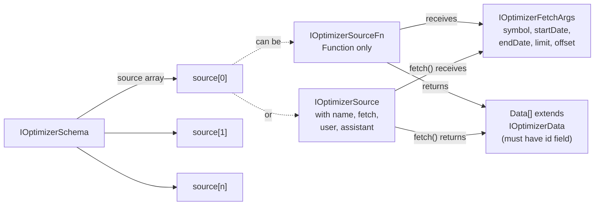
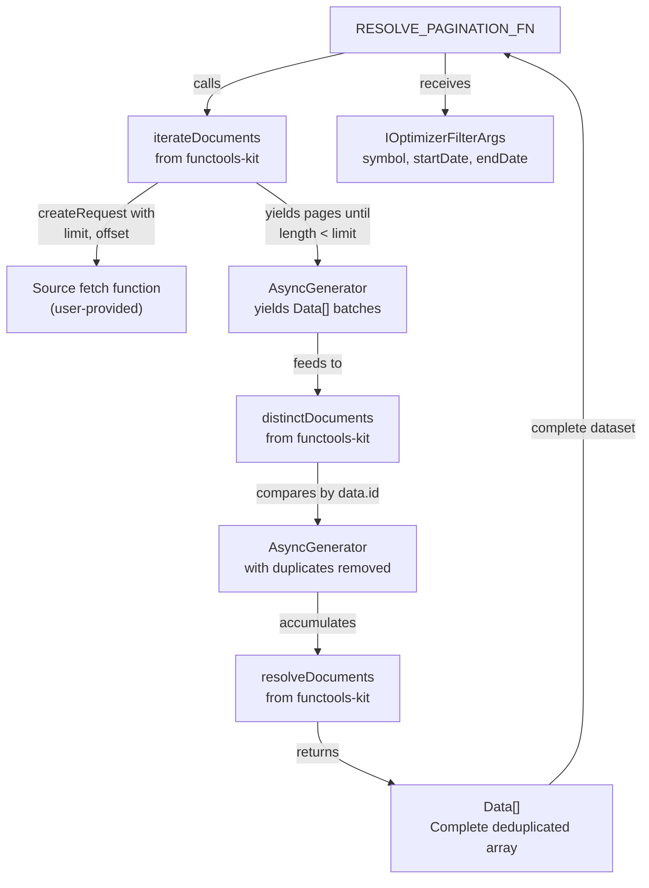
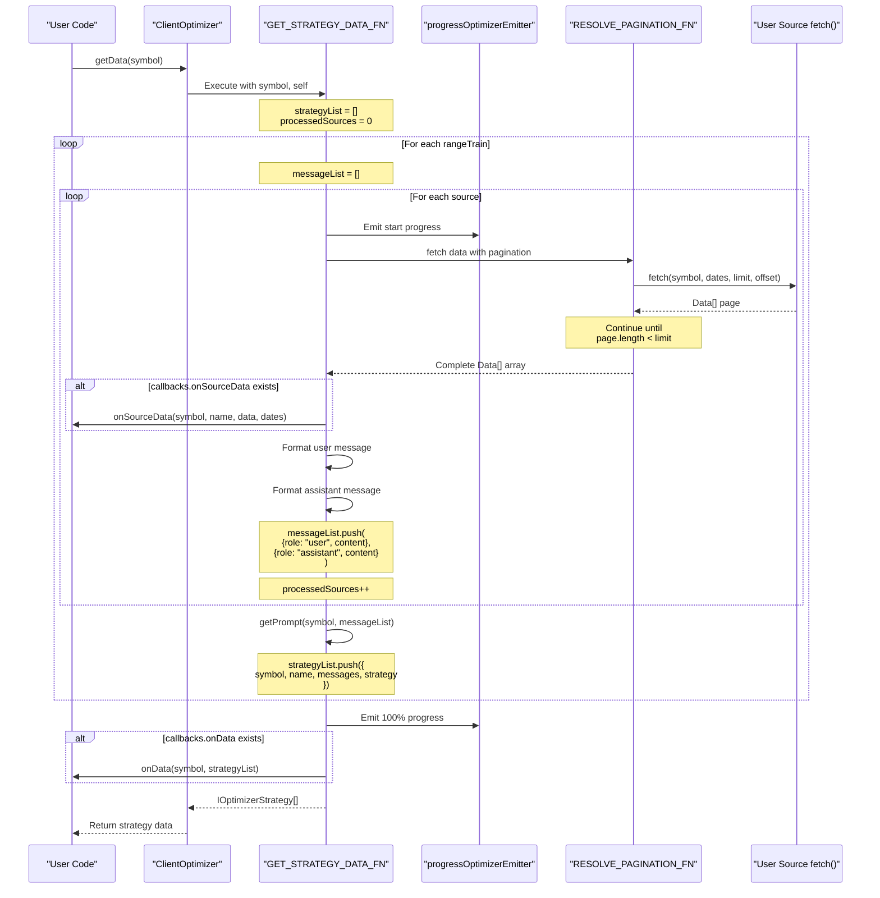
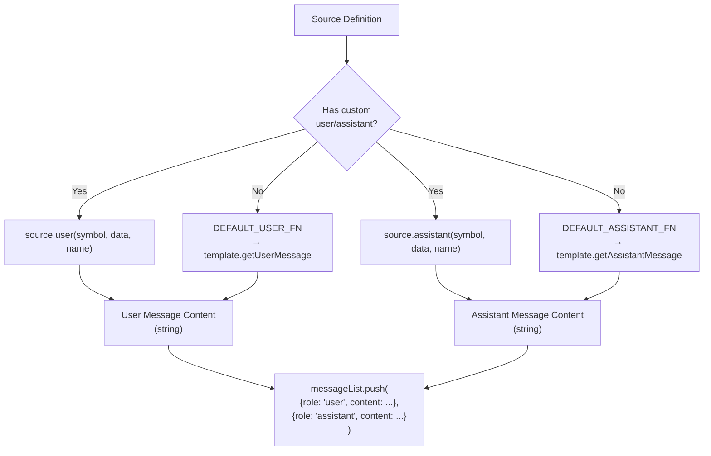
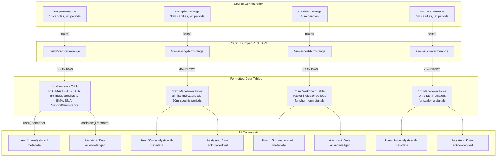
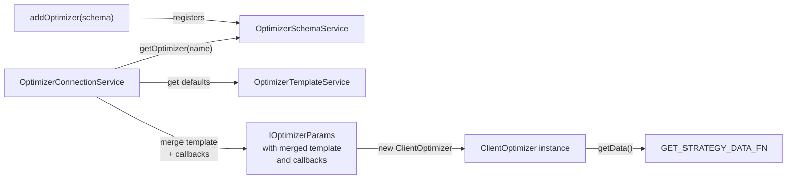

# Data Collection Pipeline

## Purpose and Scope

This document describes the data collection phase of the AI-powered optimizer, where historical trading data is fetched from external sources, paginated, formatted into LLM conversation messages, and accumulated across multiple training ranges. For information about the overall optimizer architecture and how components connect, see [Optimizer Architecture](#16.5.1). For details on how the collected data is sent to the LLM after collection, see [LLM Integration](#16.5.3).

The data collection pipeline is implemented primarily in `ClientOptimizer.getData()` and processes sources sequentially for each training date range, building up a conversation history that provides market context for strategy generation.

## Source Configuration

### Source Type Definitions

The optimizer supports two types of data source configurations, both defined in the `IOptimizerSchema.source` array:

**Simple Function Source**

A function implementing `IOptimizerSourceFn` that accepts pagination parameters and returns data:

```typescript
type SimpleSoure = (args: IOptimizerFetchArgs) => Data[] | Promise<Data[]>
```

This form uses default message formatters from `OptimizerTemplateService`.

**Full Configuration Source**

An object implementing `IOptimizerSource` with custom message formatters:

```typescript
interface IOptimizerSource {
  name: string;
  fetch: IOptimizerSourceFn;
  user?: (symbol, data, name) => string | Promise<string>;
  assistant?: (symbol, data, name) => string | Promise<string>;
}
```

This form allows customization of how data is presented to the LLM.

Sources: [src/interfaces/Optimizer.interface.ts:129-177](), [src/interfaces/Optimizer.interface.ts:92-94]()

### Data Source Interface Requirements

All data returned from sources must implement `IOptimizerData` with a unique `id` field:

```typescript
interface IOptimizerData {
  id: string | number;
}
```

The `id` field enables deduplication when paginating through large datasets. Without unique IDs, the same records could be processed multiple times.



**Diagram: Source Type Configuration Options**

Sources: [src/interfaces/Optimizer.interface.ts:38-44](), [src/interfaces/Optimizer.interface.ts:129-177](), [src/interfaces/Optimizer.interface.ts:183-185]()

## Pagination Architecture

### Automatic Pagination with functools-kit

The optimizer uses `functools-kit` utilities to handle pagination automatically, eliminating the need for manual offset/limit management in user code. The `RESOLVE_PAGINATION_FN` function orchestrates this:



**Diagram: Pagination Flow with functools-kit Integration**

The pagination process consists of three stages:

1. **Iteration**: `iterateDocuments` repeatedly calls the fetch function with increasing offsets until a page returns fewer items than the limit (default `ITERATION_LIMIT = 25`)
2. **Deduplication**: `distinctDocuments` removes duplicate records by comparing `data.id` values
3. **Resolution**: `resolveDocuments` consumes the async generator and returns a complete array

Sources: [src/client/ClientOptimizer.ts:70-88](), [src/client/ClientOptimizer.ts:19]()

### Fetch Arguments Structure

When the pagination system calls the user's fetch function, it provides:

| Parameter | Type | Description |
|-----------|------|-------------|
| `symbol` | `string` | Trading pair identifier (e.g., "BTCUSDT") |
| `startDate` | `Date` | Range start (inclusive) |
| `endDate` | `Date` | Range end (inclusive) |
| `limit` | `number` | Maximum records per page (25) |
| `offset` | `number` | Number of records to skip |

Sources: [src/interfaces/Optimizer.interface.ts:68-83]()

## Data Collection Execution Flow

### Main Collection Function

The `GET_STRATEGY_DATA_FN` function implements the complete data collection pipeline. It is called by `ClientOptimizer.getData()` and processes all training ranges sequentially.



**Diagram: Data Collection Sequence Flow**

Sources: [src/client/ClientOptimizer.ts:99-215](), [src/client/ClientOptimizer.ts:410-415]()

### Progress Tracking

The optimizer emits `ProgressOptimizerContract` events at two key points:

1. **Before processing each source**: Shows incremental progress through all sources across all training ranges
2. **After completing all sources**: Emits final 100% completion

Progress calculation:

```
totalSources = rangeTrain.length × source.length
progress = processedSources / totalSources
```

The progress events are emitted via `progressOptimizerEmitter` which can be observed using `listenOptimizerProgress()`.

Sources: [src/client/ClientOptimizer.ts:101-114](), [src/client/ClientOptimizer.ts:202-208](), [src/contract/ProgressOptimizer.contract.ts:1-31]()

## Message Formatting System

### Default Message Formatters

The `OptimizerTemplateService` provides default formatters that delegate to template methods:

**User Message Formatter** (`DEFAULT_USER_FN`)

Calls `template.getUserMessage(symbol, data, name)` which by default returns:

```
"Прочитай данные и скажи ОК\n\n" + JSON.stringify(data)
```

**Assistant Message Formatter** (`DEFAULT_ASSISTANT_FN`)

Calls `template.getAssistantMessage(symbol, data, name)` which by default returns:

```
"ОК"
```

These simple defaults acknowledge data receipt without processing, allowing the LLM to focus on later strategy generation prompts.

Sources: [src/client/ClientOptimizer.ts:34-60](), [src/lib/services/template/OptimizerTemplateService.ts:76-109]()

### Custom Message Formatters

Sources can override default formatters by providing `user` and `assistant` functions in the source configuration:



**Diagram: Message Formatter Selection Logic**

Custom formatters receive:
- `symbol`: Trading pair identifier
- `data`: Complete deduplicated array from this source
- `name`: Source name (from config or "unknown")

And must return a string or Promise<string> containing the message content.

Sources: [src/client/ClientOptimizer.ts:132-145](), [src/client/ClientOptimizer.ts:170-184]()

### Message List Structure

For each training range, the optimizer builds a `messageList` array by appending user/assistant pairs for each source:

```typescript
messageList: MessageModel[] = [
  { role: "user", content: "<formatted data from source 1>" },
  { role: "assistant", content: "<acknowledgment for source 1>" },
  { role: "user", content: "<formatted data from source 2>" },
  { role: "assistant", content: "<acknowledgment for source 2>" },
  // ... one pair per source
]
```

This conversation history provides the LLM with sequential context across multiple timeframes or data types before requesting a strategy recommendation.

Sources: [src/client/ClientOptimizer.ts:105](), [src/client/ClientOptimizer.ts:136-145](), [src/interfaces/Optimizer.interface.ts:100-123]()

## Multi-Timeframe Data Collection Example

### CCXT Dumper Integration

The demo implementation shows a real-world pattern for collecting multi-timeframe technical indicator data from a historical database service:



**Diagram: Multi-Timeframe Data Source Architecture**

Sources: [demo/optimization/src/index.mjs:66-324]()

### Source Configuration Pattern

Each timeframe source follows this structure:

| Component | Purpose |
|-----------|---------|
| `name` | Identifies the timeframe (e.g., "long-term-range") |
| `fetch()` | Constructs URL with query params, calls REST API |
| `user()` | Formats data as markdown table with indicator metadata |
| `assistant()` | Returns acknowledgment message |

The `user()` formatter typically includes:

1. **Markdown table**: Raw indicator values with timestamps
2. **Data sources section**: Explains each indicator's calculation period and units
3. **Context information**: Lookback periods, timeframe details

This provides the LLM with both numerical data and interpretive context.

Sources: [demo/optimization/src/index.mjs:66-127](), [demo/optimization/src/index.mjs:128-187](), [demo/optimization/src/index.mjs:188-245](), [demo/optimization/src/index.mjs:246-324]()

### Pagination Implementation

The demo sources use `fetchApi` from functools-kit with URL query parameters:

```javascript
const url = new URL(`${process.env.CCXT_DUMPER_URL}/view/long-term-range`);
url.searchParams.set("symbol", symbol);
url.searchParams.set("startDate", startDate.getTime());
url.searchParams.set("endDate", endDate.getTime());
url.searchParams.set("limit", limit || 1000);
url.searchParams.set("offset", offset || 0);
```

The CCXT Dumper service returns paginated results matching the limit/offset semantics expected by `RESOLVE_PAGINATION_FN`.

Sources: [demo/optimization/src/index.mjs:69-84]()

### Training Range Configuration

The demo defines 7 consecutive training days and 1 test day:

```javascript
const TRAIN_RANGE = [
  { note: "24 ноября 2025", startDate: ..., endDate: ... },
  { note: "25 ноября 2025", startDate: ..., endDate: ... },
  // ... 5 more days
];

const TEST_RANGE = {
  note: "1 декабря 2025",
  startDate: new Date("2025-12-01T00:00:00Z"),
  endDate: new Date("2025-12-01T23:59:59Z"),
};
```

For each training day, the optimizer collects all 4 timeframes, generating 7 separate strategy variants (one per day) that will later be compared via Walker on the test range.

Sources: [demo/optimization/src/index.mjs:19-61]()

## Callbacks and Lifecycle Hooks

### Available Callbacks

The optimizer schema supports three callbacks related to data collection:

| Callback | Trigger Point | Parameters |
|----------|---------------|------------|
| `onSourceData` | After each source fetch completes | `symbol, sourceName, data, startDate, endDate` |
| `onData` | After all training ranges complete | `symbol, strategyList` |
| `onCode` | After code generation (not collection phase) | `symbol, code` |
| `onDump` | After file write (not collection phase) | `symbol, filepath` |

The `onSourceData` callback executes during collection and receives the raw deduplicated data array for each source, enabling:
- Data validation
- Logging/debugging
- Custom persistence
- Analytics

Sources: [src/client/ClientOptimizer.ts:122-130](), [src/client/ClientOptimizer.ts:161-169](), [src/client/ClientOptimizer.ts:210-213](), [src/interfaces/Optimizer.interface.ts:191-236]()

### Integration with OptimizerConnectionService

The `OptimizerConnectionService` retrieves the schema, merges templates, and passes callbacks to `ClientOptimizer`:



**Diagram: Dependency Flow from Registration to Execution**

The connection service is responsible for:
1. Retrieving registered schema
2. Extracting custom template overrides
3. Merging with defaults from `OptimizerTemplateService`
4. Passing complete configuration to `ClientOptimizer` constructor

Sources: [src/lib/services/connection/OptimizerConnectionService.ts:59-113](), [src/client/ClientOptimizer.ts:397-401]()

## Error Handling and Edge Cases

### Empty Data Handling

If a source returns an empty array (no data for the date range), the optimizer still formats and appends message pairs to `messageList`. The LLM receives empty data context, which it may interpret as "no trading activity" or "insufficient data."

### Missing Source Name

When using the simple function source type (`IOptimizerSourceFn` without configuration object), the name defaults to `DEFAULT_SOURCE_NAME = "unknown"`. This name appears in:
- Progress events
- Callback parameters
- Generated strategy metadata

Sources: [src/client/ClientOptimizer.ts:20](), [src/client/ClientOptimizer.ts:188-191]()

### Duplicate ID Handling

The `distinctDocuments` function compares records by their `id` field. If multiple records share the same ID across different pages, only the first occurrence is kept. This prevents double-counting but requires that source IDs are stable and unique.

Sources: [src/client/ClientOptimizer.ts:86]()

### Async Formatter Execution

Both user and assistant formatters support async execution. The optimizer waits for both to resolve using `Promise.all()` before appending to `messageList`:

```typescript
const [userContent, assistantContent] = await Promise.all([
  user(symbol, data, name, self),
  assistant(symbol, data, name, self),
]);
```

This enables formatters to perform async operations like:
- API calls for additional context
- Database lookups
- File I/O for templates

Sources: [src/client/ClientOptimizer.ts:132-135](), [src/client/ClientOptimizer.ts:171-174]()

## Performance Considerations

### Sequential Source Processing

Sources are processed sequentially within each training range (not in parallel). This design choice:
- Simplifies progress tracking
- Preserves message ordering
- Reduces concurrent API load on external services
- Enables early error detection

### Memory Accumulation

The complete `messageList` for each training range is held in memory until `getPrompt()` is called. For large datasets or many sources, this can consume significant memory. Consider:
- Limiting data returned per source
- Using summary statistics instead of raw records
- Processing ranges incrementally

### Pagination Limit

The `ITERATION_LIMIT = 25` controls page size for pagination. Smaller values mean more API calls but less memory per request. Larger values reduce API overhead but require more memory per page.

Sources: [src/client/ClientOptimizer.ts:19]()

## Summary

The data collection pipeline transforms external data sources into structured LLM conversation context through these key operations:

1. **Source registration** via `IOptimizerSchema.source` array
2. **Pagination** via functools-kit utilities for large datasets
3. **Message formatting** with customizable user/assistant functions
4. **Training range iteration** to generate multiple strategy variants
5. **Progress tracking** with `ProgressOptimizerContract` events
6. **Callback hooks** for monitoring and validation

The collected data (represented as `IOptimizerStrategy[]`) serves as input to the LLM integration phase described in [LLM Integration](#16.5.3), where it is combined with system prompts to generate trading strategy recommendations.

Sources: [src/client/ClientOptimizer.ts:99-215](), [src/interfaces/Optimizer.interface.ts:100-123]()