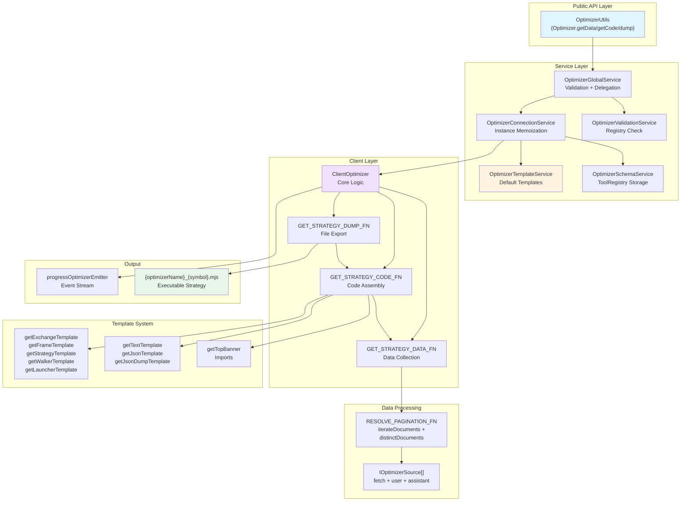
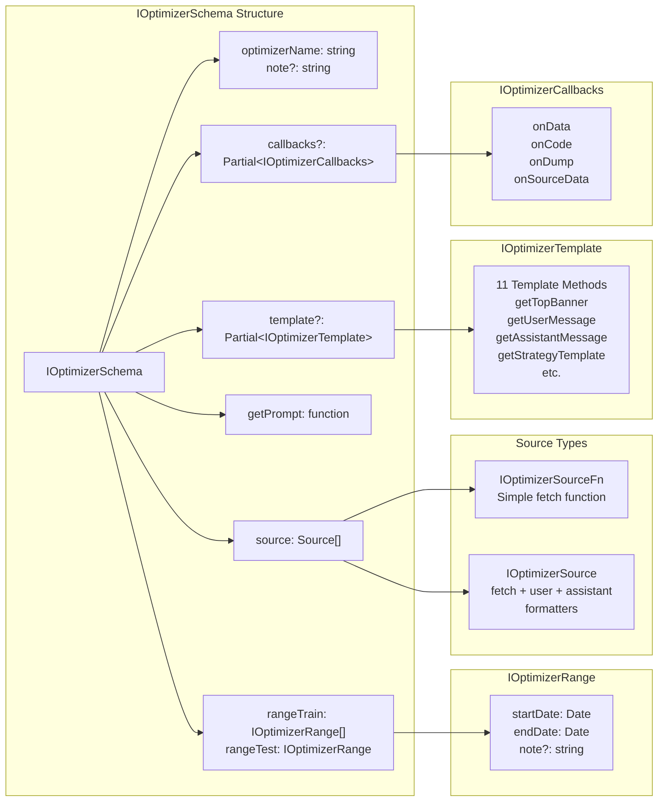
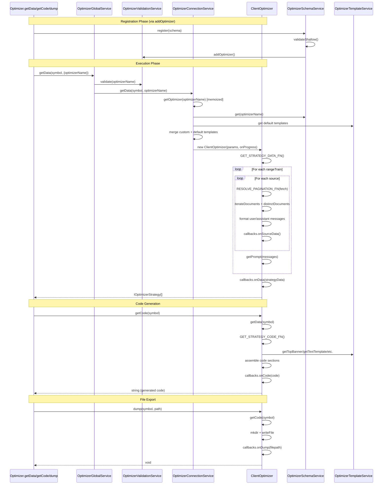
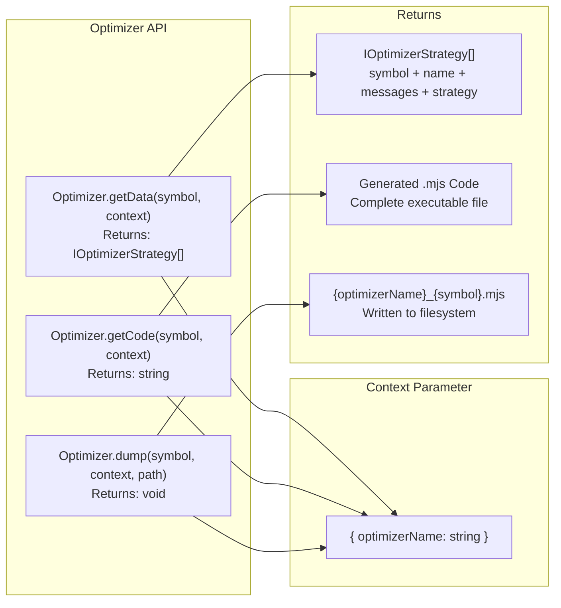
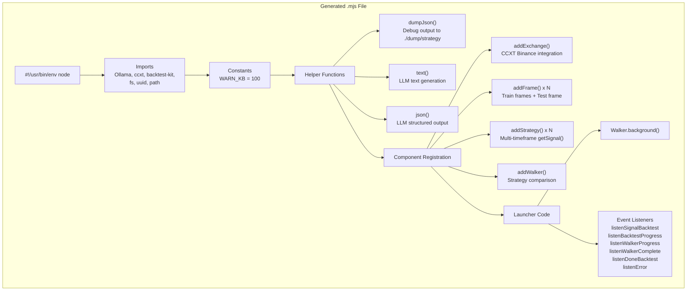
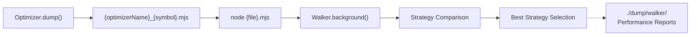

# AI-Powered Strategy Optimization

<details>
<summary>Relevant source files</summary>

The following files were used as context for generating this wiki page:

- [src/classes/Optimizer.ts](src/classes/Optimizer.ts)
- [src/client/ClientOptimizer.ts](src/client/ClientOptimizer.ts)
- [src/interfaces/Optimizer.interface.ts](src/interfaces/Optimizer.interface.ts)
- [src/lib/services/connection/OptimizerConnectionService.ts](src/lib/services/connection/OptimizerConnectionService.ts)
- [src/lib/services/global/OptimizerGlobalService.ts](src/lib/services/global/OptimizerGlobalService.ts)
- [src/lib/services/schema/OptimizerSchemaService.ts](src/lib/services/schema/OptimizerSchemaService.ts)
- [src/lib/services/template/OptimizerTemplateService.ts](src/lib/services/template/OptimizerTemplateService.ts)
- [src/lib/services/validation/OptimizerValidationService.ts](src/lib/services/validation/OptimizerValidationService.ts)
- [src/model/Message.model.ts](src/model/Message.model.ts)

</details>


## Purpose and Scope

The AI-Powered Strategy Optimization system enables automated generation of executable trading strategies using Large Language Models (LLMs). This document provides an overview of the optimizer's architecture, configuration, and execution flow. For detailed information about specific subsystems, see:

- [Optimizer Architecture](#16.5.1) - Internal components and code generation pipeline
- [Data Collection Pipeline](#16.5.2) - Data fetching, pagination, and deduplication
- [LLM Integration](#16.5.3) - Ollama integration and prompt engineering
- [Strategy Code Generation](#16.5.4) - Template system and code assembly
- [Training vs Testing Ranges](#16.5.5) - Date range configuration for optimization

## System Overview

The Optimizer generates complete, executable trading strategy code by analyzing historical market data through LLMs. The system collects data from configurable sources across multiple time ranges, builds multi-timeframe conversation context, and leverages Ollama's deepseek-v3.1:671b model to synthesize trading strategies. The output is a ready-to-execute `.mjs` file containing strategies, exchange configurations, frames, and a Walker for performance comparison.

**Key Capabilities:**

| Feature | Description |
|---------|-------------|
| **Data Collection** | Paginated fetching with deduplication from multiple sources |
| **Multi-Timeframe Analysis** | Progressive context building (1h → 15m → 5m → 1m) |
| **LLM Code Generation** | JSON-structured signal output with validation |
| **Template System** | Modular code generation with customizable templates |
| **Automated Testing** | Generated Walker for immediate strategy comparison |

The optimizer bridges raw market data to production-ready strategies through a four-stage pipeline: data collection, prompt construction, LLM inference, and code assembly.

Sources: [src/interfaces/Optimizer.interface.ts:379-433](), [src/client/ClientOptimizer.ts:1-19]()

## Architecture Components



**Component Responsibilities:**

| Component | File | Responsibility |
|-----------|------|----------------|
| **OptimizerUtils** | [src/classes/Optimizer.ts:32-121]() | Public API facade for optimizer operations |
| **OptimizerGlobalService** | [src/lib/services/global/OptimizerGlobalService.ts:21-102]() | Validation entry point, delegates to ConnectionService |
| **OptimizerConnectionService** | [src/lib/services/connection/OptimizerConnectionService.ts:41-172]() | Memoized instance creation with template merging |
| **OptimizerSchemaService** | [src/lib/services/schema/OptimizerSchemaService.ts:13-95]() | Immutable schema storage via ToolRegistry |
| **OptimizerTemplateService** | [src/lib/services/template/OptimizerTemplateService.ts:27-713]() | Default code generation templates |
| **ClientOptimizer** | [src/client/ClientOptimizer.ts:397-445]() | Core business logic for data and code generation |

Sources: [src/lib/services/connection/OptimizerConnectionService.ts:17-114](), [src/client/ClientOptimizer.ts:397-445](), [src/classes/Optimizer.ts:1-134]()

## Configuration Schema

The `IOptimizerSchema` defines the complete optimizer configuration. Registration is performed via the `addOptimizer` function (see [Component Registration](#2.3)).



**Schema Fields:**

| Field | Type | Required | Description |
|-------|------|----------|-------------|
| `optimizerName` | string | Yes | Unique identifier for registry lookup |
| `rangeTrain` | IOptimizerRange[] | Yes | Training time ranges for strategy generation |
| `rangeTest` | IOptimizerRange | Yes | Testing time range for Walker validation |
| `source` | Source[] | Yes | Data sources for LLM context building |
| `getPrompt` | function | Yes | Generates strategy logic from conversation history |
| `template` | Partial\<IOptimizerTemplate\> | No | Custom code generation overrides |
| `callbacks` | Partial\<IOptimizerCallbacks\> | No | Lifecycle hooks for monitoring |

**Data Source Configuration:**

```typescript
// Simple source - just a fetch function
const simpleFetch: IOptimizerSourceFn = async ({ symbol, startDate, endDate, limit, offset }) => {
  return await fetchDataFromDatabase(symbol, startDate, endDate, limit, offset);
};

// Complex source - with custom message formatters
const complexSource: IOptimizerSource = {
  name: "backtest-results",
  fetch: async ({ symbol, startDate, endDate, limit, offset }) => {
    return await fetchBacktestResults(symbol, startDate, endDate, limit, offset);
  },
  user: async (symbol, data, name) => {
    return `Analyze these ${data.length} backtest results for ${symbol}:\n${JSON.stringify(data)}`;
  },
  assistant: async (symbol, data, name) => {
    return `Analyzed ${data.length} results. Key patterns identified.`;
  }
};
```

Sources: [src/interfaces/Optimizer.interface.ts:377-433](), [src/interfaces/Optimizer.interface.ts:129-177]()

## Execution Flow

The optimizer executes through three primary methods: `getData()`, `getCode()`, and `dump()`. Each builds upon the previous.



**Step-by-Step Process:**

1. **Registration** - `addOptimizer()` validates schema and stores in registry
2. **Validation** - `OptimizerValidationService` confirms optimizer exists
3. **Instantiation** - `OptimizerConnectionService` creates memoized `ClientOptimizer`
4. **Data Collection** - Iterates `rangeTrain`, fetches from each `source` with pagination
5. **Message Formatting** - Builds user/assistant message pairs via formatters
6. **Prompt Generation** - Calls `getPrompt()` with complete conversation history
7. **Code Assembly** - Generates imports, helpers, components via templates
8. **File Export** - Writes `{optimizerName}_{symbol}.mjs` to filesystem

Sources: [src/client/ClientOptimizer.ts:99-214](), [src/client/ClientOptimizer.ts:225-350](), [src/client/ClientOptimizer.ts:360-384]()

## Public API Usage

The `Optimizer` singleton provides three methods for strategy generation:



**Example Usage:**

```typescript
import { addOptimizer, Optimizer } from "backtest-kit";

// 1. Register optimizer configuration
addOptimizer({
  optimizerName: "btc-momentum-v1",
  rangeTrain: [
    { startDate: new Date("2024-01-01"), endDate: new Date("2024-01-31") },
    { startDate: new Date("2024-02-01"), endDate: new Date("2024-02-28") }
  ],
  rangeTest: {
    startDate: new Date("2024-03-01"),
    endDate: new Date("2024-03-31")
  },
  source: [
    async ({ symbol, startDate, endDate, limit, offset }) => {
      // Fetch historical candles or indicators
      return await fetchIndicators(symbol, startDate, endDate, limit, offset);
    }
  ],
  getPrompt: async (symbol, messages) => {
    // Generate strategy logic prompt
    return "Купить на пробое RSI 30, продать на RSI 70. Стоп-лосс 2%, тейк-профит 4%.";
  }
});

// 2. Get strategy data (intermediate result)
const strategies = await Optimizer.getData("BTCUSDT", {
  optimizerName: "btc-momentum-v1"
});
console.log(strategies); // Array of strategy metadata with conversation history

// 3. Generate executable code
const code = await Optimizer.getCode("BTCUSDT", {
  optimizerName: "btc-momentum-v1"
});
console.log(code); // Complete .mjs file content

// 4. Save to file
await Optimizer.dump("BTCUSDT", {
  optimizerName: "btc-momentum-v1"
}, "./strategies");
// Creates: ./strategies/btc-momentum-v1_BTCUSDT.mjs
```

**Method Comparison:**

| Method | Purpose | Output | Use Case |
|--------|---------|--------|----------|
| `getData()` | Fetch data and build conversation history | `IOptimizerStrategy[]` | Inspect intermediate data, debug prompts |
| `getCode()` | Generate complete executable code | `string` | Preview code before saving, custom post-processing |
| `dump()` | Generate and save code to file | `void` | Production usage, automated workflows |

Sources: [src/classes/Optimizer.ts:32-134](), [src/lib/services/global/OptimizerGlobalService.ts:28-101]()

## Generated Code Structure

The optimizer outputs a complete `.mjs` file with all required components. The file is immediately executable via Node.js.

**Generated File Structure:**



**Code Section Mapping:**

| Section | Template Method | Purpose |
|---------|----------------|---------|
| Shebang + Imports | `getTopBanner()` | [src/lib/services/template/OptimizerTemplateService.ts:36-66]() |
| dumpJson() | `getJsonDumpTemplate()` | [src/lib/services/template/OptimizerTemplateService.ts:452-546]() |
| text() | `getTextTemplate()` | [src/lib/services/template/OptimizerTemplateService.ts:555-612]() |
| json() | `getJsonTemplate()` | [src/lib/services/template/OptimizerTemplateService.ts:629-712]() |
| addExchange() | `getExchangeTemplate()` | [src/lib/services/template/OptimizerTemplateService.ts:314-342]() |
| addFrame() | `getFrameTemplate()` | [src/lib/services/template/OptimizerTemplateService.ts:354-385]() |
| addStrategy() | `getStrategyTemplate()` | [src/lib/services/template/OptimizerTemplateService.ts:168-304]() |
| addWalker() | `getWalkerTemplate()` | [src/lib/services/template/OptimizerTemplateService.ts:122-157]() |
| Walker.background() | `getLauncherTemplate()` | [src/lib/services/template/OptimizerTemplateService.ts:395-443]() |

**Strategy Template Highlights:**

The `getStrategyTemplate()` generates a strategy with multi-timeframe analysis:

1. **Data Loading** - Fetches 1h, 15m, 5m, 1m candles via `getCandles()`
2. **Progressive Analysis** - Builds conversation with 5 message pairs
3. **LLM Invocation** - Calls `json(messages)` for structured signal output
4. **Debug Logging** - Dumps conversation to `./dump/strategy/{uuid}/`

The generated signal schema enforces:
- `position`: "wait" | "long" | "short"
- `priceOpen`, `priceTakeProfit`, `priceStopLoss`: entry/exit prices
- `minuteEstimatedTime`: expected trade duration (max 360 minutes)
- `note`: strategy explanation

Sources: [src/client/ClientOptimizer.ts:225-350](), [src/lib/services/template/OptimizerTemplateService.ts:168-304]()

## Template Customization

The template system allows partial overrides for custom code generation. Override any of the 11 template methods via the `template` field in `IOptimizerSchema`.

**Template Methods:**

| Method | Default Behavior | Common Customizations |
|--------|------------------|----------------------|
| `getTopBanner()` | Standard imports (Ollama, ccxt, backtest-kit) | Add custom dependencies, environment variables |
| `getUserMessage()` | "Прочитай данные и скажи ОК" | Format data differently, add analysis instructions |
| `getAssistantMessage()` | "ОК" | Add contextual acknowledgments |
| `getStrategyTemplate()` | Multi-timeframe (1h→15m→5m→1m) | Change timeframes, add custom indicators |
| `getTextTemplate()` | deepseek-v3.1:671b text mode | Use different model, modify system prompt |
| `getJsonTemplate()` | Signal schema with position/prices | Change schema, add custom fields |
| `getExchangeTemplate()` | CCXT Binance | Use different exchange, add authentication |
| `getFrameTemplate()` | Standard frame config | Add custom intervals |
| `getWalkerTemplate()` | Standard walker | Change comparison metrics |
| `getLauncherTemplate()` | Full event listeners | Add custom listeners, modify output |
| `getJsonDumpTemplate()` | Dump to ./dump/strategy | Change output directory, format |

**Example Customization:**

```typescript
addOptimizer({
  optimizerName: "custom-strategy",
  // ... other fields ...
  template: {
    // Override strategy template to use custom timeframes
    getStrategyTemplate: async (strategyName, interval, prompt) => {
      return `
        addStrategy({
          strategyName: "${strategyName}",
          interval: "${interval}",
          getSignal: async (symbol) => {
            // Custom logic: only use 4h and 1h timeframes
            const longTermCandles = await getCandles(symbol, "4h", 24);
            const mediumTermCandles = await getCandles(symbol, "1h", 48);
            
            const messages = [
              { role: "user", content: formatCandles(longTermCandles) },
              { role: "assistant", content: "Long-term trend analyzed" },
              { role: "user", content: formatCandles(mediumTermCandles) },
              { role: "assistant", content: "Medium-term trend analyzed" },
              { role: "user", content: "${prompt}" }
            ];
            
            return await json(messages);
          }
        });
      `;
    }
  }
});
```

Sources: [src/interfaces/Optimizer.interface.ts:242-374](), [src/lib/services/connection/OptimizerConnectionService.ts:59-112]()

## Progress Monitoring

The optimizer emits progress events via `progressOptimizerEmitter` for real-time monitoring during data collection.

**Progress Event Structure:**

```typescript
interface ProgressOptimizerContract {
  optimizerName: string;     // Optimizer identifier
  symbol: string;            // Trading pair
  totalSources: number;      // rangeTrain.length * source.length
  processedSources: number;  // Completed sources
  progress: number;          // 0.0 to 1.0
}
```

**Monitoring Example:**

```typescript
import { listenOptimizerProgress, Optimizer } from "backtest-kit";

// Subscribe to progress events
listenOptimizerProgress((event) => {
  console.log(`Optimizer: ${event.optimizerName}`);
  console.log(`Symbol: ${event.symbol}`);
  console.log(`Progress: ${(event.progress * 100).toFixed(2)}%`);
  console.log(`Processed: ${event.processedSources}/${event.totalSources} sources`);
});

// Start optimization
await Optimizer.dump("BTCUSDT", { optimizerName: "my-optimizer" });
```

Progress events are emitted:
1. At the start of processing each source (before fetch)
2. After completing all sources (progress = 1.0)

Sources: [src/client/ClientOptimizer.ts:99-214](), [src/lib/services/connection/OptimizerConnectionService.ts:20-21]()

## Use Cases and Patterns

**Common Use Cases:**

1. **Automated Strategy Discovery** - Generate strategies from historical patterns
2. **Parameter Optimization** - Test multiple variations across training ranges
3. **Strategy Refinement** - Iteratively improve strategies with additional data sources
4. **Ensemble Strategies** - Generate multiple strategies for portfolio diversification
5. **Market Regime Analysis** - Generate different strategies for different market conditions

**Recommended Patterns:**

```typescript
// Pattern 1: Multiple Training Periods
addOptimizer({
  optimizerName: "quarterly-strategies",
  rangeTrain: [
    { startDate: new Date("2024-Q1-start"), endDate: new Date("2024-Q1-end") },
    { startDate: new Date("2024-Q2-start"), endDate: new Date("2024-Q2-end") },
    { startDate: new Date("2024-Q3-start"), endDate: new Date("2024-Q3-end") }
  ],
  // Each range generates a separate strategy variant
  // ...
});

// Pattern 2: Multiple Data Sources
addOptimizer({
  optimizerName: "multi-source-strategy",
  source: [
    { name: "candles", fetch: fetchCandles },
    { name: "indicators", fetch: fetchIndicators },
    { name: "sentiment", fetch: fetchSentiment },
    { name: "orderbook", fetch: fetchOrderbook }
  ],
  // LLM sees all sources in conversation
  // ...
});

// Pattern 3: Custom Lifecycle Hooks
addOptimizer({
  optimizerName: "monitored-optimizer",
  callbacks: {
    onSourceData: async (symbol, sourceName, data) => {
      console.log(`Fetched ${data.length} rows from ${sourceName}`);
    },
    onData: async (symbol, strategyData) => {
      // Validate generated strategies
      for (const strategy of strategyData) {
        if (strategy.strategy.length < 100) {
          throw new Error("Strategy prompt too short");
        }
      }
    },
    onCode: async (symbol, code) => {
      // Run static analysis, linting
      await validateGeneratedCode(code);
    },
    onDump: async (symbol, filepath) => {
      // Upload to storage, send notifications
      await uploadToS3(filepath);
    }
  },
  // ...
});
```

Sources: [src/interfaces/Optimizer.interface.ts:191-236](), [src/client/ClientOptimizer.ts:99-214]()

## Integration with Walker

The generated code includes a Walker configuration that automatically compares all generated strategies on the test range. This enables immediate performance evaluation without manual setup.

**Walker Integration Flow:**



The generated launcher code includes:
- `listenWalkerProgress()` - Monitor comparison progress
- `listenWalkerComplete()` - Receive best strategy results
- `Walker.dump()` - Export comparison statistics

**Generated Walker Structure:**

```javascript
// Generated by getWalkerTemplate()
addWalker({
  walkerName: "{prefix}_walker",
  exchangeName: "{prefix}_exchange",
  frameName: "{prefix}_test_frame",
  strategies: [
    "{prefix}_strategy-1",  // From rangeTrain[0]
    "{prefix}_strategy-2",  // From rangeTrain[1]
    "{prefix}_strategy-3"   // From rangeTrain[2]
  ]
});

// Generated by getLauncherTemplate()
Walker.background("BTCUSDT", { walkerName: "{prefix}_walker" });

listenWalkerComplete((results) => {
  console.log("Best strategy:", results.bestStrategy);
  console.log("Sharpe Ratio:", results.bestSharpeRatio);
  Walker.dump("BTCUSDT", results.walkerName);
});
```

Sources: [src/lib/services/template/OptimizerTemplateService.ts:122-157](), [src/lib/services/template/OptimizerTemplateService.ts:395-443](), [src/client/ClientOptimizer.ts:317-332]()