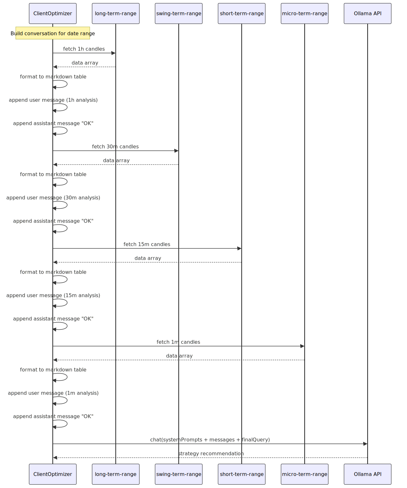
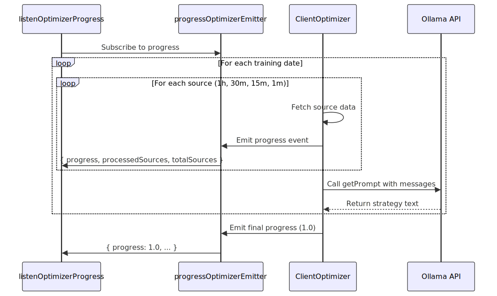

# LLM Integration

This document describes the integration of Large Language Model (LLM) services into the backtest-kit optimization pipeline. It covers the Ollama API integration, prompt engineering patterns, conversation history management, and response processing mechanisms that enable AI-driven strategy generation.

For information about the overall optimizer architecture and data collection, see [Optimizer Architecture](./88_Optimizer_Architecture.md) and [Data Collection Pipeline](./89_Data_Collection_Pipeline.md). For details on how LLM responses are transformed into executable strategy code, see [Strategy Code Generation](./91_Strategy_Code_Generation.md).

## Integration Architecture

The LLM integration serves as the intelligence layer that analyzes multi-timeframe market data and generates trading strategy recommendations. The system follows a request-response pattern where historical market data is formatted into prompts, sent to the LLM service, and the responses are captured for code generation.




## Ollama API Configuration

The system integrates with Ollama through the official `ollama` npm package. The client is configured with custom host and authentication headers to support both self-hosted and cloud-based Ollama instances.



**Configuration Structure:**

| Property | Type | Description |
|----------|------|-------------|
| `host` | string | Ollama service URL (e.g., "https://ollama.com") |
| `headers.Authorization` | string | Bearer token from `OLLAMA_API_KEY` environment variable |
| `model` | string | Model identifier: `"deepseek-v3.1:671b"` |
| `think` | boolean | Enable reasoning mode for deeper analysis |
| `messages` | array | Conversation history with role-based messages |


## Prompt Engineering System

The LLM integration implements a multi-layer prompt engineering pattern that combines system-level instructions, contextual data formatting, and specific trading analysis requests.

### System Prompts

System prompts establish the operational context and output format requirements. The system uses two sequential system messages:



**System Prompt Components:**

1. **Output Format Instructions** [demo/optimization/src/index.mjs:338-343]():
   - Requires concise trading strategy output
   - Eliminates greetings and procedural commentary
   - Ensures copy-paste ready format

2. **Reasoning Level** [demo/optimization/src/index.mjs:346-348]():
   - Sets reasoning intensity to "high"
   - Enables deeper analytical processing


### User Query Construction

The final user message requests specific trading analysis components:



**Query Structure:**

| Component | Purpose |
|-----------|---------|
| Entry conditions | Specific criteria for position opening |
| Market analysis | Support/resistance levels, trend identification |
| Entry points | LONG and SHORT position entry prices |
| Risk/Reward | Take-profit and stop-loss ratios |
| Directional bias | Preference for LONG vs SHORT positions |
| Fundamental analysis | Non-technical strategic recommendations |


## Message Structure and Conversation History

The LLM receives a conversation history built from multi-timeframe data sources. Each source contributes a user-assistant message pair to the conversation.



**Message Roles:**

| Role | Content | Purpose |
|------|---------|---------|
| `system` | Output format instructions | Define response constraints |
| `system` | Reasoning level | Configure analysis depth |
| `user` | Markdown table + indicator explanations | Provide timeframe data |
| `assistant` | Acknowledgment message | Confirm data receipt |
| `user` | Analysis request | Request strategy generation |

**User Message Format:**

Each user message contains:
1. Timeframe header (e.g., "# 1-Hour Candles Trading Analysis")
2. Markdown table with OHLCV and technical indicators
3. Data sources section explaining each indicator's calculation period

**Assistant Message Format:**

Each assistant message provides acknowledgment in Russian:
- 1h: "Исторические данные 1-часовых свечей получены"
- 30m: "Исторические данные 30-минутных свечей получены"
- 15m: "Исторические данные 15-минутных свечей получены"
- 1m: "Исторические данные 1-минутных свечей получены"


## Response Processing

The LLM response undergoes character escaping to ensure safe embedding in generated JavaScript code. The response text becomes part of a string literal in the generated strategy file.



**Escape Sequence:**

| Character | Pattern | Replacement | Purpose |
|-----------|---------|-------------|---------|
| Backslash | `\` | `\\` | Escape existing escape sequences |
| Backtick | `` ` `` | `` \` `` | Prevent template literal injection |
| Dollar sign | `$` | `\$` | Prevent template variable interpolation |
| Double quote | `"` | `\"` | Prevent string literal termination |
| Single quote | `'` | `\'` | Prevent string literal termination |

**Processing Order:**

The escape sequence follows a specific order to prevent double-escaping:
1. Backslashes first (to avoid escaping added backslashes)
2. Template literal characters (backticks, dollar signs)
3. Quote characters (double and single quotes)


## Helper Functions

The optimizer system provides two helper functions for LLM interaction, available through template customization:

### text() Helper

The `text()` function performs synchronous LLM calls with conversation history:



**Parameters:**

| Parameter | Type | Description |
|-----------|------|-------------|
| `symbol` | string | Trading pair symbol (e.g., "BTCUSDT") |
| `messages` | array | Conversation history with user/assistant messages |

**Returns:** Escaped string containing LLM-generated trading strategy


### json() Helper

The `json()` function is similar to `text()` but parses the response as JSON. This helper is available for custom template implementations but not used in the default optimizer flow.


## Integration Points

The LLM integration connects to the optimizer system through the `IOptimizerSchema` interface:



**Integration Contract:**

```typescript
interface IOptimizerSchema {
    optimizerName: string;
    rangeTrain: Array<{ startDate: Date; endDate: Date; note?: string }>;
    rangeTest: { startDate: Date; endDate: Date; note?: string };
    source: Array<{
        name: string;
        fetch: (params) => Promise<any[]>;
        user: (symbol: string, data: any[]) => string;
        assistant: () => string;
    }>;
    getPrompt: (symbol: string, messages: Message[]) => Promise<string>;
}
```

**Callback Sequence:**

1. **Data Collection Phase:** For each training date and source, the optimizer calls `source.fetch()` to retrieve data
2. **Message Formatting:** Formats data using `source.user()` and `source.assistant()`
3. **LLM Invocation:** Calls `getPrompt(symbol, messageList)` with accumulated messages
4. **Strategy Collection:** Stores returned strategy text in internal array
5. **Code Generation:** Embeds strategy text in generated code via template system


## Progress Monitoring

The LLM integration emits progress events during data collection, allowing external monitoring of the optimization process:



**Progress Event Structure:**

| Field | Type | Description |
|-------|------|-------------|
| `optimizerName` | string | Name of the executing optimizer |
| `symbol` | string | Trading symbol being optimized |
| `totalSources` | number | Total data sources to process |
| `processedSources` | number | Number of sources processed |
| `progress` | number | Completion ratio (0.0 to 1.0) |

**Example Usage:**

```javascript
listenOptimizerProgress(({ progress }) => {
  console.log(`Progress: ${progress * 100}%`);
});
```

