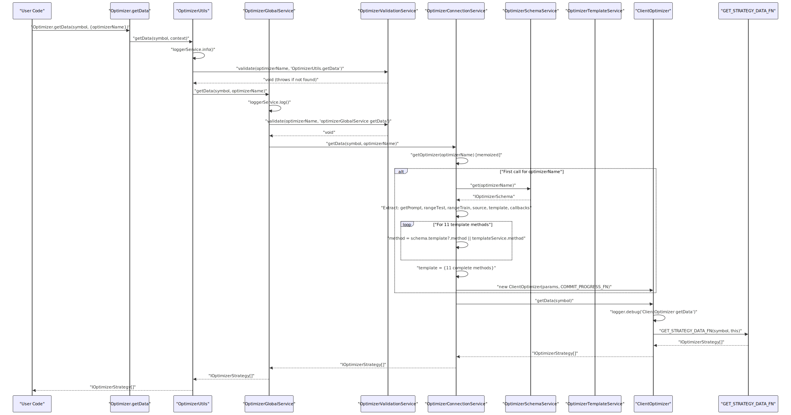
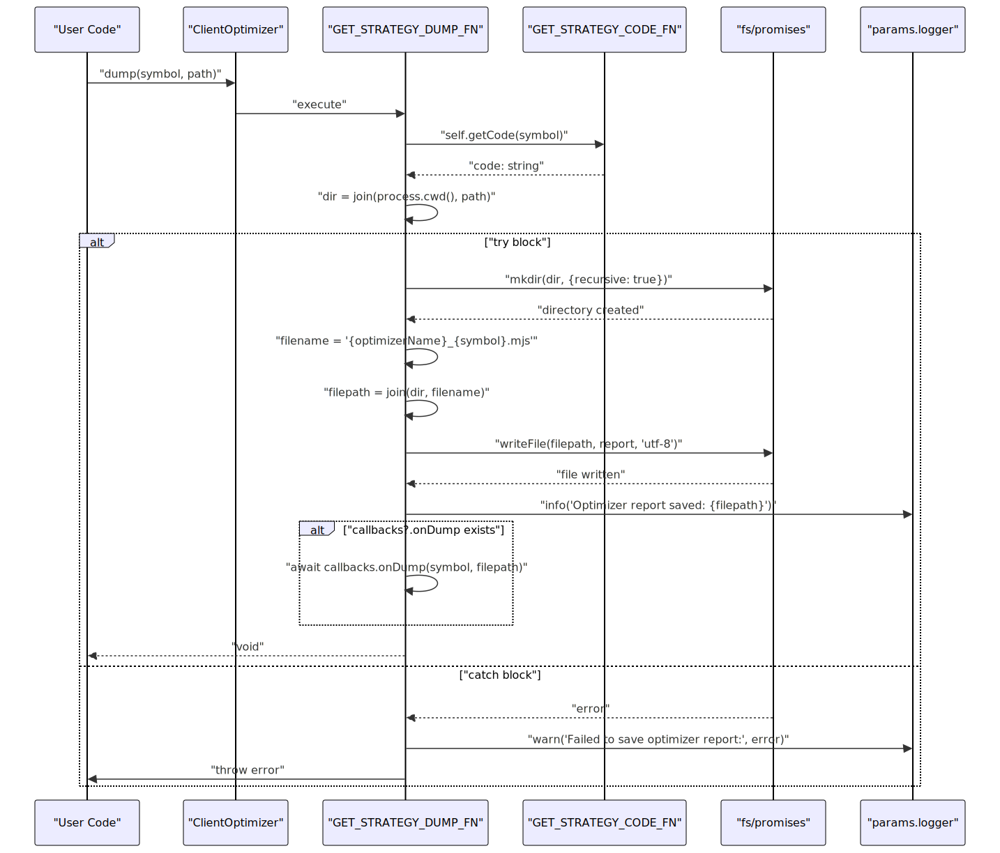

# Optimizer Architecture

# Optimizer Architecture

## Overview

The Optimizer system generates executable trading strategy code through LLM-based analysis of historical data. Unlike Backtest, Live, and Walker modes which execute strategies, the Optimizer produces `.mjs` files containing complete strategy implementations with `addStrategy`, `addExchange`, `addFrame`, and `addWalker` configurations.

The system consists of four primary components organized in a layered service architecture:

| Component | File Path | Purpose |
|-----------|-----------|---------|
| `OptimizerUtils` | [src/classes/Optimizer.ts]() | Public API entry point with `getData`, `getCode`, `dump` methods |
| `OptimizerGlobalService` | [src/lib/services/global/OptimizerGlobalService.ts]() | Validation and delegation layer |
| `OptimizerConnectionService` | [src/lib/services/connection/OptimizerConnectionService.ts]() | Template merging and `ClientOptimizer` instantiation with memoization |
| `ClientOptimizer` | [src/client/ClientOptimizer.ts]() | Core implementation with data collection, code generation, and file output |

Supporting services:

| Service | File Path | Purpose |
|---------|-----------|---------|
| `OptimizerSchemaService` | [src/lib/services/schema/OptimizerSchemaService.ts]() | Registry for `IOptimizerSchema` configurations |
| `OptimizerTemplateService` | [src/lib/services/template/OptimizerTemplateService.ts]() | Default implementations for 11 code generation methods |
| `OptimizerValidationService` | [src/lib/services/validation/OptimizerValidationService.ts]() | Validates optimizer existence before operations |

**Related Pages:**
- Data collection implementation: see page 16.5.2
- Ollama API integration: see page 16.5.3
- Template methods and code sections: see page 16.5.4
- `rangeTrain` and `rangeTest` configuration: see page 16.5.5

**Sources:** [src/classes/Optimizer.ts:1-135](), [src/client/ClientOptimizer.ts:1-448](), [src/lib/services/connection/OptimizerConnectionService.ts:1-175](), [src/lib/services/template/OptimizerTemplateService.ts:1-716]()
</old_str>

<old_str>
### ClientOptimizer

`ClientOptimizer` is the main client class that performs optimizer operations. It accepts `IOptimizerParams` (which extends `IOptimizerSchema` with `logger: ILogger` and complete `template: IOptimizerTemplate`) and an `onProgress` callback for progress emission via `progressOptimizerEmitter`.

**Class Declaration:**

```typescript
export class ClientOptimizer implements IOptimizer {
  constructor(
    readonly params: IOptimizerParams,
    readonly onProgress: (progress: ProgressOptimizerContract) => void,
  ) {}
}
```

**Constructor Parameters:**
- `params: IOptimizerParams` - Configuration with resolved dependencies (logger, template, callbacks)
- `onProgress: (progress: ProgressOptimizerContract) => void` - Progress event emitter that fires during data collection

**Public Methods:**

| Method | Parameters | Return Type | Implementation | Description |
|--------|-----------|-------------|----------------|-------------|
| `getData` | `symbol: string` | `Promise<IOptimizerStrategy[]>` | [line 410-415]() | Fetches data from all sources and generates strategy metadata with LLM conversation history |
| `getCode` | `symbol: string` | `Promise<string>` | [line 424-429]() | Generates complete executable `.mjs` file with 11 code sections |
| `dump` | `symbol: string, path?: string` | `Promise<void>` | [line 438-444]() | Saves generated code to `{path}/{optimizerName}_{symbol}.mjs` |

**Internal Function Delegation:**

The class delegates to three internal functions defined at module scope:

| Function | Location | Purpose |
|----------|----------|---------|
| `GET_STRATEGY_DATA_FN` | [line 99-215]() | Iterates through `rangeTrain` × `source` combinations, paginates data, builds message history, calls `getPrompt()` |
| `GET_STRATEGY_CODE_FN` | [line 225-350]() | Calls `getData()`, then assembles 11 code sections using template methods |
| `GET_STRATEGY_DUMP_FN` | [line 360-384]() | Calls `getCode()`, creates directory, writes file with `fs.writeFile()` |

**Helper Functions:**

| Function | Location | Purpose |
|----------|----------|---------|
| `DEFAULT_USER_FN` | [line 34-41]() | Delegates to `template.getUserMessage()` for default user message formatting |
| `DEFAULT_ASSISTANT_FN` | [line 53-60]() | Delegates to `template.getAssistantMessage()` for default assistant message formatting |
| `RESOLVE_PAGINATION_FN` | [line 70-88]() | Uses `iterateDocuments` and `distinctDocuments` from functools-kit for pagination with deduplication |
| `CREATE_PREFIX_FN` | [line 22]() | Generates random base36 prefix for generated code identifiers |

**Sources:** [src/client/ClientOptimizer.ts:397-447](), [src/client/ClientOptimizer.ts:22](), [src/client/ClientOptimizer.ts:34-60](), [src/client/ClientOptimizer.ts:70-88](), [src/interfaces/Optimizer.interface.ts:436-484]()
</old_str>
<new_str>
The Optimizer system consists of four primary components organized in a layered architecture:

## Component Architecture

**Diagram: Optimizer Service Layer Hierarchy**



**Key Architectural Patterns:**

1. **Memoization**: `OptimizerConnectionService.getOptimizer()` caches `ClientOptimizer` instances by `optimizerName` using `memoize([optimizerName] => optimizerName)` from functools-kit [src/lib/services/connection/OptimizerConnectionService.ts:59-113]()

2. **Template Merging**: `OptimizerConnectionService` merges user-provided `Partial<IOptimizerTemplate>` from schema with `OptimizerTemplateService` defaults, ensuring all 11 methods have implementations [src/lib/services/connection/OptimizerConnectionService.ts:72-97]()

3. **Validation Chain**: `OptimizerGlobalService` calls `OptimizerValidationService.validate()` before delegating to `OptimizerConnectionService`, ensuring optimizer exists [src/lib/services/global/OptimizerGlobalService.ts:45-48]()

4. **Function Delegation**: `ClientOptimizer` public methods delegate to module-scoped functions (`GET_STRATEGY_DATA_FN`, `GET_STRATEGY_CODE_FN`, `GET_STRATEGY_DUMP_FN`) that accept `self: ClientOptimizer` as the last parameter [src/client/ClientOptimizer.ts:410-444]()

**Sources:** [src/client/ClientOptimizer.ts:1-448](), [src/lib/services/connection/OptimizerConnectionService.ts:1-175](), [src/lib/services/template/OptimizerTemplateService.ts:1-716](), [src/lib/services/global/OptimizerGlobalService.ts:1-105](), [src/lib/services/validation/OptimizerValidationService.ts:1-72](), [src/classes/Optimizer.ts:1-135](), [src/lib/services/schema/OptimizerSchemaService.ts:1-97]()

## Data Flow Through Components

**Diagram: getData() Method Call Chain**



**Sources:** [src/classes/Optimizer.ts:42-59](), [src/lib/services/global/OptimizerGlobalService.ts:37-50](), [src/lib/services/connection/OptimizerConnectionService.ts:59-132](), [src/client/ClientOptimizer.ts:410-415]()

## Core Components

## Core Components

### OptimizerConnectionService

`OptimizerConnectionService` implements the connection service pattern, providing memoized `ClientOptimizer` instances with template merging and dependency injection.

**Class Structure:**

```typescript
export class OptimizerConnectionService implements TOptimizer {
  private readonly loggerService = inject<LoggerService>(TYPES.loggerService);
  private readonly optimizerSchemaService = inject<OptimizerSchemaService>(TYPES.optimizerSchemaService);
  private readonly optimizerTemplateService = inject<OptimizerTemplateService>(TYPES.optimizerTemplateService);
  
  public getOptimizer = memoize([optimizerName] => optimizerName, ...);
  public getData = async (symbol, optimizerName) => {...};
  public getCode = async (symbol, optimizerName) => {...};
  public dump = async (symbol, optimizerName, path?) => {...};
}
```

**Dependency Injection:**

| Dependency | TYPES Symbol | Usage |
|------------|--------------|-------|
| `LoggerService` | `TYPES.loggerService` | Logging throughout the service layer |
| `OptimizerSchemaService` | `TYPES.optimizerSchemaService` | Retrieving `IOptimizerSchema` by `optimizerName` |
| `OptimizerTemplateService` | `TYPES.optimizerTemplateService` | Default `IOptimizerTemplate` method implementations |

**getOptimizer Method:**

The `getOptimizer` method uses memoization to cache `ClientOptimizer` instances per `optimizerName` [src/lib/services/connection/OptimizerConnectionService.ts:59-113]():

**Template Merging Algorithm:**

```typescript
const { getPrompt, rangeTest, rangeTrain, source, template: rawTemplate = {}, callbacks } = 
  this.optimizerSchemaService.get(optimizerName);

// Destructure with defaults
const {
  getAssistantMessage = this.optimizerTemplateService.getAssistantMessage,
  getExchangeTemplate = this.optimizerTemplateService.getExchangeTemplate,
  getFrameTemplate = this.optimizerTemplateService.getFrameTemplate,
  getJsonDumpTemplate = this.optimizerTemplateService.getJsonDumpTemplate,
  getJsonTemplate = this.optimizerTemplateService.getJsonTemplate,
  getLauncherTemplate = this.optimizerTemplateService.getLauncherTemplate,
  getStrategyTemplate = this.optimizerTemplateService.getStrategyTemplate,
  getTextTemplate = this.optimizerTemplateService.getTextTemplate,
  getTopBanner = this.optimizerTemplateService.getTopBanner,
  getUserMessage = this.optimizerTemplateService.getUserMessage,
  getWalkerTemplate = this.optimizerTemplateService.getWalkerTemplate,
} = rawTemplate;

const template: IOptimizerTemplate = {
  getAssistantMessage, getExchangeTemplate, getFrameTemplate,
  getJsonDumpTemplate, getJsonTemplate, getLauncherTemplate,
  getStrategyTemplate, getTextTemplate, getTopBanner,
  getUserMessage, getWalkerTemplate,
};

return new ClientOptimizer({
  optimizerName, logger: this.loggerService, getPrompt,
  rangeTest, rangeTrain, source, template, callbacks
}, COMMIT_PROGRESS_FN);
```

This destructuring pattern ensures:
- User-provided methods from `schema.template` take precedence
- Missing methods fall back to `OptimizerTemplateService` defaults
- All 11 required `IOptimizerTemplate` methods are present
- Type safety enforced by `IOptimizerTemplate` interface

**Progress Emission:**

`COMMIT_PROGRESS_FN` emits `ProgressOptimizerContract` events to `progressOptimizerEmitter` [src/lib/services/connection/OptimizerConnectionService.ts:20-21]():

```typescript
const COMMIT_PROGRESS_FN = async (progress: ProgressOptimizerContract) =>
  progressOptimizerEmitter.next(progress);
```

**Public Methods:**

All three public methods follow the same pattern: retrieve memoized `ClientOptimizer` instance, then delegate:

| Method | Lines | Delegation |
|--------|-------|------------|
| `getData` | [122-132]() | `optimizer.getData(symbol)` |
| `getCode` | [141-151]() | `optimizer.getCode(symbol)` |
| `dump` | [160-171]() | `optimizer.dump(symbol, path)` |

**Sources:** [src/lib/services/connection/OptimizerConnectionService.ts:41-174](), [src/lib/services/connection/OptimizerConnectionService.ts:18-21](), [src/interfaces/Optimizer.interface.ts:242-374]()

### OptimizerTemplateService

`OptimizerTemplateService` implements `IOptimizerTemplate`, providing default code generation methods that output TypeScript/JavaScript code snippets.

**Implementation:**

```typescript
export class OptimizerTemplateService implements IOptimizerTemplate {
  private readonly loggerService = inject<LoggerService>(TYPES.loggerService);
  
  public getTopBanner = async (symbol: string) => {...};
  public getUserMessage = async (symbol, data, name) => {...};
  public getAssistantMessage = async (symbol, data, name) => {...};
  // ... 8 more methods
}
```

**Template Methods:**

| Method | Lines | Generated Code | Parameters |
|--------|-------|----------------|------------|
| `getTopBanner` | [36-66]() | Shebang, imports, `WARN_KB` constant | `symbol` |
| `getUserMessage` | [77-88]() | Default LLM user prompt with data | `symbol, data[], name` |
| `getAssistantMessage` | [99-110]() | Default LLM assistant response | `symbol, data[], name` |
| `getWalkerTemplate` | [122-157]() | `addWalker({...})` call | `walkerName, exchangeName, frameName, strategies[]` |
| `getStrategyTemplate` | [168-304]() | `addStrategy({...})` with multi-timeframe `getSignal` | `strategyName, interval, prompt` |
| `getExchangeTemplate` | [314-342]() | `addExchange({...})` with CCXT Binance | `symbol, exchangeName` |
| `getFrameTemplate` | [354-385]() | `addFrame({...})` with dates | `symbol, frameName, interval, startDate, endDate` |
| `getLauncherTemplate` | [395-443]() | `Walker.background()` + event listeners | `symbol, walkerName` |
| `getTextTemplate` | [555-612]() | `async function text(messages)` | `symbol` |
| `getJsonTemplate` | [629-712]() | `async function json(messages)` with schema | `symbol` |
| `getJsonDumpTemplate` | [452-546]() | `async function dumpJson(...)` | `symbol` |

**Escape Sequence Pattern:**

All template methods escape user inputs to prevent code injection [src/lib/services/template/OptimizerTemplateService.ts:136-147](), [183-192]():

```typescript
const escapedStrategyName = String(strategyName)
  .replace(/\\/g, '\\\\')
  .replace(/"/g, '\\"');

const escapedPrompt = String(plainPrompt)
  .replace(/\\/g, '\\\\')
  .replace(/`/g, '\\`')
  .replace(/\$/g, '\\$');
```

**Multi-Timeframe getSignal Function:**

`getStrategyTemplate` generates a `getSignal` implementation that performs 4-stage analysis [src/lib/services/template/OptimizerTemplateService.ts:202-300]():

1. **Candle Fetching** [202-205]():
   ```javascript
   const microTermCandles = await getCandles(symbol, "1m", 30);
   const mainTermCandles = await getCandles(symbol, "5m", 24);
   const shortTermCandles = await getCandles(symbol, "15m", 24);
   const mediumTermCandles = await getCandles(symbol, "1h", 24);
   ```

2. **Message Building** [214-276](): Four user/assistant message pairs for 1h → 15m → 5m → 1m analysis

3. **Signal Generation** [279-290](): Final LLM prompt with strategy description

4. **Result Processing** [294-300](): UUID generation, JSON signal, and `dumpJson` call

**Sources:** [src/lib/services/template/OptimizerTemplateService.ts:27-716](), [src/interfaces/Optimizer.interface.ts:242-374]()

### ClientOptimizer

`ClientOptimizer` implements `IOptimizer`, delegating operations to module-scoped functions with `self: ClientOptimizer` context.

**Class Structure:**

```typescript
export class ClientOptimizer implements IOptimizer {
  constructor(
    readonly params: IOptimizerParams,
    readonly onProgress: (progress: ProgressOptimizerContract) => void,
  ) {}
  
  public getData = async (symbol: string) => GET_STRATEGY_DATA_FN(symbol, this);
  public getCode = async (symbol: string) => GET_STRATEGY_CODE_FN(symbol, this);
  public dump = async (symbol: string, path = "./") => GET_STRATEGY_DUMP_FN(symbol, path, this);
}
```

**Constructor Parameters:**

| Parameter | Type | Purpose |
|-----------|------|---------|
| `params` | `IOptimizerParams` | Extends `IOptimizerSchema` with `logger: ILogger` and complete `template: IOptimizerTemplate` |
| `onProgress` | `(progress: ProgressOptimizerContract) => void` | Callback for emitting progress via `progressOptimizerEmitter` |

**IOptimizerParams Interface:**

[src/interfaces/Optimizer.interface.ts:438-451]()

```typescript
export interface IOptimizerParams extends IOptimizerSchema {
  logger: ILogger;              // Injected by OptimizerConnectionService
  template: IOptimizerTemplate; // Merged from schema + defaults
}
```

**Internal Function Delegation:**

| Function | Lines | Operation |
|----------|-------|-----------|
| `GET_STRATEGY_DATA_FN` | [99-215]() | Iterates `rangeTrain` × `source`, fetches data with pagination, builds `MessageModel[]` arrays, calls `getPrompt()` |
| `GET_STRATEGY_CODE_FN` | [225-350]() | Calls `getData()`, assembles 11 code sections using template methods, joins with newlines |
| `GET_STRATEGY_DUMP_FN` | [360-384]() | Calls `getCode()`, creates directory with `mkdir({recursive: true})`, writes `.mjs` file |

**Helper Functions:**

| Function | Lines | Purpose |
|----------|-------|---------|
| `DEFAULT_USER_FN` | [34-41]() | Delegates to `template.getUserMessage(symbol, data, name)` |
| `DEFAULT_ASSISTANT_FN` | [53-60]() | Delegates to `template.getAssistantMessage(symbol, data, name)` |
| `RESOLVE_PAGINATION_FN` | [70-88]() | Uses `iterateDocuments` + `distinctDocuments` from functools-kit for paginated fetching with deduplication by `data.id` |
| `CREATE_PREFIX_FN` | [22]() | Generates random base36 string for identifier prefixes: `(Math.random() + 1).toString(36).substring(7)` |

**Sources:** [src/client/ClientOptimizer.ts:397-447](), [src/client/ClientOptimizer.ts:22](), [src/client/ClientOptimizer.ts:34-88](), [src/interfaces/Optimizer.interface.ts:436-484]()

## Operation Execution Flows

### getData Flow

**Diagram: GET_STRATEGY_DATA_FN Execution**



**Key Data Structures:**

`IOptimizerStrategy` [src/interfaces/Optimizer.interface.ts:100-123]():
```typescript
{
  symbol: string;
  name: string;
  messages: MessageModel[];  // Full conversation history
  strategy: string;          // Output from getPrompt()
}
```

`ProgressOptimizerContract` [src/contract/ProgressOptimizer.contract.ts]():
```typescript
{
  optimizerName: string;
  symbol: string;
  totalSources: number;
  processedSources: number;
  progress: number;  // 0.0 to 1.0
}
```

**RESOLVE_PAGINATION_FN Implementation:**

[src/client/ClientOptimizer.ts:70-88]()

```typescript
const RESOLVE_PAGINATION_FN = async <Data extends IOptimizerData = any>(
  fetch: IOptimizerSourceFn,
  filterData: IOptimizerFilterArgs
) => {
  const iterator = iterateDocuments<Data>({
    limit: ITERATION_LIMIT,  // 25
    async createRequest({ limit, offset }) {
      return await fetch({
        symbol: filterData.symbol,
        startDate: filterData.startDate,
        endDate: filterData.endDate,
        limit,
        offset,
      });
    },
  });
  const distinct = distinctDocuments(iterator, (data) => data.id);
  return await resolveDocuments(distinct);
};
```

**Sources:** [src/client/ClientOptimizer.ts:99-215](), [src/client/ClientOptimizer.ts:70-88](), [src/client/ClientOptimizer.ts:410-415](), [src/interfaces/Optimizer.interface.ts:100-123]()

**Key Implementation Steps:**

1. **Progress Initialization** [line 101-102](): Calculate total data collection operations:
   ```typescript
   const totalSources = self.params.rangeTrain.length * self.params.source.length;
   let processedSources = 0;
   ```

2. **Range Iteration** [line 104-198](): For each `IOptimizerRange` in `rangeTrain`, create fresh `messageList: MessageModel[]` to accumulate conversation history

3. **Progress Emission** [line 108-114](): Emit progress before processing each source:
   ```typescript
   await self.onProgress({
     optimizerName: self.params.optimizerName,
     symbol,
     totalSources,
     processedSources,
     progress: totalSources > 0 ? processedSources / totalSources : 0,
   });
   ```

4. **Pagination with Deduplication** [line 70-88](): Use functools-kit utilities:
   - `iterateDocuments` with `limit: ITERATION_LIMIT` (25) for automatic pagination
   - `distinctDocuments(iterator, (data) => data.id)` to remove duplicates by `id` field
   - `resolveDocuments` to materialize async iterator into array

5. **Message Formatting** [line 132-145, 172-184](): Format data into user/assistant message pairs using custom or default formatters

6. **Strategy Generation** [line 196](): Call user-provided `getPrompt(symbol, messageList)` to generate strategy description from conversation context

7. **Result Aggregation** [line 192-197](): Push `IOptimizerStrategy` object with `symbol`, `name`, `messages`, and `strategy` fields

8. **Callback Invocation** [line 210-212](): If `callbacks?.onData` is provided, invoke with complete strategy list

**Data Structures:**

- `IOptimizerStrategy` [line 192-197]():
  ```typescript
  {
    symbol: string,
    name: string,
    messages: MessageModel[],  // Full conversation history
    strategy: string           // Output from getPrompt()
  }
  ```

- `ProgressOptimizerContract` [line 108-114]():
  ```typescript
  {
    optimizerName: string,
    symbol: string,
    totalSources: number,
    processedSources: number,
    progress: number  // 0.0 to 1.0
  }
  ```

**Sources:** [src/client/ClientOptimizer.ts:99-215](), [src/client/ClientOptimizer.ts:70-88](), [src/client/ClientOptimizer.ts:410-415](), [src/contract/ProgressOptimizer.contract.ts]()

### OptimizerSchemaService

`OptimizerSchemaService` is a standard schema service that maintains a registry mapping `optimizerName` to `IOptimizerSchema`. It follows the same pattern as other schema services in the codebase (`StrategySchemaService`, `ExchangeSchemaService`, etc.).

For schema service architecture details, see [Schema Services](./43_Schema_Services.md).

## Template Merging Pattern

`OptimizerConnectionService.getOptimizer()` merges user-provided `Partial<IOptimizerTemplate>` with `OptimizerTemplateService` defaults using destructuring assignment [src/lib/services/connection/OptimizerConnectionService.ts:62-97]().

**Diagram: Template Merging Process**



**Implementation:**

[src/lib/services/connection/OptimizerConnectionService.ts:62-97]()

```typescript
const {
  getPrompt,
  rangeTest,
  rangeTrain,
  source,
  template: rawTemplate = {},  // Partial<IOptimizerTemplate> from schema
  callbacks,
} = this.optimizerSchemaService.get(optimizerName);

const {
  getAssistantMessage = this.optimizerTemplateService.getAssistantMessage,
  getExchangeTemplate = this.optimizerTemplateService.getExchangeTemplate,
  getFrameTemplate = this.optimizerTemplateService.getFrameTemplate,
  getJsonDumpTemplate = this.optimizerTemplateService.getJsonDumpTemplate,
  getJsonTemplate = this.optimizerTemplateService.getJsonTemplate,
  getLauncherTemplate = this.optimizerTemplateService.getLauncherTemplate,
  getStrategyTemplate = this.optimizerTemplateService.getStrategyTemplate,
  getTextTemplate = this.optimizerTemplateService.getTextTemplate,
  getTopBanner = this.optimizerTemplateService.getTopBanner,
  getUserMessage = this.optimizerTemplateService.getUserMessage,
  getWalkerTemplate = this.optimizerTemplateService.getWalkerTemplate,
} = rawTemplate;

const template: IOptimizerTemplate = {
  getAssistantMessage, getExchangeTemplate, getFrameTemplate,
  getJsonDumpTemplate, getJsonTemplate, getLauncherTemplate,
  getStrategyTemplate, getTextTemplate, getTopBanner,
  getUserMessage, getWalkerTemplate,
};
```

**Pattern Benefits:**

| Benefit | Description |
|---------|-------------|
| **Partial Overrides** | Users specify only methods they want to customize, not all 11 |
| **Type Safety** | TypeScript enforces `IOptimizerTemplate` interface, ensuring all methods exist |
| **No Runtime Errors** | Destructuring with defaults guarantees no `undefined` methods |
| **Consistent Interface** | `ClientOptimizer` always receives complete `IOptimizerTemplate` object |

**Example Usage:**

```typescript
addOptimizer({
  optimizerName: "custom_opt",
  rangeTrain: [...],
  rangeTest: {...},
  source: [...],
  getPrompt: async (symbol, messages) => {...},
  template: {
    // Override only strategy template, use defaults for other 10 methods
    getStrategyTemplate: async (name, interval, prompt) => {
      return `addStrategy({strategyName: "${name}", ...customLogic});`;
    }
  }
});
```

**Sources:** [src/lib/services/connection/OptimizerConnectionService.ts:59-113](), [src/interfaces/Optimizer.interface.ts:426-427](), [src/interfaces/Optimizer.interface.ts:242-374]()

## Execution Flow

### getData Method Flow

The `getData` method collects data from all configured sources and builds LLM conversation histories for strategy generation.


**Key Steps:**

1. **Progress Initialization**: Calculate `totalSources = rangeTrain.length * source.length` [src/client/ClientOptimizer.ts:101-102]()
2. **Range Iteration**: For each training range, create a fresh `messageList` [src/client/ClientOptimizer.ts:104-105]()
3. **Source Processing**: For each source, emit progress, paginate data, format messages [src/client/ClientOptimizer.ts:107-186]()
4. **Pagination**: Use `iterateDocuments` from `functools-kit` with `distinctDocuments` for deduplication [src/client/ClientOptimizer.ts:70-88]()
5. **Message Formatting**: Call user/assistant formatters, append to conversation history [src/client/ClientOptimizer.ts:132-145]()
6. **Strategy Generation**: Call `getPrompt()` with complete message history [src/client/ClientOptimizer.ts:196]()
7. **Callback Execution**: Invoke `onData` callback if provided [src/client/ClientOptimizer.ts:210-212]()

**Sources:** [src/client/ClientOptimizer.ts:99-215](), [src/client/ClientOptimizer.ts:410-415]()

### getCode Flow

**Diagram: GET_STRATEGY_CODE_FN Section Assembly**



**Identifier Naming Convention:**

All generated identifiers use a random base36 prefix to prevent collisions [src/client/ClientOptimizer.ts:228]():

| Entity | Naming Pattern | Example |
|--------|----------------|---------|
| Exchange | `{prefix}_exchange` | `x7kl9m_exchange` |
| Training Frame | `{prefix}_train_frame-{n}` | `x7kl9m_train_frame-1` |
| Test Frame | `{prefix}_test_frame` | `x7kl9m_test_frame` |
| Strategy | `{prefix}_strategy-{n}` | `x7kl9m_strategy-1` |
| Walker | `{prefix}_walker` | `x7kl9m_walker` |

**Section Order Table:**

| Order | Lines | Template Method | Generated Code |
|-------|-------|-----------------|----------------|
| 1 | [233-236]() | `getTopBanner` | `#!/usr/bin/env node`, imports, `WARN_KB` constant |
| 2 | [239-242]() | `getJsonDumpTemplate` | `async function dumpJson(resultId, history, result)` |
| 3 | [245-248]() | `getTextTemplate` | `async function text(messages)` with Ollama deepseek-v3.1 |
| 4 | [250-253]() | `getJsonTemplate` | `async function json(messages)` with JSON schema |
| 5 | [256-264]() | `getExchangeTemplate` | `addExchange({exchangeName, getCandles: ccxt.binance, ...})` |
| 6 | [267-282]() | `getFrameTemplate` (loop) | `addFrame({frameName, interval: '1m', startDate, endDate})` × N |
| 7 | [285-297]() | `getFrameTemplate` | `addFrame({frameName: test_frame, ...})` |
| 8 | [300-314]() | `getStrategyTemplate` (loop) | `addStrategy({strategyName, interval: '5m', getSignal: async...})` × N |
| 9 | [317-332]() | `getWalkerTemplate` | `addWalker({walkerName, exchangeName, frameName, strategies: [...]})` |
| 10 | [335-341]() | `getLauncherTemplate` | `Walker.background()`, `listenSignalBacktest()`, `listenWalkerComplete()`, etc. |

**Sources:** [src/client/ClientOptimizer.ts:225-350](), [src/client/ClientOptimizer.ts:424-429](), [src/client/ClientOptimizer.ts:22]()

### dump Flow

**Diagram: GET_STRATEGY_DUMP_FN File Write**



**File Path Construction:**

[src/client/ClientOptimizer.ts:367-373]()

```typescript
const dir = join(process.cwd(), path);
await mkdir(dir, { recursive: true });

const filename = `${self.params.optimizerName}_${symbol}.mjs`;
const filepath = join(dir, filename);
```

**Example Outputs:**

| optimizerName | symbol | path | Output File |
|---------------|--------|------|-------------|
| `"trend_analyzer"` | `"BTCUSDT"` | `"./strategies"` | `{cwd}/strategies/trend_analyzer_BTCUSDT.mjs` |
| `"volume_strategy"` | `"ETHUSDT"` | `"./output"` | `{cwd}/output/volume_strategy_ETHUSDT.mjs` |
| `"custom_opt"` | `"BNBUSDT"` | `"./"` | `{cwd}/custom_opt_BNBUSDT.mjs` |

**Error Handling:**

Try-catch block with three-step handling [src/client/ClientOptimizer.ts:367-383]():

1. **Directory Creation**: `mkdir(dir, {recursive: true})` creates parent directories if needed
2. **File Write**: `writeFile(filepath, report, "utf-8")` writes complete code string
3. **Error Logging**: On failure, logs warning with `logger.warn()` and re-throws for upstream handling

**Callback Invocation:**

`onDump` callback executes after successful file write [src/client/ClientOptimizer.ts:377-379]():

```typescript
if (self.params.callbacks?.onDump) {
  await self.params.callbacks.onDump(symbol, filepath);
}
```

**Sources:** [src/client/ClientOptimizer.ts:360-384](), [src/client/ClientOptimizer.ts:438-444](), [src/interfaces/Optimizer.interface.ts:216-218]()

## Dependency Injection and Service Registration

The Optimizer system integrates with the broader dependency injection architecture through standard TYPES symbols and service registration.

**TYPES Symbols:**

The following symbols identify Optimizer-related services in the dependency injection container:
- `TYPES.optimizerSchemaService` - Schema registry service
- `TYPES.optimizerConnectionService` - Connection service with memoized client instances
- `TYPES.optimizerTemplateService` - Default template implementation

**Service Composition:**



The Optimizer services follow the same dependency injection pattern as other framework components. For comprehensive coverage of the DI system, see [Dependency Injection System](./12_Dependency_Injection_System.md).

**Sources:** [src/lib/services/connection/OptimizerConnectionService.ts:42-48](), [src/lib/services/template/OptimizerTemplateService.ts:27]()