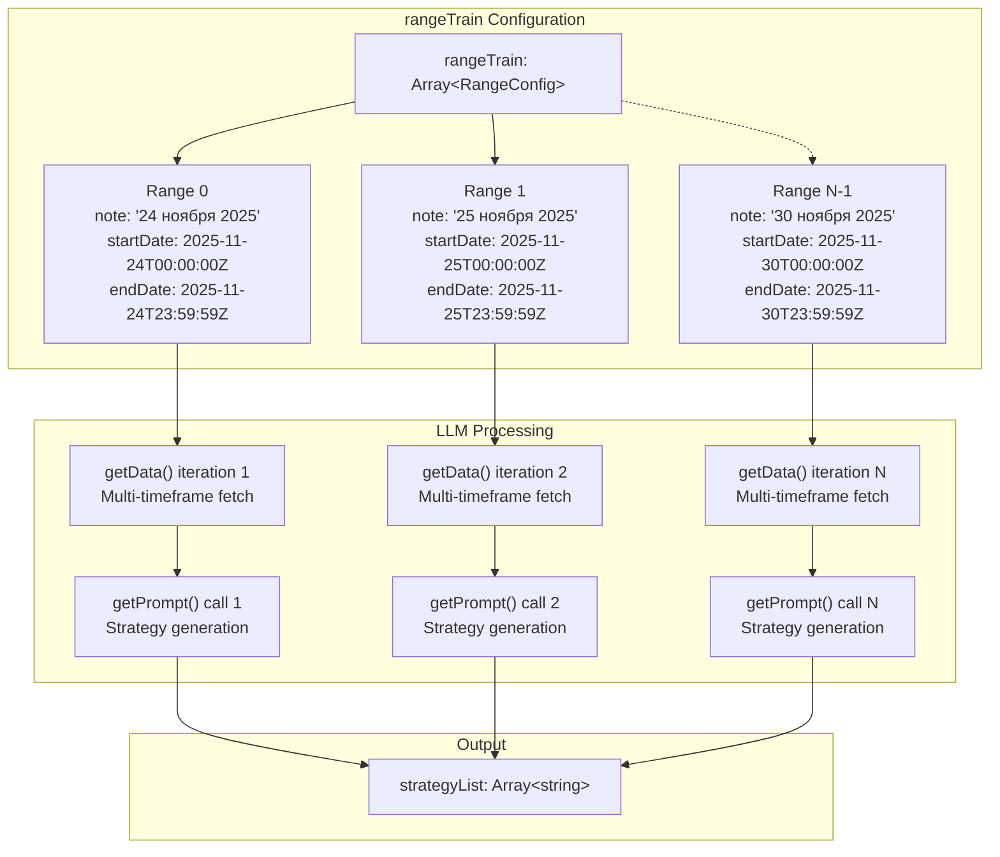
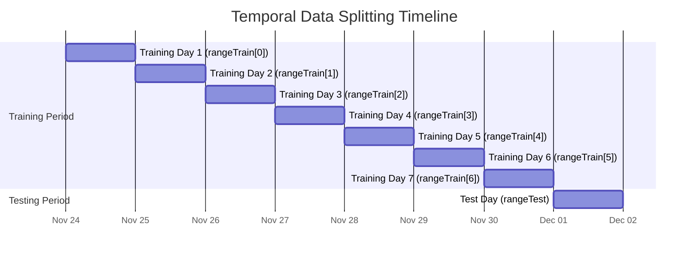
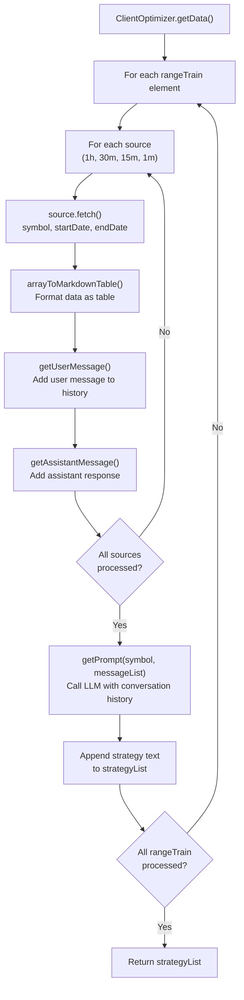
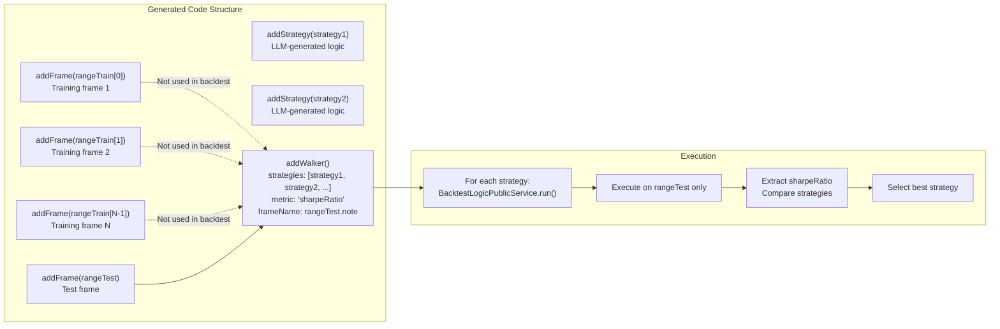
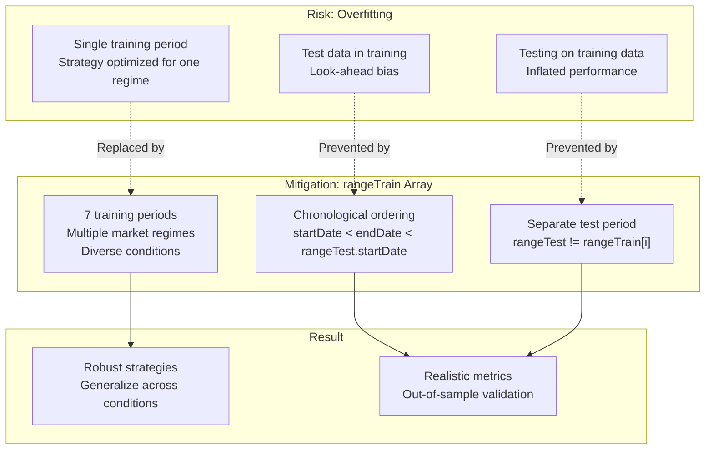
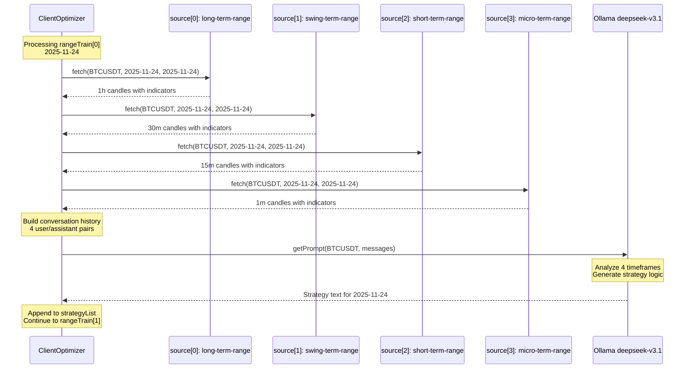

# Training vs Testing Ranges

<details>
<summary>Relevant source files</summary>

The following files were used as context for generating this wiki page:

- [.claude/settings.local.json](.claude/settings.local.json)
- [demo/optimization/.env.example](demo/optimization/.env.example)
- [demo/optimization/.gitignore](demo/optimization/.gitignore)
- [demo/optimization/package-lock.json](demo/optimization/package-lock.json)
- [demo/optimization/package.json](demo/optimization/package.json)
- [demo/optimization/src/index.mjs](demo/optimization/src/index.mjs)
- [demo/trade/.gitkeep](demo/trade/.gitkeep)
- [src/contract/ProgressOptimizer.contract.ts](src/contract/ProgressOptimizer.contract.ts)

</details>


This page documents the `rangeTrain` and `rangeTest` configuration parameters in the Optimizer system, which implement walk-forward validation and temporal data splitting for AI-powered strategy generation. These parameters prevent overfitting by segregating historical data into training periods (where the LLM learns market patterns) and testing periods (where generated strategies are validated on unseen data).

For information about the complete AI optimization pipeline, see [AI-Powered Strategy Optimization](#16.5). For details about LLM integration and prompt engineering, see [LLM Integration](#16.5.3). For strategy code generation, see [Strategy Code Generation](#16.5.4).

---

## Purpose and Overview

The Optimizer system uses temporal data splitting to generate robust trading strategies through supervised learning. The `rangeTrain` array defines multiple historical date ranges that the LLM analyzes to identify market patterns, while `rangeTest` defines a separate chronologically-later period for out-of-sample validation. This approach mirrors the train-test split methodology in machine learning, adapted for time-series financial data where temporal ordering must be preserved.

**Sources:** [demo/optimization/src/index.mjs:19-61]()

---

## Configuration Structure

### RangeTrain Array

The `rangeTrain` parameter is an array of date range objects, each representing a distinct training period. Each object contains:

| Field | Type | Description |
|-------|------|-------------|
| `note` | `string` | Human-readable description of the period |
| `startDate` | `Date` | Beginning of the training period (inclusive) |
| `endDate` | `Date` | End of the training period (inclusive) |



**Sources:** [demo/optimization/src/index.mjs:19-55]()

---

### RangeTest Object

The `rangeTest` parameter is a single date range object with identical structure to each `rangeTrain` element. It defines the out-of-sample validation period:

```javascript
const TEST_RANGE = {
  note: "1 декабря 2025",
  startDate: new Date("2025-12-01T00:00:00Z"),
  endDate: new Date("2025-12-01T23:59:59Z"),
};
```

This test range must chronologically follow all training ranges to prevent temporal leakage where future information influences strategy generation.

**Sources:** [demo/optimization/src/index.mjs:57-61]()

---

## Temporal Splitting Methodology

### Walk-Forward Validation

The Optimizer implements walk-forward validation where:

1. **Multiple Training Windows**: Each `rangeTrain` element represents a distinct market regime or trading day
2. **Incremental Learning**: The LLM receives separate prompts for each training period, accumulating diverse market conditions
3. **Temporal Ordering**: Training ranges precede the test range chronologically
4. **No Look-Ahead**: The test range contains data unseen during strategy generation



**Sources:** [demo/optimization/src/index.mjs:19-61]()

---

## Data Flow Through Training and Testing

### Training Phase Execution

For each element in the `rangeTrain` array, the Optimizer performs:



Each training range generates one strategy recommendation through multi-timeframe analysis. The LLM receives 4 datasets per training range (1h, 30m, 15m, 1m candles), creating a comprehensive market view before producing strategy logic.

**Sources:** [demo/optimization/src/index.mjs:66-322](), [demo/optimization/src/index.mjs:373-383]()

---

### Testing Phase Execution

After code generation via `OptimizerTemplateService`, the generated strategies are backtested against `rangeTest`:



The Walker compares all generated strategies exclusively on the `rangeTest` period, ensuring performance metrics reflect out-of-sample results. Training frames are included in the generated code but not used during Walker execution.

**Sources:** [demo/optimization/src/index.mjs:376-377]()

---

## Overfitting Prevention

### Temporal Data Segregation

The separation of `rangeTrain` and `rangeTest` prevents several forms of overfitting:

| Overfitting Type | Prevention Mechanism |
|------------------|---------------------|
| **Look-Ahead Bias** | Test range chronologically follows all training ranges |
| **Data Snooping** | LLM never sees test period data during strategy generation |
| **Regime Optimization** | Multiple training days expose diverse market conditions |
| **Strategy Specialization** | Walker validates on unseen data, penalizing overfitted strategies |



**Sources:** [demo/optimization/src/index.mjs:19-61]()

---

## Configuration Example

### Complete Optimizer Setup

The following demonstrates proper `rangeTrain` and `rangeTest` configuration:

```javascript
addOptimizer({
  optimizerName: "btc-optimizer",

  // Training: 7 consecutive days
  rangeTrain: [
    {
      note: "24 ноября 2025",
      startDate: new Date("2025-11-24T00:00:00Z"),
      endDate: new Date("2025-11-24T23:59:59Z"),
    },
    {
      note: "25 ноября 2025",
      startDate: new Date("2025-11-25T00:00:00Z"),
      endDate: new Date("2025-11-25T23:59:59Z"),
    },
    // ... 5 more days
  ],

  // Testing: Next chronological day
  rangeTest: {
    note: "1 декабря 2025",
    startDate: new Date("2025-12-01T00:00:00Z"),
    endDate: new Date("2025-12-01T23:59:59Z"),
  },

  source: SOURCE_LIST,
  getPrompt: async (symbol, messages) => {
    return await text(symbol, messages);
  },
});
```

This configuration trains on November 24-30, 2025 and validates on December 1, 2025, ensuring temporal integrity.

**Sources:** [demo/optimization/src/index.mjs:373-383]()

---

## Integration with Data Sources

### Multi-Timeframe Data Collection

Each training range triggers data collection across all configured sources:



The `startDate` and `endDate` from each training range are passed directly to `source.fetch()` methods, ensuring data alignment with the temporal split.

**Sources:** [demo/optimization/src/index.mjs:66-322]()

---

## Best Practices

### Recommended Configurations

| Configuration | Recommendation | Rationale |
|--------------|---------------|-----------|
| **Number of Training Ranges** | 5-10 periods | Captures diverse market conditions without excessive LLM calls |
| **Range Duration** | 1-7 days | Balances data volume with computational cost |
| **Training-Test Gap** | Consecutive periods | Preserves temporal continuity without artificial gaps |
| **Test Duration** | Same as training ranges | Ensures comparable statistical significance |
| **Chronological Order** | Strictly ascending | Prevents temporal leakage |

### Common Pitfalls

1. **Overlapping Ranges**: Ensure `rangeTrain[i].endDate < rangeTrain[i+1].startDate`
2. **Test Before Training**: Verify `max(rangeTrain[i].endDate) < rangeTest.startDate`
3. **Insufficient Training Data**: Use at least 5 training ranges for robust learning
4. **Test Period Too Long**: Extended test ranges increase overfitting risk through multiple market regimes

**Sources:** [demo/optimization/src/index.mjs:19-61]()

---

## Relationship to Code Generation

The `rangeTrain` and `rangeTest` parameters directly influence the generated code structure. The `OptimizerTemplateService` creates:

```javascript
// Generated by getFrameTemplate() for each rangeTrain element
addFrame({
  frameName: "24 ноября 2025",
  interval: "1m",
  startDate: new Date("2025-11-24T00:00:00Z"),
  endDate: new Date("2025-11-24T23:59:59Z"),
});

// Generated by getFrameTemplate() for rangeTest
addFrame({
  frameName: "1 декабря 2025",
  interval: "1m",
  startDate: new Date("2025-12-01T00:00:00Z"),
  endDate: new Date("2025-12-01T23:59:59Z"),
});

// Generated by getWalkerTemplate() referencing rangeTest.note
addWalker({
  walkerName: "strategy-comparison",
  strategies: ["strategy-1", "strategy-2", "strategy-3"],
  metric: "sharpeRatio",
  exchangeName: "binance",
  frameName: "1 декабря 2025", // References rangeTest.note
});
```

The Walker's `frameName` parameter links to `rangeTest.note`, ensuring backtesting occurs only on the validation period.

**Sources:** [demo/optimization/src/index.mjs:376-377]()

---

## Summary

The `rangeTrain` and `rangeTest` configuration implements walk-forward validation for AI-powered strategy generation:

- **rangeTrain**: Array of chronologically-ordered date ranges for LLM training
- **rangeTest**: Single chronologically-later date range for out-of-sample validation
- **Purpose**: Prevent overfitting through temporal data segregation
- **Execution**: Each training range generates one strategy via multi-timeframe LLM analysis
- **Validation**: Generated strategies compete on the unseen test period
- **Integration**: Walker compares strategies exclusively on `rangeTest` data

This architecture ensures generated strategies demonstrate robust performance on future unseen data rather than memorizing historical patterns.

**Sources:** [demo/optimization/src/index.mjs:19-61](), [demo/optimization/src/index.mjs:373-383]()