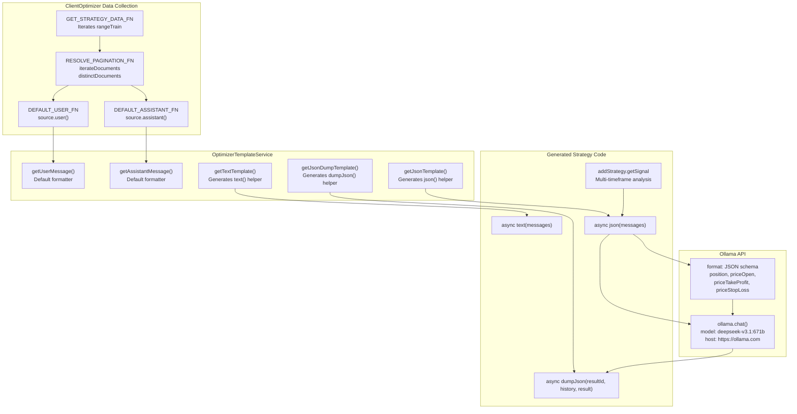
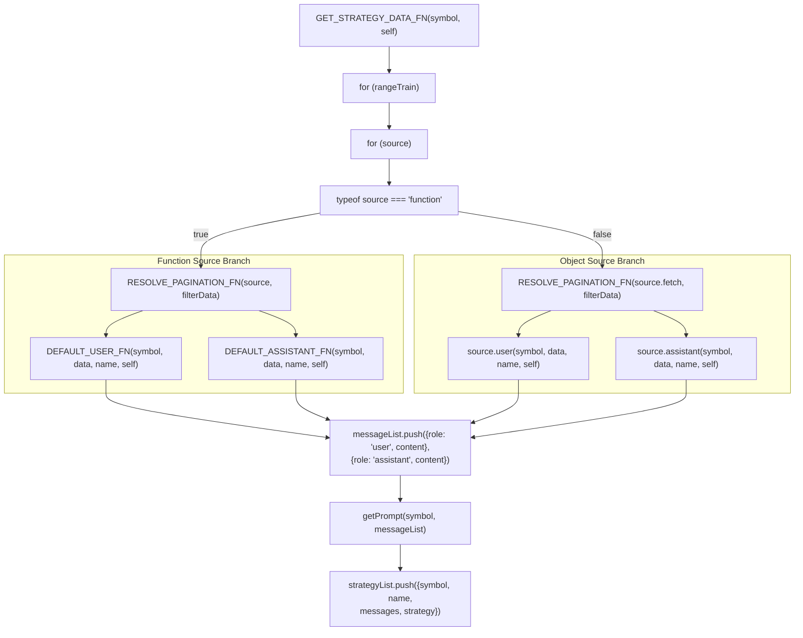
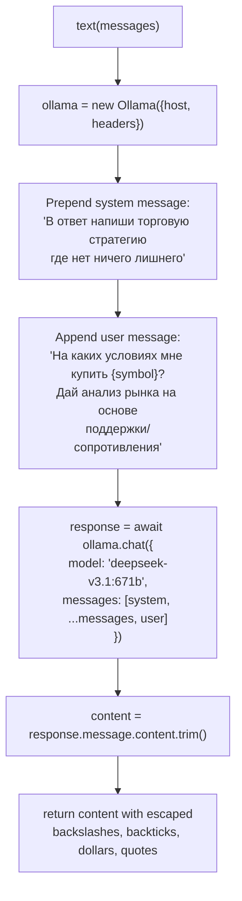
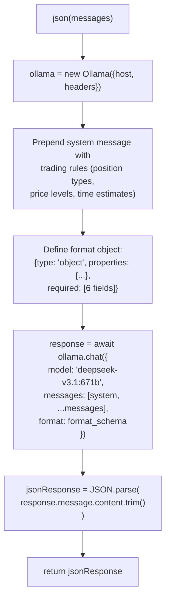
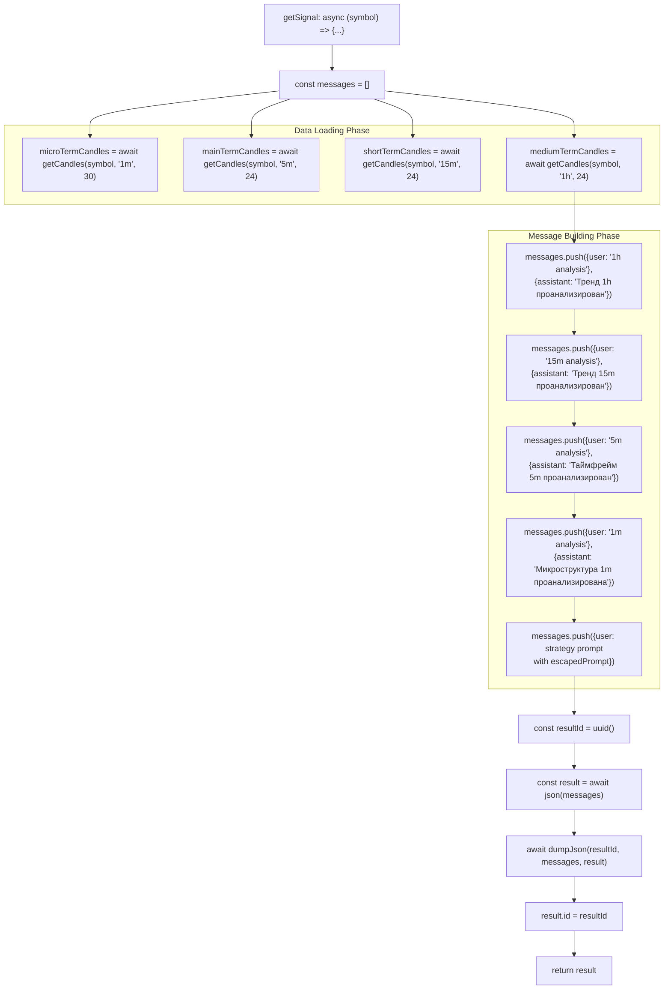
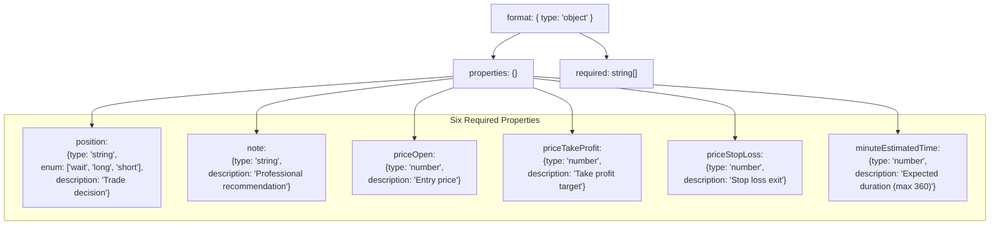
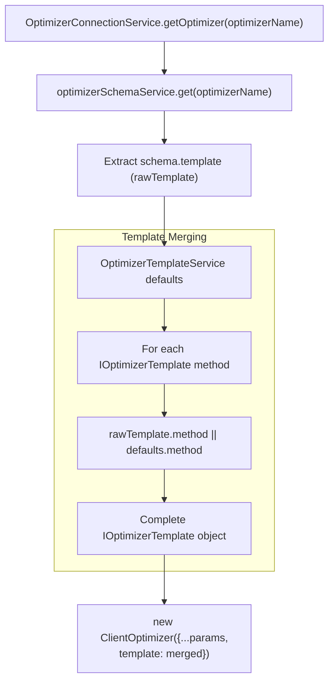
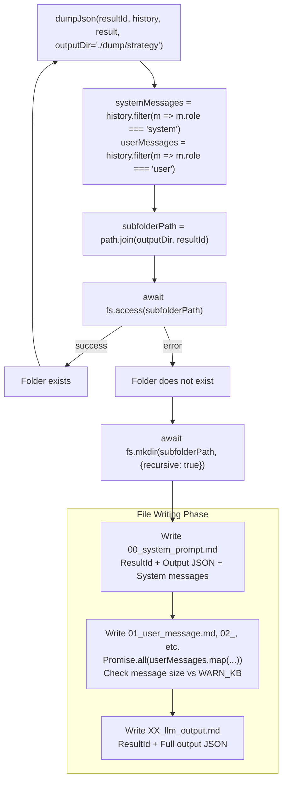
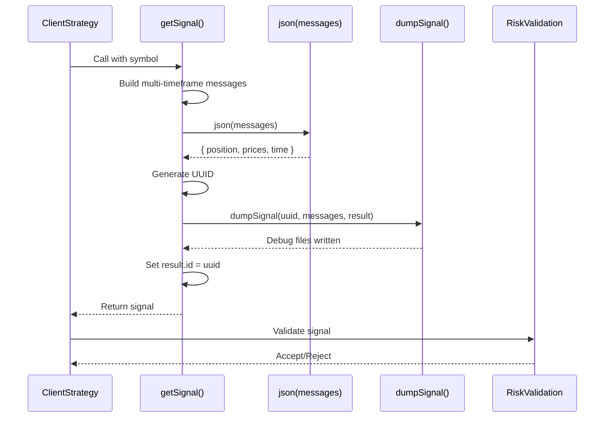

# LLM Integration

<details>
<summary>Relevant source files</summary>

The following files were used as context for generating this wiki page:

- [src/classes/Optimizer.ts](src/classes/Optimizer.ts)
- [src/client/ClientOptimizer.ts](src/client/ClientOptimizer.ts)
- [src/interfaces/Optimizer.interface.ts](src/interfaces/Optimizer.interface.ts)
- [src/lib/services/connection/OptimizerConnectionService.ts](src/lib/services/connection/OptimizerConnectionService.ts)
- [src/lib/services/global/OptimizerGlobalService.ts](src/lib/services/global/OptimizerGlobalService.ts)
- [src/lib/services/schema/OptimizerSchemaService.ts](src/lib/services/schema/OptimizerSchemaService.ts)
- [src/lib/services/template/OptimizerTemplateService.ts](src/lib/services/template/OptimizerTemplateService.ts)
- [src/lib/services/validation/OptimizerValidationService.ts](src/lib/services/validation/OptimizerValidationService.ts)
- [src/model/Message.model.ts](src/model/Message.model.ts)

</details>


This page documents the integration between backtest-kit's Optimizer system and Large Language Models via the Ollama API. The integration is implemented through three core helper functions (`text()`, `json()`, `dumpJson()`) that are generated by `OptimizerTemplateService` and included in every optimizer-generated strategy file.

The LLM integration enables automated strategy generation by processing historical market data through multi-timeframe analysis and producing structured trading signals via JSON schema enforcement.

For information about the overall optimizer architecture, see [Optimizer Architecture](#16.5.1). For details on data source pagination, see [Data Collection Pipeline](#16.5.2). For the complete code generation process, see [Strategy Code Generation](#16.5.4).

---

## Ollama API Integration

The optimizer integrates with **Ollama** hosting the `deepseek-v3.1:671b` model. Authentication uses the `OLLAMA_API_KEY` environment variable. The integration consists of three template methods in `OptimizerTemplateService`:

| Template Method | Generated Function | Purpose |
|-----------------|-------------------|---------|
| `getTextTemplate()` | `text(messages)` | Unstructured market analysis |
| `getJsonTemplate()` | `json(messages)` | Structured signal generation with schema |
| `getJsonDumpTemplate()` | `dumpJson(resultId, history, result)` | Debug output to `./dump/strategy/{uuid}/` |
</thinking>

**Sources:** [src/lib/services/template/OptimizerTemplateService.ts:1-27](), [src/lib/services/template/OptimizerTemplateService.ts:452-546](), [src/lib/services/template/OptimizerTemplateService.ts:555-612](), [src/lib/services/template/OptimizerTemplateService.ts:629-712]()

**LLM Integration Data Flow**



**Sources:** [src/client/ClientOptimizer.ts:99-215](), [src/lib/services/template/OptimizerTemplateService.ts:1-27](), [src/lib/services/template/OptimizerTemplateService.ts:168-304]()

---

## Message Construction in ClientOptimizer

The `GET_STRATEGY_DATA_FN` function in `ClientOptimizer` builds conversation history by iterating through `rangeTrain` and calling `RESOLVE_PAGINATION_FN` for each source. Each source contributes a user-assistant message pair using either custom formatters or defaults from `OptimizerTemplateService`.

**Message Construction Flow in GET_STRATEGY_DATA_FN**



**Sources:** [src/client/ClientOptimizer.ts:99-215]()

**DEFAULT_USER_FN and DEFAULT_ASSISTANT_FN Implementation**

These functions delegate to `OptimizerTemplateService` methods:

| Function | Signature | Delegates To |
|----------|-----------|--------------|
| `DEFAULT_USER_FN` | `(symbol, data, name, self) => Promise<string>` | `self.params.template.getUserMessage(symbol, data, name)` |
| `DEFAULT_ASSISTANT_FN` | `(symbol, data, name, self) => Promise<string>` | `self.params.template.getAssistantMessage(symbol, data, name)` |

**Sources:** [src/client/ClientOptimizer.ts:34-60]()

**MessageModel Interface**

The `MessageModel` type from `src/model/Message.model.ts` defines the conversation structure:

```typescript
interface MessageModel {
  role: "assistant" | "system" | "user";
  content: string;
}
```

**Sources:** [src/model/Message.model.ts:1-26]()

---

## Helper Function Generation

`OptimizerTemplateService` generates three helper functions that are injected into every optimizer-created strategy file. These functions encapsulate Ollama API calls with consistent configuration.

**Generated Helper Functions**

| Template Method | Generated Function | Purpose | Return Type |
|-----------------|-------------------|---------|-------------|
| `getTextTemplate(symbol)` | `async text(messages)` | Unstructured market analysis | `Promise<string>` |
| `getJsonTemplate(symbol)` | `async json(messages)` | Structured signal with JSON schema | `Promise<object>` |
| `getJsonDumpTemplate(symbol)` | `async dumpJson(resultId, history, result)` | Debug logging to disk | `Promise<void>` |

**Ollama Client Configuration in Generated Code**

Both `text()` and `json()` helpers instantiate the Ollama client identically:

```javascript
const ollama = new Ollama({
    host: "https://ollama.com",
    headers: {
        Authorization: `Bearer ${process.env.OLLAMA_API_KEY}`,
    },
});
```

**Sources:** [src/lib/services/template/OptimizerTemplateService.ts:555-574](), [src/lib/services/template/OptimizerTemplateService.ts:629-640]()

**getTextTemplate() - Unstructured Analysis**

The `getTextTemplate()` method generates a `text(messages)` helper for fundamental market analysis. The function prepends system instructions and appends a final user query requesting entry conditions.

**text() Function Structure**



**Sources:** [src/lib/services/template/OptimizerTemplateService.ts:555-612]()

**System Message Content**

The system message instructs the LLM to produce copy-paste ready output:

```
В ответ напиши торговую стратегию где нет ничего лишнего,
только отчёт готовый для копипасты целиком

**ВАЖНО**: Не здоровайся, не говори что делаешь - только отчёт!
```

**Final User Message Template**

The function appends a final user query with the symbol injected via `escapedSymbol`:

```
На каких условиях мне купить ${escapedSymbol}?
Дай анализ рынка на основе поддержки/сопротивления, точек входа в LONG/SHORT позиции.
Какой RR ставить для позиций?
Предпочтительны LONG или SHORT позиции?

Сделай не сухой технический, а фундаментальный анализ, содержащий стратигическую рекомендацию
```

**Sources:** [src/lib/services/template/OptimizerTemplateService.ts:581-599]()

**getJsonTemplate() - Structured Signal Generation**

The `getJsonTemplate()` method generates a `json(messages)` helper that enforces a JSON schema for trading signals. This is the primary function called in generated `addStrategy.getSignal()` implementations.

**json() Function Structure**



**Sources:** [src/lib/services/template/OptimizerTemplateService.ts:629-712]()

**ollama.chat() Parameters**

The `json()` helper calls `ollama.chat()` with the `format` parameter to enforce schema:

| Parameter | Value |
|-----------|-------|
| `model` | `"deepseek-v3.1:671b"` |
| `messages` | `[{role: "system", content}, ...messages]` |
| `format` | JSON schema object with 6 required properties |

**Sources:** [src/lib/services/template/OptimizerTemplateService.ts:642-706]()

---

## Multi-Timeframe Analysis in getStrategyTemplate()

The `getStrategyTemplate()` method generates `addStrategy()` calls where `getSignal()` implements a progressive multi-timeframe analysis. The function calls `getCandles()` four times and builds a `messages` array with five user-assistant message pairs before calling `json(messages)`.

**getSignal() Execution Flow**



**Sources:** [src/lib/services/template/OptimizerTemplateService.ts:194-302]()

**Timeframe Parameters**

| Variable Name | Interval | Count | Comment in Code |
|---------------|----------|-------|-----------------|
| `mediumTermCandles` | `"1h"` | `24` | `// Сообщение 1: Среднесрочный тренд` |
| `shortTermCandles` | `"15m"` | `24` | `// Сообщение 2: Краткосрочный тренд` |
| `mainTermCandles` | `"5m"` | `24` | `// Сообщение 3: Основной таймфрейм` |
| `microTermCandles` | `"1m"` | `30` | `// Сообщение 4: Микро-структура` |

**Sources:** [src/lib/services/template/OptimizerTemplateService.ts:202-205]()

**formatCandles() Local Function**

The generated code includes a local `formatCandles()` function for consistent OHLCV formatting:

```javascript
function formatCandles(candles, timeframe) {
    return candles.map((c) =>
        `${new Date(c.timestamp).toISOString()}[${timeframe}]: O:${c.open} H:${c.high} L:${c.low} C:${c.close} V:${c.volume}`
    ).join("\n");
}
```

**Sources:** [src/lib/services/template/OptimizerTemplateService.ts:207-211]()

---

## JSON Schema Enforcement in json() Helper

The `json()` helper function passes a `format` parameter to `ollama.chat()` that defines a strict JSON schema. Ollama's JSON mode ensures the LLM output conforms to the schema structure.

**ollama.chat() format Parameter Structure**



**Sources:** [src/lib/services/template/OptimizerTemplateService.ts:675-705]()

**Schema Property Definitions**

The schema enforces six required fields with specific types and descriptions:

| Property Name | Type | Enum Values | Description Field |
|---------------|------|-------------|-------------------|
| `position` | `"string"` | `["wait", "long", "short"]` | `"Trade decision: wait (no signal), long (buy), or short (sell)"` |
| `note` | `"string"` | - | `"Professional trading recommendation with price levels"` |
| `priceOpen` | `"number"` | - | `"Entry price (current market price or limit order price)"` |
| `priceTakeProfit` | `"number"` | - | `"Take profit target price"` |
| `priceStopLoss` | `"number"` | - | `"Stop loss exit price"` |
| `minuteEstimatedTime` | `"number"` | - | `"Expected time to reach TP in minutes (max 360)"` |

**Sources:** [src/lib/services/template/OptimizerTemplateService.ts:677-703]()

**System Message Content**

The system message in `json()` provides detailed trading rules split into four sections:

| Section | Key Content |
|---------|-------------|
| ТИПЫ ПОЗИЦИЙ | `position='wait'`: no signal, `position='long'`: bullish, `position='short'`: bearish |
| ЦЕНА ВХОДА (priceOpen) | Can be current market price or limit order price based on technical analysis |
| УРОВНИ ВЫХОДА | LONG: `priceTakeProfit > priceOpen > priceStopLoss`, SHORT: `priceStopLoss > priceOpen > priceTakeProfit` |
| ВРЕМЕННЫЕ РАМКИ | `minuteEstimatedTime` based on ATR, ADX, MACD, Momentum, Slope (max 360) |

**Sources:** [src/lib/services/template/OptimizerTemplateService.ts:647-671]()

---

## Template Override System

`OptimizerTemplateService` provides defaults for all `IOptimizerTemplate` methods. These can be overridden at the schema level (`IOptimizerSchema.template`) or per-source level (`IOptimizerSource.user`/`assistant`).

**Template Method Resolution in OptimizerConnectionService**



**Sources:** [src/lib/services/connection/OptimizerConnectionService.ts:59-113]()

**IOptimizerTemplate Method List**

The service provides defaults for eleven template methods:

| Method Name | Default Return | Purpose |
|-------------|----------------|---------|
| `getUserMessage(symbol, data, name)` | `"Прочитай данные и скажи ОК\n\n" + JSON.stringify(data)` | User message formatter |
| `getAssistantMessage(symbol, data, name)` | `"ОК"` | Assistant message formatter |
| `getTopBanner(symbol)` | Shebang + imports + WARN_KB | File header |
| `getTextTemplate(symbol)` | `async function text(messages) {...}` | LLM text analysis helper |
| `getJsonTemplate(symbol)` | `async function json(messages) {...}` | LLM JSON schema helper |
| `getJsonDumpTemplate(symbol)` | `async function dumpJson(...) {...}` | Debug output helper |
| `getExchangeTemplate(symbol, exchangeName)` | `addExchange({...})` | CCXT Binance integration |
| `getFrameTemplate(symbol, frameName, ...)` | `addFrame({...})` | Timeframe configuration |
| `getStrategyTemplate(strategyName, interval, prompt)` | `addStrategy({...})` | Strategy with getSignal |
| `getWalkerTemplate(walkerName, ...)` | `addWalker({...})` | Strategy comparison |
| `getLauncherTemplate(symbol, walkerName)` | `Walker.background(...) + listeners` | Execution and event handling |

**Sources:** [src/lib/services/template/OptimizerTemplateService.ts:27-716]()

**Override Levels**

Custom formatters can be provided at two granularities:

| Level | Interface | Override Fields | Scope |
|-------|-----------|-----------------|-------|
| Schema Level | `IOptimizerSchema.template` | `Partial<IOptimizerTemplate>` | All sources in this optimizer |
| Source Level | `IOptimizerSource.user/assistant` | `(symbol, data, name) => string \| Promise<string>` | Specific source only |

**Sources:** [src/interfaces/Optimizer.interface.ts:129-177](), [src/interfaces/Optimizer.interface.ts:426-427]()

---

## Debug Logging with dumpJson()

The `getJsonDumpTemplate()` method generates an `async dumpJson(resultId, history, result, outputDir)` function that writes conversation history and LLM output to `./dump/strategy/{resultId}/`. This function is called in every generated `getSignal()` implementation.

**dumpJson() Execution Flow**



**Sources:** [src/lib/services/template/OptimizerTemplateService.ts:457-544]()

**Generated File Structure**

| Filename Pattern | Content Description | Line Range |
|------------------|---------------------|------------|
| `00_system_prompt.md` | ResultId, output JSON, all system messages | [src/lib/services/template/OptimizerTemplateService.ts:470-498]() |
| `01_user_message.md`, `02_user_message.md`, ... | ResultId, user input N, size check via `Buffer.byteLength()` | [src/lib/services/template/OptimizerTemplateService.ts:500-525]() |
| `XX_llm_output.md` (where XX = userMessages.length + 1) | ResultId, full output JSON | [src/lib/services/template/OptimizerTemplateService.ts:527-543]() |

**Sources:** [src/lib/services/template/OptimizerTemplateService.ts:452-546]()

**WARN_KB Threshold**

The constant `WARN_KB = 100` (KB) is checked for each user message:

```javascript
const messageSizeBytes = Buffer.byteLength(message.content, "utf8");
const messageSizeKb = Math.floor(messageSizeBytes / 1024);
if (messageSizeKb > WARN_KB) {
    console.warn(
        `User message ${idx + 1} is ${messageSizeBytes} bytes (${messageSizeKb}kb), which exceeds warning limit`
    );
}
```

**Sources:** [src/lib/services/template/OptimizerTemplateService.ts:64](), [src/lib/services/template/OptimizerTemplateService.ts:508-515]()

**Return Early Logic**

If the `resultId` folder already exists, `dumpJson()` returns immediately without writing files. This prevents overwriting debug output on subsequent calls with the same UUID.

**Sources:** [src/lib/services/template/OptimizerTemplateService.ts:463-467]()

---

## Integration with Strategy Execution

The generated LLM-based strategies integrate seamlessly with the backtest-kit execution framework. The `getSignal()` function calls `json(messages)` to get trading signals, which are then validated and executed.

**Signal Execution Flow**



**Generated Strategy Example**

The optimizer generates strategies that follow this pattern:

```javascript
addStrategy({
    strategyName: "xyz_strategy-1",
    interval: "5m",
    getSignal: async (symbol) => {
        const messages = [];
        
        // 1-4: Multi-timeframe data loading
        const microTermCandles = await getCandles(symbol, "1m", 30);
        const mainTermCandles = await getCandles(symbol, "5m", 24);
        // ... build messages array
        
        // 5: Request signal with strategy prompt
        messages.push({ role: "user", content: strategyPrompt });
        
        const resultId = uuid();
        const result = await json(messages);
        await dumpJson(resultId, messages, result);
        
        result.id = resultId;
        return result;
    },
});
```

**Sources:** [demo/backtest/src/index.mjs:91-106](), [demo/live/src/index.mjs:87-102](), [src/lib/services/template/OptimizerTemplateService.ts:168-304]()