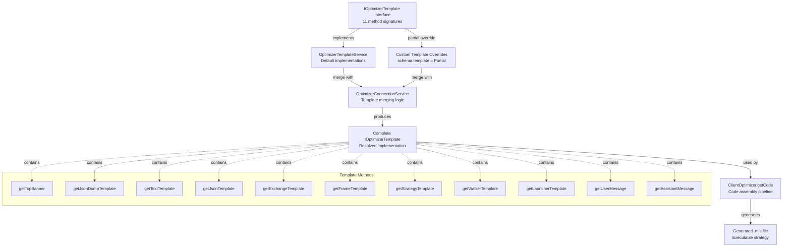
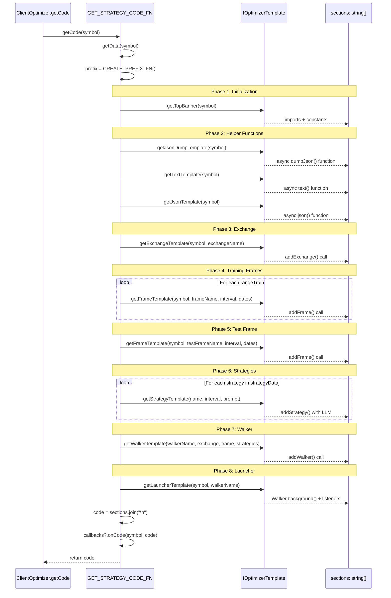
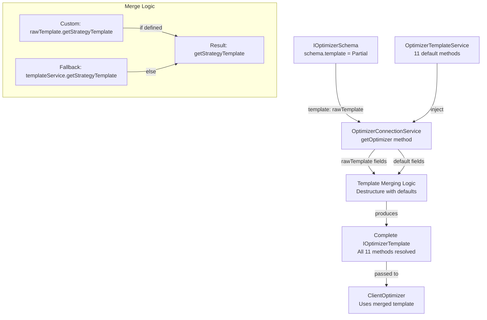
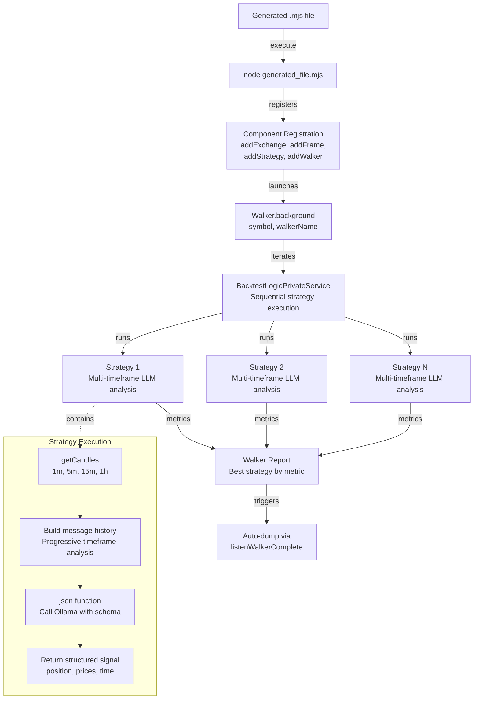

# Strategy Code Generation

<details>
<summary>Relevant source files</summary>

The following files were used as context for generating this wiki page:

- [src/classes/Optimizer.ts](src/classes/Optimizer.ts)
- [src/client/ClientOptimizer.ts](src/client/ClientOptimizer.ts)
- [src/interfaces/Optimizer.interface.ts](src/interfaces/Optimizer.interface.ts)
- [src/lib/services/connection/OptimizerConnectionService.ts](src/lib/services/connection/OptimizerConnectionService.ts)
- [src/lib/services/global/OptimizerGlobalService.ts](src/lib/services/global/OptimizerGlobalService.ts)
- [src/lib/services/schema/OptimizerSchemaService.ts](src/lib/services/schema/OptimizerSchemaService.ts)
- [src/lib/services/template/OptimizerTemplateService.ts](src/lib/services/template/OptimizerTemplateService.ts)
- [src/lib/services/validation/OptimizerValidationService.ts](src/lib/services/validation/OptimizerValidationService.ts)
- [src/model/Message.model.ts](src/model/Message.model.ts)

</details>


This page documents the code generation system used by the Optimizer to produce executable trading strategy scripts. The generation process transforms collected data and LLM conversation histories into standalone Node.js files that implement multi-timeframe trading strategies with Walker-based comparison.

For information about data collection and LLM integration, see [AI-Powered Strategy Optimization](#16.5). For details on prompt engineering and conversation building, see [LLM Integration](#16.5.3). For information about walk-forward validation, see [Training vs Testing Ranges](#16.5.5).

## Template System Architecture

The code generation system uses a template-based approach where 11 distinct template methods produce individual code sections. These sections are assembled in a specific order by `ClientOptimizer.getCode()` to create a complete executable file.

### IOptimizerTemplate Interface

The template system is defined by the `IOptimizerTemplate` interface, which specifies 11 methods that each generate a specific section of the output file. Default implementations are provided by `OptimizerTemplateService`, but any method can be overridden in the optimizer schema configuration.

**Template Methods by Category:**

| Category | Method | Purpose | Output Type |
|----------|--------|---------|-------------|
| **Initialization** | `getTopBanner()` | Shebang, imports, constants | ES module header |
| **Helper Functions** | `getJsonDumpTemplate()` | Debug output writer | Async function |
| | `getTextTemplate()` | LLM text generation | Async function |
| | `getJsonTemplate()` | LLM structured output | Async function |
| **Component Config** | `getExchangeTemplate()` | Exchange integration | `addExchange()` call |
| | `getFrameTemplate()` | Timeframe definition | `addFrame()` call |
| | `getStrategyTemplate()` | Strategy with LLM | `addStrategy()` call |
| | `getWalkerTemplate()` | Strategy comparison | `addWalker()` call |
| **Execution** | `getLauncherTemplate()` | Walker launcher + listeners | `Walker.background()` + event handlers |
| **Conversation** | `getUserMessage()` | Data prompt formatting | String content |
| | `getAssistantMessage()` | LLM response formatting | String content |

**Template System Diagram:**



Sources: [src/interfaces/Optimizer.interface.ts:238-374](), [src/lib/services/template/OptimizerTemplateService.ts:14-26](), [src/lib/services/connection/OptimizerConnectionService.ts:59-112]()

## Template Method Reference

Each template method generates a specific code section with consistent escaping and formatting. All methods accept `symbol` as the first parameter and return a string (or Promise resolving to string) containing valid TypeScript/JavaScript code.

### Initialization Templates

#### getTopBanner

Generates the file header with shebang, imports, and constants.

**Signature:**
```typescript
getTopBanner(symbol: string): Promise<string>
```

**Output Structure:**
- Shebang line (`#!/usr/bin/env node`)
- Ollama import for LLM integration
- CCXT import for exchange connectivity
- backtest-kit imports (strategy registration, execution, listeners)
- Node.js built-in imports (`fs/promises`, `path`)
- UUID import for debug file naming
- `WARN_KB` constant for message size warnings

**Implementation:** [src/lib/services/template/OptimizerTemplateService.ts:35-65]()

### Helper Function Templates

#### getJsonDumpTemplate

Generates the `dumpJson()` helper function for debugging LLM conversations. Creates a directory structure under `./dump/strategy/{resultId}/` containing:
- `00_system_prompt.md` - System messages and output data
- `{nn}_user_message.md` - User input messages by sequence
- `{nn}_llm_output.md` - Final LLM response

The function checks for message size and warns if any exceed `WARN_KB` (100 KB).

**Signature:**
```typescript
getJsonDumpTemplate(symbol: string): Promise<string>
```

**Implementation:** [src/lib/services/template/OptimizerTemplateService.ts:446-540]()

#### getTextTemplate

Generates the `text()` helper function for free-form LLM strategy generation. Uses Ollama's `deepseek-v3.1:671b` model with a system prompt that requests concise trading strategy reports without greetings or explanations.

The function:
- Initializes Ollama client with API key from environment
- Injects system prompt requesting strategy-only output
- Appends user query for market analysis (support/resistance, LONG/SHORT entry points, risk/reward ratios)
- Requests fundamental analysis rather than dry technical analysis
- Returns escaped content suitable for template literal insertion

**Signature:**
```typescript
getTextTemplate(symbol: string): Promise<string>
```

**Implementation:** [src/lib/services/template/OptimizerTemplateService.ts:549-606]()

#### getJsonTemplate

Generates the `json()` helper function for structured signal generation. Uses JSON schema enforcement to produce signals with:
- `position`: "wait" | "long" | "short"
- `note`: Professional trading recommendation
- `priceOpen`: Entry price (market or limit)
- `priceTakeProfit`: Target price
- `priceStopLoss`: Stop price
- `minuteEstimatedTime`: Expected duration (max 360 minutes)

The system prompt includes detailed rules for:
- Position type selection criteria
- Entry price determination (immediate or deferred)
- Exit level calculation (must follow LONG/SHORT logic)
- Time estimation using technical indicators

**Signature:**
```typescript
getJsonTemplate(symbol: string): Promise<string>
```

**Implementation:** [src/lib/services/template/OptimizerTemplateService.ts:623-706]()

### Component Configuration Templates

#### getExchangeTemplate

Generates `addExchange()` call with CCXT Binance integration. Includes:
- `getCandles()`: Fetches OHLCV data via `fetchOHLCV()`
- `formatPrice()`: Two decimal places
- `formatQuantity()`: Eight decimal places

The exchange name is dynamically generated with a random prefix to avoid collisions.

**Signature:**
```typescript
getExchangeTemplate(symbol: string, exchangeName: ExchangeName): Promise<string>
```

**Implementation:** [src/lib/services/template/OptimizerTemplateService.ts:308-336]()

#### getFrameTemplate

Generates `addFrame()` call defining a backtest timeframe. Parameters are escaped to prevent code injection attacks.

**Signature:**
```typescript
getFrameTemplate(
  symbol: string,
  frameName: string,
  interval: CandleInterval,
  startDate: Date,
  endDate: Date
): Promise<string>
```

**Implementation:** [src/lib/services/template/OptimizerTemplateService.ts:348-379]()

#### getStrategyTemplate

Generates `addStrategy()` call with multi-timeframe LLM integration. The strategy's `getSignal()` function:
1. Fetches candles from four timeframes (1m, 5m, 15m, 1h)
2. Formats candles as markdown with timestamps
3. Builds message history with progressive timeframe analysis:
   - Message 1-2: Medium-term trend (1h)
   - Message 3-4: Short-term trend (15m)
   - Message 5-6: Primary timeframe (5m)
   - Message 7-8: Micro-structure (1m)
   - Message 9: Final signal request with injected strategy prompt
4. Calls `json(messages)` to get structured signal
5. Calls `dumpJson()` to save conversation for debugging

The strategy prompt from `getPrompt()` is escaped and injected into the final message, creating a feedback loop where the LLM both designed the strategy and executes it.

**Signature:**
```typescript
getStrategyTemplate(
  strategyName: string,
  interval: string,
  prompt: string
): Promise<string>
```

**Implementation:** [src/lib/services/template/OptimizerTemplateService.ts:167-298]()

#### getWalkerTemplate

Generates `addWalker()` call for strategy comparison. References:
- Walker name (with random prefix)
- Exchange name
- Test frame name
- Array of strategy names to compare

All strings are escaped to prevent injection.

**Signature:**
```typescript
getWalkerTemplate(
  walkerName: string,
  exchangeName: string,
  frameName: string,
  strategies: string[]
): Promise<string>
```

**Implementation:** [src/lib/services/template/OptimizerTemplateService.ts:121-156]()

### Execution Templates

#### getLauncherTemplate

Generates Walker execution code with comprehensive event listeners:
- `Walker.background()`: Async execution
- `listenSignalBacktest()`: Log each signal
- `listenBacktestProgress()`: Progress percentage and frame counts
- `listenWalkerProgress()`: Strategy comparison progress
- `listenWalkerComplete()`: Final results and auto-dump
- `listenDoneBacktest()`: Individual strategy completion
- `listenError()`: Error handling

**Signature:**
```typescript
getLauncherTemplate(symbol: string, walkerName: string): Promise<string>
```

**Implementation:** [src/lib/services/template/OptimizerTemplateService.ts:389-437]()

### Conversation Formatting Templates

#### getUserMessage

Formats data from a source into a user message for LLM conversation. Default implementation creates a simple prompt with JSON serialized data.

**Signature:**
```typescript
getUserMessage<Data extends IOptimizerData>(
  symbol: string,
  data: Data[],
  name: string
): Promise<string>
```

**Implementation:** [src/lib/services/template/OptimizerTemplateService.ts:76-87]()

#### getAssistantMessage

Formats the expected assistant response for a data source. Default implementation returns a simple acknowledgment ("ОК").

**Signature:**
```typescript
getAssistantMessage<Data extends IOptimizerData>(
  symbol: string,
  data: Data[],
  name: string
): Promise<string>
```

**Implementation:** [src/lib/services/template/OptimizerTemplateService.ts:98-109]()

## Code Assembly Pipeline

The assembly pipeline in `GET_STRATEGY_CODE_FN` calls template methods in a specific sequence to build a complete executable file. The function generates unique prefixes for component names to prevent collisions between generated files.

**Assembly Sequence Diagram:**



**Pipeline Implementation Details:**

The assembly pipeline consists of 9 sequential phases:

1. **Top Banner** - Imports and constants [src/client/ClientOptimizer.ts:233-236]()
2. **JSON Dump Helper** - Debug output function [src/client/ClientOptimizer.ts:239-242]()
3. **Helper Functions** - text() and json() LLM wrappers [src/client/ClientOptimizer.ts:245-253]()
4. **Exchange Configuration** - CCXT integration [src/client/ClientOptimizer.ts:256-264]()
5. **Training Frames** - One per rangeTrain entry [src/client/ClientOptimizer.ts:267-282]()
6. **Test Frame** - Single validation frame [src/client/ClientOptimizer.ts:285-297]()
7. **Strategy Definitions** - One per generated strategy [src/client/ClientOptimizer.ts:300-314]()
8. **Walker Configuration** - Strategy comparison setup [src/client/ClientOptimizer.ts:317-332]()
9. **Launcher Code** - Execution and event listeners [src/client/ClientOptimizer.ts:335-341]()

Each section is separated by empty lines for readability. The `CREATE_PREFIX_FN()` generates a random 7-character identifier that prefixes all component names to ensure uniqueness.

Sources: [src/client/ClientOptimizer.ts:225-350]()

## Template Customization

Templates can be partially overridden in the optimizer schema by providing a `template` field with custom implementations. The `OptimizerConnectionService` merges custom templates with defaults from `OptimizerTemplateService`.

**Template Merging Diagram:**



**Example: Custom Strategy Template**

```typescript
addOptimizer({
  optimizerName: "my-optimizer",
  rangeTrain: [/* ... */],
  rangeTest: {/* ... */},
  source: [/* ... */],
  getPrompt: async (symbol, messages) => {/* ... */},
  template: {
    // Override only getStrategyTemplate
    getStrategyTemplate: async (strategyName, interval, prompt) => {
      return `
        addStrategy({
          strategyName: "${strategyName}",
          interval: "${interval}",
          getSignal: async (symbol) => {
            // Custom implementation without LLM
            const candles = await getCandles(symbol, "1m", 50);
            // ... custom logic
            return signal;
          },
        });
      `;
    },
    // All other methods use defaults
  },
});
```

The merging process uses destructuring with default fallbacks:

```typescript
const {
  getAssistantMessage = this.optimizerTemplateService.getAssistantMessage,
  getExchangeTemplate = this.optimizerTemplateService.getExchangeTemplate,
  // ... all 11 methods
} = rawTemplate;
```

This pattern allows selective override of any template method while maintaining defaults for others.

Sources: [src/lib/services/connection/OptimizerConnectionService.ts:62-97](), [src/interfaces/Optimizer.interface.ts:426-427]()

## Generated Code Structure

The generated file follows a consistent structure designed for immediate execution. All components are configured in the correct order to satisfy dependency requirements.

**Generated File Structure:**

```
#!/usr/bin/env node

// Imports (Ollama, CCXT, backtest-kit, fs, path, uuid)

const WARN_KB = 100;

// Helper Functions
async function dumpJson(resultId, history, result, outputDir) { /* ... */ }
async function text(messages) { /* ... */ }
async function json(messages) { /* ... */ }

// Exchange Configuration
addExchange({ exchangeName: "{prefix}_exchange", getCandles: ..., formatPrice: ..., formatQuantity: ... });

// Training Frames
addFrame({ frameName: "{prefix}_train_frame-1", interval: "1m", startDate: ..., endDate: ... });
addFrame({ frameName: "{prefix}_train_frame-2", interval: "1m", startDate: ..., endDate: ... });
// ... more training frames

// Test Frame
addFrame({ frameName: "{prefix}_test_frame", interval: "1m", startDate: ..., endDate: ... });

// Strategies
addStrategy({ strategyName: "{prefix}_strategy-1", interval: "5m", getSignal: async (symbol) => { /* LLM integration */ } });
addStrategy({ strategyName: "{prefix}_strategy-2", interval: "5m", getSignal: async (symbol) => { /* LLM integration */ } });
// ... more strategies

// Walker Configuration
addWalker({ walkerName: "{prefix}_walker", exchangeName: "{prefix}_exchange", frameName: "{prefix}_test_frame", strategies: [...] });

// Launcher
Walker.background(symbol, { walkerName: "{prefix}_walker" });
listenSignalBacktest((event) => { console.log(event); });
listenBacktestProgress((event) => { /* ... */ });
listenWalkerProgress((event) => { /* ... */ });
listenWalkerComplete((results) => { /* ... */ });
listenDoneBacktest((event) => { /* ... */ });
listenError((error) => { /* ... */ });
```

**Naming Conventions:**

- `{prefix}`: Random 7-character string from `CREATE_PREFIX_FN()`
- Exchange: `{prefix}_exchange`
- Train frames: `{prefix}_train_frame-{n}` (n = 1-based index)
- Test frame: `{prefix}_test_frame`
- Strategies: `{prefix}_strategy-{n}` (n = 1-based index)
- Walker: `{prefix}_walker`

The prefix ensures that multiple generated files can coexist in the same codebase without naming conflicts.

Sources: [src/client/ClientOptimizer.ts:225-350]()

## Security and Escaping

All template methods implement string escaping to prevent code injection attacks. User-controlled strings (symbol, names, prompts) are escaped before insertion into generated code.

**Escape Patterns by Template:**

| Template | Escaped Parameters | Escape Pattern |
|----------|-------------------|----------------|
| `getWalkerTemplate` | walkerName, exchangeName, frameName, strategies | Backslash: `\\`, Quote: `\"` |
| `getStrategyTemplate` | strategyName, interval, prompt | Backslash: `\\`, Quote: `\"`, Backtick: `` \` ``, Dollar: `\$` |
| `getExchangeTemplate` | exchangeName | Backslash: `\\`, Quote: `\"` |
| `getFrameTemplate` | frameName, interval | Backslash: `\\`, Quote: `\"` |
| `getLauncherTemplate` | symbol, walkerName | Backslash: `\\`, Quote: `\"` |
| `getTextTemplate` | symbol | Backslash: `\\`, Backtick: `` \` ``, Dollar: `\$` |

**Example from getStrategyTemplate:**

```typescript
const escapedPrompt = String(prompt)
  .replace(/\\/g, '\\\\')
  .replace(/`/g, '\\`')
  .replace(/\$/g, '\\$');
```

The prompt escaping is particularly important since it contains LLM-generated content that will be embedded in a template literal. Without proper escaping, malicious content could break out of the string context.

Sources: [src/lib/services/template/OptimizerTemplateService.ts:135-146](), [src/lib/services/template/OptimizerTemplateService.ts:179-188](), [src/lib/services/template/OptimizerTemplateService.ts:318-320](), [src/lib/services/template/OptimizerTemplateService.ts:364-369](), [src/lib/services/template/OptimizerTemplateService.ts:396-401](), [src/lib/services/template/OptimizerTemplateService.ts:554-559]()

## Integration with Execution Pipeline

The generated code integrates seamlessly with backtest-kit's execution modes. The Walker configuration uses the test frame to validate all generated strategies, producing a comparative report.

**Execution Flow:**



The generated strategies use environment-based authentication (`process.env.OLLAMA_API_KEY`) for Ollama API access, allowing the same code to run in different environments without modification.

Sources: [src/lib/services/template/OptimizerTemplateService.ts:389-437](), [src/lib/services/template/OptimizerTemplateService.ts:562-567](), [src/lib/services/template/OptimizerTemplateService.ts:629-634]()