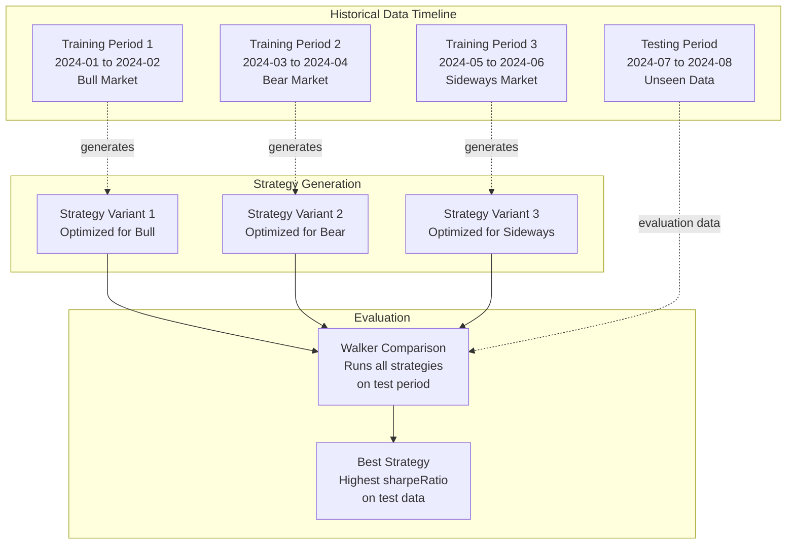
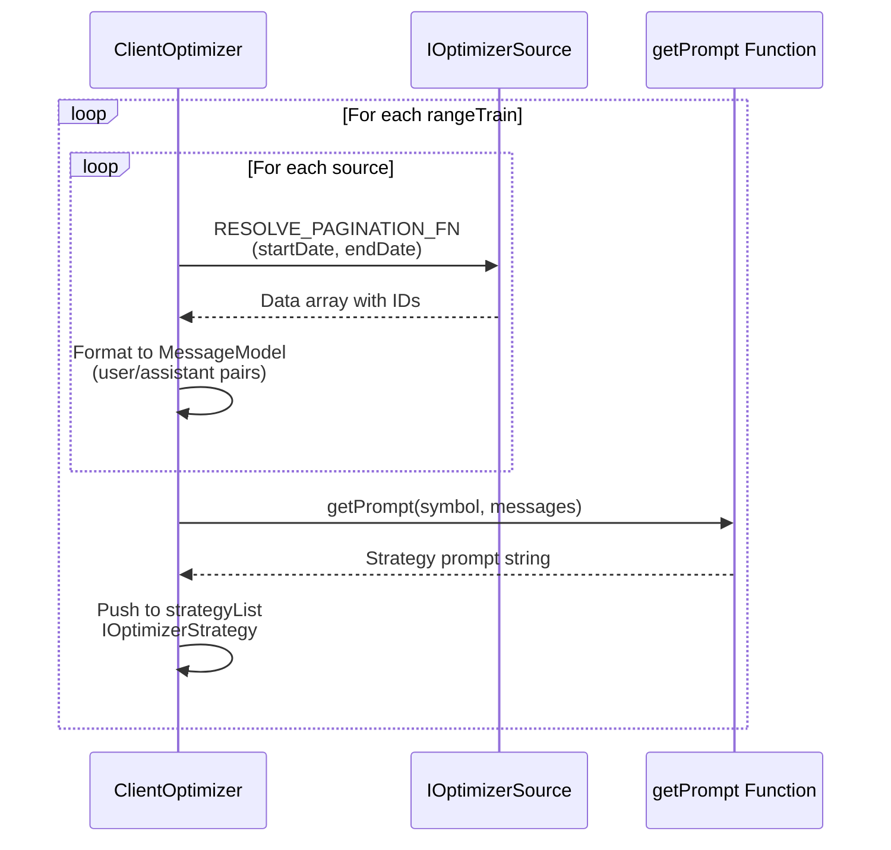
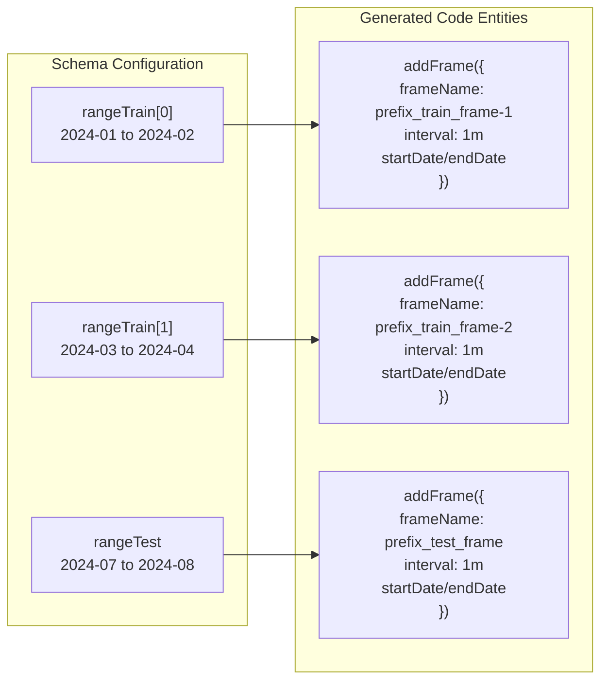
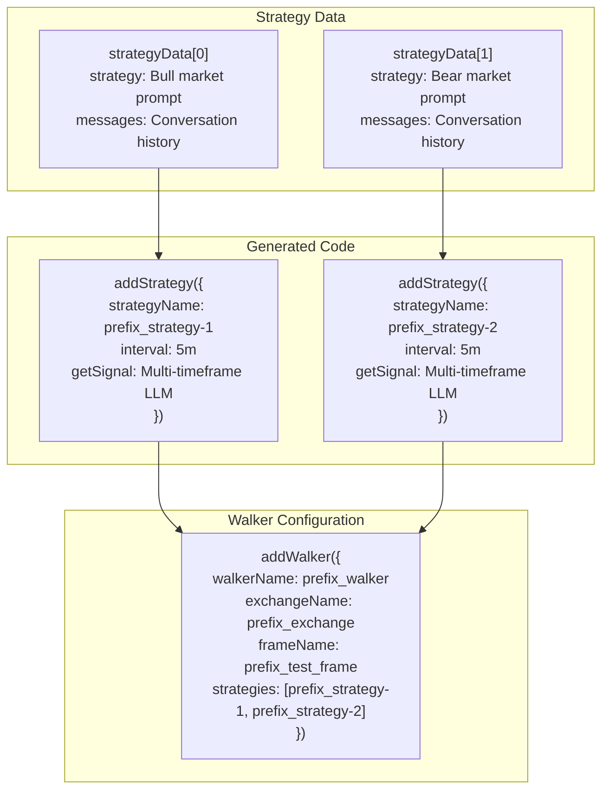
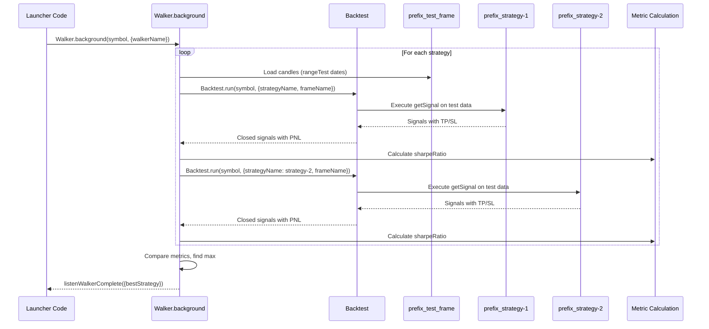

# Training vs Testing Ranges

<details>
<summary>Relevant source files</summary>

The following files were used as context for generating this wiki page:

- [src/classes/Backtest.ts](src/classes/Backtest.ts)
- [src/classes/Live.ts](src/classes/Live.ts)
- [src/classes/Optimizer.ts](src/classes/Optimizer.ts)
- [src/classes/Walker.ts](src/classes/Walker.ts)
- [src/client/ClientOptimizer.ts](src/client/ClientOptimizer.ts)
- [src/interfaces/Optimizer.interface.ts](src/interfaces/Optimizer.interface.ts)
- [src/lib/services/connection/OptimizerConnectionService.ts](src/lib/services/connection/OptimizerConnectionService.ts)
- [src/lib/services/connection/StrategyConnectionService.ts](src/lib/services/connection/StrategyConnectionService.ts)
- [src/lib/services/global/OptimizerGlobalService.ts](src/lib/services/global/OptimizerGlobalService.ts)
- [src/lib/services/schema/OptimizerSchemaService.ts](src/lib/services/schema/OptimizerSchemaService.ts)
- [src/lib/services/template/OptimizerTemplateService.ts](src/lib/services/template/OptimizerTemplateService.ts)
- [src/lib/services/validation/OptimizerValidationService.ts](src/lib/services/validation/OptimizerValidationService.ts)
- [src/model/Message.model.ts](src/model/Message.model.ts)

</details>


## Purpose and Scope

This document explains the training and testing range architecture in the Optimizer system. Training ranges (`rangeTrain`) define multiple historical periods used to generate strategy variants, while the testing range (`rangeTest`) defines a single held-out period for evaluating which strategy performs best. This approach enables automated strategy discovery across different market conditions without overfitting to a single historical period.

For information about the broader Optimizer architecture and data collection pipeline, see [Optimizer Architecture](#16.5.1). For details on LLM integration and strategy prompting, see [LLM Integration](#16.5.3). For code generation mechanics, see [Strategy Code Generation](#16.5.4).

## Conceptual Model

The Optimizer uses a train/test split philosophy analogous to machine learning:



**Key Insight**: Each training range represents a distinct market regime. By generating strategies from multiple regimes, the system produces diverse trading logic. The testing range acts as a held-out validation set to identify which strategy generalizes best to unseen market conditions.

**Sources**: [src/interfaces/Optimizer.interface.ts:14-32](), [src/client/ClientOptimizer.ts:99-214]()

## Training Ranges Configuration

Training ranges are defined via the `rangeTrain` array in `IOptimizerSchema`. Each range corresponds to one generated strategy variant.

### Schema Definition

| Field | Type | Description |
|-------|------|-------------|
| `rangeTrain` | `IOptimizerRange[]` | Array of training periods, each generates one strategy |
| `startDate` | `Date` | Start date of training period (inclusive) |
| `endDate` | `Date` | End date of training period (inclusive) |
| `note` | `string?` | Optional description of market conditions |

**Sources**: [src/interfaces/Optimizer.interface.ts:14-32](), [src/interfaces/Optimizer.interface.ts:379-433]()

### Data Collection Per Training Range

For each training range, the Optimizer:

1. **Fetches data** from all configured sources within the date boundaries
2. **Builds LLM conversation** history by formatting fetched data into user/assistant messages
3. **Generates strategy prompt** by calling `getPrompt()` with the complete conversation history
4. **Creates strategy variant** with unique name derived from range index



**Sources**: [src/client/ClientOptimizer.ts:99-214](), [src/client/ClientOptimizer.ts:70-88]()

### Training Range Iteration

The core iteration logic processes each training range sequentially:

```typescript
// From ClientOptimizer.ts lines 104-198
for (const { startDate, endDate } of self.params.rangeTrain) {
  const messageList: MessageModel[] = [];
  for (const source of self.params.source) {
    // Fetch data within training range dates
    const data = await RESOLVE_PAGINATION_FN(source, {
      symbol,
      startDate,
      endDate,
    });
    // Build conversation history
    messageList.push(
      { role: "user", content: userContent },
      { role: "assistant", content: assistantContent }
    );
  }
  // Generate strategy prompt from conversation
  strategyList.push({
    symbol,
    name,
    messages: messageList,
    strategy: await self.params.getPrompt(symbol, messageList),
  });
}
```

**Progress Tracking**: The Optimizer emits progress events as `processedSources / totalSources` where `totalSources = rangeTrain.length * source.length`. This enables real-time monitoring via `listenOptimizerProgress`.

**Sources**: [src/client/ClientOptimizer.ts:104-214](), [src/client/ClientOptimizer.ts:108-114]()

## Testing Range Configuration

The testing range (`rangeTest`) is a single `IOptimizerRange` used for strategy evaluation. Unlike training ranges which generate strategies, the testing range provides data for comparison.

### Schema Definition

| Field | Type | Description |
|-------|------|-------------|
| `rangeTest` | `IOptimizerRange` | Single testing period for Walker evaluation |
| `startDate` | `Date` | Start date of test period (inclusive) |
| `endDate` | `Date` | End date of test period (inclusive) |
| `note` | `string?` | Optional description (e.g., "Q3 2024 validation") |

**Sources**: [src/interfaces/Optimizer.interface.ts:379-433]()

### Purpose and Usage

The testing range serves three critical functions:

1. **Out-of-Sample Validation**: Ensures strategies don't overfit to training data
2. **Comparative Benchmarking**: Provides consistent evaluation period for all strategy variants
3. **Performance Ranking**: Walker uses test period metrics to identify best strategy

**Anti-Pattern**: Do not overlap training and testing ranges. This creates data leakage and invalidates the evaluation.

**Best Practice**: Use chronologically sequential ranges (e.g., train on Jan-Jun, test on Jul-Aug) to simulate realistic forward-testing conditions.

**Sources**: [src/interfaces/Optimizer.interface.ts:398-402]()

## Code Generation Pipeline

The Optimizer translates training/testing ranges into executable TypeScript code with distinct frames and strategies.

### Frame Generation Mapping



**Frame Naming Convention**:
- Training frames: `{prefix}_train_frame-{index}` where index starts at 1
- Testing frame: `{prefix}_test_frame` (always singular)

**Sources**: [src/lib/services/template/OptimizerTemplateService.ts:267-297](), [src/client/ClientOptimizer.ts:267-297]()

### Strategy Generation Mapping



**Strategy Naming Convention**: `{prefix}_strategy-{index}` where index starts at 1 and matches the order of `strategyData` array.

**Critical Detail**: Walker always uses `prefix_test_frame` (the testing range), never the training frames. Training frames exist only for data collection during strategy generation, not for backtest execution.

**Sources**: [src/client/ClientOptimizer.ts:299-331](), [src/lib/services/template/OptimizerTemplateService.ts:159-303]()

### Complete Code Structure

The generated `.mjs` file has the following structure:

| Section | Purpose | Code Template Method |
|---------|---------|---------------------|
| 1. Imports | Ollama, CCXT, backtest-kit | `getTopBanner()` |
| 2. Helpers | `dumpJson()` for audit trail | `getJsonDumpTemplate()` |
| 3. LLM Functions | `text()` and `json()` | `getTextTemplate()`, `getJsonTemplate()` |
| 4. Exchange | CCXT Binance integration | `getExchangeTemplate()` |
| 5. Train Frames | One per `rangeTrain` entry | `getFrameTemplate()` (loop) |
| 6. Test Frame | Single frame from `rangeTest` | `getFrameTemplate()` (once) |
| 7. Strategies | One per `rangeTrain` entry | `getStrategyTemplate()` (loop) |
| 8. Walker | Compares all on test frame | `getWalkerTemplate()` |
| 9. Launcher | Event listeners, execution | `getLauncherTemplate()` |

**Sources**: [src/client/ClientOptimizer.ts:225-350](), [src/lib/services/template/OptimizerTemplateService.ts:27-713]()

## Walker-Based Selection

The Walker compares all generated strategies on the testing range to identify the best performer.

### Execution Flow



**Metric Selection**: The Walker uses `sharpeRatio` as the default comparison metric (configurable via `IWalkerSchema.metric`). Strategies are ranked in descending order, and the highest metric wins.

**Sources**: [src/classes/Walker.ts:149-219](), [src/lib/services/template/OptimizerTemplateService.ts:394-442]()

### Best Strategy Identification

The Walker emits results via `listenWalkerComplete` event:

```typescript
// Generated in OptimizerTemplateService.ts lines 429-432
listenWalkerComplete((results) => {
    console.log("Walker completed:", results.bestStrategy);
    Walker.dump(symbol, results.walkerName);
});
```

**Result Structure**: `WalkerCompleteContract` includes:
- `bestStrategy`: Name of highest-performing strategy
- `bestMetric`: Metric value for best strategy
- `strategies`: Array of all strategies with their metrics

**Sources**: [src/lib/services/template/OptimizerTemplateService.ts:429-432](), [src/classes/Walker.ts:300-348]()

## Practical Usage Patterns

### Example Configuration

```typescript
import { addOptimizer } from "backtest-kit";

addOptimizer({
  optimizerName: "multi-regime-optimizer",
  
  // Training ranges: 3 different market conditions
  rangeTrain: [
    {
      note: "Bull market Q1 2024",
      startDate: new Date("2024-01-01"),
      endDate: new Date("2024-03-31"),
    },
    {
      note: "Bear market Q2 2024",
      startDate: new Date("2024-04-01"),
      endDate: new Date("2024-06-30"),
    },
    {
      note: "Sideways Q3 2024",
      startDate: new Date("2024-07-01"),
      endDate: new Date("2024-09-30"),
    },
  ],
  
  // Testing range: held-out Q4 2024
  rangeTest: {
    note: "Validation period Q4 2024",
    startDate: new Date("2024-10-01"),
    endDate: new Date("2024-12-31"),
  },
  
  source: [/* data sources */],
  getPrompt: async (symbol, messages) => {/* strategy generation */},
});
```

**Result**: Generates 3 strategies (`prefix_strategy-1`, `prefix_strategy-2`, `prefix_strategy-3`), backtests all on Q4 2024, selects best.

**Sources**: [src/interfaces/Optimizer.interface.ts:379-433]()

### Temporal Validation Best Practices

| Pattern | Description | Rationale |
|---------|-------------|-----------|
| **Sequential Ranges** | Train on past, test on future | Mimics realistic forward-testing |
| **Gap Period** | Leave gap between train and test | Reduces autocorrelation effects |
| **Multiple Regimes** | Use 3-5 diverse training ranges | Generates diverse strategy variants |
| **Consistent Duration** | Equal-length training ranges | Fair comparison across regimes |
| **Rolling Windows** | Slide train/test forward | Validates strategy robustness over time |

**Anti-Pattern Example**: Training on January and testing on February, then reusing February's results to modify the strategy. This creates look-ahead bias and invalidates the test.

**Sources**: [src/interfaces/Optimizer.interface.ts:14-32]()

### Progress Monitoring

The Optimizer emits progress events during data collection:

```typescript
import { listenOptimizerProgress } from "backtest-kit";

listenOptimizerProgress((event) => {
  console.log(`Progress: ${(event.progress * 100).toFixed(2)}%`);
  console.log(`Processed: ${event.processedSources} / ${event.totalSources}`);
  console.log(`Optimizer: ${event.optimizerName}, Symbol: ${event.symbol}`);
});
```

**Calculation**: Progress is `processedSources / (rangeTrain.length * source.length)`. If you have 3 training ranges and 2 sources, total sources = 6.

**Sources**: [src/client/ClientOptimizer.ts:108-114](), [src/client/ClientOptimizer.ts:201-208]()

## File Export and Execution

### Generated File Structure

The `Optimizer.dump()` method saves a complete executable file:

**Filename Format**: `{optimizerName}_{symbol}.mjs`

**Example**: For `optimizerName: "my-optimizer"` and `symbol: "BTCUSDT"`, generates `my-optimizer_BTCUSDT.mjs`

**Execution**: The generated file is self-contained and can be run with:
```bash
node my-optimizer_BTCUSDT.mjs
```

**Sources**: [src/client/ClientOptimizer.ts:360-384](), [src/classes/Optimizer.ts:100-120]()

### Audit Trail Generation

Each generated strategy includes `dumpJson()` helper that saves LLM conversations to `./dump/strategy/{resultId}/`:

| File | Content |
|------|---------|
| `00_system_prompt.md` | System messages and output data |
| `01_user_message.md` | First user input (1h candles) |
| `02_user_message.md` | Second user input (15m candles) |
| `03_user_message.md` | Third user input (5m candles) |
| `04_user_message.md` | Fourth user input (1m candles) |
| `05_user_message.md` | Strategy generation request |
| `06_llm_output.md` | Final LLM signal decision |

This enables complete reproducibility and debugging of strategy generation logic.

**Sources**: [src/lib/services/template/OptimizerTemplateService.ts:452-545]()

## Summary

The training vs testing range architecture enables automated strategy discovery with proper validation:

1. **Training Ranges** (`rangeTrain`): Define multiple historical periods representing diverse market conditions
2. **One Strategy Per Range**: Each training range generates exactly one strategy variant optimized for that period's characteristics
3. **Testing Range** (`rangeTest`): Single held-out period for unbiased evaluation of all generated strategies
4. **Walker Comparison**: Executes all strategies on test range, ranks by metric (default: `sharpeRatio`)
5. **Best Strategy Selection**: Identifies strategy with highest test-period performance

**Key Advantage**: By training on multiple market regimes and testing on unseen data, the system avoids overfitting to specific historical patterns while discovering diverse trading logic suited to different conditions.

**Sources**: [src/interfaces/Optimizer.interface.ts:379-433](), [src/client/ClientOptimizer.ts:99-214](), [src/lib/services/template/OptimizerTemplateService.ts:118-157]()