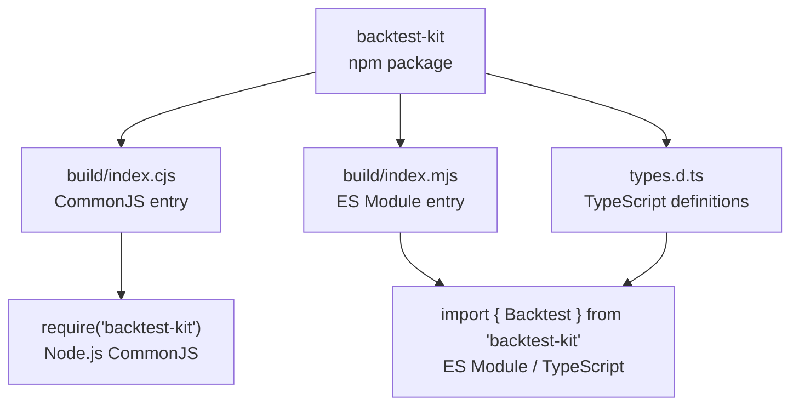
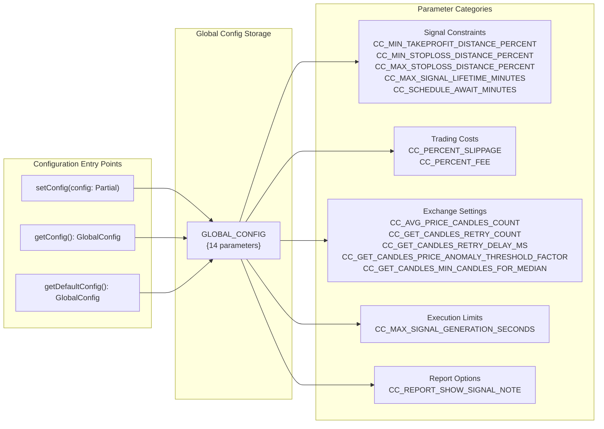
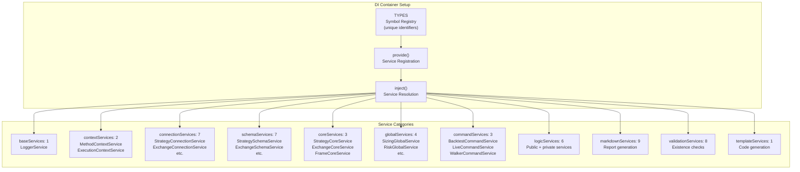

# Getting Started with Backtest-Kit

Welcome to the getting started guide for the backtest-kit framework! This guide will help you install the framework, set up your environment, and prepare to create your first trading strategies.

## What is Backtest-Kit?

Backtest-Kit is a powerful framework for building, testing, and running trading strategies on cryptocurrency markets. It provides:

- **Backtesting** - Testing strategies on historical data
- **Live Trading** - Real strategy execution with crash protection
- **Strategy Comparison** - Automatic comparison of multiple strategies
- **AI Optimization** - Strategy generation using large language models

---

## System Requirements

Before installation, ensure you have:

| Requirement | Version | Purpose |
|------------|---------|----------|
| **Node.js** | ≥15.0.0 | JavaScript runtime (required for ccxt) |
| **TypeScript** | ^5.0.0 | Type checking and compilation |
| **npm** or **yarn** | Latest stable | Package manager |

**Optional Requirements:**

| Requirement | Version | Purpose |
|------------|---------|----------|
| **Ollama** | ≥0.6.3 | Local LLM server for optimization mode |

---

## Installation

### Step 1: Install Base Package

Create a new project and install backtest-kit:

```bash
mkdir my-trading-bot
cd my-trading-bot
npm init -y
npm install backtest-kit
```

The package manager will automatically install the core dependencies:

```json
{
  "di-kit": "^1.0.18",
  "di-scoped": "^1.0.20",
  "functools-kit": "^1.0.94",
  "get-moment-stamp": "^1.1.1",
  "ollama": "^0.6.3"
}
```

### Step 2: Install Exchange Adapter

To fetch market data, install the ccxt library:

```bash
npm install ccxt
```

The `ccxt` library provides adapters for over 100 cryptocurrency exchanges with standardized APIs for fetching historical data.

### Step 3: Optional Dependencies

For LLM strategy generation:

```bash
npm install ollama uuid
```

For managing environment variables:

```bash
npm install --save-dev dotenv-cli
```

---

## Module System Support

The framework supports both CommonJS and ES Modules:



**TypeScript projects** automatically use the ESM entry point with full type definitions.

---

## TypeScript Configuration

Create a `tsconfig.json` file with minimal configuration:

```json
{
  "compilerOptions": {
    "target": "ES2020",
    "module": "ESNext",
    "moduleResolution": "node",
    "esModuleInterop": true,
    "strict": true,
    "skipLibCheck": true
  }
}
```

In `package.json`, add ES Module support:

```json
{
  "name": "my-trading-bot",
  "version": "1.0.0",
  "type": "module",
  "scripts": {
    "start": "node ./src/index.mjs"
  }
}
```

---

## Framework Initialization

### Logger Configuration

The framework outputs messages through a configurable logger interface. By default, logging is disabled. To receive logs, provide your own implementation:

```typescript
import { setLogger } from 'backtest-kit';

setLogger({
  log: (topic, ...args) => console.log(`[LOG] ${topic}:`, ...args),
  debug: (topic, ...args) => console.debug(`[DEBUG] ${topic}:`, ...args),
  info: (topic, ...args) => console.info(`[INFO] ${topic}:`, ...args),
  warn: (topic, ...args) => console.warn(`[WARN] ${topic}:`, ...args),
});
```

### Global Configuration

The framework provides 14 configurable parameters through `GLOBAL_CONFIG`:



**Basic Configuration Example:**

```typescript
import { setConfig } from 'backtest-kit';

setConfig({
  // Increase slippage for low-liquidity markets
  CC_PERCENT_SLIPPAGE: 0.2,

  // Reduce fee for VIP tier
  CC_PERCENT_FEE: 0.05,

  // Extend pending signal timeout to 2 hours
  CC_SCHEDULE_AWAIT_MINUTES: 120,

  // Show signal notes in markdown reports
  CC_REPORT_SHOW_SIGNAL_NOTE: true,
});
```

### Configuration Parameters Reference

| Parameter | Type | Default | Description |
|----------|-----|----------|-------------|
| `CC_SCHEDULE_AWAIT_MINUTES` | `number` | - | Maximum wait time for pending signal activation |
| `CC_AVG_PRICE_CANDLES_COUNT` | `number` | 5 | Number of candles for VWAP calculation |
| `CC_PERCENT_SLIPPAGE` | `number` | 0.1 | Slippage per transaction (%) |
| `CC_PERCENT_FEE` | `number` | 0.1 | Trading fee per transaction (%) |
| `CC_MIN_TAKEPROFIT_DISTANCE_PERCENT` | `number` | 0.5 | Minimum TP distance from entry (%) |
| `CC_MIN_STOPLOSS_DISTANCE_PERCENT` | `number` | 0.5 | Minimum SL distance from entry (%) |
| `CC_MAX_STOPLOSS_DISTANCE_PERCENT` | `number` | 20.0 | Maximum SL distance from entry (%) |
| `CC_MAX_SIGNAL_LIFETIME_MINUTES` | `number` | 1440 | Maximum signal duration (1 day) |
| `CC_MAX_SIGNAL_GENERATION_SECONDS` | `number` | 180 | Timeout for `getSignal()` execution |
| `CC_GET_CANDLES_RETRY_COUNT` | `number` | 3 | Number of retries on API errors |
| `CC_GET_CANDLES_RETRY_DELAY_MS` | `number` | 5000 | Delay between retries (ms) |
| `CC_GET_CANDLES_PRICE_ANOMALY_THRESHOLD_FACTOR` | `number` | 1000 | Price deviation factor for anomaly detection |
| `CC_GET_CANDLES_MIN_CANDLES_FOR_MEDIAN` | `number` | 5 | Minimum candles for median calculation |
| `CC_REPORT_SHOW_SIGNAL_NOTE` | `boolean` | false | Show "Note" column in markdown reports |

---

## Dependency Injection System

The framework uses `di-kit` and `di-scoped` for dependency management. All 75+ service instances are automatically created and wired through the DI container:



**Manual DI setup is not required.** The framework automatically manages service lifetimes and dependencies.

---

## Installation Verification

Create a minimal test file to verify installation:

```typescript
import { getDefaultConfig, setLogger } from 'backtest-kit';

// Test 1: Logger configuration
setLogger({
  log: (topic, ...args) => console.log(topic, args),
  debug: () => {},
  info: () => {},
  warn: () => {},
});

// Test 2: Configuration access
const config = getDefaultConfig();
console.log('Loaded default configuration:', Object.keys(config).length, 'parameters');

// Test 3: Module imports
import {
  addStrategy,
  addExchange,
  addFrame,
  Backtest,
  Live,
  Walker,
} from 'backtest-kit';

console.log('All core modules successfully imported');
```

**Expected output:**

```
All core modules successfully imported
Loaded default configuration: 14 parameters
```

---

## Recommended Project Structure

```
my-trading-bot/
├── package.json
├── tsconfig.json
├── .env                    # API keys, secrets (in .gitignore)
├── src/
│   ├── index.ts           # Main entry point
│   ├── enum/
│   │   ├── RiskName.enum.ts       # Risk management names
│   │   ├── StrategyName.enum.ts   # Strategy names
│   │   ├── ExchangeName.enum.ts   # Exchange schema names
│   ├── config/
│   │   ├── exchanges.ts   # Exchange schemas (addExchange)
│   │   ├── strategies.ts  # Strategy schemas (addStrategy)
│   │   ├── frames.ts      # Frame schemas (addFrame)
│   │   └── risk.ts        # Risk schemas (addRisk)
│   ├── strategies/
│   │   ├── macd-strategy.ts
│   │   └── rsi-strategy.ts
│   └── utils/
│       ├── indicators.ts  # Technical indicators
│       └── logger.ts      # Custom logger implementation
└── data/                  # Persistent storage directory (live mode)
    ├── signals/           # PersistSignalAdapter storage
    ├── risk/              # PersistRiskAdapter storage
    └── partial/           # PersistPartialAdapter storage
```

### Entry Point Template

```typescript
// src/index.ts
import { setLogger, setConfig } from 'backtest-kit';
import './config/exchanges';
import './config/strategies';
import './config/frames';
import './config/risk';

// Initialize framework
setLogger({
  log: console.log,
  debug: console.debug,
  info: console.info,
  warn: console.warn,
});

setConfig({
  CC_PERCENT_SLIPPAGE: 0.1,
  CC_PERCENT_FEE: 0.1,
});

// Execute run (example)
import { Backtest } from 'backtest-kit';

await Backtest.background('BTCUSDT', {
  strategyName: 'macd-crossover',
  exchangeName: 'binance',
  frameName: '30d-backtest',
});
```

---

## Environment Variables

Create a `.env` file to store sensitive data:

```bash
# Exchange API credentials
BINANCE_API_KEY=your_api_key
BINANCE_API_SECRET=your_api_secret

# Ollama configuration (for optimization mode)
OLLAMA_HOST=http://localhost:11434
OLLAMA_MODEL=deepseek-v3.1

# Framework configuration
LOG_LEVEL=debug
```

To use environment variables:

```bash
npm install --save-dev dotenv-cli
dotenv -e .env -- node ./src/index.mjs
```

---

## Next Steps

After completing installation and setup:

1. **[Run Your First Backtest](02-first-backtest.md)** - Create and run your first backtest
2. **[Understanding Signals](03-understanding-signals.md)** - Learn about trading signal lifecycle
3. **[Setup Live Trading](04-live-trading.md)** - Transition from backtesting to real execution
4. **[Risk Management](05-risk-management.md)** - Implement validation rules and portfolio constraints
5. **[AI Strategy Optimization](06-ai-optimization.md)** - Generate strategies using LLMs
