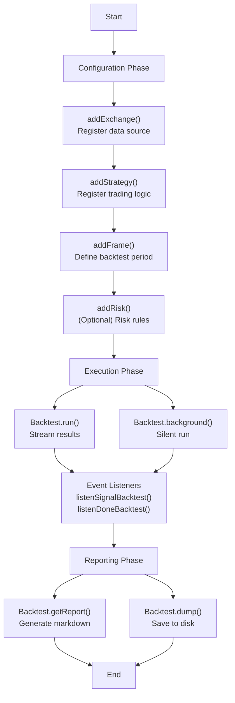
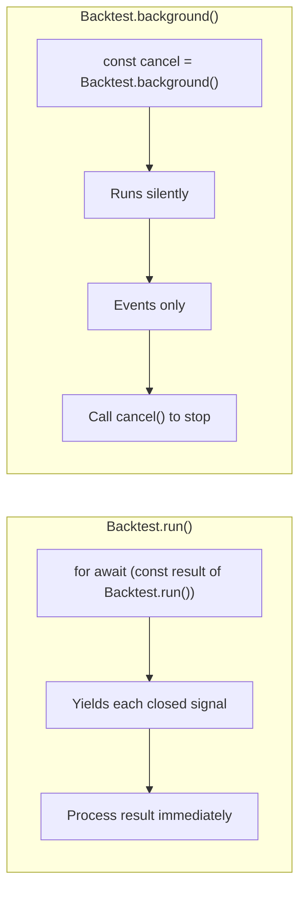
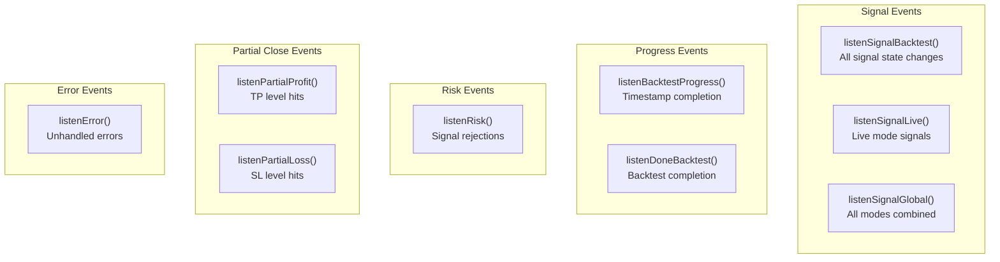
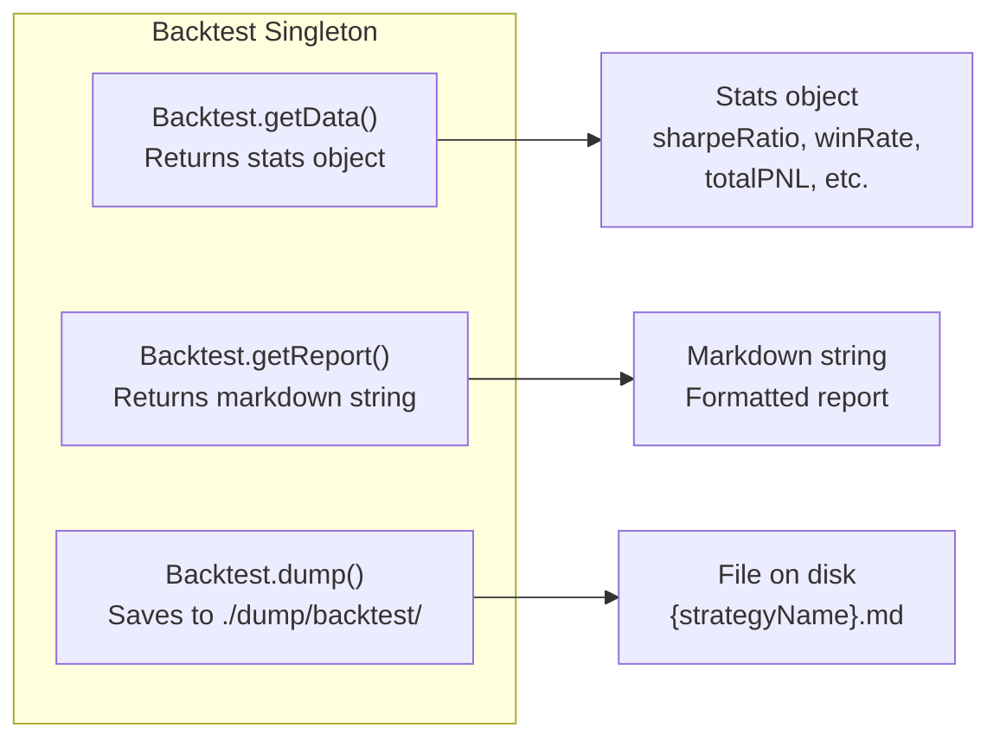
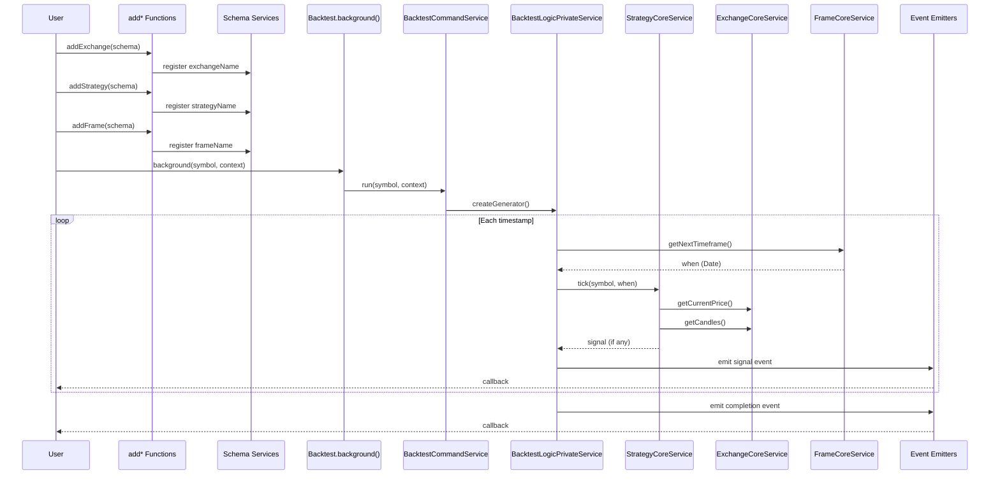

# Running Your First Backtest

This guide will walk you through the process of creating and running your first backtest using backtest-kit. You'll learn how to set up all necessary components and get results from testing your strategy.

## Process Overview

The backtest-kit framework follows a two-phase lifecycle: **configuration** and **execution**. During configuration, you register components using `add*` functions. During execution, you run backtests and receive results.



---

## Step 1: Register Exchange

The `addExchange` function registers a data source that provides historical candle data and price formatting functions.

### Exchange Schema Structure

| Field | Type | Description |
|------|-----|----------|
| `exchangeName` | `string` | Unique exchange identifier |
| `getCandles` | `async function` | Fetches OHLCV candle data |
| `formatPrice` | `async function` | Formats prices for display |
| `formatQuantity` | `async function` | Formats quantities for display |
| `callbacks` | `object` (optional) | Lifecycle callbacks |

### Minimal Exchange Example

```typescript
import ccxt from "ccxt";
import { addExchange } from "backtest-kit";

addExchange({
  exchangeName: "binance-historical",
  getCandles: async (symbol, interval, since, limit) => {
    const exchange = new ccxt.binance();
    const ohlcv = await exchange.fetchOHLCV(
      symbol,
      interval,
      since.getTime(),
      limit
    );
    return ohlcv.map(([timestamp, open, high, low, close, volume]) => ({
      timestamp, open, high, low, close, volume
    }));
  },
  formatPrice: async (symbol, price) => price.toFixed(2),
  formatQuantity: async (symbol, quantity) => quantity.toFixed(8),
});
```

### What Happens

The `getCandles` function is called by the framework during backtest execution. It receives:

- **symbol**: Trading pair (e.g., "BTCUSDT")
- **interval**: Candle interval matching the frame interval
- **since**: Start timestamp (Date object)
- **limit**: Maximum number of candles to return

---

## Step 2: Register Strategy

The `addStrategy` function registers trading logic that generates signals. The strategy defines when to enter and exit positions based on market data.

### Strategy Schema Structure

| Field | Type | Description |
|------|-----|----------|
| `strategyName` | `string` | Unique strategy identifier |
| `interval` | `string` | Signal generation frequency (e.g., "5m", "1h") |
| `getSignal` | `async function` | Generates trading signals |
| `riskName` | `string` (optional) | Associated risk profile |
| `sizingName` | `string` (optional) | Position sizing configuration |
| `callbacks` | `object` (optional) | Lifecycle callbacks (onOpen, onClose) |

### Signal Return Structure

The `getSignal` function must return an object with the following fields:

| Field | Type | Required | Description |
|------|-----|----------|-------------|
| `position` | `"long" \| "short"` | Yes | Trade direction |
| `priceOpen` | `number` | Conditional | Entry price (required if not pending) |
| `priceTakeProfit` | `number` | Yes | Take profit target |
| `priceStopLoss` | `number` | Yes | Stop loss level |
| `minuteEstimatedTime` | `number` | Yes | Expected trade duration in minutes |
| `timestamp` | `number` | Yes | Signal generation timestamp |
| `priceActivate` | `number` | No | Trigger price for conditional entry |

### Minimal Strategy Example

```typescript
import { addStrategy } from "backtest-kit";

addStrategy({
  strategyName: "simple-breakout",
  interval: "5m",
  getSignal: async (symbol) => {
    // Strategy logic here
    // Return null for no signal
    return {
      position: "long",
      priceOpen: 50000,
      priceTakeProfit: 51000,
      priceStopLoss: 49000,
      minuteEstimatedTime: 60,
      timestamp: Date.now(),
    };
  },
});
```

### Real Strategy Example with MACD

```typescript
import { addStrategy } from "backtest-kit";
import { MACD } from "technicalindicators";

addStrategy({
  strategyName: "macd-crossover",
  interval: "15m",
  getSignal: async (symbol) => {
    // Get historical data for indicator calculation
    // (in a real strategy, use framework methods)
    const prices = await getHistoricalPrices(symbol);

    // Calculate MACD
    const macdResult = MACD.calculate({
      values: prices,
      fastPeriod: 12,
      slowPeriod: 26,
      signalPeriod: 9,
      SimpleMAOscillator: false,
      SimpleMASignal: false
    });

    const current = macdResult[macdResult.length - 1];
    const previous = macdResult[macdResult.length - 2];

    // Bullish crossover
    if (previous.MACD < previous.signal && current.MACD > current.signal) {
      const currentPrice = prices[prices.length - 1];

      return {
        position: "long",
        priceOpen: currentPrice,
        priceTakeProfit: currentPrice * 1.02,  // +2%
        priceStopLoss: currentPrice * 0.99,    // -1%
        minuteEstimatedTime: 120,
        timestamp: Date.now(),
      };
    }

    // Bearish crossover
    if (previous.MACD > previous.signal && current.MACD < current.signal) {
      const currentPrice = prices[prices.length - 1];

      return {
        position: "short",
        priceOpen: currentPrice,
        priceTakeProfit: currentPrice * 0.98,  // -2%
        priceStopLoss: currentPrice * 1.01,    // +1%
        minuteEstimatedTime: 120,
        timestamp: Date.now(),
      };
    }

    // No signal
    return null;
  },
});
```

**Important**: Returning `null` or `undefined` means no signal for the current time interval.

---

## Step 3: Register Frame

The `addFrame` function defines the historical period for backtesting. The frame generates timestamps at the specified interval between start and end dates.

### Frame Schema Structure

| Field | Type | Description |
|------|-----|----------|
| `frameName` | `string` | Unique frame identifier |
| `interval` | `string` | Timestamp interval (e.g., "1m", "1h", "1d") |
| `startDate` | `Date` | Backtest start date |
| `endDate` | `Date` | Backtest end date |
| `callbacks` | `object` (optional) | Timestamp generation callback |

### Supported Intervals

- **Minutes**: `"1m"`, `"3m"`, `"5m"`, `"15m"`, `"30m"`
- **Hours**: `"1h"`, `"2h"`, `"4h"`, `"6h"`, `"8h"`, `"12h"`
- **Days**: `"1d"`, `"3d"`

### Minimal Frame Example

```typescript
import { addFrame } from "backtest-kit";

addFrame({
  frameName: "december-2025",
  interval: "1m",
  startDate: new Date("2025-12-01T00:00:00.000Z"),
  endDate: new Date("2025-12-31T23:59:59.999Z"),
});
```

### Examples of Different Periods

```typescript
// Short-term backtest (1 week)
addFrame({
  frameName: "week-test",
  interval: "5m",
  startDate: new Date("2025-12-01"),
  endDate: new Date("2025-12-08"),
});

// Medium-term backtest (1 month)
addFrame({
  frameName: "month-test",
  interval: "15m",
  startDate: new Date("2025-11-01"),
  endDate: new Date("2025-12-01"),
});

// Long-term backtest (1 year)
addFrame({
  frameName: "year-test",
  interval: "1h",
  startDate: new Date("2024-01-01"),
  endDate: new Date("2025-01-01"),
});
```

---

## Step 4: Register Risk Rules (Optional)

The `addRisk` function defines validation rules that reject signals based on portfolio-level constraints.

### Minimal Risk Example

```typescript
import { addRisk } from "backtest-kit";

addRisk({
  riskName: "conservative",
  maxConcurrentPositions: 3,
  validations: [
    {
      validate: ({ pendingSignal, currentPrice }) => {
        const { priceOpen = currentPrice, priceTakeProfit, position } = pendingSignal;
        const tpDistance = position === "long"
          ? ((priceTakeProfit - priceOpen) / priceOpen) * 100
          : ((priceOpen - priceTakeProfit) / priceOpen) * 100;

        if (tpDistance < 1) {
          throw new Error(`TP distance ${tpDistance.toFixed(2)}% < 1%`);
        }
      },
      note: "TP distance must be at least 1%",
    },
  ],
});
```

To link a risk profile with a strategy, set `riskName` in the strategy schema:

```typescript
addStrategy({
  strategyName: "macd-crossover",
  interval: "15m",
  riskName: "conservative",  // Link to risk profile
  getSignal: async (symbol) => {
    // ...
  },
});
```

---

## Step 5: Run Backtest

The `Backtest` singleton provides methods for running backtests. The framework offers two execution patterns: **streaming** and **background**.

### Execution Methods Comparison



### Streaming Pattern: `Backtest.run()`

The `run` method returns an async generator that yields each closed signal with PNL calculations:

```typescript
import { Backtest } from "backtest-kit";

for await (const result of Backtest.run("BTCUSDT", {
  strategyName: "macd-crossover",
  exchangeName: "binance-historical",
  frameName: "december-2025",
})) {
  console.log("Signal closed:");
  console.log("  PNL:", result.pnl.pnlPercentage.toFixed(2) + "%");
  console.log("  Duration:", result.duration, "minutes");
  console.log("  Exit reason:", result.reason);
}

console.log("Backtest completed");
```

### Background Pattern: `Backtest.background()`

The `background` method runs the backtest silently and returns a cancel function:

```typescript
import { Backtest } from "backtest-kit";

const cancel = Backtest.background("BTCUSDT", {
  strategyName: "macd-crossover",
  exchangeName: "binance-historical",
  frameName: "december-2025",
});

// Backtest runs asynchronously
// Use event listeners to monitor progress

// Stop early if needed
// cancel();
```

---

## Step 6: Monitor with Event Listeners

Event listeners allow you to react to backtest events asynchronously.

### Event Listener Functions



### Signal Event Listener

```typescript
import { listenSignalBacktest } from "backtest-kit";

listenSignalBacktest((event) => {
  console.log(`[${event.action}] ${event.symbol} @ ${event.strategyName}`);

  if (event.action === "opened") {
    console.log(`  Entry: ${event.signal.priceOpen}`);
  }

  if (event.action === "closed") {
    console.log(`  PNL: ${event.pnl.pnlPercentage.toFixed(2)}%`);
    console.log(`  Reason: ${event.reason}`);
  }
});
```

Signal events include the following actions:
- `"idle"`: Strategy waiting for next signal
- `"scheduled"`: Conditional entry scheduled
- `"opened"`: Position opened
- `"closed"`: Position closed
- `"cancelled"`: Pending signal expired

### Progress Listener

```typescript
import { listenBacktestProgress } from "backtest-kit";

listenBacktestProgress((event) => {
  const percent = (event.progress * 100).toFixed(2);
  console.log(`Progress: ${percent}%`);
  console.log(`Processed: ${event.processedFrames} / ${event.totalFrames}`);
});
```

### Completion Listener

```typescript
import { listenDoneBacktest, Backtest } from "backtest-kit";

listenDoneBacktest(async (event) => {
  console.log(`Backtest completed: ${event.symbol}`);

  // Generate report after completion
  await Backtest.dump(event.symbol, event.strategyName);
});
```

---

## Step 7: Generate Performance Reports

After backtest completion, use reporting methods to analyze results.

### Reporting Methods



### Stats Object Structure

```typescript
import { Backtest } from "backtest-kit";

const stats = await Backtest.getData("BTCUSDT", "macd-crossover");

console.log("Performance Metrics:");
console.log("  Sharpe Ratio:", stats.sharpeRatio);
console.log("  Win Rate:", stats.winRate);
console.log("  Total PNL:", stats.totalPNL);
console.log("  Max Drawdown:", stats.maxDrawdown);
console.log("  Total Trades:", stats.totalTrades);
```

### Generate Markdown Report

```typescript
import { Backtest } from "backtest-kit";

const markdown = await Backtest.getReport("BTCUSDT", "macd-crossover");
console.log(markdown);
```

### Save Report to Disk

```typescript
import { Backtest } from "backtest-kit";

// Save to default path: ./dump/backtest/macd-crossover.md
await Backtest.dump("BTCUSDT", "macd-crossover");

// Save to custom path: ./custom/reports/macd-crossover.md
await Backtest.dump("BTCUSDT", "macd-crossover", "./custom/reports");
```

---

## Complete Working Example

Here's a complete example with minimal backtest configuration:

```typescript
import ccxt from "ccxt";
import {
  addExchange,
  addStrategy,
  addFrame,
  Backtest,
  listenDoneBacktest,
  listenSignalBacktest,
} from "backtest-kit";

// Step 1: Register exchange
addExchange({
  exchangeName: "binance-historical",
  getCandles: async (symbol, interval, since, limit) => {
    const exchange = new ccxt.binance();
    const ohlcv = await exchange.fetchOHLCV(
      symbol,
      interval,
      since.getTime(),
      limit
    );
    return ohlcv.map(([timestamp, open, high, low, close, volume]) => ({
      timestamp, open, high, low, close, volume
    }));
  },
  formatPrice: async (symbol, price) => price.toFixed(2),
  formatQuantity: async (symbol, quantity) => quantity.toFixed(8),
});

// Step 2: Register strategy
addStrategy({
  strategyName: "simple-breakout",
  interval: "5m",
  getSignal: async (symbol) => {
    // Simplified strategy: always returns long signal
    return {
      position: "long",
      priceOpen: 50000,
      priceTakeProfit: 51000,
      priceStopLoss: 49000,
      minuteEstimatedTime: 60,
      timestamp: Date.now(),
    };
  },
});

// Step 3: Register frame
addFrame({
  frameName: "december-2025",
  interval: "1m",
  startDate: new Date("2025-12-01T00:00:00.000Z"),
  endDate: new Date("2025-12-02T00:00:00.000Z"),
});

// Step 4: Event listeners
listenSignalBacktest((event) => {
  if (event.action === "closed") {
    console.log(`Signal closed: PNL ${event.pnl.pnlPercentage.toFixed(2)}%`);
  }
});

listenDoneBacktest(async (event) => {
  console.log("Backtest completed");
  await Backtest.dump(event.symbol, event.strategyName);
  console.log("Report saved to ./dump/backtest/simple-breakout.md");
});

// Step 5: Run backtest in background
Backtest.background("BTCUSDT", {
  strategyName: "simple-breakout",
  exchangeName: "binance-historical",
  frameName: "december-2025",
});
```

---

## Execution Flow Diagram

This diagram shows how configuration components transition into execution:



---

## Next Steps

After running your first backtest:

1. **[Understanding Signals](03-understanding-signals.md)** - Learn about trading signal lifecycle and state machine
2. **[Setup Live Trading](04-live-trading.md)** - Transition to real execution with crash protection
3. **[Risk Management](05-risk-management.md)** - Implement advanced portfolio validation rules
4. **[AI Optimization](06-ai-optimization.md)** - Generate strategies using large language models
