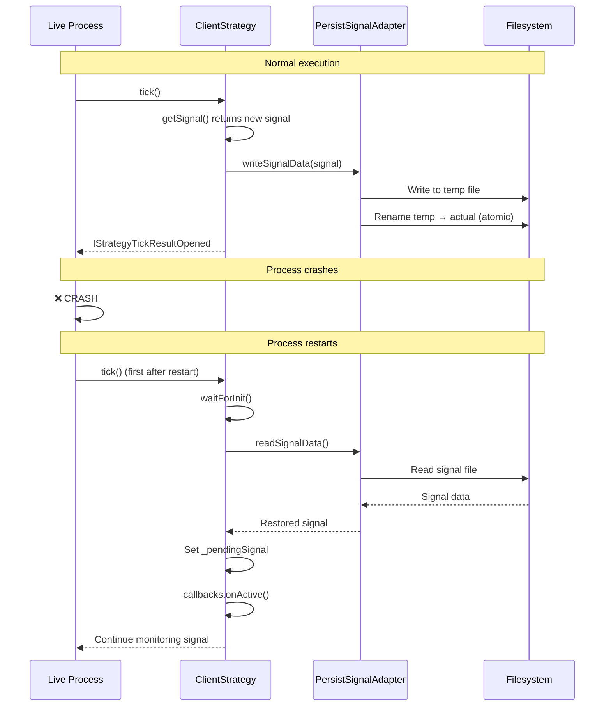

# Setting Up Live Trading

This guide explains how to transition from backtesting to real trading using Live Trading mode in backtest-kit. You'll learn about continuous execution, crash recovery, and safe state management.

## Live Trading Mode Overview

Live Trading mode executes strategies in an infinite loop, processing real-time data and managing open positions with crash-resistant state protection.

### Comparison: Live vs Backtest

| Characteristic | Live Mode | Backtest Mode |
|----------------|-----------|---------------|
| **Execution Pattern** | Infinite `while(true)` loop | Finite iteration through timestamps |
| **Time Progression** | `new Date()` on each tick | Historical `Date` from frame service |
| **Signal Processing** | Only `tick()` | `tick()` + `backtest()` fast-forward |
| **Persistence** | Enabled (crash recovery) | Disabled |
| **Event Queue** | Limited (MAX_EVENTS=25) | Unlimited |
| **Tick Pause** | TICK_TTL (1 min + 1 ms) | None (immediate) |
| **Termination** | Never (requires manual stop) | When timestamps exhausted |

---

## Setting Up for Live Trading

### Step 1: Preparing Exchange API Keys

For live trading you need valid API keys from a cryptocurrency exchange.

**Create a `.env` file**:
```bash
# API credentials
BINANCE_API_KEY=your_api_key_here
BINANCE_API_SECRET=your_api_secret_here

# Mode configuration
ENVIRONMENT=production
LOG_LEVEL=info
```

**Important**:
- Never commit `.env` to version control
- Use read-only API keys for testing
- For real trading, enable trading permissions carefully

### Step 2: Configuring Exchange for Live Trading

```typescript
import ccxt from "ccxt";
import { addExchange } from "backtest-kit";

addExchange({
  exchangeName: "binance-live",
  getCandles: async (symbol, interval, since, limit) => {
    const exchange = new ccxt.binance({
      apiKey: process.env.BINANCE_API_KEY,
      secret: process.env.BINANCE_API_SECRET,
      enableRateLimit: true,  // Important for live trading!
    });

    const ohlcv = await exchange.fetchOHLCV(
      symbol,
      interval,
      since.getTime(),
      limit
    );

    return ohlcv.map(([timestamp, open, high, low, close, volume]) => ({
      timestamp, open, high, low, close, volume
    }));
  },
  formatPrice: async (symbol, price) => {
    const exchange = new ccxt.binance();
    const market = await exchange.loadMarkets();
    return exchange.priceToPrecision(symbol, price);
  },
  formatQuantity: async (symbol, quantity) => {
    const exchange = new ccxt.binance();
    const market = await exchange.loadMarkets();
    return exchange.amountToPrecision(symbol, quantity);
  },
});
```

**Key differences from backtest**:
- `enableRateLimit: true` - prevents exchange bans
- `priceToPrecision()` and `amountToPrecision()` - comply with exchange rules
- Real API keys for account access

---

## Running Live Trading

### Method 1: Live.run() - Streaming Execution

The `run` method returns an async generator that yields every opened and closed signal:

```typescript
import { Live } from "backtest-kit";

console.log("Starting live trading...");

for await (const result of Live.run("BTCUSDT", {
  strategyName: "macd-crossover",
  exchangeName: "binance-live",
})) {
  if (result.action === "opened") {
    console.log("✓ New position opened:");
    console.log(`  Direction: ${result.signal.position}`);
    console.log(`  Entry: ${result.signal.priceOpen}`);
    console.log(`  Take Profit: ${result.signal.priceTakeProfit}`);
    console.log(`  Stop Loss: ${result.signal.priceStopLoss}`);

    // Send notification (email, Telegram, etc.)
    await sendNotification(`Opened ${result.signal.position} position at ${result.signal.priceOpen}`);
  }

  if (result.action === "closed") {
    console.log("✓ Position closed:");
    console.log(`  Reason: ${result.closeReason}`);
    console.log(`  PNL: ${result.pnl.pnlPercentage.toFixed(2)}%`);
    console.log(`  Exit price: ${result.currentPrice}`);

    // Log trade results
    await logTrade({
      symbol: result.symbol,
      pnl: result.pnl.pnlPercentage,
      reason: result.closeReason,
    });
  }
}
```

**Note**: The generator never completes - runs until manual stop or process termination.

### Method 2: Live.background() - Background Execution

The `background` method runs live trading in the background, returning a cancel function:

```typescript
import { Live, listenSignalLive } from "backtest-kit";

// Setup event listeners
listenSignalLive((event) => {
  console.log(`[${event.action}] ${event.symbol} @ ${event.currentPrice}`);

  if (event.action === "opened") {
    console.log(`  Position opened: ${event.signal.position}`);
  }

  if (event.action === "closed") {
    console.log(`  PNL: ${event.pnl.pnlPercentage.toFixed(2)}%`);
  }
});

// Start in background
const cancel = Live.background("BTCUSDT", {
  strategyName: "macd-crossover",
  exchangeName: "binance-live",
});

console.log("Live trading started in background");
console.log("Press Ctrl+C to stop");

// Handle graceful shutdown
process.on("SIGINT", async () => {
  console.log("\nStopping live trading...");
  cancel();

  // Wait for active positions to close
  await new Promise(resolve => setTimeout(resolve, 5000));

  console.log("Live trading stopped");
  process.exit(0);
});
```

---

## Crash Recovery

One of the most powerful features of Live mode is automatic state recovery after process crashes.

### How Recovery Works



### What Gets Persisted

| Signal State | Persisted? | Storage |
|--------------|------------|---------|
| `idle` | ❌ No | No data |
| `scheduled` | ✅ Yes | PersistScheduleAdapter |
| `opened` | ✅ Yes | PersistSignalAdapter |
| `active` | ✅ Yes | PersistSignalAdapter |
| `closed` | ❌ No | Position completed |
| `cancelled` | ❌ No | Signal cancelled |

### Atomic Data Writing

The persistence system uses atomic file writes to prevent corruption during crashes:

```typescript
// Internal implementation (simplified)
async function writeSignalData(signal) {
  // 1. Serialize to JSON
  const json = JSON.stringify(signal);

  // 2. Write to temp file
  const tempPath = `./data/signals/${symbol}-${strategy}.json.tmp`;
  await fs.writeFile(tempPath, json);

  // 3. Atomic rename
  const actualPath = `./data/signals/${symbol}-${strategy}.json`;
  await fs.rename(tempPath, actualPath);  // Atomic operation!

  // If crash occurs during write,
  // temp file remains orphaned,
  // but original file remains intact
}
```

**Key guarantees**:
- No duplicate signals (single source of truth)
- No lost positions (atomic writes)
- Seamless recovery (callbacks notified of restored state)

---

## Lifecycle Management

### Stopping Live Trading

```typescript
import { Live } from "backtest-kit";

// Stop strategy from generating new signals
await Live.stop("BTCUSDT", "macd-crossover");

// Active positions complete normally
// New signals are no longer generated
```

**Stop behavior**:
1. Sets internal `_isStopped` flag in `ClientStrategy`
2. Prevents `getSignal()` calls on subsequent ticks
3. Does NOT force-close active positions
4. Allows current signals to reach TP/SL/timeout naturally

### Graceful Shutdown

```typescript
import { Live, listenDoneLive } from "backtest-kit";

// Start live trading
const cancel = Live.background("BTCUSDT", {
  strategyName: "macd-crossover",
  exchangeName: "binance-live",
});

// Listen for completion event
listenDoneLive((event) => {
  console.log(`Live trading completed: ${event.symbol}`);
  console.log(`Strategy: ${event.strategyName}`);

  // Generate final report
  Live.dump(event.symbol, event.strategyName);
});

// Handle OS signals
process.on("SIGINT", () => {
  console.log("\nReceived SIGINT, stopping...");
  cancel();  // Initiates graceful shutdown
});

process.on("SIGTERM", () => {
  console.log("\nReceived SIGTERM, stopping...");
  cancel();
});
```

---

## Monitoring and Reporting

### Getting Real-Time Statistics

```typescript
import { Live } from "backtest-kit";

// Periodically check statistics
setInterval(async () => {
  const stats = await Live.getData("BTCUSDT", "macd-crossover");

  console.log("=== Real-Time Statistics ===");
  console.log(`Sharpe Ratio: ${stats.sharpeRatio.toFixed(2)}`);
  console.log(`Win Rate: ${(stats.winRate * 100).toFixed(1)}%`);
  console.log(`Total PNL: ${stats.totalPNL.toFixed(2)}%`);
  console.log(`Total Trades: ${stats.totalTrades}`);
  console.log(`Winning Trades: ${stats.winningTrades}`);
  console.log(`Losing Trades: ${stats.losingTrades}`);
  console.log(`Max Drawdown: ${stats.maxDrawdown.toFixed(2)}%`);
}, 60000);  // Every minute
```

**Important**: Uses limited queue (MAX_EVENTS=25) to prevent memory leaks during infinite execution.

### Generating Reports

```typescript
import { Live, listenDoneLive } from "backtest-kit";

// Generate report on stop
listenDoneLive(async (event) => {
  console.log("Generating final report...");

  // Save to default path: ./dump/live/macd-crossover.md
  await Live.dump(event.symbol, event.strategyName);

  // Or to custom path
  await Live.dump(event.symbol, event.strategyName, "./reports/live");

  console.log("Report saved");
});
```

### Getting Markdown Report

```typescript
import { Live } from "backtest-kit";

const markdown = await Live.getReport("BTCUSDT", "macd-crossover");
console.log(markdown);

// Send report via email
await sendEmailReport(markdown);
```

---

## Listing Active Instances

```typescript
import { Live } from "backtest-kit";

// Get all active live trading instances
const instances = await Live.list();

console.log("=== Active Live Trading Instances ===");
instances.forEach(instance => {
  console.log(`ID: ${instance.id}`);
  console.log(`Symbol: ${instance.symbol}`);
  console.log(`Strategy: ${instance.strategyName}`);
  console.log(`Status: ${instance.status}`);  // "idle" | "running" | "done"
  console.log("---");
});
```

---

## Complete Example: Production Setup

```typescript
import { config } from "dotenv";
import ccxt from "ccxt";
import {
  setLogger,
  setConfig,
  addExchange,
  addStrategy,
  Live,
  listenSignalLive,
  listenDoneLive,
  listenError,
} from "backtest-kit";

// Load environment variables
config();

// Setup logger
setLogger({
  log: (topic, ...args) => console.log(`[LOG] ${topic}:`, ...args),
  debug: (topic, ...args) => {
    if (process.env.LOG_LEVEL === "debug") {
      console.debug(`[DEBUG] ${topic}:`, ...args);
    }
  },
  info: (topic, ...args) => console.info(`[INFO] ${topic}:`, ...args),
  warn: (topic, ...args) => console.warn(`[WARN] ${topic}:`, ...args),
});

// Global configuration
setConfig({
  CC_PERCENT_SLIPPAGE: 0.1,
  CC_PERCENT_FEE: 0.1,
  CC_SCHEDULE_AWAIT_MINUTES: 120,
  CC_MAX_SIGNAL_LIFETIME_MINUTES: 480,  // 8 hours
});

// Register exchange
addExchange({
  exchangeName: "binance-live",
  getCandles: async (symbol, interval, since, limit) => {
    const exchange = new ccxt.binance({
      apiKey: process.env.BINANCE_API_KEY,
      secret: process.env.BINANCE_API_SECRET,
      enableRateLimit: true,
    });

    const ohlcv = await exchange.fetchOHLCV(
      symbol,
      interval,
      since.getTime(),
      limit
    );

    return ohlcv.map(([timestamp, open, high, low, close, volume]) => ({
      timestamp, open, high, low, close, volume
    }));
  },
  formatPrice: async (symbol, price) => {
    const exchange = new ccxt.binance();
    await exchange.loadMarkets();
    return exchange.priceToPrecision(symbol, price);
  },
  formatQuantity: async (symbol, quantity) => {
    const exchange = new ccxt.binance();
    await exchange.loadMarkets();
    return exchange.amountToPrecision(symbol, quantity);
  },
});

// Register strategy
addStrategy({
  strategyName: "production-strategy",
  interval: "15m",
  getSignal: async (symbol) => {
    // Your trading logic here
    return null;  // Or return signal
  },
  callbacks: {
    onOpen: async (symbol, signal, price, backtest) => {
      console.log(`✓ POSITION OPENED: ${signal.position} @ ${price}`);
      await sendTelegramNotification(`Opened ${signal.position} position at ${price}`);
    },
    onClose: async (symbol, signal, price, backtest) => {
      console.log(`✓ POSITION CLOSED @ ${price}`);
      // Log to database
      await logToDatabase({ symbol, signal, price });
    },
  },
});

// Handle errors
listenError((error) => {
  console.error("❌ ERROR:", error);
  // Send alert
  sendErrorAlert(error);
});

// Monitor signals
listenSignalLive((event) => {
  if (event.action === "active") {
    console.log(`→ Monitoring: ${event.symbol} @ ${event.currentPrice}`);
    console.log(`  TP progress: ${event.percentTp.toFixed(1)}%`);
    console.log(`  SL distance: ${event.percentSl.toFixed(1)}%`);
  }
});

// Completion listener
listenDoneLive(async (event) => {
  console.log("Live trading completed");
  await Live.dump(event.symbol, event.strategyName);
});

// Start live trading
console.log("Starting production live trading...");

const cancel = Live.background("BTCUSDT", {
  strategyName: "production-strategy",
  exchangeName: "binance-live",
});

// Graceful shutdown
process.on("SIGINT", () => {
  console.log("\nStopping...");
  cancel();
  setTimeout(() => process.exit(0), 10000);  // 10 seconds to complete
});

process.on("SIGTERM", () => {
  console.log("\nReceived SIGTERM...");
  cancel();
  setTimeout(() => process.exit(0), 10000);
});

console.log("Live trading active. Press Ctrl+C to stop.");
```

---

## Security Best Practices

### 1. Start Small

```typescript
// Use minimal position sizes for testing
addSizing({
  sizingName: "conservative",
  getQuantity: async (symbol, signal, currentPrice) => {
    return 0.001;  // Minimal size for BTC
  },
});
```

### 2. Use Testnet

```typescript
// Binance Testnet
const exchange = new ccxt.binance({
  apiKey: process.env.TESTNET_API_KEY,
  secret: process.env.TESTNET_API_SECRET,
  urls: {
    api: 'https://testnet.binance.vision/api',
  },
  enableRateLimit: true,
});
```

### 3. Monitoring and Alerts

```typescript
// Send notifications on critical events
listenSignalLive((event) => {
  if (event.action === "closed" && event.pnl.pnlPercentage < -5) {
    sendCriticalAlert(`Large loss: ${event.pnl.pnlPercentage.toFixed(2)}%`);
  }
});

listenError((error) => {
  sendCriticalAlert(`Execution error: ${error.message}`);
});
```

### 4. Risk Limits

```typescript
import { addRisk } from "backtest-kit";

addRisk({
  riskName: "production-risk",
  maxConcurrentPositions: 1,  // Only one position at a time
  validations: [
    {
      validate: ({ pendingSignal }) => {
        // Maximum 2% risk per trade
        const slDistance = Math.abs(
          (pendingSignal.priceStopLoss - pendingSignal.priceOpen) /
          pendingSignal.priceOpen
        ) * 100;

        if (slDistance > 2) {
          throw new Error(`SL distance ${slDistance.toFixed(2)}% > 2%`);
        }
      },
      note: "Maximum 2% risk per trade",
    },
  ],
});
```

---

## Debugging Issues

### Checking Persistence State

```bash
# View saved signals
ls -la ./data/signals/

# Read saved signal
cat ./data/signals/BTCUSDT-production-strategy.json
```

### Debug Logging

```typescript
setLogger({
  log: (topic, ...args) => {
    const timestamp = new Date().toISOString();
    console.log(`[${timestamp}] [LOG] ${topic}:`, ...args);
  },
  debug: (topic, ...args) => {
    const timestamp = new Date().toISOString();
    console.debug(`[${timestamp}] [DEBUG] ${topic}:`, ...args);
  },
  info: (topic, ...args) => {
    const timestamp = new Date().toISOString();
    console.info(`[${timestamp}] [INFO] ${topic}:`, ...args);
  },
  warn: (topic, ...args) => {
    const timestamp = new Date().toISOString();
    console.warn(`[${timestamp}] [WARN] ${topic}:`, ...args);
  },
});
```

---

## Next Steps

After setting up live trading:

1. **[Risk Management](05-risk-management.md)** - implement portfolio validation rules to protect capital
2. **[AI Optimization](06-ai-optimization.md)** - generate and test strategies using LLM
