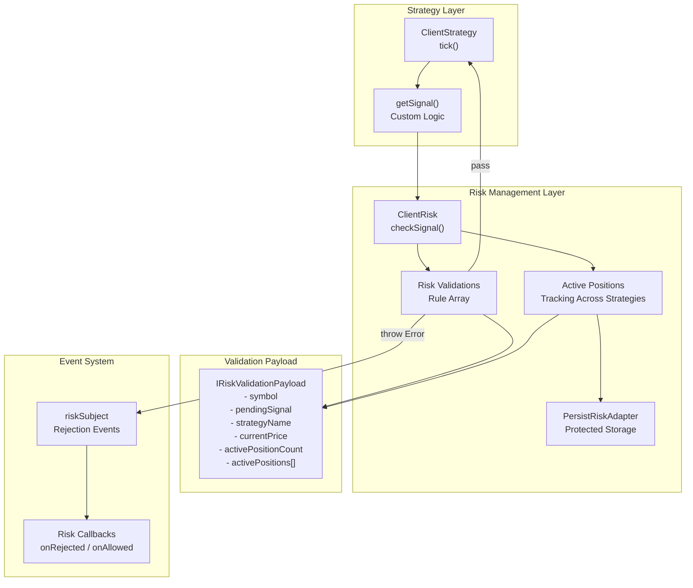
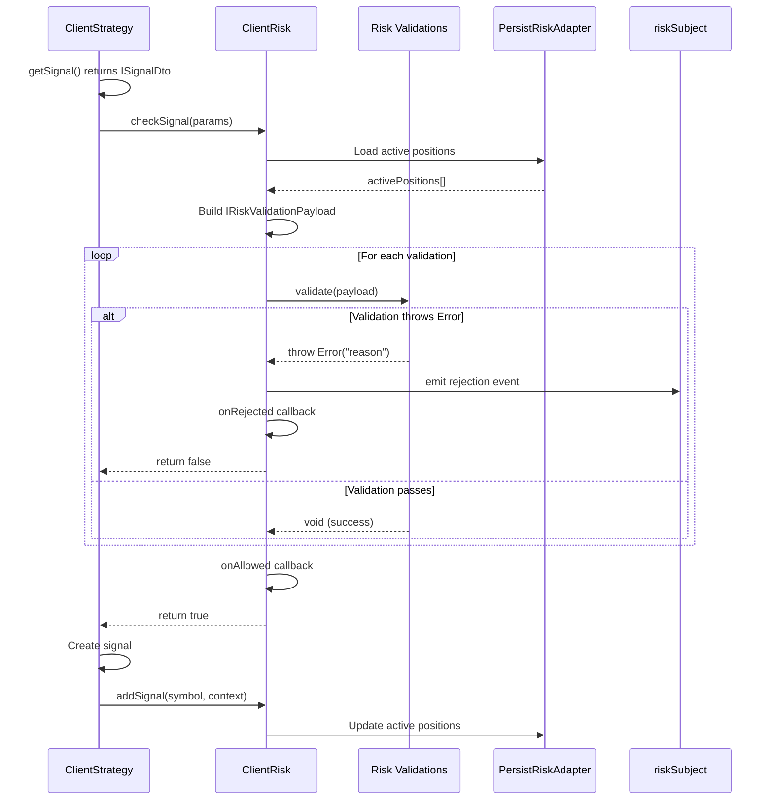

# Risk Management

This guide explains the risk management system in backtest-kit, which provides portfolio-level validation and position tracking to prevent excessive risk exposure.

## What is Risk Management?

Risk management in backtest-kit is a validation system that checks signals **before** they are created, analyzing the state of the entire portfolio. Unlike signal validation (which checks individual parameters), risk management considers **all active positions** across all strategies.

### Key Features

- ✅ Portfolio-level position limits
- ✅ Multi-strategy position coordination
- ✅ Custom validation rules with notes
- ✅ Symbol filtering
- ✅ Trading time windows
- ✅ Active position inspection
- ✅ Crash-safe position tracking
- ✅ Events for rejected signals

---

## Risk Management Architecture



### Execution Flow

1. Strategy calls `getSignal()` to generate a new signal
2. `ClientRisk.checkSignal()` evaluates the signal against risk rules
3. Each validation function receives `IRiskValidationPayload` with portfolio state
4. If any validation throws an error, the signal is **rejected** (not created)
5. Rejection generates an event in `riskSubject` with the reason
6. If all validations pass, the signal is created and position tracking is updated

---

## Registering a Risk Profile

Risk profiles are registered via the `addRisk()` function:

```typescript
import { addRisk } from "backtest-kit";

addRisk({
  riskName: "conservative",          // Unique identifier
  note: "Conservative profile",      // Optional documentation
  validations: [                      // Array of validation rules
    // Validation rules here
  ],
  callbacks: {                        // Optional callbacks
    onRejected: (symbol, params) => {
      console.warn(`Signal rejected: ${symbol}`);
    },
    onAllowed: (symbol, params) => {
      console.log(`Signal allowed: ${symbol}`);
    },
  },
});
```

### Risk Schema Structure

| Field | Type | Description |
|------|-----|----------|
| `riskName` | `string` | Unique profile identifier |
| `note` | `string?` | Optional documentation |
| `validations` | `Array` | Array of validation rules |
| `callbacks` | `object?` | Optional event callbacks |

---

## Risk Validation Payload

Each validation function receives an `IRiskValidationPayload` object with full portfolio context:

| Field | Type | Description |
|------|-----|----------|
| `symbol` | `string` | Trading pair (e.g., "BTCUSDT") |
| `pendingSignal` | `ISignalDto` | Signal to validate |
| `strategyName` | `string` | Strategy requesting the signal |
| `exchangeName` | `string` | Exchange name |
| `currentPrice` | `number` | Current VWAP price |
| `timestamp` | `number` | Current timestamp (ms) |
| `activePositionCount` | `number` | Total active positions across all strategies |
| `activePositions` | `Array` | Detailed list of active positions |

### Active Position Structure

```typescript
interface IRiskActivePosition {
  signal: ISignalRow;        // Full signal data
  strategyName: string;      // Owner strategy
  exchangeName: string;      // Exchange name
  openTimestamp: number;     // When position opened (ms)
}
```

---

## Validation Rule Examples

### Example 1: Concurrent Position Limit

```typescript
addRisk({
  riskName: "max-3-positions",
  note: "Maximum 3 concurrent positions",
  validations: [
    ({ activePositionCount }) => {
      if (activePositionCount >= 3) {
        throw new Error("Maximum 3 concurrent positions reached");
      }
    }
  ]
});
```

**When to use**: To limit the total number of open positions and manage capital exposure.

---

### Example 2: Symbol Filtering

```typescript
addRisk({
  riskName: "no-meme-coins",
  note: "Block meme coins from trading",
  validations: [
    ({ symbol }) => {
      const memeCoins = ["DOGEUSDT", "SHIBUSDT", "PEPEUSDT"];
      if (memeCoins.includes(symbol)) {
        throw new Error(`Meme coin ${symbol} not allowed`);
      }
    }
  ]
});
```

**When to use**: To exclude specific instruments from trading.

---

### Example 3: Trading Time Windows

```typescript
addRisk({
  riskName: "trading-hours",
  note: "Trade only during business hours (9:00 - 17:00 UTC)",
  validations: [
    ({ timestamp }) => {
      const date = new Date(timestamp);
      const hour = date.getUTCHours();

      if (hour < 9 || hour >= 17) {
        throw new Error("Trading allowed only 9:00 - 17:00 UTC");
      }

      // Check day of week (no weekend trading)
      const day = date.getUTCDay();
      if (day === 0 || day === 6) {
        throw new Error("Weekend trading not allowed");
      }
    }
  ]
});
```

**When to use**: To restrict trading to specific time periods.

---

### Example 4: Multi-Strategy Coordination

```typescript
addRisk({
  riskName: "multi-strategy-coordinator",
  note: "Limit per-strategy exposure and check for active positions",
  validations: [
    ({ activePositions, strategyName, symbol }) => {
      // Count positions for specific strategy
      const strategyPositions = activePositions.filter(
        (pos) => pos.strategyName === strategyName
      );

      if (strategyPositions.length >= 2) {
        throw new Error(`Strategy ${strategyName} already has 2 positions`);
      }

      // Check for existing position on this symbol
      const symbolPositions = activePositions.filter(
        (pos) => pos.signal.symbol === symbol
      );

      if (symbolPositions.length > 0) {
        const existingStrategy = symbolPositions[0].strategyName;
        throw new Error(`Position on ${symbol} already open by ${existingStrategy}`);
      }
    }
  ]
});
```

**When to use**: To manage multiple strategies and prevent duplicate positions.

---

### Example 5: TP/SL Distance Validation

```typescript
addRisk({
  riskName: "tp-sl-distance",
  note: "Minimum TP distance and risk/reward ratio",
  validations: [
    {
      validate: ({ pendingSignal, currentPrice }) => {
        const { priceOpen = currentPrice, priceTakeProfit, position } = pendingSignal;
        const tpDistance = position === "long"
          ? ((priceTakeProfit - priceOpen) / priceOpen) * 100
          : ((priceOpen - priceTakeProfit) / priceOpen) * 100;

        if (tpDistance < 1) {
          throw new Error(`TP distance ${tpDistance.toFixed(2)}% < 1%`);
        }
      },
      note: "TP distance must be at least 1%"
    },
    {
      validate: ({ pendingSignal, currentPrice }) => {
        const { priceOpen = currentPrice, priceTakeProfit, priceStopLoss, position } = pendingSignal;

        const reward = position === "long"
          ? priceTakeProfit - priceOpen
          : priceOpen - priceTakeProfit;

        const risk = position === "long"
          ? priceOpen - priceStopLoss
          : priceStopLoss - priceOpen;

        if (risk <= 0) {
          throw new Error("Invalid SL: risk must be positive");
        }

        const rrRatio = reward / risk;
        if (rrRatio < 2) {
          throw new Error(`R/R ratio ${rrRatio.toFixed(2)} < 2:1`);
        }
      },
      note: "Risk/reward ratio must be at least 1:2"
    }
  ]
});
```

**When to use**: To ensure adequate profit potential relative to risk.

---

### Example 6: Maximum Risk Per Trade

```typescript
addRisk({
  riskName: "max-risk-per-trade",
  note: "Maximum 2% risk per trade",
  validations: [
    ({ pendingSignal, currentPrice }) => {
      const { priceOpen = currentPrice, priceStopLoss, position } = pendingSignal;

      const slDistance = position === "long"
        ? ((priceOpen - priceStopLoss) / priceOpen) * 100
        : ((priceStopLoss - priceOpen) / priceOpen) * 100;

      if (slDistance > 2) {
        throw new Error(`SL distance ${slDistance.toFixed(2)}% > 2% max risk`);
      }
    }
  ]
});
```

**When to use**: To limit the maximum loss on a single trade.

---

## Linking Risk Profile to Strategy

After registering a risk profile, link it to a strategy:

```typescript
import { addStrategy, addRisk } from "backtest-kit";

// Register risk profile
addRisk({
  riskName: "conservative",
  validations: [
    ({ activePositionCount }) => {
      if (activePositionCount >= 3) {
        throw new Error("Maximum 3 positions");
      }
    }
  ]
});

// Link to strategy
addStrategy({
  strategyName: "macd-crossover",
  interval: "15m",
  riskName: "conservative",  // ← Link to risk profile
  getSignal: async (symbol) => {
    // Strategy logic
  },
});
```

---

## Monitoring Risk Events

### Rejection Event Listener

```typescript
import { listenRisk } from "backtest-kit";

listenRisk((event) => {
  console.log("=== Signal Rejected ===");
  console.log(`Symbol: ${event.symbol}`);
  console.log(`Strategy: ${event.strategyName}`);
  console.log(`Reason: ${event.comment}`);
  console.log(`Active Positions: ${event.activePositionCount}`);
  console.log(`Timestamp: ${new Date(event.timestamp).toISOString()}`);

  // Send notification
  sendAlert(`Signal rejected: ${event.comment}`);
});
```

### Risk Event Structure

```typescript
interface RiskContract {
  symbol: string;              // Trading pair
  strategyName: string;        // Strategy name
  exchangeName: string;        // Exchange name
  activePositionCount: number; // Active position count
  comment: string;             // Rejection reason
  timestamp: number;           // Timestamp (ms)
  pendingSignal: ISignalDto;   // Rejected signal
}
```

---

## Using Callbacks

```typescript
addRisk({
  riskName: "monitored-risk",
  validations: [
    ({ activePositionCount }) => {
      if (activePositionCount >= 5) {
        throw new Error("Maximum 5 positions reached");
      }
    }
  ],
  callbacks: {
    onRejected: (symbol, params) => {
      console.warn(`⚠️ Signal rejected for ${symbol}`);
      console.warn(`   Reason: ${params.comment}`);
      console.warn(`   Active positions: ${params.activePositionCount}`);

      // Log to database
      logRiskRejection({
        symbol,
        strategy: params.strategyName,
        reason: params.comment,
        timestamp: params.timestamp,
      });
    },
    onAllowed: (symbol, params) => {
      console.log(`✓ Signal allowed for ${symbol}`);
      console.log(`   Strategy: ${params.strategyName}`);
      console.log(`   Active positions after: ${params.activePositionCount + 1}`);
    },
  },
});
```

---

## Risk Check Flow Diagram



---

## Inspecting Active Positions

```typescript
addRisk({
  riskName: "position-inspector",
  note: "Detailed inspection of active positions",
  validations: [
    ({ activePositions, symbol, strategyName }) => {
      // Print all active positions
      console.log(`\n=== Active Positions (total: ${activePositions.length}) ===`);

      activePositions.forEach((pos, index) => {
        console.log(`\nPosition ${index + 1}:`);
        console.log(`  Strategy: ${pos.strategyName}`);
        console.log(`  Symbol: ${pos.signal.symbol}`);
        console.log(`  Direction: ${pos.signal.position}`);
        console.log(`  Entry: ${pos.signal.priceOpen}`);
        console.log(`  TP: ${pos.signal.priceTakeProfit}`);
        console.log(`  SL: ${pos.signal.priceStopLoss}`);
        console.log(`  Opened: ${new Date(pos.openTimestamp).toISOString()}`);
      });

      // Check for correlated positions
      const longCount = activePositions.filter(p => p.signal.position === "long").length;
      const shortCount = activePositions.filter(p => p.signal.position === "short").length;

      if (longCount > 0 && shortCount > 0) {
        console.warn(`⚠️ Warning: ${longCount} LONG and ${shortCount} SHORT positions simultaneously`);
      }

      // Check for excessive concentration
      const btcPositions = activePositions.filter(p => p.signal.symbol.includes("BTC")).length;
      if (btcPositions >= 2) {
        throw new Error(`Too many BTC positions: ${btcPositions}`);
      }
    }
  ]
});
```

---

## Risk Persistence (Live Trading)

In live trading mode, active positions are persisted to disk via `PersistRiskAdapter`:

```typescript
// Automatically saved when position opens
// Path: ./data/risk/{symbol}-{strategyName}.json

// Persisted data structure
{
  "activePositions": [
    {
      "signal": { /* signal data */ },
      "strategyName": "macd-crossover",
      "exchangeName": "binance-live",
      "openTimestamp": 1702800000000
    }
  ]
}
```

**Guarantees**:
- Atomic writes (corruption protection)
- Automatic recovery on restart
- Synchronization with all active positions

---

## Complete Example: Production Risk Profile

```typescript
import { addRisk, listenRisk } from "backtest-kit";

// Comprehensive production risk profile
addRisk({
  riskName: "production-risk",
  note: "Production profile with multiple safety checks",
  validations: [
    // 1. Total position limit
    {
      validate: ({ activePositionCount }) => {
        if (activePositionCount >= 3) {
          throw new Error("Maximum 3 concurrent positions");
        }
      },
      note: "Portfolio limit: 3 positions"
    },

    // 2. Maximum risk per trade
    {
      validate: ({ pendingSignal, currentPrice }) => {
        const { priceOpen = currentPrice, priceStopLoss, position } = pendingSignal;
        const slDistance = position === "long"
          ? ((priceOpen - priceStopLoss) / priceOpen) * 100
          : ((priceStopLoss - priceOpen) / priceOpen) * 100;

        if (slDistance > 2) {
          throw new Error(`Risk ${slDistance.toFixed(2)}% > 2% limit`);
        }
      },
      note: "Maximum 2% risk per trade"
    },

    // 3. Minimum risk/reward ratio
    {
      validate: ({ pendingSignal, currentPrice }) => {
        const { priceOpen = currentPrice, priceTakeProfit, priceStopLoss, position } = pendingSignal;

        const reward = position === "long"
          ? priceTakeProfit - priceOpen
          : priceOpen - priceTakeProfit;

        const risk = position === "long"
          ? priceOpen - priceStopLoss
          : priceStopLoss - priceOpen;

        const rrRatio = reward / risk;
        if (rrRatio < 2) {
          throw new Error(`R/R ${rrRatio.toFixed(2)} < 2:1`);
        }
      },
      note: "Minimum 1:2 risk/reward"
    },

    // 4. Time windows
    {
      validate: ({ timestamp }) => {
        const date = new Date(timestamp);
        const hour = date.getUTCHours();

        // No night trading (0:00 - 6:00 UTC)
        if (hour >= 0 && hour < 6) {
          throw new Error("Trading suspended during night hours");
        }
      },
      note: "Night trading prohibition"
    },

    // 5. Strategy coordination
    {
      validate: ({ activePositions, strategyName, symbol }) => {
        // Maximum 1 position per strategy
        const strategyPositions = activePositions.filter(
          p => p.strategyName === strategyName
        );
        if (strategyPositions.length >= 1) {
          throw new Error(`Strategy ${strategyName} already has a position`);
        }

        // No duplicate positions on same symbol
        const symbolPositions = activePositions.filter(
          p => p.signal.symbol === symbol
        );
        if (symbolPositions.length > 0) {
          throw new Error(`Position on ${symbol} already exists`);
        }
      },
      note: "Prevent duplicate positions"
    },

    // 6. Volatile instrument filter
    {
      validate: ({ symbol }) => {
        const highVolatility = ["BTCUSDT", "ETHUSDT"];
        const lowLiquidity = ["PEPEUSDT", "SHIBUSDT"];

        if ([...highVolatility, ...lowLiquidity].includes(symbol)) {
          // Can trade, but with warning
          console.warn(`⚠️ Attention: ${symbol} - high volatility/low liquidity`);
        }
      },
      note: "Warning for volatile instruments"
    },
  ],
  callbacks: {
    onRejected: (symbol, params) => {
      console.error(`❌ SIGNAL REJECTED: ${symbol}`);
      console.error(`   Reason: ${params.comment}`);
      console.error(`   Strategy: ${params.strategyName}`);
      console.error(`   Active positions: ${params.activePositionCount}`);

      // Send critical notification
      sendCriticalAlert({
        type: "RISK_REJECTION",
        symbol,
        reason: params.comment,
        timestamp: params.timestamp,
      });
    },
    onAllowed: (symbol, params) => {
      console.log(`✓ Signal allowed: ${symbol}`);
      console.log(`   Strategy: ${params.strategyName}`);
    },
  },
});

// Monitor all rejections
listenRisk((event) => {
  console.log("\n=== RISK EVENT ===");
  console.log(`Symbol: ${event.symbol}`);
  console.log(`Strategy: ${event.strategyName}`);
  console.log(`Rejection reason: ${event.comment}`);
  console.log(`Active positions: ${event.activePositionCount}`);
  console.log(`Time: ${new Date(event.timestamp).toISOString()}`);

  // Log to database
  logRiskEvent({
    symbol: event.symbol,
    strategy: event.strategyName,
    reason: event.comment,
    activePositions: event.activePositionCount,
    timestamp: event.timestamp,
    signal: event.pendingSignal,
  });
});
```

---

## Testing Risk Rules

```typescript
import { addRisk, addStrategy, Backtest } from "backtest-kit";

// Create test risk profile
addRisk({
  riskName: "test-risk",
  validations: [
    ({ activePositionCount }) => {
      console.log(`Check: active positions = ${activePositionCount}`);
      if (activePositionCount >= 2) {
        throw new Error("Test: maximum 2 positions");
      }
    }
  ],
  callbacks: {
    onRejected: (symbol, params) => {
      console.log(`✓ Test passed: signal correctly rejected`);
    },
    onAllowed: (symbol, params) => {
      console.log(`✓ Test passed: signal correctly allowed`);
    },
  },
});

// Test strategy
addStrategy({
  strategyName: "test-strategy",
  interval: "5m",
  riskName: "test-risk",
  getSignal: async (symbol) => {
    // Generate test signals
    return {
      position: "long",
      priceOpen: 50000,
      priceTakeProfit: 51000,
      priceStopLoss: 49000,
      minuteEstimatedTime: 60,
      timestamp: Date.now(),
    };
  },
});

// Run test
await Backtest.background("BTCUSDT", {
  strategyName: "test-strategy",
  exchangeName: "test-exchange",
  frameName: "test-frame",
});
```

---

## Next Steps

After setting up risk management:

1. **[AI Strategy Optimization](06-ai-optimization.md)** - generate strategies using large language models
