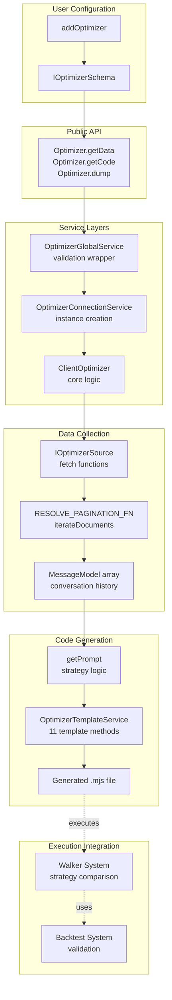
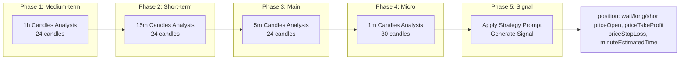

# AI Strategy Optimization

This guide explains how to use the Optimizer system in backtest-kit to generate trading strategies using Large Language Models (LLMs). You'll learn how to set up Ollama, create data sources, and generate fully executable strategies.

## What is Optimizer?

Optimizer is a meta-level strategy generation system that uses LLMs to create trading logic based on historical data. Unlike Backtest, Live, and Walker modes which execute existing strategies, Optimizer creates new strategies by analyzing data and generating code.

### Key Features

- 🤖 **LLM Generation** - Uses Ollama to synthesize strategies
- 📊 **Multi-source Data** - Collects data from various sources
- 📅 **Multiple Time Ranges** - Generates strategy variants for different periods
- 🔄 **Walker Integration** - Automatic comparison of generated strategies
- 💾 **Fully Executable Code** - Generates ready-to-run `.mjs` files

---

## Installing Ollama

### Step 1: Install Ollama

**Windows:**
```bash
# Download installer from official website
https://ollama.ai/download/windows

# Or use winget
winget install Ollama.Ollama
```

**macOS:**
```bash
# Use Homebrew
brew install ollama
```

**Linux:**
```bash
# Use curl
curl -fsSL https://ollama.ai/install.sh | sh
```

### Step 2: Install Model

```bash
# Start Ollama server (if not started automatically)
ollama serve

# Install deepseek-v3.1 model (recommended for trading strategies)
ollama pull deepseek-v3.1

# Or use other models
ollama pull llama3
ollama pull mistral
```

### Step 3: Verify Installation

```bash
# Test the model
ollama run deepseek-v3.1
>>> Hello, are you working?
>>> (Ctrl+D to exit)
```

### Step 4: Configure Environment Variables

```bash
# In .env file
OLLAMA_HOST=http://localhost:11434
OLLAMA_MODEL=deepseek-v3.1
```

---

## Optimizer System Architecture



---

## Creating an Optimizer

### Basic Configuration

```typescript
import { addOptimizer } from "backtest-kit";

addOptimizer({
  optimizerName: "crypto-optimizer",
  note: "Strategy generator for cryptocurrencies",

  // Training time ranges
  rangeTrain: [
    {
      startDate: new Date("2025-01-01"),
      endDate: new Date("2025-01-15"),
    },
    {
      startDate: new Date("2025-02-01"),
      endDate: new Date("2025-02-15"),
    },
  ],

  // Testing time range
  rangeTest: {
    startDate: new Date("2025-03-01"),
    endDate: new Date("2025-03-15"),
  },

  // Data sources
  source: [
    // Data sources here
  ],

  // Prompt generator
  getPrompt: async (symbol, messages) => {
    // Prompt generation logic here
  },
});
```

---

## Data Sources

Data sources are functions that extract information for LLM training.

### Example 1: News Source

```typescript
import { addOptimizer } from "backtest-kit";

addOptimizer({
  optimizerName: "news-based-optimizer",
  rangeTrain: [
    {
      startDate: new Date("2025-01-01"),
      endDate: new Date("2025-01-31"),
    },
  ],
  rangeTest: {
    startDate: new Date("2025-02-01"),
    endDate: new Date("2025-02-28"),
  },

  // News source
  source: [
    {
      name: "crypto-news",
      fetch: async ({ symbol, startDate, endDate, limit, offset }) => {
        // Call news API
        const response = await fetch(
          `https://api.cryptonews.com/v1/news?` +
          `symbol=${symbol}&` +
          `start=${startDate.getTime()}&` +
          `end=${endDate.getTime()}&` +
          `limit=${limit}&` +
          `offset=${offset}`
        );

        const news = await response.json();

        return news.articles.map(article => ({
          id: article.id,
          title: article.title,
          content: article.content,
          timestamp: article.publishedAt,
          sentiment: article.sentiment,
        }));
      },

      // Format for user message
      user: async (symbol, data, sourceName) => {
        return `Here are news about ${symbol}:\n\n` +
          data.map(article =>
            `[${new Date(article.timestamp).toISOString()}] ${article.title}\n` +
            `Sentiment: ${article.sentiment}\n` +
            `${article.content.substring(0, 200)}...\n`
          ).join('\n');
      },

      // Format for assistant response
      assistant: async (symbol, data, sourceName) => {
        const positiveSentiment = data.filter(a => a.sentiment > 0).length;
        const negativeSentiment = data.filter(a => a.sentiment < 0).length;

        return `Analyzed ${data.length} news articles about ${symbol}.\n` +
          `Positive: ${positiveSentiment}, Negative: ${negativeSentiment}.\n` +
          `Overall sentiment: ${positiveSentiment > negativeSentiment ? 'bullish' : 'bearish'}.`;
      },
    },
  ],

  getPrompt: async (symbol, messages) => {
    return `Based on the analyzed news, create a trading strategy for ${symbol}.`;
  },
});
```

### Example 2: Technical Indicators Source

```typescript
import { SMA, RSI, MACD } from "technicalindicators";
import { addOptimizer } from "backtest-kit";

addOptimizer({
  optimizerName: "technical-optimizer",
  rangeTrain: [
    {
      startDate: new Date("2025-01-01"),
      endDate: new Date("2025-01-31"),
    },
  ],
  rangeTest: {
    startDate: new Date("2025-02-01"),
    endDate: new Date("2025-02-28"),
  },

  source: [
    {
      name: "technical-indicators",
      fetch: async ({ symbol, startDate, endDate, limit, offset }) => {
        // Get historical candles
        const exchange = new ccxt.binance();
        const ohlcv = await exchange.fetchOHLCV(
          symbol,
          "1h",
          startDate.getTime(),
          100
        );

        const closes = ohlcv.map(c => c[4]);

        // Calculate indicators
        const sma20 = SMA.calculate({ period: 20, values: closes });
        const sma50 = SMA.calculate({ period: 50, values: closes });
        const rsi = RSI.calculate({ period: 14, values: closes });
        const macd = MACD.calculate({
          values: closes,
          fastPeriod: 12,
          slowPeriod: 26,
          signalPeriod: 9,
          SimpleMAOscillator: false,
          SimpleMASignal: false,
        });

        return [{
          id: `${symbol}-${startDate.getTime()}`,
          symbol,
          timestamp: Date.now(),
          indicators: {
            sma20: sma20[sma20.length - 1],
            sma50: sma50[sma50.length - 1],
            rsi: rsi[rsi.length - 1],
            macd: macd[macd.length - 1],
          },
          candles: ohlcv.slice(-24),
        }];
      },

      user: async (symbol, data, sourceName) => {
        const latest = data[data.length - 1];
        return `Current indicators for ${symbol}:\n` +
          `SMA(20): ${latest.indicators.sma20?.toFixed(2)}\n` +
          `SMA(50): ${latest.indicators.sma50?.toFixed(2)}\n` +
          `RSI(14): ${latest.indicators.rsi?.toFixed(2)}\n` +
          `MACD: ${latest.indicators.macd?.MACD?.toFixed(2)}\n` +
          `Signal: ${latest.indicators.macd?.signal?.toFixed(2)}`;
      },

      assistant: async (symbol, data, sourceName) => {
        const latest = data[data.length - 1];
        const trend = latest.indicators.sma20 > latest.indicators.sma50 ? "uptrend" : "downtrend";
        const rsiStatus = latest.indicators.rsi > 70 ? "overbought" : latest.indicators.rsi < 30 ? "oversold" : "neutral";

        return `Indicator analysis:\nTrend: ${trend}\nRSI: ${rsiStatus}`;
      },
    },
  ],

  getPrompt: async (symbol, messages) => {
    return `Based on technical indicators, create a strategy for trading ${symbol}.` +
      `Use a combination of SMA crossovers, RSI for overbought/oversold zones,` +
      `and MACD for trend confirmation.`;
  },
});
```

---

## Prompt Generator

The `getPrompt` function receives all collected information and creates the final instruction for the LLM.

```typescript
import { addOptimizer } from "backtest-kit";
import { Ollama } from "ollama";

addOptimizer({
  optimizerName: "advanced-optimizer",
  rangeTrain: [/* ... */],
  rangeTest: {/* ... */},
  source: [/* ... */],

  getPrompt: async (symbol, messages) => {
    // messages - array of all messages from data sources

    // Can use LLM to generate prompt
    const ollama = new Ollama({ host: process.env.OLLAMA_HOST });

    const summaryResponse = await ollama.chat({
      model: process.env.OLLAMA_MODEL || "deepseek-v3.1",
      messages: [
        {
          role: "user",
          content: "Analyze the following market information and create a brief summary:\n\n" +
            messages.map(m => `${m.role}: ${m.content}`).join('\n\n')
        },
      ],
    });

    const summary = summaryResponse.message.content;

    // Create final strategy prompt
    return `You are a cryptocurrency trading expert.

Based on the following market analysis:
${summary}

Create a trading strategy for ${symbol} with the following characteristics:

1. ENTRY DIRECTION: Determine when to open LONG or SHORT positions
2. ENTRY POINT: Determine optimal entry price (use priceOpen if delayed entry is needed)
3. TAKE-PROFIT: Target price for profit taking (minimum +2% from entry)
4. STOP-LOSS: Protective level (maximum -1.5% from entry)
5. TIME TO LIVE: Maximum position holding time in minutes

IMPORTANT: Risk/reward ratio must be at least 1:2.

Return result in JSON format:
{
  "position": "long" | "short" | "wait",
  "priceOpen": number | undefined,
  "priceTakeProfit": number,
  "priceStopLoss": number,
  "minuteEstimatedTime": number
}

If there's no clear signal, use "position": "wait".`;
  },
});
```

---

## Running Optimization

### Method 1: Getting Data

```typescript
import { Optimizer } from "backtest-kit";

// Collect data and generate strategies
const strategies = await Optimizer.getData("BTCUSDT", {
  optimizerName: "crypto-optimizer",
});

console.log(`Generated strategies: ${strategies.length}`);

strategies.forEach((strategy, index) => {
  console.log(`\nStrategy ${index + 1}:`);
  console.log(`  Name: ${strategy.name}`);
  console.log(`  Symbol: ${strategy.symbol}`);
  console.log(`  Prompt:\n${strategy.strategy}`);
});
```

### Method 2: Generating Code

```typescript
import { Optimizer } from "backtest-kit";

// Generate full executable code
const code = await Optimizer.getCode("BTCUSDT", {
  optimizerName: "crypto-optimizer",
});

console.log("Generated code:");
console.log(code);

// Code includes:
// - Imports and setup
// - LLM helper functions
// - Exchange setup
// - Training and testing frames
// - Generated strategies
// - Walker configuration for comparison
// - Event listeners and launch
```

### Method 3: Dumping to File

```typescript
import { Optimizer, listenOptimizerProgress } from "backtest-kit";

// Monitor progress
listenOptimizerProgress((event) => {
  const percent = (event.progress * 100).toFixed(1);
  console.log(`Progress: ${percent}% - ${event.comment}`);
});

// Save generated code to file
await Optimizer.dump("BTCUSDT", {
  optimizerName: "crypto-optimizer",
});

// File saved to: ./dump/optimizer/crypto-optimizer_BTCUSDT.mjs
console.log("Code saved to ./dump/optimizer/crypto-optimizer_BTCUSDT.mjs");

// Now you can run the generated strategy:
// node ./dump/optimizer/crypto-optimizer_BTCUSDT.mjs
```

---

## Generated Code Structure

Optimizer generates a fully ready-to-execute `.mjs` file with the following structure:

```javascript
#!/usr/bin/env node

// 1. Imports
import { Ollama } from "ollama";
import ccxt from "ccxt";
import {
  addExchange,
  addFrame,
  addStrategy,
  addWalker,
  Walker,
  listenWalkerProgress,
  listenDoneWalker,
} from "backtest-kit";

// 2. Constants
const OLLAMA_HOST = process.env.OLLAMA_HOST || "http://localhost:11434";
const OLLAMA_MODEL = process.env.OLLAMA_MODEL || "deepseek-v3.1";
const ollama = new Ollama({ host: OLLAMA_HOST });

// 3. Helper functions for LLM
async function text(messages) { /* ... */ }
async function json(messages) { /* ... */ }
async function dumpJson(resultId, history, result) { /* ... */ }

// 4. Exchange setup
addExchange({
  exchangeName: "a7x3k_exchange",
  getCandles: async (symbol, interval, since, limit) => { /* ... */ },
  formatPrice: async (symbol, price) => { /* ... */ },
  formatQuantity: async (symbol, quantity) => { /* ... */ },
});

// 5. Training frames
addFrame({
  frameName: "a7x3k_train_frame-1",
  interval: "5m",
  startDate: new Date("2025-01-01"),
  endDate: new Date("2025-01-15"),
});

addFrame({
  frameName: "a7x3k_train_frame-2",
  interval: "5m",
  startDate: new Date("2025-02-01"),
  endDate: new Date("2025-02-15"),
});

// 6. Testing frame
addFrame({
  frameName: "a7x3k_test_frame",
  interval: "5m",
  startDate: new Date("2025-03-01"),
  endDate: new Date("2025-03-15"),
});

// 7. Generated strategies
addStrategy({
  strategyName: "a7x3k_strategy-1",
  interval: "5m",
  getSignal: async (symbol) => {
    // Multi-timeframe analysis
    const messages = [];

    // Load candles from different timeframes
    const microTermCandles = await getCandles(symbol, "1m", 30);
    const mainTermCandles = await getCandles(symbol, "5m", 24);
    const shortTermCandles = await getCandles(symbol, "15m", 24);
    const mediumTermCandles = await getCandles(symbol, "1h", 24);

    // Analyze each timeframe
    messages.push(
      { role: "user", content: "Analyze 1h candles..." },
      { role: "assistant", content: "1h trend analyzed" }
    );

    // ... analysis of other timeframes ...

    // Generate signal
    messages.push({
      role: "user",
      content: "Generate trading signal: " + strategyPrompt
    });

    const result = await json(messages);
    await dumpJson("strategy-1", messages, result);

    return result;
  },
});

// 8. Walker configuration for comparison
addWalker({
  walkerName: "a7x3k_walker",
  exchangeName: "a7x3k_exchange",
  frameName: "a7x3k_test_frame",
  strategies: [
    { strategyName: "a7x3k_strategy-1", symbols: ["BTCUSDT"] },
    { strategyName: "a7x3k_strategy-2", symbols: ["BTCUSDT"] },
  ],
});

// 9. Event listeners and launch
listenWalkerProgress((event) => {
  console.log(`Progress: ${(event.progress * 100).toFixed(1)}%`);
});

listenDoneWalker(async (event) => {
  console.log("Strategy comparison completed");
  await Walker.dump(event.symbol, event.walkerName);
});

// Launch Walker
Walker.background("BTCUSDT", {
  walkerName: "a7x3k_walker",
});
```

---

## Multi-timeframe Analysis

Generated strategies use a 4-phase analysis pattern:



---

## Progress Monitoring

```typescript
import { listenOptimizerProgress, Optimizer } from "backtest-kit";

// Detailed monitoring
listenOptimizerProgress((event) => {
  console.log("\n=== Optimization Progress ===");
  console.log(`Symbol: ${event.symbol}`);
  console.log(`Optimizer: ${event.optimizerName}`);
  console.log(`Progress: ${(event.progress * 100).toFixed(1)}%`);
  console.log(`Status: ${event.comment}`);
  console.log(`Timestamp: ${new Date(event.timestamp).toISOString()}`);
});

// Launch with monitoring
await Optimizer.dump("BTCUSDT", {
  optimizerName: "crypto-optimizer",
});
```

---

## Complete Example: Advanced Optimizer

```typescript
import { config } from "dotenv";
import ccxt from "ccxt";
import { Ollama } from "ollama";
import {
  setLogger,
  addOptimizer,
  Optimizer,
  listenOptimizerProgress,
} from "backtest-kit";

// Load environment variables
config();

// Setup logger
setLogger({
  log: console.log,
  debug: console.debug,
  info: console.info,
  warn: console.warn,
});

// Create optimizer
addOptimizer({
  optimizerName: "advanced-crypto-optimizer",
  note: "Advanced strategy generator with multiple data sources",

  rangeTrain: [
    {
      startDate: new Date("2025-01-01"),
      endDate: new Date("2025-01-15"),
    },
    {
      startDate: new Date("2025-01-16"),
      endDate: new Date("2025-01-31"),
    },
    {
      startDate: new Date("2025-02-01"),
      endDate: new Date("2025-02-15"),
    },
  ],

  rangeTest: {
    startDate: new Date("2025-03-01"),
    endDate: new Date("2025-03-31"),
  },

  source: [
    // Source 1: Technical indicators
    {
      name: "technical-analysis",
      fetch: async ({ symbol, startDate, endDate, limit, offset }) => {
        const exchange = new ccxt.binance();
        const ohlcv = await exchange.fetchOHLCV(
          symbol,
          "1h",
          startDate.getTime(),
          100
        );

        const closes = ohlcv.map(c => c[4]);

        return [{
          id: `tech-${symbol}-${startDate.getTime()}`,
          timestamp: Date.now(),
          candles: ohlcv,
          indicators: {
            // Calculate indicators
            sma20: calculateSMA(closes, 20),
            rsi: calculateRSI(closes, 14),
            macd: calculateMACD(closes),
          },
        }];
      },
      user: async (symbol, data) => {
        return `Technical analysis for ${symbol}:\n${JSON.stringify(data[0].indicators, null, 2)}`;
      },
      assistant: async () => {
        return "Technical analysis completed.";
      },
    },

    // Source 2: Trading volume
    {
      name: "volume-analysis",
      fetch: async ({ symbol, startDate, endDate }) => {
        const exchange = new ccxt.binance();
        const trades = await exchange.fetchTrades(symbol, startDate.getTime(), 1000);

        return [{
          id: `volume-${symbol}-${startDate.getTime()}`,
          totalVolume: trades.reduce((sum, t) => sum + t.amount, 0),
          avgPrice: trades.reduce((sum, t) => sum + t.price, 0) / trades.length,
          buyPressure: trades.filter(t => t.side === "buy").length / trades.length,
        }];
      },
      user: async (symbol, data) => {
        return `Volume analysis for ${symbol}: Buy pressure ${(data[0].buyPressure * 100).toFixed(1)}%`;
      },
      assistant: async () => {
        return "Volume analysis completed.";
      },
    },
  ],

  getPrompt: async (symbol, messages) => {
    const ollama = new Ollama({ host: process.env.OLLAMA_HOST });

    // Generate summary with LLM
    const summaryResponse = await ollama.chat({
      model: "deepseek-v3.1",
      messages: [
        {
          role: "user",
          content: "Create a brief market analysis summary:\n\n" +
            messages.map(m => `${m.role}: ${m.content}`).join('\n\n')
        },
      ],
    });

    const summary = summaryResponse.message.content;

    return `You are a cryptocurrency trading expert.

MARKET ANALYSIS:
${summary}

TASK: Create a trading strategy for ${symbol}.

REQUIREMENTS:
1. Use a combination of technical indicators and volume analysis
2. Define clear entry conditions (LONG/SHORT)
3. Set take-profit at minimum +2% from entry
4. Set stop-loss at maximum -1.5% from entry
5. Risk/reward ratio must be at least 1:2

RESPONSE FORMAT (JSON):
{
  "position": "long" | "short" | "wait",
  "priceOpen": number | undefined,
  "priceTakeProfit": number,
  "priceStopLoss": number,
  "minuteEstimatedTime": number
}`;
  },
});

// Monitor progress
listenOptimizerProgress((event) => {
  const percent = (event.progress * 100).toFixed(1);
  console.log(`[${percent}%] ${event.comment}`);
});

// Launch generation
console.log("Starting AI strategy optimization...\n");

await Optimizer.dump("BTCUSDT", {
  optimizerName: "advanced-crypto-optimizer",
});

console.log("\n✓ Generation completed!");
console.log("Generated file: ./dump/optimizer/advanced-crypto-optimizer_BTCUSDT.mjs");
console.log("\nRun the generated strategy:");
console.log("node ./dump/optimizer/advanced-crypto-optimizer_BTCUSDT.mjs");
```

---

## Running the Generated Strategy

```bash
# After generation, run the file
node ./dump/optimizer/advanced-crypto-optimizer_BTCUSDT.mjs

# Output:
# Starting Walker for strategy comparison...
# [10.0%] Executing strategy advanced-crypto-optimizer-strategy-1
# [20.0%] Executing strategy advanced-crypto-optimizer-strategy-2
# [30.0%] Executing strategy advanced-crypto-optimizer-strategy-3
# ...
# [100%] Comparison completed
# Report saved: ./dump/walker/advanced-crypto-optimizer_walker.md
```

---

## Recommendations

### 1. Model Selection

```typescript
// For quick prototyping
OLLAMA_MODEL=llama3

// For advanced analysis (recommended)
OLLAMA_MODEL=deepseek-v3.1

// For balanced speed and quality
OLLAMA_MODEL=mistral
```

### 2. Training Data Size

```typescript
// Minimum 2 training ranges
rangeTrain: [
  { startDate: new Date("2025-01-01"), endDate: new Date("2025-01-15") },
  { startDate: new Date("2025-02-01"), endDate: new Date("2025-02-15") },
]

// Optimal 3-5 ranges
rangeTrain: [
  // January
  // February
  // March
  // April
  // May
]
```

### 3. Prompt Quality

```typescript
// Bad prompt
getPrompt: async (symbol, messages) => {
  return "Create a strategy";
}

// Good prompt
getPrompt: async (symbol, messages) => {
  return `You are a trading expert for ${symbol}.

Based on the following analysis: ${summary}

Create a strategy with the following characteristics:
- Clear entry conditions
- TP minimum +2%
- SL maximum -1.5%
- R/R ratio minimum 1:2

Response format: JSON...`;
}
```

---

## Conclusion

The Optimizer system in backtest-kit provides a powerful tool for generating trading strategies using AI. By combining multiple data sources, multi-timeframe analysis, and advanced LLM models, you can create, test, and compare strategies automatically.

## Next Steps

After obtaining an optimal trading strategy:

1. **[LLM Trading with Structured JSON Output](07-llm-trading.md)** - using LLMs as interpreters for natural language trading strategies
