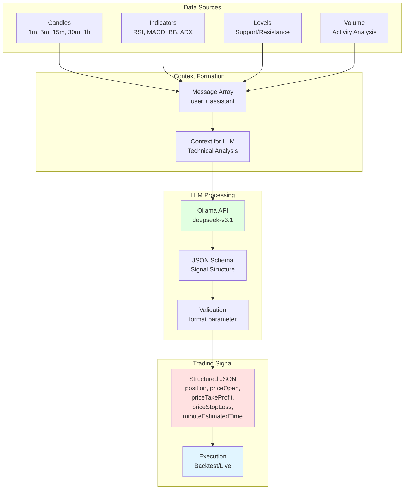

# LLM Trading with Structured JSON Output

This advanced guide explains how to use large language models (LLM) directly in trading strategies to generate signals in real-time. You will learn how to set up Ollama for structured JSON output and integrate AI analysis into the trading decision-making process.

## What is LLM Trading?

LLM trading is an approach where a large language model analyzes market data and generates trading signals in real-time. Unlike traditional strategies with fixed rules, LLMs can adapt their analysis to changing market conditions.

### Benefits of LLM Trading

- **Adaptability** - the model can account for market context and nuances
- **Multi-factor Analysis** - simultaneous analysis of dozens of indicators
- **Continuous Learning** - ability to fine-tune on new data
- **Explainability** - the model can explain the reasons for its decisions
- **Fast Adaptation** - easily change strategy through prompts

---

## LLM Trading Architecture



---

## Setting Up Ollama for Structured Output

### Step 1: Installation and Setup

```bash
# Install Ollama (if not already installed)
# Windows
winget install Ollama.Ollama

# macOS
brew install ollama

# Linux
curl -fsSL https://ollama.ai/install.sh | sh
```

```bash
# Start the server
ollama serve

# Install deepseek-v3.1 model (recommended for trading)
ollama pull deepseek-v3.1
```

### Step 2: Environment Variables Setup

```bash
# .env file
OLLAMA_HOST=http://localhost:11434
OLLAMA_MODEL=deepseek-v3.1

# For cloud Ollama
OLLAMA_API_KEY=your_api_key_here
OLLAMA_HOST=https://ollama.com
```

---

## Function for Structured JSON Output

### Basic Implementation

```typescript
import { Ollama } from "ollama";

async function json(messages) {
  const ollama = new Ollama({
    host: process.env.OLLAMA_HOST || "http://localhost:11434",
  });

  const response = await ollama.chat({
    model: process.env.OLLAMA_MODEL || "deepseek-v3.1",
    messages: [
      {
        role: "system",
        content: [
          "Analyze the trading strategy and return a trading signal.",
          "",
          "POSITION OPENING RULES:",
          "",
          "1. POSITION TYPES:",
          "   - position='wait': no clear signal, wait for better conditions",
          "   - position='long': bullish signal, price will rise",
          "   - position='short': bearish signal, price will fall",
          "",
          "2. ENTRY PRICE (priceOpen):",
          "   - Can be current market price for immediate entry",
          "   - Can be pending price for entry when level is reached",
          "   - Specify optimal entry price according to technical analysis",
          "",
          "3. EXIT LEVELS:",
          "   - LONG: priceTakeProfit > priceOpen > priceStopLoss",
          "   - SHORT: priceStopLoss > priceOpen > priceTakeProfit",
          "   - Levels must have technical justification (Fibonacci, S/R, Bollinger)",
          "",
          "4. TIME FRAMES:",
          "   - minuteEstimatedTime: forecast time to TP (max 360 minutes)",
          "   - Calculation based on ATR, ADX, MACD, Momentum, Slope",
        ].join("\n"),
      },
      ...messages,
    ],
    format: {
      type: "object",
      properties: {
        position: {
          type: "string",
          enum: ["wait", "long", "short"],
          description: "Trade decision: wait (no signal), long (buy), or short (sell)",
        },
        note: {
          type: "string",
          description: "Professional trading recommendation with price levels",
        },
        priceOpen: {
          type: "number",
          description: "Entry price (current market price or limit order price)",
        },
        priceTakeProfit: {
          type: "number",
          description: "Take profit target price",
        },
        priceStopLoss: {
          type: "number",
          description: "Stop loss exit price",
        },
        minuteEstimatedTime: {
          type: "number",
          description: "Expected time to reach TP in minutes (max 360)",
        },
      },
      required: [
        "position",
        "note",
        "priceOpen",
        "priceTakeProfit",
        "priceStopLoss",
        "minuteEstimatedTime"
      ],
    },
  });

  const jsonResponse = JSON.parse(response.message.content.trim());
  return jsonResponse;
}

export default json;
```

---

## Multi-Timeframe Analysis

### Pattern for Analyzing Different Timeframes

```typescript
import ccxt from "ccxt";
import { json } from "./utils/json.mjs";

async function analyzeMultipleTimeframes(symbol) {
  const exchange = new ccxt.binance();
  const messages = [];

  // 1. Fetch data from different timeframes
  const candles1h = await exchange.fetchOHLCV(symbol, "1h", undefined, 24);
  const candles15m = await exchange.fetchOHLCV(symbol, "15m", undefined, 48);
  const candles5m = await exchange.fetchOHLCV(symbol, "5m", undefined, 60);
  const candles1m = await exchange.fetchOHLCV(symbol, "1m", undefined, 60);

  // 2. 1-hour trend analysis
  messages.push({
    role: "user",
    content: `Analyze 1-hour candles for ${symbol}:\n` +
      formatCandles(candles1h) +
      `\n\nDetermine the main trend (uptrend/downtrend/sideways).`
  });

  messages.push({
    role: "assistant",
    content: "1h trend analyzed. Main trend and key support/resistance levels identified."
  });

  // 3. 15-minute trend analysis
  messages.push({
    role: "user",
    content: `Analyze 15-minute candles for ${symbol}:\n` +
      formatCandles(candles15m) +
      `\n\nDetermine short-term trend and indicator divergences.`
  });

  messages.push({
    role: "assistant",
    content: "15m trend analyzed. Short-term patterns identified."
  });

  // 4. 5-minute trend analysis
  messages.push({
    role: "user",
    content: `Analyze 5-minute candles for ${symbol}:\n` +
      formatCandles(candles5m) +
      `\n\nDetermine entry points based on indicators.`
  });

  messages.push({
    role: "assistant",
    content: "5m trend analyzed. Potential entry points identified."
  });

  // 5. 1-minute microstructure analysis
  messages.push({
    role: "user",
    content: `Analyze 1-minute candles for ${symbol}:\n` +
      formatCandles(candles1m) +
      `\n\nDetermine optimal entry price and exit levels.`
  });

  messages.push({
    role: "assistant",
    content: "1m microstructure analyzed. Ready to generate signal."
  });

  // 6. Final request for signal generation
  messages.push({
    role: "user",
    content: [
      `Based on all analyzed timeframes, generate a trading signal for ${symbol}.`,
      "",
      "Consider:",
      "1. Main trend from 1h",
      "2. Short-term patterns from 15m and 5m",
      "3. Precise entry price from 1m",
      "4. Technical support/resistance levels",
      "5. Risk/reward ratio minimum 1:2",
    ].join("\n")
  });

  // Generate structured JSON signal
  const signal = await json(messages);

  return signal;
}

function formatCandles(candles) {
  return candles.map(([timestamp, open, high, low, close, volume]) => {
    const date = new Date(timestamp).toISOString();
    return `${date} | O:${open} H:${high} L:${low} C:${close} V:${volume}`;
  }).join('\n');
}
```

---

## Integration with Backtest-Kit

### Complete Strategy with LLM

```typescript
import { addStrategy, Backtest } from "backtest-kit";
import { json } from "./utils/json.mjs";
import ccxt from "ccxt";

// Register LLM strategy
addStrategy({
  strategyName: "llm-trading-strategy",
  interval: "5m",
  getSignal: async (symbol) => {
    const exchange = new ccxt.binance();
    const messages = [];

    // 1. Load data from various timeframes
    const candles1h = await exchange.fetchOHLCV(symbol, "1h", undefined, 24);
    const candles15m = await exchange.fetchOHLCV(symbol, "15m", undefined, 24);
    const candles5m = await exchange.fetchOHLCV(symbol, "5m", undefined, 24);
    const candles1m = await exchange.fetchOHLCV(symbol, "1m", undefined, 30);

    // 2. Calculate indicators
    const indicators = calculateIndicators(candles5m);

    // 3. Form context for LLM
    messages.push({
      role: "user",
      content: `Analysis of ${symbol}:\n\n` +
        `## 1-hour trend:\n${formatTrendAnalysis(candles1h)}\n\n` +
        `## 15-minute trend:\n${formatTrendAnalysis(candles15m)}\n\n` +
        `## 5-minute data with indicators:\n${formatIndicators(indicators)}\n\n` +
        `## 1-minute microstructure:\n${formatMicrostructure(candles1m)}\n\n` +
        `Current price: ${candles5m[candles5m.length - 1][4]}`
    });

    // 4. Generate structured signal
    const signal = await json(messages);

    // 5. Validation and return
    if (signal.position === "wait") {
      return null;  // No signal
    }

    return {
      position: signal.position,
      priceOpen: signal.priceOpen,
      priceTakeProfit: signal.priceTakeProfit,
      priceStopLoss: signal.priceStopLoss,
      minuteEstimatedTime: signal.minuteEstimatedTime,
      timestamp: Date.now(),
      note: signal.note,  // Additional information from LLM
    };
  },
});

// Run backtest
for await (const result of Backtest.run("BTCUSDT", {
  strategyName: "llm-trading-strategy",
  exchangeName: "binance",
  frameName: "december-2025",
})) {
  if (result.action === "closed") {
    console.log(`Signal closed: ${result.closeReason}`);
    console.log(`PNL: ${result.pnl.pnlPercentage.toFixed(2)}%`);
    console.log(`Note: ${result.signal.note}`);
  }
}
```

---

## Advanced JSON Schema for Trading Signals

### Detailed Schema with Additional Fields

```typescript
async function jsonAdvanced(messages) {
  const ollama = new Ollama({
    host: process.env.OLLAMA_HOST || "http://localhost:11434",
  });

  const response = await ollama.chat({
    model: process.env.OLLAMA_MODEL || "deepseek-v3.1",
    messages,
    format: {
      type: "object",
      properties: {
        position: {
          type: "string",
          enum: ["wait", "long", "short"],
          description: "Position direction",
        },
        confidence: {
          type: "number",
          minimum: 0,
          maximum: 100,
          description: "Signal confidence (0-100%)",
        },
        priceOpen: {
          type: "number",
          description: "Entry price",
        },
        priceTakeProfit: {
          type: "number",
          description: "Take profit price",
        },
        priceStopLoss: {
          type: "number",
          description: "Stop loss price",
        },
        minuteEstimatedTime: {
          type: "number",
          minimum: 1,
          maximum: 360,
          description: "Expected time to TP in minutes",
        },
        reasoning: {
          type: "string",
          description: "Decision rationale",
        },
        technicalLevels: {
          type: "object",
          properties: {
            support: {
              type: "array",
              items: { type: "number" },
              description: "Support levels",
            },
            resistance: {
              type: "array",
              items: { type: "number" },
              description: "Resistance levels",
            },
          },
          description: "Technical levels",
        },
        indicators: {
          type: "object",
          properties: {
            rsi: { type: "number", description: "RSI value" },
            macd: { type: "string", description: "MACD state (bullish/bearish)" },
            trend: { type: "string", description: "Main trend" },
            volume: { type: "string", description: "Volume analysis" },
          },
          description: "Indicator states",
        },
        riskReward: {
          type: "number",
          description: "Risk/reward ratio",
        },
        marketContext: {
          type: "string",
          enum: ["trending", "ranging", "volatile", "breakout"],
          description: "Market context",
        },
      },
      required: [
        "position",
        "confidence",
        "priceOpen",
        "priceTakeProfit",
        "priceStopLoss",
        "minuteEstimatedTime",
        "reasoning",
        "riskReward",
        "marketContext"
      ],
    },
  });

  return JSON.parse(response.message.content.trim());
}
```

---

## Indicator Processing for LLM

### Helper Functions

```typescript
import { RSI, MACD, BollingerBands, ADX } from "technicalindicators";

function calculateIndicators(candles) {
  const closes = candles.map(c => c[4]);
  const highs = candles.map(c => c[2]);
  const lows = candles.map(c => c[3]);

  return {
    rsi: RSI.calculate({ period: 14, values: closes }),
    macd: MACD.calculate({
      values: closes,
      fastPeriod: 12,
      slowPeriod: 26,
      signalPeriod: 9,
      SimpleMAOscillator: false,
      SimpleMASignal: false,
    }),
    bb: BollingerBands.calculate({
      period: 20,
      values: closes,
      stdDev: 2,
    }),
    adx: ADX.calculate({
      high: highs,
      low: lows,
      close: closes,
      period: 14,
    }),
  };
}

function formatIndicators(indicators) {
  const latest = {
    rsi: indicators.rsi[indicators.rsi.length - 1],
    macd: indicators.macd[indicators.macd.length - 1],
    bb: indicators.bb[indicators.bb.length - 1],
    adx: indicators.adx[indicators.adx.length - 1],
  };

  return [
    `RSI(14): ${latest.rsi?.toFixed(2) || 'N/A'}`,
    `MACD: ${latest.macd?.MACD?.toFixed(4) || 'N/A'}`,
    `MACD Signal: ${latest.macd?.signal?.toFixed(4) || 'N/A'}`,
    `MACD Histogram: ${latest.macd?.histogram?.toFixed(4) || 'N/A'}`,
    `BB Upper: ${latest.bb?.upper?.toFixed(2) || 'N/A'}`,
    `BB Middle: ${latest.bb?.middle?.toFixed(2) || 'N/A'}`,
    `BB Lower: ${latest.bb?.lower?.toFixed(2) || 'N/A'}`,
    `ADX: ${latest.adx?.adx?.toFixed(2) || 'N/A'}`,
    `+DI: ${latest.adx?.pdi?.toFixed(2) || 'N/A'}`,
    `-DI: ${latest.adx?.mdi?.toFixed(2) || 'N/A'}`,
  ].join('\n');
}

function formatTrendAnalysis(candles) {
  const closes = candles.map(c => c[4]);
  const trend = closes[closes.length - 1] > closes[0] ? "Uptrend" : "Downtrend";
  const changePercent = ((closes[closes.length - 1] - closes[0]) / closes[0] * 100).toFixed(2);

  return [
    `Trend: ${trend}`,
    `Change: ${changePercent}%`,
    `High: ${Math.max(...candles.map(c => c[2])).toFixed(2)}`,
    `Low: ${Math.min(...candles.map(c => c[3])).toFixed(2)}`,
  ].join('\n');
}

function formatMicrostructure(candles) {
  const latest = candles[candles.length - 1];
  const [timestamp, open, high, low, close, volume] = latest;

  return [
    `Last candle:`,
    `Open: ${open}`,
    `High: ${high}`,
    `Low: ${low}`,
    `Close: ${close}`,
    `Volume: ${volume}`,
    `Body: ${Math.abs(close - open).toFixed(2)}`,
    `Wick Upper: ${(high - Math.max(open, close)).toFixed(2)}`,
    `Wick Lower: ${(Math.min(open, close) - low).toFixed(2)}`,
  ].join('\n');
}
```

---

## Text Analysis with Ollama

### Function for Text Analysis

```typescript
import { Ollama } from "ollama";

async function text(symbol, messages) {
  const ollama = new Ollama({
    host: process.env.OLLAMA_HOST || "http://localhost:11434",
  });

  const response = await ollama.chat({
    model: "deepseek-v3.1",
    think: true,  // Enable reasoning mode
    messages: [
      {
        role: "system",
        content: [
          "You are a professional trader with 10+ years of experience.",
          "Analyze the market based on technical and fundamental factors.",
          "Give specific recommendations with entry and exit levels.",
          "",
          "**IMPORTANT**: Write only analysis, no greetings!",
        ].join("\n"),
      },
      {
        role: "system",
        content: "Reasoning: high",  // High level of reasoning
      },
      ...messages,
      {
        role: "user",
        content: [
          `What conditions should I buy/sell ${symbol} under?`,
          "",
          "Analyze:",
          "1. Support/resistance levels",
          "2. Entry points for LONG/SHORT positions",
          "3. Recommended risk/reward ratio",
          "4. Preferred direction (LONG or SHORT)",
          "",
          "Provide fundamental analysis with strategic recommendation.",
        ].join("\n"),
      },
    ],
  });

  return response.message.content.trim();
}

// Usage
const analysis = await text("BTCUSDT", [
  {
    role: "user",
    content: "Current BTC price: $95,000. RSI: 65. MACD bullish."
  }
]);

console.log(analysis);
```

---

## Logging and Debugging LLM Signals

### Function for Saving History

```typescript
import fs from "fs/promises";

async function dumpJson(signalId, messages, result) {
  const timestamp = new Date().toISOString().replace(/:/g, '-');
  const filename = `./logs/llm-signals/${signalId}_${timestamp}.json`;

  const logData = {
    signalId,
    timestamp,
    messages,
    result,
    metadata: {
      model: process.env.OLLAMA_MODEL,
      host: process.env.OLLAMA_HOST,
    },
  };

  await fs.mkdir("./logs/llm-signals", { recursive: true });
  await fs.writeFile(filename, JSON.stringify(logData, null, 2));

  console.log(`LLM signal saved: ${filename}`);
}

// Usage in strategy
addStrategy({
  strategyName: "llm-with-logging",
  interval: "5m",
  getSignal: async (symbol) => {
    const messages = buildMessages(symbol);
    const signal = await json(messages);

    // Save for debugging
    await dumpJson(`${symbol}-${Date.now()}`, messages, signal);

    if (signal.position === "wait") {
      return null;
    }

    return signal;
  },
});
```

---

## Advanced Example: Hybrid Strategy

### LLM + Traditional Indicators

```typescript
import { addStrategy } from "backtest-kit";
import { json } from "./utils/json.mjs";
import { RSI, MACD } from "technicalindicators";
import ccxt from "ccxt";

addStrategy({
  strategyName: "hybrid-llm-strategy",
  interval: "5m",
  getSignal: async (symbol) => {
    const exchange = new ccxt.binance();

    // 1. Fetch data
    const candles5m = await exchange.fetchOHLCV(symbol, "5m", undefined, 100);
    const closes = candles5m.map(c => c[4]);

    // 2. Calculate traditional indicators
    const rsi = RSI.calculate({ period: 14, values: closes });
    const macd = MACD.calculate({
      values: closes,
      fastPeriod: 12,
      slowPeriod: 26,
      signalPeriod: 9,
      SimpleMAOscillator: false,
      SimpleMASignal: false,
    });

    const currentRSI = rsi[rsi.length - 1];
    const currentMACD = macd[macd.length - 1];

    // 3. Quick condition filtering
    // If RSI in neutral zone and no clear trend - skip
    if (currentRSI > 40 && currentRSI < 60 && Math.abs(currentMACD?.MACD || 0) < 10) {
      return null;  // Don't spend LLM tokens on unclear situations
    }

    // 4. LLM analysis only for potential signals
    const messages = [
      {
        role: "user",
        content: `Analysis of ${symbol}:\n\n` +
          `Current price: ${closes[closes.length - 1]}\n` +
          `RSI(14): ${currentRSI.toFixed(2)}\n` +
          `MACD: ${currentMACD?.MACD?.toFixed(4)}\n` +
          `MACD Signal: ${currentMACD?.signal?.toFixed(4)}\n` +
          `MACD Histogram: ${currentMACD?.histogram?.toFixed(4)}\n\n` +
          `Last 20 candles:\n${formatCandles(candles5m.slice(-20))}`
      }
    ];

    const signal = await json(messages);

    // 5. Additional validation
    if (signal.position === "wait") {
      return null;
    }

    // Check LLM signal matches indicators
    if (signal.position === "long" && currentRSI > 70) {
      console.warn("LLM recommends LONG, but RSI is overbought");
      return null;
    }

    if (signal.position === "short" && currentRSI < 30) {
      console.warn("LLM recommends SHORT, but RSI is oversold");
      return null;
    }

    return {
      position: signal.position,
      priceOpen: signal.priceOpen,
      priceTakeProfit: signal.priceTakeProfit,
      priceStopLoss: signal.priceStopLoss,
      minuteEstimatedTime: signal.minuteEstimatedTime,
      timestamp: Date.now(),
      note: `LLM: ${signal.note}\nRSI: ${currentRSI.toFixed(2)}\nMACD: ${currentMACD?.MACD?.toFixed(4)}`,
    };
  },
});
```

---

## Token Cost Optimization

### Analysis Caching

```typescript
const analysisCache = new Map();
const CACHE_TTL = 60000; // 1 minute

async function getCachedAnalysis(symbol, timeframe) {
  const cacheKey = `${symbol}-${timeframe}-${Math.floor(Date.now() / CACHE_TTL)}`;

  if (analysisCache.has(cacheKey)) {
    console.log(`Used cache for ${cacheKey}`);
    return analysisCache.get(cacheKey);
  }

  const analysis = await performLLMAnalysis(symbol, timeframe);
  analysisCache.set(cacheKey, analysis);

  // Clear old cache
  if (analysisCache.size > 100) {
    const firstKey = analysisCache.keys().next().value;
    analysisCache.delete(firstKey);
  }

  return analysis;
}
```

### Request Batching

```typescript
const pendingRequests = [];
const BATCH_SIZE = 5;
const BATCH_DELAY = 1000; // 1 second

async function batchLLMRequest(messages) {
  return new Promise((resolve) => {
    pendingRequests.push({ messages, resolve });

    if (pendingRequests.length >= BATCH_SIZE) {
      processBatch();
    } else {
      setTimeout(processBatch, BATCH_DELAY);
    }
  });
}

async function processBatch() {
  if (pendingRequests.length === 0) return;

  const batch = pendingRequests.splice(0, BATCH_SIZE);

  // Parallel processing
  const results = await Promise.all(
    batch.map(({ messages }) => json(messages))
  );

  batch.forEach(({ resolve }, index) => {
    resolve(results[index]);
  });
}
```

---

## Complete Working Example

```typescript
import { config } from "dotenv";
import {
  setLogger,
  addExchange,
  addStrategy,
  addFrame,
  Backtest,
  listenSignalBacktest,
} from "backtest-kit";
import { json } from "./utils/json.mjs";
import ccxt from "ccxt";
import { RSI, MACD, BollingerBands } from "technicalindicators";

// Load environment variables
config();

// Setup logger
setLogger({
  log: console.log,
  debug: console.debug,
  info: console.info,
  warn: console.warn,
});

// Register exchange
addExchange({
  exchangeName: "binance",
  getCandles: async (symbol, interval, since, limit) => {
    const exchange = new ccxt.binance();
    const ohlcv = await exchange.fetchOHLCV(
      symbol,
      interval,
      since.getTime(),
      limit
    );
    return ohlcv.map(([timestamp, open, high, low, close, volume]) => ({
      timestamp, open, high, low, close, volume
    }));
  },
  formatPrice: async (symbol, price) => price.toFixed(2),
  formatQuantity: async (symbol, quantity) => quantity.toFixed(8),
});

// Register LLM strategy
addStrategy({
  strategyName: "llm-professional-strategy",
  interval: "5m",
  getSignal: async (symbol) => {
    const exchange = new ccxt.binance();

    // Load data
    const candles1h = await exchange.fetchOHLCV(symbol, "1h", undefined, 24);
    const candles5m = await exchange.fetchOHLCV(symbol, "5m", undefined, 100);
    const closes = candles5m.map(c => c[4]);

    // Calculate indicators
    const rsi = RSI.calculate({ period: 14, values: closes });
    const macd = MACD.calculate({
      values: closes,
      fastPeriod: 12,
      slowPeriod: 26,
      signalPeriod: 9,
      SimpleMAOscillator: false,
      SimpleMASignal: false,
    });
    const bb = BollingerBands.calculate({
      period: 20,
      values: closes,
      stdDev: 2,
    });

    const currentPrice = closes[closes.length - 1];
    const currentRSI = rsi[rsi.length - 1];
    const currentMACD = macd[macd.length - 1];
    const currentBB = bb[bb.length - 1];

    // Form context for LLM
    const messages = [
      {
        role: "user",
        content: [
          `# Trading Analysis ${symbol}`,
          "",
          `## Current Market Situation`,
          `Price: $${currentPrice.toFixed(2)}`,
          "",
          `## Technical Indicators (5m)`,
          `RSI(14): ${currentRSI.toFixed(2)}`,
          `MACD: ${currentMACD?.MACD?.toFixed(4)}`,
          `MACD Signal: ${currentMACD?.signal?.toFixed(4)}`,
          `MACD Histogram: ${currentMACD?.histogram?.toFixed(4)}`,
          `Bollinger Upper: ${currentBB?.upper?.toFixed(2)}`,
          `Bollinger Middle: ${currentBB?.middle?.toFixed(2)}`,
          `Bollinger Lower: ${currentBB?.lower?.toFixed(2)}`,
          "",
          `## 1-hour Trend`,
          formatTrendAnalysis(candles1h),
          "",
          `## Last 10 Candles (5m)`,
          formatRecentCandles(candles5m.slice(-10)),
        ].join('\n')
      }
    ];

    // Generate signal via LLM
    const signal = await json(messages);

    console.log(`\nLLM Analysis for ${symbol}:`);
    console.log(`Position: ${signal.position}`);
    console.log(`Note: ${signal.note}`);

    if (signal.position === "wait") {
      return null;
    }

    return {
      position: signal.position,
      priceOpen: signal.priceOpen,
      priceTakeProfit: signal.priceTakeProfit,
      priceStopLoss: signal.priceStopLoss,
      minuteEstimatedTime: signal.minuteEstimatedTime,
      timestamp: Date.now(),
      note: signal.note,
    };
  },
});

// Register frame
addFrame({
  frameName: "test-period",
  interval: "5m",
  startDate: new Date("2025-12-01"),
  endDate: new Date("2025-12-07"),
});

// Monitor signals
listenSignalBacktest((event) => {
  if (event.action === "opened") {
    console.log(`\n✓ Position opened:`);
    console.log(`  Direction: ${event.signal.position}`);
    console.log(`  Entry: ${event.signal.priceOpen}`);
    console.log(`  TP: ${event.signal.priceTakeProfit}`);
    console.log(`  SL: ${event.signal.priceStopLoss}`);
    console.log(`  LLM Analysis: ${event.signal.note}`);
  }

  if (event.action === "closed") {
    console.log(`\n✓ Position closed:`);
    console.log(`  Reason: ${event.closeReason}`);
    console.log(`  PNL: ${event.pnl.pnlPercentage.toFixed(2)}%`);
  }
});

// Run backtest
console.log("Starting LLM backtest...\n");

await Backtest.background("BTCUSDT", {
  strategyName: "llm-professional-strategy",
  exchangeName: "binance",
  frameName: "test-period",
});

console.log("\nBacktest completed!");
```

---

## Conclusion

LLM trading with structured JSON output opens new possibilities for creating adaptive trading systems. By combining the power of large language models with the reliability of traditional indicators, you can create strategies that adapt to changing market conditions.

**Key Benefits**:
- Structured and validatable output
- Adaptive analysis of market context
- Multi-timeframe analysis
- Explainable trading decisions
- Easy strategy modification through prompts

**Happy LLM Trading!**
