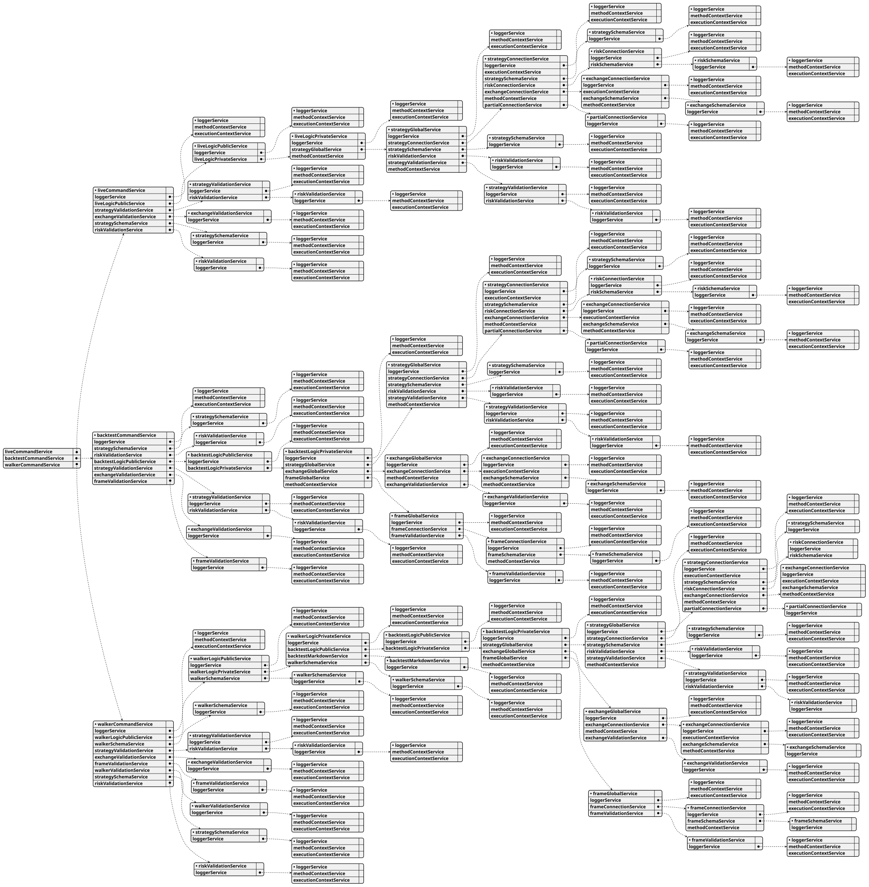

# backtest-kit api reference

**Overview:**

Backtest-kit is a production-ready TypeScript framework for backtesting and live trading strategies with crash-safe state persistence, signal validation, and memory-optimized architecture. The framework follows clean architecture principles with dependency injection, separation of concerns, and type-safe discriminated unions.

**Core Concepts:**

* **Signal Lifecycle:** Type-safe state machine (idle → opened → active → closed) with discriminated unions
* **Execution Modes:** Backtest mode (historical data) and Live mode (real-time with crash recovery)
* **VWAP Pricing:** Volume Weighted Average Price from last 5 1-minute candles for all entry/exit decisions
* **Signal Validation:** Comprehensive validation ensures TP/SL logic, positive prices, and valid timestamps
* **Interval Throttling:** Prevents signal spam with configurable intervals (1m, 3m, 5m, 15m, 30m, 1h)
* **Crash-Safe Persistence:** Atomic file writes with automatic state recovery for live trading
* **Async Generators:** Memory-efficient streaming for backtest and live execution
* **Accurate PNL:** Calculation with fees (0.1%) and slippage (0.1%) for realistic simulations
* **Event System:** Signal emitters for backtest/live/global signals, errors, and completion events
* **Graceful Shutdown:** Live.background() waits for open positions to close before stopping
* **Pluggable Persistence:** Custom adapters for Redis, MongoDB, or any storage backend

**Architecture Layers:**

* **Client Layer:** Pure business logic without DI (ClientStrategy, ClientExchange, ClientFrame) using prototype methods for memory efficiency
* **Service Layer:** DI-based services organized by responsibility:
  * **Schema Services:** Registry pattern for configuration with shallow validation (StrategySchemaService, ExchangeSchemaService, FrameSchemaService)
  * **Validation Services:** Runtime existence validation with memoization (StrategyValidationService, ExchangeValidationService, FrameValidationService)
  * **Connection Services:** Memoized client instance creators (StrategyConnectionService, ExchangeConnectionService, FrameConnectionService)
  * **Global Services:** Context wrappers for public API (StrategyGlobalService, ExchangeGlobalService, FrameGlobalService)
  * **Logic Services:** Async generator orchestration (BacktestLogicPrivateService, LiveLogicPrivateService)
  * **Markdown Services:** Auto-generated reports with tick-based event log (BacktestMarkdownService, LiveMarkdownService)
* **Persistence Layer:** Crash-safe atomic file writes with PersistSignalAdaper, extensible via PersistBase
* **Event Layer:** Subject-based emitters (signalEmitter, errorEmitter, doneEmitter) with queued async processing

**Key Design Patterns:**

* **Discriminated Unions:** Type-safe state machines without optional fields
* **Async Generators:** Stream results without memory accumulation, enable early termination
* **Dependency Injection:** Custom DI container with Symbol-based tokens
* **Memoization:** Client instances cached by schema name using functools-kit
* **Context Propagation:** Nested contexts using di-scoped (ExecutionContext + MethodContext)
* **Registry Pattern:** Schema services use ToolRegistry for configuration management
* **Singleshot Initialization:** One-time operations with cached promise results
* **Persist-and-Restart:** Stateless process design with disk-based state recovery
* **Pluggable Adapters:** PersistBase as base class for custom storage backends
* **Queued Processing:** Sequential event handling with functools-kit queued wrapper

**Data Flow (Backtest):**

1. User calls Backtest.background(symbol, context) or Backtest.run(symbol, context)
2. Validation services check strategyName, exchangeName, frameName existence
3. BacktestLogicPrivateService.run(symbol) creates async generator with yield
4. MethodContextService.runInContext sets strategyName, exchangeName, frameName
5. Loop through timeframes, call StrategyGlobalService.tick()
6. ExecutionContextService.runInContext sets symbol, when, backtest=true
7. ClientStrategy.tick() checks VWAP against TP/SL conditions
8. If opened: fetch candles and call ClientStrategy.backtest(candles)
9. Yield closed result and skip timeframes until closeTimestamp
10. Emit signals via signalEmitter, signalBacktestEmitter
11. On completion emit doneEmitter with { backtest: true, symbol, strategyName, exchangeName }

**Data Flow (Live):**

1. User calls Live.background(symbol, context) or Live.run(symbol, context)
2. Validation services check strategyName, exchangeName existence
3. LiveLogicPrivateService.run(symbol) creates infinite async generator with while(true)
4. MethodContextService.runInContext sets schema names
5. Loop: create when = new Date(), call StrategyGlobalService.tick()
6. ClientStrategy.waitForInit() loads persisted signal state from PersistSignalAdaper
7. ClientStrategy.tick() with interval throttling and validation
8. setPendingSignal() persists state via PersistSignalAdaper.writeSignalData()
9. Yield opened and closed results, sleep(TICK_TTL) between ticks
10. Emit signals via signalEmitter, signalLiveEmitter
11. On stop() call: wait for lastValue?.action === 'closed' before breaking loop (graceful shutdown)
12. On completion emit doneEmitter with { backtest: false, symbol, strategyName, exchangeName }

**Event System:**

* **Signal Events:** listenSignal, listenSignalBacktest, listenSignalLive for tick results (idle/opened/active/closed)
* **Error Events:** listenError for background execution errors (Live.background, Backtest.background)
* **Completion Events:** listenDone, listenDoneOnce for background execution completion with DoneContract
* **Queued Processing:** All listeners use queued wrapper from functools-kit for sequential async execution
* **Filter Predicates:** Once listeners (listenSignalOnce, listenDoneOnce) accept filter function for conditional triggering

**Performance Optimizations:**

* Memoization of client instances by schema name
* Prototype methods (not arrow functions) for memory efficiency
* Fast backtest method skips individual ticks
* Timeframe skipping after signal closes
* VWAP caching per tick/candle
* Async generators stream without array accumulation
* Interval throttling prevents excessive signal generation
* Singleshot initialization runs exactly once per instance
* LiveMarkdownService bounded queue (MAX_EVENTS = 25) prevents memory leaks
* Smart idle event replacement (only replaces if no open/active signals after last idle)

**Use Cases:**

* Algorithmic trading with backtest validation and live deployment
* Strategy research and hypothesis testing on historical data
* Signal generation with ML models or technical indicators
* Portfolio management tracking multiple strategies across symbols
* Educational projects for learning trading system architecture
* Event-driven trading bots with real-time notifications (Telegram, Discord, email)
* Multi-exchange trading with pluggable exchange adapters

**Test Coverage:**

The framework includes comprehensive unit tests using worker-testbed (tape-based testing):

* **exchange.test.mjs:** Tests exchange helper functions (getCandles, getAveragePrice, getDate, getMode, formatPrice, formatQuantity) with mock candle data and VWAP calculations
* **event.test.mjs:** Tests Live.background() execution and event listener system (listenSignalLive, listenSignalLiveOnce, listenDone, listenDoneOnce) for async coordination
* **validation.test.mjs:** Tests signal validation logic (valid long/short positions, invalid TP/SL relationships, negative price detection, timestamp validation) using listenError for error handling
* **pnl.test.mjs:** Tests PNL calculation accuracy with realistic fees (0.1%) and slippage (0.1%) simulation
* **backtest.test.mjs:** Tests Backtest.run() and Backtest.background() with signal lifecycle verification (idle → opened → active → closed), listenDone events, early termination, and all close reasons (take_profit, stop_loss, time_expired)
* **callbacks.test.mjs:** Tests strategy lifecycle callbacks (onOpen, onClose, onTimeframe) with correct parameter passing, backtest flag verification, and signal object integrity
* **report.test.mjs:** Tests markdown report generation (Backtest.getReport, Live.getReport) with statistics validation (win rate, average PNL, total PNL, closed signals count) and table formatting

All tests follow consistent patterns:
* Unique exchange/strategy/frame names per test to prevent cross-contamination
* Mock candle generator (getMockCandles.mjs) with forward timestamp progression
* createAwaiter from functools-kit for async coordination
* Background execution with Backtest.background() and event-driven completion detection

# backtest-kit classes

## Class WalkerValidationService

The WalkerValidationService helps you keep track of and make sure your parameter sweep configurations, called "walkers," are set up correctly. It's like a central registry for these walkers, ensuring they exist before you try to use them in a backtest.

This service lets you register new walkers, and it validates that the walkers and the strategies they depend on are all valid.  It also remembers past validation results to speed things up.

You can add walkers using `addWalker()`, check if a walker exists with `validate()`, and get a complete list of registered walkers using `list()`.  Essentially, it simplifies the process of managing and confirming the setup of your parameter sweep experiments.

## Class WalkerUtils

WalkerUtils provides a helpful toolkit for working with walkers, which are essentially automated trading strategies. It simplifies the process of running and managing these walkers by handling details like logging and extracting necessary information.

Think of it as a central place to start, stop, and retrieve data from your walkers.

The `run` method executes a walker and delivers its results step-by-step.  The `background` method lets you run a walker without needing to track its progress—perfect for tasks like logging or triggering callbacks.  If you need to halt a walker’s activity, the `stop` method gracefully prevents it from generating further trading signals.

You can also use `getData` to collect comprehensive results from all strategies within a walker, and `getReport` and `dump` to generate and save formatted reports summarizing the walker's performance. Finally, the `list` function gives you a quick overview of all active walkers and their current state.  It's designed to be easily accessible, acting as a single instance that you can rely on for all your walker management needs.

## Class WalkerSchemaService

The WalkerSchemaService helps you manage and store definitions for your trading strategies, which we call "walkers." It's like a library where you keep track of all your walker blueprints.

This service uses a special system to make sure your walker definitions are stored correctly and safely.

You add new walker definitions using the `addWalker` function and find them again by their names.

Before a walker definition is added, the service quickly checks if it has all the necessary information in the right format.

If you need to update a walker definition, you can do so with the `override` function, which lets you make changes to existing definitions.

Finally, the `get` function retrieves a walker definition by its name when you need to use it.

## Class WalkerReportService

The WalkerReportService helps you keep track of your optimization experiments. It's designed to listen to events from the walker, which is running your strategy tests.

Think of it as a recorder, capturing the results of each test run, including important metrics and statistics. It logs this data into a SQLite database so you can easily analyze how your strategy is improving over time.

The service automatically keeps track of the best performing strategy during optimization and allows you to monitor the overall progress.  You can subscribe to receive these events and unsubscribe when you're done. The system makes sure you won't accidentally subscribe multiple times.

## Class WalkerMarkdownService

The WalkerMarkdownService helps you automatically generate and save detailed reports about your trading strategies. It listens for updates from your trading simulations (walkers) and keeps track of the results for each one.

Think of it as a reporting engine that organizes your data into easy-to-read tables. These tables compare the performance of different strategies, giving you a clear picture of what's working and what isn't.

The service automatically saves these reports as markdown files, making them simple to share and review. It also provides ways to clear out old data when you're finished with a simulation or want to start fresh. You can even specify which strategies and data points to include in the reports, and where to save them.

## Class WalkerLogicPublicService

This service helps manage and execute your trading strategies, often referred to as "walkers." It builds upon a private service to handle the complexities behind the scenes. 

Think of it as a coordinator – it automatically passes along important information like the strategy name, exchange, frame, and walker identifier with each request.

The `run` method is key; it's how you kick off a backtest, specifying the symbol (the asset you’re trading) and providing context like which walker to use and where the data comes from. It returns a sequence of results as the backtest progresses.

## Class WalkerLogicPrivateService

The WalkerLogicPrivateService helps you compare different trading strategies. It orchestrates the process, keeping track of how each strategy performs.

It works by running each strategy one at a time and providing updates as they finish. You'll see progress reports for each strategy as it completes.

Crucially, it identifies and highlights the best-performing strategy based on the metric you specify. Finally, it delivers a complete ranked list of all strategies once the comparison is finished.

This service relies on the BacktestLogicPublicService to actually execute the individual trading strategies.

## Class WalkerCommandService

WalkerCommandService acts as a central hub for interacting with walker functionality within the backtest-kit framework. It's designed to simplify how different parts of the system work together, particularly when using dependency injection.

This service relies on several other services to handle tasks like logging, managing walker data, validating strategies and exchanges, and ensuring the overall structure is sound.

The `validate` function is a crucial step, checking that your walker and strategy configurations are correctly set up.  It performs this check multiple times as a safety measure to catch potential errors.

The `run` function is the workhorse; it executes the walker comparison process for a specific trading symbol and automatically passes along information about the walker, exchange, and frame being used. The result of `run` is an asynchronous generator, allowing you to process the comparison results piece by piece.

## Class TimeMetaService

The TimeMetaService helps you reliably access the most recent candle timestamp for your trading strategies, even when you're not actively running a tick. It keeps track of these timestamps for each symbol, strategy, exchange, and timeframe combination you're using.

Think of it as a memory of the latest candle time, ensuring you have the right information regardless of where you are in your trading process.

If you need to know the current candle time outside of a regular tick execution, like when performing actions between ticks, this service will provide it.

It works by storing these timestamps in a special "BehaviorSubject," which automatically updates whenever a new timestamp arrives. If a timestamp hasn't been received yet, it will wait a short time to see if one comes along.

You can clear out these stored timestamps to ensure you're always working with fresh data, particularly helpful when starting a new trading simulation or session. Essentially, it's a centralized place to consistently retrieve and manage candle timestamps for your trading activities.

## Class SystemUtils

SystemUtils helps keep backtest sessions separate and clean. It prevents one test from affecting another by temporarily pausing event subscriptions.

The `createSnapshot` function takes a picture of the current event listeners.  Think of it like saving the way things are set up so you can restore them later, effectively isolating your backtest. This is useful to ensure a fresh and independent environment for each backtest.

## Class SyncUtils

The `SyncUtils` class helps you understand what's happening with your trading signals by providing reports and statistics. It gathers information about signal openings and closures, tracking things like total events, how many signals were opened, and how many were closed.

You can ask it for summarized statistics about a specific symbol and strategy to get an overview of its performance. It also lets you generate detailed markdown reports, which are essentially tables, showing you a complete history of the signals – including details like entry/exit prices, profit/loss, and reasons for closing positions.

Finally, you can automatically save these reports to files, neatly organized with the symbol, strategy, and whether it was a backtest or live trade.

## Class SyncReportService

The SyncReportService helps keep track of when your trading signals are created and closed, creating a record for audit purposes. It listens for events related to signal lifecycle changes – when a signal is opened (like a limit order being filled) and when it’s closed (when a position is exited). 

It records details like signal information when a signal is opened, and profit/loss (PNL) and the reason for closure when a signal is closed. These details are then saved to a report file.

To ensure everything runs smoothly, the service only accepts one subscription at a time. You can subscribe to receive these signal events and unsubscribe when you no longer need them.

## Class SyncMarkdownService

This service is responsible for collecting and creating reports about trading signals – specifically when they open and close. It listens for signal events, organizes them, and then generates nicely formatted markdown reports that you can save.

You start by subscribing to receive these signal events; the first time you do this, it connects and starts listening. Subsequent calls to subscribe won't re-connect, keeping things efficient. To stop listening, use the unsubscribe function returned by the subscribe function.

As it receives signal events, the service organizes them into buckets based on the symbol, strategy, exchange, and timeframe – essentially creating a report for each specific combination of these factors. Each event gets a timestamp.

You can request data about a specific combination of those factors, like total events or opens/closes. You can also generate a full report, either to the console or save it to a file, which is helpful for reviewing performance or debugging.

Finally, you can clear the collected data, either for a specific set of conditions or everything at once, essentially resetting the service.

## Class SweepValidationService

The SweepValidationService helps ensure your trading strategies are using valid and existing data sets, which are called sweeps. It keeps track of all registered sweeps, checking that they exist and that their exchange dependencies are correct whenever they're used.

Think of it as a gatekeeper for your sweeps – you register a sweep with this service when you set it up, and it prevents you from using a sweep that's been deleted or has an incorrect exchange setup.

This service won't let you register the same sweep name twice, ensuring uniqueness.

Here's what you can do with it:

*   **Add a sweep:** Register a new sweep for tracking and validation.
*   **Validate a sweep:**  Confirm a sweep is registered and its exchange is working correctly.  It's smart and only performs this check once per sweep name.
*   **List sweeps:** Get a list of all currently tracked sweeps. 

It relies on other services – the logger service for logging and the exchange validation service to check exchange dependencies.

## Class SweepUtils

SweepUtils helps you test out many different trading ideas simultaneously by running them through a parameter sweep. It essentially simulates trading based on various parameters and evaluates how they perform, providing rankings and detailed reports.

Think of it as a way to quickly see which combinations of settings for things like stop-loss percentages, profit targets, and holding times work best.

Here's a breakdown of how it works:

**What it does:**

*   **Simulates trading:** It takes a set of trading ideas (called "Sweep") and runs them in a simulation.
*   **Parameter testing:**  It systematically tests many different settings (parameters) for each trading idea.
*   **Evaluation:** It evaluates the performance of each trading idea based on metrics like Sharpe ratio, Sortino ratio, profit/loss, and recovery.
*   **Reporting:** It produces detailed reports that show how each idea performed, along with author-specific performance tracks.

**Key parameters you can adjust:**

*   `hardStopPercent`:  A safety net that exits a trade if it loses too much.
*   `trailingTakePercent`:  A profit target that adjusts as the trade moves in your favor.
*   `profitLockPercent`:  A floor level for profit, with an exit upon pullback.
*   `holdMinutes`:  A maximum time a trade can be held.

**Important things to know:**

*   **No interaction between authors:** Each trading idea is evaluated in isolation.  There's no consensus or vote weighting.
*   **Strict grading:**  Each trading idea is judged based on whether it made a profit before hitting a stop-loss, always within a defined time window.
*   **Data Considerations:** Only one idea per author, direction, and 8-hour window is used. Ideas at the edge of data may have truncated profiles.

**How to use it:**

The `run` method is the primary way to use SweepUtils.  You provide it with a symbol (the asset you’re trading), a name for the sweep, and a list of trading ideas.  It then handles the entire simulation process, from profiling to ranking.  The results will be a single report bucket containing detailed information.

Essentially, SweepUtils allows for rapid testing and evaluation of trading strategies, helping you identify potentially successful approaches. The final check and confirmation still require a full backtest with a real engine.

## Class SweepSchemaService

The SweepSchemaService acts as a central place to manage and store information about different sweep configurations. Think of it as a library where you can find the blueprints for how a sweep should be executed.

It ensures each configuration has the basic necessary details before it's used.

You register these configurations with specific names, and if you try to register the same name again, the new configuration replaces the old one. If you need to make small adjustments to a registered configuration, you can partially override it, which creates a combined version. You can also simply retrieve a specific configuration by its name when needed.

## Class SweepGlobalService

This service acts as the main gateway for interacting with the sweep functionality. It's responsible for ensuring that the sweep you're requesting actually exists and is compatible with the exchanges involved. 

Think of it as a gatekeeper that then passes the request on to the part of the system that handles the actual simulation execution. 

The `run` method is the primary way to initiate a full sweep simulation. You provide a symbol, sweep name, and a list of ideas, and it takes care of validating everything and then running the simulation through various stages like filtering, evaluation, and ranking.

## Class SweepCoreService

The SweepCoreService is a central piece for running sweep simulations, acting as a bridge between initial requests and the actual data connections. It ensures that the sweep is set up correctly by verifying its references and dependencies. It then passes the work along to the connection layer, managing the sweep execution process.

Internally, it relies on a logger for tracking activity, a sweep connection service for handling data interactions, and a validation service to ensure the sweep parameters are valid.

The key function, `run`, takes information about the symbol, sweep name, and associated ideas, performs a full simulation including filtering, evaluation, and ranking, and ultimately delivers a result. Essentially, it orchestrates the entire sweep process from start to finish.

## Class SweepConnectionService

The `SweepConnectionService` manages how your application interacts with "sweeps," which are sets of pre-defined trading strategies. It's like a central hub that handles creating and reusing these strategies efficiently.

This service keeps track of the trading strategies and their configurations. When you need to run a simulation, you simply provide the details, and the service takes care of the rest, from applying default settings to evaluating the results.

The `getSweep` method is key – it finds or creates a specific trading strategy based on its name, ensuring you're not creating the same one repeatedly.

You can clear out all previously used strategies or clear just one, forcing the system to reload the settings and configurations. 

Essentially, it simplifies the process of working with and running simulations for different trading strategies while optimizing performance through caching.

## Class StrategyValidationService

The StrategyValidationService helps you keep track of your trading strategies and make sure they're set up correctly. It's like a central manager for all your strategy configurations.

You can register new strategies using `addStrategy`, providing a name and a description of how the strategy works.

Before you start using a strategy, the `validate` function checks to ensure it exists and that any linked risk profiles and actions are also valid.

Need a quick overview of all the strategies you've registered? The `list` function provides a simple way to see them all at once. 

Internally, it remembers previous validation results to speed things up – a handy feature when dealing with lots of strategies.

## Class StrategyUtils

StrategyUtils helps you analyze and report on how your trading strategies are performing. It acts as a central hub for gathering and presenting data about strategy events like closing positions, taking profits, and adjusting stops.

You can ask it for statistical summaries of your strategy’s actions, like how many times it took profits versus closed pending orders. 

It can also produce detailed reports in markdown format, showing you each event with key information such as the price, percentages, and timestamps. 

Finally, it can save these reports directly to files, creating nicely named documents that make it easy to track your strategy’s history and share insights. It is a convenient way to observe your strategy's activities and results.

## Class StrategySchemaService

This service acts as a central place for storing and managing the blueprints (schemas) that define different trading strategies. It uses a special type of storage that ensures everything is handled correctly and safely.

You can add new strategy blueprints using `addStrategy()`, effectively registering them for use. To use a strategy, you can retrieve its blueprint by name using `get()`.

Before a strategy blueprint is officially registered, `validateShallow()` checks if it has all the necessary parts and that they are of the correct type.

If a strategy blueprint already exists, you can use `override()` to make changes to it – this allows you to update existing strategies with new information without having to recreate them entirely. 

The `_registry` is where all the strategy blueprints are stored internally, while `loggerService` helps track and debug what's happening within the service.

## Class StrategyReportService

This service helps you keep a detailed record of your trading strategy's actions by writing each event directly to a JSON file. Think of it as creating an audit trail for your backtests.

To start logging, you need to call `subscribe()`. This tells the service to begin recording events like when a scheduled signal is canceled, a pending order is closed, or partial profits/losses are taken.  Each of these actions (cancel-scheduled, close-pending, partial-profit, partial-loss, trailing-stop, trailing-take, breakeven, and activate-scheduled) has a specific function to log it.  These functions capture details about the trade, such as the symbol, price, and strategy context. There’s also functions to record average buy (DCA) events and the movement of stop-loss to breakeven.

When you’re done, use `unsubscribe()` to stop the logging process. This ensures a clean shutdown and prevents further files from being generated. It's designed to be safe to call repeatedly.

The service uses a `loggerService` internally to handle the actual writing of events.

## Class StrategyMarkdownService

This service helps you keep track of what your trading strategies are doing and create reports. It’s designed to be efficient, accumulating events in memory rather than writing them to disk immediately. 

Think of it as a temporary buffer for your strategy's actions like canceling signals, closing trades, taking profits, and more. You can then use this buffer to get statistics and generate a well-formatted markdown report.

To start using it, you need to "subscribe" to begin collecting events. Events are automatically recorded as your strategy runs.  You can then retrieve the collected data, generate reports, or save the data to a file. Once you're done, you need to "unsubscribe" to clear the collected data and stop the collection process.

The service memoizes storage, meaning it caches these event collections to avoid redundant creation.

You can also clear the memory periodically using the `clear` method, which removes accumulated events for a specific strategy or all strategies.

Key methods include `getData` for retrieving raw data, `getReport` for creating markdown reports, `dump` for saving reports to files, and the crucial `subscribe` and `unsubscribe` methods to control event collection.

## Class StrategyCoreService

The `StrategyCoreService` acts as a central hub for managing trading strategies within the backtest framework. It’s responsible for handling strategy operations and ensuring proper context is provided for these operations.

Here's a breakdown of what it does:

*   **Validation:** It validates both the strategy itself and its associated risk settings. This validation is optimized to avoid repeated checks.
*   **Signal Retrieval:** It fetches pending signals, providing details like the current active signal or scheduled signal.
*   **Position State:** It offers methods to retrieve information about the current position, including the percentage closed, total cost, effective entry price, number of DCA entries, and P&L information.
*   **DCA Management:** It handles data related to Dollar Cost Averaging (DCA), letting you get information about entries and costs.
*   **Lifecycle Management:** You can use it to pause, stop, or cancel signals. It also controls strategy disposal.
*   **Backtesting and Ticking:** It wraps and executes strategy backtests or individual ticks (updates) with the correct context.
*   **Partial Adjustments:** Includes methods for validating and adjusting position partials (profit or loss) or trailing stops/takes.
*   **Position Metrics:** Provides access to a variety of position metrics such as the estimated minutes, countdown time, drawdown, and highest profit.

In essence, the `StrategyCoreService` serves as a robust and organized interface for interacting with and managing your trading strategies within the backtest framework.

## Class StrategyConnectionService

The `StrategyConnectionService` acts as a central router for your trading strategies, ensuring that calls to strategy methods are directed to the correct implementation based on the trading symbol, strategy name, exchange, and frame. It's designed to be efficient by caching these strategy implementations to avoid repeated creation.

Here's a breakdown of what it does:

*   **Routes strategy calls:** It directs method calls to the appropriate strategy implementation, ensuring the right strategy handles the request.
*   **Caches strategy instances:**  It keeps previously created strategy instances in a cache, so creating them is faster the second time. This relies on the exchange and frame for isolation.
*   **Manages initialization:** It makes sure strategies are properly initialized before any operations are performed.
*   **Handles live and backtesting:** Works with both real-time trading ticks and historical backtesting data.

The service provides several methods for accessing information about a strategy's state, including pending signals, position details (cost, profit/loss), and scheduled actions. It also offers functions to control strategies like stopping, pausing, and closing pending signals. These methods provide insights into the strategy's progress and allow for adjustments.

## Class StorageLiveAdapter

The `StorageLiveAdapter` helps manage how your trading signals are stored, offering flexibility by letting you choose different storage methods. Think of it as a central hub that connects your trading logic to where your data lives – whether that’s a persistent storage on disk, a temporary memory location, or even a dummy adapter for testing.

It’s designed to be easily adaptable; you can switch between storage methods like persistent storage (saving to disk), memory storage (keeping data only during the session), or a dummy adapter (for testing without saving). The `getInstance` property cleverly ensures that the chosen storage method is only initialized once and reused, saving resources. 

Key events like signal openings, closings, cancellations, and scheduled actions are handled through specific methods that forward the work to the currently selected storage adapter. The `useStorageAdapter` method lets you plug in entirely new storage solutions, while shortcuts like `useDummy`, `usePersist`, and `useMemory` provide convenient ways to switch between common storage types.  `clear()` is particularly important; call it when your environment changes to refresh the storage connection.

## Class StorageBacktestAdapter

The StorageBacktestAdapter acts as a central point for managing how your backtest kit stores and retrieves signal data. It’s designed to be flexible, allowing you to easily switch between different storage methods like keeping data in memory, saving it to a file, or using a dummy adapter for testing.

You can choose between several storage options: a default persistent storage, an in-memory option for quick testing, a dummy option to simulate storage without actually storing anything, or you can define your own custom storage. The system remembers the currently selected storage method and uses it for all storage-related operations.

Important methods include `handleOpened`, `handleClosed`, `handleScheduled`, and `handleCancelled` which pass events to the active storage implementation.  You can also search for specific signals by ID or list all signals. `useStorageAdapter` lets you swap in your own storage implementation.  Finally, `clear` is crucial for resetting the storage instance when you’re running multiple backtests or when the working directory changes.

## Class StorageAdapter

The StorageAdapter is the central hub for managing your trading signals, both from historical backtests and from your current live trading. It automatically keeps track of signals as they're generated.

It's designed to be easy to use – you simply turn it on to start storing signals, and turn it off when you no longer need it. Importantly, it only subscribes to signal sources once to avoid unnecessary overhead.

You can easily search for specific signals by their unique ID, or retrieve lists of all backtest signals or all live signals. This makes it simple to analyze past performance or monitor current activity. 

The adapter provides a single point of access for all of your signal storage needs.

## Class StateLiveAdapter

The StateLiveAdapter provides a flexible way to manage and persist trading state, allowing you to easily swap out different storage methods without altering your core logic. It’s designed to keep track of things like the peak percentage gain and how long a position has been open, which is especially useful for automated trading strategies that rely on real-time analysis.

You can choose how your state is stored: by default, it's saved to a file so it survives restarts, but you can switch to a temporary in-memory version or even a dummy adapter that throws away changes.  These adapters work together using a pattern so that different implementations are interchangeable.

The `disposeSignal` function helps clean up old data when a trading signal is finished. Functions like `useLocal`, `usePersist`, and `useDummy` simplify switching between storage methods. `useStateAdapter` allows for fully custom storage implementations. The `clear` function is handy for situations where your base file path changes between strategy runs, ensuring you get fresh state instances.

## Class StateBacktestAdapter

The `StateBacktestAdapter` provides a flexible way to manage and store state information during backtesting. It uses an adapter pattern, allowing you to easily swap out different storage methods like in-memory storage, file-based persistence, or a dummy adapter for testing.

By default, it uses in-memory storage, but you can switch to persistent storage using the `usePersist()` method or a dummy adapter with `useDummy()`.  The `useLocal()` method returns back to in-memory. The `useStateAdapter()` method lets you integrate completely custom state management solutions.

To keep things clean, memoized state instances are automatically cleared when a signal is cancelled or closed, ensuring efficient resource usage.  You can also manually clear the cache using `clear()`, which is particularly useful when the working directory changes.

This adapter is designed to track key information – like peak performance and how long a position has been open – to help evaluate trading strategies, particularly when using LLMs to generate trading rules. For example, it can be used to automatically exit a trade if a pre-defined peak performance threshold isn’t met after a certain amount of time.

## Class StateAdapter

The StateAdapter is like a central manager for keeping track of your trading data, whether you're running a backtest or a live trade. It makes sure everything is cleaned up properly when signals are finished, so you don’t end up with old, unnecessary data hanging around.

It smartly directs your requests – getting or setting data – to the right place, either the backtest storage or the live trading storage, depending on what you're doing.  To prevent problems, it makes sure that signal subscriptions only happen once.

You can "enable" it to start tracking data, and "disable" it to stop, and it’s safe to disable multiple times.

To see the current data for a particular signal, you use `getState`, and to change the data, you use `setState`. These functions handle the details of where to send the request - either to the backtest or live system.

## Class SizingValidationService

This service helps you keep track of and verify your position sizing rules within the backtest kit. It acts as a central place to register different sizing strategies – think of it as a catalog for how you determine position sizes. 

Before you try to use a sizing strategy, this service makes sure it’s actually registered, preventing errors and ensuring things run smoothly. 

To improve speed, the service remembers past validation results, so it doesn't have to re-check things unnecessarily. 

You can add new sizing strategies using `addSizing`, check if a sizing strategy is valid with `validate`, and see a complete list of available strategies using `list`.

## Class SizingSchemaService

The SizingSchemaService helps you manage and store sizing schemas, which define how much of an asset to trade. It uses a special registry to keep track of these schemas, ensuring they are stored in a type-safe way.

You add new sizing schemas using `addSizing` and can retrieve them later by their assigned name. 

Before a sizing schema is added, it's quickly checked to make sure it has all the necessary properties and is structured correctly.

You can register new schemas using `register`, update existing ones with `override`, and retrieve existing ones with `get`.

## Class SizingGlobalService

The SizingGlobalService helps determine how much of an asset to trade. It’s a central component, using a connection service to perform the actual size calculations. 

Think of it as a behind-the-scenes helper that strategies and the public API rely on. 

It's built with a few key parts: a logger for tracking events, a connection to a sizing service for the calculations, and a validation service to ensure things are set up correctly. 

The core function, `calculate`, is where the magic happens – it takes your risk parameters and a bit of context and figures out the right size for your trade.

## Class SizingConnectionService

The SizingConnectionService helps manage how position sizes are calculated within the backtest kit. It acts as a central point for routing sizing requests to the right sizing logic, ensuring the correct calculations are performed.

It keeps track of sizing configurations, creating and reusing them to improve efficiency.  You specify which sizing method to use through a parameter, and the service handles the rest.

This service provides a way to calculate position sizes, taking into account factors like risk management and the chosen sizing strategy.  If you don't have specific sizing configurations, you can use the default settings, indicated by an empty sizing name. 

Essentially, it simplifies the process of applying sizing strategies by connecting your sizing requests to the appropriate calculation tools and remembering them for faster use later.

## Class SessionLiveAdapter

The `SessionLiveAdapter` provides a flexible way to manage and store session data during live trading. Think of it as a central hub for handling the data associated with your trading strategies. 

It allows you to easily switch between different storage methods, like keeping data in memory for quick access, persisting it to a file on your hard drive for safety, or using a dummy adapter that simply throws away any changes.

The adapter automatically keeps track of where to find the right session data based on the symbol being traded, the name of your strategy, the exchange involved, and the timeframe being used.

You can swap out the storage backend with a few simple commands like `useLocal()`, `usePersist()`, `useDummy()`, or even plug in your own custom storage solution. 

If your working directory changes between strategy runs, it's important to clear the cached instances with `clear()` to ensure everything loads correctly.

## Class SessionBacktestAdapter

This component, called SessionBacktestAdapter, helps manage and store data during your backtesting simulations. Think of it as a flexible container for holding session information, allowing you to easily switch between different storage methods.

By default, it uses an in-memory storage, meaning all data is held in the computer's memory and lost when the program closes. However, you can readily change this to save data to disk for persistence or use a dummy adapter that simply ignores data, which is useful for testing.

The adapter keeps track of session data based on the symbol being traded, the strategy being used, the exchange, and the timeframe of the data. It offers methods to quickly switch between storage options, like using the local, persistent, or dummy adapters. You can also create and use your own custom storage implementations if needed. The `clear` method can be helpful when the working directory changes, ensuring fresh storage instances are used.

## Class SessionAdapter

The SessionAdapter acts as a central hub for handling data related to both simulated trading (backtesting) and live trading sessions. It intelligently directs data requests and updates to the appropriate storage mechanism—either the backtest storage or the live storage—depending on whether you're running a backtest or a live trade. 

Specifically, `getData` lets you retrieve existing data for a particular signal, using information like the strategy name, exchange, frame, and a timestamp to pinpoint the correct value. Similarly, `setData` allows you to update or create new data entries for signals, again considering the backtest/live mode and associated context. These functions abstract away the complexity of knowing which specific storage system you're interacting with.

## Class ScheduleUtils

ScheduleUtils helps you keep an eye on your scheduled signals, making it easier to understand how they're performing. It's designed to be a convenient and accessible tool for tracking and reporting on these signals.

It provides ways to get data about signals, like how many are in the queue, how many have been cancelled, and how long they typically wait. 

You can also generate clear, readable markdown reports that summarize the performance of your signals for a specific symbol and strategy. This lets you quickly spot trends and identify potential issues. 

The tool is set up to be easily used—it's a single, always-available instance. It can even save these reports directly to your computer's file system.

## Class ScheduleReportService

This service helps track the lifecycle of signals that are scheduled for execution. It listens for events like when a signal is scheduled, when it starts processing, and when it's cancelled. 

The service calculates how long it takes for a signal to go from being scheduled to either being executed or cancelled, which is useful for spotting delays. 

It records these events and the calculated durations in a database, allowing you to monitor and analyze the performance of your trading signals.

You can tell it to start listening for these events with a `subscribe` function, which also gives you a way to stop listening with an `unsubscribe` function. The system prevents accidental multiple subscriptions.

## Class ScheduleMarkdownService

The ScheduleMarkdownService helps keep track of your trading signals, specifically scheduled and cancelled ones. It monitors these events as they happen and compiles them into readable reports.

These reports are formatted as Markdown tables, giving you a clear overview of what's happening with your strategies. You'll also get useful statistics like cancellation rates and how long signals are waiting.

The service automatically saves these reports to your logs directory, organized by strategy.

You can also manually request a report or clear out the accumulated data when needed. The service carefully manages data storage to keep everything organized and isolated per strategy and trading frame. The `subscribe` and `unsubscribe` functions let you control when the service is actively monitoring for signal events.

## Class RiskValidationService

This service helps you keep track of your risk management setups and makes sure they're all valid before you use them in your trading strategies. It acts as a central place to register your risk profiles, like maximum position size or drawdown limits. 

Think of it like a checklist to ensure your risk rules are in place and ready to go.  The service remembers previously checked profiles, which speeds things up.

You can add new risk profiles, check if a profile exists and is ready for use, and get a complete list of all the risk profiles you've defined. This helps prevent errors and ensures your risk management is consistently applied.

## Class RiskUtils

This class helps you analyze and understand risk rejection events within your trading system. It acts as a central place to gather and present information about why trades were rejected, providing valuable insights for debugging and optimization.

You can use it to get statistical summaries of rejections, broken down by symbol, strategy, and other factors. 

It can also create detailed markdown reports listing each rejection event with specific details like the price, position, and reason for rejection. 

Finally, the class allows you to easily export these reports to files, so you can keep a record of your risk rejection history and share them with others. Think of it as a way to automatically document and analyze the times your trading system flagged potential issues.

## Class RiskSchemaService

The RiskSchemaService helps you keep track of your risk schemas in a safe and organized way. It uses a special registry to store these schemas, making sure they're consistent and reliable.

You can add new risk schemas using the `addRisk()` function (which is registered via `register()`) and then later find them again by their name using `get()`.

If you need to make small changes to an existing risk schema, you can use the `override()` function to update it – this avoids having to rewrite the entire thing.

Before you add a new schema, the `validateShallow()` function checks that it has all the necessary properties and the correct types, preventing errors down the line. 

The service also has a logger to help track what’s going on and find any issues.

## Class RiskReportService

This service helps you keep track of when trading signals are rejected by your risk management system. It acts as a recorder, capturing details like why a signal was rejected and what the signal was. 

Essentially, it listens for these rejection events and stores them in a database, allowing you to later analyze patterns and perform audits to improve your risk controls.

To get it working, you'll need to subscribe to the risk rejection events, and to stop the recording, you’ll unsubscribe.  The subscription process is designed to prevent accidentally subscribing multiple times. The service also uses a logger to provide helpful messages during operation.

## Class RiskMarkdownService

The RiskMarkdownService helps you generate reports about rejected trades, providing a detailed breakdown of why trades were blocked. It listens for these rejection events and organizes them based on the symbol, trading strategy, and the specific conditions under which they occurred. 

Essentially, it builds up a record of rejections and then transforms that information into easy-to-read markdown tables. You’ll also get summary statistics like the total number of rejections and how they're distributed across different symbols and strategies.

The service automatically saves these reports as markdown files, making it simple to review and analyze rejection patterns. It uses a clever storage system to keep each symbol-strategy combination isolated, preventing data from one analysis from interfering with another. 

You can subscribe to receive these rejection events in real-time, and the service offers ways to clear out the accumulated data when it's no longer needed, or to focus on clearing just one specific test or strategy. It allows you to retrieve statistics and generate reports for specific combinations of symbols, strategies, exchanges, frames and backtests.

## Class RiskGlobalService

This service manages risk-related operations, acting as a central point for validating and processing trading signals. It leverages a connection service to handle risk limit checks and employs a validation service to ensure configurations are correct. Several validation services are involved including validation of risk, exchange, and frame configurations.

The `validate` function is a helpful tool, as it checks your risk settings and remembers previous validations to avoid unnecessary repetition, with detailed logging to keep you informed.

The `checkSignal` function determines if a trade should proceed based on pre-defined risk limits, while `checkSignalAndReserve` takes this a step further. It's a specialized, thread-safe version of `checkSignal`, that also temporarily “reserves” space, ensuring consistent validation even when multiple trading processes are running concurrently.

When a signal is approved, `addSignal` registers it within the risk management system, storing details like the trade direction, price levels, and estimated execution time. Conversely, `removeSignal` informs the system when a trade is closed, cleaning up the risk data.

Finally, `clear` provides a way to remove risk data, either for a specific configuration or completely, allowing you to reset the system as needed.

## Class RiskConnectionService

This service acts as a central hub for handling risk-related operations within the trading framework. It directs requests to the correct risk management implementation based on a given identifier, ensuring that risk checks are performed according to the specified rules. To improve performance, it remembers previously used risk management implementations, so it doesn't need to create them repeatedly.

The core of its functionality lies in the `getRisk` method, which fetches or creates the appropriate risk management instance. The `checkSignal` method is used to determine if a trading signal is permissible based on pre-defined risk limits. It handles various checks like portfolio drawdown, symbol exposure, and position count.

There's also `checkSignalAndReserve`, a special version of `checkSignal` that ensures concurrent operations don't interfere with each other during signal validation.  `addSignal` and `removeSignal` manage the lifecycle of open and closed trades within the risk management system, and `clear` allows for manually invalidating cached risk implementations when necessary.  The service also has dependencies on other services, such as a logger, schema service, and time management system.

## Class ReportWriterAdapter

The ReportWriterAdapter helps manage where your trading data and analytics are stored. It’s designed to be flexible, allowing you to easily switch between different storage methods without changing your core code. 

It keeps track of storage instances for different report types (like backtest results, live trading data, or walker analysis), making sure there's only one instance per type to avoid conflicts. By default, it uses JSONL files for storing data, and it only creates the storage when it’s first needed.

You can customize how reports are stored by providing your own storage adapter, or switch back to the standard JSONL format. There's also a handy “dummy” adapter that’s useful for testing - it simply ignores any data you try to write.  If your working directory changes, you can clear the cache to ensure fresh storage instances are created.

## Class ReportUtils

ReportUtils helps you control which parts of your trading system generate detailed reports. Think of it as a way to turn on or off logging for things like backtest runs, live trading, or performance analysis.

You can selectively enable these reports, and when you do, the system starts recording events and saving them as JSONL files - these files contain information to help you analyze what's happening. It's crucial to remember to clean up these subscriptions later to avoid taking up unnecessary memory.

Conversely, you can disable specific reports without affecting others, stopping the logging process for just those areas. This is useful for focusing on specific aspects of your trading activity. Unlike enabling, disabling doesn't require a special cleanup step – the process stops immediately.

This class is designed to be extended by other classes, like ReportAdapter, allowing for even more customization.

## Class ReportBase

The `ReportBase` class helps you log trading events to files in a standardized JSONL format. Think of it as a central place to record what's happening during your backtests, making it easier to analyze results later.

It automatically creates the necessary directories and files to store these events, ensuring a clean and organized structure. The data is written sequentially to a single file for each report type, and the process includes built-in safeguards to prevent data loss due to timeouts or buffer issues. 

You can efficiently filter and search through this logged data using metadata like the trading symbol, strategy name, exchange, timeframe, and more. The `write` method is the primary way to add new events, and it automatically includes helpful context information along with the event data itself. Initialization is handled safely and only occurs once, even if called repeatedly.

## Class ReportAdapter

The ReportAdapter helps you manage where and how your trading data is stored, offering a flexible way to swap out different storage methods. It remembers the storage settings you choose, so you don’t have to configure them repeatedly.

Think of it as a central point for handling your report data – whether you want to save it to JSONL files, or even discard it completely for testing purposes. The adapter automatically creates and manages the storage instances needed, and it only initializes them when you first start writing data.

You can easily switch between different storage options, like using the default JSONL format, a custom adapter you've built, or even a dummy adapter that throws away data – great for quick tests or scenarios where you don’t need to persist the results. If your working directory changes during backtesting, it’s important to clear the cache so it uses the new base path.

## Class ReflectUtils

This class provides tools to monitor and analyze the performance of your trading positions in real-time, whether you're live trading or backtesting. It simplifies accessing position data like profit and loss, peak profit, and drawdown, while ensuring accurate calculations and proper validation. Think of it as a centralized, reliable way to get key performance indicators for your strategies.

It offers various methods for retrieving information, including:

*   **Profit & Loss (PnL):** You can get PnL in percentage or dollar terms for the current pending signal, taking into account factors like partial closes, slippage, and fees.
*   **Peak Performance Metrics:** It tracks the highest profit price, the time it was reached, and the associated PnL, allowing you to understand peak performance.
*   **Drawdown Analysis:** It provides insights into drawdowns, including the time elapsed since the highest profit or worst loss, as well as the magnitude of the drawdown in percentage or dollar terms.
*   **Timing Information:** It allows you to determine how long a position has been active or waiting for activation.

This class is designed as a singleton, meaning there's only one instance of it, making it easy to access these utilities from anywhere in your code. You can specify whether the data should be fetched for a live or backtest environment. All methods throw errors if the required signals or positions are not found.

## Class RecentLiveAdapter

The RecentLiveAdapter helps you manage and access recent trading signals, offering flexibility in how those signals are stored. It’s designed to be easily customized by swapping out the storage backend – you can choose between persistent storage (saving signals to disk) or using memory alone.  

The adapter uses a factory to create the storage utilities, ensuring that the same instance is used each time, unless you need to refresh it.  It provides methods for retrieving the latest signal, calculating how long ago a signal was created, and handling active ping events – these all pass through to the storage adapter you've selected.

You can easily switch between persistent and memory-based storage using `usePersist()` and `useMemory()`, and if you need to change how the signals are stored entirely, you can set a custom adapter with `useRecentAdapter()`.  The `clear()` method is important to call when the environment changes, ensuring you have a fresh storage instance.

## Class RecentBacktestAdapter

This component helps manage and store recent trading signals, offering flexibility in where those signals are kept. It uses an adapter pattern, meaning you can easily swap between different storage methods like keeping data in memory or saving it to a file.

By default, it uses in-memory storage, but you can switch to persistent storage if you need to.

The `getInstance` property is a clever way to ensure the storage component is only created once, saving resources. It rebuilds itself if the underlying configuration changes.

You can trigger actions like handling events and retrieving signals through this component, and these requests are passed onto the currently active storage adapter.

There's also a way to control which storage adapter is currently in use, allowing you to change how signals are handled on the fly. To refresh the storage component, `clear()` is useful when something like your working directory updates.

## Class RecentAdapter

RecentAdapter is a central component for managing and accessing recent trading signals, working with both historical backtest data and live trading environments. It automatically updates signal storage by monitoring incoming data and provides a consistent way to retrieve the most recent signal for a specific trading symbol and situation. To prevent accidental misuse of future data, it has safeguards ensuring that signals accessed are not from the future.

You can easily turn on and off the signal storage functionality, and it handles the subscription process automatically, so you don’t have to worry about managing subscriptions yourself. 

The `getLatestSignal` function finds the newest signal, checking historical records first and then live data.  You can also check how much time has passed since the last signal using `getMinutesSinceLatestSignalCreated`, which also considers look-ahead bias. Finally, `hasNoLatestSignal` offers a way to quickly determine if any signals exist at all for a given situation, avoiding errors when working with potentially empty datasets.

## Class PriceMetaService

PriceMetaService helps you get the latest market price for a specific trading setup – a combination of symbol, strategy, exchange, and timeframe. Think of it as a central place to find the current price without being directly involved in the trading process itself.

It keeps track of these prices, updating them as new information comes in during trading ticks. If you need the price outside of a normal trading tick, like when executing a command, it will find it for you.

If a price hasn't been received yet, it will wait briefly for the first price to arrive. You can also choose to clear out all the stored prices or just a specific one, which is important to do when a strategy starts to avoid using outdated data. This service is automatically managed by the system and updated during trades.

## Class PositionSizeUtils

This class offers helpful tools for figuring out how much of an asset to trade. It provides several different position sizing methods, each with its own way of determining the right size based on factors like your account balance, entry price, and risk tolerance. 

The calculations for each method—fixed percentage, Kelly Criterion, and ATR-based—are done using static functions, meaning you don’t need to create an instance of the class to use them.  Each sizing method also includes checks to make sure the provided data aligns with how that specific method works, helping prevent errors.

## Class Position

The Position class provides helpful tools for determining take profit and stop-loss prices when you're setting up trades. It simplifies the process by automatically adjusting these levels based on whether you're going long (buying) or short (selling).

It offers two primary methods:

*   **moonbag:** This function is specifically designed for a strategy where your take profit is set at a fixed percentage above or below the entry price.
*   **bracket:** This method allows you to define your own custom percentages for both the take profit and stop loss, giving you more control over your risk and reward.

Essentially, it helps automate the often-tedious process of calculating these crucial price levels.

## Class PersistStrategyUtils

This class helps manage how strategy data is saved and loaded, particularly for situations where you need to keep track of things like pending orders or signals. It essentially provides a way to persistently store the state of a trading strategy.

The class uses a clever system to ensure each strategy gets its own dedicated storage space, and it’s designed to work with different storage methods – you can use the default file-based storage, or swap in your own custom solution.

It handles saving and retrieving this data, and makes sure these operations happen reliably. Importantly, it ensures data integrity, even if unexpected issues arise during the process.

You can change the way the data is persisted by using methods like `usePersistStrategyAdapter`, `useJson`, or `useDummy` to select a different storage implementation. `usePersistStrategyAdapter` lets you use your own custom storage. `useJson` switches to a simple file-based approach, and `useDummy` provides a "no-op" mode which is useful for testing where no actual saving occurs.

The `clear` method is useful for situations where the working directory changes during a strategy run, ensuring the storage is refreshed.

## Class PersistStrategyInstance

This class helps you save and load the state of your trading strategy to a file. It's designed to be reliable, even if your program crashes unexpectedly.

It automatically handles saving the strategy data using a consistent key.

Here's what it does:

*   **`constructor(symbol: string, strategyName: string, exchangeName: string)`**:  You need to tell it which symbol, strategy name, and exchange it's working with when you create it.
*   **`waitForInit(initial: boolean)`**: This makes sure the storage is ready before you try to save or load anything.
*   **`readStrategyData()`**: This retrieves the saved state of your strategy from the file. If nothing has been saved yet, it returns null.
*   **`writeStrategyData(row: StrategyData | null)`**: This saves the current state of your strategy to the file.  Passing `null` will clear out the previously saved data.

It uses `PersistBase` to ensure that data writes happen safely. You don’t need to worry about how the file storage works; this class handles that for you.

## Class PersistStorageUtils

This class provides helpful tools for saving and retrieving signal data, especially when dealing with backtesting and live trading. It keeps track of different storage configurations, allowing you to customize how signals are saved. 

The system intelligently creates storage instances, ensuring you don't need to create them manually each time. 

You can easily swap out the default storage method for your own custom implementation, or even use a "dummy" storage that doesn't actually save anything – useful for testing.

The process is designed to be reliable, ensuring that signal data isn't lost even if there's a system interruption.

Here's a breakdown of what you can do:

*   **Change the Storage Method:** You can use `usePersistStorageAdapter` to specify a custom way of storing signals, or switch back to the default file-based storage with `useJson`.  `useDummy` provides a no-op storage for testing.
*   **Refresh the Storage:** If your working directory changes, use `clear` to reset the storage configuration.
*   **Read and Write Data:** `readStorageData` loads all stored signal data, while `writeStorageData` saves changes. Both initialize the storage connection as needed.
*   **Signals are Keyed:** Each signal is stored as a separate file, making it organized and easy to manage.

## Class PersistStorageInstance

This class provides a way to persistently store data, specifically signal information, to files on your system. Think of it as a reliable storage mechanism for your backtesting framework. 

Each signal is saved as its own JSON file, making it easy to manage and understand the data.  The system automatically handles the process of reading all signals by looking at the file keys. It's also designed to be crash-safe, meaning data is written safely even if unexpected issues occur.

The `backtest` property indicates whether the storage is used in a backtesting scenario. The `_storage` property holds the actual file-based storage system.

You can use `waitForInit` to make sure the storage is ready before you start working with it, specifying if it’s for an initial setup.  `readStorageData` retrieves all the stored signals, and `writeStorageData` saves a collection of signals, assigning each one based on its unique identifier.

## Class PersistStateUtils

This utility class helps manage how your trading strategy's internal data is saved and loaded, ensuring it survives unexpected interruptions like crashes. It focuses on keeping a record of your strategy's state, like its progress or settings, safely stored.

It works by creating specialized storage containers for your strategy’s data, organized by a unique identifier (signalId) and a descriptive name (bucketName).  Think of it like creating labeled folders to keep things organized.

You can easily switch between different ways of storing this data – whether it's using a standard file-based approach, a mock/dummy version for testing, or even a custom solution you create.

The `waitForInit` function lets you control when this storage is actually created, which is helpful for things like first-time setups. The `readStateData` and `writeStateData` functions handle retrieving and saving that data, automatically setting up the storage if it’s the first time it’s needed.  There’s also a way to flush out the memory of what it’s storing.

You can even customize how the data is stored using a custom constructor, essentially creating a new way of saving your strategy's information. The `dispose` method lets you clean up after yourself, releasing storage associated with signals that are no longer active.

## Class PersistStateInstance

This class, PersistStateInstance, offers a straightforward way to save and load state data tied to a specific signal, using files for storage. It essentially handles the behind-the-scenes work of writing and reading data to a file. 

Think of it as a container for your state, organized by a unique identifier (signalId) and a bucket name (bucketName). The bucket name acts like a specific folder for a particular piece of data.

When you need to load data, waitForInit helps prepare the storage. Functions like readStateData and writeStateData retrieve and save that state data using the specified bucket. 

Finally, dispose is a simple operation that doesn't require any cleanup actions from this class itself; instead, it relies on PersistStateUtils to manage related resources.

## Class PersistSignalUtils

This class helps manage how trading signals are saved and loaded, ensuring that information persists even if your system restarts. It keeps track of signal data for each strategy, symbol, and exchange combination, using a special storage system.

You can customize how this storage works by providing your own signal instance creator.
The class automatically handles reading and writing signal data, and it creates the necessary storage components only when needed. 

It also offers ways to reset the storage, switch to a built-in JSON-based storage, or use a dummy storage for testing purposes. This helps keep your signal state reliable and consistent across different strategy runs.

## Class PersistSignalInstance

This class, `PersistSignalInstance`, helps you safely save and retrieve signal data to a file. Think of it as a reliable way to store the current state of your trading signals. It automatically manages the file storage, ensuring that the data is saved correctly, even if something unexpected happens during the process. 

The class identifies each signal by its symbol, the name of your trading strategy, and the exchange it's associated with. It wraps a more basic file storage component (`PersistBase`) to handle writing data in a way that minimizes the chance of corruption.

You can use `waitForInit` to make sure the storage is ready before you start working with it. The core functions are `readSignalData`, which loads the signal data, and `writeSignalData`, which saves the signal data—or clears it if you pass null.

## Class PersistSessionUtils

This class helps manage how your trading sessions are saved and loaded, ensuring data isn't lost unexpectedly. It's designed to be flexible, allowing you to choose different ways to store your session information, whether that’s to a file or even to nowhere at all for testing purposes.

The class intelligently caches these storage options, creating a unique storage location based on your strategy, exchange, and frame name. When a session needs to be saved or loaded, the correct storage location is automatically found.

You can easily swap out the default storage method for your own custom solution, or use a dummy version that doesn’t actually store anything.

Functions exist to initialize storage, read saved data, and write new data, and there's even a way to completely clear the cached storage locations. It's important to clear the cache when your working directory changes. Finally, there's a method to release memory associated with a specific session.

## Class PersistSessionInstance

This class helps you save and load the state of your trading sessions, particularly useful when you want to resume where you left off. It acts as a middleman, managing the actual storage of your session data to a file. 

Each session's data is identified by the strategy name, exchange, frame name, and the trading symbol being used, ensuring that different symbols don't overwrite each other’s information. The `backtest` flag further distinguishes data from backtesting scenarios.

The `waitForInit` method prepares the storage for use. `readSessionData` retrieves saved session data, while `writeSessionData` saves the current session's state. Importantly, `dispose` doesn't do anything on its own; instead, it relies on a separate utility to manage cleanup and cache invalidation.

## Class PersistScheduleUtils

This class helps manage how scheduled trading signals are saved and loaded, ensuring things run smoothly even if there are interruptions. It creates a unique storage system for each trading strategy and the markets it's trading. You can even customize how these signals are stored, using your own methods instead of the defaults.

The system automatically creates and manages these storage instances, and it makes sure that writing and reading data happens reliably.

Here's a breakdown of what you can do:

*   **Customize Storage:** You can tell the system what type of storage to use when creating those signal instances.
*   **Read and Write Signals:** There are functions to fetch existing signals and save new ones.  These functions also create the necessary storage if it doesn't exist yet.
*   **Clear the Cache:** Sometimes, you need to completely refresh the storage, and this class allows you to do that.
*   **Use Default or Dummy Storage:** You can easily switch between a default file-based storage or a dummy version (that does nothing) for testing.

## Class PersistScheduleInstance

This class provides a way to save and retrieve scheduled trading signals to a file, ensuring data consistency even if things go wrong. It's designed to work specifically with a trading strategy and exchange, using their names to identify where the data belongs.

Think of it as a reliable place to store the details of when a signal should be executed.

The class internally handles the file writing process safely, preventing data loss or corruption.

Here's a breakdown of what it does:

*   It stores the trading symbol, strategy name, and exchange name to uniquely identify the data it manages.
*   `waitForInit` prepares the storage area when needed.
*   `readScheduleData` fetches existing schedule data associated with a specific symbol.
*   `writeScheduleData` saves new schedule data or clears any existing data for a particular symbol.

## Class PersistRiskUtils

This class helps manage how your trading positions are saved and loaded, especially when dealing with risk management. It's designed to keep things reliable and efficient.

The system intelligently creates storage instances for each risk profile, avoiding unnecessary creation. 

You can swap out the default storage mechanism to use your own custom solution. 

It handles reading and writing position data – the details of your active trades – and makes sure these operations are handled safely.

If your application crashes, this system will strive to maintain the integrity of your position states.

You can change how the storage is implemented, choosing from adapters, a default JSON-based system, or a dummy adapter for testing. The `clear` function is useful for resetting the storage when the working directory changes.

## Class PersistRiskInstance

This class, `PersistRiskInstance`, provides a reliable way to save and retrieve trading positions to a file. Think of it as a safe keeper for your trading data. It's designed to work with the broader backtest-kit framework.

It handles the underlying file storage, making sure data is written safely and consistently. It uses a specific name, "positions," to organize the data within that storage.

The constructor just needs the risk and exchange names to get started.

You have access to the risk name and exchange name after initialization.

`waitForInit` makes sure the storage is ready to use.

`readPositionData` allows you to load the saved positions, specifying a time to retrieve data as of that moment.

`writePositionData` lets you save new or updated position information, again associating it with a specific time. This class is built to be resilient, protecting your data even if something unexpected happens during the writing process.

## Class PersistRecentUtils

This class helps manage how recent trading signals are saved and retrieved, ensuring they're handled consistently across different situations. It keeps track of these signals for each combination of symbol, strategy, exchange, and timeframe.

Think of it as a smart system for remembering what signals were recently generated.

It uses a clever technique called memoization, which means it creates and stores these signal handlers only when needed, preventing unnecessary work.

You can even customize how these signals are stored by swapping in different “adapters.”

If you need to switch between different storage methods, like using files or a dummy adapter for testing, this class provides simple ways to do so. Clearing the cache is also supported when needed.

Finally, it makes sure the data is read and written safely, even if something unexpected happens during the process.

## Class PersistRecentInstance

This class, `PersistRecentInstance`, helps you save and retrieve the most recent data for a trading strategy. It focuses on writing data reliably, even if things go wrong during the process.

It essentially manages a file where it stores information specific to your trading setup – like the symbol you’re trading, the strategy being used, the exchange involved, and the timeframe being analyzed.  It also keeps track of whether the test is a backtest or a live trade.

Here's a breakdown of what it does:

*   **Initialization:** It sets up the file storage it uses, ensuring it's ready before you try to read or write data.
*   **Reading Recent Data:** It retrieves the last saved signal data associated with a specific trading symbol.
*   **Saving Recent Data:** It records the latest signal data, associating it with the symbol, and ensuring it’s saved correctly.

Think of it as a way to remember the last known state of your trading strategy, allowing you to pick up where you left off. The context it uses includes whether it’s a backtest or live trade and the timeframe being used.

## Class PersistPartialUtils

This class, `PersistPartialUtils`, helps manage and store partial profit and loss information for your trading strategies, ensuring data integrity and allowing for different storage methods. It keeps track of these pieces of data for each symbol, strategy, and exchange combination.

The class uses a clever system of memoization, meaning it creates and remembers storage instances to avoid unnecessary work when dealing with the same data multiple times. You can customize how this data is stored by swapping out the default storage method with your own.

`readPartialData` lets you retrieve previously saved partial data, while `writePartialData` is used to update and save that data. Both methods automatically create a storage instance if one doesn’t already exist.

You have some control over how the partial data is stored. `usePersistPartialAdapter` lets you plug in your own custom storage mechanism. If you prefer a standard approach, `useJson` uses file storage, and `useDummy` provides a simplified mode where no data is actually saved. Finally, `clear` allows you to reset the storage cache, which is useful if your working directory changes during a trading run.

## Class PersistPartialInstance

This class helps you save and retrieve pieces of information related to your trading strategies, like intermediate results or states, to a file. It’s designed to be reliable, even if your program crashes unexpectedly. 

It keeps track of your data using a unique identifier (signalId) and organizes it based on the trading symbol, strategy name, and exchange used.

Here’s a breakdown of what you can do with it:

*   **Initialization:** You start by creating an instance specifying the trading symbol, strategy name, and exchange.
*   **Reading Data:**  You can retrieve partial data, which represents a snapshot of your strategy’s state at a specific point in time, identified by a signal ID.
*   **Saving Data:**  You can store partial data, ensuring that it's saved safely to the file.
*   **Crash Safety:** The class uses a special technique to make sure your data isn’t corrupted even if your application crashes during the saving process.

Essentially, it provides a way to persist incomplete or temporary data during your backtesting or live trading, giving you a safety net and allowing you to resume where you left off.

## Class PersistNotificationUtils

This class provides tools for reliably saving and retrieving notification data, a critical function for backtesting and live trading. It acts as a central point for managing how notification information is stored persistently.

The class leverages a system of memoization to ensure only one storage instance exists per trading mode (backtest or live), making it efficient.  You have the flexibility to customize how notifications are stored by providing your own constructor for notification instances.

If something goes wrong, it aims to keep your notification state safe. 

The `readNotificationData` method is responsible for fetching existing notification data, and `writeNotificationData` is used to save new or updated information. You can switch between different storage methods easily, including a dummy version for testing. The `clear` function helps handle situations where the working directory changes, ensuring a fresh start.

## Class PersistNotificationInstance

This component handles saving and retrieving notification data, primarily for persistence across sessions. It's designed to be reliable even if things go wrong unexpectedly.

It works by storing each notification as its own individual JSON file, making it easy to manage and access specific notifications. 

The framework ensures data safety through techniques like atomic writes.

The `backtest` property simply indicates whether the system is running in a test or live environment. 

Underneath, it uses a file-based storage mechanism.

The `waitForInit` method sets up the necessary storage before any reads or writes happen.

`readNotificationData` loads all the notification data it has saved.

`writeNotificationData` stores a collection of notifications, ensuring each is saved with its unique ID.

## Class PersistMemoryUtils

This class, `PersistMemoryUtils`, helps manage how data is stored and retrieved for trading strategies, especially when you want to make sure things are saved reliably even if there's a crash. It’s like a helper that keeps track of memory entries and makes sure they're handled in a consistent way.

It uses a clever system to make sure each piece of data is stored and accessed efficiently, using a specific location based on the signal and bucket names. You can also customize how the storage works by providing your own storage "builders".

Here's a breakdown of what it does:

*   **Initialization:** It handles setting up the storage for different contexts (signalId and bucketName), and allows you to skip the initial setup if needed.
*   **Reading and Writing:** It provides functions to read, write, and delete memory entries from disk.  These operations are handled in a safe and organized manner.
*   **Cleanup:** It has ways to clear the stored data cache and dispose of specific storage instances, ensuring resources are cleaned up properly.
*   **Indexing:** You can iterate through existing memory entries, which is helpful for rebuilding indexes.
*   **Customization:** It lets you switch between different storage implementations, including a default file-based one and a "dummy" one for testing purposes.

Essentially, it's the backbone for a system that remembers important information from trading strategies and keeps it safe.

## Class PersistMemoryInstance

This class provides a way to store and retrieve data persistently, typically to a file. It's designed to work with the broader backtest-kit framework.

Think of it as a system for saving snapshots of your trading data, identified by a unique signal ID and a bucket name.

Here's a breakdown of what it does:

*   It safely writes data to a file, ensuring that the write operations are atomic.
*   It allows for "soft deletes," meaning entries aren't truly deleted but marked as removed. This is useful for keeping a history.
*   When listing data, it only shows entries that haven't been marked for removal.
*   The initialization process (waitForInit) sets up the underlying storage.
*   You can read specific data entries by their ID, check if a particular entry exists, write new data, or remove data.
*   The `dispose` function doesn’t do anything itself; the system manages the cleanup of cached data.

## Class PersistMeasureUtils

The PersistMeasureUtils class helps manage how your trading framework stores data retrieved from external sources, like API responses. It ensures this cached data is persistent and reliable.

Think of it as a way to keep track of previously fetched information to avoid repeatedly requesting the same data.  It uses a clever system to create and manage these storage instances based on specific criteria like the timestamp and the trading symbol.

You can even customize how this data is stored by providing your own storage mechanism.

The class automatically handles writing, reading, and even deleting cached data. It also takes care of initializing storage areas on the first access and provides a way to clear the cached instances, which is useful when your working directory changes. There's even a “dummy” mode that pretends to store data, which is handy for testing.

## Class PersistMeasureInstance

This class provides a way to store and retrieve measure data, like performance metrics or trading results, persistently to a file. Think of it as a simple database for your backtesting results.

It uses a "bucket" to organize your data, which essentially means a folder where related data is stored.  It handles writing data to files safely and also provides a way to "soft delete" entries, meaning marking them as deleted without actually removing the file itself.

Here's a breakdown of what it can do:

*   **Initialization:** It makes sure the storage area exists.
*   **Reading:** You can fetch individual data entries by a unique key.
*   **Writing:**  It lets you save new data entries.
*   **Deleting:** It marks entries as deleted instead of completely removing them, allowing for easy recovery if needed.
*   **Listing:** It provides a way to get a list of all the available data entries, excluding those that have been marked as deleted. 

It's built on a lower-level component (`PersistBase`) to ensure that data writes happen reliably. The data is stored as JSON files.

## Class PersistLogUtils

This class, PersistLogUtils, helps manage how your trading strategy's logs are saved and retrieved. It's designed to make sure your logs are safely stored even if your program crashes.

It uses a single, cached log instance that's only created when you need it. 

You can customize how logs are stored using different "adapters," allowing you to choose between file-based storage, a JSON format, or even a dummy adapter that doesn't actually save anything.

The class provides methods to read all existing log entries, write new log entries (making sure you don't accidentally duplicate them), and clear the cached log instance when needed, like when your working directory changes. 

It handles writing each log entry as a separate file, identified by its unique ID. Essentially, it provides a reliable way to keep track of what your trading strategy is doing.

## Class PersistLogInstance

This class provides a way to save your trading backtest logs to files, ensuring they are preserved even if your program crashes. It’s designed to work as a simple, reliable storage mechanism.

Each log entry is saved as its own JSON file, making it easy to examine individual entries. 

The system only adds new log entries – it doesn’t modify or delete existing ones, preventing accidental data loss.

The `waitForInit` method prepares the storage for use, and the `readLogData` method retrieves all the log entries. The `writeLogData` method handles the append-only writing of your log data, guaranteeing a crash-safe record of your backtest.

## Class PersistIntervalUtils

This framework component manages how your trading strategy remembers which time intervals have already been processed. It essentially acts as a persistence layer, storing markers in a directory structure like `./dump/data/interval/`. These markers indicate whether a specific time interval has already been handled for a given data bucket and key. 

Think of it as a way to avoid repeating calculations for the same interval.

You can configure how this persistence works, swapping in different storage mechanisms like a file-based system, a JSON adapter, or even a dummy adapter for testing purposes where data isn’t actually saved. The system automatically handles initializing storage for each data bucket as needed.

It provides methods for reading, writing, and deleting these interval markers, as well as clearing the internal cache when the working directory changes. You can also list all existing markers for a particular bucket.

## Class PersistIntervalInstance

This class provides a way to store and retrieve data related to specific time intervals, like when an event should happen again. It uses files to keep this data, ensuring that even if your application restarts, the information isn't lost.

The data is stored in a “bucket,” which acts as a container for related interval information.  Each interval has a unique key.

To keep things flexible, instead of permanently deleting data, it uses a soft delete – marking the data as removed.  This allows the system to temporarily stop using it, but keeps the data around in case you need it later or want to reactivate it.  When you request a list of all intervals, it only shows you the ones that haven’t been marked as removed.

The system also offers a way to initialize the storage, ensuring it's ready when you need it. 

It wraps the underlying storage to make sure writes happen reliably.

## Class PersistCandleUtils

This utility class helps manage how your historical candle data is stored and retrieved. It’s designed to keep a cache of your data, saving each candle as a separate file organized by exchange, symbol, time interval, and timestamp. 

The system automatically checks if the cached data is still valid and refreshes it when needed, particularly if there's missing data. It also handles writing the data in a way that prevents errors.

You can customize how the candle data is persisted by swapping out different "adapters," choosing from a file-based solution, a default implementation, or even a dummy version for testing. The `clear` method is useful for situations where the working directory changes during backtesting. The read and write functions let you access and update this cached data.

## Class PersistCandleInstance

This component helps you save and retrieve historical candle data—think of it as a way to persist your trading data to files. It's designed to work with a specific symbol (like 'BTCUSDT'), a time interval (like 1 minute or 1 hour), and an exchange name.

Each candle is stored as a separate JSON file, organized by the timestamp of the candle. 

When you need to retrieve data, it will return `null` if a timestamp is missing, meaning you’ll need to fetch that data again.

Writing data is a bit selective: it skips any candles that aren’t fully complete (where the `closeTime` is in the future) and prevents overwriting existing data, ensuring your cache always builds up with complete historical information. If it finds any corrupted or invalid data, it will alert you and treat them as if they weren't there.

The `waitForInit` method makes sure the underlying storage is ready to go.

You can read chunks of candle data within a specific timeframe using `readCandlesData`, and write new candles using `writeCandlesData`.

## Class PersistBreakevenUtils

This utility class manages how breakeven data, crucial for tracking trade performance, is saved and loaded. It ensures that the data is safely persisted to disk, organized in a predictable file structure. The system uses a clever trick – it creates only one specific data storage object for each combination of trading symbol, strategy name, and exchange, and reuses that object to avoid unnecessary file operations.

You can customize how this data is stored; for instance, you might choose to use a file-based approach or switch to a dummy implementation for testing. If you're changing where your application runs (like switching working directories), it's helpful to clear the system's memory of previously loaded data to ensure things start fresh. It handles writing and reading breakeven information for individual signals, automatically creating the necessary storage when it's needed for the first time.

## Class PersistBreakevenInstance

This class helps you reliably save and retrieve breakeven data for your trading strategies. It acts as a bridge, handling the details of writing information to a file in a way that prevents data loss even if things go wrong.

It’s designed to work with a specific trading symbol, strategy name, and exchange. 

The `waitForInit` method prepares the storage area, and `readBreakevenData` lets you fetch previously saved breakeven information based on a signal ID and timestamp.  Similarly, `writeBreakevenData` saves new or updated breakeven information, also identified by a signal ID and timestamp.

Essentially, it provides a safe and convenient way to persist breakeven data for your backtesting and trading setups.

## Class PersistBase

This class provides a foundation for reliably storing and retrieving data to files, ensuring that your data remains consistent even if things go wrong. It's designed to manage files related to a specific type of data (identified by `entityName`) within a designated directory (`baseDir`).

The class automatically handles creating the necessary storage directory and checking for any potentially damaged files when it's first initialized. It uses a safe writing method to avoid data corruption during updates and offers a convenient way to iterate through all the stored data.

You can use this class to read existing entities, check if a specific entity exists, write new entities, or get a list of all entity IDs. The list of entity IDs is sorted, and is used during initialization to help keep things in order. The class also has a mechanism to ensure a one-time initialization process, guaranteeing the directory is ready before any operations begin.

## Class PerformanceReportService

The PerformanceReportService helps you understand where your trading strategies are spending their time. It acts as a listener, catching timing events as your strategy runs. 

These events – like how long a particular function takes to execute – are recorded and stored in a database. This allows you to identify bottlenecks and areas for optimization, ultimately making your strategy more efficient.

You can tell it to start listening for these events using `subscribe`, and you’ll get a function back that you can use to stop it. 

If you need to stop listening before that, you can also use `unsubscribe`. The service also uses a logger to provide extra details when things go wrong.

## Class PerformanceMarkdownService

The PerformanceMarkdownService is designed to gather and analyze how your trading strategies are performing. It listens for performance events, organizes the data collected, and then creates detailed reports.

Think of it as a data collector and reporter that keeps track of your strategy's performance over time.

Here's a breakdown of what it does:

*   It keeps a running tally of metrics for each trading strategy.
*   It automatically calculates key statistics like average performance, the best and worst results, and percentile rankings.
*   It generates clear, readable markdown reports that highlight areas of strength and potential bottlenecks in your strategies.
*   These reports can be saved to disk for later review and analysis.

You can also request specific data about a strategy's performance or completely wipe the accumulated performance data when needed. The service uses a storage system that keeps data isolated for each combination of symbol, strategy name, exchange, frame, and backtest type, ensuring organized and reliable data.

## Class Performance

The Performance class helps you understand how well your trading strategies are performing. It lets you collect and analyze performance data for specific symbols and strategies, giving you insights into where your system might be struggling.

You can retrieve detailed performance statistics, like averages, minimums, maximums, and percentiles, to identify potential bottlenecks.

The class can also generate a comprehensive markdown report, visually summarizing your strategy's performance, including the time spent on different operations and potential outlier detections.

Finally, you can easily save these reports to your hard drive in a structured way, so you can track performance over time. The reports are stored in a directory named `dump/performance` by default, but you can customize the location.

## Class PartialUtils

This class provides tools for analyzing and reporting on partial profit and loss data. It helps you understand how your trading strategies are performing by summarizing events like small wins and losses.

It gathers information about these events, which include details like the time, type of action (profit or loss), the trading symbol, and the strategy being used.

You can use it to get a statistical overview of your trading activity, see a detailed markdown report with a table of events, or save that report to a file for later review. The reports include things like profit/loss amounts, trading symbol, strategy name, and the price at which the event occurred. The reports also have a summary at the end. Saving the report will create a file named after your symbol and strategy.

## Class PartialReportService

The PartialReportService helps you keep track of when your trades partially close, whether it's a profit or a loss. It essentially listens for these partial exit events.

It uses two separate channels to receive information: one for profits and one for losses. 

When a partial exit happens, the service records the level and price at which it occurred, saving this data for later review.

You can tell it to start listening for these events with the `subscribe` method, which will give you a way to stop it later.  Conversely, `unsubscribe` stops the service from receiving any further updates. It's designed to prevent accidental duplicate subscriptions, ensuring data integrity.

## Class PartialMarkdownService

The PartialMarkdownService helps you create reports detailing your trading performance, specifically focusing on profit and loss events. It listens for these events – both profits and losses – and keeps track of them for each trading symbol and strategy you use.

You can think of it as a reporting engine that automatically generates markdown tables, which are easy to read, summarizing each event with relevant details. It also calculates overall statistics, like the total number of profit and loss events.

The service saves these reports to your disk, organized in a clear directory structure, making it simple to review and analyze your trading history. You can also retrieve the data or reports programmatically.

Importantly, the service provides ways to subscribe to and unsubscribe from the event signals, ensuring you only receive the data you need. It also offers a method to clear out accumulated data when it's no longer needed, and can clear data for a specific combination of symbol, strategy, exchange, frame, and backtest or clear everything.

## Class PartialGlobalService

The PartialGlobalService acts as a central hub for managing and tracking partial profits and losses within the backtest framework. It's a way to keep things organized and make it easier to monitor what’s happening.

Instead of each strategy handling partials directly, this service sits in between, receiving requests and passing them on.

Think of it as a logging layer too, recording all partial operations to help with debugging and analysis. It ensures consistent tracking across different strategies.

It's designed to be injected into the ClientStrategy, streamlining how strategies interact with the system and ensuring proper dependency management.

Several validation services are also part of this class, which help confirm that configurations like strategies, risks, exchanges, frames, and actions exist and are valid.

The `validate` function checks and remembers previously validated strategy and risk combinations, avoiding unnecessary checks.

Finally, the `profit`, `loss`, and `clear` functions handle updating and tracking the partial state and passing these actions through to the connection service for actual processing.

## Class PartialConnectionService

The PartialConnectionService manages how we track profits and losses for individual trading signals. It’s like a central hub that keeps track of each signal's performance.

It uses a clever caching system – memoization – to ensure we only create one tracking instance for each unique signal, whether it's from a backtest or live trading. This prevents unnecessary overhead.

When a signal becomes profitable or incurs a loss, this service handles the updates and sends out notifications. When a signal is closed, it cleans up its tracking data. 

It works behind the scenes, providing the functionality needed for overall strategy execution and keeping everything running smoothly. It's designed to be flexible and integrates with other parts of the system through injected services like logging and action management.

## Class OrderTransientError

This error class, `OrderTransientError`, is a way to clearly mark when an order attempt fails temporarily—think network glitches or exchange issues—and signals that it should be retried. It's not a special case for the framework itself; any unexpected error is treated as transient by default. Instead, it's for developers to explicitly state their intent, making code easier to understand.

Here's how it affects different parts of the system:

*   **Opening an order:** The system will repeatedly try to open the same order with the same ID until it succeeds, up to a limit. Before each retry, the system checks if an order with that ID already exists on the exchange to prevent duplicates.
*   **Closing a position:** Similar to opening, the system will repeatedly try to close a position multiple times. If it fails repeatedly, it forces a closure and signals a serious problem.
*   **Checking order status:** Failed checks are tolerated, and monitoring continues. Too many consecutive failures result in a terminal state.

Importantly, exhausting the retry attempts for transient errors is a critical issue, leading to a shutdown. It’s a safety net for serious, persistent problems. The system persists retry counts, so a crash won't reset the attempt count—instead, it assumes a previous attempt may have been in progress. The static `isOrderTransientError` method is a symmetrical addition to ensure consistent error handling, though the framework itself doesn't rely on this error class.

## Class OrderRejectedError

This error signals a definitive rejection of an order by the exchange, meaning retrying the order won't work. It's specifically thrown from order-handling components like broker adapters or action handlers when the exchange confirms an order cannot be fulfilled.

When this error occurs, the backtest framework takes immediate action: open orders are dropped, any retry attempts are canceled, and a new order signal is allowed to be generated. For closing orders, the framework immediately closes the simulated position, even bypassing any retry mechanisms. The system will log a warning and continue running; it’s a normal, albeit undesirable, outcome, unlike a fatal network issue.

It's essential to only throw this error when the rejection is due to a confirmed business impossibility – like a delisted symbol or account restriction – not due to temporary network problems.  Throwing it inappropriately results in the error being treated as a transient issue.

This error is identified by a specific runtime brand (`__type__`), ensuring it’s recognized even across different module copies.  Keep in mind that in backtest mode, this error is largely irrelevant as it is immediately confirmed.  The error message itself is optional and primarily for informational purposes. Use the `isOrderRejectedError` static method for type checking instead of `instanceof` to account for possible duplicate module instances.

## Class OrderDeletedError

The `OrderDeletedError` is a special error indicating the exchange has definitively confirmed an order is no longer present – it's been canceled, liquidated, or removed in some way. This isn't just a timeout or network issue; it's a definitive statement from the exchange.

You should only throw this error within order checks, such as when verifying active orders or scheduled entry orders. When thrown, it immediately resolves to a "deleted" verdict, bypassing normal retry attempts. For open positions, this means the position will be closed, and for pending orders, the scheduled signal will be cancelled.

Critically, don't use this for filled orders or network problems; those require different error handling. This error signals a concrete business event – an order truly vanished – and isn't a temporary issue. It's specific to order checks and shouldn’t be used elsewhere because it will be treated as a transient error.

The error is identified by a special runtime "brand," which allows it to be recognized even if the codebase is split across multiple files or modules.  Finally, the error is not thrown during backtests, as there’s no real exchange involved. Use the static `isOrderDeletedError` function for type checking.

## Class NotificationLiveAdapter

This component helps you manage and send notifications about your trading strategy's performance and status. Think of it as a central hub for communicating events like signal triggers, profit/loss updates, and order confirmations.

It's designed to be flexible, allowing you to easily switch between different notification methods—like storing notifications in memory, saving them to a file, or even doing nothing at all (for testing purposes).

You can use it to receive updates about:

*   Strategy events (like commitment and synchronization)
*   Order events (like fills, rejections, and continuation/stop signals)
*   Risk and pause state changes
*   Errors and validation issues

It keeps track of these notifications and provides a way to retrieve them or clear them out. The `use...` methods let you change how notifications are handled, and `clear()` ensures that the system re-initializes when needed, particularly when the working directory changes. This adapter is your go-to for keeping track of what's happening with your trading strategy and communicating those events effectively.

## Class NotificationHelperService

This service helps manage and send out notifications about important signals during the trading process. It’s designed to make sure everything is validated before sending, and it does this efficiently by remembering previously validated setups. 

Think of it as a gatekeeper: it checks strategy, exchange, frame, risk, and action schemas to ensure everything is correct before proceeding.  It only runs these checks once for each unique combination of strategy, exchange, and frame.

If you’re working with "onActivePing" callbacks, you'll use the `commitSignalNotify` method to send those signal notifications. This method takes care of validation, retrieving the signal, and then sending the `SignalInfoContract` to listeners and a notification adapter, ensuring proper communication and record-keeping. This simplifies the process of sending out those crucial signal updates.

## Class NotificationBacktestAdapter

This component, `NotificationBacktestAdapter`, helps manage notifications during backtesting, allowing you to choose how those notifications are handled – whether they're stored in memory, persisted to disk, or simply ignored. It's designed to be flexible, so you can easily switch between different notification implementations without changing your core backtesting logic.

You can think of it as a central hub that receives various events (like signals, order fills, errors) and then routes them to the configured notification system.  

Here's a breakdown of what it offers:

*   **Flexible Notification Handling:** It allows you to swap out the actual notification implementation (e.g., saving to a file, logging to the console, or doing nothing).
*   **Multiple Adapters:** It comes with several built-in adapters: a default in-memory one, a persistent storage option, and a “dummy” adapter that effectively silences all notifications.
*   **Convenient Switching:** You can quickly switch between these adapters using methods like `useMemory()`, `usePersist()`, and `useDummy()`.
*   **Event Handling:**  It provides methods to handle various backtesting events – everything from signal generation to order rejections and errors – and forwards these events to the currently selected adapter.
*   **Data Management:** It lets you retrieve all stored notifications and clear them when needed.
*   **Memoization:** The adapter caches the notification utilities instance, rebuilding it only when necessary (like when the working directory changes).

Essentially, this adapter handles the "plumbing" for notifications so you don't have to.

## Class NotificationAdapter

The NotificationAdapter is the central hub for handling notifications, both during backtesting and in live trading. It automatically receives and manages updates from various signals within the trading system.

You can enable the adapter to start listening for notifications, and it uses a special mechanism to prevent being subscribed multiple times. 

Conversely, you can disable it to stop listening – and it's safe to call this disable function repeatedly.

To retrieve all the notifications, whether they are from a backtest or live session, use the `getData` function.

Finally, when you’re finished, the `dispose` function allows you to clear all the stored notifications.

## Class MemoryLiveAdapter

This component provides a flexible way to manage data during live trading, acting as a central storage point. It's designed to be adaptable, allowing you to easily switch between different storage methods like keeping data entirely in memory, saving it to files, or even discarding it.

The `MemoryLiveAdapter` keeps track of data based on a unique identifier (`signalId`) and a category (`bucketName`). When a signal is finished, the adapter automatically cleans up any related data it was holding.

You can interact with the data by writing new entries, searching for existing ones using a full-text search, listing all entries, deleting entries, and reading specific entries.

To change how the data is stored, you can quickly switch between different storage backends: a local in-memory option, a persistent file-based option (which is the default), a dummy option that ignores all data, or even use a custom storage implementation you create yourself. Clearing the cache is important if the base directory changes.

## Class MemoryBacktestAdapter

This adapter provides a flexible way to manage memory storage during backtesting. It acts as a central point for interacting with different memory implementations, allowing you to easily switch between in-memory, persistent, or even dummy storage options. The default setup uses a simple in-memory system for quick and easy testing.

You can choose to persist data to files on your hard drive, discard data entirely for testing purposes, or even provide your own custom memory storage solution.  The adapter keeps track of memoized instances to optimize performance, and provides a method to clear these instances when needed, for example when the working directory changes.

Key features include writing data, searching through it using full-text search, listing all entries, removing specific entries, reading single entries, and the ability to change the underlying memory storage mechanism. The `disposeSignal` method is crucial for cleaning up memory associated with specific signals.

## Class MemoryAdapter

The MemoryAdapter acts as a central hub for managing memory storage within the backtest and live trading environments. It's responsible for enabling and disabling memory functionality, and for directing memory-related operations to the appropriate system – either the backtest environment or the live environment – based on configuration.

Think of it like this: enabling the adapter subscribes it to signal events, ensuring that old memory instances are properly cleared when signals are closed. Disabling it simply unsubscribes it from those events.

You can write data to memory using `writeMemory`, search for existing memory entries using a search query with `searchMemory`, list all entries with `listMemory`, remove entries with `removeMemory`, or read a single entry with `readMemory`. These actions are always handled by the correct environment, whether you’re running a simulation or live trading. A special mechanism prevents accidental duplicate subscriptions, making sure things run smoothly and efficiently.

## Class MaxDrawdownUtils

This utility class helps you analyze and understand the maximum drawdown experienced during trading simulations or live trading. It's designed to work with data collected about maximum drawdowns, providing easy access to statistics and reports.

You can use it to get a snapshot of drawdown statistics for a specific trading setup, like a particular strategy on a certain exchange. 

It also lets you create markdown reports that detail all the maximum drawdown events that occurred for a given symbol and strategy. These reports can be viewed directly or saved as files for later review. Essentially, it’s a tool for understanding and tracking the potential risks associated with your trading strategies. 

The class manages its own data internally, so you don’t need to worry about complex setup - just access its methods directly.

## Class MaxDrawdownReportService

The MaxDrawdownReportService is designed to track and record instances of maximum drawdown during backtesting. It keeps an eye on a stream of drawdown events and saves detailed records to a database for later analysis.

To get started, you'll typically subscribe to this service to begin collecting drawdown data. It's designed to avoid accidentally subscribing multiple times, ensuring efficient operation.

When a drawdown event occurs, it captures key information like timestamps, symbols, strategy names, exchange details, and price levels, including take profit and stop-loss values derived from the signal.

You can stop the data collection process by unsubscribing from the service. This ensures no further records are written to the database.

## Class MaxDrawdownMarkdownService

This service helps you automatically generate and save reports about maximum drawdown, a key risk metric in trading. It keeps track of drawdown data for different symbols, strategies, exchanges, and timeframes.

You need to first subscribe to the `maxDrawdownSubject` to begin receiving and processing drawdown events.  Make sure you also unsubscribe when you no longer need it.

The `getData` method lets you retrieve the accumulated drawdown statistics for a specific trading scenario. You can then use `getReport` to create a human-readable markdown report based on those statistics.  Finally, `dump` takes that report and saves it as a file.

To completely reset the stored data and clear out all the accumulated drawdown events, use the `clear` method.  You can clear just a specific set of data (like for one symbol/strategy combination) by providing a payload, or clear everything if you don’t.

## Class MarkdownWriterAdapter

The MarkdownWriterAdapter helps you manage how your backtest results are saved. It provides a flexible way to choose where your reports are stored, like in separate files, a single combined file, or even not at all. You can easily switch between different storage methods without changing your core code.

The adapter automatically creates the necessary storage when you first write data.

It uses a system of "adapters" that can be swapped out to control the storage mechanism, and it keeps track of these storage locations to ensure you're not creating duplicates.

You can change the default storage type using `useMarkdownAdapter`.

To save your reports as individual markdown files, use `useMd`. To append reports to a single JSONL file, use `useJsonl`. To completely disable markdown output, use `useDummy`. If your working directory changes, calling `clear` will refresh the storage locations.

## Class MarkdownUtils

This class helps you control when and how markdown reports are generated for different parts of your backtesting and trading framework. It lets you turn on or off the creation of markdown reports for things like backtests, live trading, strategy analysis, and more.

You can enable report generation for specific services, and it's really important to remember to unsubscribe from those services when you're done to avoid problems.

Conversely, you can disable report generation for certain services without affecting others.  This is useful if you want to temporarily stop creating reports for one area but continue generating them elsewhere.

Finally, there's a way to clear the data that's been accumulated for reports, effectively resetting the reports for a specific service while keeping the service itself running.

## Class MarkdownFolderBase

This adapter helps you create reports with each trading report saved as its own individual markdown file. It's designed for easy readability and manual review of your backtest results. 

Think of it as organizing your reports into a well-structured directory where each file represents a specific test run. The adapter automatically creates the necessary folders and handles saving the markdown content directly to the specified file path. 

Essentially, it offers a straightforward way to build report directories with individual markdown files, making it simple to browse and understand your backtesting data. 

The `waitForInit` method doesn't do anything special since it directly writes to files, and the `dump` method is your main tool for creating the report files. You provide the content and it handles writing it out to the correct location.

## Class MarkdownFileBase

This component provides a way to generate markdown reports in a structured JSONL format, making it easier to manage and process them later. It creates a single JSONL file for each type of markdown report you're producing. 

Think of it as a centralized logging system for your markdown outputs. The system writes to files in a specific directory structure and includes helpful metadata like the symbol, strategy, exchange, frame, and signal ID, so you can easily filter and find the reports you need.

The adapter handles file creation, manages writing operations to prevent overwhelming the system, and includes safeguards to prevent writing indefinitely.  It's designed to be robust, with automatic error handling and timeout protection. You can safely call the initialization function multiple times without issue.  Finally, the `dump` method is how you add new markdown content to the JSONL file, ensuring everything is correctly formatted and tagged.

## Class MarkdownAdapter

The MarkdownAdapter helps you manage how your markdown data is stored, offering flexibility and efficiency. It allows you to easily switch between different storage methods without changing the core logic of your application. 

You can choose to store your markdown as individual files, each in its own .md file, or combine them into a single .jsonl file. There's even a dummy mode for testing purposes where writes are ignored. 

The adapter remembers the storage type you've selected, so you don't need to specify it every time. 

It uses a smart caching system to ensure you're only creating the storage instances you need, which helps keep things performant. If you want to use a custom way of saving markdown data, you can provide your own adapter constructor.

## Class MCPValidationService

This service is responsible for ensuring that the Model Context Protocols (MCPs) your system uses are properly set up and compatible. It keeps track of all registered MCPs and makes sure they still exist and meet the required strategy dependencies whenever they're needed. 

Think of it as a gatekeeper for your MCPs – it prevents you from registering the same MCP multiple times and catches potential problems early on.

Here's what you can do with this service:

*   **Register an MCP:** You add new MCPs to the system using the `addMCP` function.  It will prevent you from adding the same MCP twice.
*   **Validate an MCP:** The `validate` function checks if an MCP is registered and if its strategy dependencies are valid.  It only does this check once per MCP name to save time.
*   **List all MCPs:**  If you need a complete inventory of all the MCPs the system knows about, you can use the `list` function.

The service relies on other components like a logger and strategy validation service to function. It uses an internal map to manage the registered MCPs.

## Class MCPUtils

The `MCPUtils` class helps connect a trading strategy to an external agent, allowing the agent to observe and interact with the trading process. Think of it as a bridge that translates what's happening in the strategy into messages the agent can understand, and relays commands from the agent back to the strategy.

It provides several methods for the agent to stay informed:

*   `getDefaultMessages` generates a standard snapshot of the portfolio, including key stats like open positions, total investment, and profit/loss.
*   `getHistoryMessages` shows a history of closed trades, detailing results, reasoning, and relevant information, which helps prevent repeating past mistakes.
*   `getAgentMessages` delivers log messages generated by the strategy itself, acting as direct instructions or alerts from the system.
*   `getNotificationMessages` presents specific trading events—opens, closes, and notes—with descriptions, which helps the agent understand the context behind decisions.
*   `getStatus` provides a real-time view of the current portfolio, including prices, entry/exit points, and profit/loss for each symbol.

The agent can also directly influence the trading:

*   `commitPositionOpen` lets the agent manually open a position, setting the initial order with specific parameters.
*   `commitPositionClose` allows the agent to manually close a pending position.
*   `commitAverageBuy` allows the agent to add a DCA (Dollar Cost Average) entry to a position.
*   `commitSignalNotify` enables the agent to send a notification related to a position.

All these methods carefully validate the process to ensure everything aligns with the overall trading strategy and risk management rules before any action is taken. It's a controlled way to give an external agent visibility and some control over the trading.

## Class MCPSchemaService

The MCPSchemaService acts as a central place to store and manage descriptions of Model Context Protocols (MCPs). Think of it as a library of blueprints for how different parts of your trading system communicate.

It keeps track of these blueprints, associating each one with a unique name.  When registering a new blueprint, it performs a quick check to make sure the basic structure is correct. 

This service is used by other parts of the framework, such as the strategy resolution process and message handling.

Here's what you can do with it:

*   **Register a new schema:**  You can add a new MCP blueprint to the service, giving it a name. If you try to register a blueprint with the same name twice, the new one replaces the old one.
*   **Update a schema:**  You can modify an existing blueprint, changing only specific parts of it. This lets you make changes without replacing the entire description.
*   **Retrieve a schema:** You can look up a blueprint by its name to get its definition.

## Class LookupUtils

The LookupUtils acts like a central record keeper for all ongoing backtests and live trading sessions. It tracks each session, noting when it starts and when it finishes. 

This registry is used to manage how efficiently the system handles data processing, specifically deciding whether to pause certain operations to avoid unnecessary delays. 

You interact with it using a few key methods: `addActivity` to register a new session, `removeActivity` to clean up after a session completes, and `listActivity` to get a current overview of what’s running. Think of it as a place to find out what's currently happening in your trading framework. 

It's a singleton, so it doesn't require any setup or configuration.

## Class LoggerService

The LoggerService helps you keep your trading logs organized and informative. It's designed to automatically add important details to your log messages, like which strategy, exchange, or part of the code generated the message. Think of it as a central place for logging, ensuring consistency across your entire backtesting framework.

You can plug in your own preferred logging system, or if you don't set anything up, it will simply do nothing. 

The LoggerService includes methods for logging different severity levels – general messages, debugging information, warnings, and more – all with automatic context. It simplifies the process of tracking what's happening during your backtests. It also holds services for managing method and execution context, ensuring that information is accurately added to each log entry.

## Class LogAdapter

The `LogAdapter` provides a flexible way to manage how your backtesting framework records information. Think of it as a central hub for logging, allowing you to easily change where and how those logs are stored.

By default, logs are kept in memory, but you can swap that out to persist logs to disk, use a "dummy" adapter that throws away logs entirely, or even log to a JSONL file.  The `useLogger` method lets you completely define a new logging mechanism.

The `clear` method is important to call when the working directory changes during backtesting runs; it ensures that a fresh log adapter is initialized with the updated path.  Methods like `log`, `debug`, `info`, `warn`, and `agent` all pass log messages down to the currently selected logging method. The `getList` method lets you retrieve all of the logged entries.

## Class LiveUtils

The LiveUtils class provides tools for managing live trading operations within the backtest-kit framework. It acts as a centralized utility, simplifying the process of running live trades and handling associated tasks.

Think of it as a helper for your live trading strategies, offering features like automatic restarts after crashes, and a way to run strategies in the background without constantly monitoring them.  You can get details about a running strategy, like pending signals or current position information.

Key capabilities include:

*   **Running Live Trades:**  The `run` function starts a live trading process for a specific symbol and strategy, providing a continuous stream of data.  It’s designed to be resilient, automatically recovering from crashes and resuming where it left off. A `background` method runs the trades without real-time feedback.
*   **Signal Management:** It allows you to retrieve information about pending and scheduled signals.  You can also cancel scheduled signals or close pending positions directly.
*   **Position Details:** Easily access information about the current open position, such as its total percentage closed, cost basis, entry prices, and estimated duration.
*   **Safety Nets:** Functions for setting breakeven points, adjusting stop-loss and take-profit levels, and triggering partial closes.
*   **Reporting and Monitoring:** Generate detailed reports of trading activity or list the status of all running strategies.
*   **Control:** Allows pausing and resuming a running strategy.

LiveUtils manages a singleton instance to ensure easy and consistent access to these functions across your trading application.

## Class LiveReportService

The LiveReportService helps you track your trading strategy in real-time by recording every important event. It listens for signals like when the strategy is idle, when a position is opened, when it's actively trading, and when a position is closed.

All of this data, including the specifics of each signal, is then saved to a database so you can monitor your strategy's performance and analyze its behavior as it's happening.

The service uses a logger to provide debugging information.

You can easily start receiving these live events by subscribing; this also prevents accidental duplicate subscriptions.  When you're done, you can unsubscribe to stop receiving the events. The service will gracefully handle the situation if you try to unsubscribe before subscribing.

## Class LiveMarkdownService

The LiveMarkdownService is designed to automatically create and save detailed reports about your live trading activity. It keeps track of everything that happens during a trade – from when a strategy is idle, to when a position is opened, active, and finally closed. These events are then compiled into easy-to-read markdown tables, making it simple to analyze your trading performance.

The service listens for trading signals and accumulates data for each strategy, offering insights like win rate and average profit/loss.  It organizes these reports into files, stored in a `logs/live/{strategyName}.md` directory, so you can easily review historical trading activity.

You subscribe to receive live trading updates, and the service handles the underlying mechanics of data storage and report generation. It's designed to manage data on a per-symbol, strategy, exchange, frame, and backtest combination basis, ensuring that each trading setup has its own dedicated data storage.

You can also request specific data or reports, or clear the accumulated data if needed, either for a single trading setup or globally. The `tick` method is the central point where the service processes incoming trading events.

## Class LiveLogicPublicService

LiveLogicPublicService helps manage and execute live trading operations, making it easier to work with trading strategies. It automatically handles important context information like the strategy and exchange names, so you don't have to pass them manually to every function.

Think of it as a continuous, never-ending process that streams trading results (whether a trade is opened, closed, or cancelled).

It’s designed to be resilient – if something goes wrong and the process crashes, it can recover and continue from where it left off by saving state. The framework also keeps track of time using Date.now() for accurate progression.

You can start the live trading process for a specific symbol, and the service takes care of the rest, seamlessly integrating the necessary context.

The service relies on a logger for tracking information and a private service for the core trading logic, along with a connection service to interact with the exchange.

## Class LiveLogicPrivateService

This service manages the continuous process of live trading, acting as a central orchestrator. It operates in a loop, constantly monitoring and reacting to market data.

Each cycle involves recording the current time, checking the status of trading signals, and then providing updates on trades that have been opened or closed.  Idle or active trades aren't reported, focusing on the most impactful changes.

The service is designed to be memory-efficient by streaming data rather than accumulating it. Because it runs in an infinite loop, it's meant to continuously operate until explicitly stopped.  It also has a built-in mechanism to recover from crashes, ensuring that the trading process resumes where it left off.

The `run` method is the key to starting this process; you provide the symbol you’re trading, and it returns an async generator that gives you those updates.

## Class LiveCommandService

LiveCommandService provides a way to interact with live trading features within the backtest-kit framework. It acts as a central access point, simplifying how other parts of the system work with live trading logic.

Think of it as a helper that manages several underlying services, like logging, validation, and the core live trading engine itself.

The `validate` function helps ensure that your trading strategy and the related risk settings are configured correctly, and it intelligently remembers previous validations to speed things up.

The `run` function is the main way to kick off live trading, letting you specify the asset (symbol) you want to trade and important details about the strategy and exchange being used. It handles the ongoing trading process, including automatically recovering from any unexpected issues.

## Class IntervalUtils

The `IntervalUtils` class helps manage functions that you only want to run once within a specific time period, like once per trading day or hour. It provides two ways to do this: one that keeps track of timing in memory, and another that saves that information to a file so it persists even if your program restarts.

Think of it as a way to ensure a task only happens once in a given interval.

There's a special singleton instance called `Interval` that you'll use to access these utilities.

The `fn` utility wraps your functions for in-memory interval control, while `file` does the same but uses persistent storage.  If a function returns `null`, it will retry later.

You can manually clean up old, unused function instances with the `dispose` method, or clear *everything* if you need to reset the interval tracking, like when your working directory changes. The `resetCounter` method is for a similar cleanup scenario when dealing with persistent file storage.

## Class HighestProfitUtils

This class offers tools to analyze and report on your highest profit trades. Think of it as a way to get a detailed breakdown of which strategies are performing best.

It gathers information about your most profitable trades, pulling data from events tracked by another component.

You can use it to:

*   Get specific statistical data for a given trading symbol, strategy, exchange, and timeframe. This is like getting a numerical summary of performance.
*   Generate a markdown report outlining all of your highest profit events for a specific combination of symbol and strategy.
*   Save that report directly to a file, making it easy to share or review later.

## Class HighestProfitReportService

This service is responsible for tracking and saving the moments your trading strategy achieves its highest profit. It monitors a specific data stream, `highestProfitSubject`, and when a new highest profit is detected, it records all relevant details like the timestamp, symbol, strategy name, exchange, timeframe, and backtest information. 

It also captures specifics about the trade signal itself, including the position size, current price, and the original price levels used for entry, take profit, and stop loss. This helps you analyze exactly what conditions led to your best performance.

To begin saving this data, you'll need to "subscribe" to the service, and this subscription is managed in a way that prevents multiple subscriptions. When you're finished, you can "unsubscribe" to stop the data recording.

## Class HighestProfitMarkdownService

This service is designed to collect and generate reports about the highest profit achieved by a trading strategy. It listens for incoming data about profitable trades, organizing them by symbol, strategy, exchange, and timeframe.

You can subscribe to receive these data points, and the service ensures you won't be subscribed multiple times. Unsubscribing will clear all accumulated data and stop the service from listening for new events.

The `tick` method handles each incoming data point, routing it to the correct storage area.

You can retrieve the accumulated statistics for a specific trading context using `getData`, or generate a markdown report using `getReport`. The report includes a table of the most recent events and the total number of events recorded.  `dump` will create and save the report as a markdown file to disk, named according to the symbol, strategy, exchange, timeframe, and whether it’s a backtest or live trade.

Finally, `clear` lets you erase the collected data, either for a specific symbol/strategy combination or to wipe everything clean.

## Class HeatUtils

HeatUtils offers tools to visualize and analyze your portfolio's performance using heatmaps. It simplifies getting and presenting data across different strategies and symbols.

Think of it as a way to get a quick, aggregated view of how your trading strategies are doing, breaking down the results for each asset involved.

It automatically gathers the necessary statistics from all your closed trades.

You can retrieve the raw data for a strategy, generate a formatted markdown report showing key performance indicators like profit, Sharpe ratio, and drawdown, or even save that report directly to a file. 

The reports organize symbols by their total profit, making it easy to identify top performers. 

## Class HeatReportService

HeatReportService is designed to help you understand how your trading strategies are performing by tracking closed trades. It acts as a listener, specifically focusing on events that mark the end of a trade and including profit and loss information.

This service collects data from all the symbols you’re trading, providing a broad picture of your portfolio’s activity. It then neatly stores this data, ready for generating insightful heatmaps to visualize trade patterns.

To avoid accidentally registering multiple times, it uses a system that prevents duplicate subscriptions. You can easily start and stop this data collection using the `subscribe` and `unsubscribe` methods, with `unsubscribe` ensuring a clean exit from the signal stream. 

Essentially, it's your automated tool for building a clearer understanding of your trading performance through visual analysis.

## Class HeatMarkdownService

This service creates a portfolio-wide heatmap to visualize your trading strategies and their performance. It listens for signals emitted during the backtesting or live trading process and organizes data for each symbol and strategy.

It aggregates closed trades to calculate important metrics like total profit/loss, Sharpe ratio, and maximum drawdown for each symbol, as well as aggregated portfolio-level insights. You can request this data for specific exchanges, timeframes, and backtest modes.

The service can generate a readable markdown table summarizing the performance of your portfolio, ordered by profitability (Sharpe Ratio). It also offers the ability to save this report directly to a file.

You can clear the accumulated data for specific exchanges or completely reset the entire system. It’s designed to handle potential mathematical errors gracefully and efficiently manages its data storage to avoid performance issues. To receive and process updates, you’ll need to subscribe to the signal emitter and then unsubscribe when you no longer need the data.

## Class FrameValidationService

This service helps you keep track of and verify your trading timeframe configurations. Think of it as a central place to register all the different timeframes you're using and make sure they're set up correctly before you start trading. 

It allows you to add new timeframes, check if a timeframe actually exists, and quickly retrieve a list of all the available timeframes. To make things efficient, it remembers the results of previous validations so it doesn't have to re-check things unnecessarily. Essentially, it helps ensure your trading framework is using the correct and available timeframes. 

Here’s what you can do with it:

*   **addFrame():**  Register a new timeframe with its details.
*   **validate():** Double-check that a timeframe you’re about to use is actually registered.
*   **list():** Get a complete overview of all the timeframes you have defined.

## Class FrameSchemaService

This service keeps track of all your frame schemas, acting like a central registry for them. It uses a special system to ensure the schema data is handled correctly and safely. 

You can add new frame schemas using the `register` method, and if you need to update an existing one, `override` lets you do that with just the changes you want to make. 

To get a schema back, simply use the `get` method and provide the name you gave it when you registered it. Before a schema is registered, it’s checked to make sure the basic structure is correct, which is handled by the `validateShallow` property. This ensures you're storing data in the expected format.

## Class FrameCoreService

FrameCoreService is a central component managing how timeframes are handled within the trading framework. It works closely with other services to ensure accurate and consistent time data is available. Think of it as the engine that prepares the chronological sequence of data points used for backtesting.

It uses FrameConnectionService to get the actual timeframe information. 

The `getTimeframe` method is its primary function – you'll use this to retrieve a specific array of dates for a given trading symbol and timeframe name, which is vital for running your backtests.

## Class FrameConnectionService

The FrameConnectionService acts as a central hub for managing and accessing different backtest frames. It intelligently routes requests to the correct frame implementation based on the current method context, ensuring the right frame handles the task.

To optimize performance, it remembers (caches) which frames are being used, so it doesn't have to recreate them repeatedly. This is especially useful in longer backtests.

It also provides a mechanism to refresh the timeframe used for backtesting.  Clearing the cached frames forces the system to re-evaluate and update the timeframe, preventing issues where the backtest might be running against outdated data.

Think of it as a smart dispatcher and cache for your backtest frames, enabling efficient and accurate timeframe management. The service obtains the timeframe boundaries for a given symbol, using the configured start and end dates for the specific frame.

## Class ExchangeValidationService

The ExchangeValidationService acts as a central place to keep track of your trading exchanges and make sure they're properly set up before you start trading. It essentially manages a list of exchanges, each with its own configuration details. 

You can use it to register new exchanges you want to work with. 

Before attempting any trading actions, you can ask it to check if a particular exchange exists, preventing errors from misconfigured setups.  

The service also intelligently remembers previous validation results, so it doesn't have to repeat the same checks unnecessarily, making it faster and more efficient. Finally, you can get a complete list of all the exchanges it's managing.

## Class ExchangeUtils

ExchangeUtils provides a set of helpful tools for interacting with different cryptocurrency exchanges within the backtest-kit framework. It's designed to simplify common tasks like fetching historical data and formatting trade sizes, ensuring consistency across exchanges. 

Think of it as a centralized helper that avoids repetitive code and keeps everything working the same way, no matter which exchange you're using. It uses a special pattern to make sure each exchange operates independently.

Here’s what it can do:

*   **Retrieve historical price data (candles):** It can fetch candles from an exchange's API or database, automatically calculating the correct timeframe.
*   **Calculate average prices:** You can use it to determine the VWAP (volume-weighted average price) for a symbol.
*   **Get the latest price:** It easily grabs the closing price of the most recent candle for a given interval.
*   **Format trade sizes and prices:** Ensures that quantities and prices conform to the specific rules of each exchange.
*   **Retrieve order books:** Allows you to get a snapshot of the current bids and asks for a trading pair.
*   **Fetch trade history:** Retrieves aggregated trade data.
*   **Get raw candle data:** Provides direct access to raw candle data, letting you define the start and end dates.

The system carefully accounts for the timing of data retrieval to avoid issues, particularly during backtesting scenarios.

## Class ExchangeSchemaService

The ExchangeSchemaService helps keep track of information about different cryptocurrency exchanges, making sure the data is consistent and reliable. It uses a special system to store these exchange details safely and with accurate typing.

You can add new exchanges using the `addExchange()` method and then find them again by their names. 

Before a new exchange is added, it checks that all the essential details are present and in the correct format with `validateShallow()`.

If an exchange already exists, you can update some of its information using `override()`. 

Finally, `get()` lets you quickly retrieve an exchange's details if you know its name. 

The service also manages logging for tracking and debugging.

## Class ExchangeCoreService

The ExchangeCoreService acts as a central hub for interacting with exchanges, ensuring that all operations have access to important contextual information like the trading symbol, the specific time, and whether it's a backtest or live trading scenario. It leverages other services to manage connections and validations, streamlining exchange-related tasks.

It offers methods to retrieve various data points from the exchange, including historical and future candles (for backtesting), average prices, closing prices, order books, and aggregated trades.  These methods all incorporate the execution context, meaning they understand the time and backtest status of the request.

The service also handles formatting price and quantity data based on the symbol and context, and it includes a validation mechanism to check the exchange's configuration.  The validation process is optimized for efficiency by storing results so repeated checks aren't necessary. It provides flexible candle fetching, allowing for specific date ranges and limits, making it adaptable to different data requirements.

## Class ExchangeConnectionService

The `ExchangeConnectionService` acts as a central hub for interacting with different cryptocurrency exchanges. It intelligently directs requests to the correct exchange implementation based on the currently active exchange. It keeps track of which exchanges it’s using, so it doesn't have to repeatedly create connections, making things more efficient.

It provides methods for common exchange operations like retrieving historical candle data (`getCandles`, `getNextCandles`), fetching the average price (`getAveragePrice`), getting the latest close price (`getClosePrice`), and retrieving order book information (`getOrderBook`).  It also handles formatting prices and quantities to match each exchange's specific rules (`formatPrice`, `formatQuantity`), ensuring accuracy in trades.  You can also get raw candle data (`getRawCandles`) with custom date ranges.

The service uses a system of context and memoization; the `methodContextService` defines which exchange to use, and `getExchange` caches connections to avoid unnecessary setup overhead. This approach allows it to seamlessly adapt to different exchanges without direct configuration.

## Class DumpAdapter

The `DumpAdapter` acts as a central point for saving different types of data related to your backtesting process. It's designed to work with a flexible system, allowing you to choose where the data is stored – whether it’s to files, memory, or even discarded entirely. By default, it saves data as Markdown files, organized by signal ID, bucket name, and a unique dump identifier.

Before you can use it, you need to `enable` the adapter, which sets it up to listen for signal lifecycle events.  Conversely, `disable` stops this listening.

You can then use methods like `dumpAgentAnswer`, `dumpRecord`, `dumpTable`, `dumpText`, `dumpError`, and `dumpJson` to save various data types. These methods are all routed through the currently selected backend. There’s also a special method for persisting MCP (Model Context Protocol) status snapshots.

If you want to change where the data is saved, you can easily switch backends.  `useMarkdown` (the default), `useMemory`, and `useDummy` provide common options.  `useDumpAdapter` allows you to inject your own custom data storage implementation.  `useMarkdownMemoryBoth` allows simultaneous writing to both Markdown and memory.

The `clear` method helps ensure you’re using fresh data paths when the working directory changes, preventing unexpected behavior.

## Class CronUtils

This class helps schedule tasks that need to run precisely at specific times within a trading simulation, particularly when running multiple simulations in parallel. It's like a central coordinator for tasks that need to happen at the same time across different tests.

The key idea is to ensure that even if many simulations try to do something at the same time, only one actually runs it, preventing conflicts. This coordination happens using promises and a shared tracking system.

Here’s a breakdown of what it does:

*   **Registration & Scheduling:** You register tasks (called "entries") that you want to run periodically or just once.
*   **Parallel Safety:**  The framework cleverly manages situations where multiple simulations try to execute something at the exact same moment, making sure only one execution happens and others wait.
*   **Memory Management:** It keeps track of when tasks have already completed and cleans up old data to avoid issues.
*   **Lifecycle Integration:** It integrates with the trading simulation's lifecycle, automatically triggering tasks based on the simulation's progress.
*   **Error Handling:** It includes features to prevent errors or stalled tasks from disrupting the entire simulation.
*   **Resetting Everything:** A `dispose` method allows you to completely clear all scheduled tasks and settings.

## Class ConstantUtils

This class provides a set of predefined constants that help determine when to take profits or cut losses in a trading strategy. The values are calculated using a method inspired by the Kelly Criterion, which focuses on maximizing profit while managing risk and considers how far the price has moved toward the overall profit or loss target.

Think of it like this: the constants dictate at what points along the path to your ultimate profit or loss target you'll take smaller portions of your trade off the market. 

For example, TP_LEVEL1 triggers when the price reaches 30% of the distance to your full profit, letting you lock in some gains early. Similarly, SL_LEVEL1 acts as an early warning sign, reducing your exposure if the market starts to move against you. These levels are designed to help optimize your trading by balancing profit potential with risk mitigation.

## Class ConfigValidationService

The ConfigValidationService helps keep your trading configurations sound by checking them for mathematical errors and potential profitability issues. It acts as a safety net, ensuring that your parameters make sense from a trading perspective.

It looks at things like percentages, making sure slippage, fees, and profit margins are all non-negative. It also verifies that your take-profit distance is set high enough to cover costs like slippage and fees so trades can actually be profitable. 

Beyond that, it checks relationships between parameters, such as ensuring that a minimum value is less than a maximum value. Finally, the service also examines time-related settings and parameters related to how candles are retrieved, making sure those values are reasonable and positive integers. The `validate` method performs all these checks.

## Class ColumnValidationService

The ColumnValidationService helps ensure your column configurations are set up correctly. It's designed to check your column definitions against a set of rules to catch any potential problems before they cause issues.

This service verifies that each column has the necessary information—a key, a label, a format, and visibility settings—and that these are all provided in the right way. It also makes sure your keys are unique and that the format and visibility are actually functions you can use. Essentially, it acts as a safety net for maintaining clean and consistent column configurations.

## Class ClientSweep

The `ClientSweep` is a tool designed to efficiently explore and refine trading strategy parameters. It allows you to test many different ideas without running a full backtest for each one. Think of it as a rapid screening process to identify promising strategies.

It works by simulating trading ideas against a grid of parameters, assessing them based on metrics like Sharpe ratio, Sortino ratio, and profit.  The system evaluates authors in isolation, without considering any collaborative or consensus-based factors.  It's focused on finding the best performing strategies based on their individual results over a defined period.

The process involves several stages: first, it cleans and organizes the trading ideas, then it gathers candle data to build profiles for each idea, trains a ban list to exclude underperforming authors, evaluates each idea across the parameter grid, ranks the results, and finally produces a final report.

Crucially, this is a preliminary assessment. The `ClientSweep` suggests promising parameters; you *must* validate these choices with a full backtest using the `Backtest.run` function to ensure they perform reliably in a real trading scenario. Each stage of the process provides hooks (`ISweepCallbacks`) to monitor progress and receive intermediate data. Importantly, each run is independent – there's no persistent state between runs.

## Class ClientSizing

This component, called ClientSizing, helps determine how much of an asset to trade based on several factors. It's designed to be flexible, offering different sizing approaches like fixed percentages, Kelly criterion, and ATR-based methods.

You can set limits on the minimum and maximum position sizes, as well as restrict the maximum percentage of your capital used per trade.

It also provides ways to customize the process with callbacks for validation and to keep track of what's happening. Essentially, it takes the strategy's signals and turns them into concrete trading positions.

The `calculate` method is the core – it's how you actually request the position size, providing relevant data and letting ClientSizing do the work.

## Class ClientRisk

ClientRisk manages risk across multiple trading strategies, acting like a gatekeeper to prevent signals from exceeding defined limits. It’s designed for portfolio-level control, ensuring strategies don’t overextend themselves, like taking on too many positions at once. This component is shared among different strategies, allowing for a holistic view of the portfolio's risk exposure.

The ClientRisk object keeps track of active positions, assigning unique keys for easy identification. It handles both maximum position limits and allows for custom validation checks, providing flexible risk management.

The constructor requires risk parameters to set up the rules. Properties include the configuration parameters, a map of active positions (initialized lazily), and a record of temporary reservations.

Key functions include `checkSignal`, which evaluates whether a signal is permissible based on risk limits; and `checkSignalAndReserve`, a concurrency-safe version that guarantees atomicity.

There are methods to register new trades (`addSignal`) and close existing trades (`removeSignal`), which must be used in pairs to avoid stale reservation issues.  Initialization happens once when the system starts, and persistence is bypassed during backtesting.

## Class ClientFrame

The ClientFrame helps create the timeline of data used for backtesting trades. It's designed to efficiently generate arrays of timestamps representing different time periods.

To avoid repeating work, it caches previously generated timeframes.

You can customize the spacing between timestamps, choosing intervals from as short as one minute to as long as one day.

It also includes features to confirm the timeframes are correct and record information as they're generated. 

Essentially, it provides the backbone for iterating through historical data within the backtesting process.

The `getTimeframe` property is the key method, used to create these time-based datasets for a specific asset symbol. This method remembers past results to speed up future requests.

## Class ClientExchange

The `ClientExchange` class provides a way to access exchange data, like historical and future candles, within the backtest-kit framework. It's designed to be efficient, reusing functions to avoid unnecessary memory usage.

It allows you to retrieve historical candles going back from a specific point in time, and also look ahead to fetch future candles—essential for backtesting strategies. You can also calculate the Volume Weighted Average Price (VWAP) based on recent trading activity, giving you a sense of average price over a period.

Beyond standard candle data, it also handles formatting price and quantity information to match specific exchange requirements, ensuring accurate representation. It can fetch raw candle data with customized start and end dates and limits. Finally, you can access order book and aggregated trade data to gain a more complete view of market activity. The framework is carefully structured to prevent "look-ahead bias," a crucial factor for reliable backtest results.

## Class ClientAction

The `ClientAction` component is a central piece for managing and executing custom logic within your trading strategies. Think of it as a conductor, orchestrating events and ensuring your custom action handlers – which might handle things like logging, notifications, or analytics – work smoothly.

It initializes and manages an instance of your action handler, routing events like signals, breakeven alerts, and scheduled tasks to the appropriate methods within that handler.  

Crucially, it uses a "singleshot" pattern for initialization and cleanup, guaranteeing these processes happen only once. Once disposed, it becomes inactive, preventing further event processing.

The component offers specific event handling methods for different scenarios – live trading, backtesting, and scheduled tasks – allowing fine-grained control over how your strategy reacts to various market conditions.

You’ll use this to connect your custom logic (like sending Telegram alerts or updating a database) to the core trading engine.  The `scheduleEvent`, `pendingEvent`, `pingActive`, and other methods allow for even more manual control over these processes, requiring you to implement specific callback functions.

## Class CacheUtils

CacheUtils provides a way to easily cache the results of your functions, especially helpful when dealing with time-series data like trading strategies. It acts as a central tool, making sure you're not recalculating things unnecessarily.

It offers two main methods: `fn` and `file`. `fn` helps cache regular functions based on time intervals (like a 5-minute candle), ensuring results are only recalculated when the interval changes. `file` is similar, but it saves the cached data to disk, allowing for persistence across sessions - perfect for expensive calculations you don't want to repeat every time.

Each function you cache gets its own separate cache, preventing interference. If you need to completely clear the cache for a function, the `dispose` function is available.  The `clear` and `resetCounter` methods are useful for scenarios where your working directory changes between strategy runs, ensuring fresh cache instances are created.

## Class BrokerBase

This class provides a base for creating adapters that interact with trading exchanges. It’s designed to be extended rather than used directly.

You'll primarily use this if you need a custom connection to an exchange that isn't already supported. 

Here's a breakdown:

*   **Logging Everything:** All interactions with the exchange are logged, making debugging easier.
*   **Structure for Events:** The framework calls several methods as things happen: opening positions, closing positions, setting stop-loss and take-profit levels, and adding to a position (like with dollar-cost averaging). You'll override these methods to actually place orders on the exchange.
*   **Asynchronous Initialization:** The `waitForInit` method lets you do things like connect to the exchange and authenticate before trading begins.
*   **No Required Overriding:** You don’t have to implement all the methods, it provides default, no-op implementations for everything, so you only override what's needed.
*   **Event Flow:**  The events like `onOrderOpenCommit`, `onOrderCloseCommit`, and others, only occur while the strategy is running live (not in backtesting mode).

In essence, you’ll inherit from this class and write the code that actually communicates with the specific exchange you want to support.

## Class BrokerAdapter

The `BrokerAdapter` acts as a middleman between your trading strategy and the actual broker, providing a layer of control and safety. Think of it as a gatekeeper that makes sure all order-related actions are handled correctly, especially important for separating live and testing environments.

Here's a breakdown of what it does:

*   **Transaction Control:** It ensures that any attempt to place or modify an order is validated before actually reaching the broker. If something goes wrong during this process, the change is reverted, protecting your trading account.
*   **Testing Mode:** During backtesting, the broker adapter silently ignores all order-related actions, allowing you to simulate trades without incurring any real costs.
*   **Signal Routing:** It automatically handles events like order openings and closings, relaying them to the registered broker using a pre-configured connection.
*   **Automated Pings:** It sends informational pings (active, schedule, idle) to the broker, which are crucial for the strategy to stay synchronized with the market.
*   **Intercepting Key Actions:** It provides multiple `commit*` methods like `commitPartialProfit`, `commitTrailingStop` - these intercepts several critical actions, allowing you to perform additional checks or validations before they are executed by the core strategy logic.
*   **Configuration:** You register your broker adapter using `useBrokerAdapter()` and then activate it with `enable()`.  `disable()` turns it off, and `clear()` resets cached configurations, which is useful when running multiple strategies.

Essentially, the `BrokerAdapter` provides a structured, safe, and configurable way to interact with your brokerage, making it easier to develop and test automated trading strategies.

## Class BreakevenUtils

This class offers tools for analyzing and reporting on breakeven events in your trading strategies. It acts as a central place to gather and present information about when your positions reached breakeven points.

You can use it to get statistical summaries of breakeven events for specific symbols and strategies. 

It can also generate detailed markdown reports showing each breakeven event, including key details like entry price, position, and timestamp.

Finally, it provides a convenient way to save these reports to files, automatically creating the necessary directory structure. Essentially, it helps you understand and document the performance of your strategies related to breakeven levels.

## Class BreakevenReportService

The BreakevenReportService is designed to keep track of when your trading signals reach their breakeven point. It essentially listens for these "breakeven" moments and carefully records all the details about the signal that achieved it.

This information is then saved in a database, allowing you to later analyze and understand your trading performance. 

To get it working, you subscribe to the service to start receiving these breakeven notifications. When you're done, you need to unsubscribe to stop the service from listening. The subscription process ensures that only one instance of this service is actively tracking breakevens at a time. The service also uses a logger to provide debug information.

## Class BreakevenMarkdownService

The BreakevenMarkdownService helps you track and document when your trading strategies reach breakeven points. It listens for "breakeven" events that happen during backtests or live trading.

It keeps a record of each breakeven event, organized by the symbol being traded, the strategy used, and other details like the exchange and timeframe.  This information is then used to create readable markdown reports, which are essentially nicely formatted tables summarizing the events.

You can ask the service to generate statistics like the total number of breakeven events that occurred.  These reports are automatically saved to your computer as `.md` files, making it easy to review and analyze your trading performance.

The service is designed to be reusable across different trading setups, and you can easily subscribe and unsubscribe to receive these breakeven events. There's also a way to clear the accumulated data, either for a specific setup or all of them.

## Class BreakevenGlobalService

The BreakevenGlobalService acts as a central hub for managing breakeven tracking within the system. It’s a single point of entry for strategies and provides a convenient way to monitor breakeven-related actions. Think of it as a supervisor that ensures everything runs smoothly and is logged for review.

It doesn't actually *do* the breakeven calculations itself; instead, it relies on the BreakevenConnectionService to handle that core functionality. 

This service receives various validation services and configurations to make sure everything is set up correctly, including checking for valid strategies, risks, exchanges, frames, and actions.

It’s designed to keep things organized by logging all breakeven operations, preventing repetitive validations through memoization, and offering a clean abstraction layer. The `check` function determines if breakeven should happen, and the `clear` function resets the state when a signal closes—both with detailed logging.

## Class BreakevenConnectionService

The BreakevenConnectionService helps manage and track breakeven points for trading signals. It’s responsible for creating and maintaining individual breakeven tracking objects, ensuring there's one for each signal.

Think of it as a central hub that makes sure each trading signal has its own dedicated “breakeven checker” and automatically cleans up when signals are no longer active.

It uses a clever caching system to avoid creating unnecessary objects, and it communicates with other parts of the system to keep everything synchronized. The service receives settings like logging and notification capabilities to configure those objects.

When a signal needs a breakeven check or needs to be cleared, this service coordinates that process efficiently. It’s automatically set up as part of the broader trading strategy.

## Class BacktestUtils

This utility class helps streamline backtesting operations. It provides a simple way to run backtests and access related data, acting as a centralized point for common tasks.

You can easily trigger a backtest using the `run` method, providing the symbol and context details. If you only need to run a backtest for side effects (like logging), the `background` method lets you do so without collecting the results.

Need to check for signals? Methods like `getPendingSignal`, `hasNoPendingSignal`, and `getScheduledSignal` provide easy access.  You can also retrieve information about the position’s status, such as `getTotalPercentClosed`, `getPositionInvestedCost`, and `getPositionPnlCost`.

For more detailed data, methods like `getPositionLevels`, `getPositionEntries`, and `getPositionPartials` expose information about the trade's lifecycle. There are also methods for directly committing actions to the backtest, like `commitCreateSignal` and `commitAverageBuy`.  Finally, you can get reports and stats via methods like `getReport` and `dump`.

The `BacktestUtils` class is designed to be a singleton, ensuring a single instance manages all backtest operations.

## Class BacktestReportService

The BacktestReportService helps you track and analyze your trading strategies by recording every significant event as it happens during a backtest. It essentially listens in on your backtest and meticulously logs details about each signal’s lifecycle – when it's idle, when it’s opened, actively trading, and finally, when it’s closed.

This service works by capturing all the tick events with information about the signal and then saving them to a database using the ReportWriter.

To get it working, you’ll subscribe to the backtest signal emitter, which is like tuning in to receive updates.  Once you’re done, you can unsubscribe to stop receiving those updates. It’s designed to prevent accidental duplicate subscriptions. 

The loggerService property is there for spitting out helpful debugging messages, and the tick property is the core component responsible for processing events.

## Class BacktestMarkdownService

This service is designed to create detailed reports about your backtesting results. It listens for market data updates (tick events) and tracks the results of your trading strategies.

Essentially, it keeps a record of when trades are closed and uses this information to build organized reports.

You can request summaries of data, generate markdown reports that show the specifics of each trade, and save those reports to your disk for review. 

The service uses a clever system to manage its data, creating separate storage for each combination of symbol, strategy, exchange, timeframe, and backtest to keep things organized.

You can also clear out this accumulated data when you're finished with a backtest, or clear just a specific combination of parameters.

To use it, you'll need to subscribe to market data events. This allows the service to process the tick data and keep track of closed trades. You'll receive a function to unsubscribe, which you should call when you're done.

## Class BacktestLogicPublicService

BacktestLogicPublicService is your go-to service for running backtests, handling all the behind-the-scenes coordination. It simplifies the process by automatically managing the context needed for things like strategy names, exchanges, and frames, so you don't have to pass them explicitly to every function.

Think of it as a wrapper around the private backtest logic, making it easier to use.

It gives you access to key services like logging, the core backtest logic, time management, frame schema handling, and connection to the exchange.

The `run` method is your main entry point for a backtest. You provide the symbol you want to backtest and the relevant context (strategy, exchange, frame).  The `run` method then streams the results, representing signals like opening, closing, or canceling trades, as an asynchronous generator, essentially letting you process each tick as it’s produced.

## Class BacktestLogicPrivateService

The BacktestLogicPrivateService is responsible for coordinating the entire backtesting process. It works by first obtaining the available timeframes from the frame service. Then, it processes each timeframe, simulating the trading environment by calling the 'tick' function for each.

Whenever a trading signal arises (e.g., a buy or sell opportunity), the service fetches the necessary historical candle data and executes the backtest logic. It intelligently skips forward in time until the signal is resolved, ensuring accurate simulation.  The results of each trading event, whether opened, closed, or cancelled, are streamed out as a sequence of values.

Crucially, this service is designed to be memory-efficient; it delivers results incrementally, avoiding the creation of large intermediate arrays. This is particularly important for long backtests. You can also stop the backtest prematurely by breaking the generator.

The service relies on several other services, including those that manage logging, strategy execution, exchange data, frame data, actions, and time/price meta-information. The `run` method is how you initiate the backtest for a specific trading symbol and receive the results as a stream of trading outcomes.

## Class BacktestCommandService

This service acts as a central point for accessing backtesting capabilities within the framework. It provides a simplified way to interact with the core backtesting logic, making it easier to integrate into your applications. 

It bundles together several supporting services like validation and logging, streamlining the backtesting process. 

The `validate` property lets you verify your strategy and its associated risk settings, preventing potential errors before the backtest even begins; it remembers previous validations to speed things up.

The `run` method is the workhorse – it executes the backtest for a specific trading symbol, using information about the strategy, exchange, and frame being used to ensure everything is set up correctly. This method returns results over time as the backtest progresses, allowing you to analyze the performance of your strategies.

## Class ActionValidationService

This service helps you keep track of and verify your action handlers, which are the pieces of code that respond to specific events in your backtesting system. Think of it as a central place to register all your actions, ensuring they're available before your backtest runs. 

It lets you add new action handlers using `addAction`, and it checks if a handler exists using `validate`. 

To avoid repetitive checks, it remembers the results of previous validations, making the process faster.  You can also see a complete list of registered actions with `list`. The service also manages internal data structures and relies on a logger service for reporting.

## Class ActionSchemaService

This service is responsible for managing a collection of action schemas, ensuring they are correctly structured and safe to use. It uses a type-safe registry to store these schemas and validates that the methods used by your action handlers adhere to specific rules. 

Think of it as a gatekeeper for your actions, making sure everything is set up properly before they are used in a backtest.

Here's a breakdown of what it does:

*   **Registration:** It lets you register new action schemas, checking that they are set up correctly before adding them to the registry.
*   **Validation:**  It performs checks to ensure that action handlers only use the allowed methods.
*   **Overrides:** You can modify existing schemas, making small changes without needing to register a whole new one.
*   **Retrieval:** When you need an action schema, you can fetch it using its name.

The `loggerService` property provides logging capabilities, while the internal `_registry` holds the action schemas.  The `validateShallow` method provides a preliminary validation check before full registration.

## Class ActionProxy

ActionProxy acts as a safety net when running your custom trading logic within the backtest-kit framework. It essentially wraps all your action handlers (like `init`, `signal`, `dispose`, etc.) in a protective layer to prevent errors in your code from crashing the entire backtesting process. If an error occurs in one of your methods, it's logged, sent to an error reporting system, and the process continues without interruption – ensuring a smooth and reliable backtest.

It's designed to handle various events like new signals, breakeven opportunities, partial profits, scheduled tasks, and more, all while providing consistent error handling.  You don’t have to worry about building error handling yourself; ActionProxy does it for you.

You don’t directly create instances of ActionProxy; instead, you use the `fromInstance` method to create a proxy wrapping your existing action handler code. This method ensures that all methods are properly wrapped for error protection.

Some critical methods like `orderSync` and `orderCheck` aren't wrapped in the same error-handling mechanism and any errors will propagate directly, indicating they require careful attention in your custom action implementations.

## Class ActionCoreService

The ActionCoreService is a central component that manages how actions are handled within your trading strategies. It's responsible for ensuring that actions related to a specific strategy are executed in the correct order and that they're valid and properly configured.

Essentially, it takes the action list defined in your strategy's schema and makes sure each action gets the right signals and opportunities to perform its job.

Here's a breakdown of its key features:

*   **Action Orchestration:** It automatically processes action lists defined in your strategies, handling the sequencing and invocation of handlers.
*   **Validation:** It verifies the context, strategy configurations, and actions themselves, preventing errors and ensuring data integrity.
*   **Event Routing:** It distributes various events – like signals, breakeven alerts, partial profits, and more – to the appropriate actions. The different `signal...` methods (signal, signalLive, signalBacktest) route events for different trading modes.
*   **Lifecycle Management:** It handles initialization, disposal, and clearing of actions associated with a strategy. This helps manage resources and ensure a clean shutdown.
*   **Order Synchronization:** OrderSync and OrderCheck methods provide gated position and pending order management for registered actions.
*   **Memoization:** The `validate` function remembers previous checks to avoid unnecessary repeated validation work.

The service has several properties related to various validation and connection services that facilitate its operations. Each method like `signal`, `breakevenAvailable`, `dispose` etc., operates on a similar pattern: retrieving the actions from the strategy schema and sequentially executing the relevant handler for each action.

## Class ActionConnectionService

The ActionConnectionService is like a traffic controller for different actions within your trading strategies. It ensures that incoming requests, like signals or events, are sent to the correct action handler. 

It uses a clever caching system to avoid repeatedly creating these action handlers – it remembers which ones it's already made, using the action name, strategy name, exchange, and frame name as identifiers. This significantly speeds up your backtesting and live trading.

The service provides a wide range of methods for routing different types of events, including signals, breakeven updates, partial profit/loss notifications, scheduled tasks, and order-related events. Each method essentially directs the event to the appropriate ClientAction, allowing your strategy to respond accordingly.

When you need to clear out cached action handlers, you can use the `clear` method, giving you control over memory usage. It ensures cleanup for specific actions or a global clear.

## Class ActionBase

This `ActionBase` class serves as a foundation for creating custom action handlers within your trading framework. Think of it as a starting point for extending the framework's functionality. It provides ready-made logging for various events, so you don't have to write that boilerplate code yourself.

It’s designed to let you easily integrate with things like state management systems (Redux, etc.), send notifications (email, Discord), collect analytics, and trigger custom logic based on what's happening in your strategy.

Here’s how it works throughout its lifecycle:

1.  When created, it receives information about the strategy, frame, and action being used.
2.  The `init` method offers a place to set up any necessary resources like database connections or API keys.
3.  As the strategy runs, various event handlers (`signal`, `signalLive`, `signalBacktest`, etc.) are called, allowing you to react to events like when a signal is triggered, when breakeven is reached, or when risk management rejects a trade. Each handler is separated for live trading, backtesting, or general use.
4.  Finally, the `dispose` method ensures everything is cleaned up when the strategy finishes.

The `signal` methods are triggered frequently—`signal` on every tick in any mode, `signalLive` only when trading live, and `signalBacktest` during backtesting. Other events like `breakevenAvailable`, `partialProfitAvailable`, and `riskRejection` have more specific triggers related to profit/loss levels and risk management.

Essentially, `ActionBase` streamlines the development of custom actions, allowing you to focus on the specific logic you want to add without re-inventing the basics.
