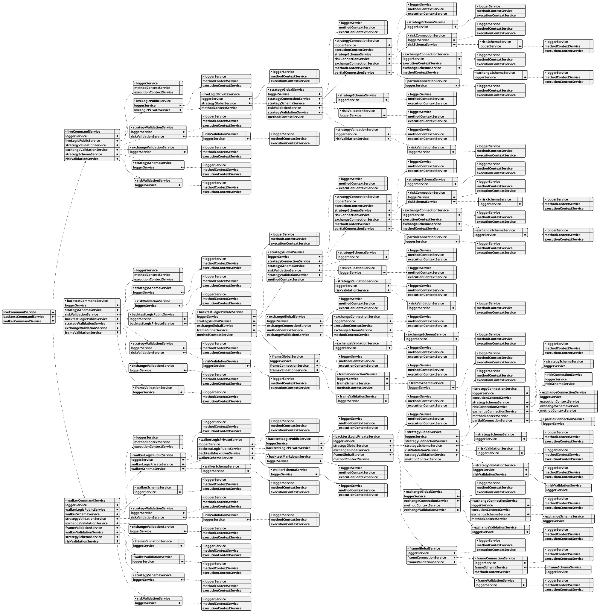

# backtest-kit api reference

**Overview:**

Backtest-kit is a production-ready TypeScript framework for backtesting and live trading strategies with crash-safe state persistence, signal validation, and memory-optimized architecture. The framework follows clean architecture principles with dependency injection, separation of concerns, and type-safe discriminated unions.

**Core Concepts:**

* **Signal Lifecycle:** Type-safe state machine (idle → opened → active → closed) with discriminated unions
* **Execution Modes:** Backtest mode (historical data) and Live mode (real-time with crash recovery)
* **VWAP Pricing:** Volume Weighted Average Price from last 5 1-minute candles for all entry/exit decisions
* **Signal Validation:** Comprehensive validation ensures TP/SL logic, positive prices, and valid timestamps
* **Interval Throttling:** Prevents signal spam with configurable intervals (1m, 3m, 5m, 15m, 30m, 1h)
* **Crash-Safe Persistence:** Atomic file writes with automatic state recovery for live trading
* **Async Generators:** Memory-efficient streaming for backtest and live execution
* **Accurate PNL:** Calculation with fees (0.1%) and slippage (0.1%) for realistic simulations
* **Event System:** Signal emitters for backtest/live/global signals, errors, and completion events
* **Graceful Shutdown:** Live.background() waits for open positions to close before stopping
* **Pluggable Persistence:** Custom adapters for Redis, MongoDB, or any storage backend

**Architecture Layers:**

* **Client Layer:** Pure business logic without DI (ClientStrategy, ClientExchange, ClientFrame) using prototype methods for memory efficiency
* **Service Layer:** DI-based services organized by responsibility:
  * **Schema Services:** Registry pattern for configuration with shallow validation (StrategySchemaService, ExchangeSchemaService, FrameSchemaService)
  * **Validation Services:** Runtime existence validation with memoization (StrategyValidationService, ExchangeValidationService, FrameValidationService)
  * **Connection Services:** Memoized client instance creators (StrategyConnectionService, ExchangeConnectionService, FrameConnectionService)
  * **Global Services:** Context wrappers for public API (StrategyGlobalService, ExchangeGlobalService, FrameGlobalService)
  * **Logic Services:** Async generator orchestration (BacktestLogicPrivateService, LiveLogicPrivateService)
  * **Markdown Services:** Auto-generated reports with tick-based event log (BacktestMarkdownService, LiveMarkdownService)
* **Persistence Layer:** Crash-safe atomic file writes with PersistSignalAdaper, extensible via PersistBase
* **Event Layer:** Subject-based emitters (signalEmitter, errorEmitter, doneEmitter) with queued async processing

**Key Design Patterns:**

* **Discriminated Unions:** Type-safe state machines without optional fields
* **Async Generators:** Stream results without memory accumulation, enable early termination
* **Dependency Injection:** Custom DI container with Symbol-based tokens
* **Memoization:** Client instances cached by schema name using functools-kit
* **Context Propagation:** Nested contexts using di-scoped (ExecutionContext + MethodContext)
* **Registry Pattern:** Schema services use ToolRegistry for configuration management
* **Singleshot Initialization:** One-time operations with cached promise results
* **Persist-and-Restart:** Stateless process design with disk-based state recovery
* **Pluggable Adapters:** PersistBase as base class for custom storage backends
* **Queued Processing:** Sequential event handling with functools-kit queued wrapper

**Data Flow (Backtest):**

1. User calls Backtest.background(symbol, context) or Backtest.run(symbol, context)
2. Validation services check strategyName, exchangeName, frameName existence
3. BacktestLogicPrivateService.run(symbol) creates async generator with yield
4. MethodContextService.runInContext sets strategyName, exchangeName, frameName
5. Loop through timeframes, call StrategyGlobalService.tick()
6. ExecutionContextService.runInContext sets symbol, when, backtest=true
7. ClientStrategy.tick() checks VWAP against TP/SL conditions
8. If opened: fetch candles and call ClientStrategy.backtest(candles)
9. Yield closed result and skip timeframes until closeTimestamp
10. Emit signals via signalEmitter, signalBacktestEmitter
11. On completion emit doneEmitter with { backtest: true, symbol, strategyName, exchangeName }

**Data Flow (Live):**

1. User calls Live.background(symbol, context) or Live.run(symbol, context)
2. Validation services check strategyName, exchangeName existence
3. LiveLogicPrivateService.run(symbol) creates infinite async generator with while(true)
4. MethodContextService.runInContext sets schema names
5. Loop: create when = new Date(), call StrategyGlobalService.tick()
6. ClientStrategy.waitForInit() loads persisted signal state from PersistSignalAdaper
7. ClientStrategy.tick() with interval throttling and validation
8. setPendingSignal() persists state via PersistSignalAdaper.writeSignalData()
9. Yield opened and closed results, sleep(TICK_TTL) between ticks
10. Emit signals via signalEmitter, signalLiveEmitter
11. On stop() call: wait for lastValue?.action === 'closed' before breaking loop (graceful shutdown)
12. On completion emit doneEmitter with { backtest: false, symbol, strategyName, exchangeName }

**Event System:**

* **Signal Events:** listenSignal, listenSignalBacktest, listenSignalLive for tick results (idle/opened/active/closed)
* **Error Events:** listenError for background execution errors (Live.background, Backtest.background)
* **Completion Events:** listenDone, listenDoneOnce for background execution completion with DoneContract
* **Queued Processing:** All listeners use queued wrapper from functools-kit for sequential async execution
* **Filter Predicates:** Once listeners (listenSignalOnce, listenDoneOnce) accept filter function for conditional triggering

**Performance Optimizations:**

* Memoization of client instances by schema name
* Prototype methods (not arrow functions) for memory efficiency
* Fast backtest method skips individual ticks
* Timeframe skipping after signal closes
* VWAP caching per tick/candle
* Async generators stream without array accumulation
* Interval throttling prevents excessive signal generation
* Singleshot initialization runs exactly once per instance
* LiveMarkdownService bounded queue (MAX_EVENTS = 25) prevents memory leaks
* Smart idle event replacement (only replaces if no open/active signals after last idle)

**Use Cases:**

* Algorithmic trading with backtest validation and live deployment
* Strategy research and hypothesis testing on historical data
* Signal generation with ML models or technical indicators
* Portfolio management tracking multiple strategies across symbols
* Educational projects for learning trading system architecture
* Event-driven trading bots with real-time notifications (Telegram, Discord, email)
* Multi-exchange trading with pluggable exchange adapters

**Test Coverage:**

The framework includes comprehensive unit tests using worker-testbed (tape-based testing):

* **exchange.test.mjs:** Tests exchange helper functions (getCandles, getAveragePrice, getDate, getMode, formatPrice, formatQuantity) with mock candle data and VWAP calculations
* **event.test.mjs:** Tests Live.background() execution and event listener system (listenSignalLive, listenSignalLiveOnce, listenDone, listenDoneOnce) for async coordination
* **validation.test.mjs:** Tests signal validation logic (valid long/short positions, invalid TP/SL relationships, negative price detection, timestamp validation) using listenError for error handling
* **pnl.test.mjs:** Tests PNL calculation accuracy with realistic fees (0.1%) and slippage (0.1%) simulation
* **backtest.test.mjs:** Tests Backtest.run() and Backtest.background() with signal lifecycle verification (idle → opened → active → closed), listenDone events, early termination, and all close reasons (take_profit, stop_loss, time_expired)
* **callbacks.test.mjs:** Tests strategy lifecycle callbacks (onOpen, onClose, onTimeframe) with correct parameter passing, backtest flag verification, and signal object integrity
* **report.test.mjs:** Tests markdown report generation (Backtest.getReport, Live.getReport) with statistics validation (win rate, average PNL, total PNL, closed signals count) and table formatting

All tests follow consistent patterns:
* Unique exchange/strategy/frame names per test to prevent cross-contamination
* Mock candle generator (getMockCandles.mjs) with forward timestamp progression
* createAwaiter from functools-kit for async coordination
* Background execution with Backtest.background() and event-driven completion detection

# backtest-kit classes

## Class WorkerValidationService

The WorkerValidationService keeps track of all the worker instances you've registered and makes sure everything is set up correctly when they're used. Think of it as a safety net, confirming that the strategy, exchange, and frame components that a worker needs actually exist and are valid. 

If you try to register a worker with a name that's already in use, you won't be able to—the service ensures uniqueness.

Here's what you can do with it:

*   You register workers by giving it their name and schema.
*   You validate a worker to double-check its dependencies are valid; it only runs the check once for each worker name to avoid unnecessary work.
*   You can request a list of all the registered workers and their schemas.

The service uses other validation services (strategy, exchange, frame) to perform the detailed checks. It also keeps an internal map of all the workers it's managing.

## Class WorkerUtils

WorkerUtils acts as a central point for distributing trading tasks across multiple processes, ensuring efficient execution and resource management. It allows you to run trading strategies on different symbol lists concurrently, effectively sharding your portfolio across several worker processes.

The `run` property is the core method—it kicks off a new worker process to handle a specified symbol list and parameters. It's designed to work seamlessly whether you’re running in a backtesting, paper trading, or live environment, eliminating the need for complex conditional logic in your user code.  The parent process handles initial setup like downloading candle data and forking a child process, while child processes execute the trading logic directly. This process ensures that all symbol lists are processed in order and avoids partial cache scenarios. 

If you need to know which symbols a particular worker process is responsible for, `getWorkerSymbolList` provides that information. And, if you require coordination based on the order of the `Worker.run` calls, `getWorkerIndex` reveals the ordinal of the forked call, useful for staggered start delays or other per-worker adjustments. Note that you won't be able to use `run` if the script is being run from the command line. Finally, the returned function (`dispose`) gives you a way to safely halt running workers or cleanup initialization work.

## Class WorkerSchemaService

The WorkerSchemaService acts as a central place to keep track of the configurations for your trading workers. Think of it as a directory where you store blueprints for how your workers should operate.

It’s designed to quickly check that the basic information for each worker—like its name—is present during setup. 

The service keeps these worker configurations separate, associating them with a specific worker name.

It doesn’t manage the actual symbol lists—those are handled later when the worker is running.

Here's what you can do with it:

*   **Register:** You use this to add a new worker configuration. If you try to register a worker with the same name twice, the existing configuration gets replaced.
*   **Override:**  If you need to make changes to an existing worker configuration, this lets you update only the parts you need to change, and it returns the combined, updated configuration.
*   **Get:**  This method simply retrieves a worker’s configuration based on its name.

## Class WalkerValidationService

The Walker Validation Service helps you keep track of and verify your parameter sweep setups, often called "walkers," which are used to optimize trading strategies. It's like a central organizer for these setups, making sure they're correctly configured before you run any tests.

You can register new walkers using `addWalker`, providing the service with details about the parameters you want to explore. Before running a test, use `validate` to confirm that a walker exists and all the strategies it uses are also set up correctly – this includes validating their risk profiles and actions.  The service remembers its validation results to speed things up.

Finally, `list` allows you to see a complete overview of all the walkers you've registered. 

The service relies on other services like `StrategyValidationService` to handle strategy-specific validations.

## Class WalkerUtils

WalkerUtils provides a handy way to interact with and manage your trading walkers, essentially streamlining the process of running and monitoring them. Think of it as a central hub for controlling your walkers.

It handles a lot of the behind-the-scenes details, like figuring out the walker's name and where it should run, so you don't have to. This is managed as a single, readily accessible tool within your application.

You can easily run a walker to compare different strategies, either to see the results directly or just to trigger actions in the background, like logging or callbacks.

If you need to halt a walker's signal generation – perhaps for testing or debugging – the `stop` function gracefully shuts down the walker, allowing any existing signals to finish.

Beyond running and stopping, you can retrieve data and generate reports summarizing the performance of your strategies, or even save those reports to a file. 

Finally, it allows you to see a list of all your currently running walkers and what their status is.

## Class WalkerSchemaService

The WalkerSchemaService helps you organize and manage different types of trading strategies, or "walkers," by keeping track of their definitions. It uses a special storage system to ensure everything is type-safe and consistent.

You can add new walker definitions using `addWalker` (or `register`), and then easily find them again by their names using `get`.  Before a walker is added, `validateShallow` checks to make sure it has all the necessary parts and they are the correct types.

The `override` function allows you to update existing walker definitions with only the changes you need. The service also has access to logging and execution context information, managed through the `loggerService` property.

## Class WalkerReportService

The WalkerReportService helps you keep track of your trading strategy optimization efforts. It listens for updates from the walker process and carefully records each test's results, including key metrics and statistics.

Think of it as a dedicated record-keeper for your strategy experiments, storing this data in a SQLite database. 

It allows you to monitor your optimization progress, identify your best-performing strategies, and ultimately compare different approaches.

You can easily sign up to receive these updates and, when you're done, unsubscribe to stop the flow of information. The service ensures you don’t accidentally subscribe multiple times, preventing unwanted data overload.

## Class WalkerMarkdownService

The WalkerMarkdownService helps you automatically generate and save detailed reports about your trading strategies as they run. It listens for updates from your trading simulation (the "walker") and keeps track of how each strategy is performing.

Think of it as a reporting engine that organizes all the data into nicely formatted tables. These tables show comparisons between your strategies and make it easier to understand what's working and what isn't.

The service stores this data securely and can automatically save reports as Markdown files in a designated directory. You can easily subscribe to receive these updates as they happen, unsubscribe when you're done, and even clear out old data when needed. It handles creating the necessary folders to store your reports and allows you to specify which data points (like strategy columns or profit/loss details) to include in the reports.

## Class WalkerLogicPublicService

WalkerLogicPublicService helps manage and run your trading strategies, essentially acting as a bridge between different parts of the system. It automatically handles important information like the strategy name, exchange, frame, and walker name, making sure everything is properly connected.

Think of it as a conductor orchestrating a group of musicians (your strategies) – it ensures they all play in sync.

The `run` method is key; it allows you to specify a symbol and context to kick off the backtesting process. This method returns an asynchronous generator, so you can process the results as they become available. It essentially runs all strategies against a given symbol, taking care of the necessary setup.

## Class WalkerLogicPrivateService

The WalkerLogicPrivateService helps manage and compare different trading strategies. 

It works by running each strategy one after another and providing updates on their progress as they finish. 

It keeps track of the best-performing strategy based on a chosen metric, and at the end, it presents a ranked list of all strategies tested.

Think of it as a coordinator that uses another service, the BacktestLogicPublicService, to actually run each individual strategy.

You give it a symbol (like a stock ticker), a list of strategy names to compare, a metric to evaluate performance (like profit or Sharpe ratio), and some context information related to the exchange and data frame being used. 

The service then returns a series of results, one for each strategy that has completed its backtest, allowing you to monitor the process as it unfolds.

## Class WalkerCommandService

WalkerCommandService acts as a central point to interact with the walker functionality within the backtest-kit. Think of it as a convenient middleman, simplifying how different parts of the system access the walker's capabilities.

It bundles together several key services like those dealing with walker logic, schema management, and validation of strategies, exchanges, frames, and the walker itself.  This allows for a streamlined approach to dependency injection and makes it easier to manage how these components work together.

The `validate` function is a vital safety check, ensuring your walker and strategy setup is correct. It performs validation steps to prevent errors, intentionally repeating some checks for extra security.

Finally, the `run` function is where the actual comparison process happens.  You provide a symbol and context (like the walker, exchange, and frame names), and it delivers the results, allowing you to see how the walker performs with those specific configurations.

## Class TimeMetaService

The TimeMetaService helps you keep track of the most recent candle timestamps for your trading strategies. It’s designed to provide this information even when you’re *not* actively running a tick, like when you need to trigger something between trades.

Think of it as a central place to reliably find the current time based on your symbol, strategy, exchange, and timeframe. It remembers these timestamps and updates them after each tick of your strategy.

If you need the timestamp quickly, it can give it to you immediately. If the timestamp hasn’t been set yet, it’ll wait briefly (up to a defined timeout) to get it.

The service is automatically managed; it's cleaned up when a strategy starts to prevent outdated information, and you can also manually clear the stored timestamps if needed – either for specific combinations of symbol and settings or for everything at once. It prioritizes getting the timestamp from the execution context when available, otherwise falling back to its internal store.

## Class SystemUtils

The `SystemUtils` class helps keep your backtesting sessions clean and separate. It prevents one backtest from accidentally messing with the event handling of another.

Essentially, it allows you to "freeze" the current state of how your system responds to events.

The `createSnapshot` function is the key to this. When called, it takes a picture of how all your subjects (event listeners) are currently configured. This "snapshot" allows you to effectively disconnect those listeners temporarily, so you can run a backtest without them influencing the results. You can later restore the snapshot to bring everything back to how it was.

## Class SyncUtils

SyncUtils helps you understand and analyze the lifecycle of your trading signals. It gathers information about signal opening and closing events, letting you track performance and identify patterns.

This class lets you:

*   **Get statistics:** Retrieve aggregated data like the total number of signals opened and closed.
*   **Generate detailed reports:** Create markdown documents that break down each signal's journey, including entry and exit details, profit/loss percentages, and timestamps.
*   **Save reports to files:** Easily export these reports to your disk for later review or sharing.

Behind the scenes, it collects data from sync events and uses a report storage system, keeping track of up to 250 events for each combination of signal and context. The reports include a table summarizing important signal characteristics like symbol, strategy, action, and key price levels. You can also choose to include specific columns in the report. It automatically creates the necessary file directory and names the files to clearly indicate the symbol, strategy, exchange, frame, and whether the backtest or live data is being represented.

## Class SyncReportService

The SyncReportService is designed to keep a record of important signal lifecycle events, specifically when a signal is initiated and when it's closed. It acts like a vigilant observer, listening for these signals and automatically documenting them for later review and auditing.

This service carefully tracks signal openings – think of it as recording the details of when a trading order is placed – and signal closures – noting when a position is exited and why. It then saves this information in a structured format, ready to be analyzed.

To prevent things from getting chaotic with multiple listeners, it makes sure only one subscription is active at a time. You can start and stop this recording process, ensuring you only capture the events you need.

## Class SyncMarkdownService

This service is designed to keep track of signals and generate reports about them. It essentially gathers information about when signals are opened and closed, and organizes it neatly.

You can tell it to start listening for these signal events by subscribing. It’s clever enough to only subscribe once, even if you try multiple times. When you’re done, you can unsubscribe to stop listening and clear out all the collected data.

Each time a signal event happens, the service records it. These events are grouped by symbol, strategy, exchange, and timeframe – so you can easily see how individual components are performing.

You can request summaries of these events – like how many signals were opened or closed – or ask for full reports that are formatted as markdown tables. These reports can also be saved to disk.

Finally, the service allows you to clear out all the recorded data, either for a specific combination of symbol, strategy, exchange, and timeframe, or for everything at once.

## Class SweepValidationService

The SweepValidationService keeps track of all the different trading strategies (sweeps) you've defined and makes sure they're still valid when you use them. It's like a safety check to prevent errors.

When you create a new sweep, you register it with this service. Importantly, it doesn't allow you to register the same sweep name multiple times – it ensures uniqueness.

If you try to run a sweep, this service confirms that the sweep exists and that the exchange it relies on is also correctly set up. This validation happens only once for each sweep name, so it's efficient.

You can also ask the service to provide a list of all the sweeps it is tracking, which can be useful for overview and debugging. 

Essentially, it's here to ensure the integrity and reliability of your sweeps.

## Class SweepUtils

SweepUtils allows you to test many trading ideas simultaneously, evaluating them all with a single pass of market data. It's like running a large experiment to see which strategies perform best, profiling each idea and then ranking them based on metrics like Sharpe ratio, Sortino ratio, profit, and recovery.

It lets you adjust various parameters – like stop-loss percentages, trailing stops, and hold times – to see how they affect the results. These parameters control how trades are entered and exited, and each one impacts the overall performance. Importantly, every author's trading idea is given a chance to trigger an entry; there’s no system for blocking ideas based on prior performance.

The system assesses each author's ideas based on whether they make a profit before hitting a stop-loss, providing detailed performance reports. These reports track things like the number of ideas, hits, and hit rates for each rule. The order of these reports can be customized for presentation purposes.

The `run` function is the key – it's how you kick off the entire sweep process, feeding it a symbol, a name for the sweep, and a list of trading ideas. The system cleans up the input by ignoring ideas from different symbols or those deemed duplicates. The sweep evaluates each trading idea against a predefined schema, merging your custom settings with the engine's defaults. It then generates a final report containing all the results, ranking winners, and detailed author performance data. Ultimately, the results of a sweep are a starting point, and a real engine backtest is the definitive way to validate the findings.

## Class SweepSchemaService

The SweepSchemaService acts like a central record keeper for your sweep configurations. It holds and manages definitions for different sweep types, ensuring they're set up correctly before they're used.

Think of it as a library where you store and organize your sweep blueprints.

When you define a new sweep, this service verifies the basic structure of that definition to make sure it's complete.  The main components – like the axes and callbacks – are validated by the systems that actually use those sweeps.

You can register new sweep definitions, effectively adding them to the library.  If a definition already exists, registering again simply updates it. You can also make small changes to an existing sweep definition, merging your updates with the original. Finally, you can retrieve a specific sweep definition using its name.

## Class SweepGlobalService

SweepGlobalService is the main entry point for working with sweep functionalities. Think of it as the gatekeeper – it makes sure everything is set up correctly before letting the sweep proceed. It checks that the sweep exists and that it's compatible with the exchange being used.

It then hands off the work to other services that manage the details of the sweep and keep things efficient.

The `run` method is the core action you'll use. It takes a symbol, sweep name, and a list of ideas as input and orchestrates the entire simulation process, which involves filtering, evaluating, and ranking those ideas based on the sweep’s configuration.

## Class SweepCoreService

The SweepCoreService acts as the central engine for running sweep simulations. It ensures that the simulation setup is valid, checking that the necessary resources and dependencies exist before proceeding.

Essentially, it's the go-between for initial requests and the actual execution of the sweep process, managing the connection to the underlying client sweep data.

The core functionality lies in the `run` method. This method takes a description of the sweep (symbol, name, and ideas) and orchestrates a series of validation and evaluation steps. This includes confirming the sweep profile, filtering ideas, evaluating strategies on a grid, and finally, ranking the results to produce the simulation outcome. It handles the entire flow from start to finish.

The service relies on other services like `SweepConnectionService` to manage data connections and `SweepValidationService` to perform initial checks. It also utilizes a `loggerService` for tracking and debugging purposes.

## Class SweepConnectionService

The SweepConnectionService manages how your trading strategies (called "sweeps") connect and execute. It's responsible for setting up and reusing sweep clients efficiently.

Essentially, when you need to run a sweep, it finds the appropriate configuration, creates a specialized client for that sweep, and remembers it so you don’t have to recreate it every time. 

If the sweep’s configuration is missing some default settings, it will fill in those gaps automatically.

The `run` method is your primary way to kick off a complete sweep execution – it handles the entire process, from idea generation to ranking.

You can clear the stored sweep clients if you need to force a refresh of the sweep configurations, which is useful if those configurations have been updated.

## Class StrategyValidationService

The StrategyValidationService helps you keep track of your trading strategies and make sure they're set up correctly. It's like a central hub for managing your strategy configurations. 

You can register new strategies using `addStrategy()`, which tells the service about each strategy's details. 

Before using a strategy, the service can `validate` it – it checks to ensure the strategy exists, and if you've defined risk profiles and actions for it, it verifies those too.

The `list()` function lets you see a complete list of all the strategies you've registered. To make things faster, the service remembers validation results, so it doesn't have to repeat checks unnecessarily. 

The service relies on other services like `loggerService`, `riskValidationService`, and `actionValidationService` for logging, risk profile validation, and action validation respectively.

## Class StrategyUtils

The StrategyUtils class provides a way to access and understand reports generated by your trading strategies. Think of it as a central hub for gathering key statistics and creating easy-to-read summaries of how your strategies are performing.

It collects information about events like order cancellations, profit taking, and stop-loss adjustments for each strategy and symbol you're trading.

You can use it to get detailed statistical data about strategy actions, creating reports that show exactly what happened, including the price, order details, and timing of events.  This information is presented in a nicely formatted markdown table, including a summary of the number of each type of event.

Finally, this class lets you save those reports directly to a file on your computer, making it simple to review your trading history and identify areas for improvement. The files are named clearly to identify the symbol, strategy, and exchange they represent.

## Class StrategySchemaService

This service acts as a central place to store and manage the blueprints for your trading strategies. It uses a special system to keep track of these blueprints in a safe and organized way, ensuring consistency.

You can add new strategy blueprints using the `addStrategy` method, and easily retrieve them later by their name using the `get` method. 

Before a strategy blueprint is officially stored, it goes through a quick check with `validateShallow` to make sure it has all the necessary parts and in the right format.

If you need to update an existing strategy blueprint, the `override` method allows you to make changes while keeping the original structure intact. 

The service also has a few internal components, including a logger, which helps in troubleshooting and understanding how the system is working.

## Class StrategyReportService

This service is designed to keep a detailed record of what your trading strategies are doing by saving each action as a separate JSON file. Think of it as an audit trail for your strategy’s decisions.

To start logging, you need to "subscribe" to the service. Once subscribed, the service automatically writes events like canceling scheduled orders, closing positions, taking partial profits or losses, adjusting stop-loss orders, and more.

Unlike other reporting services that hold everything in memory, this one writes each event to disk immediately, making it great for keeping a permanent record of your strategy's actions.

When you're done logging, you "unsubscribe" to stop the process. This service uses a special system to make sure only one subscription exists at a time, so you don’t have to worry about accidental duplicates.

Here's a quick rundown of the different event types it can log:

*   **cancelScheduled:** Records when a scheduled order is cancelled.
*   **closePending:** Records when a pending order is closed.
*   **partialProfit:** Records when a portion of a position is closed for profit.
*   **partialLoss:** Records when a portion of a position is closed at a loss.
*   **trailingStop:** Records adjustments to trailing stop-loss orders.
*   **trailingTake:** Records adjustments to trailing take-profit orders.
*   **breakeven:** Records when the stop-loss is moved to the entry price.
*   **activateScheduled:** Records when a scheduled signal is activated early.
*   **averageBuy:** Records new entries in an averaging strategy (like DCA).

## Class StrategyMarkdownService

This service helps track and report on your trading strategy's actions during backtesting or live trading. Instead of writing each event directly to a file, it temporarily holds them in memory, which is much faster, and then allows you to generate a complete report later.

Think of it as a temporary notebook for your strategy's activity.

You can use it to record various events like canceling scheduled orders, closing pending orders, taking partial profits or losses, adjusting trailing stops and take profits, and setting breakeven prices.

It lets you collect data efficiently and then create nicely formatted markdown reports containing statistics and a detailed event history. These reports can then be saved to disk with automatically generated filenames that include a timestamp.

To start using it, you need to "subscribe" to event collection. Then, when events occur within your strategy, the service automatically records them. When you’re ready, you can retrieve the collected data, generate a report, save it to a file, or clear the collected data. Finally, when you're finished, you should "unsubscribe" to stop the data collection and free up memory.

There's also a mechanism to clear the data selectively for specific strategies or clear everything. This is useful for managing memory usage and ensuring you're only storing the data you need.

The service uses a clever caching system to keep track of data efficiently for each symbol and strategy combination, creating and re-using storage containers as needed.

## Class StrategyCoreService

The `StrategyCoreService` acts as a central hub for strategy operations within the backtest-kit framework, managing a lot of the behind-the-scenes work. It's essentially a wrapper that provides a consistent way to interact with strategy logic while also handling the details of how the strategy interacts with other parts of the system.

It includes services for validation, signal retrieval, and calculations related to position status (like profit, cost basis, and partial closures). These calculations properly consider things like DCA entries.

Key functions provide access to information about a pending or scheduled signal. You can get the active signal, retrieve details like total percentage held, cost basis, entry prices, partial closures, and profitability metrics. There are also functions for managing the strategy's state, such as pausing/resuming it, canceling signals, and triggering partial profit or loss executions.

There’s also logic to manage backtesting and scheduled tasks and to ensure proper context and validation is applied. The service also handles actions like creating signals, stop losses, and trailing adjustments, delegating specific tasks to related services. Finally, the framework helps in disposing of strategy instances for cleanup and to ensure proper caching.

## Class StrategyConnectionService

This service acts as a central routing point for strategy operations within the backtest-kit framework. It ensures the correct strategy implementation is used based on the symbol and strategy name. To improve performance, it caches strategy instances, meaning it creates them only once and reuses them afterward.

It handles various strategy functions, including retrieving pending signals, calculating position metrics (like percentage held or cost basis), and executing actions such as partial profits or stop losses. The service also provides methods for pausing, stopping, and canceling signals, along with validation checks before executing actions. 

Essentially, this service simplifies how you interact with and manage strategies during backtesting or live trading, handling the complexities of routing and caching behind the scenes. It offers methods for accessing a wide range of position-related data and allows for actions like partial closes and average buy orders.

## Class StorageLiveAdapter

The `StorageLiveAdapter` acts as a flexible middleman for managing how your trading signals are stored. It allows you to easily switch between different storage methods – like keeping data on disk, using memory only, or using a dummy adapter for testing – without changing your core trading logic.

Think of it as a system that lets you plug in different storage methods without affecting the rest of your code. It defaults to using persistent storage, which saves your signals to disk.

The `getInstance` property is a shortcut that builds and remembers the storage tools you're using, so you don't have to recreate them every time. If the underlying storage tools change, you can clear this cached instance using the `clear()` method, making sure your signals are using the latest settings.

The adapter also handles specific events like when a signal is opened, closed, scheduled, or cancelled, forwarding these actions to the storage system you’re using.

If you want to test things out without writing to storage, the `useDummy()` method lets you do that – your signals will be “written” but effectively ignored. Similarly, you can use `useMemory()` for temporary in-memory storage or `usePersist()` to revert to the default persistent storage. Finally, `useStorageAdapter` lets you register custom storage implementations.

## Class StorageBacktestAdapter

This component provides a flexible way to manage how backtest data is stored. It acts as a bridge between the backtest framework and different storage solutions, allowing you to easily switch between in-memory, persistent, or even dummy storage. By default, it uses an in-memory storage, but you can readily change it to persist data to disk or disable storage entirely for testing purposes.

The system keeps track of which storage method is active and provides shortcuts to switch between them quickly.  It has a caching mechanism for the storage adapter, ensuring that it’s only created once, but can be reset when needed, for example when the working directory changes. Events like signal openings, closings, and scheduling are all routed through this adapter to handle the storage operations.

Methods like `findById` and `list` allow you to retrieve signal data, and specialized handlers process ping events to keep timestamps updated. You can easily swap out the storage backend by specifying a different storage adapter constructor.  The `clear` method is crucial to call when changing the base working directory to ensure you're using a fresh storage instance.

## Class StorageAdapter

The StorageAdapter is like the central hub for keeping track of all your trading signals, whether they're from past tests or live trading. It automatically updates itself when new signals come in. 

It’s designed to work consistently, giving you easy access to both backtest and live signals in one place. 

To make sure things are efficient, it only subscribes to the signal sources once, preventing unnecessary updates. 

You can turn the storage on and off, and you can safely disable it as many times as needed. It also allows you to look up specific signals by their ID or view lists of backtest or live signals.

## Class StateLiveAdapter

The `StateLiveAdapter` provides a way to manage and store trading state information, allowing you to easily swap out different storage methods. Think of it as a flexible system for keeping track of things like peak performance and how long a trade has been open.

It primarily uses file-system storage by default, so your data survives if the program restarts. However, you can also switch to in-memory storage for quicker testing or a dummy storage for debugging.

The adapter’s main purpose is to support sophisticated trading rules, such as those driven by LLMs, that require monitoring trade performance over time. This lets the system automatically close trades that aren't behaving as expected.

To keep things clean, the `disposeSignal` method is used to clear out old data when a trading signal is finished.

Here’s a quick rundown of the available functions:

*   `useLocal()`: Uses in-memory storage, data is lost on restart.
*   `usePersist()`: Uses file storage, data is saved on disk.
*   `useDummy()`: Ignores all data changes, good for testing.
*   `useStateAdapter()`: Lets you provide your own custom storage solution.
*   `clear()`: Empties the cached data, useful when working directories change.

## Class StateBacktestAdapter

The `StateBacktestAdapter` is a flexible tool for managing the state of your trading backtests. It allows you to easily switch between different storage methods – like keeping everything in memory, saving data to files, or using a dummy adapter that simply throws everything away.

This adapter is designed to track important information about your trades, such as the highest peak percentage gain and how long a position has been open. This is particularly useful for strategies that rely on machine learning to make decisions, where you want to make sure the market actually confirms your thesis.

You can choose which storage method you want to use with convenience functions like `useLocal`, `usePersist`, and `useDummy`.  If you need something even more customized, `useStateAdapter` lets you plug in your own state adapter implementation. The `disposeSignal` function helps clean up old state data when signals are closed.  Finally, `clear` allows you to reset the stored data when necessary, like when the working directory of your process changes.

## Class State

The `State` class helps manage data associated with individual signals during a backtest or live trading session. Think of it as a container for signal-specific information that can be updated as the trading strategy runs.

Each `State` instance is tied to a specific signal and has a name, and a default value (defined in `initialData`) that’s used when the state is first created. This default value can be a simple object or a function that creates an object – this function can use information about the signal itself, like its price and time, to initialize the state.

Accessing or modifying the state’s value always happens within a strategy’s lifecycle callback, and the class handles getting the necessary signal and timing information automatically. The state’s data is never shared between different `State` instances, ensuring each one is unique.

To prevent errors and ensure data accuracy, accessing state information before its intended time will return the initial default value. Similarly, attempting to update the state with an earlier time might overwrite existing data. 

Before using a `State` object, you must call `enable()` to subscribe to signal lifecycle events. This ensures that the state is properly cleaned up when the signal is no longer active, preventing memory leaks and stale data. Conversely, `disable()` removes this subscription when the state is no longer needed.

The `_getState` and `_setState` methods provide a way to read and update the state value without needing to manually provide context information. For simpler use, `getState` and `setState` provide a more convenient interface to read and update state, automatically resolving signal and timestamp details from the execution context.

## Class SizingValidationService

This service helps you keep track of and double-check your position sizing strategies. Think of it as a central place to register your sizing methods and make sure they're available when you need them. It’s designed to be efficient, remembering the results of previous checks so things run smoothly.

You can easily add new sizing strategies using `addSizing`.

Before you use a sizing strategy, `validate` helps ensure it's properly registered, preventing errors.

Need to see what sizing strategies you've got registered?  `list` gives you a quick overview. 

The service also uses a logger to help with troubleshooting and a cache to improve performance.

## Class SizingSchemaService

The SizingSchemaService helps you organize and manage different sizing strategies for your trading. It uses a special registry to keep track of these strategies in a safe and predictable way. You add new sizing strategies using `addSizing()`, and you can easily find them later by their names.

Think of it like a library of sizing rules – this service helps you create, update, and retrieve those rules when needed.

It makes sure your sizing strategies are set up correctly by checking their basic structure before adding them.

Here's a quick rundown of what you can do:

*   **`register(key, value)`**: Adds a new sizing strategy to the registry.
*   **`override(key, value)`**: Updates an existing sizing strategy; you don't need to provide the entire strategy, just the parts you want to change.
*   **`get(key)`**: Retrieves a specific sizing strategy by its name.

## Class SizingGlobalService

The SizingGlobalService helps determine how much of an asset to trade, acting as a central hub for size calculations. It relies on other services to perform the actual calculations and validations. 

Think of it as the go-to place for figuring out your trade size, whether it's for a strategy you're building or a tool you're using.

Here's a breakdown of what it manages:

*   It uses a `loggerService` to track what's happening.
*   It works with `sizingConnectionService` to get the size information and `sizingValidationService` to ensure the size is valid.
*   The `calculate` method is its core function, taking in parameters like risk tolerance and market conditions to determine the appropriate position size. This method returns a promise resolving to the calculated size.

## Class SizingConnectionService

The SizingConnectionService acts as a central hub for managing how position sizes are calculated within your trading strategies. It intelligently directs sizing requests to the correct sizing implementation, ensuring the right method is used for the job.

To optimize performance, it keeps a record of previously used sizing implementations, avoiding unnecessary re-creation. 

Think of it like this: you specify a sizing "name" and it automatically handles finding the right tool to do the sizing calculation, whether you're using a fixed percentage, Kelly Criterion, or another method. When no sizing configuration is present, you can use an empty string as the sizing name.

It relies on two other services: a logger for tracking events, and a sizing schema service for understanding the sizing configurations. 

The `getSizing` property is how it retrieves the appropriate sizing implementation, using a cached record to speed things up. 

Finally, the `calculate` method is where the actual position size is determined, taking into account the sizing method, risk parameters, and a provided sizing name for routing.

## Class SessionLiveAdapter

The SessionLiveAdapter provides a flexible way to manage and store data during live trading sessions. It acts as a central point, allowing you to easily swap out different storage methods without altering the core trading logic.

By default, it saves data to a file on your computer, ensuring your progress isn't lost if the program restarts. However, you can also switch to an in-memory adapter for faster performance, or a dummy adapter for testing purposes where data persistence isn't needed.

It intelligently caches session data based on the symbol, strategy, exchange, and frame, minimizing unnecessary operations. 

You can change how the adapter stores session data using methods like `useLocal`, `usePersist`, `useDummy`, and `useSessionAdapter`, offering great control over your trading environment.  There's also a `clear` function to refresh the cached instances when the working directory changes.

## Class SessionBacktestAdapter

The SessionBacktestAdapter provides a flexible way to manage session data during backtesting. It acts as a bridge, allowing you to easily swap out different ways of storing and retrieving session information. By default, it uses an in-memory storage, which means data disappears when the process ends.

You have options to change the storage method – you can switch to a persistent storage that saves data to disk, or use a dummy adapter that simply ignores any data updates. This lets you tailor the adapter to your specific testing needs.

The adapter keeps track of frequently used data instances to improve performance, but it has a way to clear this cache.  It's particularly useful to clear the cache when the working directory changes during backtesting to ensure fresh session instances are created. It provides convenient functions for quickly switching between these storage options: local (in-memory), persistent (disk-based), dummy (ignores data), and custom session adapters. You can also access and modify session data using the `getData` and `setData` methods.

## Class SessionAdapter

The SessionAdapter acts as a central point for handling data storage during both backtesting and live trading. It intelligently directs data operations to either the backtest or live session storage based on whether you're running a simulation or a real trade. 

You can use `getData` to retrieve a specific data point—like a signal—for a given symbol, strategy, exchange, frame, and timestamp.  This method figures out whether to fetch the data from your backtest records or your live trading data.

Similarly, `setData` allows you to update those data points. It makes sure the update goes to the correct location depending on if you're backtesting or trading live. 

## Class ScheduleUtils

This class is designed to help you understand how your scheduled trading signals are performing. Think of it as a helper for keeping track of signals waiting to be executed and how cancellations are affecting your strategy.

It provides a simple way to gather statistics, like cancellation rates and wait times, and generate easy-to-read reports.

You can use it to get data related to specific trading symbols and strategies, and it offers options to create reports in a user-friendly markdown format or save those reports directly to a file. This utility is always available, acting as a single, easily accessible resource for monitoring your schedule operations.

## Class ScheduleReportService

This service helps you keep track of scheduled trading signals and their lifecycle. It monitors signals to record key events like when a signal is scheduled, when it starts, and when it's cancelled.

The service carefully calculates how long a signal takes from scheduling to either being executed or cancelled, giving you valuable insights into delays. It stores this data, along with the event details, so you can analyze what's happening with your scheduled orders. 

To use it, you’ll subscribe to the signal events. This ensures you only receive events once and can easily stop listening when you no longer need to monitor. The unsubscribe function gracefully stops the service from processing further signal events.

## Class ScheduleMarkdownService

The ScheduleMarkdownService helps you track and understand your trading signals by creating detailed reports. It watches for signals being scheduled and cancelled, organizes them by strategy, and then generates easy-to-read markdown tables summarizing what happened.

You can view overall statistics like cancellation rates and average wait times, which can give you insights into your strategy's performance. These reports are automatically saved as markdown files, making it simple to review and analyze your trading activity.

The service uses a smart storage system, ensuring each strategy and timeframe has its own dedicated data set. You have options to clear out this data entirely or just for a specific strategy and timeframe. You can also request the raw data or a full report for a particular trading strategy. The service handles the process of saving reports to your disk and creates necessary folders.

## Class RiskValidationService

This service helps you keep track of your risk management settings and makes sure they're all in order before you use them. Think of it as a central place to register and verify your risk profiles. It remembers its checks to work faster, avoiding repeated validations. 

You can add new risk profiles using `addRisk()`, check if a profile exists with `validate()`, and see a full list of registered profiles using `list()`. The service also uses a logger to help you keep track of what's happening.

## Class RiskUtils

This class helps you analyze and report on risk rejections within your trading system. It acts as a central place to gather and present data related to when your system flagged potential issues.

Think of it as a tool for understanding why your strategies might be failing or behaving unexpectedly.

You can use it to pull together statistics on total rejections, broken down by symbol and strategy.  It also has the ability to create easy-to-read markdown reports that detail each rejection event, including things like the symbol, strategy, position, price, and the reason for the rejection. 

Finally, you can use this class to save those reports directly to files for later review or sharing, making it simple to document your risk management process. The reports include a summary of key metrics at the bottom.

## Class RiskSchemaService

The RiskSchemaService helps you keep track of your risk schemas in a safe and organized way. It uses a special system to ensure that your schemas are always structured correctly, preventing potential errors. 

You can add new risk schemas using `addRisk()`, and you can easily find them again by their names using the `get()` method.

If you need to update an existing schema, the `override()` method lets you make changes while keeping the rest of the schema intact.

Before adding a new schema, `validateShallow()` quickly checks that it has all the necessary parts and that they are the right types. 

The service relies on a logger to record events and assist with debugging.

## Class RiskReportService

The RiskReportService is designed to keep a record of situations where risk management rejects trading signals. 

It acts like an observer, listening for these rejections and carefully logging them in a database. This detailed record allows for later analysis of risk events and helps with auditing.

The service uses a throttling mechanism to prevent flooding the database with repeated rejection events – it only logs the initial rejection for a given situation (symbol, strategy, exchange, frame) within a specific time interval.

You subscribe the service to receive risk rejection events, and it’s designed to prevent accidental multiple subscriptions.  Remember to unsubscribe when you no longer need it to stop receiving these notifications.

## Class RiskMarkdownService

The RiskMarkdownService helps you automatically generate reports detailing risk rejections in your trading system. It works by listening for risk rejection events and carefully organizing them based on the symbol and strategy being used.

It then builds markdown tables filled with specific details about each rejection, along with overall statistics like the total number of rejections, broken down by symbol and strategy.

These reports are saved as files, typically in a `dump/risk/` directory, using a clear naming convention (e.g., `symbol_strategyName.md`).

You can subscribe to receive these events, and the service handles ensuring you don't subscribe multiple times.  You can also retrieve statistics or the full report for a particular symbol and strategy, or clear out all accumulated data when needed. It uses a special storage system to keep data separate for each unique combination of symbol, strategy, exchange, frame and backtest.

## Class RiskGlobalService

RiskGlobalService acts as a central hub for managing risk during trading. It's responsible for ensuring that trades comply with pre-defined risk limits, working closely with other services like RiskConnectionService for verification.

It keeps track of risk validations to avoid repetitive checks and provides logging for these activities.

The service provides several key functions:

*   `checkSignal` verifies if a trade signal should be executed based on risk rules.
*   `checkSignalAndReserve` does the same as `checkSignal` but also atomically reserves resources to prevent conflicts in concurrent trading scenarios.
*   `addSignal` registers newly initiated trades, and `removeSignal` cleans up when trades are closed.
*   `clear` allows for resetting the risk data, either for all risk instances or a specific one.

## Class RiskConnectionService

This service acts as a central hub for managing risk checks within your trading system. It intelligently directs risk-related operations to the correct specialized risk handler.

Think of it as a router: when your code needs to check if a trade is allowed based on risk rules, this service figures out *which* set of rules to apply. It remembers previously used risk handlers to speed things up.

Here's a breakdown of what it offers:

*   **Risk Routing:** It uses a `riskName` to determine which specific risk rules to use for a particular situation.
*   **Performance:** It avoids repeatedly creating the same risk handlers by storing them (memoization).
*   **Signal Validation:** The `checkSignal` method is your go-to for making sure a trade is safe based on things like portfolio size and position limits. It will notify you if a trade is blocked.
*   **Concurrency Protection:**  `checkSignalAndReserve` handles trade approvals safely, even with multiple simultaneous requests.
*   **Signal Management:** It also handles registering and removing signals (trades) from the risk management system.
*   **Clearing Cache:** You can clear out cached risk information if needed, particularly when switching environments or testing scenarios.

Essentially, this service simplifies and streamlines how risk is handled in your backtesting framework, making it more efficient and reliable.

## Class ReportWriterAdapter

This framework component helps you reliably store and analyze data generated during backtesting or live trading. It uses a flexible design that allows you to easily switch between different storage methods, like JSONL files or potentially other databases in the future.

The system remembers which storage instances are already in use to avoid creating unnecessary duplicates, making it efficient for long-running applications.

You can customize how data is stored by providing your own storage adapter, or use the built-in JSONL adapter for simple file-based logging.

The `writeData` function handles the actual writing of data, creating the necessary storage if it doesn't already exist.

If you need to switch storage methods or want to temporarily disable logging, functions like `useReportAdapter`, `useDummy`, and `useJsonl` provide convenient ways to do so.  Clearing the cache with `clear()` is useful when your working directory changes and storage paths need to be refreshed.

## Class ReportUtils

ReportUtils helps you control what kind of data gets logged during your trading activities. It lets you turn on or off logging for specific services like backtests, live trading, or performance analysis.

You can use the `enable` method to start logging for certain services, and it's really important to remember the cleanup function it returns – you need to call that function later to stop the logging properly.

The `disable` method lets you stop logging for specific services without affecting others, and it doesn't require a separate cleanup step as it stops logging immediately. 

This utility class is designed to be used and expanded upon by ReportAdapter for more complex reporting needs.

## Class ReportBase

The `ReportBase` class helps you log trading events in a structured way for later analysis. It creates a single JSONL file for each type of report, ensuring that new data is always appended. 

It handles writing data efficiently using a stream-based approach and incorporates safeguards to prevent write operations from taking too long.  You can filter the logged data later using search metadata like the trading symbol, strategy, exchange, timeframe, signal ID, or walker name.

The class manages the creation of the directory where these files are stored and provides a way to handle errors during the writing process. You can initialize the file and stream safely, even if you call initialization multiple times.  The `write` method adds each event to the file with essential details and timestamps for easy tracking.

## Class ReportAdapter

This component provides a flexible way to manage where your backtest data is stored, allowing you to easily change the storage method without altering the core testing logic. It's built around the adapter pattern, meaning you can swap in different storage solutions like JSONL files or other custom implementations.

The system intelligently caches these storage instances, ensuring you only have one instance per report type, which helps with performance. The default storage method is JSONL, which writes data to appendable files.

If your working directory changes during a backtest (which can happen when running multiple iterations), you should clear the cache to ensure fresh storage instances are used.  There’s also a “dummy” adapter option that's useful for temporarily disabling reporting altogether. 

## Class ReflectUtils

This class provides a central place to access key performance metrics for your trading positions, like unrealized profit/loss, peak profit, and drawdown. Think of it as a reporting tool for your strategies, whether you're live trading or backtesting. It handles the complexities of calculating these values, considering factors like partial closes and fees, and it ensures that the data is valid.

You can use it to get:

*   **Real-time PnL:** Both percentage and dollar amounts for your active positions.
*   **Performance Peaks:** The highest profit price, timestamp, and percentage achieved.
*   **Drawdown Metrics:** How long a position has been in drawdown, how far it's fallen from its peak, and the worst price and timestamp of the drawdown.
*   **Time-Based Metrics:** How long a position has been active or waiting.
*   **Distance from Peaks/Troughs:** How far the current price is from the highest profit and deepest drawdown points, expressed as percentages or dollar amounts.

It’s designed to be simple to use as a single instance; you don't need to create multiple objects. This class is a valuable tool for monitoring and analyzing the behavior of your trading strategies.

## Class RecentLiveAdapter

The RecentLiveAdapter helps you manage and access recent trading signals, providing a flexible way to store this data. It's designed to work with different storage methods, allowing you to choose between persistent storage (saving signals to disk) or in-memory storage (keeping them only in the current session).

You can easily switch between these storage options using `usePersist` for disk-based storage and `useMemory` for in-memory storage. The adapter automatically handles fetching the latest signals and calculating how long ago they were created.

It’s adaptable; you can even use a custom storage solution by setting a new adapter class with `useRecentAdapter`.  The `clear` method ensures that the adapter re-initializes when the working directory changes, preventing unexpected behavior during strategy iterations. The underlying storage adapter is controlled by `_recentLiveFactory` and retrieved by `getInstance`.

## Class RecentBacktestAdapter

This component helps you manage and retrieve recent trading signals, offering flexibility in how those signals are stored. It acts as a bridge between your backtesting code and different storage solutions, like in-memory storage or persistent storage on disk.

You can easily switch between these storage options – using memory for quick tests or persisting data for later analysis. The system intelligently caches the storage utilities to avoid unnecessary overhead, but provides a way to refresh that cache if your environment changes.

The `handleActivePing`, `getLatestSignal`, and `getMinutesSinceLatestSignalCreated` functions are all passed through to the currently selected storage adapter, making your core logic cleaner. You can change the active storage adapter using `useRecentAdapter`, `usePersist`, or `useMemory`, and `clear` ensures a fresh start when needed.

## Class RecentAdapter

The RecentAdapter is responsible for managing and providing access to the most recent trading signals, both from historical backtests and from live trading. It automatically updates its storage when new data arrives, ensuring you always have the latest information.

You can easily enable or disable this storage – enabling subscribes to data updates, while disabling cleans up any ongoing subscriptions.

Retrieving the most recent signal is simple: the `getLatestSignal` method searches both backtest and live data to find the signal most applicable to a specific symbol, trading strategy, and time frame, while also preventing look-ahead bias.

Need to know how long ago the last signal was generated? The `getMinutesSinceLatestSignalCreated` method calculates this, also respecting the look-ahead protection.

Finally, `hasNoLatestSignal` quickly determines if any signals exist for a given context, a helpful check before attempting to retrieve more detailed information.

## Class PriceMetaService

PriceMetaService helps your strategies access the most recent market prices for specific instruments and timeframes. It acts like a central memory for prices, storing them for each symbol, strategy, exchange, and frame combination.

Think of it as a way to get the current price *outside* of the usual trading cycle. Sometimes you need a price to make a decision between ticks, and this service provides that.

It automatically updates the prices as your strategies run, keeping track of the latest information. If a price isn't immediately available, it will wait briefly – up to a set time – before letting you know. 

You can clear the stored prices, either for a single price combination or for everything, which is useful at the beginning and end of a backtest to ensure you're working with fresh data. It’s managed automatically by the system and doesn't require direct price feeds.

## Class PositionSizeUtils

This class provides helpful tools for determining how much of an asset to trade in each instance. It's designed to simplify position sizing calculations, a crucial part of any trading strategy.

You'll find several pre-built methods to choose from, like fixed percentage, Kelly Criterion, and ATR-based sizing. Each method includes built-in checks to ensure the provided parameters are compatible with the calculation being performed.

The `fixedPercentage` method calculates size based on a fixed percentage of your account balance. The `kellyCriterion` method uses win rates and win/loss ratios to determine an optimal position size, while `atrBased` relies on Average True Range (ATR) data to factor in volatility.

Essentially, this utility class allows you to automate and validate your position sizing process, reducing errors and improving consistency in your trades.

## Class Position

The `Position` utility helps you figure out where to place your take profit and stop loss orders when trading. It simplifies things by automatically adjusting the direction (whether you're buying or selling) based on your position.

The `moonbag` property calculates target prices with a fixed take profit set at 50% of the current price – it’s like aiming for the moon!

The `bracket` property lets you define your own custom take profit and stop loss percentages, providing more precise control over your risk and reward. You tell it your position, the current price, and your desired percentages, and it computes the actual price levels for both your stop loss and take profit.

## Class PersistStrategyUtils

This class helps keep track of your trading strategy's data, ensuring it’s saved reliably even if things go wrong. It's designed to work specifically with the `ClientStrategy`, and manages things like pending orders or actions that need to be executed. 

Think of it as a safe place to store your strategy's temporary data.

You can customize how this data is stored by providing your own way to create instances, which lets you use different storage methods like files or a database.  The class intelligently caches these storage instances based on the symbol, strategy name, and exchange, so it doesn't have to recreate them every time.

If you change where your strategy data is saved, you can clear the cache to force it to use the new location. It also provides shortcuts to switch between default storage methods (like using a JSON file) or to use a dummy instance which doesn't actually save any data.

## Class PersistStrategyInstance

This class helps you save and load the state of your trading strategy to a file. It's designed to be reliable, even if your program crashes unexpectedly.

It essentially acts as a keeper for your strategy’s data, using a specific file and a predefined name ("strategy") to store everything. Think of it as a checkpoint system for your strategy.

You tell it which trading symbol, strategy name, and exchange it’s managing during setup.

It offers a way to initially set up its storage and a way to read or write the strategy's data snapshot. Clearing the data is also possible by sending a null value. 

## Class PersistStorageUtils

This class provides tools to reliably save and load signal data, ensuring your backtesting and live trading operations have a safe place to store information. It intelligently manages storage instances, creating a dedicated one for each mode, like backtesting or live trading.

You can customize how the data is stored by providing your own storage adapter, or use the built-in options like a standard file-based storage or a dummy adapter for testing. It handles writing and reading all your signals, keeping each one organized as a separate file identified by its unique ID.

The framework is designed to be robust even in unexpected situations, managing signal state safely and preventing data loss if something goes wrong. It also has a handy 'clear' function to refresh the storage when needed, which can be useful when the working directory changes.

It offers methods to switch between different storage strategies, such as:

*   Using a custom adapter you define.
*   Switching to the default file-based storage.
*   Switching to a dummy adapter that does nothing, helpful for testing and development.

## Class PersistStorageInstance

This component handles persistent storage for your trading signals, primarily using files on your computer. It's designed to keep your data safe even if unexpected things happen.

Each signal you’re working with gets saved as its own JSON file, identified by a unique ID.  When you need to retrieve data, it scans through all these files.

The `backtest` property lets you specify if the storage is being used for backtesting purposes. 

You can use `waitForInit` to make sure the storage is properly prepared before you start using it.  `readStorageData` pulls all the stored signals together. Finally, `writeStorageData` is responsible for saving each signal's details into its own file.

## Class PersistStateUtils

This class helps manage how your trading strategy’s state is saved and loaded, especially after unexpected interruptions. It keeps track of where each piece of state data is stored, making sure it's consistently accessible. 

Think of it as a smart helper that creates and manages the specific storage containers for your strategy’s data. It uses a default way to store data as files, but you can also customize it to use different methods.

To help prevent issues when restarting, this tool makes sure initialization happens correctly and cleans up when it's no longer needed. 

It allows you to quickly switch between different storage methods for testing or debugging purposes (like pretending to store nothing at all). The system remembers which storage container it's using for each specific piece of data, preventing conflicts. It clears the system’s memory of these storage locations when things change, like if your project's main directory moves. When you're done with a particular signal, the class helps remove its related storage. Lastly, you can even plug in your own custom methods for managing the state persistence.

## Class PersistStateInstance

This class provides a way to save and load data related to your trading strategies, specifically the state of things that need to be remembered between runs. It uses files to store this data, ensuring that it's persistent even if your application restarts. 

Think of it as a convenient wrapper around a more basic file storage system, making it safer to write data. It organizes data by associating it with a unique identifier, like the name of a trading signal.

The `waitForInit` method ensures the storage is ready before you try to read or write anything. 

You can use `readStateData` to load previously saved information and `writeStateData` to store updated information, and `dispose` doesn't actually do anything itself; it relies on a separate utility function to manage caching.

## Class PersistSignalUtils

This class helps manage how signal data is saved and retrieved for trading strategies, making sure things are consistent and reliable. It creates a dedicated storage space for each strategy, symbol, and exchange combination, preventing conflicts.

It smartly caches these storage spaces, only creating them when needed, and it supports different ways of storing data, whether it’s using files, a custom solution, or even a dummy option for testing.

The class automatically handles reading and writing signal data, and it's designed to be resilient even if there are unexpected interruptions. You can customize how signals are persisted, or switch between different persistence methods like using a JSON file or a dummy adapter for development. If your working directory changes, you can clear the cached storage to ensure freshness.

## Class PersistSignalInstance

This class provides a way to reliably store and retrieve signal data for backtesting. It’s designed to be crash-safe, ensuring your data isn't lost even if something goes wrong during a test.

Think of it as a file-based vault for your trading signals, organized by the ticker symbol, strategy name, and exchange. 

It uses the ticker symbol as a unique identifier for each signal's data.

The `waitForInit` method sets up the storage space for the signal data.

You use `readSignalData` to get the previously saved signal data, and `writeSignalData` to update it. If you want to remove the signal, you can provide `null` as the `signalRow`.

## Class PersistSessionUtils

The `PersistSessionUtils` class helps manage how your trading strategy's session data is saved and loaded. It's designed to make sure your progress isn't lost, even if things go wrong.

Think of it as a smart storage system that creates a unique location to save data for each strategy, exchange, and frame you're using. It does this using a pattern called memoization, which means it only creates these storage locations once, even if you need them multiple times.

You can even customize how the data is stored – for example, using a simple file system or a more advanced database. The class offers built-in options for using a standard JSON file, a dummy (non-saving) mode for testing, or bringing in your own custom storage solutions.

`PersistSessionUtils` ensures that writes are handled safely and that instances are cleaned up properly when they’re no longer needed. The `clear` function is useful when your working directory changes between strategy runs to ensure things are fresh. It's a valuable tool for building robust and reliable trading strategies.

## Class PersistSessionInstance

This component manages persistent session data for your trading strategies, essentially allowing them to remember their state across restarts. It uses files to store this data, ensuring that information like order books or internal variables aren't lost when your backtest or live trading system stops and starts again.

Think of it as a memory for your strategies.

It organizes this data based on the strategy name, the exchange you're using, and a unique identifier for each trading "frame" – a specific point in time or a particular snapshot. This ensures that each strategy instance running on a given exchange has its own dedicated storage space, and each symbol within that strategy has its own record. The symbol and backtest flag are crucial, preventing conflicts if you are running multiple strategies with the same symbols.

The `waitForInit` method sets up the storage initially. `readSessionData` retrieves the saved data, and `writeSessionData` saves new data.  The `dispose` method doesn’t actually do anything itself – it relies on a separate utility to handle resource cleanup.

## Class PersistScheduleUtils

This class helps manage how scheduled signals are saved and retrieved, ensuring they're handled reliably even if there are unexpected interruptions. It creates unique storage areas for each trading strategy and symbol combination, preventing conflicts and ensuring data integrity. 

You can customize how these signals are stored by providing your own storage mechanisms.  The system automatically creates these storage areas when needed, making the process seamless.

To keep things clean, there's a way to clear the existing storage areas, which is useful when you're making changes to your setup.  You can also switch between different storage methods, including a simple dummy option for testing or a file-based approach for persistence.  This helps with managing signals that need to be saved, especially when strategies are running live.

## Class PersistScheduleInstance

This class offers a way to reliably store and retrieve data related to scheduled signals, specifically for trading strategies. It acts as a bridge between your trading logic and a persistent file storage.

Think of it as a safe keeper for the information your strategy needs to remember about when to send signals.

It handles the technical details of saving and loading this information, making sure your data isn’t lost even if something unexpected happens.

Each instance is tied to a specific trading symbol, strategy name, and exchange to keep things organized and prevent conflicts.

The `waitForInit` method sets up the underlying storage area, and the `readScheduleData` method gets the saved data. Finally, `writeScheduleData` saves updated or new data back to the storage, ensuring that your strategy always has the correct information.

## Class PersistRiskUtils

This class helps manage how active trading positions are saved and loaded, ensuring a consistent state even if things go wrong. It uses a clever system to create specialized storage for each risk profile, avoiding unnecessary overhead. 

Think of it as a way to make sure your trading data is reliably saved and retrieved. 

You can customize how this data is stored – whether it’s in files, a database, or even a dummy system for testing. 

It's designed to work closely with ClientRisk, particularly in live trading scenarios, guaranteeing your position data remains safe and up-to-date.

The class also provides ways to refresh the storage mechanism, like when the working directory changes, and to easily switch between different storage adapters for different needs.

## Class PersistRiskInstance

This class helps you reliably store and retrieve trading positions data. It acts as a middleman, making sure the process of saving and loading data is done safely, even if something unexpected happens during the process. 

It’s designed to work specifically with a named risk and exchange, storing data in a standardized format. The data is saved to a file, and the process uses a fixed identifier ("positions") to locate the data. 

Here’s what you can do with it:

*   **Initialization:** It ensures the underlying storage is ready before you start using it.
*   **Data Retrieval:** You can retrieve all the stored positions based on a specific timestamp.
*   **Data Updates:**  You can save new or updated positions to the storage, again linked to a timestamp.

Essentially, it's a tool to keep your positions data secure and consistent.

## Class PersistRecentUtils

This class helps manage how recent trading signals are saved and retrieved, ensuring they're handled reliably. It automatically creates storage instances based on the symbol, strategy, exchange, and timeframe you're using, and keeps them organized for easy access.

You can customize how these signals are stored by plugging in your own storage solutions. 

The system keeps track of which storage instance to use for each combination of symbol, strategy, exchange, and timeframe. 

It makes reading and writing recent signals straightforward, and it's designed to be safe even if something unexpected happens during the process.

Specifically, it offers ways to:

*   Switch to a default file-based storage.
*   Use a dummy storage for testing purposes (where nothing is actually saved).
*   Clear the internal storage cache when needed, for example, when the working directory changes. 
*   Replace the default storage with your own custom implementation.

## Class PersistRecentInstance

This class helps you save and retrieve the most recent trading signal data for a specific strategy. It acts as a bridge, handling the actual file storage safely.

The class is built around a unique identifier combining the symbol, strategy name, exchange, and frame name – essentially creating a dedicated storage space for each configuration. It also distinguishes between backtesting and live trading environments.

You can use it to ensure that your backtest kit retains critical data points for analysis or replay. 

Here’s a breakdown of what you can do:

*   **Initialization:** The `waitForInit` method makes sure the storage is ready before you start working with it.
*   **Reading Data:**  `readRecentData` fetches the most recently saved trading signal, if it exists.
*   **Saving Data:** `writeRecentData` lets you record a new trading signal, essentially updating the "most recent" data.

The class keeps track of the symbol, strategy name, exchange name, frame name, and whether it's a backtest to organize and isolate data properly. It uses an internal storage component to handle the actual file operations.

## Class PersistPartialUtils

This class provides a way to safely store and retrieve partial profit and loss data for trading strategies. It ensures that data is handled reliably, even if the system crashes.

It uses a clever system to create storage instances for each strategy and symbol combination, avoiding conflicts.

You can customize how this data is stored, choosing between file-based storage, a dummy (non-persistent) option, or providing your own storage mechanism.

The class automatically handles creating storage instances the first time they’re needed.

Importantly, it also offers a way to clear the cached storage instances, which is useful when the environment changes between strategy runs.

## Class PersistPartialInstance

This class, `PersistPartialInstance`, helps you save and retrieve temporary data related to your trading strategies. It's designed to be reliable, even if your program crashes unexpectedly. 

Think of it as a way to store information that you might need to recover from, like a partially completed trade or a snapshot of market conditions.

It works by using a file to store this data, making sure the writes are done safely and completely.  Each instance is tied to a specific trading symbol, strategy, and exchange.

Internally, it uses a unique identifier (signalId) to pinpoint exactly what data is being stored or retrieved.  The `waitForInit` method ensures the underlying storage is ready before you start using it. The `readPartialData` method fetches stored information and `writePartialData` saves new or updated data.

## Class PersistNotificationUtils

This class provides tools for managing how notification data is stored and retrieved, ensuring reliability and flexibility. It's a behind-the-scenes helper used by other components that handle notifications.

The system remembers which storage method is currently active, creating only one instance for each mode (like backtest or live trading). You can customize how notifications are stored by providing your own 'factory' for creating storage instances.

To get data, you can call the `readNotificationData` function, which automatically sets up the storage if it hasn't been initialized yet.  Similarly, the `writeNotificationData` function handles saving the data.

If you need to switch to a different storage method – for instance, using a special dummy storage for testing or switching back to the standard file-based storage – you can easily do that using `usePersistNotificationAdapter`, `useJson`, or `useDummy`.  You can also clear the existing storage to force a refresh, which is helpful if the location where data is stored changes during a process. Each notification is saved in its own file.

## Class PersistNotificationInstance

This component handles saving and retrieving notification data, primarily for persistence across sessions. It's designed as a file-based system, meaning each notification is stored as a separate JSON file. 

The system is built to be reliable, even if there are unexpected interruptions during the writing process, thanks to its use of atomic writes.

You can control whether the system operates in a backtest mode during initialization.

To get started, you initialize the system, then use methods to read all notification data or write new notification data. The data is organized using unique IDs for each notification, making retrieval straightforward.

## Class PersistMemoryUtils

This utility class, `PersistMemoryUtils`, helps manage how data is saved and retrieved for your trading strategies. It ensures that each strategy has its own dedicated storage space based on a signal ID and bucket name, making sure data isn't mixed up between different strategies. 

It provides a way to customize how that data is stored using different "adapters," letting you experiment with various persistence methods. The class automatically handles reading, writing, and deleting memory entries, ensuring these operations are performed reliably. It also offers a way to clear its internal cache, which is useful when the working directory of your process changes.

You can use functions like `waitForInit` to set up the storage for a context, `readMemoryData` and `hasMemoryData` to get existing data, and `writeMemoryData` and `removeMemoryData` to update or delete entries. If you’re looking to rebuild an index, `listMemoryData` is useful for iterating through all the stored data. Finally, you have options to easily switch between different storage methods – a standard file-based storage, or even a dummy adapter for testing where data isn’t actually saved.

## Class PersistMemoryInstance

This class, `PersistMemoryInstance`, provides a way to store and retrieve data persistently, like saving information for later use. It’s designed to work with the backtest-kit framework, specifically to handle data that needs to be saved to a file.

Think of it as a manager for saving and loading pieces of information, identified by unique IDs, into a specific "bucket" or location.

Here's a breakdown of what it does:

*   **File-Based Storage:** It saves data directly to files, so the information isn’t lost when your program closes.
*   **Soft Deletes:** Instead of completely deleting data, it marks entries as "removed" which allows for potential recovery if needed.
*   **Easy Listing:** You can easily get a list of all the stored data, excluding the ones that are marked for removal.
*   **Handles Initialization:** It makes sure the underlying storage is ready to use.
*   **Cleanup Responsibility:**  The actual cleanup of the memory cache is managed by another component (`PersistMemoryUtils`), so this class doesn't handle that directly.

You can read, write, and delete (softly!) data using methods like `readMemoryData`, `writeMemoryData`, and `removeMemoryData`. The `listMemoryData` method lets you see all valid entries.

## Class PersistMeasureUtils

This utility class helps manage how data retrieved from external APIs is saved and retrieved persistently. It ensures that the way data is stored is consistent and reliable, even if the application crashes.

The system uses a special constructor to create storage instances for each set of data (identified by a timestamp and a symbol), and it remembers these instances to avoid creating new ones unnecessarily. It's designed to work with different storage methods, allowing you to customize how and where the data is saved. 

You can change the way data is stored using adapter configurations. This class also provides functions to read, write, and remove data, and it handles the initialization of storage areas automatically when needed. To help with cleanup and maintain consistency, you can clear the stored instances or switch to a dummy storage for testing purposes. Finally, it provides a way to list all the data entries within a specific storage area.

## Class PersistMeasureInstance

This class provides a way to reliably store and retrieve trading measure data, like performance metrics or strategy settings, to persistent storage, usually files. It acts as a middleman, handling the details of writing data to disk safely and managing how long that data is kept.

The data is organized into buckets, essentially folders, for different types of measures.
You can think of it as a system for saving and loading your trading results or settings.

It’s designed to let you easily fetch a specific measure by its key, write new measure data, and even remove measures (soft deletion – they're hidden but not physically erased).  When you list all the measures, it will automatically exclude any that have been marked for removal.

The `waitForInit` method ensures the underlying storage is ready before you start reading or writing.  Essentially, it initializes everything.

## Class PersistLogUtils

This class helps manage how your trading logs are saved and retrieved. It acts as a central point for persistent storage, caching a single log instance for efficiency.

You can customize how the logs are stored by providing your own log instance constructor, allowing for flexibility in adapter choices. This cached instance is created only when needed and can be easily reset.

The `readLogData` function retrieves all existing log entries from storage, and `writeLogData` adds new entries – importantly, it prevents duplicate entries based on their unique IDs. These functions also initialize the storage the first time they're called.

The `usePersistLogAdapter` method lets you plug in alternative persistence methods. `clear` is useful when resetting your working directory between strategy runs. Finally, `useJson` and `useDummy` offer convenient switches to the default file-based logging or a no-operation mode for testing or development.

## Class PersistLogInstance

This class provides a way to save and load trading logs to disk, ensuring that your trading history is preserved. It acts as a central point for managing these log entries.

Each log entry is stored as a separate JSON file, making it easy to browse and understand individual events. The system is designed to be append-only, meaning that existing entries are never modified, which helps prevent data corruption. 

To get started, it first initializes the file storage. After that, you can read all the log data, and when you want to record new activity, it carefully adds the information as new entries. This approach helps to keep your trading logs safe and reliable.

## Class PersistIntervalUtils

This component helps manage persistent markers to track which intervals have already fired within your backtesting process. It essentially keeps a record, stored in a directory called `./dump/data/interval/`, to indicate whether a specific interval has already run for a particular combination of a "bucket" and a "key." 

The system uses a constructor to create instances for each bucket, and you can customize how these instances are created with adapters. You can also choose to use a default file-based persistence or a dummy adapter that does nothing, which is useful for testing.

The framework provides functions to read, write, and remove these markers. Listing existing markers allows you to iterate through all non-deleted markers for a given bucket. Finally, a "clear" function helps handle situations where the working directory changes during a backtest.

## Class PersistIntervalInstance

This class provides a way to store and retrieve data related to trading intervals, specifically designed to work with file-based storage. It helps manage these interval markers, allowing you to pause them temporarily without permanent deletion.

The `bucket` property determines where the data is stored within the file system. 

It allows you to read existing interval data using a key, write new data associated with a key, and remove data (soft delete) by marking it as removed. 

The `listIntervalData` method is useful for discovering all active (non-deleted) interval markers within the bucket, giving you a complete view of what’s currently scheduled. This ensures your backtesting system can properly manage and react to intervals as needed.

## Class PersistDictionaryUtils

This class helps you save and load dictionaries of data, especially useful when you want to keep track of information across different runs or sessions. It's designed to be robust and flexible, allowing you to customize how these dictionaries are stored.

The system automatically manages where your dictionaries are saved on your computer, organizing them into files based on a unique identifier and a name you give them. 

You have the option to switch between different storage methods – a standard file-based approach, a simplified dummy version for testing, or even your own custom solution. If things go wrong, this class is designed to help recover data and ensure stability.

There are functions to clean up old storage and to remove specific dictionaries when they’re no longer needed, ensuring efficient resource usage. Essentially, it's a handy tool for keeping track of persistent data within your trading system.

## Class PersistDictionaryInstance

This class, `PersistDictionaryInstance`, provides a straightforward way to save and load dictionary data related to a specific signal. Think of it as a handy tool for keeping track of information that needs to be stored persistently, like settings or configurations, associated with a particular signal. 

It utilizes file-based storage for reliability.

The class manages a storage area using a unique identifier derived from both the signal and a given dictionary name. 

Initialization is handled with `waitForInit`, allowing you to ensure the storage is ready.

`readDictionaryData` retrieves previously saved dictionary information, and `writeDictionaryData` saves new or updated data.

Finally, `dispose` doesn't require any manual cleanup in this default implementation; the framework handles resource management automatically.

## Class PersistCandleUtils

This class helps manage a cache of historical candle data for trading, storing each candle as a separate file. It’s designed to be efficient, only loading data if the cached data is complete and validating file counts to ensure data integrity. If the data is missing or needs updating, it automatically handles refreshing the cache.

The `PersistCandleInstanceCtor` property lets you customize how the candle cache is created, allowing for different storage methods.  `getCandlesStorage` manages the creation of these customized cache instances.

`readCandlesData` is used to retrieve the cached candle data for a specific symbol, timeframe, and exchange, while `writeCandlesData` saves new candle data to the cache.

You can swap out the way candles are persisted using `usePersistCandleAdapter`, `useJson` (to switch to the standard file-based storage), or `useDummy` (for testing, which effectively ignores data writes).  `clear` is useful for resetting the cache when the environment changes, such as when the working directory is updated.

## Class PersistCandleInstance

This component helps you reliably save and retrieve historical candle data for your trading strategies. It acts as a bridge, letting you store candles to files and quickly access them later. Each candle is saved as a separate file, making it easy to manage and retrieve individual data points.

If a candle is missing when you try to read it, the system considers it a cache miss and will need to fetch it from the original source.

When saving candles, the system avoids saving incomplete data – candles where the closing time is in the future – and prevents overwriting existing data, ensuring a clean and consistent cache. If it finds a problem with a saved candle, it will alert you so you can investigate and potentially re-fetch the data.

The constructor needs the symbol (like "BTCUSDT"), the candle interval (like 1 minute, 1 hour), and the exchange name to organize the data.  It uses internal storage to manage the files and provides a method to ensure the storage is ready before you start reading or writing data. A method also lets you fetch a range of candles and another writes new candles to the cache.

## Class PersistBreakevenUtils

This class helps manage and save information about breakeven points for your trading strategies. It keeps track of this data on your hard drive, ensuring it's preserved between strategy runs. 

Think of it as a central place to store and retrieve the breakeven details for each symbol and strategy you use. It uses a standardized file structure to organize this information.

The class offers several ways to customize how the data is stored, allowing you to use a standard file-based system, a custom adapter, or even a dummy implementation that doesn't actually save anything – useful for testing. It’s designed to be efficient, only creating and loading data when needed.  If you change working directories during a strategy run, you'll need to clear the cache to ensure it picks up the correct file locations.

## Class PersistBreakevenInstance

This class provides a way to reliably store and retrieve breakeven data for your trading strategies. It uses a file-based system to ensure your data isn't lost, even if there are unexpected interruptions.

Think of it as a safe place to keep track of important information about your trades, associating it with a specific trading symbol, strategy, and exchange. 

It handles the technical details of saving the data in a way that minimizes the risk of corruption.

Here's what you can do with it:

*   **Initialization:**  It makes sure the storage area is ready before you start using it.
*   **Reading Data:** You can fetch breakeven data associated with a specific signal ID and timestamp.
*   **Saving Data:** You can save new breakeven data or updates, again linking it to a signal ID and timestamp.

Essentially, it’s designed to make sure your breakeven data is persistent and protected.

## Class PersistBase

PersistBase provides a foundation for storing and retrieving data to files, ensuring a reliable process with safeguards. It automatically handles file corruption and cleanup, and allows for iterative processing of your data. 

The class takes an entity name and a base directory to define where your data will be stored. It calculates the actual file paths and manages the creation or validation of the directory itself. 

You can easily read and write entities, check for their existence, and even obtain a list of all entity IDs in a sorted order.  The writing process is designed to be atomic, meaning it happens completely or not at all, protecting your data from inconsistencies. This base class sets up retry logic when deleting files, increasing the robustness of your data persistence.

## Class PerformanceReportService

The PerformanceReportService helps you understand where your trading strategies are spending their time. It quietly listens for timing events during strategy execution and records them in a database.

Think of it as a detective, pinpointing potential bottlenecks in your code.

You can easily tell it to start watching by subscribing, and it will automatically track the timing data. When you’re done, just unsubscribe to stop it from recording. It's designed to ensure it doesn't accidentally start tracking multiple times.

The service utilizes a logger for helpful debugging messages, and it relies on a separate component for writing the captured data to the database.

## Class PerformanceMarkdownService

This service helps you keep track of how your trading strategies are performing. It gathers performance data from your backtests and strategies, organizes it, and then generates detailed reports. 

You can subscribe to receive performance events, and later unsubscribe when you no longer need them. The `track` function is the key to feeding performance information into the system.

To retrieve specific performance statistics or generate a report, use the `getData` and `getReport` methods. You can also save these reports directly to disk using the `dump` method. Finally, the `clear` method allows you to reset the accumulated performance data when needed. 

Each combination of symbol, strategy name, exchange, frame, and backtest setting gets its own dedicated data storage for isolated analysis. The service also provides a logger for debugging and helps pinpoint bottlenecks in your strategies.

## Class Performance

The Performance class helps you understand how well your trading strategies are performing. It offers tools to analyze performance metrics and create reports. 

You can retrieve detailed performance statistics for specific symbol and strategy combinations, including information about how long operations take, volatility, and potential outliers. 

It can also generate formatted reports in Markdown, which visually breaks down performance data, highlighting areas where your strategy might be slow or inefficient. 

Finally, you can easily save these reports to disk for later review or sharing, with the option to customize the output location and included columns.

## Class PartialUtils

The PartialUtils class provides tools to analyze and report on partial profit and loss data. It helps you understand how your trading strategies are performing by collecting and summarizing partial events.

You can retrieve statistical summaries of your trading activity, such as total profit and loss counts, using the `getData` method.

The `getReport` method creates a detailed markdown report showcasing all partial profit and loss events for a specific symbol and strategy, presenting them in a table with key information like action, price, and timestamps.

Finally, the `dump` method generates the same markdown report and saves it as a file, making it easy to review and share your performance data. The file is named using the symbol and strategy name.

## Class PartialReportService

The PartialReportService is designed to keep track of when your trades partially close, whether that's due to profits or losses. It essentially logs these partial exit events, noting the price and level at which they occurred.

It works by listening for signals indicating partial profit or loss events.  You can tell it to start listening, and it will send you back a way to stop listening later.

Think of it as a system that records checkpoints during a trade’s lifecycle, specifically those moments when a portion of the position is closed out.  It uses a logger to help with debugging and stores this information in a database. 

The `subscribe` function lets you connect the service to the events it monitors, and `unsubscribe` gracefully disconnects it. It is also made so you won't accidentally subscribe multiple times.

## Class PartialMarkdownService

The PartialMarkdownService helps you create reports detailing profits and losses during trading. It listens for profit and loss signals, keeps track of these events for each trading symbol and strategy, and then generates nicely formatted Markdown tables summarizing the data. You can also get overall statistics like the total number of profit and loss events.

This service automatically saves these reports as Markdown files, making them easy to read and share. Each report focuses on a specific combination of symbol, strategy, exchange, timeframe, and whether it’s part of a backtest.

To start using it, you need to subscribe to the signals that report profit and loss events.  You can then request specific reports, retrieve statistics, or save the entire report to a file. It’s also possible to clear the accumulated data if needed, either for everything or just a specific trading combination.

## Class PartialGlobalService

This service acts as a central hub for managing and tracking partial profit and loss across your trading strategies. It's designed to simplify how strategies interact with the underlying connection layer and provides a single place to monitor and log these operations.

Think of it as a middleman: when a strategy needs to record a profit, loss, or clear a position, it goes through this global service first. The service then logs this action and passes the request on to a dedicated connection service for actual processing.

It’s injected into your trading strategy’s setup, streamlining the process and ensuring a consistent approach to partial profit/loss management. Several validation services are also available to ensure that strategies, risks, exchanges, frames, and actions all exist as expected. Key functions include recording profits, losses, and clearing partial positions, all while providing centralized logging.

## Class PartialConnectionService

This service manages the tracking of partial profits and losses for trading signals. Think of it as a central hub that handles profit/loss calculations for each signal, ensuring things are tracked correctly and efficiently.

It keeps a record of these calculations for each signal, avoiding redundant computations by reusing previously created records.  These records are linked to specific signals and whether they're in a backtest or live trading scenario.

When a profit or loss is realized, this service handles the bookkeeping—retrieving the relevant record, updating it, and notifying other parts of the system.  Similarly, when a signal is closed, this service cleans up the record to prevent unnecessary memory usage.

The service works closely with other components, especially the ClientStrategy, and utilizes a caching mechanism to optimize performance and avoid creating duplicate records. It's designed to keep track of profits and losses for each signal in a clean and organized way.

## Class OrderTransientError

This class, `OrderTransientError`, is a way to clearly signal that an order-related error is temporary and should be retried. It doesn't change how the backtest-kit handles these errors—any generic error will be treated as transient anyway—but it makes the code more readable by explicitly stating the intent. Think of it as a way to say "this error might just be a temporary glitch, so let's try again."

When a transient error occurs during order openings or closures, the system will automatically retry the operation, and it's important to check for prior orders before re-sending.  If checks fail transiently, the system will keep monitoring the order, retrying up to a certain limit.

Be aware that exhausting the retry attempts for transient errors isn't just a setback—it signals a more serious problem and can halt the process. The system remembers how many attempts it's made, even if it crashes, so you might need to reconcile existing orders before retrying.  While the framework doesn't directly use this error type for specific logic, it's useful for logging and diagnostics in your own application code.

## Class OrderRejectedError

This error signifies a definitive rejection of an order by the exchange – it's not a temporary problem and retrying won’t work. It's specifically thrown within the order execution pathways, like when communicating with a broker or handling order synchronization. When this error occurs, the framework immediately cancels pending orders ("signal-open") and forcefully closes open positions ("signal-close"), preventing further retries and marking the signal as consumed to avoid repeated attempts.

Importantly, this isn't for network issues like timeouts; those should trigger different error handling. You should only throw this error when the exchange explicitly states the order is impossible to fulfill due to factors like insufficient liquidity or account restrictions. It's crucial to understand that throwing this error from the wrong place will downgrade it to a standard transient error, and this error is only fully impactful in live trading environments.  The framework identifies this error using a special runtime brand, ensuring recognition even if the code is bundled in different ways.

## Class OrderDeletedError

This error, `OrderDeletedError`, signals a definitive confirmation from the exchange that an order you're tracking is no longer present—it's been canceled by the user, liquidated, or removed in some other way. It's a strong indication that the order simply doesn't exist anymore.

You should only throw this error when performing checks on orders – specifically, when using the `onOrderActiveCheck`, `onOrderScheduleCheck`, or a custom `orderCheck` listener.

When this error is thrown, the framework immediately recognizes it, treating the order as closed without further attempts to verify its existence. This means for open positions, the position will be closed immediately with the reason "closed," and for scheduled orders, the scheduled signal will be cancelled as if the user manually did it. The system considers this a business fact—an order is gone—rather than a network issue.

It’s important to distinguish this from a filled order (which requires a different confirmation) or a temporary network problem (which triggers a different error and retry mechanism).  Throwing this error inappropriately, like when there's a network blip or a filled order, can prematurely close a live position.  Also, using this error outside the designated checks is a violation, leading to unexpected behavior. 

The error can be identified by its runtime brand, and there are utility functions to correctly identify it, even when dealing with duplicated module instances. Remember, checks don’t occur during backtesting because there's no live exchange connection.

## Class NotificationLiveAdapter

The `NotificationLiveAdapter` helps you send notifications about your trading strategies, like signal events, profit/loss updates, and order status changes. Think of it as a central hub for communicating what's happening with your trades.

It's designed to be flexible, allowing you to easily switch between different ways to send those notifications – whether it’s storing them in memory, persisting them to a file, or just discarding them entirely (using the "dummy" adapter for testing).

You can choose the adapter you want to use with helper functions like `useMemory`, `usePersist`, and `useDummy`. The adapter is responsible for actually sending out the notifications.

The `handle...` methods (like `handleSignal`, `handlePartialProfit`, `handleOrderReject`) are the entry points for different types of events. These methods simply forward the information to the currently configured notification adapter.

The `getData` method lets you retrieve all notifications that have been collected, and `dispose` clears them out when you’re done.  `clear` is useful when your environment changes, to ensure a fresh notification setup.

## Class NotificationHelperService

This service helps manage and send out notifications related to signals, primarily used internally within the backtest-kit framework. It's responsible for ensuring that the strategies, exchanges, frames, risks, and actions involved are all set up correctly before sending a notification. 

The `validate` function checks these components and cleverly avoids doing the same check multiple times; it remembers its previous work. The `commitSignalNotify` function is the key method to know – it takes information about the signal, the symbol involved, the current price, and context details, performs validation, and then sends out a notification to anyone who's listening. Think of it as the final step in making sure everything is validated and communicated before an action is taken.

## Class NotificationBacktestAdapter

This component, `NotificationBacktestAdapter`, helps manage notifications during backtesting, offering flexibility in how those notifications are handled. It's designed to be adaptable, allowing you to choose different methods for storing or processing notifications – whether it's keeping them in memory, saving them to a file, or simply discarding them.

You can easily switch between different notification methods: use the default in-memory storage, persist notifications to a file, or use a dummy adapter to disable notifications entirely. The `handleSignal`, `handlePartialProfit`, and similar methods are all passed on to your chosen notification method.

The adapter keeps track of things like error events and risk rejections, giving you visibility into potential issues during the backtest.  You can retrieve all stored notifications with `getData` or clear them entirely with `dispose`. If your working directory changes between backtest runs, remember to call `clear` to ensure a fresh notification adapter is created.

## Class NotificationAdapter

The NotificationAdapter is central to managing notifications, whether you’re running a backtest or a live trading system. It automatically receives and stores notification updates by listening to different signals emitted by the trading framework.

To avoid receiving the same notifications repeatedly, it uses a "singleshot" mechanism to ensure subscriptions happen only once.

You can easily retrieve all stored notifications, specifying whether you want the backtest notifications or the live ones.

When you’re finished with the adapter, the `dispose` function cleans up by unsubscribing from all signals and clearing the stored notifications.

The `enable` property lets you set up the notification subscriptions, and `disable` safely removes them.

## Class MemoryLiveAdapter

This component provides a flexible way to manage memory storage for live trading, allowing you to swap out different storage methods easily. It's designed to be adaptable, letting you choose where your data is kept – whether that's in-memory for speed, persistently on your file system, or even a dummy adapter for testing.

You can select the backend you want to use, with options like storing data locally in memory, persisting it to files, or using a dummy adapter that simply ignores all writes.

The adapter keeps track of your data using memoization, which means it efficiently stores previously accessed information. If you need to clear this cached data, a `disposeSignal` method is available.

There's also methods for writing, searching, listing, removing, and reading memory entries. You can also clear the entire cache with a `clear` function, which is particularly useful when your working directory changes.

## Class MemoryBacktestAdapter

This adapter provides a way to manage memory storage for backtesting, offering flexibility in how that storage is handled. It's designed to be adaptable, allowing you to choose different storage backends depending on your needs.

You can easily switch between a default in-memory storage (using BM25 for searching), a persistent storage that saves data to files, a dummy adapter for testing purposes, or even use your own custom storage implementation.

The adapter keeps track of data using memoization, improving efficiency, and it includes a method to clear this cached data when needed, which is useful in certain scenarios.

You have methods available to write, search, list, remove, and read data from this memory storage, all within a backtesting context. To clean up a specific signal’s memoized data, you’ll use `disposeSignal()`.

## Class MemoryAdapter

The MemoryAdapter is the central component for managing how your backtests and live trading systems store and access data. It handles the underlying memory storage, whether that’s for a historical backtest or a real-time trading environment.

Think of it as a gatekeeper that intelligently directs memory-related operations to the correct location.

The `enable` property allows the adapter to connect to the lifecycle of signals, ensuring that old, unnecessary memory instances are cleaned up when signals are finished.  This prevents your system from being bogged down by stale data. The `disable` property simply disconnects this lifecycle management, and it's safe to use it multiple times.

You'll use the `writeMemory` function to add new data to memory, `searchMemory` to find entries based on a query, `listMemory` to view all entries, `removeMemory` to delete entries, and `readMemory` to retrieve individual entries. Each of these functions is cleverly routed to either the backtest or live environment based on configuration.

## Class MaxDrawdownUtils

This class helps you analyze and understand your trading strategy's risk profile, specifically focusing on maximum drawdown. Think of it as a tool to see how much your strategy lost from peak to trough.

It gathers information about drawdown events that have been recorded elsewhere in the system.

You can ask it for a summary of drawdown statistics for a particular trading symbol and strategy, providing insights into its performance.

It can also create reports, either as text displayed on the screen or saved to a file, showing the details of each drawdown event. These reports can be customized to show specific pieces of data.

Essentially, this utility provides convenient ways to access and understand the drawdown information collected by the backtest framework.

## Class MaxDrawdownReportService

The MaxDrawdownReportService is responsible for tracking and recording maximum drawdown events, which are significant losses in a trading strategy. It monitors a specific data stream (`maxDrawdownSubject`) and, when a new drawdown is detected, it writes a detailed record to a database for later analysis.

This service keeps track of the last recorded drawdown percentage to avoid excessive reporting.

It handles individual drawdown events, capturing essential information like the timestamp, symbol, strategy name, exchange, frame, signal ID, position, current price, and order details. This information helps you understand exactly when and why a drawdown occurred.

You can start the service by subscribing to the data stream, and to stop it, simply unsubscribe. The system ensures that you don't accidentally subscribe multiple times.

## Class MaxDrawdownMarkdownService

This service helps you automatically create and store reports about maximum drawdown, a key risk metric in trading. It listens for drawdown data and organizes it based on the symbol, strategy, exchange, and timeframe being used.

You can think of it as a collector and reporter for drawdown information. 

It has methods to retrieve the raw data, generate a formatted markdown report, and even write the report directly to a file.  

You need to subscribe to the service to start receiving drawdown data and unsubscribe when you're done. 

Importantly, the `clear` function offers different levels of cleanup - you can clear data for a specific combination of symbol, strategy, exchange and timeframe, or completely clear all accumulated data.

## Class MarkdownWriterAdapter

This component provides a flexible way to manage how your trading reports are saved. It lets you choose different storage methods, like writing each report to a separate file, collecting everything into a single JSONL file, or even suppressing the output entirely. The system remembers which storage method you're using, so you don't have to reconfigure it constantly.

You can easily switch between these storage options with commands like `useMd`, `useJsonl`, or `useDummy`. If you want to customize how your markdown is stored, you can provide your own storage adapter. The system ensures only one storage instance exists for each report type (like backtest reports or live trading reports) which helps with efficiency. If you change your working directory, you can clear the cached storage instances with `clear` to ensure a fresh start.

## Class MarkdownUtils

MarkdownUtils helps manage the creation of markdown reports for different parts of the backtest-kit system, like backtests, live trading, or performance analysis.

You can turn on or off markdown reporting for specific features, like enabling reports for backtests but not for live trading. 

When you enable reporting, the system starts collecting data and generating markdown files, but be sure to clean up (unsubscribe) afterward to avoid problems.

You can also disable reporting entirely for particular areas without affecting other areas, or clear the existing report data without disabling the reporting process.

## Class MarkdownFolderBase

This adapter helps you organize your trading reports into separate markdown files within a directory structure. Each report gets its own file, making it easy to browse and review them individually. 

It’s designed to work by directly writing markdown content to files, so it doesn't involve managing streams or complex initialization. You specify the path and filename for each report, and it handles creating the necessary directories automatically. 

Essentially, it's a great choice when you want a clear, human-readable organization for your backtesting results. 

The `waitForInit` method is a no-operation, since the adapter doesn't require any initial setup.

The `dump` method is the core function - it takes the markdown content and writes it to the determined file path.

## Class MarkdownFileBase

This component helps you save your markdown reports, like trade details or analysis, in a structured way using JSONL files. It creates a single file for each report type, ensuring a centralized and organized log.

The system writes data in a continuous stream, handling potential slowdowns to prevent data loss. It also includes a safety net with a 15-second timeout to prevent operations from hanging indefinitely.

You can easily find specific reports by filtering based on criteria like the trading symbol, strategy used, exchange, timeframe, or signal ID.

To get started, you specify the report type when creating the adapter. The adapter handles creating the necessary directories and opening the file for writing. You can call the `waitForInit` method to ensure everything's set up correctly, and the `dump` method to actually write your markdown content along with associated metadata. This design makes it simple to process these logs using standard JSONL tools for further analysis or archival.

## Class MarkdownAdapter

This component provides a flexible way to handle markdown files, letting you choose how they're stored. It uses an adapter pattern, which means you can easily swap out different storage methods without changing the core logic.

It keeps track of storage instances efficiently, ensuring that each type of markdown file uses its own dedicated instance.

You can choose between storing your markdown as individual files (.md) or appending them to a single JSONL file. 

There's also a “dummy” adapter that’s useful for testing—it simply ignores any attempts to write markdown. The system initializes storage only when you first attempt to write data.

## Class MCPValidationService

The `MCPValidationService` helps ensure your trading strategies are set up correctly by keeping track of Model Context Protocols (MCPs) and verifying their dependencies. Think of it as a gatekeeper for your MCPs.

It maintains a record of each MCP you register, preventing you from accidentally registering the same one multiple times.

When you use an MCP in your code, the service checks to make sure it’s registered and that its associated strategy is valid – it only performs this check once for each MCP name.

You can also use it to get a list of all the MCPs that have been registered. 

Essentially, this service helps prevent errors and ensures the consistency of your MCP configurations.

## Class MCPUtils

This class acts as a bridge between your trading strategy and an external agent, allowing the agent to monitor and interact with the live trading system. It's like a control panel that translates strategy events into messages the agent can understand and vice versa.

It offers several key functionalities:

*   **Status Reporting:** Provides a snapshot of the current portfolio, including open positions and their performance, presented as messages for the agent to review.
*   **Trade History:**  Allows the agent to review the history of closed trades, including reasons for closing and performance metrics.
*   **Agent Communication:**  Lets the agent view messages generated by the strategy itself – essentially, direct communication from the trading system to the agent about things like potential problems or opportunities.
*   **Notification History:** Shows a log of significant trading events, like position opens and closes, along with the reasoning behind them – this helps the agent understand the strategy's decisions.
*   **Manual Control:** Enables the agent to manually open and close positions, as well as add to (DCA) existing positions, with pre-defined risk parameters.
*   **Signal Notification:** Allows the agent to send a notification about the pending position.

All actions performed through this class are carefully validated to ensure the integrity of the trading system. Essentially, it's a way to give an agent a window into the live trading process and a limited ability to intervene.

## Class MCPSchemaService

The MCPSchemaService acts as a central repository for MCP (Model Context Protocol) schemas, keeping track of them by name. It performs a quick check when a schema is registered to make sure it meets basic requirements.

This service is used by the MCPUtils to understand and process messages related to the trading strategy.

Here's a breakdown of what it does:

*   **Registration:** You can add new MCP schemas using the `register` method, associating a name with the schema. If you try to register the same name again, it will update the existing schema.
*   **Modification:** The `override` method lets you make changes to a registered schema, combining your modifications with the original schema’s details.
*   **Retrieval:** The `get` method allows you to retrieve a specific schema by its name.

The service also includes a `validateShallow` feature for a quick check of schema structure, ensuring only essential elements are present and correctly formatted. It’s designed to be a reliable and efficient way to manage MCP schemas within the system.

## Class LookupUtils

The `LookupUtils` class acts as a central record of all ongoing backtesting and live trading activities. It keeps track of each activity as it starts and stops, essentially providing a real-time inventory of what's happening.

Think of it as a registry that knows about every backtest run, live trading session, and even individual steps within a strategy.

The `addActivity` method registers a new activity, and `removeActivity` cleans up when an activity is finished. 

If you need a current view of all activities, `listActivity` offers a snapshot. It’s designed to help manage concurrent operations and optimize performance, especially when dealing with parallel processes. It uses an internal map (`_lookupMap`) to efficiently manage these records, and isn't something you directly interact with.

## Class LoggerService

This service provides a centralized way to log messages from your trading strategies and other components, ensuring that all logs include helpful context. It's designed to be flexible, allowing you to plug in your own logging solution.

The `LoggerService` automatically adds information like the strategy name, exchange, and execution details to each log message, so you don’t have to manually add it every time. If you don't specify a logger, it will use a default "do nothing" logger to prevent errors.

You can customize the logging behavior by providing your own implementation of the `ILogger` interface through the `setLogger` method. This allows you to direct logs to files, a database, or any other destination.

The service also manages context information through `methodContextService` and `executionContextService`, and uses `_commonLogger` internally. The `log`, `debug`, `info`, and `warn` methods provide different levels of logging, each automatically enriching the message with the relevant context.

## Class LogAdapter

The `LogAdapter` provides a flexible way to manage how your backtesting framework records and stores log messages. It’s designed so you can easily swap out different logging methods without changing the rest of your code.

By default, logs are kept in memory, but you can switch to persistent storage on disk, a dummy logger that does nothing, or even log to JSONL files.

The `LogAdapter` cleverly caches the active logging method to avoid unnecessary creation, but includes a `clear` function to force it to rebuild the instance when needed, like when your working directory changes. You’ll find convenient shortcuts like `usePersist`, `useMemory`, and `useDummy` to quickly change how logs are handled. The `log`, `debug`, `info`, `warn`, and `agent` methods simply pass on your messages to whatever logging method you've selected. Finally, `useLogger` allows you to fully customize the logging mechanism by providing your own adapter constructor.

## Class LiveUtils

This class provides tools to manage live trading operations, acting as a central hub for actions like running strategies, recovering from crashes, and retrieving key position data. Think of it as a helper for your live trading processes.

It lets you run trading strategies, and if things go wrong, it automatically tries to recover your data. It also gives you real-time insights into how your positions are performing.

Here's a breakdown of what you can do:

*   **Start a Live Trading Session:** Use `run()` or `background()` to kick off a live trading run for a specific symbol and strategy. `run()` gives you the results, while `background()` runs silently without you seeing the individual updates.
*   **Check Position Status:** Get information like pending signals, total percentage held, remaining cost basis, and more, using functions like `getPendingSignal()`, `getTotalPercentHeld()`, etc.
*   **Manage Signals:** You can get the current pending or scheduled signals (`getPendingSignal()`, `getScheduledSignal()`), or even manually activate or cancel them.
*   **Modify Positions:** Functions like `commitPartialProfit()` or `commitTrailingStop()` allow you to adjust your positions, like taking partial profits or setting trailing stops.
*   **Monitor and Control:** Functions like `getStrategyStatus()` and `setPaused()` let you keep tabs on the strategy's state and pause or resume it.
*   **Reporting:** Easily generate reports using `getReport()` and `dump()` to analyze performance and save data.

The framework uses a "singleton" pattern, which means you'll be using one shared instance of this utility class. It's designed for easy, reliable management of live trading processes.

## Class LiveReportService

LiveReportService helps you keep a detailed record of your trading activity as it happens. It’s designed to capture every stage of a trade – from initial planning to final closure – and save that information in a database.

Think of it as a way to monitor your strategies in real-time and analyze their performance later. It listens for events triggered by your trading signals and stores them, ensuring you have a complete log of everything that occurs.

To use it, you'll subscribe to receive these signal events and then unsubscribe when you no longer need the data. The system prevents accidental duplicate subscriptions. The `tick` property handles the actual event processing and database logging, and it's backed by a logging service for debugging.

## Class LiveMarkdownService

The LiveMarkdownService helps you automatically create and save detailed reports about your live trading activity. It keeps track of everything that happens during your trades – from when a strategy is idle, to when a position is opened, active, and eventually closed.

Think of it as a detailed logbook for your trading, presented in easy-to-read Markdown tables. These tables include information about each event, and the service also calculates key trading statistics like win rate and average profit/loss.

You connect the service to your trading strategies, and it quietly records every tick.  It organizes data based on the symbol being traded, the strategy being used, the exchange, the timeframe, and whether it's a backtest.  This way, you get separate reports for each combination.

You can then ask the service to generate a full report for a specific trading setup, download it to a file, or clear out the accumulated data when it’s no longer needed. The service ensures each strategy’s data is kept separate and organized within the `logs/live/{strategyName}.md` folder.

## Class LiveLogicPublicService

LiveLogicPublicService manages the complexities of live trading, providing a simplified interface for running strategies. It automatically handles important context like the strategy and exchange being used, so you don't have to pass them repeatedly.

The service continuously runs your trading logic, providing a steady stream of data (both when positions are opened and closed).

It's designed for reliability, with built-in mechanisms to recover from crashes and resume where you left off by saving state. The service also uses the current time to ensure accurate progression of trades.

You interact with it primarily through the `run` method, providing the symbol you want to trade. This method returns a never-ending stream of results from your trading strategy.

The `LiveLogicPublicService` relies on `LiveLogicPrivateService`, `ExchangeConnectionService`, and `MethodContextService` to handle the core functionality.

## Class LiveLogicPrivateService

This service manages the ongoing process of live trading, focusing on efficiency and reliability. It operates continuously, constantly checking for new signals and reacting to market changes.

The core of its operation is an asynchronous generator, which streams only the important updates – when a trade is opened or closed.  It avoids sending unnecessary information, making it memory-friendly.

If something goes wrong and the process crashes, it will automatically recover, ensuring uninterrupted trading.  The `run` method is the gateway to this process, allowing you to specify the trading symbol and receive a continuous stream of results. It essentially provides a persistent, recovering, and streamlined way to execute and monitor your trading strategy.

## Class LiveCommandService

The LiveCommandService provides a way to access and manage live trading operations within the backtest-kit framework. Think of it as a central hub for initiating and controlling live trades.

It's designed to be easily integrated into your application through dependency injection.

Several key services are utilized internally, including those for logging, live trading logic, strategy validation, exchange validation, schema management, and risk and action validation.

The `validate` function checks your strategy and risk setup to ensure everything is correct before trading begins.  It remembers previous validation results to speed things up if you're using the same strategy and exchange again.

The `run` method is the core functionality: it starts the live trading process for a specific trading symbol and passes along important information, like the strategy and exchange names. This function runs continuously, automatically recovering from any unexpected issues to keep the trading process going. It provides results tick by tick.

## Class Level

The `Level` class helps you dynamically adjust parameters, like stop-loss levels, based on how long a position has been open. Think of it as a table where each entry represents a threshold applied after a certain number of minutes.

It’s designed to manage rules that change over time, particularly useful for strategies that tighten stop-losses as a trade ages.

The `levelMap` property holds this table of thresholds; it links minutes elapsed to a specific value.  If no value is defined for a certain time, the last known value carries over.

There are a couple of ways to get a value from this table: `_getValue` takes all the information it needs directly, while `getValue` uses information available within the trading environment to automatically determine the current value. The `match` methods perform the lookup based on the age of the position.  The age is calculated from the time a signal was first received to the time a new data tick is processed, not based on real-world clock time.

## Class LauncherValidationService

The LauncherValidationService helps ensure that the components your trading strategies rely on – like strategies, exchanges, and data frames – are properly set up and available. 

It keeps track of all the launcher instances you've registered. 

When you register a launcher, it confirms that the name is unique and that you haven't already registered something with that name.

You can use this service to check if a particular launcher is registered and if its related components are valid, and the validation is cached so it doesn’t have to repeat checks unnecessarily. 

Finally, it allows you to get a list of all registered launcher schemas.

## Class LauncherUtils

LauncherUtils provides a way to start and manage backtest or live trading setups.

It takes a launcher schema – which defines things like the symbols to trade and the desired run mode (backtest, paper, or live) – and automatically resolves any missing pieces from the system's registries.

The `run` property lets you kick off a launcher – essentially a trading setup – in the background. Think of it as starting a process and getting a way to stop it later.  It handles the behind-the-scenes work like preparing the strategy, exchange, and frame (for backtests), and warming up data. If something goes wrong during setup, you’ll get notified through an error channel. It’s safe to stop a running launcher anytime.

The `listen` property lets you get notified when the launcher is about to run, allowing you to perform any necessary setup tasks right before the actual trading begins. This can be useful for tasks like registering additional schemas or setting up data feeds.

## Class LauncherSchemaService

The LauncherSchemaService acts as a central place to keep track of different launcher configurations. Think of it as a directory where you store information about how to run your trading strategies – whether that's a historical backtest, a simulated paper trading environment, or a live trading session.

Each launcher has a name, and the service ensures that the basic details are correct when you add a new one. It doesn’t verify everything right away; more thorough checks happen later.

It holds launcher schemas and lets you:

*   **Register:** Add a new launcher configuration.  If you try to register the same launcher name twice, it updates the existing configuration.
*   **Override:**  Modify an existing launcher configuration, only changing specific parts of it.
*   **Get:** Retrieve a specific launcher configuration based on its name.

The service also handles internal logging and validation to help keep things running smoothly.

## Class IntervalUtils

IntervalUtils helps you run functions (like trading signals) only once within a specific time period, whether that's just in memory or by saving the state to a file. Think of it as a way to prevent a signal from firing multiple times during a single candle's timeframe.

It offers two main ways to do this: `fn` for signals that run quickly and don't need to be saved, and `file` for more persistent signals that need to remember if they've already fired, even if the program restarts.

The system uses a singleton instance called `Interval`, making it easy to use throughout your backtesting process.

If you need to get rid of a function's stored state, `dispose` will clear it out.  `clear` lets you wipe out *all* of the cached state, useful when your working directory changes. `resetCounter` provides a way to restart the file-based indexing for persistent signals when your working directory changes too.

## Class HighestProfitUtils

This utility class helps you analyze and report on the highest profit trades your strategies have achieved. It acts like a central place to gather and display information about those peak performances.

You can use it to get detailed statistics about the highest profit events for a specific trading symbol and strategy.

It also allows you to generate readable markdown reports summarizing these events, either displaying them on screen or saving them to a file. These reports can be customized to show only the columns of data most important to you.

## Class HighestProfitReportService

This service is designed to keep track of when a trading strategy hits its highest profit points and record that information. It listens for signals indicating new profit records and saves those details to a database for later analysis.

It maintains an internal record of the last profit it logged, helping to avoid unnecessary or redundant entries.

The service is set up to automatically start recording when needed, and it prevents accidental double-subscription to the profit signals.

You can manually stop the recording process.

Each recorded event includes a comprehensive snapshot of the trading situation at the time the highest profit was achieved, like the timestamp, trading symbol, strategy name, exchange, and specific details of the signal that triggered the profit.

## Class HighestProfitMarkdownService

This service is designed to automatically create and save reports detailing the highest profit events for your trading strategies. It keeps track of events related to specific symbols, strategies, exchanges, and timeframes.

To start receiving data, you’ll subscribe to a data stream. This subscription is designed to prevent accidental multiple subscriptions. The unsubscribe function allows you to stop the data flow and completely clear all accumulated data.

The `tick` function is automatically triggered when new data arrives, organizing and storing the information for later reporting.

You can request specific data through `getData`, which provides a summary of the highest profit events for a particular combination of parameters. The `getReport` function generates a formatted markdown report that includes a table of events and a total event count.  To save this report directly to a file, use the `dump` function, which will create a file named according to the symbol, strategy, exchange, and timeframe.

Finally, the `clear` function offers two options: selectively clearing data for a specific trading setup, or wiping out *all* stored data.

## Class HeatUtils

HeatUtils is a handy helper for creating and managing portfolio heatmaps, especially useful for analyzing strategy performance. It acts as a central place to gather and present statistics across all the symbols a strategy uses.

You can easily fetch the raw data behind the heatmap to understand how each symbol contributed to the overall strategy results. 

The `getReport` method creates a nicely formatted markdown table showcasing key metrics like total profit, Sharpe Ratio, maximum drawdown, and the number of trades for each symbol, sorted by profitability.

Finally, the `dump` method lets you save that markdown report directly to a file, making it simple to share and archive your findings; it’ll create the necessary folders if they don’t already exist.

## Class HeatReportService

This service, HeatReportService, is designed to track and record when trading signals are closed, specifically to build a comprehensive view of your portfolio's performance across different assets. It listens for these closing events and saves them to a database – think of it as building a record of your trading activity. 

The service focuses solely on closed signals, capturing important data like profit and loss (PNL) information. It uses a clever mechanism to ensure you don't accidentally subscribe multiple times, which could lead to unexpected behavior.

You can easily start receiving these signal events by using the `subscribe` function, which also gives you a way to stop listening with an unsubscribe function. If you need to stop the data collection, the `unsubscribe` function ensures a clean exit, even if the service wasn’t previously subscribed.

## Class HeatMarkdownService

This service helps you visualize and analyze your trading performance through heatmaps, particularly useful for backtesting. It keeps track of closed trades for each strategy, exchange, and timeframe, calculating key metrics like total profit/loss, Sharpe Ratio, and maximum drawdown for each symbol and the portfolio as a whole.

You subscribe to the service to receive trading updates and it automatically aggregates the data. The service provides functions to retrieve this aggregated data, generate easy-to-read markdown reports, and even save those reports directly to files. It's designed to handle potential errors in calculations gracefully, ensuring reliable results, and it efficiently manages data storage by only creating storage for the exchanges, timeframes, and backtest modes you're actually using. Clearing the data is simple: you can wipe everything or just specific combinations of exchange, timeframe, and backtest mode. This lets you effectively reset and restart your analysis whenever needed.

## Class GeneralUnexpectedError

This class signals a serious, unexpected problem in your application—something that shouldn't have happened according to the way your code is designed. It's not meant to be handled like a typical error; instead, it indicates a bug or a broken assumption within the system. Think of it as the equivalent of throwing an `Error` or `IllegalStateException` in Java.

Unlike errors that represent expected business conditions (like `GeneralExpectedError`), this one indicates a genuine malfunction that should be logged and addressed immediately. The framework won't try to "fix" this type of error; it's a sign that something is fundamentally wrong.

When you encounter a situation that violates a core expectation or invariant in your code, throw a `GeneralUnexpectedError` to clearly communicate that this is an exceptional, unrecoverable condition.

It's important to understand that this class doesn’t participate in any specific error handling pathways; it’s treated the same as any other uncaught error.  It’s designed for use within your application logic, while channel-specific errors (like those related to order processing) are used within broker adapters.

To identify an instance of this error or any of its subclasses, use the static `isGeneralUnexpectedError` method which checks a runtime brand instead of `instanceof`.  This method works reliably even when you have multiple copies of the same code module. The error message itself is intended for developers debugging the problem, not for presenting to the user.

## Class GeneralExpectedError

This class helps you distinguish between expected, recoverable errors in your application and genuine malfunctions that require special handling. Think of it as a way to categorize errors similar to how Java separates `Error` from `Exception`. It's a marker to help organize your error handling logic – the framework itself doesn't react to it directly.

You'll use `GeneralExpectedError` for conditions that are anticipated and can be handled gracefully, like validation failures or preconditions not being met.  Anything else, like unexpected bugs or infrastructure problems, should be treated as serious errors and not be swallowed.

This differs from the order-related error types used internally by the framework. You’ll use those within broker adapters, while `GeneralExpectedError` is designed for your own application code.

To identify a `GeneralExpectedError`, use the static `isGeneralExpectedError` method instead of `instanceof` because it relies on a unique runtime brand to work correctly, even if your modules are duplicated. Subclassing this error will inherit that brand. The error message should contain the information you want to display to the user.

## Class FrameValidationService

The FrameValidationService helps you keep track of your trading timeframes and make sure they're set up correctly. It acts as a central place to register and verify these timeframes, preventing errors later on. Think of it like a checklist – you add your desired timeframes to the service, then it checks if they exist before you try to use them in your trading strategies.

It’s also designed to be efficient. Once a timeframe is validated, the result is saved, so it doesn't have to be checked again.

Here’s what you can do with it:

*   **Register new timeframes:** Use `addFrame` to let the service know about each timeframe you’re using.
*   **Verify timeframes:** The `validate` method ensures a timeframe actually exists before you try to use it in calculations.
*   **See a list of timeframes:** The `list` method allows you to view all the timeframes currently registered with the service. 

The service utilizes a `loggerService` for logging and maintains a `_frameMap` internally to store and manage the frame configurations.

## Class FrameSchemaService

This service helps you keep track of different "frame" schemas, which define the structure of your data. 

It uses a special registry to securely store these schemas, ensuring everything stays organized and consistent.

You can add new frame schemas using the `register` method, or update existing ones with the `override` method.

To get a schema back, just use the `get` method and provide the name you gave it when you registered it.

Before a schema is added, it’s quickly checked with `validateShallow` to make sure it has the essential pieces in place.

## Class FrameCoreService

FrameCoreService acts as a central hub for managing and generating timeframes used in your backtesting process. It relies on other services like FrameConnectionService to fetch the data and validates the timeframe. Think of it as the engine that provides the sequence of dates your trading strategies will be evaluated against. 

It's primarily used behind the scenes within the backtest framework itself.

The `getTimeframe` method is its core function; it's what you'd use to get a specific array of dates for a given symbol and timeframe (like "1h" for hourly data). This array is essential for looping through historical data and simulating trades.

## Class FrameConnectionService

The FrameConnectionService acts as a central hub for managing and accessing different backtest frames. It automatically directs calls to the right frame implementation based on the method context, streamlining your backtesting process. 

To optimize performance, it remembers previously created frames, so you don't have to recreate them repeatedly. This service also handles the crucial task of managing backtest timeframes, defining the start and end dates for your analysis. 

For live trading, the "frameName" is empty, meaning no timeframe constraints are applied.

The `getFrame` function is how you retrieve a specific frame, and it utilizes caching to be efficient. 

The `clear` function is vital for ensuring your backtest uses fresh data. It clears out the cached frames, preventing the system from using outdated timeframe information, particularly important for long-running backtests.

Finally, `getTimeframe` allows you to get the precise start and end dates to constrain your backtest to a specific period.

## Class ExchangeValidationService

The ExchangeValidationService helps you keep track of your exchanges and make sure they're set up correctly before you start trading. It essentially acts as a central registry for all your exchange configurations, ensuring they exist and are valid.

Adding a new exchange is simple using `addExchange()`, which registers it with the service.  To verify that an exchange is ready to go, use `validate()`. 

For better performance, the service remembers the results of validation, so you don't have to repeatedly check exchanges.

If you need to see all the exchanges you’ve registered, `list()` provides you with a complete overview. It’s a convenient way to manage and organize your exchange configurations.

## Class ExchangeUtils

This class provides helpful tools for working with different cryptocurrency exchanges. It acts as a central point for accessing common exchange functions like fetching historical price data (candles), calculating average prices, and getting order book information.

The `ExchangeUtils` class ensures that each exchange is handled independently, preventing conflicts and maintaining data integrity.

You can easily retrieve historical candle data, calculate volume-weighted average prices (VWAP), and get the closing price for a specific trading pair and time interval. It also takes care of date calculations for you, ensuring consistency with older versions.

Formatting quantities and prices to match the specific rules of each exchange is simplified with dedicated functions.

Retrieving order book data and aggregated trade data is made easier, with built-in logic to handle time ranges correctly.

Finally, you have more control with the `getRawCandles` function, allowing you to specify date ranges and data limits for fetching raw candle data, while accounting for potential biases in time.

## Class ExchangeSchemaService

This service helps you keep track of and manage information about different cryptocurrency exchanges. It uses a special system to ensure everything is typed correctly and consistently.

You can add new exchanges using the `addExchange()` method, and retrieve existing exchanges using their names.

The service performs a quick check when you add a new exchange to make sure it has all the necessary information in the right format.

You can also update existing exchange information with new details.

If you need to find a specific exchange, you can simply ask for it by name and the service will retrieve it.

## Class ExchangeCoreService

The ExchangeCoreService acts as a central hub for interacting with exchanges within the backtest-kit framework. It combines connection details with information about the specific trading scenario, like the symbol being traded and the time period being analyzed.

It handles tasks like retrieving historical candle data (price charts), fetching future candle data (used only in backtesting), and calculating average prices. 

You can also use it to get real-time order book information, access aggregated trade data, and format price and quantity information appropriately for the context. 

The service is designed to be efficient, validating exchange configurations once and caching the results. It's the foundation for several other core components within the backtest-kit.

## Class ExchangeConnectionService

The ExchangeConnectionService acts as a central hub for interacting with different cryptocurrency exchanges within the backtest-kit framework. It intelligently routes requests – like fetching candles, order books, or average prices – to the correct exchange implementation based on the currently active exchange. To optimize performance, it keeps a cached version of each exchange connection, so it doesn't have to re-establish connections repeatedly.

This service provides a consistent interface (`IExchange`) for accessing exchange data, regardless of the underlying exchange API. It automatically handles the details of communication with each specific exchange. 

Key functionalities include:

*   Retrieving historical and subsequent candles for a trading symbol.
*   Calculating or retrieving the average price, adapting to backtest and live trading environments.
*   Formatting prices and quantities to adhere to each exchange's specific precision rules.
*   Fetching order books and aggregated trades.
*   Retrieving raw candles with custom date and limit parameters.

The service relies on other components like logger, execution context, exchange schema and method context services to manage connections and data retrieval.

## Class DumpAdapter

The DumpAdapter helps you save data from your backtesting framework in different ways, like to files, memory, or even just discarding it. It acts as a middleman, taking your data and sending it to a chosen "backend" – the default is to create markdown files.

It keeps track of data scoped by the signal ID and bucket name to ensure the right data goes to the right place. You need to activate it using `enable()` before you start dumping data and deactivate it with `disable()` when you’re finished.

You can choose how to store the data using methods like `dumpAgentAnswer` (for message histories), `dumpRecord` (for simple key-value pairs), or `dumpTable` (for tabular data).  It also has specialized dumping for errors, JSON, and MCP status.

You have options for where that data goes: use markdown files, memory, or just a dummy "no-op" to discard the data.  You can even inject your own custom storage solution using `useDumpAdapter`.  Don't forget to `clear()` the cache if you change your working directory between strategy iterations.

## Class DictionaryLiveAdapter

The `DictionaryLiveAdapter` helps manage dictionaries used during backtesting and live trading, providing a flexible way to store and retrieve data. It’s designed to work with different storage methods, allowing you to choose where your data lives – in memory, on disk, or even as a temporary placeholder.

You can easily switch between storage options using convenient methods like `useLocal`, `usePersist` (the default, which saves data to a file), `useDummy` (for testing without persistence), or `useDictionaryAdapter` to use your own custom storage.

The adapter intelligently memoizes (caches) dictionary instances, and `disposeSignal` is crucial for cleaning up these cached instances when a signal is finished, preventing memory leaks. 

It offers the standard dictionary operations – `get`, `set`, `has`, `delete`, `clear`, `keys`, `values`, `entries`, and `size` – all wrapped within promises for asynchronous handling. These operations retrieve and manipulate the data associated with a particular signal, while also accounting for look-ahead guarding to prevent peeking into the future.

## Class DictionaryBacktestAdapter

This component provides a flexible way to manage dictionaries of data used during backtesting. It acts as an intermediary, allowing you to easily swap out the underlying storage mechanism without changing the rest of your backtesting code.

You can choose from several storage options: a default in-memory dictionary, a persistent dictionary that saves data to disk, a dummy dictionary that ignores all changes, or even create your own custom storage solutions.

The `disposeSignal` method is crucial for cleaning up memory when a signal is no longer needed, ensuring efficient resource management during the backtest.

The `get`, `set`, `has`, `delete`, `clear`, `keys`, `values`, `entries`, and `size` methods provide standard dictionary operations, but with the added benefit of look-ahead guarding to ensure data integrity during backtesting.

Finally, the `useLocal`, `usePersist`, `useDummy`, and `useDictionaryAdapter` methods offer a simple way to change the storage backend on the fly, giving you a lot of control over how your data is stored and accessed.

## Class Dictionary

This component acts like a specialized map, providing a place to store data associated with a specific signal during backtesting or live trading. Think of it as a named container for temporary information relevant to a particular signal. 

Crucially, the data stored within is tied to a specific point in time, preventing "look-ahead" bias – it ensures that information written in the future isn't accessible earlier.

Before you can start using a Dictionary, you need to explicitly "enable" it to make sure resources are managed correctly. This registration ensures that the dictionary's data is cleaned up when the associated signal is finished. 

You'll find methods to read, write, check for existence, delete, and list the contents of the dictionary, all while working with the current signal’s context.  The methods are designed to be straightforward to use, automatically retrieving the necessary signal information instead of requiring you to pass it in. It's important to remember this feature is designed for use within trading strategies rather than outside of that environment.

## Class CronUtils

This utility class, `CronUtils`, helps manage periodic tasks within the backtesting framework, particularly when running multiple tests in parallel. It's designed to ensure that tasks triggered by the same virtual time boundary happen only once, even across parallel backtests. 

Think of it as a coordinator for scheduled events. It keeps track of which tasks are running, prevents duplicates, and makes sure everything happens in sync.

Here’s a breakdown of how it works:

*   **Registration:** You register your periodic tasks (cron entries) with `register`. Each task is given a unique identifier.
*   **Singleshot Coordination:** When multiple backtests hit the same time boundary, this system ensures only one instance of each task runs. It uses a queuing system with generation counters to manage this.
*   **Memory Management:** The system has helpers like `clear` and `dispose` for cleaning up registered tasks and associated data, ensuring efficient resource usage.
*   **Lifecycle Integration:** The `enable` function connects the cron system to the backtesting engine's lifecycle events (start, idle, active, scheduled), automatically triggering tasks at the right times. `disable` then disconnects these integrations.
*   **Error Handling:** If a task fails, the system catches the error, logs it, and retries the task later without crashing the entire backtest.

Essentially, `CronUtils` is the behind-the-scenes mechanism that keeps your scheduled events running smoothly and reliably, even in complex backtesting setups.

## Class ConstantUtils

The ConstantUtils class provides a set of predefined constants related to take-profit and stop-loss levels, designed with a Kelly Criterion and exponential risk decay approach. These constants determine when partial profits are taken and losses are cut, helping to manage risk and maximize potential returns.

Think of it as breaking down your profit and loss targets into stages.

For example, TP_LEVEL1 triggers when the price reaches 30% of the way to your overall profit target, TP_LEVEL2 at 60%, and TP_LEVEL3 at 90%. Similarly, SL_LEVEL1 activates at 40% of the way to your stop-loss target, and SL_LEVEL2 at 80%.

This structured approach allows you to lock in profits early, protect against larger losses, and generally optimize your trading strategy.

## Class ConfigValidationService

This service helps make sure your trading configuration settings are mathematically sound and won't lead to losing trades. It's like a safety check before you start backtesting.

The service focuses on validating your global configuration parameters, ensuring that things like slippage, fees, and profit margins are set up correctly. It checks for potential problems, such as ensuring your take profit distance is sufficient to cover trading costs.

The validation process confirms percentage values are non-negative, that time-related settings are positive integers, and that ranges of values are logically consistent. Candle parameters are also examined to prevent issues during data retrieval. It basically verifies that your numbers make sense and won't cause unprofitable trades.

## Class ColumnValidationService

The ColumnValidationService helps ensure your column configurations are set up correctly. It acts as a safety net to catch potential errors before they cause problems.

Essentially, it verifies that each column definition includes all the necessary information – a unique identifier (key), a display name (label), a formatting instruction (format), and a visibility setting (isVisible).

It also makes sure these keys are all unique, preventing confusion and conflicts.

Finally, the service confirms that the formatting and visibility instructions are actually functions, ready to be used. It ensures the key and label fields are strings containing actual values and not just empty placeholders.

## Class ClientSweep

The `ClientSweep` is a powerful tool for finding the best settings for your trading strategies, particularly when you’re working with many different ideas from various authors. It’s designed to quickly test a wide range of parameters without having to run full backtests repeatedly.

It works by simulating trading strategies against a grid of different points, focusing on evaluating authors in isolation – it doesn't consider interactions between their ideas.

The process involves several key steps:

1.  It first cleans up the trading ideas, removing duplicates and focusing on directional trades.
2.  It gathers data for each idea, fetching necessary candle information efficiently.
3.  A list of authors to exclude from consideration is created based on their historical performance.
4.  Then, it assesses how each idea performs at every point in the grid, checking for trading rule violations.
5.  Finally, it ranks the best-performing strategies based on various financial metrics.

Importantly, this tool is designed to *identify* promising parameter sets; you’ll still need to thoroughly validate these choices with a full backtest engine. It’s a starting point for optimization, not a replacement for comprehensive testing. The `run` method is the main entry point for starting this simulation process for a specific trading symbol and a set of ideas.

## Class ClientSizing

This component, called ClientSizing, is responsible for figuring out how much of an asset your strategy should buy or sell. It’s a flexible system that lets you use different methods to calculate position sizes – you can stick with a simple percentage, use the Kelly criterion, or factor in volatility using ATR.

You can also set rules to limit how big a position can be, either with a minimum or maximum size, or by restricting the percentage of your capital used for each trade.  It can even be customized with callbacks so you can add your own validation or logging as part of the sizing process. The `calculate` method is where the actual sizing happens; it takes in information and returns the calculated position size.

## Class ClientRisk

ClientRisk helps manage the risk of your portfolio across multiple trading strategies. Think of it as a gatekeeper that makes sure no single trade violates pre-defined limits, like the total number of positions you can have open at once.

It’s designed to be shared among different strategies, allowing for a holistic view of risk across your entire trading setup. Before any new trade is placed, ClientRisk checks if it’s safe to proceed based on these rules.

**Key Components:**

*   **Risk Limits:** It enforces rules like maximum concurrent positions and allows for custom risk checks.
*   **Shared Map:** It maintains a record of all active positions across strategies.
*   **Concurrency Control:** `checkSignalAndReserve` is a crucial feature that safely validates signals and temporarily reserves resources to prevent over-trading in parallel strategies. It ensures atomicity – validation and reservation happen together, avoiding race conditions.  If you reserve, you *must* follow up with either adding or removing the signal.
*   **Persistence:** It can save and load active positions, though this is skipped during backtesting.

**How it Works:**

1.  When a strategy wants to place a trade, it first asks ClientRisk if the trade is allowed.
2.  ClientRisk checks against the configured risk limits.
3.  If everything is okay, the trade proceeds. Otherwise, it’s blocked.
4.  `addSignal` registers a new open trade, and `removeSignal` closes a trade. These are called when a trade is actually initiated or closed.

## Class ClientFrame

The ClientFrame is responsible for creating the timeframes used during backtesting. Think of it as the engine that figures out when each trade should happen within your historical data.

It avoids unnecessary calculations by caching previously generated timeframes. You can configure how far apart these time points are, from one minute to one day.

It also allows you to add custom checks and record information during the timeframe generation process. 

Essentially, it provides the backbone for iterating through the historical periods your backtest will analyze, and it's used internally by the BacktestLogicPrivateService.

The `getTimeframe` function is the key – it's how you request a timeframe array for a specific trading symbol, and it uses that singleshot caching to be efficient.

## Class ClientExchange

The `ClientExchange` acts as a bridge, letting your backtest kit talk to actual exchange data. It’s designed to be efficient, reusing code where possible to minimize memory usage.

Here's what it can do:

*   **Get historical and future data:** It fetches past and future candles (price data) for a specific trading pair and time interval.  The "getNextCandles" function is particularly useful for simulations, allowing you to look ahead in time.
*   **Calculate VWAP:**  It figures out the Volume Weighted Average Price, which can be useful for understanding price trends, based on recent trade data.
*   **Format data for exchange compatibility:** It takes raw quantity and price data and adjusts it to the specific format required by the exchange, ensuring correct precision and rounding.
*   **Flexible data retrieval:** The `getRawCandles` function is super versatile - you can specify start and end dates, or just a limit, to get exactly the historical data you need. It’s carefully designed to prevent accidentally looking into the future and skewing your results.
*   **Access order book and trades:** It provides access to the current order book depth and aggregated trade history, giving you a real-time view of market activity.
*   **Always working with the right timeframe:** All the fetching functions are designed to work correctly aligned to the specified interval, ensuring data consistency and avoiding errors.

## Class ClientAction

The `ClientAction` class is a core component for managing and executing custom logic within your trading strategy. Think of it as a central hub that connects your strategy’s code to various events and actions that happen during trading, whether it's live or a backtest. 

It's designed to handle tasks like updating your strategy's internal state, sending notifications (like to Telegram or Discord), tracking metrics, and managing communication with external services.

Here's how it works:

*   **Initialization:** When `ClientAction` is created, it sets up your custom logic handler and makes sure it's initialized only once.
*   **Event Routing:** It acts as a dispatcher, taking events like signals, profit/loss updates, and order confirmations and directing them to the appropriate parts of your handler code.
*   **Specialized Signal Handling:** It differentiates between signals coming from live trading and those from backtesting.
*   **Lifecycle Management:**  It provides a `dispose` method to properly clean up resources and subscriptions when your strategy is finished, ensuring nothing is left running in the background.
*   **Manual Event Wiring:**  Advanced users can directly connect specific events to their custom logic, giving them very fine-grained control over how actions are triggered. 
*   **Critical Order Events:** It has specific handling for order synchronization and checks, and it's important to note that errors in these areas aren't caught internally—they're meant to be addressed in the code creating the functions.

In essence, `ClientAction` simplifies the integration of your custom logic into the backtest framework, making it easier to build complex and sophisticated trading strategies.

## Class CacheUtils

The `CacheUtils` class offers a simple way to cache function results, especially useful when dealing with time-series data and trading strategies. It's designed to avoid redundant calculations by storing and reusing results based on time intervals.

You can use `fn` to easily wrap regular functions, ensuring they're cached and invalidated according to a specified timeframe. This means the function will only re-run when the data used is considered "new" based on the interval.

Similarly, `file` allows you to cache the results of asynchronous functions persistently on disk. This is helpful for expensive calculations that you want to avoid recomputing every time. Files are stored in a specific directory structure, and each function gets its own isolated cache.

If you need to manually clean up a function's cached data, you can use `dispose`.  Sometimes, when your project's base directory changes, it's important to clear the existing caches entirely using `clear` or reset the file index using `resetCounter` to prevent conflicts. `clear` removes *all* cached information while `resetCounter` specifically deals with file indexing.

## Class BrokerBase

This class is a base for creating adapters that connect your trading strategies to real exchanges. It provides a foundation for handling orders, tracking positions, and sending notifications. 

Think of it as a blueprint for a bridge between your code and an exchange like Binance or Coinbase.

Here's what it does:

*   **Handles Exchange Actions:** It defines methods for placing, canceling, and modifying orders, along with updating stop-loss and take-profit levels.
*   **Automates Events:**  It includes default methods that automatically log important events like orders being opened, closed, profits realized, and losses taken.
*   **Provides Structure:** The class is designed to be extended, letting you customize the specific exchange integration while reusing common logic.
*   **Manages Lifecycle:** It provides a lifecycle, including an initialization phase (`waitForInit`) and a process for handling events as your strategy runs.
*   **Supports Notifications:**  It's set up to send notifications via tools like Telegram, Discord, or email.
*   **Records Trades:** It can record trades to a database or analytics service.

**Getting Started:**

1.  Start by extending this base class.
2.  Implement the `waitForInit` method to connect to your exchange and authenticate.
3.  Override the event methods (like `onOrderOpenCommit` or `onOrderCloseCommit`) to execute the actual trading logic on the exchange.
4.  The other event methods are optional and can be overridden to customize behavior.

The `waitForInit` method is crucial for initializing connections and setting up your exchange environment, but be aware of the timing nuances, specifically regarding re-adopting live positions, to avoid issues. The event methods (`onOrderOpenCommit` - `onAverageBuyCommit`) are called during live trading to handle order placement, close, and profit/loss calculations.

## Class BrokerAdapter

The `BrokerAdapter` acts as a gatekeeper for interactions with your brokerage, ensuring trades are processed correctly and safely. It's a crucial component for both live trading and backtesting.

Here's a breakdown:

*   **Transaction Control:** Before any trade actually happens, the `BrokerAdapter` steps in. If there’s a problem with a trade, it prevents the changes from going through, preserving your account state.
*   **Backtesting Safe Mode:** During backtesting, the `BrokerAdapter` essentially does nothing—it doesn’t send anything to a live broker, letting the backtest run smoothly.
*   **Automatic Signal Handling:** Certain events like opening or closing a position are automatically communicated to your broker, streamlining the process.
*   **Order Pings & Status Updates:**  It also handles order status checks (pings) and sends out notifications related to pending, scheduled, or idle states.
*   **Intercepting Key Actions:** For actions like setting stop-loss or take-profit prices, or DCA entries, the `BrokerAdapter` sits in front. This allows for extra checks or adjustments before the actual trade occurs and prevents the change if something goes wrong.
*   **Registration & Activation:** You need to register a broker adapter, then "enable" it to start sending signals and handling events. Disabling it stops that process.  Clearing the adapter forces a new one to be created if the environment changes.

Essentially, the `BrokerAdapter` offers a controlled and adaptable bridge between your trading strategy and your brokerage, ensuring reliable execution while allowing for modifications or safeguards.

## Class BreakevenUtils

This class offers helpful tools for understanding and reporting on breakeven events in your trading system. It essentially gathers information about breakeven occurrences and presents it in a clear and organized way.

You can use it to get statistical summaries of breakeven events, like the total number of times they occurred. 

It also allows you to create detailed markdown reports, displaying each breakeven event with data like the symbol, strategy used, entry price, and more – making it easy to analyze performance. 

Finally, this class can automatically save these reports as markdown files, organized by symbol and strategy, which helps you keep track of your trading activity. The reports include useful summary statistics as well.

## Class BreakevenReportService

The BreakevenReportService helps you keep track of when your trading signals reach their breakeven point. 

It essentially listens for these "breakeven" events and records them, along with all the details about the signal that triggered them. This allows for later analysis and understanding of your trading strategies.

You can think of it as a data logger specifically for breakeven achievements.

To use it, you'll subscribe to the service to start receiving events, and then unsubscribe when you no longer need it. The service prevents being subscribed more than once to avoid issues. The loggerService property is used for displaying debug messages, and the tickBreakeven property is responsible for processing and storing the breakeven events.

## Class BreakevenMarkdownService

The BreakevenMarkdownService helps you track and report on breakeven events for your trading strategies. It listens for these events and keeps a record of them, organized by symbol and strategy.

You can then generate clear, readable markdown reports that summarize the breakeven events for specific strategies, including useful statistics like the total number of breakevens encountered. 

The service automatically saves these reports to your hard drive, organized in a structured directory, so you can easily review them later. It's designed to be flexible, allowing you to clear out old data or focus on specific symbol-strategy combinations. This tool lets you keep a close eye on how well your strategies are performing against their breakeven points.

## Class BreakevenGlobalService

The BreakevenGlobalService acts as a central hub for managing and tracking breakeven calculations within the trading system. It’s designed to be a single point of access for strategies, simplifying how they interact with breakeven functionality.

Think of it as a middleman; it receives requests related to breakeven, logs those actions for monitoring purposes, and then passes them on to another service that handles the actual calculations. This design promotes organization and makes it easier to keep track of what's happening with breakeven.

Several services are injected into this global service to handle different validation tasks, like ensuring strategies, risks, exchanges, frames, and actions exist and are properly configured.

Key functions include `check`, which determines if a breakeven should be triggered, and `clear`, which resets the breakeven state when a signal is closed. Both of these functions perform logging before forwarding the work to another component. The `validate` method ensures that the strategy configuration is correct and avoids repeated validations.

## Class BreakevenConnectionService

This service helps keep track of breakeven points for your trading signals. It's designed to efficiently manage and reuse breakeven calculations.

Essentially, it creates and stores a special object, called `ClientBreakeven`, for each unique trading signal. Think of it as a reusable calculator for each signal.

The service makes sure each signal has its own calculator and remembers those calculators so it doesn't have to recreate them unnecessarily. It also cleans up calculators when they’re no longer needed.

You can use it to quickly determine if a trade has reached its breakeven point and to reset the breakeven state when a trade closes. It handles the details of creating, updating, and removing these specialized calculators behind the scenes.

## Class BacktestUtils

The `BacktestUtils` class provides tools for running and analyzing backtests. It acts as a central hub for common backtesting operations, simplifying interactions with the backtest framework.

You can use it to run backtests for specific symbols and strategies, either synchronously or in the background. The `run` method executes a backtest and yields results as they become available, while `background` performs a backtest without capturing the results, which is ideal for tasks like logging or callbacks.

Beyond execution, it offers convenient ways to check signal status (pending, scheduled, or absent), retrieve position details like cost basis, effective entry price, and held percentage, and even check breakeven conditions.

It's also helpful for understanding and manipulating ongoing tests, such as checking how much of the position is still held, and getting the current risk metrics. The `stop` method allows you to halt a backtest, and functions like `commitCancelScheduled` and `commitClosePending` let you influence the test flow by overriding signals.

The class also provides functions for examining position data, including entry prices, partial close events, and historical profit/loss information. Finally, it offers methods to access performance statistics and generate detailed reports about backtest results, potentially saving them to disk. This allows you to analyze a strategy's past performance in a structured way.

## Class BacktestReportService

The BacktestReportService helps you keep a detailed record of what’s happening during your backtests. It acts like a diligent observer, tracking every stage of a trading signal – from when it’s just an idea (idle) to when it’s actively being executed (active), and finally when it’s wrapped up (closed).

Think of it as a way to log every “tick” of your backtest, capturing all the relevant information so you can analyze it later and troubleshoot any issues. It connects to your backtest process and diligently saves these events to a database.

You can easily set up this monitoring service, and it prevents accidental double-monitoring. When you're done observing, you can tell it to stop recording without any problems. It's a simple way to get more visibility into your backtest’s behavior.

## Class BacktestMarkdownService

The BacktestMarkdownService helps you create and save detailed reports about your backtesting results. It listens for trading signal events as they happen during a backtest and carefully tracks each closed signal. 

It organizes this information, creating easy-to-read tables that show the specifics of each signal. These reports are automatically saved as Markdown files in a designated folder, making it simple to review and analyze your strategies.

The service uses a clever system to keep data organized, ensuring that each strategy, symbol, exchange, and timeframe has its own separate storage space. 

You can request data or reports for specific combinations of these elements. It's also possible to completely clear all accumulated data or just the data for a particular backtest.

To use the service, you'll need to subscribe to the backtest signal emitter and provide a function that processes each tick. When you're done, you can unsubscribe to stop receiving those signals.

## Class BacktestLogicPublicService

This service helps you run backtests in a structured way, handling the details of where and when the tests are happening. It simplifies things by automatically passing important information—like the strategy being tested, the exchange being used, and the timeframe of the data—to the functions that need it.

You can think of it as a wrapper around a more private backtest logic, providing a public interface.

Here's what you can do with it:

*   **loggerService:** Provides access to logging and execution context services.
*   **backtestLogicPrivateService:** The core backtest engine itself.
*   **timeMetaService:** Manages time-related data for the backtest.
*   **frameSchemaService:** Defines the structure and format of the data used in the backtest.
*   **exchangeConnectionService:** Handles connections to the data source (exchange).

The primary way to use it is through the `run` method. This method starts a backtest for a specific symbol, and as the backtest progresses, it streams results (like signals to open, close, or cancel positions) back to you. You don't have to manually provide context information to each function call – it’s handled automatically.

## Class BacktestLogicPrivateService

The BacktestLogicPrivateService manages the entire backtesting process, working with data in a way that's mindful of memory usage. It uses asynchronous generators to deliver results gradually, avoiding the need to store everything in memory at once.

Here’s how it works:

First, it gets the timeframes needed from a frame service.
Then, it goes through each timeframe, processing them one by one.
Whenever a trading signal appears (like a buy or sell indication), it retrieves the necessary candle data and runs the backtest logic.
It intelligently skips ahead in time until the signal is resolved (either filled or canceled).
Finally, it delivers the result of each resolved signal as a stream, allowing you to analyze and react to them in real-time.

The service relies on several core services for its operation, including services for handling strategy execution, exchange data, timeframe management, actions, and time/price metadata. You can also access logging through the provided `loggerService`. The `run` method is the main entry point, taking a symbol as input and returning the stream of backtest results.

## Class BacktestCommandService

This service acts as a central hub for running backtests within the system. It provides a simplified way to access and utilize backtesting capabilities, making it easy to integrate into different parts of your application.

Think of it as a gateway to the core backtesting engine.

It handles important tasks like validating your trading strategy and associated risk settings to make sure everything is set up correctly before the backtest begins. This validation is optimized to avoid unnecessary checks.

The `run` function is how you actually start a backtest. You tell it which asset you want to test (like a specific stock ticker) and provide some context – details like the name of your strategy, exchange, and frame – so the backtest knows exactly what to simulate. The results of the backtest are delivered in a stream, which tells you how the strategy performed for each simulated tick (small time interval) of trading.

## Class ActionValidationService

The ActionValidationService helps you keep track of and verify your action handlers, which are the pieces of code that respond to specific events in your trading strategy. Think of it as a central control panel for your actions.

It lets you register new action handlers, so the system knows about them.  You can use the `validate` function to double-check that a handler actually exists before you try to use it, preventing errors.  To speed things up, the validation results are cached, so you don't have to re-validate the same actions repeatedly. If you need to see all of the registered actions, the `list` function provides a handy overview. The service also includes a `loggerService` for debugging and a hidden `_actionMap` used internally.

## Class ActionSchemaService

The ActionSchemaService helps you manage and organize the blueprints for your actions within the backtest-kit framework. Think of it as a central place to define and control how actions are executed.

It ensures that your action definitions are consistent and safe by validating them as you add them. The service uses type safety to avoid common errors. 

You can register new action schemas, essentially telling the system about a new action and how it works. 

If you need to tweak an existing action schema, you can override specific parts of it without having to define the whole thing again. 

Finally, it provides a way to fetch those action schemas when they're needed, allowing other components of the framework to use them.

It manages a registry of these schemas and makes sure that the actions they define are structured correctly, particularly that the methods they use are allowed.

## Class ActionProxy

ActionProxy acts as a safety net when you're using custom code within your trading strategies. It essentially "wraps" your code to prevent errors in your code from crashing the entire trading system. Think of it as a protective layer that catches and logs errors, allowing the system to continue running smoothly, even if something goes wrong in your custom logic.

It uses a "factory" approach, meaning you create instances of it through a specific method (`fromInstance`) to ensure consistent error handling. 

The `ActionProxy` handles various events and lifecycle phases of a strategy:

*   **Initialization:**  Safely sets up the action handler.
*   **Signal Handling:**  Manages events triggered by price changes, separating handling based on whether it’s a live trade or a backtest.
*   **Breakeven, Partial Profit/Loss:** Deals with events related to profit and loss targets.
*   **Scheduled Events:** Manages events linked to scheduled signals.
*   **Pending Events:**  Handles events related to positions that are in a pending state.
*   **Ping Events:** Processes periodic checks for active, idle, and scheduled signals.
*   **Risk Rejection:**  Manages events related to risk management.
*   **Order Management:**  Includes special, unwrapped methods for order synchronization and checks, which pass errors directly for critical operations.
*   **Disposal:**  Safely cleans up resources when the strategy finishes.

Importantly, some methods like `orderSync` and `orderCheck` are *not* wrapped in this error-handling layer, so any errors there will directly propagate, as they're part of critical infrastructure. If your code implements these, make sure to handle exceptions carefully.

## Class ActionCoreService

The ActionCoreService acts as a central hub for managing actions within your trading strategies. It automatically handles the process of taking actions defined in your strategy's blueprint and executing them in the correct order.

Think of it as a traffic controller for actions. It validates everything – from the strategy itself to the individual actions – before passing them along.

Here's a breakdown of what it does:

*   **Action Management:** It reads a list of actions from the strategy's configuration and triggers those actions in sequence.
*   **Validation:** It ensures everything is valid, from the overall strategy setup to the specific actions it needs to perform.
*   **Lifecycle Events:** It handles a variety of events, like when a signal is received, a breakeven point is reached, or a scheduled task needs to run. Each event triggers the relevant actions.
*   **Initialization & Cleanup:** It initializes and cleans up action components when a strategy starts and ends, respectively.
*   **Synchronization:** It provides methods to synchronize order-related activities across multiple actions, ensuring coordinated behavior.

The service utilizes various internal components (like validation services and action connection services) to perform these tasks. It's designed to be efficient, with features like memoization to avoid unnecessary validation checks. Essentially, it simplifies the process of executing strategies by automating action management and ensuring consistency.

## Class ActionConnectionService

This service acts as a central hub for handling actions within your trading strategies. It intelligently routes different types of events – like signals, breakeven notifications, and scheduled tasks – to the correct action handler based on its name and the specific strategy and frame it applies to. To improve efficiency, it uses a smart caching system, storing frequently used action handlers to avoid repeated creation.

The `getAction` property is the key to this routing, managing the cached instances and ensuring the correct handler is used.

The service also provides methods for initializing and disposing of action handlers, as well as clearing the cache when no longer needed. Several methods handle specific event types, ensuring each is routed to the right place for processing – including handling signal events, managing order synchronization, and disposing of resources. The service leverages other services like logging and strategy core for its operations.

## Class ActionBase

This class, `ActionBase`, acts as a foundation for building custom handlers that react to events within your trading strategies. Think of it as a starting point for adding external integrations or custom logic – whether it's for sending notifications, managing data, or implementing specific trading behaviors. It handles the basic event logging and provides context information like strategy and frame names.

You can extend this base class to easily build custom actions. The framework provides default implementations for many event methods, so you only need to implement the ones relevant to your specific use case.

Here’s a breakdown of what you can do with it:

**Lifecycle:**

*   When you create an action handler, the constructor runs with information about the strategy, frame, and action.
*   The `init` method lets you perform one-time setup – like connecting to a database or initializing an API client.
*   Various event methods (`signal`, `signalLive`, `signalBacktest`, etc.) trigger whenever specific events occur during strategy execution.
*   Finally, the `dispose` method cleans up resources when the strategy is finished.

**Key Event Methods:**

*   `signal`: This is the core event handler, triggered on every tick or candle, providing data about the current signal state.
*   `signalLive`: This event is specific to live trading and suitable for actions that need to run in a production environment, such as sending notifications.
*   `signalBacktest`: This event is used for actions that are specific to backtesting and testing of your trading algorithms.
*   `breakevenAvailable`, `partialProfitAvailable`, and `partialLossAvailable`: These handle events related to profit and loss milestones, giving you opportunities to adjust positions.
*   `pingScheduled`, `pingActive`, and `pingIdle`: These are used to monitor the status and performance of your strategies.
*   `riskRejection`: This event alerts you when a signal fails risk management checks.

The `dispose` method ensures that you release any resources when the action is no longer needed, preventing leaks or errors.
