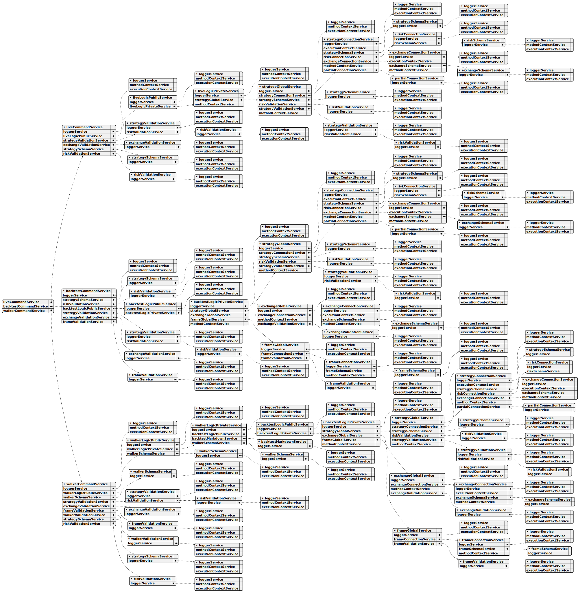

# backtest-kit api reference

**Overview:**

Backtest-kit is a production-ready TypeScript framework for backtesting and live trading strategies with crash-safe state persistence, signal validation, and memory-optimized architecture. The framework follows clean architecture principles with dependency injection, separation of concerns, and type-safe discriminated unions.

**Core Concepts:**

* **Signal Lifecycle:** Type-safe state machine (idle → opened → active → closed) with discriminated unions
* **Execution Modes:** Backtest mode (historical data) and Live mode (real-time with crash recovery)
* **VWAP Pricing:** Volume Weighted Average Price from last 5 1-minute candles for all entry/exit decisions
* **Signal Validation:** Comprehensive validation ensures TP/SL logic, positive prices, and valid timestamps
* **Interval Throttling:** Prevents signal spam with configurable intervals (1m, 3m, 5m, 15m, 30m, 1h)
* **Crash-Safe Persistence:** Atomic file writes with automatic state recovery for live trading
* **Async Generators:** Memory-efficient streaming for backtest and live execution
* **Accurate PNL:** Calculation with fees (0.1%) and slippage (0.1%) for realistic simulations
* **Event System:** Signal emitters for backtest/live/global signals, errors, and completion events
* **Graceful Shutdown:** Live.background() waits for open positions to close before stopping
* **Pluggable Persistence:** Custom adapters for Redis, MongoDB, or any storage backend

**Architecture Layers:**

* **Client Layer:** Pure business logic without DI (ClientStrategy, ClientExchange, ClientFrame) using prototype methods for memory efficiency
* **Service Layer:** DI-based services organized by responsibility:
  * **Schema Services:** Registry pattern for configuration with shallow validation (StrategySchemaService, ExchangeSchemaService, FrameSchemaService)
  * **Validation Services:** Runtime existence validation with memoization (StrategyValidationService, ExchangeValidationService, FrameValidationService)
  * **Connection Services:** Memoized client instance creators (StrategyConnectionService, ExchangeConnectionService, FrameConnectionService)
  * **Global Services:** Context wrappers for public API (StrategyGlobalService, ExchangeGlobalService, FrameGlobalService)
  * **Logic Services:** Async generator orchestration (BacktestLogicPrivateService, LiveLogicPrivateService)
  * **Markdown Services:** Auto-generated reports with tick-based event log (BacktestMarkdownService, LiveMarkdownService)
* **Persistence Layer:** Crash-safe atomic file writes with PersistSignalAdaper, extensible via PersistBase
* **Event Layer:** Subject-based emitters (signalEmitter, errorEmitter, doneEmitter) with queued async processing

**Key Design Patterns:**

* **Discriminated Unions:** Type-safe state machines without optional fields
* **Async Generators:** Stream results without memory accumulation, enable early termination
* **Dependency Injection:** Custom DI container with Symbol-based tokens
* **Memoization:** Client instances cached by schema name using functools-kit
* **Context Propagation:** Nested contexts using di-scoped (ExecutionContext + MethodContext)
* **Registry Pattern:** Schema services use ToolRegistry for configuration management
* **Singleshot Initialization:** One-time operations with cached promise results
* **Persist-and-Restart:** Stateless process design with disk-based state recovery
* **Pluggable Adapters:** PersistBase as base class for custom storage backends
* **Queued Processing:** Sequential event handling with functools-kit queued wrapper

**Data Flow (Backtest):**

1. User calls Backtest.background(symbol, context) or Backtest.run(symbol, context)
2. Validation services check strategyName, exchangeName, frameName existence
3. BacktestLogicPrivateService.run(symbol) creates async generator with yield
4. MethodContextService.runInContext sets strategyName, exchangeName, frameName
5. Loop through timeframes, call StrategyGlobalService.tick()
6. ExecutionContextService.runInContext sets symbol, when, backtest=true
7. ClientStrategy.tick() checks VWAP against TP/SL conditions
8. If opened: fetch candles and call ClientStrategy.backtest(candles)
9. Yield closed result and skip timeframes until closeTimestamp
10. Emit signals via signalEmitter, signalBacktestEmitter
11. On completion emit doneEmitter with { backtest: true, symbol, strategyName, exchangeName }

**Data Flow (Live):**

1. User calls Live.background(symbol, context) or Live.run(symbol, context)
2. Validation services check strategyName, exchangeName existence
3. LiveLogicPrivateService.run(symbol) creates infinite async generator with while(true)
4. MethodContextService.runInContext sets schema names
5. Loop: create when = new Date(), call StrategyGlobalService.tick()
6. ClientStrategy.waitForInit() loads persisted signal state from PersistSignalAdaper
7. ClientStrategy.tick() with interval throttling and validation
8. setPendingSignal() persists state via PersistSignalAdaper.writeSignalData()
9. Yield opened and closed results, sleep(TICK_TTL) between ticks
10. Emit signals via signalEmitter, signalLiveEmitter
11. On stop() call: wait for lastValue?.action === 'closed' before breaking loop (graceful shutdown)
12. On completion emit doneEmitter with { backtest: false, symbol, strategyName, exchangeName }

**Event System:**

* **Signal Events:** listenSignal, listenSignalBacktest, listenSignalLive for tick results (idle/opened/active/closed)
* **Error Events:** listenError for background execution errors (Live.background, Backtest.background)
* **Completion Events:** listenDone, listenDoneOnce for background execution completion with DoneContract
* **Queued Processing:** All listeners use queued wrapper from functools-kit for sequential async execution
* **Filter Predicates:** Once listeners (listenSignalOnce, listenDoneOnce) accept filter function for conditional triggering

**Performance Optimizations:**

* Memoization of client instances by schema name
* Prototype methods (not arrow functions) for memory efficiency
* Fast backtest method skips individual ticks
* Timeframe skipping after signal closes
* VWAP caching per tick/candle
* Async generators stream without array accumulation
* Interval throttling prevents excessive signal generation
* Singleshot initialization runs exactly once per instance
* LiveMarkdownService bounded queue (MAX_EVENTS = 25) prevents memory leaks
* Smart idle event replacement (only replaces if no open/active signals after last idle)

**Use Cases:**

* Algorithmic trading with backtest validation and live deployment
* Strategy research and hypothesis testing on historical data
* Signal generation with ML models or technical indicators
* Portfolio management tracking multiple strategies across symbols
* Educational projects for learning trading system architecture
* Event-driven trading bots with real-time notifications (Telegram, Discord, email)
* Multi-exchange trading with pluggable exchange adapters

**Test Coverage:**

The framework includes comprehensive unit tests using worker-testbed (tape-based testing):

* **exchange.test.mjs:** Tests exchange helper functions (getCandles, getAveragePrice, getDate, getMode, formatPrice, formatQuantity) with mock candle data and VWAP calculations
* **event.test.mjs:** Tests Live.background() execution and event listener system (listenSignalLive, listenSignalLiveOnce, listenDone, listenDoneOnce) for async coordination
* **validation.test.mjs:** Tests signal validation logic (valid long/short positions, invalid TP/SL relationships, negative price detection, timestamp validation) using listenError for error handling
* **pnl.test.mjs:** Tests PNL calculation accuracy with realistic fees (0.1%) and slippage (0.1%) simulation
* **backtest.test.mjs:** Tests Backtest.run() and Backtest.background() with signal lifecycle verification (idle → opened → active → closed), listenDone events, early termination, and all close reasons (take_profit, stop_loss, time_expired)
* **callbacks.test.mjs:** Tests strategy lifecycle callbacks (onOpen, onClose, onTimeframe) with correct parameter passing, backtest flag verification, and signal object integrity
* **report.test.mjs:** Tests markdown report generation (Backtest.getReport, Live.getReport) with statistics validation (win rate, average PNL, total PNL, closed signals count) and table formatting

All tests follow consistent patterns:
* Unique exchange/strategy/frame names per test to prevent cross-contamination
* Mock candle generator (getMockCandles.mjs) with forward timestamp progression
* createAwaiter from functools-kit for async coordination
* Background execution with Backtest.background() and event-driven completion detection

# backtest-kit functions

## Function writeMemory

The `writeMemory` function lets you store data, like trading decisions or observations, within a specific memory location. Think of it as writing a note to yourself during a trade, linked to a particular signal.

It takes an object containing the bucket name, a unique ID for the memory slot, the actual value you want to store (which can be any object), and a description of what the data represents.

The function automatically determines whether you're in a backtesting or live trading environment, making it adaptable to different scenarios.

Importantly, this function relies on an active, pending signal – if there's no signal currently being processed, it won't be able to write and will let you know with a warning.

## Function warmCandles

This function helps prepare your backtesting environment by proactively downloading and storing historical price data, also known as candles. It grabs all the necessary price information for a specific time period, from a starting date to an ending date, based on the interval you define (like 1-minute, 1-hour, or daily candles). This pre-loading step means that when you actually run your backtests, the data is readily available, making the process faster and more efficient. Think of it as stocking up on supplies before starting a long journey. It stores the downloaded data for later use, eliminating the need to repeatedly fetch it during backtests.

## Function validate

This function helps you make sure everything is set up correctly before you run any tests or optimizations. It checks if all the things your strategies and other components need – like exchanges, frames, and sizing methods – actually exist and are registered.

You can tell it to check specific items, or if you leave it blank, it will verify absolutely everything. This is a great way to catch potential errors early on and avoid issues during your backtesting process. Think of it as a quick health check for your entire trading setup.

## Function stopStrategy

This function pauses a trading strategy, effectively preventing it from creating any new trading signals. 

It doesn't immediately close existing trades; instead, any currently active signal will finish its cycle.

Whether you're running a backtest or a live trading session, the system will halt at a suitable point – either when it’s idle or after a signal has concluded.

You simply need to provide the symbol of the trading pair the strategy is working with.

## Function shutdown

This function provides a way to safely end the backtesting process. It signals to all parts of the system that it's time to wrap things up. This is important for making sure everything is cleaned up properly, especially when the backtest is stopped unexpectedly. Think of it as a gentle way to say goodbye before the program finishes.

## Function setLogger

This function lets you plug in your own logging system into the backtest-kit framework. 

Essentially, it allows you to control where and how the framework's internal messages are displayed.

You provide a logger that follows a specific interface (ILogger), and the framework will send all its log messages to it. 

The nice part is that your logger will automatically receive extra information along with each log message, such as the strategy name, the exchange used, and the symbol being traded – making it easier to understand what's happening during backtesting.

## Function setConfig

This function lets you adjust how the backtest-kit framework operates. You can use it to change settings like the data source, default order sizes, or other global parameters. The `config` argument lets you specify which settings you want to change; you don't need to provide all of them—just the ones you want to override.  There's also a special `_unsafe` flag. Use this carefully, as it bypasses important checks and is primarily intended for testing scenarios.

## Function setColumns

This function lets you customize the columns displayed in your backtest reports, like the ones generated as markdown. You can change the default column configurations for any report type. 

It's helpful if you want to tweak which data points are shown or how they are presented. The function validates your column definitions to make sure they're properly structured, but a special flag lets you bypass this check if you're working in a testing environment.

## Function searchMemory

The `searchMemory` function helps you find relevant memory entries based on a search query. It's designed to quickly locate information within your backtest or live trading environment.

It automatically figures out if you're running a backtest or a live simulation and uses a BM25 scoring system for accurate search results.

The function pulls the trading symbol from the current execution context and the signal ID from any pending signals. If there are no pending signals, it will warn you and return an empty set of results.

You provide a data transfer object (DTO) that specifies the bucket (memory storage location) to search and the actual search query. The function returns a list of found memory entries, including a unique identifier for each entry, a relevance score, and the content of the memory itself.

## Function runInMockContext

This function lets you execute code as if it were running within a trading strategy, but without actually needing a full backtest environment. Think of it as a sandbox for testing or scripting that relies on things like the current trading timeframe or exchange information. 

You can provide details like the exchange, strategy, frame, and trading symbol to match your specific scenario, or let it use default placeholder values for a basic live-mode setup. This is especially helpful when you need to access context-related information without setting up a complete backtest. It essentially creates a controlled environment for your function to operate in, making testing and scripting much easier.

## Function removeMemory

This function helps you clean up data related to a specific trading signal. It's designed to remove a memory entry, essentially deleting old data associated with a signal.

It automatically figures out whether you're running a backtest or a live trading environment.

To use it, you need to provide the name of the data bucket and a unique identifier for the memory entry you want to delete.

If there isn't a signal currently being processed, it will let you know with a warning and won't do anything.

## Function readMemory

The `readMemory` function lets you retrieve data stored in a specific memory location tied to the current trading signal. Think of it as accessing a previously saved variable within the context of your trading strategy. 

It automatically figures out whether you're in a backtesting or live trading environment based on the available information.

The function requires two pieces of information to work: the name of the bucket where the memory is stored and the unique ID of the memory itself. If there's no active pending signal, it will alert you to the issue, as the memory retrieval is dependent on one. 

Ultimately, it returns the data you requested, or null if it's not found.

## Function overrideWalkerSchema

This function lets you tweak a trading strategy's walker configuration – think of it as adjusting how the strategy explores different scenarios during backtesting. It's useful when you want to compare strategies but need to slightly modify the conditions one of them uses.  Essentially, you provide a new set of settings, and the function merges them with the existing walker configuration, only changing the parts you specify. The rest of the original walker configuration stays as it was.

## Function overrideStrategySchema

This function lets you modify existing trading strategies within the backtest-kit framework. Think of it as a way to tweak a strategy’s settings without completely replacing it.

You provide a portion of the strategy's configuration – only the parts you want to change – and the framework will update the existing strategy, leaving everything else untouched. This is helpful when you want to adjust specific parameters or settings without rewriting the whole strategy definition.

It takes a strategy configuration object as input.

## Function overrideSizingSchema

This function lets you tweak a position sizing configuration that's already set up within the backtest-kit system. Think of it as a way to make small adjustments, rather than replacing the whole sizing setup. You provide a partial configuration – just the settings you want to change – and the function updates the existing configuration, leaving everything else untouched. This is handy for fine-tuning sizing rules without a complete overhaul.

## Function overrideRiskSchema

This function lets you adjust existing risk management settings within the backtest-kit framework. Think of it as a way to fine-tune a risk profile that’s already been set up. You're not creating a whole new risk configuration, but rather modifying specific aspects of an existing one. Only the settings you provide will be changed; everything else stays as it was before.

## Function overrideFrameSchema

This function lets you modify an existing timeframe's settings when you're setting up a backtest. Think of it as fine-tuning a timeframe – you can change specific parts of its configuration without having to redefine the entire timeframe from scratch. It's useful when you want to adjust things like data aggregation or how data is processed for a particular timeframe. You provide a set of changes, and the function applies just those to the existing timeframe definition.

## Function overrideExchangeSchema

This function lets you modify an existing exchange data source within the backtest-kit framework. Think of it as a way to tweak a previously set up exchange without having to rebuild it from scratch. You can selectively update parts of the exchange’s configuration – only the settings you provide will be changed, leaving everything else untouched. This is useful for making adjustments or corrections to an exchange's setup after it's already been defined.

## Function overrideActionSchema

This function lets you tweak an action handler that’s already set up in the backtest-kit framework. Think of it as making small adjustments to an existing rule, rather than completely replacing it. You can update specific parts of the handler's configuration, leaving the rest untouched.

It's really handy for things like refining how events are handled, changing callbacks depending on where you are (like development versus production), or swapping out different versions of the handler on the fly. You can fine-tune how actions behave without needing to overhaul the whole strategy.

The function takes a partial configuration object – just the parts you want to change – and returns a promise representing the updated action schema.

## Function listenWalkerProgress

This function lets you keep tabs on how your backtesting process is going. It’s a way to be notified after each strategy within a backtest finishes running.

You provide a function that will be called with updates, and this function returns another function to unsubscribe from those updates when you no longer need them.

Importantly, the updates are delivered one at a time, and any asynchronous work your callback function does won't interfere with the order of the updates. It ensures a smooth and reliable flow of information as your backtest progresses.

## Function listenWalkerOnce

The `listenWalkerOnce` function lets you monitor the walker's progress, but only to react to the very first event that meets your criteria. You provide a filter – a test to see if an event is interesting – and a callback function to execute when that first matching event occurs. Once the callback has run once, the listener automatically stops, which is handy when you're waiting for something specific to happen and then need to move on.

## Function listenWalkerComplete

This function lets you get notified when the backtest process finishes, specifically when all strategies have been tested. It's designed to handle events in the order they arrive, and importantly, it makes sure your callback function runs one at a time, even if it's asynchronous, to avoid any unexpected issues. You provide a function that will be called when the backtest is complete, and it returns another function that you can call to unsubscribe from these notifications later.

## Function listenWalker

The `listenWalker` function lets you keep track of how a backtest is progressing. It’s like setting up an observer that gets notified when each strategy finishes running within a backtest. 

Crucially, these notifications happen in the order they occur and uses a queuing system to make sure your code doesn't accidentally run multiple things at once, even if your notification handling involves asynchronous operations. To use it, you provide a function that will be called for each completed strategy, and it will return a function to unsubscribe from these notifications.

## Function listenValidation

This function lets you keep an eye on any errors that pop up during the risk validation process. Think of it as a way to catch problems when your system is checking signals. 

When something goes wrong, this function will notify you, letting you debug and monitor what’s happening. Importantly, it handles errors in order and prevents multiple errors from being processed at the same time, making troubleshooting much smoother. You provide a function that will be called whenever a validation error occurs.

## Function listenSyncOnce

This function lets you listen for specific synchronization events, but only once. It’s perfect when you need to react to a signal just one time, like when coordinating with something outside your system.

If an error happens while using this, your trading positions won't be adjusted until the process finishes.

You provide a filter to decide which events you’re interested in, and a function to handle those events. The function will execute only once and if it returns a promise, the synchronization process will pause until that promise resolves. It also includes a warning flag, but it's not detailed in the documentation. Finally, the function returns a way to unsubscribe from the signal.

## Function listenSync

The `listenSync` function lets you react to synchronization events within your backtesting system. It's designed for situations where you need to coordinate with external systems or perform actions that take time. When you subscribe using `listenSync`, any signals—like opening or closing a position—will pause until your callback function finishes executing. This ensures everything stays in sync. The callback receives a `SignalSyncContract` object containing details about the signal. You can optionally provide a `warned` flag, although its purpose isn't fully explained in the documentation.

## Function listenStrategyCommitOnce

This function lets you set up a listener that reacts to changes in your trading strategy, but only once. 

It's like having a temporary alert system. You tell it what kind of strategy event you're looking for, and it will trigger your custom function (the callback) the first time that event happens.

After that one execution, the listener automatically disappears, so you don't need to worry about cleaning things up. This is really handy when you need to respond to a specific strategy action and then move on.

You provide a filter to specify exactly which strategy events should trigger your callback, and then you define the function to execute when the filter matches.

## Function listenStrategyCommit

This function lets you keep an eye on what's happening with your trading strategies – things like cancelling signals, closing trades, adjusting stop-loss and take-profit levels, and more. It's designed to make sure these events are handled in a predictable order, even if your callback function takes some time to process each one. Think of it as a listener that calls your function whenever a significant action related to your strategy occurs, ensuring everything happens in a controlled sequence. You provide a function that will be called with information about the event that occurred, and this listener function returns another function to unsubscribe from the events.

## Function listenSignalOnce

This function lets you set up a listener that only runs once when a specific condition is met. You provide a filter—essentially, a rule—to determine which events you're interested in. Once an event matches that filter, the provided callback function executes. Then, the listener automatically stops, ensuring it only runs that single time. It's perfect for situations where you need to react to a particular signal just once.

You tell it what kind of signal you're looking for and what you want to do when you find it. 
The function takes care of automatically stopping the listener after that single event.

## Function listenSignalLiveOnce

The `listenSignalLiveOnce` function lets you temporarily tap into the live trading signals being generated. You provide a filter—a way to select which signals you're interested in—and a callback function that will run just once when a matching signal arrives. Think of it as setting up a brief, single-use listener for specific events during a live trading simulation. Once that single event is processed, the listener automatically disappears, preventing further callbacks. This is helpful for tasks like quickly logging a particular trade signal or performing a one-time analysis.

## Function listenSignalLive

The `listenSignalLive` function lets you hook into the live trading signal stream generated by `Live.run()`. Think of it as subscribing to a notification system that keeps you informed about what's happening during a live trading session. When a trading event occurs, it will call a function you provide, giving you the details of that event. Importantly, these events are processed one at a time, ensuring they're handled in the order they arrive. To stop listening, the function returns another function you can call to unsubscribe.

## Function listenSignalBacktestOnce

This function lets you listen for specific events generated during a backtest run, but only once. Think of it as setting up a temporary alert that fires just one time when a certain condition is met.

It allows you to specify a filter – a test that each event must pass – and a callback function that will be executed once when an event satisfies that filter. 

Once the callback has been executed, the subscription automatically ends, so you don't have to worry about managing it manually. This is great for quickly checking a particular signal or data point without needing a long-term subscription.

## Function listenSignalBacktest

This function lets you tap into the stream of data coming from a backtest run. You provide a function that will be called whenever a significant event happens during the backtest, like a new tick or a trade execution. Importantly, these events are handled one at a time, ensuring a reliable order, which is helpful for complex analyses or real-time visualizations during the simulation. This subscription is specifically for events generated during a `Backtest.run()` execution. The function returns a way to unsubscribe from the signal.

## Function listenSignal

This function lets you register a listener to receive notifications whenever a trading strategy emits a signal, like when it's idle, opens a position, is actively trading, or closes a position.  The system ensures that these notifications are processed one at a time, even if your callback function takes some time to complete. This helps avoid any potential issues caused by running multiple callbacks simultaneously. You provide a function that will be called with data about each signal event. The function you provide will also return another function when called that can be used to stop listening for signals.

## Function listenSchedulePingOnce

This function lets you set up a temporary listener that reacts to specific ping events. You tell it what kind of event you’re looking for using a filter – it only triggers when the event matches your criteria. 

Once a matching event is found, the provided function runs just once to handle it, and then the listener automatically disappears. This is handy for situations where you need to respond to a one-time condition within the ping events.

You'll define a function that determines which ping events are of interest and another function that executes when a matching ping event is found. The listener will automatically unsubscribe after the first matching event is processed.

## Function listenSchedulePing

This function lets you listen for ping signals that are sent out while a scheduled signal is being monitored, which is essentially while it’s waiting to become active. Think of it as getting a little "heartbeat" signal every minute to confirm everything is still running smoothly during that waiting period. 

You provide a function that will be called whenever a ping event occurs, allowing you to keep track of the scheduled signal's status or run any custom checks you might need. The function returns an unsubscribe function, so you can easily stop listening when you're done.

## Function listenRiskOnce

The `listenRiskOnce` function lets you react to specific risk-related events, but only once. Think of it as setting up a temporary listener that waits for a particular condition to be met, executes a function when it happens, and then quietly disappears. You provide a filter to identify the events you’re interested in, and a function to execute when that event occurs. This is handy when you need to respond to a situation just once and then stop listening. It automatically handles the cleanup for you, preventing unwanted side effects.

## Function listenRisk

The `listenRisk` function lets you monitor when a trading signal is blocked because it violates your risk rules. 

It only sends you updates when a signal is rejected, meaning you won't be flooded with unnecessary notifications for signals that pass your risk checks. 

The function ensures that your callback is executed one at a time, even if it involves asynchronous operations, to prevent any issues from concurrent processing. You provide a function that will be called whenever a risk rejection occurs, and `listenRisk` handles the details of listening for and managing those events.

## Function listenPerformance

This function lets you keep an eye on how long different parts of your trading strategy take to run. It's like adding a performance tracker that listens for events related to execution timing. These events will give you data points to help you pinpoint slow spots in your strategy – allowing you to improve its overall speed and efficiency.  The events are handled one after another, even if the function you provide to handle them takes some time to complete.

## Function listenPartialProfitAvailableOnce

This function lets you set up a listener that only triggers once when a specific profit level is reached. You provide a filter to define what conditions must be met, and then a function that will be executed just one time when those conditions are true. Once the callback runs, the listener automatically stops, so you don’t have to worry about managing it yourself. It's a handy way to react to a particular profit milestone without continuous monitoring.

## Function listenPartialProfitAvailable

This function lets you be notified when your backtest reaches certain profit milestones, like 10%, 20%, or 30% gains. 

It's like setting up a listener that gets triggered whenever those targets are hit. 

Importantly, it handles events in order and makes sure your callback function runs one at a time, even if it takes a while to execute, preventing any issues that could arise from running things concurrently. You provide a function that gets called with details about the partial profit event each time a milestone is achieved. You can unsubscribe from these notifications whenever you no longer need them.

## Function listenPartialLossAvailableOnce

This function allows you to react to specific partial loss events in your trading strategy, but only once. You provide a filter to define exactly which loss events you're interested in, and a function to execute when that event occurs. Once the event is triggered and the function is run, the subscription is automatically cancelled, meaning you won't receive any further notifications of that type. It's a handy way to monitor for a particular loss scenario and take immediate action without ongoing monitoring.

Here's how it works:

*   You give it a condition (the `filterFn`) to check which events it should respond to.
*   You specify a function (`fn`) to run when an event matches that condition.
*   The function will execute only once when the condition is met, and then it will stop listening.

## Function listenPartialLossAvailable

This function lets you keep an eye on when your trading strategy reaches certain loss milestones, like 10%, 20%, or 30% of its capital. 

It sends you notifications whenever these loss levels are hit. 

Importantly, the events are handled one after another, even if the function you provide needs some time to process each event. This ensures things happen in the right order and prevents any overlapping issues. You can unsubscribe from these notifications whenever you need to stop receiving them.

## Function listenMaxDrawdownOnce

This function lets you react to specific max drawdown events and then automatically stop listening. Think of it as setting up a temporary alert – it waits for a certain condition (defined by your filter) to be met, then runs your code once and then stops. It’s handy for situations where you only need to know about a drawdown event happening just once, like automatically adjusting risk based on a drawdown threshold.

You provide a filter to specify what kind of drawdown events you're interested in. The callback function then handles that single event. Once the callback runs, the subscription is automatically canceled.

## Function listenMaxDrawdown

This function lets you keep an eye on when your trading strategy experiences maximum drawdown – that's the biggest peak-to-trough decline in your portfolio's value. It sends you notifications whenever a new drawdown record is hit.

Think of it like setting up a listener that fires off an alert whenever your strategy hits a new low point in terms of losses.

The important thing is that these alerts are handled one at a time, even if the function you provide to handle them takes some time to run. This ensures that the order of events is maintained, and your logic doesn't get messed up by things happening out of sequence.

You can use this to monitor drawdown levels and adjust your trading strategy accordingly, perhaps by reducing risk or changing positions.

To use it, you give it a function that will be called whenever a new maximum drawdown is detected. The function will receive details about the event. When you’re done listening, the function will return a function you can call to unsubscribe.

## Function listenHighestProfitOnce

This function lets you set up a temporary alert for when a specific trading event occurs that meets certain criteria. You provide a filter – essentially, a rule – that defines what kind of event you're looking for, and then you give it a function to run when that event happens. Once the event is found and the function runs, the alert automatically turns off, ensuring it doesn't trigger again. It’s a handy way to react to a particular market condition just once.

The filter determines which events are of interest. The function you provide is what gets executed when a matching event is detected.

## Function listenHighestProfit

This function allows you to be notified whenever a trading strategy achieves a new peak profit during its backtesting or live trading. It makes sure these notifications are handled one at a time, even if your notification handling code takes some time to complete. Think of it as a way to keep an eye on your strategy's profit milestones and react to them in a controlled manner. You provide a function that gets called with details about the new highest profit level, and this function returns another function which you use to unsubscribe from this event.

## Function listenExit

This function lets you react to truly unrecoverable errors that halt the backtest or other background processes. It’s designed for situations where something goes so wrong that the process needs to stop. Think of it as a last line of defense against critical issues.

It handles errors from processes like `Live.background`, `Backtest.background`, and `Walker.background`.  Unlike the `listenError` function, which deals with problems you might be able to recover from, this one deals with the big, show-stopping kind of errors.

The errors are handled one at a time, in the order they occur, even if your error handling code takes some time to run. This makes sure things stay predictable.  A special mechanism is in place to ensure that your error handling doesn't try to run multiple things at once.

You provide a callback function (`fn`) that will be executed when such a fatal error happens.  This callback will receive an `Error` object containing details about what went wrong.  The function itself returns another function which can be called to unsubscribe from these events.

## Function listenError

This function lets you set up a system to catch and handle errors that happen while your trading strategy is running, but aren't critical enough to stop the whole process. Think of it as a safety net for little hiccups, like a temporary API problem.

When an error occurs, the provided function will be called to deal with it. This helps your strategy to keep running smoothly even when things go wrong occasionally.

Importantly, these errors are handled one at a time, in the order they happen, to make sure things are processed correctly, even if the error handling itself takes a little time. It ensures that error responses aren’t missed due to overlapping callbacks.

## Function listenDoneWalkerOnce

This function lets you listen for when a background process finishes, but only once. It's great for tasks you only need to react to a single completion.

You provide a filter to decide which finishing events you're interested in, and then a function to run when the right event happens. After that function runs, the listener automatically stops listening, so you don't have to worry about cleaning it up. Essentially, it's a one-time notification system for background processes.

## Function listenDoneWalker

This function lets you listen for when a background process within a Walker finishes. It's designed to handle events sequentially, even if the function you provide needs to do some asynchronous work. Think of it as a way to be notified when a task is fully done, ensuring things happen in the right order.  You give it a function that will be called when the background process is complete, and it returns another function you can call to unsubscribe from these notifications.

## Function listenDoneLiveOnce

The `listenDoneLiveOnce` function lets you react to when a background task finishes, but only once. It’s a way to listen for specific completion signals from your background processes.

You provide a filter – a function that checks if the completion event matches what you’re looking for. Then, you give it a callback function. 

Once a matching event occurs, the callback function runs, and the listener automatically stops listening. This ensures you only handle the event once and don’t clutter your code with ongoing checks.

## Function listenDoneLive

This function lets you be notified when background tasks run by Live finish processing. Think of it as a way to know when something has completed its work behind the scenes. It ensures that when a task finishes, you're informed in the order it happened, and it takes care of managing things so that your notification processing doesn’t get chaotic. The notification itself will happen sequentially, even if the way you handle the notification is complex or asynchronous. You can unsubscribe from these notifications whenever you no longer need them.

## Function listenDoneBacktestOnce

This function allows you to react to the completion of a backtest that's running in the background. It lets you specify a condition - a filter - to only be notified when a specific backtest finishes. Once the condition is met and the backtest is done, the function executes your provided callback once, and then automatically stops listening. Think of it as a one-time alert for a particular type of backtest completion.

## Function listenDoneBacktest

This function lets you be notified when a background backtest finishes running. 

Think of it as subscribing to an event that tells you "the backtest is done!"

It's designed to handle the completion safely, ensuring events are processed one after another, even if your notification code takes some time to run. 

You provide a function that gets called when the backtest is finished, and this function returns another function which can be called to unsubscribe.

## Function listenBreakevenAvailableOnce

This function lets you react to specific situations where a breakeven price becomes available for a contract, but only once. It allows you to define a condition, like a certain price level or a specific contract type, and then trigger an action when that condition is met. After the callback function runs once, it automatically stops listening, making it ideal for short, targeted reactions to breakeven events. You give it a way to identify the exact situations you’re interested in and then tell it what to do when one of those situations happens.

## Function listenBreakevenAvailable

This function lets you set up a listener that gets notified whenever a trade's stop-loss automatically adjusts to the entry price – essentially, the point where the trade is no longer at a loss. This happens when the trade has made enough profit to cover all transaction costs. The listener function you provide will be called whenever this happens, and the events are handled one at a time to ensure things run smoothly, even if your listener takes some time to process each event. You can think of it as a way to get informed about trades achieving a level of profitability that protects your initial investment.

## Function listenBacktestProgress

This function lets you keep an eye on how your backtest is running. It allows you to subscribe to updates about the backtest's progress as it executes. These updates are sent during the background processing stage of a backtest. 

Importantly, the updates will be handled one at a time, even if your code for processing the updates takes some time. This helps ensure things stay orderly and prevents unexpected issues.

To use it, you provide a function that will be called with information about each progress event. When you are done, you can unsubscribe by calling the function that the `listenBacktestProgress` function returns.

## Function listenActivePingOnce

This function lets you temporarily listen for specific active ping events and react to them just once. Think of it as setting up a one-time alert – you define what kind of event you're waiting for, and when it happens, a function runs and then the alert automatically goes away. It’s perfect when you need to trigger something based on a particular active ping condition and don't want to keep listening afterward.

You provide a filter to specify which events you care about, and then you define the action you want to take when a matching event arrives. Once that event is processed, the subscription ends, keeping your system tidy.

## Function listenActivePing

This function lets you keep an eye on active trading signals within your backtest. It provides a way to receive notifications whenever a signal becomes active, occurring roughly every minute. This is helpful if you need to adjust your strategies or systems based on which signals are currently live. 

The function ensures that these notifications are handled one at a time, in the order they arrive, even if your callback function takes some time to process. This prevents issues that might arise from multiple events happening simultaneously. You simply provide a function that will be called with the details of the active ping event. When you're finished, the function returns another function you can call to stop listening.

## Function listWalkerSchema

This function provides a way to see all the different "walkers" currently set up within the backtest-kit system. Think of walkers as pre-defined steps or routines used in a trading simulation. 

It's helpful if you want to understand what's happening under the hood, create documentation, or build a user interface that lets you manage these walkers. It returns a list of these walkers and their configurations.

## Function listStrategySchema

This function helps you discover all the trading strategies currently set up in your backtest-kit environment. It essentially provides a list of all the different approaches you've defined for simulating trades. You can use this information to check what strategies are available, generate documentation, or build user interfaces that dynamically display the options. Think of it as a way to see the complete menu of trading strategies at your disposal.

## Function listSizingSchema

This function gives you a look at all the sizing strategies currently set up within the backtest-kit framework. It's like getting a complete inventory of how positions are being sized for trades. You can use this information to check your configurations, build tools that display sizing options, or simply understand how sizing is being handled in your backtest. The function returns a list, so you'll have a clear collection of sizing schemas to work with.

## Function listRiskSchema

This function helps you see all the risk configurations currently set up in your backtest kit. It gives you a list of all the risk schemas that have been added. This is particularly handy if you're trying to understand your setup, build tools to display risk information, or just double-check that everything is configured as expected.

## Function listMemory

This function helps you see all the stored memory entries related to your trading signal. It essentially retrieves a list of previously saved data points.

It figures out the right bucket to look in based on your trading environment (backtest or live) and also uses the signal ID of any active trading signal.

If there isn't an active signal, it'll let you know with a message and return an empty list, meaning there's nothing to show.

You provide a simple object telling it which bucket to look in, and it gives you back an array of objects, each containing a unique ID and the data itself.

## Function listFrameSchema

This function provides a way to see all the different data structures, or "frames," that your backtesting strategy is using. It essentially gives you a list of the blueprints that define how your data is organized. Think of it like a catalog of all the data types your backtest understands – useful for understanding your strategy's data flow or building tools around it. You can use this list to inspect what's going on behind the scenes or to generate documentation.

## Function listExchangeSchema

This function gives you a peek behind the curtain by providing a list of all the exchanges that backtest-kit knows about. Think of it as a way to see exactly which trading platforms have been set up within the system. It's handy if you're trying to figure out what's going on, generating documentation, or building an interface that needs to adapt to different exchanges. The function returns a promise that resolves to an array of exchange schema objects.

## Function hasTradeContext

This function simply tells you whether the system is currently in a state where it can execute trading actions. 

Think of it as checking if everything is set up correctly to perform a trade – both the execution environment and the method context are active.

If it returns `true`, it means you're good to go and can use functions like `getCandles` or `formatPrice` which rely on this trade context. If it's `false`, you'll need to ensure the necessary contexts are established before proceeding.

## Function hasNoScheduledSignal

This function helps you check if a scheduled trading signal exists for a particular symbol. It returns `true` when no signal is currently scheduled for that symbol, meaning it's safe to proceed with generating or adjusting signals. Think of it as the opposite of checking for an existing signal - use it to make sure you’re not interfering with planned actions. The function intelligently determines whether it's running in a backtesting or live trading environment without you needing to specify. It takes the trading pair symbol, like "BTCUSDT," as input.

## Function hasNoPendingSignal

This function checks if there's a pending signal currently active for a specific trading pair. It will return true if no signal is waiting, which is the opposite of `hasPendingSignal`. Think of it as a safety check—you can use it to make sure you aren't generating new signals when one is already in progress. It figures out whether you’re in a backtesting or live trading environment without you needing to specify. You just give it the symbol of the trading pair you're interested in, and it tells you if there’s a pending signal.

## Function getWalkerSchema

The `getWalkerSchema` function helps you find details about a specific trading strategy or component within your backtesting setup. Think of it as looking up the blueprint for a particular part of your automated trading system. You provide the name of the strategy you're interested in, and the function returns a description of its workings, including what data it needs and how it behaves. This allows you to understand and potentially customize the strategies you're using in your backtests.

## Function getTotalPercentClosed

This function lets you check how much of a trade is still open. It gives you a percentage – 100 means you haven't closed any part of the position, while 0 means the whole thing is closed. 

The calculation takes into account any times you’ve added to the position through dollar-cost averaging (DCA), making sure the percentage is accurate even with partial closes along the way.

It works whether you're backtesting strategies or trading live, as it automatically figures out the correct mode based on where it's being used.

You just need to provide the symbol of the trading pair you're interested in, like 'BTCUSDT'.

## Function getTotalCostClosed

`getTotalCostClosed` helps you find out how much money you've spent on a specific trading pair, like BTC/USDT. 

It figures out the total cost basis, even if you've been buying in gradually (Dollar-Cost Averaging) and selling off in smaller chunks.

The function understands whether it’s running a test backtest or a live trading session and adjusts accordingly.

You just need to tell it which trading pair you’re interested in, such as "BTC/USDT."

## Function getTimestamp

This function, `getTimestamp`, provides a simple way to retrieve the current timestamp within your trading strategy. It dynamically adapts to the environment: when running a backtest, it gives you the timestamp associated with the specific historical timeframe you're analyzing. However, when deployed for live trading, it provides the actual, real-time timestamp. It's a useful tool for accurate time-based calculations and logging in your trading system.

## Function getSymbol

This function allows you to retrieve the symbol you're currently trading, like "BTCUSDT" or "ETHUSD". It's a simple way to know which asset your backtest or trading strategy is focused on.  The function returns a promise that resolves to a string representing the symbol.

## Function getStrategySchema

This function lets you fetch the blueprint for a specific trading strategy you've registered within the backtest-kit framework. Think of it as getting the detailed definition of how a strategy is structured, including what inputs it expects and what outputs it produces. You provide the strategy’s unique name, and it returns a structured object describing that strategy's schema. This is helpful for validating configurations or dynamically generating user interfaces.

## Function getSizingSchema

This function helps you find the details of how your trading strategy determines position sizes. It takes a name – a unique identifier – that you've assigned to a specific sizing method. The function then returns a structured object containing all the information about that sizing method, such as its parameters and how it calculates trade sizes. Think of it as looking up the recipe for a particular sizing approach within your backtesting setup. You can use this information to understand and potentially customize how your strategy manages risk and capital.

## Function getScheduledSignal

This function helps you retrieve the signal that's currently planned for a specific trading pair. Think of it as checking what the strategy *should* be doing right now, according to its schedule. 

It will fetch the signal details, and if there isn't a scheduled signal at the moment, it will simply return nothing. 

The framework intelligently figures out whether it's in a backtesting environment or a live trading scenario, so you don't have to worry about that.

You just need to provide the symbol, like "BTCUSDT," to get the relevant signal information.

## Function getRiskSchema

This function lets you grab a specific risk schema that's already been set up within the backtest-kit system. Think of risk schemas as blueprints for how you want to manage risk during a trading simulation. You identify the schema you need by its unique name, and this function provides you with the details of that schema. It's a straightforward way to access pre-defined risk management rules.

## Function getRawCandles

The `getRawCandles` function allows you to retrieve historical candlestick data for a specific trading pair and time interval. You can control how many candles you get and define a start and end date for the data. 

It's designed to avoid any issues with looking into the future when you're analyzing past performance.

You can request candles by specifying a limit (number of candles), a start date, and/or an end date. If you just give a limit, it will automatically use a default start date. The function will automatically adjust parameters when some parameters are omitted. It always makes sure the end date you provide isn’t in the future.

Here's what each parameter controls:

*   **symbol:** The trading pair you want data for, like "BTCUSDT".
*   **interval:**  The time frame for each candle, options are "1m", "3m", "5m", "15m", "30m", "1h", "2h", "4h", "6h", and "8h".
*   **limit:** How many candles to retrieve (optional).
*   **sDate:** The starting date and time for the data (optional, in milliseconds).
*   **eDate:** The ending date and time for the data (optional, in milliseconds).

## Function getPositionPnlPercent

This function helps you quickly understand how your open positions are performing financially. It calculates the percentage profit or loss on your current, unclosed positions, taking into account things like multiple purchase prices (DCA), any slippage that might have occurred when placing orders, and trading fees. 

If you don't have any open positions, the function will return null.

It handles the details of finding the current market price and knows whether it's operating in a backtesting environment or a live trading scenario, so you don't have to worry about those settings. You just need to provide the trading pair symbol (like BTCUSDT).

## Function getPositionPnlCost

To understand how much your trading strategy is currently profiting or losing, `getPositionPnlCost` helps you calculate the unrealized profit and loss in dollars. It figures this out by looking at the percentage gain or loss of your position, factoring in things like how much you initially invested, any partial closes you've made, and even slippage and fees. 

If you don't have any active trades yet, it will return null. 

The function smartly adapts to whether it's running a backtest or a live trade, and it also automatically gets the current market price for accurate calculations. You just need to provide the symbol of the trading pair.

## Function getPositionPartials

This function lets you peek at how much of your position has been partially closed for profit or loss. It gives you a history of those partial closes, showing the percentage closed, the price at which it happened, and some details like the cost basis and number of DCA entries at the time.

If no trades are running, the function will return nothing. If some partials have already happened, it will provide a list of those events. You'll need to provide the symbol (like "BTC-USDT") to specify which trading pair you’re interested in.

## Function getPositionPartialOverlap

This function helps you avoid accidentally executing multiple partial closing orders for the same trade. It checks if the current market price is close enough to a price where you've already started a partial closing process.

Essentially, it prevents situations where your system might try to partially close a position at almost the same price twice.

The function takes the trading symbol and the current price as input. You can also customize the acceptable range around the partial closing price using a configuration.

If no partial closing orders have been initiated, it will return false. Otherwise, it assesses whether the current price falls within a defined range around the partial closing price.

## Function getPositionMaxDrawdownTimestamp

This function helps you find out when a specific trading position experienced its biggest loss. It looks at a particular trading pair, like BTC/USD, and tells you the exact timestamp (a date and time) when the price hit the lowest point for that position. If there's no active trading signal for that pair, it will indicate that by returning null. Essentially, it's a way to pinpoint the moment of maximum drawdown for a position's history.

## Function getPositionMaxDrawdownPrice

This function helps you understand how much a specific trade has lost at its lowest point. It looks back at the history of that trade and finds the lowest price it reached during its existence.

Think of it as measuring the peak-to-trough decline for a particular position.

You'll need to provide the symbol of the trading pair, like "BTCUSDT," to tell the function which trade to analyze.

If there aren't any active trades to look at, the function will let you know by returning null.

## Function getPositionMaxDrawdownPnlPercentage

This function helps you understand the risk associated with a specific trading position. It calculates and returns the maximum percentage of potential loss the position experienced at its lowest point. Essentially, it tells you how far "underwater" the position went during its existence. 

If there's no active signal related to the position, the function will return null, indicating that the calculation can't be performed. You provide the trading symbol (like BTCUSDT) to identify the position you want to analyze.

## Function getPositionMaxDrawdownPnlCost

This function helps you understand the financial impact of a trading position. Specifically, it tells you the profit and loss (PnL) amount, expressed in the currency of the traded asset, at the precise point when the position experienced its biggest loss.

Think of it as identifying the "cost" of reaching the bottom of a drawdown.

To use it, you simply provide the trading symbol, like "BTC-USDT," and it will return that PnL value. If there are no active trading signals for the position, the function will return null.

## Function getPositionMaxDrawdownMinutes

This function helps you understand how far back in time your position experienced its biggest loss. It tells you the number of minutes that have passed since the price hit its lowest point for that trading pair. Think of it as a measure of how long ago your position was at its most vulnerable. 

If there's no current trade happening for that symbol, the function won't have any data to report and will return null. To use it, you simply need to provide the symbol of the trading pair you're interested in, like 'BTCUSDT'.

## Function getPositionLevels

getPositionLevels helps you see the prices at which your trades for a specific asset were placed when using a DCA (Dollar-Cost Averaging) strategy. 

It gives you a list of prices, starting with the initial price you bought at, and then including any additional prices added later as you committed more buys. 

If you haven't placed any trades yet, it will return null. If you did place a single trade, you’ll get an array with just that initial price. You tell the function which trading pair (like BTC/USDT) you're interested in.

## Function getPositionInvestedCount

getPositionInvestedCount lets you check how many times a position has been adjusted with dollar-cost averaging (DCA) for the current trading signal. 

It essentially tells you how many times a buy order has been added after the initial entry.

A value of 1 means it's the original buy; higher numbers reflect subsequent DCA buys.

If there's no current trading signal, it will return null.

You don't need to worry about whether it's a backtest or a live trading environment—it automatically figures that out.

The function takes a symbol, which is the trading pair (like BTCUSDT).

## Function getPositionInvestedCost

This function helps you figure out how much money you've put into a specific trading position. 

It calculates the total cost based on all the average buy entries made for that symbol. 

Think of it as adding up the cost of each time you added to your position.

If there’s no open position being tracked, it will return null. 

The function smartly adjusts to whether you're in a backtest or live trading environment.

You just need to provide the symbol of the trading pair you're interested in, like "BTCUSDT".

## Function getPositionHighestProfitTimestamp

This function helps you find out exactly when a particular trade (or "position") reached its peak profit. It looks at a specific trading pair, like 'BTCUSDT', and tells you the timestamp—a precise date and time—when that trade was performing at its best. 

If there's no active trade for that symbol, it won't be able to find a timestamp and will return null instead. Essentially, it's a way to understand the performance history of your trades.

You provide the symbol of the trading pair you're interested in, and it returns that important timestamp.

## Function getPositionHighestProfitPrice

This function helps you understand the peak profitability of an open trading position. It essentially tells you the highest price a long position reached or the lowest price a short position reached since it was opened. 

Think of it as tracking the best moment for your trade – whether it was soaring higher for a long or plummeting lower for a short. 

It starts with the initial entry price of the trade and keeps updating as new price data comes in. If no trade is currently active, the function won't return any value. But if you have an open position, it will always give you a value representing that high or low point. You just need to provide the trading pair symbol to see that price.

## Function getPositionHighestProfitMinutes

This function helps you understand how long a trading position has been operating below its peak profit. It calculates the time, in minutes, since the price reached its highest point for that particular trading pair. Think of it as a way to gauge how far a position has fallen from its best performance.

If the position is currently at its highest profit, the result will be zero. It's also worth noting that if there's no active trading signal for the specified symbol, the function will return null.

You simply provide the trading pair's symbol (like "BTCUSDT") to get the time elapsed since its peak profit.

## Function getPositionHighestProfitDistancePnlPercentage

This function helps you understand how far your trading position is from its best performance. It calculates the difference between the highest profit percentage achieved and the current profit percentage for a specific trading pair. The result tells you how much room there is for improvement or how much ground has been lost relative to the peak. If there’s no trading activity yet, it won't be able to calculate anything and will return null. You provide the symbol of the trading pair, like "BTCUSDT", to get the information.

## Function getPositionHighestProfitDistancePnlCost

This function helps you understand how far away the current price is from the best possible profit you could have made. It calculates the difference between the highest profit achieved and the current profit, but only considers positive differences (so it won't show a loss). Think of it as a measure of how much room you still have to improve your trading performance. If no trading signals are currently active, it won't return any value.

You give it the trading symbol, like "BTC-USD," and it returns a number representing that distance.

## Function getPositionHighestProfitBreakeven

This function checks if a trading position could have reached a breakeven point at its peak profit. 

Essentially, it’s determining if, at the time the position made the most money, it was possible to have broken even.

It operates on a specific trading symbol, like "BTCUSDT."

If there aren't any active trading signals for that symbol, the function will return null.

## Function getPositionHighestPnlPercentage

This function helps you understand how profitable a specific trade has been. It tells you the highest percentage profit reached by a position for a given trading pair. Think of it as looking back at a trade's journey and finding its peak success. 

If there's no data available for a position, it won't return a value.

To use it, you simply need to provide the trading pair symbol, like "BTCUSDT".

## Function getPositionHighestPnlCost

This function lets you find out the highest cost (expressed in the quote currency) that a trading position incurred while reaching its peak profit. It essentially tells you how much it cost to achieve the best profit for a specific trading pair. If there are no signals pending, the function will return null, indicating no data is available. You just need to provide the trading pair's symbol as input.

## Function getPositionHighestMaxDrawdownPnlPercentage

This function helps you understand how risky a trading position has been. It calculates the maximum drawdown a position has experienced, expressed as a percentage of its profit and loss. Essentially, it shows you the furthest your profits have fallen from their peak.

The calculation involves comparing the current profit and loss percentage with the largest percentage drop seen so far.

To use it, you simply provide the trading pair's symbol (like "BTCUSDT").

If there are no existing trading signals for that symbol, the function will return null.

## Function getPositionHighestMaxDrawdownPnlCost

This function helps you understand how much potential loss your trading position might have experienced at its lowest point. 

It calculates the difference between your current profit and loss (PnL) and the lowest PnL it reached during a drawdown.

Essentially, it shows you the "recovery" needed to get back to where you were at the worst possible point for that trade.

The function takes the trading symbol (like 'BTC-USDT') as input and returns a numerical value representing this distance in PnL cost. If no trading signals are active, it won't return a value.

## Function getPositionEstimateMinutes

`getPositionEstimateMinutes` helps you understand how long a trade is expected to last. It tells you the originally planned duration, based on the signal that started the trade. 

Think of it as checking the estimated lifespan of a current position. 

The function returns the number of minutes the trade was intended to run for, or `null` if there's no active trade currently being managed. It needs the trading pair symbol (like "BTC-USDT") to find the relevant information.

## Function getPositionEntryOverlap

This function helps you avoid accidentally placing multiple DCA entries at nearly the same price. It checks if the current market price falls within a small range around your existing DCA levels. 

Essentially, it's a safety check to prevent overlapping entries. 

You give it the trading symbol and the current price, and it will tell you if the price is close enough to a previous entry to trigger a warning or prevent the new entry. You can also customize how much wiggle room is allowed around each level, defining a “tolerance zone.” If no entries exist, the function returns false.

## Function getPositionEntries

This function helps you understand how a trading position was built up, especially if you're using dollar-cost averaging (DCA). It gives you a history of each purchase made for the current signal, showing the price and cost for each one. If there's no current signal, it will return nothing. If you only made one initial purchase, you’ll see it listed once. Each entry in the returned list details the price and cost associated with that specific purchase. You'll need to provide the trading symbol (like BTCUSDT) to get the relevant data.

## Function getPositionEffectivePrice

getPositionEffectivePrice helps you understand the average price at which you've acquired a position in a trading pair. It calculates this price by taking into account any previous trades, partial closes, and any subsequent DCA (Dollar-Cost Averaging) entries. 

Think of it as revealing the true entry price, considering all the nuances of your trading activity. If you haven’t placed any trades or there are no pending signals, it will return null. 

The function automatically adjusts its behavior based on whether you are in a backtesting or live trading environment. You just need to provide the symbol of the trading pair you're interested in.

## Function getPositionDrawdownMinutes

getPositionDrawdownMinutes tells you how much time has passed since your position reached its highest profit. Think of it as a measure of how far your current price is from that peak – a zero value means you're at the peak right now, and a higher number means you've drifted away from it. It’s useful for understanding how long a position has been losing some of its initial gains. If no active trade is present, this function will return nothing. You provide the trading symbol, like "BTCUSDT," to get the drawdown information specific to that pair.

## Function getPositionCountdownMinutes

This function tells you how much time is left before a trading position expires. It calculates the difference between the estimated time and when the position became pending.

If the estimated time has already passed, it will return 0, ensuring you never see a negative countdown.

You'll get a `null` value back if there's no pending signal related to that trading symbol. 

To use it, you simply provide the trading pair symbol you're interested in, and it will give you the countdown in minutes.

## Function getPendingSignal

This function lets you check if your trading strategy currently has a pending order waiting to be triggered. It returns information about that pending signal, like its details. If there isn't a pending signal active right now, it will tell you by returning nothing. It works seamlessly whether you're testing a strategy in backtesting mode or running it live. You just need to provide the symbol of the trading pair you’re interested in.

## Function getOrderBook

This function lets you retrieve the order book for a specific trading pair, like BTCUSDT. 

It pulls data from the exchange you're connected to. 

You can specify how many levels of the order book you want to see – a higher number means more detail. If you don’t specify a depth, it uses a default value.

The timing of the request is based on the current state of your backtest or trading environment. The exchange might use the provided time range for backtesting or simply disregard it during live trading.

## Function getNextCandles

This function helps you grab a set of historical candle data for a specific trading pair and timeframe. Think of it as requesting the next few candles that come after a particular point in time, as determined by the system's current understanding of time.

You provide the symbol, like "BTCUSDT" for Bitcoin against USDT, the interval like "1h" for one-hour candles, and the number of candles you want to retrieve.

It relies on the underlying exchange's method for fetching future candles, ensuring you get the data you need to analyze past price action.

## Function getMode

This function tells you whether the trading system is currently running in backtesting mode (analyzing historical data) or live trading mode. It returns a promise that resolves to either "backtest" or "live", letting you know which environment the system is operating in. This can be useful for adjusting your strategies or logging information based on the current context.

## Function getFrameSchema

This function lets you access the details of a specific frame used in your backtest. Think of frames as containers for your data – each one has a defined structure.  You provide the name of the frame you're interested in, and the function returns a description of that frame's layout, telling you what kind of data it holds and how it's organized. It's helpful for understanding and validating your data structures within the backtest.

## Function getExchangeSchema

This function helps you find the details of a specific cryptocurrency exchange that backtest-kit recognizes. You give it the name of the exchange, like "binance" or "coinbase", and it returns a structured description of that exchange – things like the available markets, data format, and other important settings. This schema acts like a blueprint for how backtest-kit understands and interacts with that exchange’s data. Essentially, it provides the information needed to simulate trading on that exchange.

## Function getDefaultConfig

This function provides you with a set of pre-defined settings used by the backtest-kit framework. Think of it as a starting point for customizing how your trading tests are run. It gives you a look at all the configurable parameters and their initial values, so you can understand all the options you have and how they affect the backtesting process. It's a useful way to explore the framework's behavior and tailor it to your specific needs.

## Function getDefaultColumns

This function gives you the pre-defined setup for the columns that show up in your backtest reports. 
It provides a handy object containing default column configurations for various data types, like closed trades, heatmaps, live data, and performance metrics. 
Think of it as a blueprint showing you what columns are typically used and how they're structured to build comprehensive reports. 
You can look at the returned object to understand the available column options and their initial settings.

## Function getDate

This function simply retrieves the current date. 

It behaves differently depending on whether you're running a backtest or live trading. 

During a backtest, it gives you the date associated with the timeframe currently being analyzed. When you're trading live, it provides the actual, real-time date.

## Function getContext

This function gives you access to the current method's environment. Think of it as a way to peek behind the scenes and see what’s happening during a specific step in your backtest. It returns an object packed with details about where the method is running and what's available to it. This context object can be useful for advanced debugging or integrating with external services.

## Function getConfig

This function lets you peek at the current global settings used by the backtest-kit. It gives you a snapshot of all the configuration values, like how often things are checked, limits on data processing, and various thresholds for trading decisions.  The returned copy ensures you’re not directly changing the actual settings, which is important to avoid unexpected behavior. Think of it as a read-only view of how the system is currently set up.

## Function getColumns

This function lets you see what columns are being used to build your backtest reports. It provides a snapshot of how the different types of data—like trade results, heatmap data, live market ticks, and performance metrics—are organized for reporting. It’s a read-only view, so you can examine the columns without worrying about accidentally changing the underlying configuration. Think of it as a way to peek under the hood at how your report is structured.

## Function getCandles

This function lets you retrieve historical price data, or "candles," from an exchange. You tell it which trading pair you're interested in, like BTCUSDT, and how frequently you want the data – every minute, every hour, etc.  Specify how many candles you need, and it will pull that amount of data from the past, based on the current time. It relies on the underlying exchange's ability to provide this historical candle information.

## Function getBreakeven

This function helps determine if a trade has reached a point where it's profitable enough to cover the costs associated with the transaction. It looks at the current price of a trading pair and compares it to a calculated threshold that accounts for slippage and fees. Essentially, it tells you if the price has moved sufficiently in a positive direction to make the trade worthwhile. The function handles whether you're in a backtesting or live trading environment automatically. You provide the trading symbol and the current price, and it returns `true` if the breakeven threshold is met, otherwise `false`.

## Function getBacktestTimeframe

This function helps you find out the dates used for a backtest of a particular trading pair, like Bitcoin against USDT. It fetches a list of dates, representing the timeframe for which historical data will be used during the backtest. You simply provide the trading pair's symbol to get that date range.

## Function getAveragePrice

This function helps you figure out the VWAP (Volume Weighted Average Price) for a specific trading symbol, like BTCUSDT. 

It looks at the last five minutes of trading data, specifically the high, low, and closing prices of each minute, to calculate this average. 

If there's no trading volume data available, it simply averages the closing prices instead. To use it, just provide the symbol you're interested in, and it will return the calculated average price.

## Function getAggregatedTrades

This function lets you retrieve a list of combined trades for a specific trading pair, like BTCUSDT.

It pulls this data directly from the exchange you're connected to.

You can request all trades within a defined time window, or specify a maximum number of trades to retrieve, allowing you to efficiently grab a manageable chunk of historical data. The function automatically handles pagination, so you don't have to worry about fetching trades in smaller pieces.

## Function getActionSchema

This function lets you look up the details of a specific action that's been registered within your backtesting setup. Think of it as finding the blueprint for how a particular action should behave. You provide the unique name or identifier of the action you're interested in, and it returns a structured description of what that action entails, like what data it expects and what it does. It’s a handy way to understand the structure of your automated trading actions.

## Function formatQuantity

This function helps you display the correct amount of a trading pair, like Bitcoin versus USDT. It takes the trading pair's symbol and the numerical quantity as input. 

The function automatically handles the precise number of decimal places required by the specific exchange you’re using, ensuring your quantity looks right and avoids errors. Essentially, it converts a number into a formatted string ready for display or use in trading interfaces.

## Function formatPrice

This function helps you display prices correctly for different trading pairs. It takes a symbol like "BTCUSDT" and a price as input. It then uses the rules specific to that exchange to format the price, ensuring the right number of decimal places are shown. This is useful for presenting price data in a user-friendly way that matches how the exchange displays it.

## Function dumpText

This function helps you record raw text data, associating it with a specific signal. It automatically figures out which signal it belongs to, based on the current context of your trading system. If there isn't a signal to attach the data to, it will let you know with a warning and won't save anything.

Essentially, it's a way to keep track of text-based information related to your trading decisions.

The `dto` object you provide needs to include the name of the bucket, a unique ID for the dump, the actual text content, and a brief description of what the text represents.

## Function dumpTable

This function helps you display data in a nice, organized table format, specifically when working with backtesting results. It takes an array of objects and presents them as a table, associating the data with the current trading signal.

If there isn't a trading signal to associate with, it will let you know with a warning.

The table's column headers are automatically determined by looking at all the different keys used across all the objects in your data. 

You provide the data in a structured object including the bucket name, dump ID, the array of objects (rows), and a descriptive message for the table.

## Function dumpRecord

This function lets you save a simplified view of data – a record with key-value pairs – to a specific storage location. Think of it as exporting a snapshot of information related to a trading signal. 

It automatically figures out which trading signal this data belongs to, pulling that information from the ongoing process. If it can't find an associated signal, it will just let you know and skip the saving process. You provide the details: where to save it (bucketName, dumpId), the data itself (record), and a short explanation (description).

## Function dumpJson

The `dumpJson` function lets you save complex data, like trading strategies or analysis results, as formatted JSON within the backtest-kit system. Think of it as a way to create easily readable and shareable logs of your trading experiments. It automatically attaches this JSON data to the currently active trading signal, so you can track everything happening in your backtest. If there's no active signal, it'll just let you know. You provide the data as a JavaScript object, along with a bucket name, a unique identifier, and a description to help you understand what the JSON represents.

## Function dumpError

This function helps you report detailed error information tied to a specific trading signal. It takes a description of the error, along with a bucket and dump ID, and sends it for logging. The function automatically figures out which signal the error relates to, so you don't have to manually specify it. If there's no signal currently being processed, it’ll let you know with a warning instead of trying to report anything.

## Function dumpAgentAnswer

This function helps you save a complete record of a conversation with an agent, associating it with a specific trading signal. It takes all the messages exchanged during that interaction and stores them, along with a description.

Essentially, it's a way to create a detailed log of how an agent responded to a signal.

The function automatically figures out which signal it's related to, but if no signal is found, it'll let you know and won’t save the data. 

You'll need to provide the data to be saved, including the bucket name, a unique ID for the dump, the individual message content, and a brief explanation of what the conversation was about.

## Function commitTrailingTakeCost

This function lets you set a specific take-profit price for a trade, regardless of how it's currently calculated. It automatically figures out whether you're in backtesting or live trading and gets the current market price to do the calculation correctly. Basically, you tell it the take-profit price you want, and it handles the rest, adjusting the percentage shift needed to reach that price based on the original take-profit distance. It simplifies setting a fixed target price for your profits.

You provide the trading pair's symbol and the desired take-profit price as input. The function returns a promise that resolves to a boolean value, indicating success or failure.

## Function commitTrailingTake

This function helps you fine-tune your take-profit levels for open trades, specifically when using trailing stops. It allows you to adjust the distance between the current price and your take-profit target.

Importantly, the adjustment is always calculated based on the original take-profit level you set initially, which is crucial for accuracy and prevents errors from building up over time.

When you call this function, it makes small percentage adjustments to your take-profit. A negative percentage brings your take-profit closer to your entry price, making it more conservative. Conversely, a positive percentage moves it further away, making it more aggressive.

The system is designed to only update your take-profit if the new setting is more conservative than the current one - for long positions, the take profit can only move closer to the entry price. 

It automatically knows whether it's running in a backtesting environment or a live trading scenario. You provide the symbol of the trading pair, the percentage shift you want to apply, and the current market price to make the adjustment.

## Function commitTrailingStopCost

This function lets you change the trailing stop-loss price to a specific value. It's a simple way to set the stop-loss at an absolute price point, instead of as a percentage shift.

Behind the scenes, it figures out if you're running a backtest or live trading and gets the current market price to do the calculation correctly. 

You provide the symbol of the trading pair and the new stop-loss price you want to set. The function returns a boolean value, indicating whether the change was successful.

## Function commitTrailingStop

The `commitTrailingStop` function helps you fine-tune your trailing stop-loss orders. It adjusts the distance of your stop-loss, working relative to the original stop-loss set when the trade began.

It’s important to understand that this function always calculates changes based on that initial stop-loss distance, to avoid accumulating errors if you call it multiple times.

The `percentShift` parameter lets you tell it how to adjust the stop-loss distance – a negative value brings the stop-loss closer to the entry price, while a positive value moves it further away.

The function is smart about updates, only tightening the stop-loss if the new setting offers better protection, and it adapts differently depending on whether it's a long or short position. For longs, it only loosens the stop-loss to protect more profit, and for shorts it tightens it. 

The function also handles the differences between backtesting and live trading automatically.

You provide the trading symbol, the percentage adjustment, and the current market price to check against.

## Function commitPartialProfitCost

The `commitPartialProfitCost` function lets you partially close a position when you've made a certain amount of profit, measured in dollars. It simplifies the process by automatically calculating the percentage of your position to close based on the dollar amount you specify. 

Think of it as a shortcut – you tell it how much profit in dollars you want to lock in, and it handles the rest. 

This function is designed to automatically work whether you’re backtesting or live trading, and it gets the current price for you, too. 

You provide the trading symbol and the dollar amount you want to recover as profit.

## Function commitPartialProfit

This function lets you automatically close a portion of your open trade when the price moves in a profitable direction, helping you secure some gains along the way. It's designed to close a specific percentage of your position – you tell it exactly how much to close, for example, 25% or 50%. The system intelligently figures out whether it's running a test of your strategy or a live trade and adjusts accordingly. To use it, you simply provide the symbol of the trading pair and the percentage of the position you want to close.

## Function commitPartialLossCost

This function lets you partially close a position when the price is heading towards your stop loss, and you want to limit your losses by a specific dollar amount. It’s a shortcut – you tell it how much money you want to recover, and it figures out what percentage of your position that represents. It handles the details of figuring out the percentage and getting the current price for you, and works whether you're backtesting or trading live. You simply provide the symbol of the trading pair and the dollar amount you wish to recover.

## Function commitPartialLoss

This function lets you automatically close a portion of your open trade when the price moves unfavorably, essentially moving towards your stop-loss level. You specify the trading symbol and the percentage of the trade you want to close. It's designed to handle both backtesting and live trading environments without needing extra configuration. Think of it as a way to reduce risk by gradually exiting a trade that's going against you.

## Function commitClosePending

This function lets you manually close an existing, pending trade signal within your strategy. Think of it as a way to override a signal without completely halting your strategy's operation—it won't pause or stop the strategy from generating new signals. It essentially clears out the pending signal, useful for specific situations where you want to intervene. 

You can optionally include a close ID to help track the origin or purpose of this manual closure. The framework intelligently determines whether it's running in a backtest or live trading environment.

## Function commitCancelScheduled

This function lets you cancel a previously scheduled signal without interrupting your trading strategy. Think of it as a way to retract a signal that's waiting to be triggered by a specific price. It won’t impact any signals that are already active, nor will it prevent your strategy from creating new signals. If you need to keep track of cancellations for your own purposes, you can provide a cancellation ID. The framework handles whether it's running in a backtest or live trading environment automatically.

## Function commitBreakeven

This function helps you manage your stop-loss orders to protect profits. 

It automatically adjusts your stop-loss to the entry price – effectively turning your position risk-free – once the price has moved sufficiently in your favor. This takes into account the costs associated with trading, ensuring you’re truly in the clear before removing the stop-loss. 

The function intelligently figures out whether it's running in a backtesting environment or a live trading setting and fetches the current price to make the adjustment. You just need to tell it which symbol you're trading.

## Function commitAverageBuy

The `commitAverageBuy` function helps you record and track purchases made as part of a dollar-cost averaging (DCA) strategy. It essentially says, "I just bought some of this asset." 

It adds a new entry to your trading history, calculating and updating the average price you've paid for the asset. You can optionally specify a cost for the buy.

This function automatically handles whether you're in a backtesting or live trading environment and gets the current price for the transaction, simplifying the process.

## Function commitActivateScheduled

This function lets you trigger a scheduled trading signal before the price actually hits the target price you set. 

It’s useful if you want to manually initiate a trade based on a signal, perhaps due to market conditions. 

Think of it as a way to "jumpstart" a scheduled order.

The function takes the trading symbol as input, and optionally an ID to help you keep track of when you manually activated a signal. 

It works whether you're in a backtesting simulation or a live trading environment.

## Function checkCandles

The `checkCandles` function is designed to ensure that the timestamps of your historical candle data are properly aligned with the intended trading interval. It's a low-level function that directly accesses JSON files stored in the persistent storage, bypassing any higher-level abstractions. Essentially, it verifies the integrity of your historical data to prevent issues during backtesting or live trading caused by misaligned candles. If your candles are out of sync, this function can help you identify and correct the problem, leading to more reliable trading results.

## Function addWalkerSchema

This function lets you add a new "walker" to the backtest-kit system. Think of a walker as a way to run multiple trading strategies simultaneously on the same data to see how they stack up against each other. 

It’s how you tell the backtest-kit framework about a new strategy comparison setup, providing the configuration details for the walker. The walker will then handle executing the strategies and comparing their results based on the metric you’ve defined. You essentially define how the comparison will be conducted. 

The `walkerSchema` parameter is the configuration object that defines this strategy comparison.

## Function addStrategySchema

This function lets you register a new trading strategy within the backtest-kit framework. Think of it as telling the system about a new way to generate trading signals.

When you register a strategy, the framework automatically checks to make sure your signals are well-formed—things like ensuring prices are valid, take profit and stop loss levels make sense, and timestamps are correct. 

It also helps prevent issues where signals are sent too rapidly. Finally, if you're running backtests with real-time data, the framework ensures that your strategy's settings are saved securely even if there are unexpected errors. 

You provide the strategy's configuration as a structured object.

## Function addSizingSchema

This function lets you tell the backtest kit how to determine the size of your trades. It essentially registers a sizing plan, defining how much capital you'll allocate to each trade based on factors like risk tolerance, volatility, and potentially custom calculations. You’ll specify things like the sizing method you're using (fixed percentage, a Kelly-like approach, or one based on Average True Range), and set limits on how much you’re willing to risk or how large a position you want to hold. Think of it as setting up the rules for how aggressively or conservatively your trades will be sized.

## Function addRiskSchema

This function lets you define and register how your trading system manages risk. Think of it as setting up rules to prevent you from taking on too much exposure. 

It allows you to control things like the maximum number of simultaneous trades across different strategies and add custom checks for things like portfolio balance or how different assets relate to each other. 

Importantly, these risk rules are shared between multiple trading strategies, giving you a broader view of the overall risk in your system, and enabling coordinated risk management. It keeps track of all active positions, so you can build validations based on the complete portfolio state.

## Function addFrameSchema

This function lets you tell the backtest-kit about a new timeframe generator you want to use for your backtesting. Think of it as registering a new way to slice up your historical data into periods for analysis. 

You'll provide a configuration object that details things like the start and end dates of your backtest, the interval (e.g., daily, hourly), and a special callback function that handles events related to the timeframe generation. This is how you customize the specific time periods the backtest will analyze.

## Function addExchangeSchema

This function lets you tell the backtest-kit framework about a new data source for an exchange. Think of it as registering where the framework should look to find historical price data and other exchange-specific information. 

You'll provide a configuration object that defines how the framework should fetch candles (price data), format prices and quantities, and even calculate things like VWAP (a volume-weighted average price) based on recent trade data. This allows the backtesting system to understand the specific characteristics of the exchange you're using.

## Function addActionSchema

This function lets you tell the backtest-kit framework about a specific action you want it to perform during backtesting. Think of actions as automated responses to events happening in your trading strategy – like sending a notification when a trade hits a certain profit level or logging data to an analytics platform. You define *what* action to take and *when*, and the framework handles triggering it based on the events occurring during the backtest.  

These actions are highly customizable, allowing you to integrate with various systems such as state management libraries, real-time messaging platforms, and logging tools.  

Each action runs independently for each combination of strategy and timeframe you're testing, giving you context-specific control over your responses. You essentially give the framework the blueprint for these actions using a configuration object.
