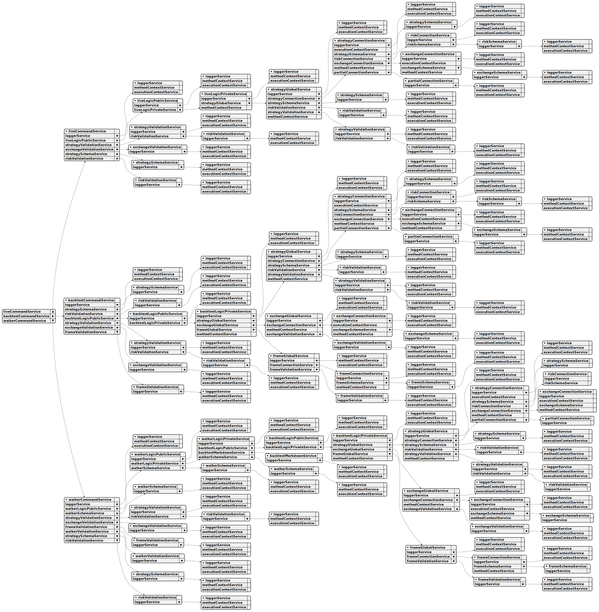

# backtest-kit api reference

**Overview:**

Backtest-kit is a production-ready TypeScript framework for backtesting and live trading strategies with crash-safe state persistence, signal validation, and memory-optimized architecture. The framework follows clean architecture principles with dependency injection, separation of concerns, and type-safe discriminated unions.

**Core Concepts:**

* **Signal Lifecycle:** Type-safe state machine (idle → opened → active → closed) with discriminated unions
* **Execution Modes:** Backtest mode (historical data) and Live mode (real-time with crash recovery)
* **VWAP Pricing:** Volume Weighted Average Price from last 5 1-minute candles for all entry/exit decisions
* **Signal Validation:** Comprehensive validation ensures TP/SL logic, positive prices, and valid timestamps
* **Interval Throttling:** Prevents signal spam with configurable intervals (1m, 3m, 5m, 15m, 30m, 1h)
* **Crash-Safe Persistence:** Atomic file writes with automatic state recovery for live trading
* **Async Generators:** Memory-efficient streaming for backtest and live execution
* **Accurate PNL:** Calculation with fees (0.1%) and slippage (0.1%) for realistic simulations
* **Event System:** Signal emitters for backtest/live/global signals, errors, and completion events
* **Graceful Shutdown:** Live.background() waits for open positions to close before stopping
* **Pluggable Persistence:** Custom adapters for Redis, MongoDB, or any storage backend

**Architecture Layers:**

* **Client Layer:** Pure business logic without DI (ClientStrategy, ClientExchange, ClientFrame) using prototype methods for memory efficiency
* **Service Layer:** DI-based services organized by responsibility:
  * **Schema Services:** Registry pattern for configuration with shallow validation (StrategySchemaService, ExchangeSchemaService, FrameSchemaService)
  * **Validation Services:** Runtime existence validation with memoization (StrategyValidationService, ExchangeValidationService, FrameValidationService)
  * **Connection Services:** Memoized client instance creators (StrategyConnectionService, ExchangeConnectionService, FrameConnectionService)
  * **Global Services:** Context wrappers for public API (StrategyGlobalService, ExchangeGlobalService, FrameGlobalService)
  * **Logic Services:** Async generator orchestration (BacktestLogicPrivateService, LiveLogicPrivateService)
  * **Markdown Services:** Auto-generated reports with tick-based event log (BacktestMarkdownService, LiveMarkdownService)
* **Persistence Layer:** Crash-safe atomic file writes with PersistSignalAdaper, extensible via PersistBase
* **Event Layer:** Subject-based emitters (signalEmitter, errorEmitter, doneEmitter) with queued async processing

**Key Design Patterns:**

* **Discriminated Unions:** Type-safe state machines without optional fields
* **Async Generators:** Stream results without memory accumulation, enable early termination
* **Dependency Injection:** Custom DI container with Symbol-based tokens
* **Memoization:** Client instances cached by schema name using functools-kit
* **Context Propagation:** Nested contexts using di-scoped (ExecutionContext + MethodContext)
* **Registry Pattern:** Schema services use ToolRegistry for configuration management
* **Singleshot Initialization:** One-time operations with cached promise results
* **Persist-and-Restart:** Stateless process design with disk-based state recovery
* **Pluggable Adapters:** PersistBase as base class for custom storage backends
* **Queued Processing:** Sequential event handling with functools-kit queued wrapper

**Data Flow (Backtest):**

1. User calls Backtest.background(symbol, context) or Backtest.run(symbol, context)
2. Validation services check strategyName, exchangeName, frameName existence
3. BacktestLogicPrivateService.run(symbol) creates async generator with yield
4. MethodContextService.runInContext sets strategyName, exchangeName, frameName
5. Loop through timeframes, call StrategyGlobalService.tick()
6. ExecutionContextService.runInContext sets symbol, when, backtest=true
7. ClientStrategy.tick() checks VWAP against TP/SL conditions
8. If opened: fetch candles and call ClientStrategy.backtest(candles)
9. Yield closed result and skip timeframes until closeTimestamp
10. Emit signals via signalEmitter, signalBacktestEmitter
11. On completion emit doneEmitter with { backtest: true, symbol, strategyName, exchangeName }

**Data Flow (Live):**

1. User calls Live.background(symbol, context) or Live.run(symbol, context)
2. Validation services check strategyName, exchangeName existence
3. LiveLogicPrivateService.run(symbol) creates infinite async generator with while(true)
4. MethodContextService.runInContext sets schema names
5. Loop: create when = new Date(), call StrategyGlobalService.tick()
6. ClientStrategy.waitForInit() loads persisted signal state from PersistSignalAdaper
7. ClientStrategy.tick() with interval throttling and validation
8. setPendingSignal() persists state via PersistSignalAdaper.writeSignalData()
9. Yield opened and closed results, sleep(TICK_TTL) between ticks
10. Emit signals via signalEmitter, signalLiveEmitter
11. On stop() call: wait for lastValue?.action === 'closed' before breaking loop (graceful shutdown)
12. On completion emit doneEmitter with { backtest: false, symbol, strategyName, exchangeName }

**Event System:**

* **Signal Events:** listenSignal, listenSignalBacktest, listenSignalLive for tick results (idle/opened/active/closed)
* **Error Events:** listenError for background execution errors (Live.background, Backtest.background)
* **Completion Events:** listenDone, listenDoneOnce for background execution completion with DoneContract
* **Queued Processing:** All listeners use queued wrapper from functools-kit for sequential async execution
* **Filter Predicates:** Once listeners (listenSignalOnce, listenDoneOnce) accept filter function for conditional triggering

**Performance Optimizations:**

* Memoization of client instances by schema name
* Prototype methods (not arrow functions) for memory efficiency
* Fast backtest method skips individual ticks
* Timeframe skipping after signal closes
* VWAP caching per tick/candle
* Async generators stream without array accumulation
* Interval throttling prevents excessive signal generation
* Singleshot initialization runs exactly once per instance
* LiveMarkdownService bounded queue (MAX_EVENTS = 25) prevents memory leaks
* Smart idle event replacement (only replaces if no open/active signals after last idle)

**Use Cases:**

* Algorithmic trading with backtest validation and live deployment
* Strategy research and hypothesis testing on historical data
* Signal generation with ML models or technical indicators
* Portfolio management tracking multiple strategies across symbols
* Educational projects for learning trading system architecture
* Event-driven trading bots with real-time notifications (Telegram, Discord, email)
* Multi-exchange trading with pluggable exchange adapters

**Test Coverage:**

The framework includes comprehensive unit tests using worker-testbed (tape-based testing):

* **exchange.test.mjs:** Tests exchange helper functions (getCandles, getAveragePrice, getDate, getMode, formatPrice, formatQuantity) with mock candle data and VWAP calculations
* **event.test.mjs:** Tests Live.background() execution and event listener system (listenSignalLive, listenSignalLiveOnce, listenDone, listenDoneOnce) for async coordination
* **validation.test.mjs:** Tests signal validation logic (valid long/short positions, invalid TP/SL relationships, negative price detection, timestamp validation) using listenError for error handling
* **pnl.test.mjs:** Tests PNL calculation accuracy with realistic fees (0.1%) and slippage (0.1%) simulation
* **backtest.test.mjs:** Tests Backtest.run() and Backtest.background() with signal lifecycle verification (idle → opened → active → closed), listenDone events, early termination, and all close reasons (take_profit, stop_loss, time_expired)
* **callbacks.test.mjs:** Tests strategy lifecycle callbacks (onOpen, onClose, onTimeframe) with correct parameter passing, backtest flag verification, and signal object integrity
* **report.test.mjs:** Tests markdown report generation (Backtest.getReport, Live.getReport) with statistics validation (win rate, average PNL, total PNL, closed signals count) and table formatting

All tests follow consistent patterns:
* Unique exchange/strategy/frame names per test to prevent cross-contamination
* Mock candle generator (getMockCandles.mjs) with forward timestamp progression
* createAwaiter from functools-kit for async coordination
* Background execution with Backtest.background() and event-driven completion detection

# backtest-kit interfaces

## Interface WalkerStopContract

This interface describes what happens when a walker, which is essentially a process executing a trading strategy, needs to be stopped. It’s a notification sent out when you intentionally halt a walker's operation.

The notification includes important details: the trading symbol involved (like "BTCUSDT"), the specific name of the strategy that's being stopped, and the name of the walker itself. This walker name allows you to target specific walkers if you’re running multiple trading processes at once on the same symbol. Think of it as a way to precisely control which trading activity gets paused.

## Interface WalkerStatisticsModel

The WalkerStatisticsModel helps organize and present the results of backtesting different trading strategies. It builds upon the basic WalkerResults, adding extra information to easily compare how various strategies performed. Think of it as a central place to see all the data needed to evaluate and contrast your trading approaches—specifically, it gathers the results for each strategy into a list you can examine. This list contains detailed information about each strategy's performance, making it simpler to identify strengths and weaknesses.

## Interface WalkerContract

The WalkerContract provides updates as your trading strategies are being compared during a backtest. Think of it as a progress report, letting you know when a particular strategy finishes its test run and how it performed.

Each update includes details like the name of the strategy, the exchange and frame being used, the asset being traded (the symbol), and a set of performance statistics. You'll also see a specific metric value the strategy achieved, which is used for optimization, along with the overall best metric seen so far.

The contract also tracks how many strategies have been tested and the total number of strategies planned for the comparison, giving you a sense of how much longer the process will take. Essentially, it helps you follow along and understand the ranking process of your strategies in real-time.

## Interface WalkerCompleteContract

This interface describes what's emitted when a backtesting process, known as a "walker," has finished running and all the results are ready. It packages together a lot of information about the completed test.

You'll find details like the name of the walker, the trading symbol it used, and the exchange and timeframe involved.

It also provides key performance indicators, telling you how many strategies were tested, which one performed the best, and what its metric score was. Finally, you'll get a breakdown of the statistics for that top-performing strategy, giving you a full picture of its performance.

## Interface ValidationErrorNotification

This notification lets you know when a problem occurred during risk validation – that's a crucial check to ensure your trading strategies are safe and reasonable. It pops up whenever a validation function encounters an error and stops. 

The notification includes several key pieces of information to help you understand what went wrong.  You'll find a unique ID for tracking, the full error object providing details about the issue, a human-readable message describing the problem, a timestamp to pinpoint when the error happened, and a flag to confirm that the error occurred during a backtest. Essentially, it’s your signal to investigate and fix the validation issue before deploying your trading strategy.

## Interface ValidateArgs

This interface, `ValidateArgs`, acts as a central blueprint for ensuring the names you use throughout your backtesting setup are correct. Think of it as a checklist to prevent typos or misconfigurations. 

It defines properties like `ExchangeName`, `FrameName`, `StrategyName`, and more, each expecting a type `T` which should be an enum. This means you're providing a set of allowed values for each, and the system will verify that the names you're using actually exist within those pre-defined lists. 

This helps to catch errors early on and make sure everything is referencing the intended entities in your backtest. For example, if you accidentally type "StratgeyName" instead of "StrategyName," the validation will flag it.

## Interface TickEvent

This data structure holds all the information about a single event during a backtest, like a trade being opened, closed, or simply being active.  It's designed to be a single source of truth for reporting on what happened during a backtest, regardless of the specific type of event. Each event has a timestamp, a type of action (idle, opened, active, or closed), and, depending on the action, details like the trading pair, signal ID, position type, and any notes associated with the signal.  For active trades, you'll find progress percentages towards the take profit and stop loss.  When a trade is closed, you’ll also see the P&L percentage and the reason for the closure, along with the trade's duration.

## Interface SignalScheduledNotification

This notification lets you know when a trading signal has been planned for execution at a later time. It’s useful for understanding when your strategies are setting up future trades.

The notification includes important details like a unique identifier for the signal (`id`), the exact time the signal was scheduled (`timestamp`), whether it's part of a backtest (`backtest`), and the specific asset involved (`symbol`).  You’ll also find information about the strategy and exchange that generated the signal (`strategyName`, `exchangeName`), along with the signal's own ID (`signalId`). 

It tells you whether the trade will be a buy (`position: "long"`) or a sell (`position: "short"`), the price the signal was based on (`priceOpen`), the time the trade is expected to happen (`scheduledAt`), and the current price of the asset at the time of scheduling (`currentPrice`).  Essentially, it's a heads-up about trades that are about to be executed based on your strategies' logic.

## Interface SignalOpenedNotification

This notification lets you know when a new trade has started within the backtest environment. It provides detailed information about the trade, including a unique identifier, the exact time it began, and whether it's part of a backtesting run. 

You’ll find specifics like the ticker symbol being traded, the name of the strategy that initiated the trade, and the exchange it's happening on. The notification also includes information about the position itself - whether it's a long or short trade - along with the opening price, take profit level, stop loss level, and any notes associated with the trade. Essentially, this notification gives you a full picture of what just happened in the trading system.

## Interface SignalData$1

This interface, `SignalData$1`, describes the data for a single, completed trading signal – the kind of information you'd find in a performance report or P&L table.  It holds key details about each signal, including the name of the strategy that created it and a unique ID to track it. You’ll find information about the asset being traded (`symbol`), whether it was a long or short position, and importantly, the profit or loss generated, expressed as a percentage.  It also records why the signal was closed and the precise timestamps of when the trade was opened and closed, allowing for a complete audit trail of the signal's lifecycle.

## Interface SignalClosedNotification

This notification lets you know when a trading position managed by a strategy has been closed, whether it was due to hitting a take profit or stop loss level. It provides a wealth of information about the closure, including a unique ID for the notification, the exact timestamp, and whether the closure happened during a backtest simulation. 

You'll also get details about the traded asset (symbol), the name of the strategy that made the trade, and the exchange used. The notification clearly indicates whether the position was a long or short trade, along with the opening and closing prices, profit and loss percentage, and the specific reason for closing the position. Finally, it includes the duration of the position and any notes added during the trading process.

## Interface SignalCancelledNotification

This notification lets you know when a signal that was planned to be executed has been cancelled. It provides detailed information about why and how the cancellation occurred. 

You’ll find the type of notification is always "signal.cancelled." Along with that, the notification includes the unique ID of the cancelled signal, the time it was cancelled, and whether it was related to a backtest.

It also provides context about the trade, including the symbol, strategy name, exchange, and the intended position (long or short).  You’ll also see the reason for cancellation and a unique ID linked to that action, plus the originally planned duration of the signal. This data helps you understand and debug situations where signals don't execute as expected.

## Interface ScheduleStatisticsModel

This model holds a collection of statistics related to how your scheduled signals are performing. It gives you a clear picture of how many signals you've scheduled, how many have been activated, and how many have been cancelled. You'll find details about each individual scheduled event in the `eventList` property.

The model also calculates important rates like the cancellation rate (how often signals are cancelled) and the activation rate (how often signals are activated), expressed as percentages. It provides averages, too – the average wait time before cancellation, and the average time it takes for a signal to activate. This information allows you to understand the efficiency of your scheduling strategy and identify areas for improvement.

## Interface ScheduledEvent

This interface brings together all the key details about scheduled, opened, and cancelled trading events into one place, making it much easier to generate reports and analyze performance. Each event, whether it’s planned, executed, or abandoned, will have a timestamp marking when it occurred. 

You’ll find information like the trading symbol, a unique signal ID, and the position type (like long or short).  There's also space to include a note related to the signal.

For events that are actually executed, you'll see the current market price and the planned entry, take profit, and stop-loss prices. If an event is cancelled, the reason for the cancellation (like a timeout, price rejection, or user action) and a unique cancellation ID are provided.  Finally, opened and cancelled events will have a duration field indicating how long they were active.

## Interface RiskStatisticsModel

This model holds statistical information about risk rejections, allowing you to monitor and analyze your risk management processes. It collects data from individual risk events, providing a detailed view of what's happening.

You’ll find a complete list of all the risk rejection events within the `eventList` property, each containing its specific details.  The `totalRejections` property simply counts how many times your risk controls have been triggered. To understand where the risk is originating, `bySymbol` shows you the rejection counts broken down by trading symbol, and `byStrategy` shows you the rejection counts broken down by the strategy used.

## Interface RiskRejectionNotification

This notification lets you know when a trading signal has been blocked by your risk management system. It’s triggered whenever a signal doesn't pass the defined risk checks.

The notification includes a unique ID and timestamp to help you track when the rejection occurred. It also specifies the symbol involved, the name of the strategy and exchange, and a detailed explanation of why the signal was rejected.

You'll find information about the current price of the asset, the number of active positions you have, and the details of the signal that was being considered. This allows you to understand the context of the risk rejection and adjust your strategy or risk rules accordingly.

## Interface RiskEvent

This data structure represents a risk rejection event, which happens when a trading signal is blocked due to risk management rules. Think of it as a record of why a potential trade didn't happen. 

It includes essential details like when the rejection occurred (timestamp), what trading pair was involved (symbol), the specifics of the signal that was blocked (pendingSignal), and the name of the strategy and exchange responsible. You’ll also find the time frame being used, the current market price at the time, and how many positions were already open.

A unique ID (rejectionId) helps track specific rejections, and a note (rejectionNote) explains the reason for the block. Finally, a flag indicates whether the event occurred during a backtest or live trading.

## Interface RiskContract

This describes what happens when a trading signal gets blocked because it violates your risk rules. It's a notification that a signal couldn't be executed, specifically due to a risk check failing.

You'll see information like which trading pair (symbol) the signal was for, the details of the signal itself (what position it would have opened, prices involved, etc.), and which trading strategy requested the signal. The framework also provides details about the backtest frame, the exchange involved, and the current market price at the time of the rejection.

Crucially, this notification includes *why* the signal was rejected, presented in a human-readable note. A unique ID is assigned to each rejection for tracking, and a timestamp records when it occurred. It will also tell you if this rejection happened during a backtest or in live trading. Think of it as a log of moments your risk management system stepped in to prevent a potentially problematic trade.

## Interface ProgressWalkerContract

This interface, `ProgressWalkerContract`, provides updates on the progress of a background task within backtest-kit. Think of it as a status report during a lengthy process, like analyzing many trading strategies. 

It tells you which walker, exchange, and frame are being used, along with the trading symbol involved. Crucially, it keeps you informed about how many strategies are being evaluated overall, how many have already been checked, and what percentage of the job is complete. This allows you to monitor the process and understand how long it might take to finish.

## Interface ProgressOptimizerContract

This contract helps you keep an eye on how your optimizer is doing while it's running. It provides updates on the overall job – how many data sources it needs to work through and how many it’s already finished. You'll also get a percentage representing the completion status, letting you know exactly how far along the optimizer is. The updates include the optimizer's name and the trading symbol it’s working with, so you can easily identify which optimization run is progressing.

## Interface ProgressBacktestNotification

This notification keeps you informed about how a backtest is progressing. It's sent during the backtesting process, giving you updates on its status. 

Each notification includes details like the exchange and strategy being tested, the specific trading symbol involved, and the total number of historical data points (frames) the backtest will analyze. You'll also see how many frames have already been processed, and a percentage representing the overall progress. The timestamp allows you to track the timing of the progress updates, and a unique ID can be helpful for correlating notifications.

## Interface ProgressBacktestContract

This contract provides updates on the backtesting process, letting you know how far along your strategy execution is. It gives you details like the exchange and strategy being used, the specific trading symbol, and important numbers like the total amount of data being processed and how much has already been handled. You'll also see a percentage representing the overall progress, ranging from 0% to 100%, so you can easily monitor the backtest's completion. Essentially, it's your window into the backtesting workflow.

## Interface PingContract

The `PingContract` helps you keep track of what’s happening with your scheduled trading signals. Think of it as a regular heartbeat signal sent every minute while a signal is actively being monitored – it's not sent when a signal is being activated or canceled.

It provides key details about each ping, including the trading symbol, the strategy name, the exchange, and all the signal data itself. You’ll also know if the ping is coming from a backtest (historical data) or a live trading situation.

You can use the `listenPing()` or `listenPingOnce()` functions to set up custom logic that responds to these ping events, like implementing special cancellation rules. The `timestamp` field tells you precisely when the ping occurred, either the real-time moment in live mode or the candle timestamp during backtesting.

## Interface PerformanceStatisticsModel

This model holds the overall performance data for a trading strategy. It bundles together key metrics like the strategy's name, the total number of events recorded, and the total time it took to run. 

You’ll find a breakdown of statistics for each individual metric type within the `metricStats` property, giving you a detailed view of how each aspect of the strategy performed.  Finally, the `events` property contains a complete list of the raw performance events that contributed to these aggregated statistics, allowing for deeper investigation if needed.

## Interface PerformanceContract

The PerformanceContract helps you understand how quickly your trading strategies are executing. It's like a detailed log of what’s happening behind the scenes during a backtest or live trade. Each entry in this contract records things like when an action happened, how long it took, and which strategy, exchange, and symbol were involved. 

You’ll find timestamps for each event, including the previous one to allow for measuring durations, along with information about what kind of operation was being performed. This data is invaluable for identifying slow spots in your code, optimizing performance, and ensuring a smooth trading experience. The `backtest` property indicates if the data comes from a backtest or live environment.

## Interface PartialStatisticsModel

This model holds information about the results of partial trades, specifically focusing on profit and loss events. Think of it as a snapshot of how frequently your trading strategy experiences gains and losses when taking partial positions. 

It keeps track of every individual profit and loss event, giving you a detailed history of how those partial trades played out. You’ll also find the overall count of all events, both profitable and losing, along with the simple totals of how many times you've seen profits and losses. This data helps you understand the risk profile and performance of strategies using partial exits.

## Interface PartialProfitNotification

This notification lets you know when a trading signal has reached a predefined profit milestone during a backtest or live trading. It's triggered when the signal achieves levels like 10%, 20%, or any other level you've configured. 

The notification includes a lot of helpful details, such as the signal’s unique ID, the exact timestamp of the event, and whether this occurred during a backtest. You'll also find information about the specific symbol being traded, the name of the strategy and exchange involved, and the current price, initial price, and the direction of the trade (long or short). The `level` property provides specific information about the profit level that was reached.

## Interface PartialProfitContract

This interface, `PartialProfitContract`, represents when a trading strategy hits a partial profit milestone, like reaching 10%, 20%, or 30% profit. It's used to track how well a strategy is performing and when it takes partial profits.

Each event provides detailed information – the trading pair involved, the name of the strategy that generated the signal, which exchange and frame it's running on, and the complete data about that signal. You'll also find the current market price at the time of the profit milestone, the specific profit level reached (like 50%), and a flag indicating whether it's from a backtest or live trading.  The timestamp tells you exactly when that milestone was achieved.

Essentially, it's a way to monitor and understand the progress of a trading strategy in a granular way, especially useful when strategies take partial profits along the way.  Services like the `PartialMarkdownService` use these events to build reports, and you can use them to create your own custom monitoring or feedback systems.

## Interface PartialLossNotification

This notification tells you when a trading signal has hit a loss level, like a 10% or 20% loss. It provides a lot of details about what triggered it, including the signal’s ID and the specific level of loss reached. You'll find information about the symbol being traded, the strategy and exchange involved, and the current price alongside the opening price. It also includes a timestamp and a flag indicating whether this occurred during a backtest. The `position` property tells you if it was a long or short trade.

## Interface PartialLossContract

The PartialLossContract describes notifications about when a trading strategy hits predefined loss levels, like a -10%, -20%, or -30% drawdown. Think of it as a way to track how much a strategy is losing and when it reaches those critical thresholds. These notifications are triggered when a signal experiences a loss milestone.

Each notification includes key details, such as the trading pair involved (symbol), the name of the strategy generating the signal, the exchange and frame being used, and the complete data associated with that signal. You'll also find the current market price at the time of the loss, the specific loss level reached (e.g., -20%), and whether it originated from a backtest or live trading session. A timestamp is also included to precisely identify when the loss level was detected.

The system ensures each level is only reported once per signal to avoid redundant notifications. It's a useful tool for monitoring strategy performance and understanding drawdown behavior, often used by reporting services or custom callbacks to react to significant losses.

## Interface PartialEvent

This interface, `PartialEvent`, is designed to hold key information about profit and loss milestones during trading, making it easier to generate reports.  Each event represents a point where either a profit or loss level was hit. It includes details like when the event occurred (timestamp), the type of event (profit or loss), the trading pair involved (symbol), the name of the strategy used, the signal ID that triggered the trade, the position held, the current market price, the level of profit/loss reached, and whether the trade happened during a backtest or live trading. Think of it as a snapshot of significant moments in a trade’s profitability journey.

## Interface MetricStats

This object holds a collection of statistics related to a specific performance measurement, like how long an order takes to fill. It tells you not just the average time, but also how much the times vary—you'll find things like the minimum, maximum, and standard deviation.  You can also see percentiles like the 95th and 99th, which show you the duration experienced by 95% and 99% of events, respectively. There's also information about the wait time between actions, which can be important for understanding overall system responsiveness. Essentially, it's a complete picture of how a particular metric behaves over time.

## Interface MessageModel

This describes the basic structure of a message used in conversations with a language model. Each message has a `role` which tells you who sent it - whether it’s instructions from the system, a question from the user, or a response from the language model itself.  The `content` property simply holds the actual text of the message.  This model helps keep track of the conversation flow and build prompts for the language model.

## Interface LiveStatisticsModel

This model keeps track of key statistics generated from your live trading activity, giving you a clear picture of how your strategy is performing. It collects information from every event – from idle periods to opened, active, and closed trades – allowing for detailed analysis. You'll find the complete history of events in the `eventList`, along with counts of total events, just closed trades, and wins versus losses.

Important performance metrics like win rate, average profit per trade (`avgPnl`), and total profit (`totalPnl`) are included, all presented as percentages. It also includes measures of risk, such as standard deviation (`stdDev`) and Sharpe Ratio, which helps to evaluate performance adjusted for risk. The annualized Sharpe Ratio provides a long-term perspective, while the certainty ratio gauges the consistency of winning and losing trades. Finally, the model estimates potential yearly returns based on trade duration and profitability. All numeric values may be null if the calculation isn't safe due to potential errors.

## Interface LiveDoneNotification

This notification signals that a live trading session has finished. You'll receive it after your automated trading strategy has run and concluded its live execution. 

The notification includes key details like a unique identifier for the trading run, a timestamp indicating when it ended, and confirmation that it was a live trade (not a backtest). It also provides information about the asset traded (symbol), the name of the trading strategy used, and the exchange where the trading took place. These properties help you track and analyze the results of your live trading activities.

## Interface IWalkerStrategyResult

This interface represents the outcome of running a single trading strategy within a backtest comparison. It holds essential information about the strategy itself, like its name, and provides key performance statistics generated during the backtest. You'll also find a calculated metric value, used to rank the strategy against others, and a numerical rank indicating its relative performance – with the best strategy getting a rank of 1. Essentially, it's a container for all the important results you need to evaluate a strategy’s backtest performance.

## Interface IWalkerSchema

The IWalkerSchema helps you set up A/B tests within the backtest-kit framework, allowing you to compare different trading strategies against each other. Think of it as a blueprint for defining how your strategies will be tested. 

You give it a unique name so the system knows which test setup you’re talking about, and can add a note for yourself. It specifies the exchange and timeframe (like 1-minute or 1-hour) that all the strategies in the test will use. 

The most important part is the `strategies` property, where you list the names of the strategies you want to compare - these must have been registered earlier in the process. You also choose a metric, like Sharpe Ratio, to determine which strategy performs best. Finally, you can add optional callbacks to monitor the testing process and respond to specific events.

## Interface IWalkerResults

The `IWalkerResults` interface holds all the information gathered after a backtest kit has run comparisons between different trading strategies. Think of it as a complete report card for your testing process. It tells you which asset, or "symbol," was being tested, which "exchange" was used to get the data, and the specific name of the "walker" – the automated process – that performed the backtesting. Finally, it identifies the "frame," which defines the timeframe (like daily, hourly, etc.) used for analyzing the strategies.

## Interface IWalkerCallbacks

This interface lets you hook into key moments during the backtesting process, giving you more control and visibility. You can use these callbacks to track the progress of each strategy as it's being tested, receive detailed statistics when a strategy finishes, and handle any errors that might occur during a backtest. Finally, a final callback lets you know when all the testing is complete and provides a summary of the overall results. Think of them as event listeners for the backtest engine, allowing you to customize what happens at different stages.

## Interface IStrategyTickResultScheduled

This interface describes what happens when your trading strategy generates a signal that needs to wait for a specific price to be reached before executing a trade. It’s essentially a notification that a signal has been scheduled, and the system is now monitoring the price.

The notification includes details like the name of the strategy that created the signal, the exchange and timeframe involved, the symbol being traded, the current price at the time the signal was scheduled, and whether the event occurred during a backtest or live trading. The signal itself is also included in the notification, providing all the information about the trade opportunity. This allows you to track and understand why a trade was placed, even if it didn't happen immediately.

## Interface IStrategyTickResultOpened

This interface describes what happens when a new trading signal is generated within your backtesting or live trading system. It's a notification letting you know that a signal has been created, validated, and saved.

You'll receive this notification with details like the name of the strategy that generated the signal, the exchange it’s for, the timeframe being used, and the symbol being traded.  It also provides the signal’s unique ID, the current price at the time the signal opened, and a flag indicating whether this event occurred during a backtest.  Essentially, it’s a record of a new signal being launched.

## Interface IStrategyTickResultIdle

This interface represents what happens when your trading strategy isn’t actively making decisions – it's in an idle state. It's basically a record of the market conditions at that moment, useful for observing when your strategy isn't taking action. You’ll find the name of the strategy, the exchange it's operating on, the timeframe being used, and the trading pair involved, all clearly labeled. The current price, recorded as a VWAP, provides a snapshot of the price when the strategy was idle. Finally, it indicates whether this idle event occurred during a backtest or in live trading.

## Interface IStrategyTickResultClosed

This interface, `IStrategyTickResultClosed`, represents what happens when a trading signal is closed, providing a complete picture of the outcome. It tells you definitively that a signal has been closed and includes all the key details surrounding that closure.

You'll find information like the original signal parameters, the final price used for calculations, and a clear explanation of *why* the signal was closed – whether it was due to a time limit expiring or a stop-loss/take-profit being triggered. 

Crucially, it provides a detailed profit and loss (PNL) breakdown, including any fees or slippage encountered. This result also includes tracking information like the strategy name, exchange, time frame, symbol, and whether the event occurred during a backtest or live trading. Essentially, it's a comprehensive record of a closed signal.

## Interface IStrategyTickResultCancelled

This interface describes what happens when a scheduled trading signal is cancelled – essentially, it didn’t lead to a trade being opened. This can occur if the signal was deactivated or a stop-loss was triggered before a position could be entered.

The result includes details about the cancelled signal itself, such as the price at the time of cancellation and the exact moment it happened. You'll also find information for tracking, like the strategy and exchange names, the timeframe being used, and the trading symbol. Importantly, it indicates whether this cancellation occurred during a backtest or in a live trading environment. 

Finally, the `reason` property specifies why the signal was cancelled, and an optional `cancelId` is available if the cancellation was explicitly requested by the user through a cancellation request.

## Interface IStrategyTickResultActive

This data represents a situation where a trading strategy is actively monitoring a signal, awaiting either a take profit (TP), stop loss (SL), or time expiration. It holds key information about the trade's status and context.

You'll find details like the name of the strategy being used, the exchange and timeframe involved, and the trading symbol. 

The `signal` property gives you the specifics of the signal that's triggering the active monitoring. 

Crucially, it tracks the progress toward both the take profit and stop loss levels as percentages.  The `backtest` flag tells you whether this active state is happening in a simulated backtest or a live trading environment.

## Interface IStrategySchema

This schema describes how a trading strategy is defined and registered within the backtest-kit framework. Think of it as a blueprint for how your strategy will generate trading signals.

Each strategy needs a unique name so the system can identify it. You can also add a note to explain what your strategy does.

The `interval` property controls how often your strategy can generate signals, preventing it from overwhelming the system.

The most important part is the `getSignal` function. This is where your strategy's logic lives, deciding whether to buy or sell. You can even use it to schedule a trade, waiting for a specific price to be reached.

You can also add optional callback functions, like `onOpen` and `onClose`, to be notified when a trade begins and ends.

Finally, you can associate your strategy with specific risk profiles using `riskName` and `riskList`, allowing for risk management integration.

## Interface IStrategyResult

This interface, `IStrategyResult`, is designed to represent the outcome of a trading strategy when you're comparing different approaches. Think of it as a single row in a comparison table showing how well a strategy performed. Each result contains the strategy’s name, a detailed breakdown of its performance statistics, and a key metric value used for ranking the strategies against each other. This metric value can be null if the strategy didn't produce valid results. Essentially, it bundles everything you need to understand and compare a single strategy's backtest performance.

## Interface IStrategyPnL

This interface represents the profit and loss (PnL) outcome for a trading strategy. It provides key details about the performance, including how much the strategy gained or lost as a percentage of its initial investment. 

The `priceOpen` shows the actual entry price used for the trade, taking into account both slippage (the difference between the expected and actual price) and trading fees (set at 0.1% in this framework). Similarly, `priceClose` reflects the exit price, also adjusted for slippage and fees, giving you a clear picture of the realized profit or loss per trade. This allows for a transparent view of the strategy's profitability after accounting for common trading costs.

## Interface IStrategyCallbacks

This interface lets you hook into key moments within your trading strategy’s lifecycle, giving you a way to react to what's happening. You can define functions to be triggered when a signal is opened, becomes active, goes idle, gets closed, is scheduled for later, or is canceled altogether.  

There's also a `onTick` callback that fires with every price update, allowing for constant monitoring.  Specific events like partial profits, partial losses, and reaching breakeven also have dedicated callbacks. Finally, `onPing` provides a regular heartbeat signal for performing custom checks, like determining if a signal needs to be cancelled. This is helpful for backtesting and real-time strategies alike.

## Interface IStrategy

This interface, `IStrategy`, outlines the core methods your trading strategies must implement within the backtest-kit framework. Think of it as a contract – it defines *what* your strategy needs to do, not *how* it should do it.

The `tick` method is the heart of the strategy, executed repeatedly as new price data arrives. It handles signal generation, checks for take profit (TP) and stop loss (SL) triggers, and generally manages the strategy's response to market movements.

`getPendingSignal` and `getScheduledSignal` provide ways to check for existing signals, crucial for monitoring TP/SL and expiration.  They essentially peek at the strategy's current plans.

`getBreakeven` helps determine if the price has moved enough to cover transaction costs, a key factor for setting a breakeven stop.

`getStopped` tells you if the strategy is paused.

`backtest` allows for quick simulations using historical data to evaluate performance.

`stop` pauses the strategy from generating new signals without closing existing positions – good for graceful shutdowns.

`cancel` lets you discard a scheduled signal without affecting the overall strategy's operation.

`partialProfit` and `partialLoss` handle taking partial profits or losses, useful for managing risk.

`trailingStop` dynamically adjusts your stop-loss to lock in profits.  It focuses on the *original* stop-loss distance to prevent errors.

`trailingTake` is similar to trailing stop, but manages your take-profit level, also based on the original distance.

Finally, `breakeven` automatically moves your stop-loss to the entry price once sufficient profit has been made, providing a layer of protection.

## Interface ISizingSchemaKelly

This schema defines how to calculate your position size using the Kelly Criterion. It’s a method for determining how much of your capital to risk on each trade based on expected returns. 

The `method` property is always set to "kelly-criterion" to indicate that this sizing approach is being used. 

The `kellyMultiplier` controls how aggressively you apply the Kelly Criterion; a lower value (like the default of 0.25, representing a "quarter Kelly") is generally considered more conservative and helps prevent excessive losses. A higher value risks more capital per trade for potentially greater gains, but also increases the potential for drawdown.

## Interface ISizingSchemaFixedPercentage

This schema defines a sizing strategy where you consistently risk a fixed percentage of your capital on each trade. 

The `method` property is always set to "fixed-percentage" to identify it as this particular sizing approach.  The crucial part is `riskPercentage`, which specifies the percentage of your portfolio you're willing to lose on any single trade – for example, a value of 1 would mean risking 1% of your capital. This ensures consistent risk management across your backtests.

## Interface ISizingSchemaBase

This interface, `ISizingSchemaBase`, serves as the foundation for defining how much of your account to allocate to each trade. It ensures consistency across different sizing strategies. 

You'll find key properties like `sizingName` for easy identification, a `note` field for helpful developer comments, and limits on position size – `maxPositionPercentage` (as a percentage of your total account), `minPositionSize`, and `maxPositionSize` (both in absolute units).

Finally, `callbacks` allow you to hook into different stages of the sizing process for customization and fine-tuning.

## Interface ISizingSchemaATR

This schema defines how your trading strategy sizes positions using the Average True Range (ATR) indicator. 

It tells the backtest-kit framework that you're using an ATR-based sizing approach. You'll need to specify a `riskPercentage`, which determines the maximum percentage of your capital you’re willing to risk on each trade – a value between 0 and 100.  Finally, `atrMultiplier` controls how the ATR value is used to determine the stop-loss distance, essentially scaling the stop-loss based on market volatility.

## Interface ISizingParamsKelly

This interface defines the parameters needed for using the Kelly Criterion to determine trade sizes within the backtest-kit framework. It's all about controlling how much of your capital gets allocated to each trade based on your expected returns and risk.

Specifically, you'll provide a logger object to help track what’s happening behind the scenes – think of it as a way to see debug information if you're troubleshooting or want to understand how sizing decisions are being made. The logger allows you to monitor the sizing process and potentially adjust parameters for better performance.

## Interface ISizingParamsFixedPercentage

This interface defines the parameters needed when you want to size your trades using a fixed percentage of your capital. It's specifically used when setting up how much of your funds you’ll risk on each trade.

You'll need to provide a logger, which helps you keep track of what's happening and debug any issues that might arise. Think of it as a way to monitor the sizing calculations.

## Interface ISizingParamsATR

This interface defines how to control trade sizing when using an ATR (Average True Range) based strategy. It primarily focuses on providing a way to log information related to the sizing process, helping you debug and understand how your trades are being sized. The `logger` property is crucial for getting visibility into the sizing calculations and ensuring everything behaves as expected. You'll use this logger to track trade sizes, ATR values, and any other relevant data during backtesting or live trading.

## Interface ISizingCallbacks

This interface defines functions that your trading strategies can use to react to changes in position sizing. Specifically, the `onCalculate` function is triggered after the backtest-kit determines how much to trade – it’s a perfect place to check if the calculated size makes sense for your strategy, or simply to keep a record of the sizing decisions being made. You can use this callback to log information or perform validations on the calculated quantity before it's used to execute trades.

## Interface ISizingCalculateParamsKelly

This interface defines the information needed to calculate your trade size using the Kelly Criterion. It's all about figuring out how much of your capital to risk based on your expected profitability.

You'll need to provide your win rate, expressed as a number between 0 and 1 (think of it as the percentage of times you win).  

Also crucial is your average win/loss ratio, which represents how much you typically win compared to how much you lose on each trade. These two values together help the system determine an optimal bet size to maximize long-term growth.

## Interface ISizingCalculateParamsFixedPercentage

This interface defines the parameters needed for calculating trade sizes using a fixed percentage approach. It's used when you want to risk a consistent percentage of your capital on each trade. The `method` property must be set to "fixed-percentage" to indicate you're using this sizing strategy.  You also provide a `priceStopLoss` which represents the price level at which your stop-loss order will be triggered, and is vital for determining the size of your position.

## Interface ISizingCalculateParamsBase

This interface defines the basic information needed when calculating how much to trade. It includes the trading symbol, like "BTCUSDT", so you know what asset you're dealing with. You'll also find the current account balance, which is essential for determining how much you can realistically trade, and the planned entry price, the price at which you intend to place your trade. These parameters form the foundation for more complex sizing calculations within the backtest-kit framework.

## Interface ISizingCalculateParamsATR

This interface defines the settings you'll use when determining your trade size based on the Average True Range (ATR). It's all about using ATR to help manage your risk.

You'll specify that you're using the "atr-based" sizing method.  Then, you'll provide the actual ATR value you've calculated – this number is key to figuring out how much to trade. Essentially, it’s a way to scale your position size according to market volatility.

## Interface ISizing

The `ISizing` interface is a core piece of backtest-kit, handling how much of an asset your strategy will trade. Think of it as the engine that determines your position sizes based on your risk tolerance and other factors. 

It has a single, crucial method: `calculate`.  This method takes in a set of parameters describing the current trading situation and returns a promise that resolves to the calculated position size – the number of shares or contracts you should trade. The strategy execution relies on this calculation to determine how much capital to allocate to each trade.

## Interface ISignalRow

An `ISignalRow` represents a complete trading signal that’s been validated and is ready to be used. It's the central data structure used throughout the backtest-kit framework.

Each signal has a unique identifier, assigned automatically, and includes key details like the entry price, the exchange and strategy used to generate it, and the timeframe it applies to. The `scheduledAt` property tells you exactly when the signal was first created, while `pendingAt` marks when the position became active.

The signal also stores the trading symbol (like "BTCUSDT") and an internal flag indicating whether it’s a scheduled signal.

For more complex strategies, you might see partial closes recorded; these track profits or losses taken during the position’s lifecycle, helping with accurate profit and loss calculations. 

Finally, if a strategy employs trailing stop-loss or take-profit orders, this signal includes dedicated fields (`_trailingPriceStopLoss`, `_trailingPriceTakeProfit`) that dynamically adjust those levels, replacing the initially defined values for execution purposes. These trailing values are automatically calculated and updated by the framework based on the strategy's logic.

## Interface ISignalDto

This interface, `ISignalDto`, defines the structure of data used to represent trading signals. Think of it as a blueprint for how signals are passed around within the backtest-kit framework. When you request a signal, you'll get an object conforming to this structure.

Each signal includes details like the trade direction (long or short), a descriptive note explaining the reasoning behind the signal, and the intended entry price. Critically, it also specifies take profit and stop-loss prices – these ensure the signal includes clear exit strategies. 

Additionally, a predicted duration for the signal is included, expressed in minutes. The framework will automatically assign a unique ID to each signal, unless you provide one yourself.

## Interface IScheduledSignalRow

This interface, `IScheduledSignalRow`, describes a signal that’s designed to be triggered later, when the price hits a specific level. Think of it as a signal that's "on hold" until a certain price is reached. It builds upon the basic `ISignalRow`, adding the concept of waiting for a specific price to activate.  When the price finally reaches the defined `priceOpen`, this row transforms into a regular pending signal, ready to execute.  Importantly, the time it initially waited is tracked; it's recorded as `scheduledAt` until it activates, then updated to reflect the actual time it started pending. The `priceOpen` property simply specifies the target price level the signal is waiting for.

## Interface IScheduledSignalCancelRow

This interface represents a scheduled trading signal that can be canceled by the user. It builds upon the standard scheduled signal information by adding a unique identifier, `cancelId`, that’s used specifically when a user wants to cancel a previously scheduled signal. Think of it as a way to track and manage user-initiated cancellations within your backtesting or trading system. If a signal wasn't directly canceled by the system but by a user action, it will have this `cancelId` attached.

## Interface IRiskValidationPayload

This data structure holds the information needed to evaluate risk during a trading backtest. It builds upon the `IRiskCheckArgs` and includes details about signals and current portfolio holdings. Specifically, it provides the pending signal that's about to be executed, the total number of open positions you currently have, and a list of those active positions, each with its own details. This allows your risk checks to consider the impact of new trades within the context of your existing portfolio.

## Interface IRiskValidationFn

This defines how you can check if a trading action is safe to execute. It's a function that receives information about a potential trade and determines if it's acceptable based on your risk rules. If everything looks good, the function doesn't do anything (or returns nothing). But if it finds a problem, it either provides a clear reason why the trade should be rejected, or raises an error that gets turned into a rejection reason.

## Interface IRiskValidation

This interface helps you define how to check if your trading strategies are behaving safely. Think of it as setting up rules to make sure your backtesting doesn't go off the rails. 

You specify a `validate` function, which is the core of your check - this function actually performs the risk assessment.  Alongside this, you can include a `note` – a simple description to explain what this specific validation rule does. This note makes it easier to understand the purpose of each check later on, especially when you have several validations in place.

## Interface IRiskSignalRow

This interface, `IRiskSignalRow`, helps manage risk during backtesting and live trading. It builds upon the standard signal data by adding key pricing details. Specifically, it includes the entry price (`priceOpen`), the initially set stop-loss price (`originalPriceStopLoss`), and the initially set take-profit price (`originalPriceTakeProfit`). These values are crucial for validating risk parameters and ensuring trades align with the original trading plan. Think of it as a record containing the original pricing intentions of a trade.

## Interface IRiskSchema

This defines a blueprint for setting up risk controls within your trading system. Think of it as a way to create personalized safety nets for your portfolio.

You’ll give each risk profile a unique name and can add notes for yourself to explain the purpose of the control. 

You have the flexibility to define specific callbacks that trigger when a trade is rejected or approved based on your risk rules. 

Most importantly, this allows you to create a list of custom validation functions that will be applied to your portfolio to ensure it stays within your defined risk boundaries.

## Interface IRiskRejectionResult

This interface, `IRiskRejectionResult`, helps you understand why a risk validation check failed. When a validation doesn't pass, you'll receive an object like this. It provides a unique `id` to track the specific rejection and a `note` offering a clear, human-readable explanation of the problem. Think of it as a friendly notification explaining why something didn't meet the required conditions.

## Interface IRiskParams

This interface, `IRiskParams`, defines the essential settings you provide when setting up the risk management system. It includes the name of the exchange you're working with, a logger for tracking what's happening, and a flag to indicate whether you're in backtesting or live trading mode.  Crucially, it also provides a callback function, `onRejected`, that gets triggered when a trading signal is blocked because it violates risk limits. This callback lets you handle these rejections, possibly by emitting events or performing other actions.

## Interface IRiskCheckArgs

This interface, `IRiskCheckArgs`, bundles the information needed to decide if a new trade should be allowed. Think of it as a safety check run *before* a trading signal is actually generated. It gathers details like the trading pair (`symbol`), the signal itself (`pendingSignal`), which strategy is requesting the trade (`strategyName`), the exchange being used (`exchangeName`), and the timeframe (`frameName`). You'll also find the current price (`currentPrice`) and the time of the request (`timestamp`) included to provide a full picture of the situation. Essentially, this allows you to validate conditions and potentially prevent unwanted trades.

## Interface IRiskCallbacks

This interface defines optional functions that your backtest can use to respond to risk-related events. Think of them as notification hooks that get triggered when the backtest evaluates risk. 

Specifically, `onRejected` is called whenever a trading signal is blocked because it exceeds pre-defined risk limits. Conversely, `onAllowed` is called when a signal successfully passes all risk checks and is deemed safe to execute. You can use these callbacks to log these events, adjust parameters, or take other actions based on the risk assessment.

## Interface IRiskActivePosition

This interface describes a position that a trading strategy holds, and which is being monitored for risk purposes. It helps to understand which strategy and exchange are responsible for a particular position. 

Each position record includes the name of the strategy that opened it, the exchange where it's located, and the exact time the position was initiated. This information allows for analysis across multiple strategies and exchanges to get a complete picture of risk exposure.

## Interface IRisk

The `IRisk` interface is your gatekeeper for ensuring trades align with your risk management rules. It lets you define and enforce limits on trading activity, preventing potentially harmful actions.

The `checkSignal` method is crucial; it's how you evaluate whether a trading signal is permissible based on your established risk parameters. Think of it as a pre-trade review.

To keep track of your exposure, `addSignal` registers when a new position is opened. Conversely, `removeSignal` informs the system when a position is closed, allowing for accurate risk assessment. These methods help maintain a real-time view of your risk profile.

## Interface IPublicSignalRow

The `IPublicSignalRow` interface helps you understand exactly what happened when a trading signal was initially created. It builds upon the standard signal information by including the original stop-loss and take-profit prices that were set when the signal was first generated.

Think of it like this: even if your stop-loss or take-profit levels are dynamically adjusted (perhaps through trailing stop functionality), this interface ensures you always have access to the starting point. 

It's primarily for displaying information to users, providing transparency about the initial trade parameters, alongside any adjustments that might have occurred.  The `originalPriceStopLoss` and `originalPriceTakeProfit` properties hold those initial values and won't change, allowing you to compare them to the currently active stop-loss and take-profit levels.

## Interface IPositionSizeKellyParams

This interface defines the parameters needed to calculate position sizes using the Kelly Criterion. It helps determine how much of your capital to allocate to a trade based on your expected win rate and the average ratio of your wins to your losses. You'll provide a win rate, expressed as a number between 0 and 1, and the average win/loss ratio you've observed. These values guide the framework in determining an appropriate position size for each trade.

## Interface IPositionSizeFixedPercentageParams

This interface defines the parameters needed for a trading strategy that uses a fixed percentage of your capital to size each trade, and includes a stop-loss price. The `priceStopLoss` property specifies the price at which you'll automatically exit the trade to limit potential losses – it’s a crucial part of risk management. You'll use this when setting up your backtest to control how much of your funds are allocated to a trade and where your stop-loss order will be placed.

## Interface IPositionSizeATRParams

This interface, `IPositionSizeATRParams`, defines the information needed when calculating your position size using the Average True Range (ATR) method. It's focused on the core ATR value itself.  You’ll provide a numerical value for `atr`, representing the current ATR reading, which the backtest kit will then use to determine how much of an asset to trade. Think of it as telling the system, “Here’s the volatility based on ATR.”

## Interface IPersistBase

This interface defines the fundamental operations for managing data persistence within the backtest-kit framework. Think of it as the foundation for saving and retrieving your trading data. 

It allows you to check if data exists, read it back, write new data, and list all available data keys. A key feature is a method to ensure the persistence directory is properly set up and validated when needed. The framework uses a special technique to guarantee these initial setup steps happen only once. All data storage interactions are designed to be reliable through atomic file writes.

## Interface IPartialData

This interface describes a snapshot of trading data that can be saved and later restored. Think of it as a way to preserve important information about a trade, like the profit and loss levels hit, so you don't lose progress.  It takes the sets of profit and loss levels, which are naturally used in the trading logic, and converts them into simple arrays. This conversion makes it easy to store this information in a standard format like JSON. The saved data is organized by a signal ID, letting you keep track of individual trades. When you reload this saved data, it's transformed back into the full trading state.

## Interface IPartial

The `IPartial` interface helps keep track of how trading signals are performing, specifically focusing on profit and loss milestones. It's used by components like `ClientPartial` and `PartialConnectionService`.

When a signal is making money, the `profit` method is used to determine if it has hit key levels like 10%, 20%, or 30% profit, and it triggers events to let other parts of the system know.  The same process happens with the `loss` method when a signal is losing money, identifying loss levels and sending out notifications. 

Finally, when a signal is finished – whether it hit a target, a stop-loss, or just expired – the `clear` method cleans up the signal's profit/loss record, removes it from memory, and saves the changes. This ensures that the system doesn’t hold onto unnecessary data.

## Interface IOptimizerTemplate

This interface, `IOptimizerTemplate`, is all about creating the building blocks for your backtesting code, especially when you're using Large Language Models (LLMs). Think of it as a set of tools for constructing the various pieces of your trading system – from the initial setup to the actual execution and even debugging.

It provides methods to generate code snippets for different components, like the top-level banner with necessary imports, user and assistant messages for interacting with LLMs, and configurations for Walkers, Exchanges, Frames (timeframes), and Strategies.  You'll also find helpers for creating debug output, generating text and JSON for LLM responses, and launching the entire process.  Each method essentially constructs code strings that you can then use to assemble a complete backtesting environment. It’s designed to simplify the process of creating and customizing your trading strategies with LLM assistance.

## Interface IOptimizerStrategy

This interface, `IOptimizerStrategy`, represents a complete trading strategy crafted with the help of an AI language model. Think of it as a package containing everything needed to understand how the strategy was created. It includes the trading symbol it's designed for, a unique name to identify it, and a detailed record of the conversation with the AI – including your prompts and the AI's responses. Crucially, it also holds the actual strategy logic itself, the text generated by the AI that outlines the trading rules. Essentially, it’s a self-contained explanation and definition of a generated strategy.

## Interface IOptimizerSourceFn

The `IOptimizerSourceFn` is essentially a function that provides the data needed to train and test different trading strategies. Think of it as a data pipeline specifically designed for optimization. It needs to be able to handle large datasets by fetching them in smaller chunks, or pages, and each piece of data needs a unique identifier so the system can keep track of it. This function is a key component for finding the best parameters for your trading algorithms.

## Interface IOptimizerSource

This interface describes where your backtest data comes from and how it's presented to a language model. Think of it as defining a data pipeline for your optimization process.

You'll give it a unique name to easily identify the data source within your backtest-kit setup.  You can also add a short description, just for clarity.

The most important part is the `fetch` function; this is what actually retrieves the backtest data, and it needs to handle fetching data in chunks using pagination.

Finally, you have the flexibility to customize how the data is formatted into user and assistant messages for the LLM. If you don’t provide custom formatting, the system will use a default approach.

## Interface IOptimizerSchema

This defines the blueprint for how optimizers are set up within the backtest-kit framework. Think of it as a recipe for creating and evaluating trading strategies.

It lets you give each optimizer a unique name for easy identification. You specify training periods, which will produce different versions of your strategy to compare against each other. There's also a dedicated testing period to see how well your strategies perform in a validation environment.

The optimizer pulls data from various sources, essentially feeding information into the system for strategy generation. A key part is the `getPrompt` function – this dynamically constructs the instructions used to create the trading strategy, based on the accumulated data.

You can customize the strategy generation process with a template, or rely on default settings. Finally, optional callbacks allow you to monitor the optimizer's progress and gather data during its execution.

## Interface IOptimizerRange

This interface helps you specify the time periods your trading strategies will be evaluated against. Think of it as defining the “window” of historical data you want to use for training or testing. You'll use `startDate` and `endDate` to set the beginning and end dates of this window, ensuring you’re focusing on the relevant data.  The optional `note` property allows you to add a descriptive label to the range, which can be useful for organization and understanding which period is being used.

## Interface IOptimizerParams

This interface, `IOptimizerParams`, defines the essential configuration needed to set up a ClientOptimizer. Think of it as the blueprint for creating an optimizer. It includes a `logger` so you can track what's happening during optimization and get helpful messages, and a `template` which combines your custom optimization settings with default behaviors to guide the optimization process. The optimizer connection service handles providing the logger, and the template is built from both your specified settings and some built-in defaults.

## Interface IOptimizerFilterArgs

This interface defines the information needed to retrieve data for backtesting – specifically, it outlines how to request data for a particular trading pair and a specific time period. Think of it as specifying which symbols and dates you want to analyze. You provide the symbol, like "BTCUSDT," along with a start and end date to define the data range you're interested in. This allows you to focus your backtesting on the data that's most relevant to your strategy.

## Interface IOptimizerFetchArgs

This interface defines the information needed to request data in chunks when you're working with large datasets. Think of it like fetching data from a database with pagination – you don't want to load everything at once! The `limit` property tells the system how many records to retrieve in a single request, with a default of 25. The `offset` property dictates how many records to skip before starting the fetch, enabling you to navigate through the data page by page.

## Interface IOptimizerData

This interface defines the basic structure for data used in optimization processes. Think of it as a common template for how data sources will present their information. The most important part is the `id` property – every data point needs a unique identifier. This ID helps the system avoid duplicates when dealing with large datasets, especially when retrieving data in chunks or pages. It ensures you're working with a clean and reliable set of information for your optimizations.

## Interface IOptimizerCallbacks

This interface lets you tap into what's happening behind the scenes during optimization runs. Think of it as a way to get notified about key steps and potentially check things along the way. 

You can use `onData` to see the strategies that are being created and maybe make sure they look right. `onCode` lets you inspect the generated code itself, perhaps for debugging or further processing.

If you're saving the generated strategies to a file, `onDump` will alert you when that's finished. Finally, `onSourceData` gives you visibility into the data being pulled from your data sources, allowing you to verify that the data looks as expected.

## Interface IOptimizer

The `IOptimizer` interface provides a way to interact with the backtest-kit framework for creating and exporting trading strategies.  Think of it as a tool to help automate the process of building your trading logic.  The `getData` method lets you retrieve information and build the foundation for your strategy, essentially preparing the groundwork.  Then, `getCode` constructs the full trading strategy code, putting everything together in a runnable format. Finally, `dump` takes that generated code and saves it directly to a file, organizing it neatly for you.

## Interface InfoErrorNotification

This notification lets you know about problems that pop up while things are running in the background, but aren't critical enough to stop the whole process. 

Think of it as a heads-up about something that needs attention.

Each notification includes a unique identifier (`id`) to help you track it, plus a timestamp so you know when it happened. You’ll also receive details about the error itself (`error` and `message`) and a flag (`backtest`) indicating whether the error occurred during a backtest. This structured information makes it easier to understand and address the issue.

## Interface IMethodContext

This interface, `IMethodContext`, provides essential information for routing operations within the backtest-kit framework. Think of it as a little packet of details passed along to tell the system *which* strategy, exchange, and frame to use for a particular task. It contains the names of the strategy, exchange, and frame schemas—basically, identifiers that link to the specific configurations needed. The `frameName` is especially important; if it's empty, it signifies that the operation is being run in live mode, not a backtest.

## Interface ILogger

The `ILogger` interface is your way to keep track of what’s happening inside the backtest-kit framework. It lets you record messages at different levels of importance—from general event logging to detailed debugging information. 

Think of it as a central place to note significant lifecycle events, like when components start up or encounter errors.

You can use it to understand agent behavior, monitor system operations, and review how policies are being applied. The `log`, `debug`, `info`, and `warn` methods provide different levels of detail for these records. `log` is for general messages, `debug` for development-focused details, `info` for successful operations, and `warn` for potential issues that need a closer look.

## Interface IHeatmapRow

This interface represents a row of data for a portfolio heatmap, focusing on the performance of a single trading symbol like BTCUSDT. It provides a comprehensive overview of how strategies performed on that symbol, combining various metrics. 

You'll find key indicators here, such as total profit or loss percentage, the Sharpe Ratio which measures risk-adjusted returns, and the maximum drawdown indicating potential peak-to-trough losses.  It also breaks down trading activity with details like the total number of trades, win/loss counts, and win rate.

Further details provide insights into individual trade performance with average profit/loss per trade, standard deviation, profit factor and average win/loss amounts. Finally, it shows the streaks of wins and losses and expectancy, which is a measure of long-term profitability.

## Interface IFrameSchema

The `IFrameSchema` describes a specific period and frequency for generating data during backtesting. Think of it as defining a "window" in time – when your backtest will start, when it will end, and how often data points (frames) will be created. Each frame schema needs a unique name so the system knows how to identify it. You can also add a note to help yourself remember what this frame represents. The `interval` property specifies how frequently data is generated (e.g., every minute, every hour, every day).  The `startDate` and `endDate` properties clearly mark the beginning and end dates of the backtest period.  Finally, you can attach optional lifecycle callbacks to be executed at various points within the frame’s processing.

## Interface IFrameParams

The `IFramesParams` interface defines the information needed to set up a trading frame within the backtest-kit framework. Think of a "frame" as a self-contained environment for running trading strategies.

It builds upon the `IFramesSchema` interface, and crucially, includes a `logger`.  This `logger` property is how you can get insights into what's happening internally within the frame as your strategies execute – it's essential for debugging and understanding performance. You'll pass an existing logger object when creating a `ClientFrame` instance.

## Interface IFrameCallbacks

This function gets triggered whenever a new set of timeframes is created within the backtest. Think of it as a notification letting you know that a batch of trading periods is ready to be used. You can use this opportunity to check if the timeframes look right, record some information about them, or do any other necessary setup before the backtest proceeds. It receives the array of dates defining the timeframe, the start and end dates of the entire backtest, and the interval used to create the timeframes.

## Interface IFrame

The `IFrames` interface is a core part of how backtest-kit handles time – it's how it figures out when to perform trading simulations. Think of it as the engine that creates the timeline for your backtesting. 

Its main function, `getTimeframe`, allows you to request a list of specific dates and times for a given trading symbol and timeframe (like "1m" for one-minute intervals or "1d" for daily).  This function promises to return an array of these timestamps, which are evenly spaced according to the interval you've defined for your backtest.  Essentially, it sets the stage for your backtesting process by establishing the sequence of moments in time you'll be analyzing.

## Interface IExecutionContext

The `IExecutionContext` object provides essential information to your trading strategies and exchange interactions during runtime. Think of it as a package of details passed along to help your code understand the current situation. It tells your strategy what trading pair it's working with, what the current timestamp is, and whether it's running a backtest (analyzing historical data) or a live trade. This object is managed by the ExecutionContextService and gives your code access to these parameters without needing to explicitly pass them around everywhere.

## Interface IExchangeSchema

This interface outlines the structure for defining how backtest-kit interacts with different cryptocurrency exchanges. Think of it as a blueprint for connecting to a data source and understanding its quirks.

Each exchange you want to use needs to be described using this schema, providing a unique identifier, a helpful note, and most importantly, instructions on how to retrieve historical price data (candles). It also dictates how quantities and prices should be formatted to adhere to the exchange's specific rules.

You'll provide functions to fetch candles, format trade quantities, and format prices accurately.  Optional callbacks allow you to react to events, like when new candle data arrives. Essentially, this schema brings external data into the backtesting environment in a consistent and understandable way.

## Interface IExchangeParams

This interface, `IExchangeParams`, is essentially a container for the information your exchange needs to function within the backtest-kit framework. Think of it as the initial setup instructions. It holds two key pieces: a logger, which allows you to track what’s happening during your backtesting process and get helpful debugging messages, and an execution context, providing crucial details about the environment, like which symbol you're trading, the timeframe you’re using, and whether you're in backtest mode. Providing these parameters ensures your exchange behaves correctly and integrates seamlessly with the backtest environment.

## Interface IExchangeCallbacks

This section describes callbacks you can use to react to events happening when your trading system interacts with an exchange. Specifically, `onCandleData` lets you know when new candlestick data – those familiar price charts – has been retrieved. You'll receive details like the symbol (e.g., BTC/USD), the time interval of the data (like 1 minute or 1 hour), the starting date and time for the data, the number of candles requested, and the actual data itself. This callback is helpful if you need to process or display this new candle data immediately.

## Interface IExchange

The `IExchange` interface defines how backtest-kit interacts with a simulated exchange. It gives you tools to retrieve historical and future price data, crucial for building and testing trading strategies.

You can request historical candle data using `getCandles`, and predict future prices with `getNextCandles`, which is especially helpful for backtesting. 

To ensure orders are placed correctly, `formatQuantity` and `formatPrice` handle converting quantities and prices to match the exchange's specific rules.

Finally, `getAveragePrice` lets you calculate a VWAP (Volume Weighted Average Price) based on recent trading activity, providing insights into the average price a security has traded at.

## Interface IEntity

This interface serves as the foundation for all data objects that are saved and retrieved within the backtest-kit framework. Think of it as the common blueprint for things like trades, orders, and account snapshots – anything that needs to be stored persistently. It ensures that every entity has a consistent structure, making it easier to work with and manage data across your backtesting projects. It's a crucial starting point for defining custom data types you want to track during your simulations.

## Interface ICandleData

This interface describes a single candlestick, the basic building block for analyzing price data. Each candlestick represents a specific time interval and contains information about the price action during that period. You'll find the exact time the candle started (`timestamp`), the opening price (`open`), the highest price reached (`high`), the lowest price seen (`low`), the closing price (`close`), and the total trading volume (`volume`) for that interval. It's a core data structure used for things like calculating VWAP and running backtests.

## Interface IBreakevenData

This interface, `IBreakevenData`, is designed to store information about whether a breakeven point has been achieved for a particular trading signal. It’s specifically created to be easily saved and loaded, even across different sessions, by converting the more complex breakeven state into a simple boolean value. Think of it as a snapshot of the breakeven status – a record of whether the goal has been met. The framework uses this data to persist the breakeven status for each signal and then brings it back to life when needed.

## Interface IBreakeven

This interface helps keep track of when a trade has reached a breakeven point – meaning the price has moved enough to cover any fees and potential losses. It's used by systems that want to automatically adjust stop-loss orders to breakeven once a trade is profitable enough.

The `check` method is responsible for figuring out if breakeven should be triggered, making sure it hasn't already happened, and verifying that the price movement is sufficient to cover costs. When it's triggered, it records that breakeven has been reached and alerts other parts of the system.

The `clear` method is used when a trade is finished, whether it hits a take-profit, stop-loss, or expires. It removes the breakeven tracking for that trade and cleans up related data.

## Interface HeatmapStatisticsModel

This structure holds the overall performance statistics for your entire portfolio when visualizing it as a heatmap. It breaks down key metrics, like total profit and loss (Pnl), the Sharpe Ratio (a measure of risk-adjusted return), and the total number of trades executed across all assets. You'll also find a list of individual symbol statistics, each represented in the `IHeatmapRow` format, allowing you to see how each asset contributed to the portfolio’s overall performance. The `totalSymbols` property simply tells you how many different assets are included in the calculation.

## Interface DoneContract

This interface tells you when a background task, like a backtest or a live trading process, has finished running. It provides key details about what just completed, such as the exchange used, the name of the strategy, and whether it was a backtest or live execution. You'll find information like the trading symbol involved, allowing you to easily identify the specific trade or scenario that finished. Think of it as a notification that confirms a process has reached its conclusion and provides context about what happened.

## Interface CriticalErrorNotification

This notification signals a serious, unrecoverable problem within the backtest-kit framework that demands the process be stopped immediately. It's your signal that something went critically wrong and requires investigation. 

The notification includes a unique identifier (`id`) to help track specific errors. You’ll also receive a detailed error object (`error`) and a descriptive message (`message`) to understand what happened. The `timestamp` provides the exact moment the error occurred, and the `backtest` flag confirms whether the error occurred during a backtesting simulation.

## Interface ColumnModel

This interface helps you define how your data should be presented in a table. Think of it as a blueprint for each column you want to display. 

Each column gets a unique identifier (`key`), a friendly name for the header (`label`), and a function (`format`) that transforms the underlying data into a readable string for the table.  You can even control whether a column should be shown at all using the `isVisible` function, which allows for dynamic column visibility. This setup is really flexible and lets you adapt the table to your specific needs and data types.

## Interface BreakevenStatisticsModel

This model holds information about breakeven points reached during a trading backtest. It essentially tracks how often and when breakeven levels were hit.

You'll find a detailed list of each breakeven event, including all the relevant data for each instance, stored in the `eventList` property. 

The `totalEvents` property provides a simple count of how many times a breakeven event occurred throughout the entire backtest.

## Interface BreakevenEvent

This event provides all the key details whenever a trading signal hits its breakeven point. Think of it as a notification that a trade has, at least temporarily, recouped its initial investment. 

You'll find the exact time of the breakeven, the trading symbol involved, the name of the strategy that generated the signal, and a unique identifier for the signal itself.  It also tells you whether the trade was part of a backtest or a live trade, and gives you both the entry price (the breakeven level) and the current market price at the time. This information is invaluable when analyzing the performance of your trading strategies and generating comprehensive reports.

## Interface BreakevenContract

The `BreakevenContract` represents a significant event in your trading strategy – when a signal's stop-loss is adjusted back to the original entry price. This usually happens when a trade has become profitable enough to cover the initial transaction costs and reduce the risk.

It’s a way to track how your strategy is managing risk and reaching milestones. Each signal can only trigger this event once, ensuring we don’t get duplicate notifications.

The contract provides key details: the trading symbol (`symbol`), the name of the strategy that generated the signal (`strategyName`), the exchange being used (`exchangeName`), and the timeframe the signal is operating within (`frameName`). You'll also find the full signal data (`data`), the current price at the time of the event (`currentPrice`), whether it occurred during a backtest or live trading (`backtest`), and a precise timestamp (`timestamp`). Think of the timestamp as marking either the moment the breakeven was set in live mode, or the candle that triggered it during a backtest.

## Interface BootstrapNotification

This notification signals that the system is ready to start tracking events. Think of it as the starting gun for the notification process. It’s sent out when the notification system is set up and confirms that tracking is about to begin. The notification includes a unique ID and a timestamp to help you keep track of when it occurred.

## Interface BacktestStatisticsModel

This model holds all the key statistical information gathered from a backtest run, giving you a complete picture of how your trading strategy performed. It includes a detailed list of every trade that was closed, along with important data like price and profit/loss.

You'll find the total number of trades, and a breakdown of how many were winners and losers.  From these, it calculates the win rate – the percentage of winning trades – and the average profit per trade.

The total profit across all trades is also provided, alongside measures of risk like standard deviation and the Sharpe Ratio, which helps to evaluate performance relative to risk. There’s even an annualized Sharpe Ratio for a better comparison over a year. Other useful metrics such as certainty ratio and expected yearly returns are included for even more comprehensive insights. Keep in mind that any value marked as "null" means the calculation couldn’t be reliably performed.

## Interface BacktestDoneNotification

This notification signals that a backtest has finished running. It’s sent when the backtesting process concludes, providing details about what just happened. You'll see the unique identifier for the backtest, the time it completed, and confirmation that it was indeed a backtest.  The notification also includes information such as the trading symbol, the name of the strategy that was tested, and the name of the exchange used. This information allows you to track and understand the results of your backtest runs.

