# Project Overview

<details>
<summary>Relevant source files</summary>

The following files were used as context for generating this wiki page:

- [.env.example](.env.example)
- [.gitignore](.gitignore)
- [README.md](README.md)
- [package.json](package.json)
- [tsconfig.json](tsconfig.json)

</details>


The **news-sentiment-ai-trader** is an automated trading system that leverages Large Language Models (LLMs) to perform sentiment analysis on real-time news data and execute trades based on qualitative market drivers. By integrating news retrieval, AI-driven forecasting, and a robust backtesting framework, the system attempts to capture market movements driven by macroeconomic events, geopolitical shifts, and sector-specific news.

## Purpose and Scope

The system is designed to bridge the gap between "Natural Language Space" (news articles, Fed announcements, social sentiment) and "Code Entity Space" (trade signals, price candles, order execution). It uses a "swarm" of AI agents to digest complex information into a structured `ForecastResponseContract`, which is then mapped to trading actions within the `backtest-kit` framework.

### Core Capabilities
*   **Automated News Retrieval**: Fetches and filters news using the Tavily API.
*   **AI Sentiment Engine**: Processes news and market data via Ollama to generate directional forecasts.
*   **Backtesting & Live Execution**: Supports both historical simulation and live trading modes with persistence and risk management.
*   **Strategy Case Studies**: Includes pre-configured strategies like `feb_2026_strategy` for performance benchmarking.

---

## High-Level System Workflow

The following diagram illustrates how news data is transformed into a financial position.

**Data Flow: News to Trade**

**Sources:** `logic/index.ts`, `content/feb_2026.strategy/feb_2026.strategy.ts`, `package.json` [13-31]()

---

## Major Components

The system is organized into three primary layers:

### 1. LLM Forecast Engine (`logic/`)
This module handles the intelligence of the system. It uses `agent-swarm-kit` to manage specialized advisors that provide the LLM with context. The engine produces a forecast containing a sentiment (bullish, bearish, or neutral), a confidence score, and a detailed reasoning string.
*   **Key Entities**: `TavilyNewsAdvisor`, `OllamaOutlineToolCompletion`, `ForecastResponseContract`.
*   **For details, see [LLM Forecast Engine (logic/)](./04-llm-forecast-engine-logic.md)**.

### 2. Trading Strategy (`content/`)
Strategies define how forecast data is translated into market positions. For example, the `feb_2026_strategy` maps LLM sentiment labels to LONG/SHORT signals and manages the position lifecycle using trailing take-profits and hard stop-losses.
*   **Key Entities**: `POSITION_LABEL_MAP`, `TRAILING_TAKE`, `HARD_STOP`.
*   **For details, see [Trading Strategy: feb_2026_strategy](./09-trading-strategy-feb-2026-strategy.md)**.

### 3. Execution Framework (`backtest-kit`)
The underlying engine that manages the signal state machine, backtesting logic, and exchange connectivity. It ensures that trades are executed according to the strategy's rules while preventing look-ahead bias during simulations.
*   **Key Entities**: `Backtest.run()`, `Live.background()`, `ccxt-exchange`.
*   **For details, see [backtest-kit Framework](./14-backtest-kit-framework.md)**.

---

## System Entity Mapping

This diagram maps the conceptual components to the specific code implementations and files.

**System Entity Map**

**Sources:** `tsconfig.json` [24-35](), `package.json` [14-21](), `README.md` [1-5]()

---

## Getting Started

To get the system running, you must configure environment variables for the AI services and use the `@backtest-kit/cli`.

1.  **Installation**: Clone the repository and install dependencies via `npm install`.
2.  **Configuration**: Rename `.env.example` to `.env` and provide your `OLLAMA_TOKEN` and `TAVILY_TOKEN` [ .env.example:1-3 ]().
3.  **Execution**: Run a backtest using the following command:
    ```bash
    npm start -- --backtest --symbol BTCUSDT \
      --strategy feb_2026_strategy \
      --exchange ccxt-exchange \
      --frame feb_2026_frame \
      ./content/feb_2026.strategy/feb_2026.strategy.ts
    ```
    [ README.md:88-94 ]()

**For a detailed step-by-step guide, see [Getting Started & Configuration](./02-getting-started-configuration.md).**

---

## Architecture Overview

The system follows a modular architecture where the forecasting logic is decoupled from the trading execution. This allows for swapping LLM models or news providers without modifying the core trading strategy.

*   **News Retrieval Layer**: Uses `fetchNews` with a 24-hour window to ensure only relevant information is processed.
*   **Signal State Machine**: Signals transition through states (idle -> scheduled -> active -> closed) managed by the `backtest-kit` core.
*   **Persistence**: Live trading state is persisted to `data/signals/` to allow for crash recovery.

**For a deep dive into the internal mechanics, see [System Architecture Overview](./03-system-architecture-overview.md).**