# Getting Started & Configuration

<details>
<summary>Relevant source files</summary>

The following files were used as context for generating this wiki page:

- [.env.example](.env.example)
- [docs/01-getting-started.md](docs/01-getting-started.md)
- [package.json](package.json)
- [tsconfig.json](tsconfig.json)

</details>


This page provides a comprehensive guide for setting up the **news-sentiment-ai-trader** codebase. It covers the installation of system requirements, environment configuration, and the initial execution of the trading system using the integrated CLI.

## System Requirements

The system relies on a modern JavaScript runtime and specific AI/search providers.

| Requirement | Version | Purpose |
|------------|---------|----------|
| **Node.js** | ≥15.0.0 | Core runtime for `backtest-kit` and `ccxt` [[docs/01-getting-started.md:27-27]](). |
| **TypeScript** | ^5.0.0 | Static typing and compilation [[docs/01-getting-started.md:28-28]](). |
| **Ollama** | ≥0.6.3 | Local LLM server for sentiment inference [[docs/01-getting-started.md:35-35]](). |
| **Tavily API** | - | Web search for real-time news retrieval [[package.json:19-19]](). |

**Sources:** [docs/01-getting-started.md:21-36](), [package.json:13-30]()

---

## Installation & Setup

### 1. Clone and Install Dependencies
The project uses `npm` to manage its dependencies, which include the `backtest-kit` framework and the `agent-swarm-kit` for LLM orchestration.

```bash
git clone https://gitlab.com/tpetrtadi-group/news-sentiment-ai-trader.git
cd news-sentiment-ai-trader
npm install
```

The core logic depends on several specialized packages defined in the manifest [[package.json:13-30]]():
- `@backtest-kit/cli`: Provides the command-line interface.
- `agent-swarm-kit`: Manages the multi-agent LLM forecasting logic.
- `ollama`: Interface for the local LLM.
- `ccxt`: Handles exchange connectivity for market data.

### 2. Environment Configuration
The system requires two primary API tokens to function. Copy the example environment file and populate it with your credentials:

```bash
cp .env.example .env
```

**Required Variables [[.env.example:1-2]]():**
- `OLLAMA_TOKEN`: Token for authenticating with your Ollama instance (if required by your setup).
- `TAVILY_TOKEN`: API key from [Tavily](https://tavily.com/) for news search capabilities.

### 3. TypeScript Configuration
The project is configured to use `ESNext` modules with path mapping for the `logic/` and `utils/` directories to simplify imports [[tsconfig.json:13-29]]().

**Sources:** [package.json:1-31](), [.env.example:1-3](), [tsconfig.json:1-36]()

---

## Data Flow: Initialization to Execution

The following diagram illustrates the transition from environment configuration to the internal code entities that manage the system startup.

### Configuration to Code Entity Mapping
"The diagram below bridges the environment variables and configuration files to the internal `backtest-kit` initialization sequence."



**Sources:** [docs/01-getting-started.md:151-173](), [package.json:7-7](), [tsconfig.json:24-29]()

---

## Running the System

### CLI Execution
The system is started via the `@backtest-kit/cli` package, which is mapped to the `start` script in `package.json` [[package.json:7-7]]().

```bash
npm start
```

### Framework Initialization Sequence
When the system starts, it performs several critical steps via the `backtest-kit` framework:

1.  **Logger Setup**: The framework requires a logger implementation to be set via `setLogger` to output operational data [[docs/01-getting-started.md:139-147]]().
2.  **Global Configuration**: Parameters such as `CC_PERCENT_FEE` and `CC_SCHEDULE_AWAIT_MINUTES` are applied to the `GLOBAL_CONFIG` [[docs/01-getting-started.md:158-173]]().
3.  **Dependency Injection**: Over 75 services are wired together using `di-kit` and `di-scoped`, managing the lifecycle of news fetchers, LLM clients, and backtesting engines [[docs/01-getting-started.md:198-202]]().

### Component Interaction Diagram
"This diagram maps the system's runtime components to their respective code modules during a typical execution cycle."



**Sources:** [docs/01-getting-started.md:12-17](), [package.json:14-21](), [docs/01-getting-started.md:198-202]()

---

## Verification
To ensure the environment is correctly configured, you can verify the framework initialization with a minimal script:

```typescript
import { getDefaultConfig, setLogger } from 'backtest-kit';

// Verify Logger
setLogger({
  log: (topic, ...args) => console.log(topic, args),
  debug: () => {},
  info: () => {},
  warn: () => {},
});

// Verify Configuration
const config = getDefaultConfig();
console.log('Parameters loaded:', Object.keys(config).length);
```

**Expected Result:** The console should indicate that 14 default parameters have been loaded [[docs/01-getting-started.md:223-243]]().

**Sources:** [docs/01-getting-started.md:208-243]()