# System Architecture Overview

The **news-sentiment-ai-trader** is built on a three-layer architecture that bridges high-level natural language processing with low-level market execution. The system leverages Large Language Models (LLMs) to interpret financial news and translate qualitative sentiment into quantitative trading signals.

## Three-Layer Architecture

The system's modular design separates concerns into three distinct domains:

1.  **News Retrieval Layer**: Utilizes the **Tavily API** to fetch real-time or historical news. It acts as the primary data source for the AI's "worldview" [logic/fetchNews.ts:1-5]().
2.  **LLM Forecast Engine**: Orchestrated by `agent-swarm-kit` and powered by **Ollama**. This layer transforms raw news text and market candle data into a structured `ForecastResponseContract` [logic/forecast.outline.ts:12-25]().
3.  **Trading Execution Framework**: Powered by the **backtest-kit** library. This layer manages the lifecycle of trading signals, handles position state transitions, and calculates PNL [docs/01-getting-started.md:10-18]().

### High-Level Data Flow

The following diagram illustrates the transformation of data from a news event to a finalized trade execution.

**Figure 1: News-to-Trade Data Flow**

**Sources:** [logic/fetchNews.ts:1-5](), [logic/forecast.outline.ts:12-25](), [docs/01-getting-started.md:10-18]()

---

## Technical Implementation & Components

### 1. LLM Inference Pipeline
The inference pipeline is defined in the `logic/` directory. It uses a "Russian macro-analyst" persona to evaluate news [logic/forecast.outline.ts:1-10](). The core logic is encapsulated in the `addOutline` registration, which binds the LLM to specific "Advisors" (data providers).

*   **TavilyNewsAdvisor**: Fetches news within a specific `NEWS_WINDOW` (typically 24 hours) [README.md:5-6]().
*   **Ollama Integration**: Supports both tool-call mode (`OllamaOutlineToolCompletion`) and structured JSON mode (`OllamaOutlineFormatCompletion`) to ensure the LLM returns valid, parseable data [docs/01-getting-started.md:35-36]().

### 2. Trading Strategy: feb_2026_strategy
The strategy acts as the glue between the LLM output and the execution engine. It maps LLM sentiment labels (bullish, bearish, sideways) to trading directions [README.md:3-5]().

| LLM Sentiment | Trade Signal | Execution Action |
| :--- | :--- | :--- |
| `bullish` | `LONG` | Open long position at next candle |
| `bearish` | `SHORT` | Open short position at next candle |
| `sideways` / `neutral` | `WAIT` | Close existing or stay idle |

### 3. Execution Engine (backtest-kit)
The `backtest-kit` framework provides the state machine for signals. A signal transitions through the following states: `idle` → `scheduled` → `opened` → `active` → `closed` [docs/01-getting-started.md:179-182]().

**Sources:** [logic/forecast.outline.ts:1-10](), [README.md:3-6](), [docs/01-getting-started.md:35-36](), [docs/01-getting-started.md:179-182]()

---

## Code Entity Mapping

The following diagrams bridge the gap between abstract system concepts and concrete code entities.

### Natural Language Space to Code Entity Space

**Figure 2: Component-to-Code Mapping**

**Sources:** [README.md:3-5](), [logic/fetchNews.ts:1-5](), [docs/01-getting-started.md:230-233]()

### Execution Engine Architecture

**Figure 3: backtest-kit Internal Structure**

**Sources:** [docs/01-getting-started.md:226-233](), [docs/01-getting-started.md:139-147](), [README.md:88-94]()

---

## Data Flow: News → Forecast → Signal → Trade

The transformation process is strictly sequential to prevent look-ahead bias during backtesting:

1.  **Retrieval**: `TavilyNewsAdvisor` queries the API. In backtest mode, it uses a file-based cache to simulate historical news availability [README.md:5-6]().
2.  **Forecasting**: The LLM processes the news alongside OHLCV data from `StockData1mAdvisor`. It outputs a `reasoning` string and a `sentiment` score [logic/forecast.outline.ts:12-25]().
3.  **Signal Mapping**: The strategy script (e.g., `feb_2026_strategy.ts`) receives the forecast. If the confidence exceeds thresholds and the sentiment has flipped, a new signal is emitted [README.md:36-37]().
4.  **Execution**: The `Backtest` engine picks up the signal, validates it against risk rules (like `CC_MAX_STOPLOSS_DISTANCE_PERCENT`), and executes the trade at the opening price of the next minute candle [docs/01-getting-started.md:185-186]().

**Sources:** [README.md:5-6](), [logic/forecast.outline.ts:12-25](), [README.md:36-37](), [docs/01-getting-started.md:185-186]()