# LLM Forecast Engine (logic/)

The `logic/` module serves as the AI-powered forecasting subsystem of the project. It is responsible for transforming raw external data—specifically news headlines and technical market candles—into structured trading signals. It leverages the `agent-swarm-kit` framework to orchestrate LLM completions, tool usage, and data retrieval.

The engine follows a structured pipeline: it gathers context via specialized "Advisors," processes that context through a specific "Outline" (prompt template), and executes the inference using "Ollama" completion implementations.

### System Architecture

The forecasting logic is initialized via `logic/index.ts`, which sets up configurations and imports the core components [logic/index.ts:1-4](). The main entry point for the rest of the application is the `forecast` function, which triggers the AI pipeline for a specific symbol and timestamp [logic/main/forecast.ts:5-11]().

#### Forecast Data Flow
The following diagram illustrates how the `logic/` module bridges the gap between natural language data (news) and structured code entities (forecast objects).

**Natural Language to Code Entity Mapping**

Sources: [logic/main/forecast.ts:5-11](), [logic/core/index.ts:1-8]()

---

### Core Components

The engine is organized into four primary functional areas, each handled by specialized sub-modules registered in the core index [logic/core/index.ts:1-8]().

#### 1. Forecast Pipeline & Outline
The pipeline is governed by the `ForecastOutline`. This component defines the "Persona" (a Russian macro-analyst), the input requirements, and the strict `ForecastResponseContract` that the LLM must adhere to. It ensures that the output includes a sentiment (bullish/bearish/neutral), a confidence score, and detailed reasoning.

For details, see [Forecast Pipeline & Outline](./05-forecast-pipeline-outline.md).

#### 2. Advisors: News & Market Data
Advisors are the "eyes" of the LLM. The system registers three distinct advisors via `agent-swarm-kit` to provide multi-modal context:
*   **TavilyNewsAdvisor**: Fetches filtered news relevant to the asset.
*   **StockData1mAdvisor**: Provides 240 minutes of high-resolution 1-minute candles.
*   **StockData15mAdvisor**: Provides a broader view with 32 15-minute candles.

For details, see [Advisors: News & Market Data](./06-advisors-news-market-data.md).

#### 3. News Fetching & Caching
The `fetchNews` utility is the backbone of the news advisor. It manages the integration with the Tavily API, applies domain blacklists/whitelists, and enforces a 24-hour `NEWS_WINDOW`. Crucially, it includes a file-based caching mechanism to ensure backtests are deterministic and free from look-ahead bias.

For details, see [News Fetching & Caching (fetchNews)](./07-news-fetching-caching-fetchnews.md).

#### 4. Ollama Completions
The engine supports two methods of interacting with the Ollama inference server:
*   **Tool-based**: Using `OllamaOutlineToolCompletion` for models that support function calling.
*   **Format-based**: Using `OllamaOutlineFormatCompletion` for structured JSON output.
These implementations handle the low-level communication, retries, and JSON repair logic required to maintain system stability.

For details, see [Ollama Completions](./08-ollama-completions.md).

---

### Logic Module Structure
The `logic/core/index.ts` file acts as the registry for all AI capabilities, ensuring that when `forecast()` is called, all necessary advisors and completion methods are available in the runtime environment.

**Internal Logic Registry**

Sources: [logic/core/index.ts:1-8](), [logic/index.ts:1-4]()