# Forecast Pipeline & Outline

The Forecast Pipeline is the core intelligence layer of the system, responsible for transforming unstructured news data into structured market sentiment analysis. It utilizes a specialized LLM "Outline" that acts as a Russian macro-analyst to evaluate geopolitical and economic events.

## Pipeline Overview

The pipeline is initiated via the `forecast` function, which calls the `ForecastOutline` using the `agent-swarm-kit` framework. The process follows a strict sequence: gathering news, establishing temporal context, applying a persona-driven prompt, and validating the structured output against a predefined contract.

### Forecast Execution Flow

The following diagram illustrates the transition from the high-level `forecast` call to the internal registration and execution of the `ForecastOutline`.

**Diagram: Forecast Execution Logic**

---

## The Forecast Outline Configuration

The `ForecastOutline` is registered using `addOutline<ForecastResponseContract>`. It defines how the LLM should be prompted, which tools it uses, and how the output is structured.

### 1. Macro-Analyst Persona (`FORECAST_PROMPT`)
The system instructs the LLM to behave as a macro-market analyst. The prompt enforces several heuristic rules:
*   **Weighting:** Major events (regulations, macro-stats) outweigh minor noise.
*   **Dominance:** In the case of contradictory news, the LLM must identify the "dominant force".
*   **Sentiment Categories:** The analyst must choose exactly one from `bullish`, `bearish`, `neutral`, or `sideways`.

### 2. Context Injection (`getOutlineHistory`)
Before the prompt is sent, the system prepares the conversation history:
*   **Temporal Context:** Injects the current UTC date and time and the asset name (e.g., "Bitcoin" for BTCUSDT).
*   **News Retrieval:** The `commitGlobalNews` function is invoked. It queries the `TavilyNewsAdvisor` for the last 24 hours of global news.
*   **Acknowledge Pattern:** The news is pushed to history with a user role, and the assistant is forced to respond with "OK" to acknowledge the data before the final prompt is issued.

---

## Output Schema & Validation

The pipeline ensures high-quality signals by enforcing a strict JSON schema and secondary validation rules.

### ForecastResponseContract
The LLM must return an object conforming to the following structure:

| Property | Type | Allowed Values | Description |
| :--- | :--- | :--- | :--- |
| `sentiment` | `string` | `bullish`, `bearish`, `neutral`, `sideways` | The primary market direction based on news. |
| `confidence` | `string` | `reliable`, `not_reliable` | Whether the news background is clear or contradictory. |
| `reasoning` | `string` | N/A | Explanation of which news events drove the decision. |

### Validation Rules
After the LLM generates a response, it passes through a `validations` array. These rules act as a guardrail:
1.  **Sentiment Check:** Ensures the value is within the allowed enum.
2.  **Confidence Check:** Ensures the confidence level is valid.
3.  **Reasoning Check:** Rejects the forecast if the `reasoning` field is empty.

---

## Data Flow & Persistence

Once a forecast is validated, it is automatically persisted for debugging and backtesting purposes.

**Diagram: Forecast Data Flow**

The `onValidDocument` callback uses `dumpOutlineResult` to save the successful forecast to the local file system at `./dump/outline/forecast`. This allows developers to inspect the LLM's reasoning for specific trades after the fact.
